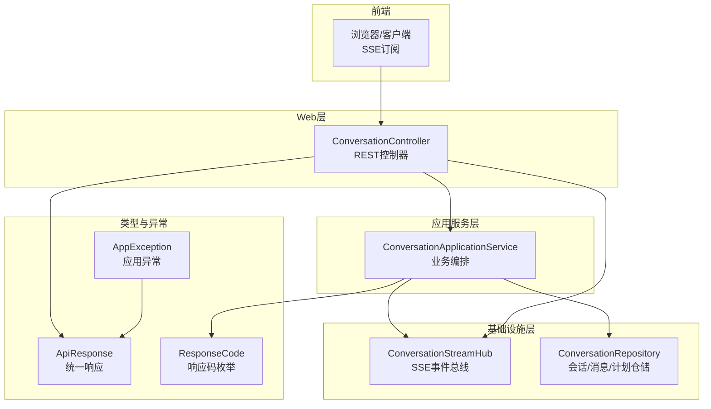
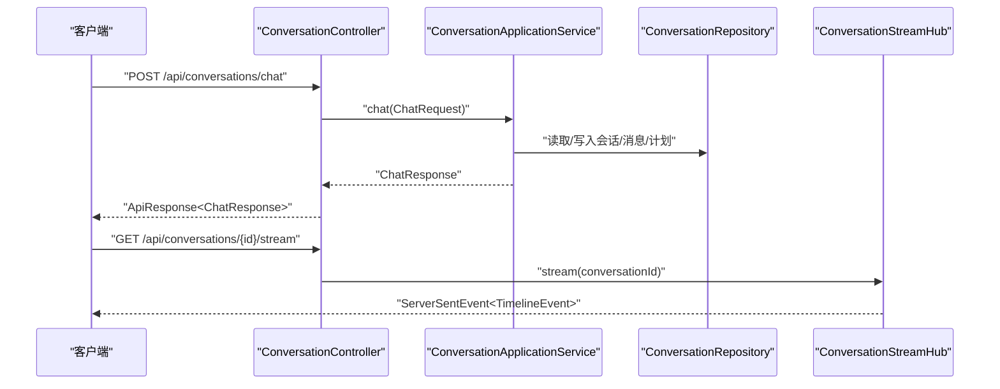
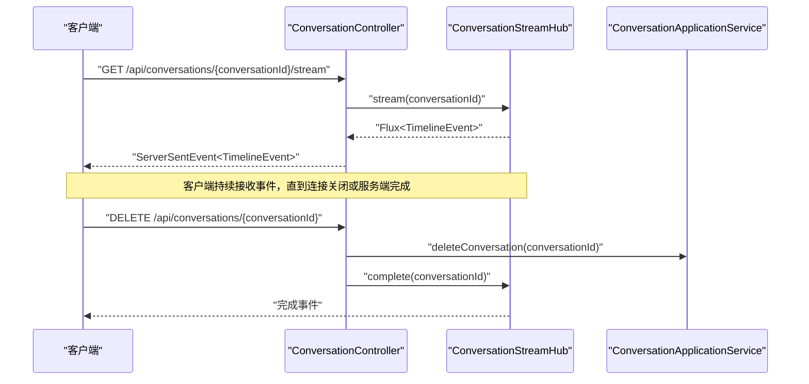
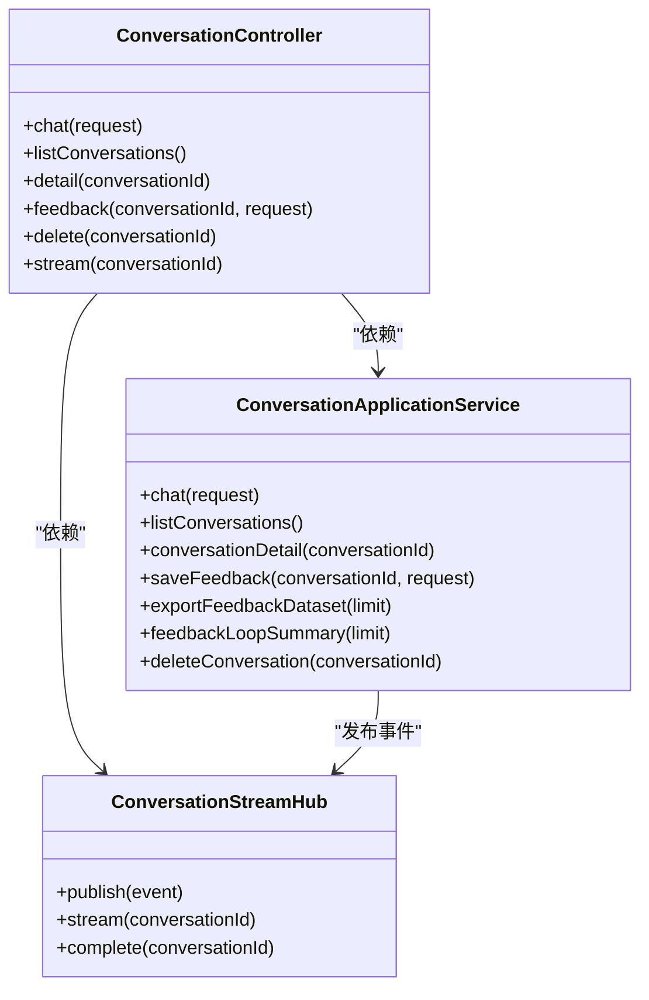

# API参考文档

<cite>
**本文档引用的文件**
- [ConversationController.java](file://travel-agent-app/src/main/java/com/travalagent/app/controller/ConversationController.java)
- [ConversationApplicationService.java](file://travel-agent-app/src/main/java/com/travalagent/app/service/ConversationApplicationService.java)
- [ConversationStreamHub.java](file://travel-agent-app/src/main/java/com/travalagent/app/stream/ConversationStreamHub.java)
- [ChatRequest.java](file://travel-agent-app/src/main/java/com/travalagent/app/dto/ChatRequest.java)
- [ChatResponse.java](file://travel-agent-app/src/main/java/com/travalagent/app/dto/ChatResponse.java)
- [ConversationDetailResponse.java](file://travel-agent-app/src/main/java/com/travalagent/app/dto/ConversationDetailResponse.java)
- [ChatImageAttachmentRequest.java](file://travel-agent-app/src/main/java/com/travalagent/app/dto/ChatImageAttachmentRequest.java)
- [ConversationFeedbackRequest.java](file://travel-agent-app/src/main/java/com/travalagent/app/dto/ConversationFeedbackRequest.java)
- [FeedbackDatasetRecord.java](file://travel-agent-app/src/main/java/com/travalagent/app/dto/FeedbackDatasetRecord.java)
- [FeedbackLoopSummaryResponse.java](file://travel-agent-app/src/main/java/com/travalagent/app/dto/FeedbackLoopSummaryResponse.java)
- [ApiResponse.java](file://travel-agent-types/src/main/java/com/travalagent/types/response/ApiResponse.java)
- [ResponseCode.java](file://travel-agent-types/src/main/java/com/travalagent/types/enums/ResponseCode.java)
- [AppException.java](file://travel-agent-types/src/main/java/com/travalagent/types/exception/AppException.java)
- [GlobalExceptionHandler.java](file://travel-agent-app/src/main/java/com/travalagent/app/controller/GlobalExceptionHandler.java)
- [api.ts](file://web/src/types/api.ts)
</cite>

## 目录
1. [简介](#简介)
2. [项目结构](#项目结构)
3. [核心组件](#核心组件)
4. [架构总览](#架构总览)
5. [详细组件分析](#详细组件分析)
6. [依赖关系分析](#依赖关系分析)
7. [性能考虑](#性能考虑)
8. [故障排除指南](#故障排除指南)
9. [结论](#结论)
10. [附录](#附录)

## 简介
本文件为TravelAgent系统的完整API参考文档，覆盖会话管理与聊天交互、SSE流式传输、数据传输对象（DTO）规范、认证机制、错误码定义、速率限制与版本控制等API规范。文档面向后端开发者与前端集成人员，帮助快速理解REST端点、请求/响应格式与调用流程。

## 项目结构
TravelAgent采用分层架构：Web控制器负责暴露REST端点；应用服务编排业务流程；领域模型与仓库负责数据持久化；类型模块提供统一响应与错误码；前端通过SSE订阅实时事件。

图表来源
- [ConversationController.java:32-100](file://travel-agent-app/src/main/java/com/travalagent/app/controller/ConversationController.java#L32-L100)
- [ConversationApplicationService.java:34-50](file://travel-agent-app/src/main/java/com/travalagent/app/service/ConversationApplicationService.java#L34-L50)
- [ConversationStreamHub.java:11-32](file://travel-agent-app/src/main/java/com/travalagent/app/stream/ConversationStreamHub.java#L11-L32)
- [ApiResponse.java:5-14](file://travel-agent-types/src/main/java/com/travalagent/types/response/ApiResponse.java#L5-L14)
- [ResponseCode.java:3-6](file://travel-agent-types/src/main/java/com/travalagent/types/enums/ResponseCode.java#L3-L6)

章节来源
- [ConversationController.java:32-100](file://travel-agent-app/src/main/java/com/travalagent/app/controller/ConversationController.java#L32-L100)
- [ConversationApplicationService.java:34-50](file://travel-agent-app/src/main/java/com/travalagent/app/service/ConversationApplicationService.java#L34-L50)
- [ConversationStreamHub.java:11-32](file://travel-agent-app/src/main/java/com/travalagent/app/stream/ConversationStreamHub.java#L11-L32)
- [ApiResponse.java:5-14](file://travel-agent-types/src/main/java/com/travalagent/types/response/ApiResponse.java#L5-L14)
- [ResponseCode.java:3-6](file://travel-agent-types/src/main/java/com/travalagent/types/enums/ResponseCode.java#L3-L6)

## 核心组件
- REST控制器：提供会话列表、详情、反馈、删除以及SSE流端点。
- 应用服务：封装聊天执行、会话详情聚合、反馈保存与导出、摘要统计、会话删除等业务逻辑。
- SSE事件总线：基于Reactor Sink维护每个会话的事件流，支持发布、订阅与完成通知。
- 统一响应与错误码：统一返回结构与标准错误码，异常处理器转换为标准响应。

章节来源
- [ConversationController.java:32-100](file://travel-agent-app/src/main/java/com/travalagent/app/controller/ConversationController.java#L32-L100)
- [ConversationApplicationService.java:34-50](file://travel-agent-app/src/main/java/com/travalagent/app/service/ConversationApplicationService.java#L34-L50)
- [ConversationStreamHub.java:11-32](file://travel-agent-app/src/main/java/com/travalagent/app/stream/ConversationStreamHub.java#L11-L32)
- [ApiResponse.java:5-14](file://travel-agent-types/src/main/java/com/travalagent/types/response/ApiResponse.java#L5-L14)
- [ResponseCode.java:3-6](file://travel-agent-types/src/main/java/com/travalagent/types/enums/ResponseCode.java#L3-L6)

## 架构总览
下图展示从客户端到后端各组件的交互路径，包括REST调用与SSE事件流。

图表来源
- [ConversationController.java:47-99](file://travel-agent-app/src/main/java/com/travalagent/app/controller/ConversationController.java#L47-L99)
- [ConversationApplicationService.java:52-54](file://travel-agent-app/src/main/java/com/travalagent/app/service/ConversationApplicationService.java#L52-L54)
- [ConversationStreamHub.java:21-24](file://travel-agent-app/src/main/java/com/travalagent/app/stream/ConversationStreamHub.java#L21-L24)

## 详细组件分析

### REST API端点总览
- 基础路径：/api/conversations
- 统一响应格式：见“统一响应与错误码”章节

章节来源
- [ConversationController.java:32-34](file://travel-agent-app/src/main/java/com/travalagent/app/controller/ConversationController.java#L32-L34)

#### 聊天接口
- 方法与路径
  - POST /api/conversations/chat
- 请求体
  - ChatRequest
- 响应
  - ApiResponse<ChatResponse>

请求参数（ChatRequest）
- conversationId: 字符串，可选，用于关联已有会话
- message: 字符串，可选，用户文本输入
- attachments: 数组，元素为ChatImageAttachmentRequest，可选，图片附件
- imageContextAction: 字符串，可选，图片上下文确认或忽略动作

响应（ChatResponse）
- conversationId: 字符串
- agentType: 枚举，代理类型
- answer: 字符串，回复内容
- taskMemory: TaskMemory，任务记忆
- travelPlan: TravelPlan 或 null，旅行计划
- timeline: TimelineEvent[]，执行时间线

章节来源
- [ConversationController.java:47-51](file://travel-agent-app/src/main/java/com/travalagent/app/controller/ConversationController.java#L47-L51)
- [ChatRequest.java:7-17](file://travel-agent-app/src/main/java/com/travalagent/app/dto/ChatRequest.java#L7-L17)
- [ChatResponse.java:10-18](file://travel-agent-app/src/main/java/com/travalagent/app/dto/ChatResponse.java#L10-L18)
- [ChatImageAttachmentRequest.java:5-10](file://travel-agent-app/src/main/java/com/travalagent/app/dto/ChatImageAttachmentRequest.java#L5-L10)

#### 会话管理接口
- 列出会话
  - GET /api/conversations
  - 响应：ApiResponse<List<ConversationSession>>
- 会话详情
  - GET /api/conversations/{conversationId}
  - 响应：ApiResponse<ConversationDetailResponse>
- 删除会话
  - DELETE /api/conversations/{conversationId}
  - 响应：ApiResponse<Void>
  - 同步触发SSE完成事件

章节来源
- [ConversationController.java:53-90](file://travel-agent-app/src/main/java/com/travalagent/app/controller/ConversationController.java#L53-L90)
- [ConversationDetailResponse.java:13-22](file://travel-agent-app/src/main/java/com/travalagent/app/dto/ConversationDetailResponse.java#L13-L22)

#### 反馈接口
- 保存反馈
  - POST /api/conversations/{conversationId}/feedback
  - 请求体：ConversationFeedbackRequest
  - 响应：ApiResponse<ConversationFeedback>
- 导出反馈数据集
  - GET /api/conversations/feedback/export?limit=200
  - 响应：ApiResponse<List<FeedbackDatasetRecord>>
- 反馈循环摘要
  - GET /api/conversations/feedback/summary?limit=200
  - 响应：ApiResponse<FeedbackLoopSummaryResponse>

请求参数（ConversationFeedbackRequest）
- label: 必填，枚举值 ACCEPTED/PARTIAL/REJECTED
- reasonCode: 字符串，可选，原因编码
- note: 字符串，可选，备注

章节来源
- [ConversationController.java:77-70](file://travel-agent-app/src/main/java/com/travalagent/app/controller/ConversationController.java#L77-L70)
- [ConversationApplicationService.java:75-101](file://travel-agent-app/src/main/java/com/travalagent/app/service/ConversationApplicationService.java#L75-L101)
- [ConversationFeedbackRequest.java:5-10](file://travel-agent-app/src/main/java/com/travalagent/app/dto/ConversationFeedbackRequest.java#L5-L10)
- [FeedbackDatasetRecord.java:11-18](file://travel-agent-app/src/main/java/com/travalagent/app/dto/FeedbackDatasetRecord.java#L11-L18)
- [FeedbackLoopSummaryResponse.java:6-22](file://travel-agent-app/src/main/java/com/travalagent/app/dto/FeedbackLoopSummaryResponse.java#L6-L22)

#### SSE流式传输接口
- 连接建立
  - GET /api/conversations/{conversationId}/stream
  - 媒体类型：text/event-stream
- 事件接收
  - 每个事件包含阶段（stage）与数据（TimelineEvent）
- 错误处理
  - 异常统一转换为标准响应

图表来源
- [ConversationController.java:92-99](file://travel-agent-app/src/main/java/com/travalagent/app/controller/ConversationController.java#L92-L99)
- [ConversationStreamHub.java:21-31](file://travel-agent-app/src/main/java/com/travalagent/app/stream/ConversationStreamHub.java#L21-L31)
- [ConversationApplicationService.java:151-155](file://travel-agent-app/src/main/java/com/travalagent/app/service/ConversationApplicationService.java#L151-L155)

### 数据传输对象（DTO）详解

#### ChatRequest
- 字段
  - conversationId: 字符串，可选
  - message: 字符串，可选
  - attachments: 列表，元素为ChatImageAttachmentRequest，可选
  - imageContextAction: 字符串，可选
- 使用场景
  - 文本聊天与图片上传的组合请求

章节来源
- [ChatRequest.java:7-17](file://travel-agent-app/src/main/java/com/travalagent/app/dto/ChatRequest.java#L7-L17)
- [ChatImageAttachmentRequest.java:5-10](file://travel-agent-app/src/main/java/com/travalagent/app/dto/ChatImageAttachmentRequest.java#L5-L10)

#### ChatResponse
- 字段
  - conversationId: 字符串
  - agentType: 枚举，代理类型
  - answer: 字符串
  - taskMemory: TaskMemory
  - travelPlan: TravelPlan 或 null
  - timeline: TimelineEvent[]
- 使用场景
  - 单次聊天的完整结果返回

章节来源
- [ChatResponse.java:10-18](file://travel-agent-app/src/main/java/com/travalagent/app/dto/ChatResponse.java#L10-L18)

#### ConversationDetailResponse
- 字段
  - conversation: ConversationSession
  - messages: ConversationMessage[]
  - timeline: TimelineEvent[]
  - taskMemory: TaskMemory
  - travelPlan: TravelPlan 或 null
  - feedback: ConversationFeedback 或 null
  - imageContextCandidate: ConversationImageContext 或 null
- 使用场景
  - 获取会话全量信息，用于前端展示

章节来源
- [ConversationDetailResponse.java:13-22](file://travel-agent-app/src/main/java/com/travalagent/app/dto/ConversationDetailResponse.java#L13-L22)

#### ConversationFeedbackRequest
- 字段
  - label: 必填，ACCEPTED/PARTIAL/REJECTED
  - reasonCode: 字符串，可选
  - note: 字符串，可选
- 使用场景
  - 用户对会话结果进行标注与反馈

章节来源
- [ConversationFeedbackRequest.java:5-10](file://travel-agent-app/src/main/java/com/travalagent/app/dto/ConversationFeedbackRequest.java#L5-L10)

#### FeedbackDatasetRecord
- 字段
  - conversation: ConversationSession
  - feedback: ConversationFeedback
  - taskMemory: TaskMemory
  - travelPlan: TravelPlan
  - messages: ConversationMessage[]
- 使用场景
  - 导出训练/分析用的数据集记录

章节来源
- [FeedbackDatasetRecord.java:11-18](file://travel-agent-app/src/main/java/com/travalagent/app/dto/FeedbackDatasetRecord.java#L11-L18)

#### FeedbackLoopSummaryResponse
- 字段
  - generatedAt: 时间戳
  - limitApplied: 应用的样本上限
  - sampleCount: 实际样本数
  - acceptedCount/partialCount/rejectedCount: 各类标签计数
  - acceptedRatePct/usableRatePct: 百分比
  - structuredPlanCount/structuredPlanCoveragePct: 结构化计划相关指标
  - topReasonCodes/topDestinations/topAgentTypes: 分类Top项
  - keyFindings: 关键发现列表
- 使用场景
  - 反馈闭环的统计与洞察输出

章节来源
- [FeedbackLoopSummaryResponse.java:6-22](file://travel-agent-app/src/main/java/com/travalagent/app/dto/FeedbackLoopSummaryResponse.java#L6-L22)

### 认证机制
- 当前控制器未声明特定认证注解，遵循Spring Boot默认配置。
- 建议在生产环境启用基于令牌（如JWT）的认证，并在网关或过滤器中统一校验。

[本节为通用建议，不直接分析具体文件]

### 错误码定义
- SUCCESS: 0000 - 成功
- INVALID_REQUEST: 1001 - 请求无效
- SYSTEM_ERROR: 9999 - 系统错误

章节来源
- [ResponseCode.java:3-6](file://travel-agent-types/src/main/java/com/travalagent/types/enums/ResponseCode.java#L3-L6)

### 统一响应与异常处理
- 统一响应结构
  - code: 响应码
  - info: 描述信息
  - data: 返回数据
- 全局异常处理
  - AppException -> ApiResponse(code, message, null)
  - Exception -> ApiResponse(SYSTEM_ERROR, message)

章节来源
- [ApiResponse.java:5-14](file://travel-agent-types/src/main/java/com/travalagent/types/response/ApiResponse.java#L5-L14)
- [AppException.java:5-22](file://travel-agent-types/src/main/java/com/travalagent/types/exception/AppException.java#L5-L22)
- [GlobalExceptionHandler.java:12-20](file://travel-agent-app/src/main/java/com/travalagent/app/controller/GlobalExceptionHandler.java#L12-L20)

### 速率限制与版本控制
- 速率限制：当前未实现内置限流策略。
- 版本控制：API路径未包含版本号，建议在路径中加入/v1等版本标识以便演进。

[本节为通用建议，不直接分析具体文件]

## 依赖关系分析

图表来源
- [ConversationController.java:36-45](file://travel-agent-app/src/main/java/com/travalagent/app/controller/ConversationController.java#L36-L45)
- [ConversationApplicationService.java:38-50](file://travel-agent-app/src/main/java/com/travalagent/app/service/ConversationApplicationService.java#L38-L50)
- [ConversationStreamHub.java:14-31](file://travel-agent-app/src/main/java/com/travalagent/app/stream/ConversationStreamHub.java#L14-L31)

章节来源
- [ConversationController.java:36-45](file://travel-agent-app/src/main/java/com/travalagent/app/controller/ConversationController.java#L36-L45)
- [ConversationApplicationService.java:38-50](file://travel-agent-app/src/main/java/com/travalagent/app/service/ConversationApplicationService.java#L38-L50)
- [ConversationStreamHub.java:14-31](file://travel-agent-app/src/main/java/com/travalagent/app/stream/ConversationStreamHub.java#L14-L31)

## 性能考虑
- SSE背压：使用onBackpressureBuffer确保高吞吐时事件不丢失。
- 线程调度：聊天端点使用boundedElastic线程池，避免阻塞Web线程。
- 限流与超时：建议在网关层引入限流与超时配置，防止突发流量影响稳定性。

[本节提供通用指导，不直接分析具体文件]

## 故障排除指南
- 常见错误
  - INVALID_REQUEST：请求参数校验失败或非法值
  - SYSTEM_ERROR：未捕获异常导致的系统错误
- 排查步骤
  - 检查请求体是否符合DTO约束
  - 查看全局异常处理器返回的code/info
  - 关注SSE连接中断与complete事件

章节来源
- [GlobalExceptionHandler.java:12-20](file://travel-agent-app/src/main/java/com/travalagent/app/controller/GlobalExceptionHandler.java#L12-L20)
- [ResponseCode.java:3-6](file://travel-agent-types/src/main/java/com/travalagent/types/enums/ResponseCode.java#L3-L6)

## 结论
本文档提供了TravelAgent系统的REST API与SSE流式传输的完整参考，明确了端点、请求/响应格式、DTO字段与错误处理机制。建议在生产环境中补充认证、限流与版本控制策略，并结合前端类型定义进行联调测试。

## 附录

### 前端类型映射参考
- 前端类型定义与后端DTO保持一致的字段命名与结构，便于前后端协作。

章节来源
- [api.ts:18-349](file://web/src/types/api.ts#L18-L349)