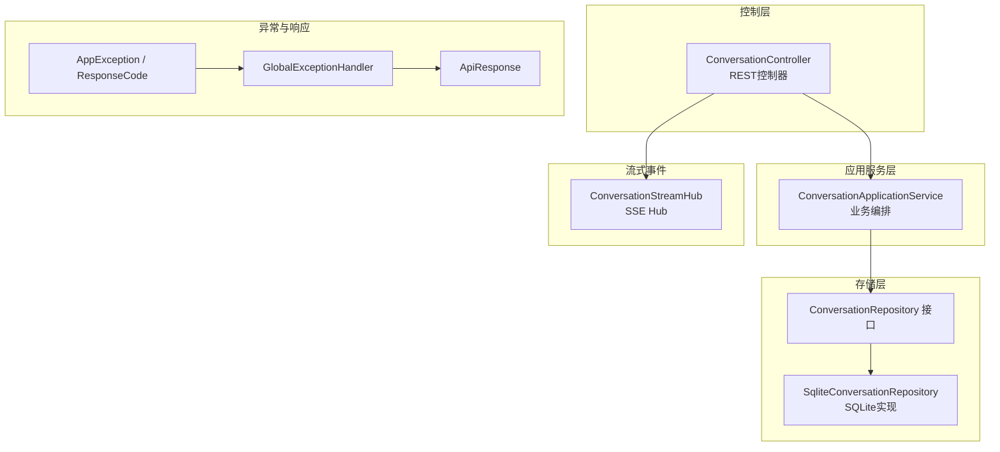
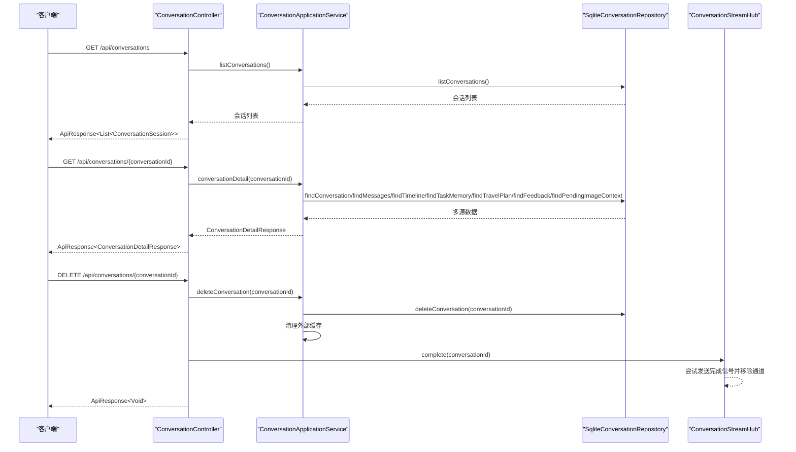
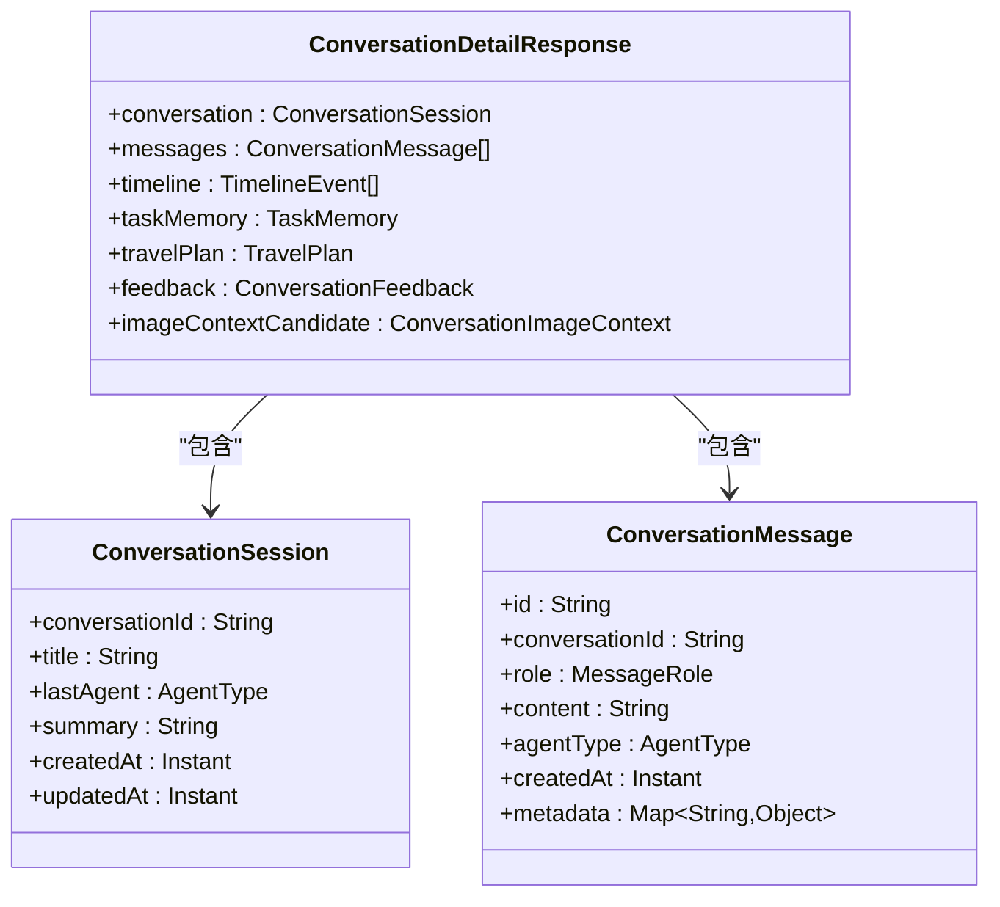
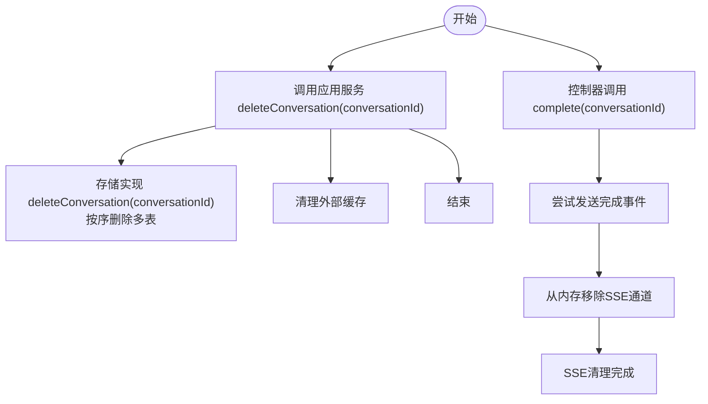
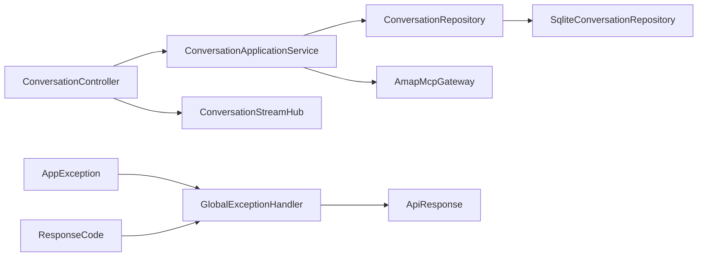

# 会话管理API

<cite>
**本文引用的文件**
- [ConversationController.java](file://travel-agent-app/src/main/java/com/travalagent/app/controller/ConversationController.java)
- [ConversationApplicationService.java](file://travel-agent-app/src/main/java/com/travalagent/app/service/ConversationApplicationService.java)
- [ConversationStreamHub.java](file://travel-agent-app/src/main/java/com/travalagent/app/stream/ConversationStreamHub.java)
- [ConversationRepository.java](file://travel-agent-domain/src/main/java/com/travalagent/domain/repository/ConversationRepository.java)
- [SqliteConversationRepository.java](file://travel-agent-infrastructure/src/main/java/com/travalagent/infrastructure/repository/SqliteConversationRepository.java)
- [ConversationDetailResponse.java](file://travel-agent-app/src/main/java/com/travalagent/app/dto/ConversationDetailResponse.java)
- [ApiResponse.java](file://travel-agent-types/src/main/java/com/travalagent/types/response/ApiResponse.java)
- [ResponseCode.java](file://travel-agent-types/src/main/java/com/travalagent/types/enums/ResponseCode.java)
- [AppException.java](file://travel-agent-types/src/main/java/com/travalagent/types/exception/AppException.java)
- [GlobalExceptionHandler.java](file://travel-agent-app/src/main/java/com/travalagent/app/controller/GlobalExceptionHandler.java)
- [ConversationSession.java](file://travel-agent-domain/src/main/java/com/travalagent/domain/model/entity/ConversationSession.java)
- [ConversationMessage.java](file://travel-agent-domain/src/main/java/com/travalagent/domain/model/entity/ConversationMessage.java)
- [ConversationControllerTest.java](file://travel-agent-app/src/test/java/com/travalagent/app/controller/ConversationControllerTest.java)
- [api.ts](file://web/src/types/api.ts)
</cite>

## 目录
1. [简介](#简介)
2. [项目结构](#项目结构)
3. [核心组件](#核心组件)
4. [架构总览](#架构总览)
5. [详细组件分析](#详细组件分析)
6. [依赖分析](#依赖分析)
7. [性能考虑](#性能考虑)
8. [故障排查指南](#故障排查指南)
9. [结论](#结论)
10. [附录](#附录)

## 简介
本文件聚焦于会话管理API，系统性解析以下核心能力：
- 列出所有会话：GET /api/conversations
- 获取特定会话详情：GET /api/conversations/{conversationId}
- 删除会话：DELETE /api/conversations/{conversationId}
- SSE 实时事件流：GET /api/conversations/{conversationId}/stream（与删除流程协同）

文档将从架构、数据流、处理逻辑、错误处理到实际调用示例进行完整说明，并提供可操作的排障建议。

## 项目结构
围绕会话管理API的关键模块分布如下：
- 控制层：负责HTTP端点、请求参数绑定、响应封装
- 应用服务层：编排业务流程、聚合多源数据
- 存储接口与实现：统一抽象与SQLite具体实现
- 流式事件中心：维护SSE订阅与清理
- 全局异常处理：统一错误返回格式
- 前端类型定义：与后端DTO保持一致



图表来源
- [ConversationController.java:32-100](file://travel-agent-app/src/main/java/com/travalagent/app/controller/ConversationController.java#L32-L100)
- [ConversationApplicationService.java:34-50](file://travel-agent-app/src/main/java/com/travalagent/app/service/ConversationApplicationService.java#L34-L50)
- [ConversationRepository.java:14-53](file://travel-agent-domain/src/main/java/com/travalagent/domain/repository/ConversationRepository.java#L14-L53)
- [SqliteConversationRepository.java:36-54](file://travel-agent-infrastructure/src/main/java/com/travalagent/infrastructure/repository/SqliteConversationRepository.java#L36-L54)
- [ConversationStreamHub.java:11-32](file://travel-agent-app/src/main/java/com/travalagent/app/stream/ConversationStreamHub.java#L11-L32)
- [GlobalExceptionHandler.java:9-21](file://travel-agent-app/src/main/java/com/travalagent/app/controller/GlobalExceptionHandler.java#L9-L21)
- [ApiResponse.java:5-14](file://travel-agent-types/src/main/java/com/travalagent/types/response/ApiResponse.java#L5-L14)
- [AppException.java:5-22](file://travel-agent-types/src/main/java/com/travalagent/types/exception/AppException.java#L5-L22)
- [ResponseCode.java:3-23](file://travel-agent-types/src/main/java/com/travalagent/types/enums/ResponseCode.java#L3-L23)

章节来源
- [ConversationController.java:32-100](file://travel-agent-app/src/main/java/com/travalagent/app/controller/ConversationController.java#L32-L100)
- [ConversationApplicationService.java:34-50](file://travel-agent-app/src/main/java/com/travalagent/app/service/ConversationApplicationService.java#L34-L50)
- [ConversationRepository.java:14-53](file://travel-agent-domain/src/main/java/com/travalagent/domain/repository/ConversationRepository.java#L14-L53)
- [SqliteConversationRepository.java:36-54](file://travel-agent-infrastructure/src/main/java/com/travalagent/infrastructure/repository/SqliteConversationRepository.java#L36-L54)
- [ConversationStreamHub.java:11-32](file://travel-agent-app/src/main/java/com/travalagent/app/stream/ConversationStreamHub.java#L11-L32)
- [GlobalExceptionHandler.java:9-21](file://travel-agent-app/src/main/java/com/travalagent/app/controller/GlobalExceptionHandler.java#L9-L21)
- [ApiResponse.java:5-14](file://travel-agent-types/src/main/java/com/travalagent/types/response/ApiResponse.java#L5-L14)
- [AppException.java:5-22](file://travel-agent-types/src/main/java/com/travalagent/types/exception/AppException.java#L5-L22)
- [ResponseCode.java:3-23](file://travel-agent-types/src/main/java/com/travalagent/types/enums/ResponseCode.java#L3-L23)

## 核心组件
- REST 控制器：暴露会话管理端点，负责参数校验、SSE流映射与统一响应包装
- 应用服务：聚合会话、消息、时间线、任务记忆、旅行计划、反馈、图像上下文等数据，构建详情响应
- 存储接口与实现：提供会话列表、详情查询、删除等能力；删除时级联清理多表
- SSE Hub：按会话维度维护事件通道，删除时主动完成并释放资源
- 异常与响应：全局异常捕获，统一返回码与信息

章节来源
- [ConversationController.java:32-100](file://travel-agent-app/src/main/java/com/travalagent/app/controller/ConversationController.java#L32-L100)
- [ConversationApplicationService.java:56-73](file://travel-agent-app/src/main/java/com/travalagent/app/service/ConversationApplicationService.java#L56-L73)
- [SqliteConversationRepository.java:342-367](file://travel-agent-infrastructure/src/main/java/com/travalagent/infrastructure/repository/SqliteConversationRepository.java#L342-L367)
- [ConversationStreamHub.java:21-31](file://travel-agent-app/src/main/java/com/travalagent/app/stream/ConversationStreamHub.java#L21-L31)
- [GlobalExceptionHandler.java:12-20](file://travel-agent-app/src/main/java/com/travalagent/app/controller/GlobalExceptionHandler.java#L12-L20)
- [ApiResponse.java:5-14](file://travel-agent-types/src/main/java/com/travalagent/types/response/ApiResponse.java#L5-L14)

## 架构总览
下图展示会话管理API的端到端交互：客户端通过REST控制器发起请求，应用服务层组合数据，存储层持久化或读取，SSE Hub负责事件推送与清理。



图表来源
- [ConversationController.java:53-90](file://travel-agent-app/src/main/java/com/travalagent/app/controller/ConversationController.java#L53-L90)
- [ConversationApplicationService.java:56-73](file://travel-agent-app/src/main/java/com/travalagent/app/service/ConversationApplicationService.java#L56-L73)
- [SqliteConversationRepository.java:342-367](file://travel-agent-infrastructure/src/main/java/com/travalagent/infrastructure/repository/SqliteConversationRepository.java#L342-L367)
- [ConversationStreamHub.java:26-31](file://travel-agent-app/src/main/java/com/travalagent/app/stream/ConversationStreamHub.java#L26-L31)

## 详细组件分析

### 1) 会话列表查询：GET /api/conversations
- 功能概述
  - 返回所有会话的最新状态列表，按更新时间倒序排列
- 参数与行为
  - 无路径/查询参数
  - 返回类型为 ApiResponse<List<ConversationSession>>
- 数据来源
  - 应用服务调用存储接口的 listConversations
  - SQLite实现执行SQL查询并映射为会话记录
- 响应结构
  - 使用统一响应体 ApiResponse，包含 code、info、data
  - data 为会话数组，元素字段参见前端类型定义

章节来源
- [ConversationController.java:53-56](file://travel-agent-app/src/main/java/com/travalagent/app/controller/ConversationController.java#L53-L56)
- [ConversationApplicationService.java:56-59](file://travel-agent-app/src/main/java/com/travalagent/app/service/ConversationApplicationService.java#L56-L59)
- [SqliteConversationRepository.java:68-77](file://travel-agent-infrastructure/src/main/java/com/travalagent/infrastructure/repository/SqliteConversationRepository.java#L68-L77)
- [ApiResponse.java:5-14](file://travel-agent-types/src/main/java/com/travalagent/types/response/ApiResponse.java#L5-L14)
- [ConversationSession.java:7-15](file://travel-agent-domain/src/main/java/com/travalagent/domain/model/entity/ConversationSession.java#L7-L15)
- [api.ts:24-31](file://web/src/types/api.ts#L24-L31)

### 2) 会话详情获取：GET /api/conversations/{conversationId}
- 功能概述
  - 聚合单个会话的会话元信息、消息、时间线、任务记忆、旅行计划、反馈、图像上下文候选
- 请求与响应
  - 路径参数：conversationId（字符串）
  - 响应体：ApiResponse<ConversationDetailResponse>
- 数据聚合逻辑
  - 应用服务先查询会话是否存在，不存在则抛出应用异常
  - 分别查询消息、时间线、任务记忆、旅行计划、反馈、图像上下文候选
  - 组装为 ConversationDetailResponse 记录
- 数据模型要点
  - ConversationDetailResponse 字段包括：conversation、messages、timeline、taskMemory、travelPlan、feedback、imageContextCandidate
  - 前端类型定义与后端DTO字段保持一致



图表来源
- [ConversationDetailResponse.java:13-22](file://travel-agent-app/src/main/java/com/travalagent/app/dto/ConversationDetailResponse.java#L13-L22)
- [ConversationSession.java:7-15](file://travel-agent-domain/src/main/java/com/travalagent/domain/model/entity/ConversationSession.java#L7-L15)
- [ConversationMessage.java:9-33](file://travel-agent-domain/src/main/java/com/travalagent/domain/model/entity/ConversationMessage.java#L9-L33)

章节来源
- [ConversationController.java:72-75](file://travel-agent-app/src/main/java/com/travalagent/app/controller/ConversationController.java#L72-L75)
- [ConversationApplicationService.java:61-73](file://travel-agent-app/src/main/java/com/travalagent/app/service/ConversationApplicationService.java#L61-L73)
- [ConversationDetailResponse.java:13-22](file://travel-agent-app/src/main/java/com/travalagent/app/dto/ConversationDetailResponse.java#L13-L22)
- [api.ts:340-348](file://web/src/types/api.ts#L340-L348)

### 3) 会话删除：DELETE /api/conversations/{conversationId}
- 功能概述
  - 删除指定会话及其关联数据（多表级联）
  - 同步清理SSE事件流，释放订阅资源
- 删除流程
  - 控制器调用应用服务 deleteConversation
  - 应用服务委托存储实现 deleteConversation
  - 应用服务同时调用外部网关清理缓存
  - 控制器触发 ConversationStreamHub.complete，完成SSE通道并移除内存引用
- 资源释放
  - 删除顺序：长期记忆、旅行计划快照、时间线、反馈、图像上下文、任务记忆、消息、会话
  - SSE通道：尝试发送完成事件并从内存中移除



图表来源
- [ConversationController.java:85-90](file://travel-agent-app/src/main/java/com/travalagent/app/controller/ConversationController.java#L85-L90)
- [ConversationApplicationService.java:151-155](file://travel-agent-app/src/main/java/com/travalagent/app/service/ConversationApplicationService.java#L151-L155)
- [SqliteConversationRepository.java:342-367](file://travel-agent-infrastructure/src/main/java/com/travalagent/infrastructure/repository/SqliteConversationRepository.java#L342-L367)
- [ConversationStreamHub.java:26-31](file://travel-agent-app/src/main/java/com/travalagent/app/stream/ConversationStreamHub.java#L26-L31)

章节来源
- [ConversationController.java:85-90](file://travel-agent-app/src/main/java/com/travalagent/app/controller/ConversationController.java#L85-L90)
- [ConversationApplicationService.java:151-155](file://travel-agent-app/src/main/java/com/travalagent/app/service/ConversationApplicationService.java#L151-L155)
- [SqliteConversationRepository.java:342-367](file://travel-agent-infrastructure/src/main/java/com/travalagent/infrastructure/repository/SqliteConversationRepository.java#L342-L367)
- [ConversationStreamHub.java:26-31](file://travel-agent-app/src/main/java/com/travalagent/app/stream/ConversationStreamHub.java#L26-L31)

### 4) SSE 实时事件流：GET /api/conversations/{conversationId}/stream
- 功能概述
  - 按会话维度推送实时事件流，事件类型为 TimelineEvent
- 实现要点
  - 控制器将 Flux<TimelineEvent> 映射为 ServerSentEvent
  - 事件类型使用阶段名称，数据为 TimelineEvent 对象
  - SSE Hub 以会话ID为键维护多播通道，支持背压缓冲
- 与删除的协作
  - 删除会话时，控制器调用 complete，SSE Hub 发送完成事件并移除通道，避免悬挂连接

章节来源
- [ConversationController.java:92-99](file://travel-agent-app/src/main/java/com/travalagent/app/controller/ConversationController.java#L92-L99)
- [ConversationStreamHub.java:16-31](file://travel-agent-app/src/main/java/com/travalagent/app/stream/ConversationStreamHub.java#L16-L31)

## 依赖分析
- 控制器依赖应用服务与SSE Hub
- 应用服务依赖工作流、存储接口与外部网关
- 存储接口由SQLite实现提供具体SQL逻辑
- 全局异常处理器统一拦截应用异常与系统异常，转换为标准响应



图表来源
- [ConversationController.java:36-45](file://travel-agent-app/src/main/java/com/travalagent/app/controller/ConversationController.java#L36-L45)
- [ConversationApplicationService.java:38-50](file://travel-agent-app/src/main/java/com/travalagent/app/service/ConversationApplicationService.java#L38-L50)
- [ConversationRepository.java:14-53](file://travel-agent-domain/src/main/java/com/travalagent/domain/repository/ConversationRepository.java#L14-L53)
- [SqliteConversationRepository.java:36-54](file://travel-agent-infrastructure/src/main/java/com/travalagent/infrastructure/repository/SqliteConversationRepository.java#L36-L54)
- [GlobalExceptionHandler.java:12-20](file://travel-agent-app/src/main/java/com/travalagent/app/controller/GlobalExceptionHandler.java#L12-L20)
- [ApiResponse.java:5-14](file://travel-agent-types/src/main/java/com/travalagent/types/response/ApiResponse.java#L5-L14)
- [AppException.java:5-22](file://travel-agent-types/src/main/java/com/travalagent/types/exception/AppException.java#L5-L22)
- [ResponseCode.java:3-23](file://travel-agent-types/src/main/java/com/travalagent/types/enums/ResponseCode.java#L3-L23)

章节来源
- [ConversationController.java:36-45](file://travel-agent-app/src/main/java/com/travalagent/app/controller/ConversationController.java#L36-L45)
- [ConversationApplicationService.java:38-50](file://travel-agent-app/src/main/java/com/travalagent/app/service/ConversationApplicationService.java#L38-L50)
- [ConversationRepository.java:14-53](file://travel-agent-domain/src/main/java/com/travalagent/domain/repository/ConversationRepository.java#L14-L53)
- [SqliteConversationRepository.java:36-54](file://travel-agent-infrastructure/src/main/java/com/travalagent/infrastructure/repository/SqliteConversationRepository.java#L36-L54)
- [GlobalExceptionHandler.java:12-20](file://travel-agent-app/src/main/java/com/travalagent/app/controller/GlobalExceptionHandler.java#L12-L20)
- [ApiResponse.java:5-14](file://travel-agent-types/src/main/java/com/travalagent/types/response/ApiResponse.java#L5-L14)
- [AppException.java:5-22](file://travel-agent-types/src/main/java/com/travalagent/types/exception/AppException.java#L5-L22)
- [ResponseCode.java:3-23](file://travel-agent-types/src/main/java/com/travalagent/types/enums/ResponseCode.java#L3-L23)

## 性能考虑
- 列表查询
  - SQLite按更新时间倒序查询，适合中小规模数据；若会话量增长，建议在会话表增加索引以优化排序与筛选
- 详情查询
  - 详情聚合涉及多次查询，建议在高频场景下引入缓存策略（如Redis）或延迟加载非关键字段
- SSE 通道
  - 采用背压缓冲，避免下游消费慢导致内存膨胀；删除时及时完成并移除，防止资源泄漏
- 删除流程
  - 多表删除顺序固定，确保外键约束与一致性；可在批量删除时评估事务边界与回滚成本

## 故障排查指南
- 404 未找到
  - 场景：会话不存在或被删除
  - 表现：应用服务在详情查询时抛出应用异常，全局异常处理器返回统一错误响应
  - 处理：确认 conversationId 是否正确；检查数据库中是否存在对应记录
- 500 服务器错误
  - 场景：系统异常或序列化失败
  - 表现：全局异常处理器捕获 Exception 并返回系统错误码
  - 处理：查看服务日志定位异常堆栈；检查JSON序列化与反序列化逻辑
- SSE 连接异常
  - 场景：客户端断开或网络波动
  - 表现：Hub 完成事件后通道移除，后续新连接需重新建立
  - 处理：客户端实现重连与断线恢复；服务端确保 complete 被调用

章节来源
- [ConversationApplicationService.java:62-63](file://travel-agent-app/src/main/java/com/travalagent/app/service/ConversationApplicationService.java#L62-L63)
- [GlobalExceptionHandler.java:12-20](file://travel-agent-app/src/main/java/com/travalagent/app/controller/GlobalExceptionHandler.java#L12-L20)
- [ApiResponse.java:5-14](file://travel-agent-types/src/main/java/com/travalagent/types/response/ApiResponse.java#L5-L14)
- [ResponseCode.java:3-23](file://travel-agent-types/src/main/java/com/travalagent/types/enums/ResponseCode.java#L3-L23)

## 结论
会话管理API通过清晰的分层设计实现了会话列表、详情、删除与SSE事件流的完整闭环。应用服务负责数据聚合与业务编排，存储层提供稳定的数据持久化与级联删除，SSE Hub保障实时事件的可靠传输与资源回收。配合统一的异常处理与响应格式，整体具备良好的可维护性与扩展性。

## 附录

### A. API 规范与示例

- 列出所有会话
  - 方法与路径：GET /api/conversations
  - 成功响应：ApiResponse<List<ConversationSession>>
  - curl 示例：
    ```bash
    curl -X GET http://localhost:8080/api/conversations
    ```
  - 响应字段参考：[api.ts:24-31](file://web/src/types/api.ts#L24-L31)

- 获取特定会话详情
  - 方法与路径：GET /api/conversations/{conversationId}
  - 成功响应：ApiResponse<ConversationDetailResponse>
  - curl 示例：
    ```bash
    curl -X GET http://localhost:8080/api/conversations/conversation-1
    ```
  - 响应字段参考：[api.ts:340-348](file://web/src/types/api.ts#L340-L348)

- 删除会话
  - 方法与路径：DELETE /api/conversations/{conversationId}
  - 成功响应：ApiResponse<Void>
  - curl 示例：
    ```bash
    curl -X DELETE http://localhost:8080/api/conversations/conversation-1
    ```

- SSE 实时事件流
  - 方法与路径：GET /api/conversations/{conversationId}/stream
  - 成功响应：TEXT_EVENT_STREAM
  - curl 示例：
    ```bash
    curl -N -X GET http://localhost:8080/api/conversations/conversation-1/stream
    ```

章节来源
- [ConversationController.java:53-99](file://travel-agent-app/src/main/java/com/travalagent/app/controller/ConversationController.java#L53-L99)
- [ConversationControllerTest.java:94-103](file://travel-agent-app/src/test/java/com/travalagent/app/controller/ConversationControllerTest.java#L94-L103)
- [api.ts:24-31](file://web/src/types/api.ts#L24-L31)
- [api.ts:340-348](file://web/src/types/api.ts#L340-L348)

### B. 错误码与响应格式
- 统一响应体：ApiResponse
  - 字段：code、info、data
  - 成功：code=0000；失败：code=1001 或 9999
- 错误码定义：ResponseCode
  - SUCCESS、INVALID_REQUEST、SYSTEM_ERROR
- 异常处理：GlobalExceptionHandler
  - AppException：返回自定义code与信息
  - Exception：返回系统错误码

章节来源
- [ApiResponse.java:5-14](file://travel-agent-types/src/main/java/com/travalagent/types/response/ApiResponse.java#L5-L14)
- [ResponseCode.java:3-23](file://travel-agent-types/src/main/java/com/travalagent/types/enums/ResponseCode.java#L3-L23)
- [GlobalExceptionHandler.java:12-20](file://travel-agent-app/src/main/java/com/travalagent/app/controller/GlobalExceptionHandler.java#L12-L20)