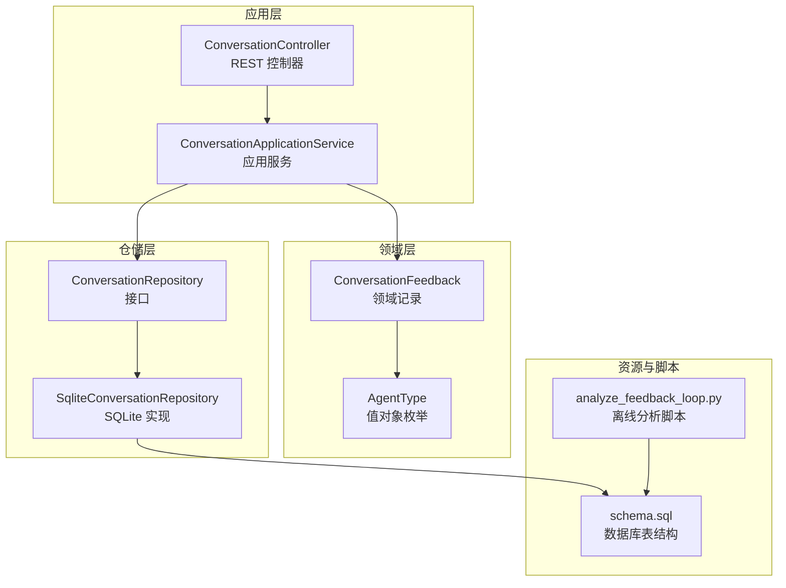
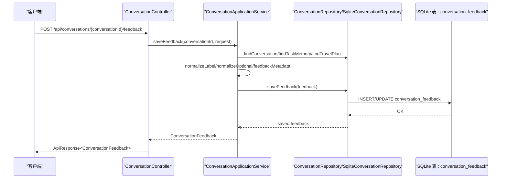
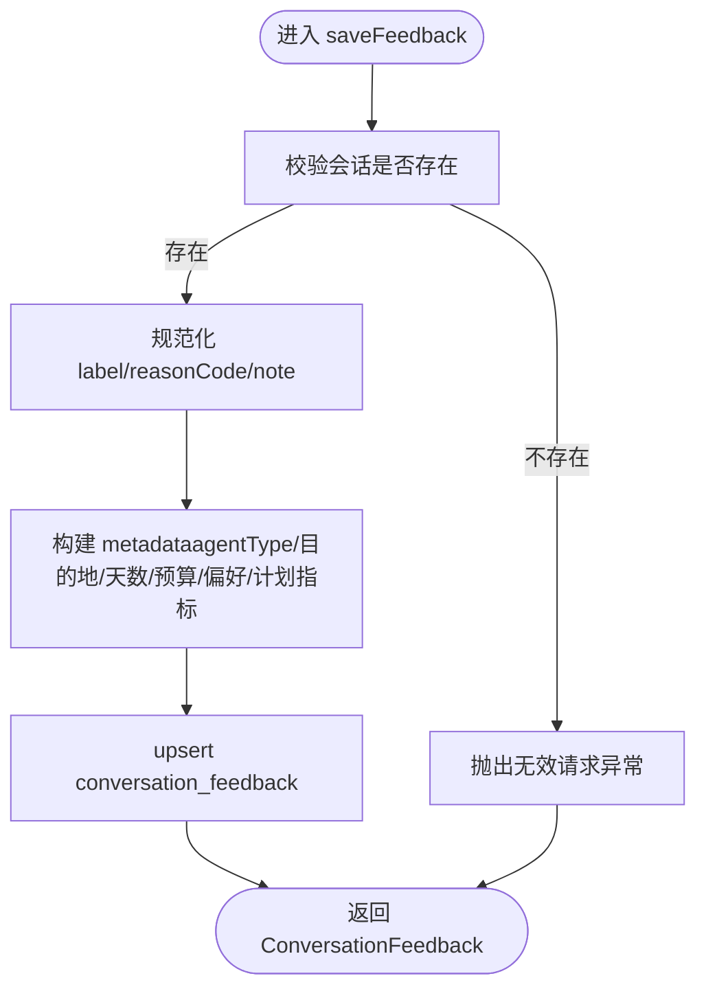
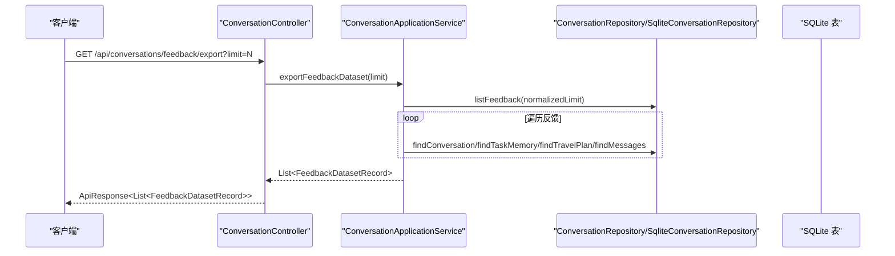
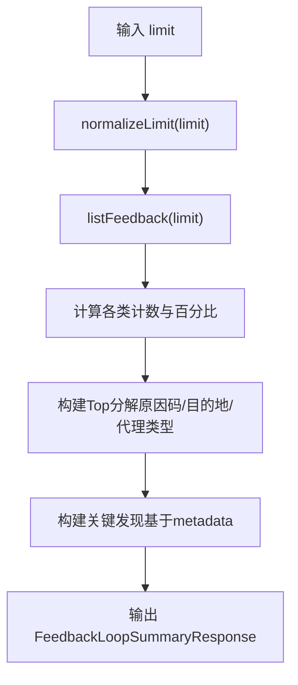
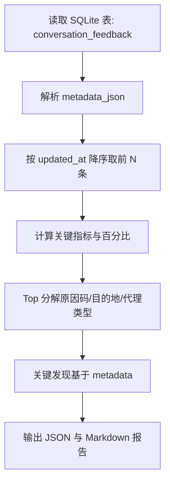
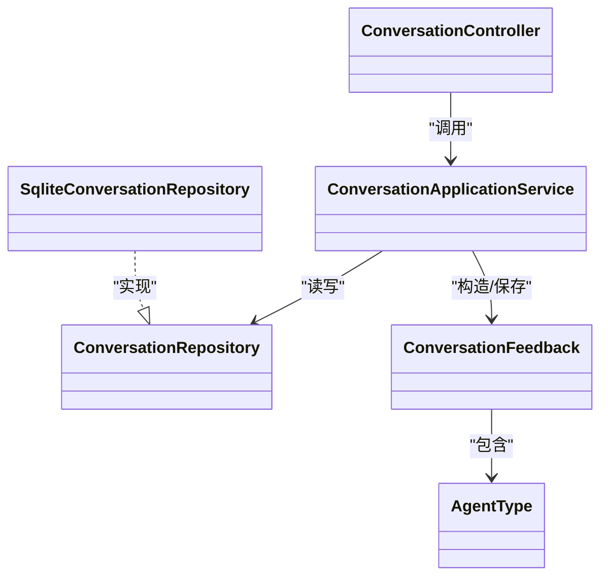

# 反馈系统API

<cite>
**本文引用的文件**
- [ConversationController.java](file://travel-agent-app/src/main/java/com/travalagent/app/controller/ConversationController.java)
- [ConversationApplicationService.java](file://travel-agent-app/src/main/java/com/travalagent/app/service/ConversationApplicationService.java)
- [ConversationFeedbackRequest.java](file://travel-agent-app/src/main/java/com/travalagent/app/dto/ConversationFeedbackRequest.java)
- [FeedbackDatasetRecord.java](file://travel-agent-app/src/main/java/com/travalagent/app/dto/FeedbackDatasetRecord.java)
- [FeedbackLoopSummaryResponse.java](file://travel-agent-app/src/main/java/com/travalagent/app/dto/FeedbackLoopSummaryResponse.java)
- [FeedbackBreakdownItem.java](file://travel-agent-app/src/main/java/com/travalagent/app/dto/FeedbackBreakdownItem.java)
- [FeedbackLoopFinding.java](file://travel-agent-app/src/main/java/com/travalagent/app/dto/FeedbackLoopFinding.java)
- [ConversationFeedback.java](file://travel-agent-domain/src/main/java/com/travalagent/domain/model/entity/ConversationFeedback.java)
- [AgentType.java](file://travel-agent-domain/src/main/java/com/travalagent/domain/model/valobj/AgentType.java)
- [ConversationRepository.java](file://travel-agent-domain/src/main/java/com/travalagent/domain/repository/ConversationRepository.java)
- [SqliteConversationRepository.java](file://travel-agent-infrastructure/src/main/java/com/travalagent/infrastructure/repository/SqliteConversationRepository.java)
- [schema.sql](file://travel-agent-app/src/main/resources/schema.sql)
- [analyze_feedback_loop.py](file://scripts/analyze_feedback_loop.py)
- [ConversationControllerTest.java](file://travel-agent-app/src/test/java/com/travalagent/app/controller/ConversationControllerTest.java)
- [chat.ts](file://web/src/stores/chat.ts)
</cite>

## 目录
1. [简介](#简介)
2. [项目结构](#项目结构)
3. [核心组件](#核心组件)
4. [架构总览](#架构总览)
5. [详细组件分析](#详细组件分析)
6. [依赖关系分析](#依赖关系分析)
7. [性能考量](#性能考量)
8. [故障排查指南](#故障排查指南)
9. [结论](#结论)
10. [附录](#附录)

## 简介
本文件面向反馈系统API，聚焦以下三个核心能力：
- 提交反馈：POST /api/conversations/{conversationId}/feedback
- 导出反馈数据集：GET /api/conversations/feedback/export
- 反馈汇总统计：GET /api/conversations/feedback/summary

文档将从接口定义、数据模型、验证规则、存储格式与关联关系、查询与筛选、以及离线分析与处理流程等方面进行系统化说明，并提供可视化图示帮助理解。

## 项目结构
反馈系统API位于应用层控制器与服务层之间，通过应用服务协调领域实体与基础设施仓库，实现对会话反馈的持久化、导出与统计分析。

图表来源
- [ConversationController.java:32-100](file://travel-agent-app/src/main/java/com/travalagent/app/controller/ConversationController.java#L32-L100)
- [ConversationApplicationService.java:34-50](file://travel-agent-app/src/main/java/com/travalagent/app/service/ConversationApplicationService.java#L34-L50)
- [ConversationRepository.java:14-55](file://travel-agent-domain/src/main/java/com/travalagent/domain/repository/ConversationRepository.java#L14-L55)
- [SqliteConversationRepository.java:157-234](file://travel-agent-infrastructure/src/main/java/com/travalagent/infrastructure/repository/SqliteConversationRepository.java#L157-L234)
- [schema.sql:65-78](file://travel-agent-app/src/main/resources/schema.sql#L65-L78)
- [analyze_feedback_loop.py:324-359](file://scripts/analyze_feedback_loop.py#L324-L359)

章节来源
- [ConversationController.java:32-100](file://travel-agent-app/src/main/java/com/travalagent/app/controller/ConversationController.java#L32-L100)
- [ConversationApplicationService.java:34-50](file://travel-agent-app/src/main/java/com/travalagent/app/service/ConversationApplicationService.java#L34-L50)
- [schema.sql:65-78](file://travel-agent-app/src/main/resources/schema.sql#L65-L78)

## 核心组件
- REST 控制器：暴露反馈相关HTTP端点，负责参数接收与响应封装。
- 应用服务：实现业务逻辑（保存反馈、导出数据集、生成汇总），并调用仓储层读写数据。
- 领域模型：ConversationFeedback 记录反馈实体；AgentType 为枚举型值对象。
- 仓储接口与实现：统一抽象与SQLite具体实现，负责SQL执行与映射。
- 数据库表：conversation_feedback 存储反馈记录及其元数据。
- 离线分析脚本：基于本地SQLite数据库生成离线反馈报告，便于脱敏或批量分析。

章节来源
- [ConversationController.java:58-83](file://travel-agent-app/src/main/java/com/travalagent/app/controller/ConversationController.java#L58-L83)
- [ConversationApplicationService.java:75-149](file://travel-agent-app/src/main/java/com/travalagent/app/service/ConversationApplicationService.java#L75-L149)
- [ConversationFeedback.java:8-26](file://travel-agent-domain/src/main/java/com/travalagent/domain/model/entity/ConversationFeedback.java#L8-L26)
- [AgentType.java:3-8](file://travel-agent-domain/src/main/java/com/travalagent/domain/model/valobj/AgentType.java#L3-L8)
- [ConversationRepository.java:32-36](file://travel-agent-domain/src/main/java/com/travalagent/domain/repository/ConversationRepository.java#L32-L36)
- [SqliteConversationRepository.java:157-234](file://travel-agent-infrastructure/src/main/java/com/travalagent/infrastructure/repository/SqliteConversationRepository.java#L157-L234)
- [schema.sql:65-78](file://travel-agent-app/src/main/resources/schema.sql#L65-L78)
- [analyze_feedback_loop.py:324-404](file://scripts/analyze_feedback_loop.py#L324-L404)

## 架构总览
下图展示从客户端到数据库的反馈提交与汇总路径，以及离线分析脚本如何复用相同的数据结构与统计口径。

图表来源
- [ConversationController.java:77-83](file://travel-agent-app/src/main/java/com/travalagent/app/controller/ConversationController.java#L77-L83)
- [ConversationApplicationService.java:75-101](file://travel-agent-app/src/main/java/com/travalagent/app/service/ConversationApplicationService.java#L75-L101)
- [SqliteConversationRepository.java:213-234](file://travel-agent-infrastructure/src/main/java/com/travalagent/infrastructure/repository/SqliteConversationRepository.java#L213-L234)
- [schema.sql:65-78](file://travel-agent-app/src/main/resources/schema.sql#L65-L78)

## 详细组件分析

### 接口一：提交反馈 POST /api/conversations/{conversationId}/feedback
- 路径参数
  - conversationId：会话标识符，作为外键与主键约束关联 feedback 表。
- 请求体
  - ConversationFeedbackRequest：包含 label、reasonCode、note 字段。
- 响应
  - ApiResponse<ConversationFeedback>：返回已保存的反馈实体。
- 关键行为
  - 校验会话存在性；若不存在抛出无效请求异常。
  - 规范化 label（仅允许 ACCEPTED/PARTIAL/REJECTED）；reasonCode/note 支持空值规范化。
  - 从会话、任务记忆与旅行计划中提取上下文，构建 metadata 元数据。
  - 使用 upsert 语句更新或插入 feedback 表记录。

图表来源
- [ConversationApplicationService.java:75-101](file://travel-agent-app/src/main/java/com/travalagent/app/service/ConversationApplicationService.java#L75-L101)
- [SqliteConversationRepository.java:213-234](file://travel-agent-infrastructure/src/main/java/com/travalagent/infrastructure/repository/SqliteConversationRepository.java#L213-L234)
- [schema.sql:65-78](file://travel-agent-app/src/main/resources/schema.sql#L65-L78)

章节来源
- [ConversationController.java:77-83](file://travel-agent-app/src/main/java/com/travalagent/app/controller/ConversationController.java#L77-L83)
- [ConversationApplicationService.java:75-101](file://travel-agent-app/src/main/java/com/travalagent/app/service/ConversationApplicationService.java#L75-L101)
- [ConversationFeedbackRequest.java:5-10](file://travel-agent-app/src/main/java/com/travalagent/app/dto/ConversationFeedbackRequest.java#L5-L10)
- [ConversationFeedback.java:8-26](file://travel-agent-domain/src/main/java/com/travalagent/domain/model/entity/ConversationFeedback.java#L8-L26)
- [AgentType.java:3-8](file://travel-agent-domain/src/main/java/com/travalagent/domain/model/valobj/AgentType.java#L3-L8)
- [SqliteConversationRepository.java:213-234](file://travel-agent-infrastructure/src/main/java/com/travalagent/infrastructure/repository/SqliteConversationRepository.java#L213-L234)
- [schema.sql:65-78](file://travel-agent-app/src/main/resources/schema.sql#L65-L78)

### 数据模型与验证规则

- ConversationFeedbackRequest
  - 字段
    - label：必填，非空白字符串。
    - reasonCode：可选，空字符串将被规范化为空值。
    - note：可选，空字符串将被规范化为空值。
  - 验证
    - 使用 Jakarta Bean Validation 注解保证 label 非空。

- ConversationFeedback（存储模型）
  - 字段
    - conversationId：主键，关联会话。
    - label：ACCEPTED/PARTIAL/REJECTED。
    - reasonCode：可选。
    - note：可选。
    - agentType：值对象枚举。
    - destination/days/budget：来自任务记忆。
    - hasTravelPlan：布尔，表示是否生成了结构化行程。
    - metadata：JSON 字符串，包含 agentType、origin、destination、days、budget、preferences、计划相关指标等。
    - createdAt/updatedAt：时间戳。
  - 存储格式
    - metadata_json：以文本形式存储JSON元数据。
    - 其余字段对应表列。

- 验证与规范化
  - label 必须为 ACCEPTED/PARTIAL/REJECTED，否则抛出无效请求异常。
  - reasonCode/note 若为空白将被置为 null。
  - metadata 由应用服务根据会话、任务记忆与旅行计划动态组装。

章节来源
- [ConversationFeedbackRequest.java:5-10](file://travel-agent-app/src/main/java/com/travalagent/app/dto/ConversationFeedbackRequest.java#L5-L10)
- [ConversationApplicationService.java:157-167](file://travel-agent-app/src/main/java/com/travalagent/app/service/ConversationApplicationService.java#L157-L167)
- [ConversationFeedback.java:8-26](file://travel-agent-domain/src/main/java/com/travalagent/domain/model/entity/ConversationFeedback.java#L8-L26)
- [schema.sql:65-78](file://travel-agent-app/src/main/resources/schema.sql#L65-L78)

### 接口二：导出反馈数据集 GET /api/conversations/feedback/export
- 查询参数
  - limit：默认200，最大1000；不合法时回退为200。
- 返回
  - ApiResponse<List<FeedbackDatasetRecord>>
  - 每条记录包含：会话、反馈、任务记忆、旅行计划、消息列表。
- 处理逻辑
  - 应用服务先按 updated_at 降序取前 N 条反馈。
  - 对每条反馈，补充会话、任务记忆、旅行计划与消息列表，形成完整的数据集。
- 用途
  - 用于离线分析、训练或审计。

图表来源
- [ConversationController.java:58-63](file://travel-agent-app/src/main/java/com/travalagent/app/controller/ConversationController.java#L58-L63)
- [ConversationApplicationService.java:103-122](file://travel-agent-app/src/main/java/com/travalagent/app/service/ConversationApplicationService.java#L103-L122)
- [SqliteConversationRepository.java:171-181](file://travel-agent-infrastructure/src/main/java/com/travalagent/infrastructure/repository/SqliteConversationRepository.java#L171-L181)

章节来源
- [ConversationController.java:58-63](file://travel-agent-app/src/main/java/com/travalagent/app/controller/ConversationController.java#L58-L63)
- [ConversationApplicationService.java:103-122](file://travel-agent-app/src/main/java/com/travalagent/app/service/ConversationApplicationService.java#L103-L122)
- [FeedbackDatasetRecord.java:11-18](file://travel-agent-app/src/main/java/com/travalagent/app/dto/FeedbackDatasetRecord.java#L11-L18)
- [ConversationRepository.java:34-36](file://travel-agent-domain/src/main/java/com/travalagent/domain/repository/ConversationRepository.java#L34-L36)

### 接口三：反馈汇总 GET /api/conversations/feedback/summary
- 查询参数
  - limit：默认200，最大1000；不合法时回退为200。
- 返回
  - ApiResponse<FeedbackLoopSummaryResponse>
  - 包含：生成时间、应用limit、样本数、各类计数与百分比、Top维度分解、关键发现等。
- 统计口径
  - 接受率、可用率、结构化计划覆盖率。
  - Top原因码、目的地、代理类型分解。
  - 关键发现：如“无结构化计划”、“验证失败”、“高警告负载”、“约束放宽”、“知识覆盖不足”等。

图表来源
- [ConversationApplicationService.java:124-149](file://travel-agent-app/src/main/java/com/travalagent/app/service/ConversationApplicationService.java#L124-L149)
- [FeedbackLoopSummaryResponse.java:6-22](file://travel-agent-app/src/main/java/com/travalagent/app/dto/FeedbackLoopSummaryResponse.java#L6-L22)
- [FeedbackBreakdownItem.java:3-12](file://travel-agent-app/src/main/java/com/travalagent/app/dto/FeedbackBreakdownItem.java#L3-L12)
- [FeedbackLoopFinding.java:3-13](file://travel-agent-app/src/main/java/com/travalagent/app/dto/FeedbackLoopFinding.java#L3-L13)

章节来源
- [ConversationController.java:65-70](file://travel-agent-app/src/main/java/com/travalagent/app/controller/ConversationController.java#L65-L70)
- [ConversationApplicationService.java:124-149](file://travel-agent-app/src/main/java/com/travalagent/app/service/ConversationApplicationService.java#L124-L149)
- [FeedbackLoopSummaryResponse.java:6-22](file://travel-agent-app/src/main/java/com/travalagent/app/dto/FeedbackLoopSummaryResponse.java#L6-L22)

### 数据导出格式与关联关系
- FeedbackDatasetRecord
  - conversation：会话信息
  - feedback：反馈记录
  - taskMemory：任务记忆（目的地、天数、预算、偏好等）
  - travelPlan：旅行计划（可能为空）
  - messages：该会话的消息列表
- 关联关系
  - feedback.conversationId → conversation_session.conversation_id
  - feedback.metadata_json 中包含 agentType、origin、destination、days、budget、preferences 等键。
  - travel_plan_snapshot.plan_json 与 feedback.hasTravelPlan 字段配合判断是否生成结构化计划。

章节来源
- [FeedbackDatasetRecord.java:11-18](file://travel-agent-app/src/main/java/com/travalagent/app/dto/FeedbackDatasetRecord.java#L11-L18)
- [schema.sql:1-88](file://travel-agent-app/src/main/resources/schema.sql#L1-L88)
- [schema.sql:35-39](file://travel-agent-app/src/main/resources/schema.sql#L35-L39)
- [schema.sql:65-78](file://travel-agent-app/src/main/resources/schema.sql#L65-L78)

### 查询与筛选示例（概念性说明）
- 时间范围：通过 limit 参数控制最近N条记录（按 updated_at 降序）。
- 评分等级：label 等于 ACCEPTED/PARTIAL/REJECTED。
- 反馈类型：reasonCode 分桶统计（如 edited_before_use、not_useful 等）。
- 目的地与代理类型：按 destination、agentType 进行 Top 分解。
- 结构化计划：hasTravelPlan 为真且 metadata 中包含计划相关指标。

说明：当前后端未提供显式的多维过滤查询端点，建议在客户端或离线脚本中基于导出数据进行二次筛选与聚合。

[本节为概念性说明，不直接分析具体文件，故无章节来源]

### 离线分析与处理流程
- 离线脚本
  - 从本地 SQLite 读取 conversation_feedback 表，按 updated_at 降序取前 N 条。
  - 解析 metadata_json，构建与后端一致的统计口径。
  - 输出 JSON 与 Markdown 报告，包含关键指标、Top 分解与关键发现。
- 与后端一致性
  - limit 规范化策略、百分比计算、Top 数量限制、关键发现规则均与后端保持一致。

图表来源
- [analyze_feedback_loop.py:324-404](file://scripts/analyze_feedback_loop.py#L324-L404)
- [analyze_feedback_loop.py:106-109](file://scripts/analyze_feedback_loop.py#L106-L109)
- [analyze_feedback_loop.py:163-168](file://scripts/analyze_feedback_loop.py#L163-L168)
- [analyze_feedback_loop.py:225-322](file://scripts/analyze_feedback_loop.py#L225-L322)

章节来源
- [analyze_feedback_loop.py:324-404](file://scripts/analyze_feedback_loop.py#L324-L404)

## 依赖关系分析
- 控制器依赖应用服务；应用服务依赖仓储接口与工具网关；仓储接口由SQLite实现。
- 领域模型 ConversationFeedback 依赖 AgentType；应用服务负责将会话、任务记忆与旅行计划整合进反馈记录。
- 数据库表 conversation_feedback 与应用服务的元数据字段一一对应。

图表来源
- [ConversationController.java:32-100](file://travel-agent-app/src/main/java/com/travalagent/app/controller/ConversationController.java#L32-L100)
- [ConversationApplicationService.java:34-50](file://travel-agent-app/src/main/java/com/travalagent/app/service/ConversationApplicationService.java#L34-L50)
- [ConversationRepository.java:14-55](file://travel-agent-domain/src/main/java/com/travalagent/domain/repository/ConversationRepository.java#L14-L55)
- [SqliteConversationRepository.java:157-234](file://travel-agent-infrastructure/src/main/java/com/travalagent/infrastructure/repository/SqliteConversationRepository.java#L157-L234)
- [ConversationFeedback.java:8-26](file://travel-agent-domain/src/main/java/com/travalagent/domain/model/entity/ConversationFeedback.java#L8-L26)
- [AgentType.java:3-8](file://travel-agent-domain/src/main/java/com/travalagent/domain/model/valobj/AgentType.java#L3-L8)

章节来源
- [ConversationController.java:32-100](file://travel-agent-app/src/main/java/com/travalagent/app/controller/ConversationController.java#L32-L100)
- [ConversationApplicationService.java:34-50](file://travel-agent-app/src/main/java/com/travalagent/app/service/ConversationApplicationService.java#L34-L50)
- [ConversationRepository.java:14-55](file://travel-agent-domain/src/main/java/com/travalagent/domain/repository/ConversationRepository.java#L14-L55)
- [SqliteConversationRepository.java:157-234](file://travel-agent-infrastructure/src/main/java/com/travalagent/infrastructure/repository/SqliteConversationRepository.java#L157-L234)
- [ConversationFeedback.java:8-26](file://travel-agent-domain/src/main/java/com/travalagent/domain/model/entity/ConversationFeedback.java#L8-L26)
- [AgentType.java:3-8](file://travel-agent-domain/src/main/java/com/travalagent/domain/model/valobj/AgentType.java#L3-L8)

## 性能考量
- limit 参数限制
  - 默认200，最大1000，避免一次性返回过多数据导致内存压力。
- 数据库索引
  - 建议确保 conversation_feedback.updated_at 列具备索引以优化排序与分页。
- upsert 写入
  - 使用 ON CONFLICT 更新现有反馈，减少重复插入开销。
- 导出与汇总
  - 导出与汇总均基于 limit 的反馈集合进行聚合，建议结合业务场景合理设置 limit。

[本节提供一般性指导，不直接分析具体文件，故无章节来源]

## 故障排查指南
- 提交反馈失败
  - 现象：返回无效请求错误。
  - 可能原因：label 不是 ACCEPTED/PARTIAL/REJECTED；会话不存在。
  - 排查步骤：确认 label 合法；确认 conversationId 正确；检查会话是否已创建。
- 导出数据为空
  - 现象：export 返回空数组。
  - 可能原因：limit 设置过小或数据库中无足够反馈记录。
  - 排查步骤：增大 limit 或确认有历史反馈。
- 汇总统计异常
  - 现象：百分比异常或 Top 为空。
  - 可能原因：metadata 解析失败或字段缺失。
  - 排查步骤：检查 metadata_json 是否为有效JSON；确认字段存在。

章节来源
- [ConversationApplicationService.java:157-167](file://travel-agent-app/src/main/java/com/travalagent/app/service/ConversationApplicationService.java#L157-L167)
- [SqliteConversationRepository.java:157-181](file://travel-agent-infrastructure/src/main/java/com/travalagent/infrastructure/repository/SqliteConversationRepository.java#L157-L181)
- [ConversationControllerTest.java:140-180](file://travel-agent-app/src/test/java/com/travalagent/app/controller/ConversationControllerTest.java#L140-L180)

## 结论
反馈系统API围绕三条核心路径构建：提交反馈、导出数据集与生成汇总。通过清晰的数据模型、严格的验证与规范化、以及与离线脚本的一致性设计，实现了从实时交互到离线分析的闭环。建议在生产环境中结合 limit 参数与客户端二次筛选，以获得更高效与可控的反馈分析体验。

[本节为总结性内容，不直接分析具体文件，故无章节来源]

## 附录

### API 定义与参数说明
- POST /api/conversations/{conversationId}/feedback
  - 路径参数：conversationId（会话ID）
  - 请求体：ConversationFeedbackRequest（label、reasonCode、note）
  - 响应：ApiResponse<ConversationFeedback>
- GET /api/conversations/feedback/export
  - 查询参数：limit（默认200，最大1000）
  - 响应：ApiResponse<List<FeedbackDatasetRecord>>
- GET /api/conversations/feedback/summary
  - 查询参数：limit（默认200，最大1000）
  - 响应：ApiResponse<FeedbackLoopSummaryResponse>

章节来源
- [ConversationController.java:58-83](file://travel-agent-app/src/main/java/com/travalagent/app/controller/ConversationController.java#L58-L83)
- [ConversationApplicationService.java:103-149](file://travel-agent-app/src/main/java/com/travalagent/app/service/ConversationApplicationService.java#L103-L149)

### 前端集成参考
- 前端通过 chat.ts 的 submitFeedback 方法调用提交反馈端点，并在成功后标记反馈循环状态为“陈旧”，触发后续刷新。

章节来源
- [chat.ts:98-118](file://web/src/stores/chat.ts#L98-L118)