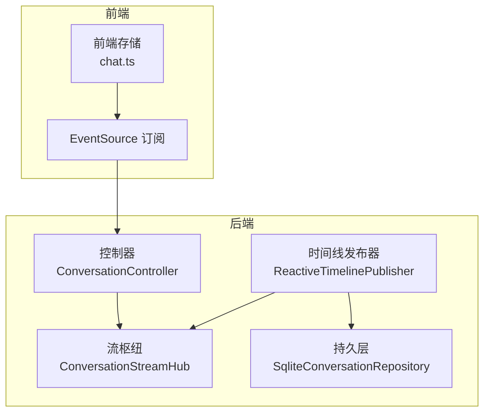
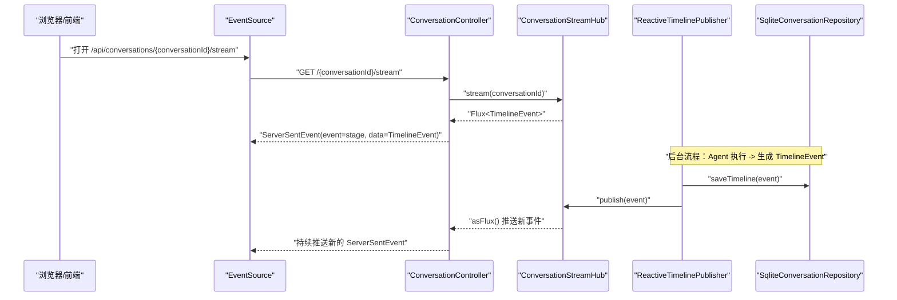
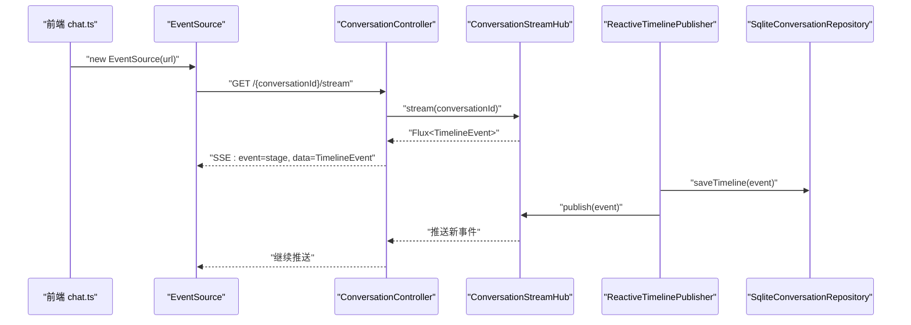
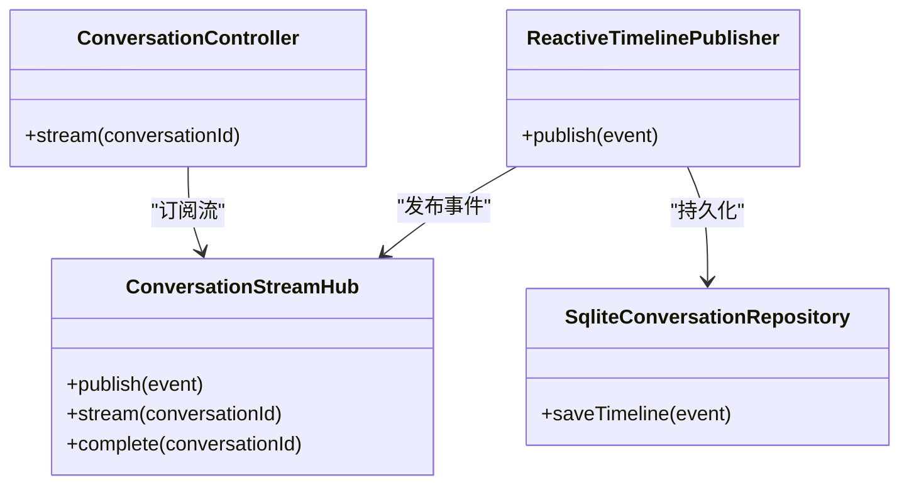

# 流式传输API

<cite>
**本文引用的文件**
- [ConversationController.java](file://travel-agent-app/src/main/java/com/travalagent/app/controller/ConversationController.java)
- [ConversationStreamHub.java](file://travel-agent-app/src/main/java/com/travalagent/app/stream/ConversationStreamHub.java)
- [ReactiveTimelinePublisher.java](file://travel-agent-app/src/main/java/com/travalagent/app/stream/ReactiveTimelinePublisher.java)
- [TimelineEvent.java](file://travel-agent-domain/src/main/java/com/travalagent/domain/model/entity/TimelineEvent.java)
- [ExecutionStage.java](file://travel-agent-domain/src/main/java/com/travalagent/domain/model/valobj/ExecutionStage.java)
- [SqliteConversationRepository.java](file://travel-agent-infrastructure/src/main/java/com/travalagent/infrastructure/repository/SqliteConversationRepository.java)
- [chat.ts](file://web/src/stores/chat.ts)
- [api.ts](file://web/src/types/api.ts)
- [ConversationControllerTest.java](file://travel-agent-app/src/test/java/com/travalagent/app/controller/ConversationControllerTest.java)
</cite>

## 目录
1. [简介](#简介)
2. [项目结构](#项目结构)
3. [核心组件](#核心组件)
4. [架构总览](#架构总览)
5. [组件详解](#组件详解)
6. [依赖关系分析](#依赖关系分析)
7. [性能与背压优化](#性能与背压优化)
8. [调试与监控](#调试与监控)
9. [故障排查指南](#故障排查指南)
10. [结论](#结论)

## 简介
本文件聚焦于系统中基于 Server-Sent Events（SSE）的流式传输接口 GET /api/conversations/{conversationId}/stream 的完整实现与使用说明。该接口用于向客户端实时推送对话执行过程中的时间线事件（TimelineEvent），事件包含执行阶段（ExecutionStage）与结构化数据（details），帮助用户可视化 Agent 工作流的动态进展。

## 项目结构
围绕流式传输的关键模块分布如下：
- 后端控制器：负责暴露 SSE 接口，将事件转换为 ServerSentEvent 并通过响应流推送
- 流枢纽（Stream Hub）：以会话维度维护 Reactor Sinks/Flux，实现事件发布与订阅
- 时间线发布器：在保存事件到持久层后，将事件推送到流枢纽
- 前端存储：通过 EventSource 订阅流，接收并更新本地时间线状态
- 数据模型：定义 TimelineEvent 与 ExecutionStage 的结构与枚举值

图表来源
- [ConversationController.java:92-99](file://travel-agent-app/src/main/java/com/travalagent/app/controller/ConversationController.java#L92-L99)
- [ConversationStreamHub.java:14-24](file://travel-agent-app/src/main/java/com/travalagent/app/stream/ConversationStreamHub.java#L14-L24)
- [ReactiveTimelinePublisher.java:23-26](file://travel-agent-app/src/main/java/com/travalagent/app/stream/ReactiveTimelinePublisher.java#L23-L26)
- [SqliteConversationRepository.java:314-326](file://travel-agent-infrastructure/src/main/java/com/travalagent/infrastructure/repository/SqliteConversationRepository.java#L314-L326)

章节来源
- [ConversationController.java:92-99](file://travel-agent-app/src/main/java/com/travalagent/app/controller/ConversationController.java#L92-L99)
- [ConversationStreamHub.java:14-24](file://travel-agent-app/src/main/java/com/travalagent/app/stream/ConversationStreamHub.java#L14-L24)
- [ReactiveTimelinePublisher.java:23-26](file://travel-agent-app/src/main/java/com/travalagent/app/stream/ReactiveTimelinePublisher.java#L23-L26)
- [SqliteConversationRepository.java:314-326](file://travel-agent-infrastructure/src/main/java/com/travalagent/infrastructure/repository/SqliteConversationRepository.java#L314-L326)

## 核心组件
- SSE 控制器端点：将会话对应的 Flux<TimelineEvent> 映射为 ServerSentEvent，并设置 event 字段为 ExecutionStage 名称，data 字段为 TimelineEvent 实体
- 流枢纽：按 conversationId 维度持有 Sinks.Many，支持 onBackpressureBuffer 背压缓冲，提供 publish/stream/complete
- 时间线发布器：先持久化 TimelineEvent，再通过流枢纽广播
- 前端订阅：使用 EventSource 订阅 /stream，解析 data 为 TimelineEvent 并去重更新 UI

章节来源
- [ConversationController.java:92-99](file://travel-agent-app/src/main/java/com/travalagent/app/controller/ConversationController.java#L92-L99)
- [ConversationStreamHub.java:16-31](file://travel-agent-app/src/main/java/com/travalagent/app/stream/ConversationStreamHub.java#L16-L31)
- [ReactiveTimelinePublisher.java:23-26](file://travel-agent-app/src/main/java/com/travalagent/app/stream/ReactiveTimelinePublisher.java#L23-L26)
- [chat.ts:146-159](file://web/src/stores/chat.ts#L146-L159)

## 架构总览
SSE 流式传输的端到端调用序列如下：

图表来源
- [ConversationController.java:92-99](file://travel-agent-app/src/main/java/com/travalagent/app/controller/ConversationController.java#L92-L99)
- [ConversationStreamHub.java:21-24](file://travel-agent-app/src/main/java/com/travalagent/app/stream/ConversationStreamHub.java#L21-L24)
- [ReactiveTimelinePublisher.java:23-26](file://travel-agent-app/src/main/java/com/travalagent/app/stream/ReactiveTimelinePublisher.java#L23-L26)
- [SqliteConversationRepository.java:314-326](file://travel-agent-infrastructure/src/main/java/com/travalagent/infrastructure/repository/SqliteConversationRepository.java#L314-L326)

## 组件详解

### SSE 事件格式与生命周期
- 事件格式
  - event 字段：来自 TimelineEvent.stage 的字符串表示（即 ExecutionStage 名称）
  - data 字段：完整的 TimelineEvent 对象（JSON 序列化）
- 生命周期
  - 连接建立：前端 EventSource 打开 /stream
  - 事件推送：后端将每个 TimelineEvent 转换为 ServerSentEvent 并推送
  - 连接断开：删除会话时，后端调用 complete(conversationId)，触发客户端 onclose 或停止推送
  - 错误处理：后端返回 200 成功头，具体错误通过异常处理或上游服务控制；前端可监听 onerror 并自行重连

章节来源
- [ConversationController.java:92-99](file://travel-agent-app/src/main/java/com/travalagent/app/controller/ConversationController.java#L92-L99)
- [ExecutionStage.java:3-14](file://travel-agent-domain/src/main/java/com/travalagent/domain/model/valobj/ExecutionStage.java#L3-L14)
- [TimelineEvent.java:9-33](file://travel-agent-domain/src/main/java/com/travalagent/domain/model/entity/TimelineEvent.java#L9-L33)

### TimelineEvent 事件类型与数据结构
- 字段说明
  - id：事件唯一标识
  - conversationId：所属会话 ID
  - stage：执行阶段（ExecutionStage）
  - message：描述性消息
  - details：键值对详情（如尝试次数、修复代码等）
  - createdAt：事件创建时间
- 典型阶段（ExecutionStage）
  - ANALYZE_QUERY、RECALL_MEMORY、SELECT_AGENT、SPECIALIST、CALL_TOOL、VALIDATE_PLAN、REPAIR_PLAN、FINALIZE_MEMORY、COMPLETED、ERROR

章节来源
- [TimelineEvent.java:9-33](file://travel-agent-domain/src/main/java/com/travalagent/domain/model/entity/TimelineEvent.java#L9-L33)
- [ExecutionStage.java:3-14](file://travel-agent-domain/src/main/java/com/travalagent/domain/model/valobj/ExecutionStage.java#L3-L14)
- [api.ts:322-329](file://web/src/types/api.ts#L322-L329)

### 后端实现要点
- 控制器映射：将 Flux<TimelineEvent> 转为 Flux<ServerSentEvent<TimelineEvent>>，event 使用 stage.name()
- 流枢纽：按 conversationId 创建/复用 Sinks.Many，启用 onBackpressureBuffer 缓冲
- 发布顺序：先保存到数据库，再发布到流，确保持久化与实时推送一致

章节来源
- [ConversationController.java:92-99](file://travel-agent-app/src/main/java/com/travalagent/app/controller/ConversationController.java#L92-L99)
- [ConversationStreamHub.java:16-31](file://travel-agent-app/src/main/java/com/travalagent/app/stream/ConversationStreamHub.java#L16-L31)
- [ReactiveTimelinePublisher.java:23-26](file://travel-agent-app/src/main/java/com/travalagent/app/stream/ReactiveTimelinePublisher.java#L23-L26)
- [SqliteConversationRepository.java:314-326](file://travel-agent-infrastructure/src/main/java/com/travalagent/infrastructure/repository/SqliteConversationRepository.java#L314-L326)

### 前端订阅与渲染
- 订阅方式：EventSource 指向 /api/conversations/{conversationId}/stream
- 事件处理：onmessage 解析 event.data 为 TimelineEvent，去重后追加到 detail.timeline
- 断开与清理：删除会话或新建会话时关闭 EventSource，避免资源泄漏

章节来源
- [chat.ts:146-159](file://web/src/stores/chat.ts#L146-L159)

### 完整调用序列（代码级）

图表来源
- [chat.ts:146-159](file://web/src/stores/chat.ts#L146-L159)
- [ConversationController.java:92-99](file://travel-agent-app/src/main/java/com/travalagent/app/controller/ConversationController.java#L92-L99)
- [ConversationStreamHub.java:21-24](file://travel-agent-app/src/main/java/com/travalagent/app/stream/ConversationStreamHub.java#L21-L24)
- [ReactiveTimelinePublisher.java:23-26](file://travel-agent-app/src/main/java/com/travalagent/app/stream/ReactiveTimelinePublisher.java#L23-L26)
- [SqliteConversationRepository.java:314-326](file://travel-agent-infrastructure/src/main/java/com/travalagent/infrastructure/repository/SqliteConversationRepository.java#L314-L326)

## 依赖关系分析
- 控制器依赖流枢纽提供 Flux
- 时间线发布器同时依赖持久层与流枢纽，保证“先落库、后广播”
- 前端仅依赖控制器提供的 SSE 端点，解耦性强

图表来源
- [ConversationController.java:92-99](file://travel-agent-app/src/main/java/com/travalagent/app/controller/ConversationController.java#L92-L99)
- [ConversationStreamHub.java:16-31](file://travel-agent-app/src/main/java/com/travalagent/app/stream/ConversationStreamHub.java#L16-L31)
- [ReactiveTimelinePublisher.java:23-26](file://travel-agent-app/src/main/java/com/travalagent/app/stream/ReactiveTimelinePublisher.java#L23-L26)
- [SqliteConversationRepository.java:314-326](file://travel-agent-infrastructure/src/main/java/com/travalagent/infrastructure/repository/SqliteConversationRepository.java#L314-L326)

## 性能与背压优化
- 背压策略
  - 流枢纽使用 onBackpressureBuffer，避免快速生产导致丢弃事件
  - 建议：根据并发与网络状况评估缓冲大小，必要时结合速率限制或分片
- 内存管理
  - 事件对象包含 details，建议前端仅渲染必要字段，避免大对象频繁重组
  - 前端已做去重逻辑，避免重复渲染与状态膨胀
- 网络与连接
  - SSE 默认长连接，建议配合 Nginx/网关的超时与 keepalive 配置
  - 前端应具备断线重连与幂等处理（当前实现未内置自动重连，需在业务侧补充）

章节来源
- [ConversationStreamHub.java:17-18](file://travel-agent-app/src/main/java/com/travalagent/app/stream/ConversationStreamHub.java#L17-L18)
- [chat.ts:146-159](file://web/src/stores/chat.ts#L146-L159)

## 调试与监控
- 单元测试验证
  - 确认 /stream 返回 Content-Type 为 TEXT_EVENT_STREAM
- 日志与可观测性建议
  - 后端：记录事件发布/订阅开始/结束、异常与延迟
  - 前端：记录 EventSource 状态（open/close/error/reconnect）、事件去重命中率
- 数据一致性
  - 通过持久层查询历史 TimelineEvent 校验事件是否完整到达

章节来源
- [ConversationControllerTest.java:95-103](file://travel-agent-app/src/test/java/com/travalagent/app/controller/ConversationControllerTest.java#L95-L103)
- [SqliteConversationRepository.java:328-339](file://travel-agent-infrastructure/src/main/java/com/travalagent/infrastructure/repository/SqliteConversationRepository.java#L328-L339)

## 故障排查指南
- 前端无法收到事件
  - 检查 EventSource 是否正确创建与未被提前关闭
  - 确认后端 /stream 返回 200 且 Content-Type 为 text/event-stream
- 事件重复或丢失
  - 前端已做去重，若仍异常，检查事件 id 生成与去重逻辑
  - 后端确认 publish 顺序（先保存、后发布）
- 连接意外断开
  - 删除会话会触发 complete，前端需重新打开 EventSource
  - 可在前端增加断线重连与指数退避策略（建议实现）

章节来源
- [chat.ts:146-159](file://web/src/stores/chat.ts#L146-L159)
- [ConversationController.java:85-90](file://travel-agent-app/src/main/java/com/travalagent/app/controller/ConversationController.java#L85-L90)
- [ConversationStreamHub.java:26-31](file://travel-agent-app/src/main/java/com/travalagent/app/stream/ConversationStreamHub.java#L26-L31)

## 结论
本实现以 Reactor 为核心，结合 Spring WebFlux 的 ServerSentEvent 支持，提供了稳定、可扩展的流式传输能力。通过“先持久化、后广播”的发布器设计，既满足实时性又保证数据一致性。前端采用 EventSource 简化了订阅与渲染逻辑。建议在生产环境中补充断线重连、限速与可观测性指标，以进一步提升稳定性与可运维性。