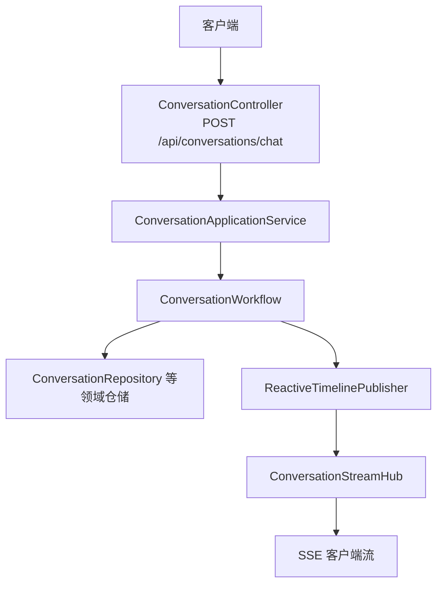
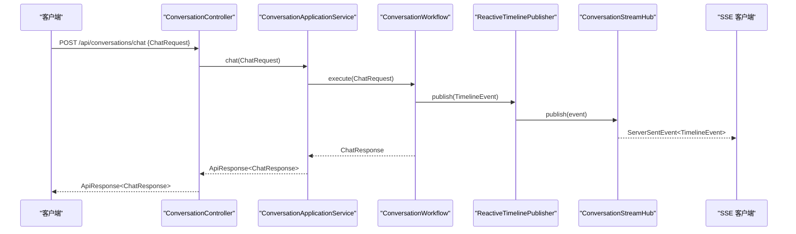
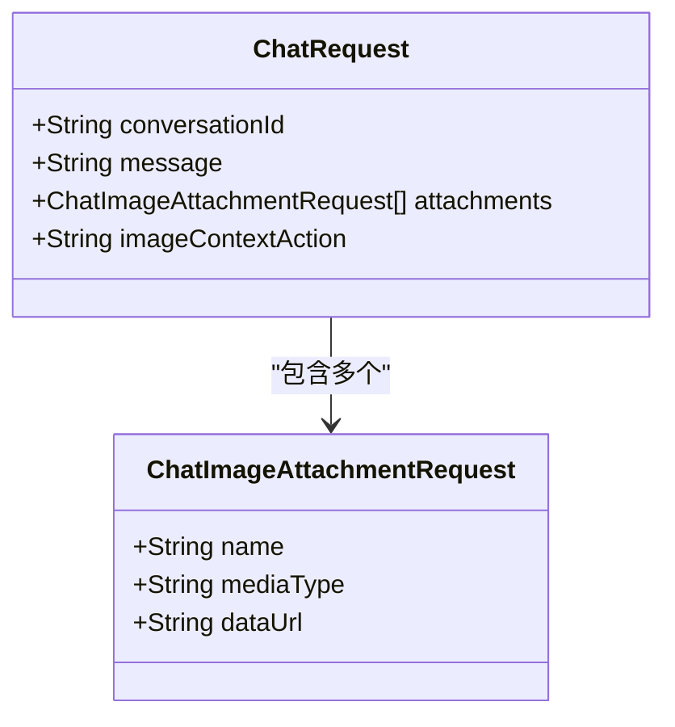
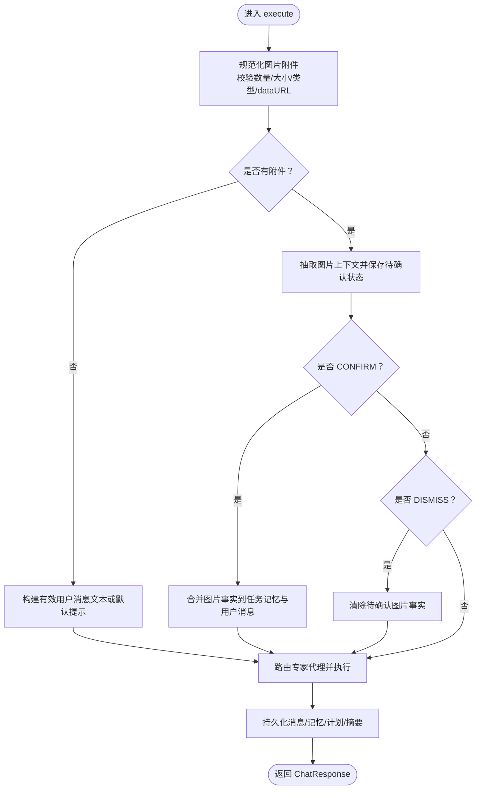
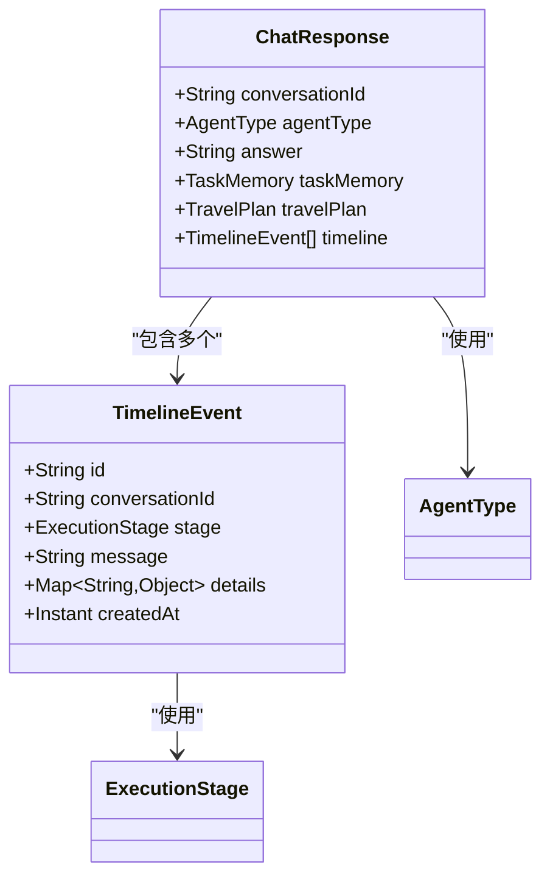
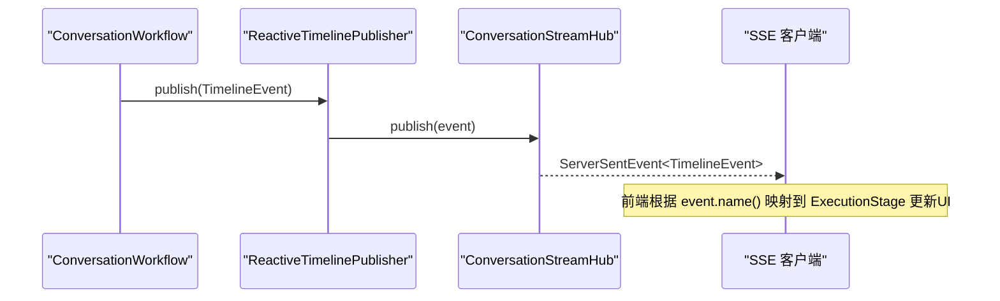
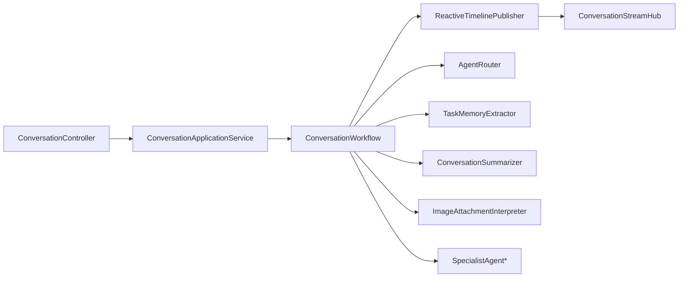

# 聊天交互API

<cite>
**本文引用的文件**
- [ConversationController.java](file://travel-agent-app/src/main/java/com/travalagent/app/controller/ConversationController.java)
- [ConversationApplicationService.java](file://travel-agent-app/src/main/java/com/travalagent/app/service/ConversationApplicationService.java)
- [ConversationWorkflow.java](file://travel-agent-app/src/main/java/com/travalagent/app/service/ConversationWorkflow.java)
- [ChatRequest.java](file://travel-agent-app/src/main/java/com/travalagent/app/dto/ChatRequest.java)
- [ChatResponse.java](file://travel-agent-app/src/main/java/com/travalagent/app/dto/ChatResponse.java)
- [ChatImageAttachmentRequest.java](file://travel-agent-app/src/main/java/com/travalagent/app/dto/ChatImageAttachmentRequest.java)
- [ConversationStreamHub.java](file://travel-agent-app/src/main/java/com/travalagent/app/stream/ConversationStreamHub.java)
- [ReactiveTimelinePublisher.java](file://travel-agent-app/src/main/java/com/travalagent/app/stream/ReactiveTimelinePublisher.java)
- [TimelineEvent.java](file://travel-agent-domain/src/main/java/com/travalagent/domain/model/entity/TimelineEvent.java)
- [AgentType.java](file://travel-agent-domain/src/main/java/com/travalagent/domain/model/valobj/AgentType.java)
- [ExecutionStage.java](file://travel-agent-domain/src/main/java/com/travalagent/domain/model/valobj/ExecutionStage.java)
- [ImageAttachment.java](file://travel-agent-domain/src/main/java/com/travalagent/domain/model/valobj/ImageAttachment.java)
- [ConversationImageAttachment.java](file://travel-agent-domain/src/main/java/com/travalagent/domain/model/entity/ConversationImageAttachment.java)
- [ConversationImageFacts.java](file://travel-agent-domain/src/main/java/com/travalagent/domain/model/entity/ConversationImageFacts.java)
- [AppException.java](file://travel-agent-types/src/main/java/com/travalagent/types/exception/AppException.java)
</cite>

## 目录
1. [简介](#简介)
2. [项目结构](#项目结构)
3. [核心组件](#核心组件)
4. [架构总览](#架构总览)
5. [详细组件分析](#详细组件分析)
6. [依赖分析](#依赖分析)
7. [性能考虑](#性能考虑)
8. [故障排查指南](#故障排查指南)
9. [结论](#结论)
10. [附录：请求与响应规范](#附录请求与响应规范)

## 简介
本文件面向“聊天交互API”的POST /api/conversations/chat端点，系统性说明以下内容：
- 请求参数结构与校验规则（ChatRequest）
- 图片附件上传与处理流程（ChatImageAttachmentRequest 及内部 ImageAttachment）
- 响应格式与语义（ChatResponse，含智能体回复、任务记忆、旅行计划、时间线事件）
- 多模态输入能力：文本消息与图片附件的混合输入
- SSE 实时流式响应集成与最佳实践
- 错误处理与参数约束

## 项目结构
该API位于应用层控制器与服务层工作流之间，采用分层设计：
- 控制器层：接收HTTP请求，返回统一响应包装
- 应用服务层：编排业务流程，调用工作流
- 工作流层：执行核心对话逻辑，处理图片上下文、路由专家代理、生成旅行计划
- 领域模型与值对象：定义Agent类型、执行阶段、时间线事件、图片附件等
- 流式发布：通过反应式通道向客户端推送SSE事件

图表来源
- [ConversationController.java:47-51](file://travel-agent-app/src/main/java/com/travalagent/app/controller/ConversationController.java#L47-L51)
- [ConversationApplicationService.java:52-54](file://travel-agent-app/src/main/java/com/travalagent/app/service/ConversationApplicationService.java#L52-L54)
- [ConversationWorkflow.java:107-160](file://travel-agent-app/src/main/java/com/travalagent/app/service/ConversationWorkflow.java#L107-L160)
- [ReactiveTimelinePublisher.java:22-26](file://travel-agent-app/src/main/java/com/travalagent/app/stream/ReactiveTimelinePublisher.java#L22-L26)
- [ConversationStreamHub.java:21-24](file://travel-agent-app/src/main/java/com/travalagent/app/stream/ConversationStreamHub.java#L21-L24)

章节来源
- [ConversationController.java:32-100](file://travel-agent-app/src/main/java/com/travalagent/app/controller/ConversationController.java#L32-L100)
- [ConversationApplicationService.java:34-50](file://travel-agent-app/src/main/java/com/travalagent/app/service/ConversationApplicationService.java#L34-L50)
- [ConversationWorkflow.java:49-104](file://travel-agent-app/src/main/java/com/travalagent/app/service/ConversationWorkflow.java#L49-L104)

## 核心组件
- 控制器：负责接收请求、触发应用服务，并以统一响应包装返回；同时提供SSE流式接口
- 应用服务：编排对话流程，调用工作流执行聊天
- 工作流：解析请求、处理图片附件、构建用户消息、路由专家代理、生成最终回答与旅行计划
- 流式发布：将执行阶段事件推送到SSE客户端
- 数据模型：定义Agent类型、执行阶段、时间线事件、图片附件及事实抽取结果

章节来源
- [ConversationController.java:39-45](file://travel-agent-app/src/main/java/com/travalagent/app/controller/ConversationController.java#L39-L45)
- [ConversationApplicationService.java:38-50](file://travel-agent-app/src/main/java/com/travalagent/app/service/ConversationApplicationService.java#L38-L50)
- [ConversationWorkflow.java:74-104](file://travel-agent-app/src/main/java/com/travalagent/app/service/ConversationWorkflow.java#L74-L104)
- [ReactiveTimelinePublisher.java:14-20](file://travel-agent-app/src/main/java/com/travalagent/app/stream/ReactiveTimelinePublisher.java#L14-L20)
- [AgentType.java:3-8](file://travel-agent-domain/src/main/java/com/travalagent/domain/model/valobj/AgentType.java#L3-L8)
- [ExecutionStage.java:3-14](file://travel-agent-domain/src/main/java/com/travalagent/domain/model/valobj/ExecutionStage.java#L3-L14)
- [TimelineEvent.java:9-33](file://travel-agent-domain/src/main/java/com/travalagent/domain/model/entity/TimelineEvent.java#L9-L33)

## 架构总览
下图展示从客户端到SSE流的完整调用链路。

图表来源
- [ConversationController.java:47-51](file://travel-agent-app/src/main/java/com/travalagent/app/controller/ConversationController.java#L47-L51)
- [ConversationApplicationService.java:52-54](file://travel-agent-app/src/main/java/com/travalagent/app/service/ConversationApplicationService.java#L52-L54)
- [ConversationWorkflow.java:496-498](file://travel-agent-app/src/main/java/com/travalagent/app/service/ConversationWorkflow.java#L496-L498)
- [ReactiveTimelinePublisher.java:22-26](file://travel-agent-app/src/main/java/com/travalagent/app/stream/ReactiveTimelinePublisher.java#L22-L26)
- [ConversationStreamHub.java:16-19](file://travel-agent-app/src/main/java/com/travalagent/app/stream/ConversationStreamHub.java#L16-L19)

## 详细组件分析

### 请求参数：ChatRequest
- 字段说明
  - conversationId：会话标识，可选；为空则自动生成
  - message：用户文本消息，可选但需与附件至少满足其一
  - attachments：图片附件列表，最多4张，每张不超过5MB
  - imageContextAction：图片上下文动作，支持 CONFIRM（确认）或 DISMISS（忽略），用于处理待确认的图片提取事实
- 参数约束
  - 至少需要提供文本消息或至少一张图片
  - 附件数量限制为4张
  - 单张图片大小不超过5MB
  - 仅允许PNG、JPEG、WEBP、GIF四种媒体类型
  - dataUrl必须为base64编码，且与声明的mediaType一致
  - imageContextAction必须为CONFIRM或DISMISS之一

图表来源
- [ChatRequest.java:7-17](file://travel-agent-app/src/main/java/com/travalagent/app/dto/ChatRequest.java#L7-L17)
- [ChatImageAttachmentRequest.java:5-10](file://travel-agent-app/src/main/java/com/travalagent/app/dto/ChatImageAttachmentRequest.java#L5-L10)

章节来源
- [ChatRequest.java:7-17](file://travel-agent-app/src/main/java/com/travalagent/app/dto/ChatRequest.java#L7-L17)
- [ChatImageAttachmentRequest.java:5-10](file://travel-agent-app/src/main/java/com/travalagent/app/dto/ChatImageAttachmentRequest.java#L5-L10)
- [ConversationWorkflow.java:523-575](file://travel-agent-app/src/main/java/com/travalagent/app/service/ConversationWorkflow.java#L523-L575)

### 图片附件上传与处理流程
- 输入：ChatImageAttachmentRequest 列表
- 规范化与校验
  - 解析dataUrl，校验base64格式与媒体类型一致性
  - 校验媒体类型是否在允许集合内
  - 校验单张图片字节数不超过阈值
  - 生成内部 ImageAttachment 值对象，包含id、名称、媒体类型、dataUrl与字节数
- 图片上下文处理
  - 当未显式CONFIRM或DISMISS时，先进行图片上下文抽取，保存待确认状态
  - CONFIRM：使用已抽取的事实补充任务记忆与用户消息
  - DISMISS：丢弃待确认的图片事实，继续纯文本对话
- 存储与元数据
  - 将图片附件与抽取的事实存入会话上下文，供后续对话使用

图表来源
- [ConversationWorkflow.java:107-160](file://travel-agent-app/src/main/java/com/travalagent/app/service/ConversationWorkflow.java#L107-L160)
- [ConversationWorkflow.java:162-272](file://travel-agent-app/src/main/java/com/travalagent/app/service/ConversationWorkflow.java#L162-L272)
- [ConversationWorkflow.java:534-575](file://travel-agent-app/src/main/java/com/travalagent/app/service/ConversationWorkflow.java#L534-L575)
- [ImageAttachment.java:8-33](file://travel-agent-domain/src/main/java/com/travalagent/domain/model/valobj/ImageAttachment.java#L8-L33)

章节来源
- [ConversationWorkflow.java:107-160](file://travel-agent-app/src/main/java/com/travalagent/app/service/ConversationWorkflow.java#L107-L160)
- [ConversationWorkflow.java:162-272](file://travel-agent-app/src/main/java/com/travalagent/app/service/ConversationWorkflow.java#L162-L272)
- [ConversationWorkflow.java:534-575](file://travel-agent-app/src/main/java/com/travalagent/app/service/ConversationWorkflow.java#L534-L575)
- [ImageAttachment.java:8-33](file://travel-agent-domain/src/main/java/com/travalagent/domain/model/valobj/ImageAttachment.java#L8-L33)

### 响应格式：ChatResponse
- 字段说明
  - conversationId：会话标识
  - agentType：执行的智能体类型（如GENERAL、WEATHER、GEO、TRAVEL_PLANNER）
  - answer：智能体回复内容
  - taskMemory：任务记忆（目的地、天数、预算、偏好等）
  - travelPlan：结构化旅行计划（可能为空）
  - timeline：执行阶段时间线事件列表
- 时间线事件
  - 每个事件包含阶段（ExecutionStage）、简要描述与细节字段
  - 通过SSE流实时推送，便于前端展示执行进度

图表来源
- [ChatResponse.java:10-18](file://travel-agent-app/src/main/java/com/travalagent/app/dto/ChatResponse.java#L10-L18)
- [TimelineEvent.java:9-33](file://travel-agent-domain/src/main/java/com/travalagent/domain/model/entity/TimelineEvent.java#L9-L33)
- [AgentType.java:3-8](file://travel-agent-domain/src/main/java/com/travalagent/domain/model/valobj/AgentType.java#L3-L8)
- [ExecutionStage.java:3-14](file://travel-agent-domain/src/main/java/com/travalagent/domain/model/valobj/ExecutionStage.java#L3-L14)

章节来源
- [ChatResponse.java:10-18](file://travel-agent-app/src/main/java/com/travalagent/app/dto/ChatResponse.java#L10-L18)
- [TimelineEvent.java:9-33](file://travel-agent-domain/src/main/java/com/travalagent/domain/model/entity/TimelineEvent.java#L9-L33)
- [ExecutionStage.java:3-14](file://travel-agent-domain/src/main/java/com/travalagent/domain/model/valobj/ExecutionStage.java#L3-L14)

### SSE 实时流式响应与集成
- 推送机制
  - 工作流在关键阶段发布 TimelineEvent
  - ReactiveTimelinePublisher 将事件写入仓储并转发给 ConversationStreamHub
  - ConversationStreamHub 使用反应式Sink将事件推送给订阅者
- 客户端集成
  - 使用 GET /api/conversations/{conversationId}/stream 订阅SSE
  - 事件类型为 TimelineEvent，事件名映射为 ExecutionStage 名称
  - 建议前端按阶段名聚合UI更新，如显示“分析查询”、“选择代理”等

图表来源
- [ConversationWorkflow.java:496-498](file://travel-agent-app/src/main/java/com/travalagent/app/service/ConversationWorkflow.java#L496-L498)
- [ReactiveTimelinePublisher.java:22-26](file://travel-agent-app/src/main/java/com/travalagent/app/stream/ReactiveTimelinePublisher.java#L22-L26)
- [ConversationStreamHub.java:16-19](file://travel-agent-app/src/main/java/com/travalagent/app/stream/ConversationStreamHub.java#L16-L19)
- [ConversationController.java:92-99](file://travel-agent-app/src/main/java/com/travalagent/app/controller/ConversationController.java#L92-L99)

章节来源
- [ConversationController.java:92-99](file://travel-agent-app/src/main/java/com/travalagent/app/controller/ConversationController.java#L92-L99)
- [ConversationStreamHub.java:12-32](file://travel-agent-app/src/main/java/com/travalagent/app/stream/ConversationStreamHub.java#L12-L32)
- [ReactiveTimelinePublisher.java:8-27](file://travel-agent-app/src/main/java/com/travalagent/app/stream/ReactiveTimelinePublisher.java#L8-L27)

### 错误处理与参数约束
- 参数校验
  - 文本与图片至少满足其一
  - 附件数量上限与大小限制
  - 媒体类型白名单
  - dataUrl必须为base64且与声明类型一致
  - imageContextAction取值限定
- 异常类型
  - 使用 AppException 抛出业务异常，携带响应码与消息
  - 控制器层统一包装为 ApiResponse 返回

章节来源
- [ConversationWorkflow.java:523-575](file://travel-agent-app/src/main/java/com/travalagent/app/service/ConversationWorkflow.java#L523-L575)
- [AppException.java:5-22](file://travel-agent-types/src/main/java/com/travalagent/types/exception/AppException.java#L5-L22)
- [ConversationController.java:47-51](file://travel-agent-app/src/main/java/com/travalagent/app/controller/ConversationController.java#L47-L51)

## 依赖分析
- 组件耦合
  - ConversationController 依赖 ConversationApplicationService 与 ConversationStreamHub
  - ConversationApplicationService 依赖 ConversationWorkflow 与仓储网关
  - ConversationWorkflow 依赖多个领域服务与值对象
- 关键依赖链
  - 控制器 → 应用服务 → 工作流 → 领域服务/仓储 → 流式发布
- 循环依赖
  - 未发现循环依赖

图表来源
- [ConversationController.java:36-45](file://travel-agent-app/src/main/java/com/travalagent/app/controller/ConversationController.java#L36-L45)
- [ConversationApplicationService.java:38-50](file://travel-agent-app/src/main/java/com/travalagent/app/service/ConversationApplicationService.java#L38-L50)
- [ConversationWorkflow.java:84-104](file://travel-agent-app/src/main/java/com/travalagent/app/service/ConversationWorkflow.java#L84-L104)

章节来源
- [ConversationController.java:36-45](file://travel-agent-app/src/main/java/com/travalagent/app/controller/ConversationController.java#L36-L45)
- [ConversationApplicationService.java:38-50](file://travel-agent-app/src/main/java/com/travalagent/app/service/ConversationApplicationService.java#L38-L50)
- [ConversationWorkflow.java:84-104](file://travel-agent-app/src/main/java/com/travalagent/app/service/ConversationWorkflow.java#L84-L104)

## 性能考虑
- 并发与线程池
  - 控制器使用有界弹性调度器执行应用服务，避免阻塞Web线程
- 流式推送
  - 使用反应式Sink与Flux，支持高并发SSE推送
- 内存窗口与摘要阈值
  - 工作流通过配置项控制记忆窗口与摘要阈值，平衡性能与效果
- 图片处理
  - 严格限制附件数量与大小，避免内存压力

章节来源
- [ConversationController.java:49-50](file://travel-agent-app/src/main/java/com/travalagent/app/controller/ConversationController.java#L49-L50)
- [ConversationWorkflow.java:331-346](file://travel-agent-app/src/main/java/com/travalagent/app/service/ConversationWorkflow.java#L331-L346)

## 故障排查指南
- 常见错误与定位
  - 参数非法：检查附件数量/大小/媒体类型/dataURL格式与imageContextAction取值
  - 会话不存在或缺失：DISMISS操作要求提供conversationId
  - 未提供文本或图片：至少满足其一
- 建议排查步骤
  - 核对请求体结构与必填字段
  - 查看SSE流中 ExecutionStage 的变化，定位卡顿阶段
  - 检查后端日志中的 AppException 响应码与消息

章节来源
- [ConversationWorkflow.java:523-580](file://travel-agent-app/src/main/java/com/travalagent/app/service/ConversationWorkflow.java#L523-L580)
- [ConversationWorkflow.java:226-272](file://travel-agent-app/src/main/java/com/travalagent/app/service/ConversationWorkflow.java#L226-L272)
- [AppException.java:5-22](file://travel-agent-types/src/main/java/com/travalagent/types/exception/AppException.java#L5-L22)

## 结论
POST /api/conversations/chat 提供了完整的多模态聊天能力，支持文本与图片混合输入，并通过SSE实时反馈执行阶段。工作流层负责严谨的参数校验、图片上下文抽取与专家代理路由，确保高质量的旅行规划体验。建议在生产环境中结合SSE进度条与错误重试策略，提升用户体验。

## 附录：请求与响应规范

### 请求示例与场景
- 纯文本聊天
  - 场景：直接输入旅行需求
  - 关键点：message非空，attachments为空
- 图片识别
  - 场景：上传旅行照片，自动抽取上下文
  - 关键点：attachments非空，mediaType与dataURL匹配，数量≤4，大小≤5MB
- 多轮对话
  - 场景：首次上传图片并确认，后续继续文本对话
  - 关键点：conversationId保持一致；第二次请求可设置 imageContextAction=CONFIRM/DISMISS

### 请求参数清单（ChatRequest）
- conversationId：字符串，可选
- message：字符串，可选但需与附件至少满足其一
- attachments：数组，元素为 ChatImageAttachmentRequest
  - name：字符串，可选
  - mediaType：字符串，必填，允许值：image/png, image/jpeg, image/webp, image/gif
  - dataUrl：字符串，必填，格式为 data:...;base64,...
- imageContextAction：字符串，可选，取值：CONFIRM 或 DISMISS

章节来源
- [ChatRequest.java:7-17](file://travel-agent-app/src/main/java/com/travalagent/app/dto/ChatRequest.java#L7-L17)
- [ChatImageAttachmentRequest.java:5-10](file://travel-agent-app/src/main/java/com/travalagent/app/dto/ChatImageAttachmentRequest.java#L5-L10)
- [ConversationWorkflow.java:523-575](file://travel-agent-app/src/main/java/com/travalagent/app/service/ConversationWorkflow.java#L523-L575)

### 响应字段清单（ChatResponse）
- conversationId：字符串
- agentType：枚举，取值：GENERAL, WEATHER, GEO, TRAVEL_PLANNER
- answer：字符串
- taskMemory：对象，包含目的地、天数、预算、偏好等
- travelPlan：对象，旅行计划（可能为空）
- timeline：数组，元素为 TimelineEvent
  - id：字符串
  - conversationId：字符串
  - stage：枚举，取值：ANALYZE_QUERY, RECALL_MEMORY, SELECT_AGENT, SPECIALIST, CALL_TOOL, VALIDATE_PLAN, REPAIR_PLAN, FINALIZE_MEMORY, COMPLETED, ERROR
  - message：字符串
  - details：对象
  - createdAt：时间戳

章节来源
- [ChatResponse.java:10-18](file://travel-agent-app/src/main/java/com/travalagent/app/dto/ChatResponse.java#L10-L18)
- [TimelineEvent.java:9-33](file://travel-agent-domain/src/main/java/com/travalagent/domain/model/entity/TimelineEvent.java#L9-L33)
- [AgentType.java:3-8](file://travel-agent-domain/src/main/java/com/travalagent/domain/model/valobj/AgentType.java#L3-L8)
- [ExecutionStage.java:3-14](file://travel-agent-domain/src/main/java/com/travalagent/domain/model/valobj/ExecutionStage.java#L3-L14)

### SSE 流式事件
- 端点：GET /api/conversations/{conversationId}/stream
- 事件类型：ServerSentEvent<TimelineEvent>
- 事件名：ExecutionStage 名称
- 建议前端实践
  - 按阶段名映射UI状态
  - 对于图片上下文阶段，展示“等待确认/忽略”按钮
  - 在COMPLETED阶段停止加载动画并展示最终answer与travelPlan

章节来源
- [ConversationController.java:92-99](file://travel-agent-app/src/main/java/com/travalagent/app/controller/ConversationController.java#L92-L99)
- [ConversationStreamHub.java:21-24](file://travel-agent-app/src/main/java/com/travalagent/app/stream/ConversationStreamHub.java#L21-L24)
- [ReactiveTimelinePublisher.java:22-26](file://travel-agent-app/src/main/java/com/travalagent/app/stream/ReactiveTimelinePublisher.java#L22-L26)