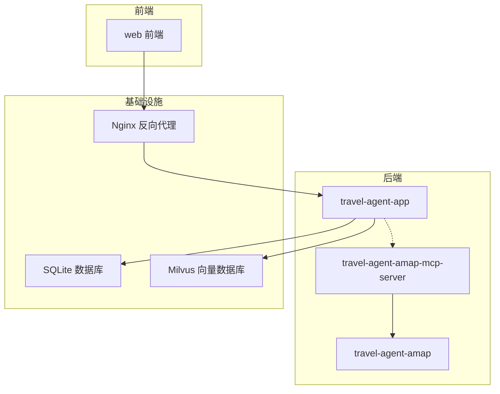
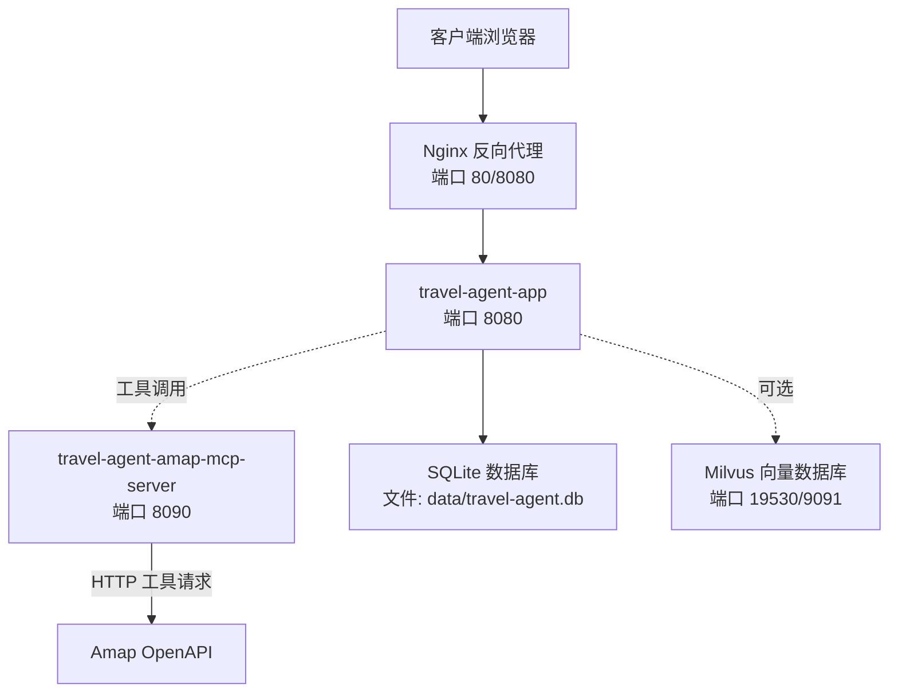
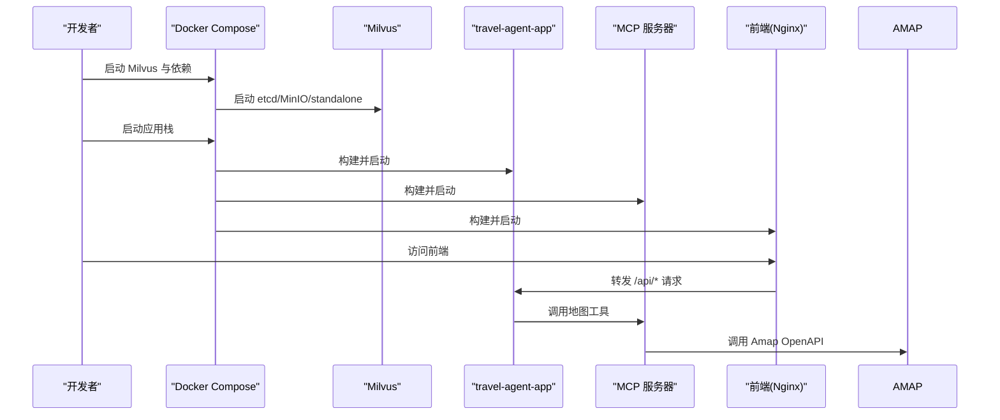
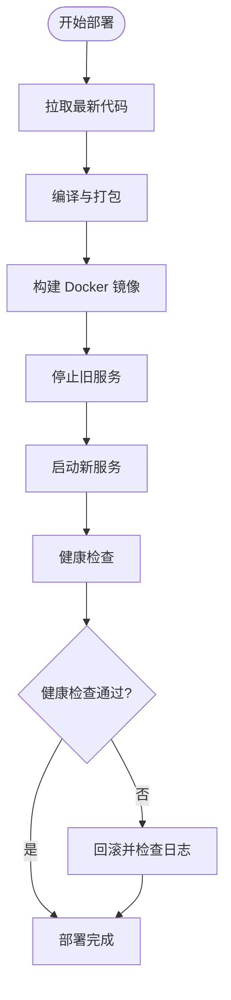
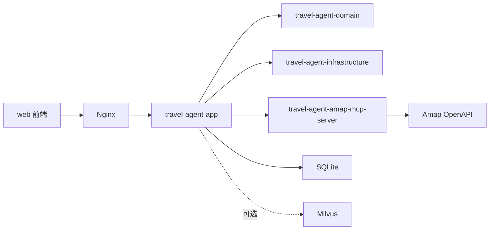

# 部署指南

<cite>
**本文档引用的文件**
- [docs/deployment-guide.md](file://docs/deployment-guide.md)
- [README.md](file://README.md)
- [docker-compose.app.yml](file://docker-compose.app.yml)
- [docker-compose.milvus.yml](file://docker-compose.milvus.yml)
- [Dockerfile.mcp](file://Dockerfile.mcp)
- [web/Dockerfile](file://web/Dockerfile)
- [web/nginx.conf](file://web/nginx.conf)
- [travel-agent-app/src/main/resources/application.yml](file://travel-agent-app/src/main/resources/application.yml)
- [travel-agent-app/src/main/resources/application-prod.yml](file://travel-agent-app/src/main/resources/application-prod.yml)
- [docs/system-architecture.md](file://docs/system-architecture.md)
- [docs/operations.md](file://docs/operations.md)
</cite>

## 目录
1. [简介](#简介)
2. [项目结构](#项目结构)
3. [核心组件](#核心组件)
4. [架构总览](#架构总览)
5. [详细组件分析](#详细组件分析)
6. [依赖关系分析](#依赖关系分析)
7. [性能考虑](#性能考虑)
8. [故障排除指南](#故障排除指南)
9. [结论](#结论)
10. [附录](#附录)

## 简介
本部署指南面向不同规模与需求的用户，提供从本地开发到生产环境的完整部署路径，涵盖 Docker Compose、Kubernetes、云服务（AWS/Aliyun）以及监控运维等关键环节。系统采用多模块分层设计，后端基于 Spring Boot 4，前端基于 Vue 3，支持向量检索（Milvus）、Amap 地图能力集成，并通过 MCP 工具链实现外部能力的统一接入。

## 项目结构
项目采用多模块 Maven 结构，结合 Docker 化部署，主要模块与职责如下：
- travel-agent-app：后端 REST API、SSE 流、健康检查与对话工作流
- travel-agent-domain：领域模型、值对象、仓库接口与网关契约
- travel-agent-infrastructure：LLM 专家代理、检索、持久化适配器、校验与修复器
- travel-agent-amap：Amap HTTP 网关模块
- travel-agent-amap-mcp-server：独立 MCP 服务器，提供 Amap 工具能力
- travel-agent-types：共享响应封装与异常类型
- web：Vue 3 前端工作区
- scripts：知识准备与离线反馈分析脚本
- docs：架构说明、运维手册与截图资源

图表来源
- [docker-compose.app.yml:1-62](file://docker-compose.app.yml#L1-L62)
- [web/nginx.conf:1-30](file://web/nginx.conf#L1-L30)
- [travel-agent-app/src/main/resources/application.yml:1-100](file://travel-agent-app/src/main/resources/application.yml#L1-L100)

章节来源
- [README.md:236-261](file://README.md#L236-L261)
- [docs/system-architecture.md:12-29](file://docs/system-architecture.md#L12-L29)

## 核心组件
- 后端应用（Spring Boot 4）
  - 提供 REST API、SSE 实时流、健康检查与对话工作流
  - 默认监听 8080 端口，支持 SQLite 本地存储与可选 Milvus 向量存储
- MCP 服务器（Amap 工具）
  - 独立运行，为后端提供地图工具能力（如 POI 查询、天气、路线规划）
- 前端（Vue 3 + Vite）
  - 通过 Nginx 反代，静态资源由 Nginx 提供，API 请求转发至后端
- 向量数据库（Milvus）
  - 可选启用，用于目的地知识检索与长期记忆存储
- 反向代理（Nginx）
  - 统一入口，处理静态资源、API 转发与安全头

章节来源
- [travel-agent-app/src/main/resources/application.yml:1-100](file://travel-agent-app/src/main/resources/application.yml#L1-L100)
- [web/Dockerfile:1-22](file://web/Dockerfile#L1-L22)
- [docker-compose.milvus.yml:1-64](file://docker-compose.milvus.yml#L1-L64)

## 架构总览
下图展示系统在容器化部署下的整体交互关系，包括前端、后端、MCP 服务器、反向代理与可选向量数据库。

图表来源
- [docker-compose.app.yml:1-62](file://docker-compose.app.yml#L1-L62)
- [docker-compose.milvus.yml:1-64](file://docker-compose.milvus.yml#L1-L64)
- [web/nginx.conf:1-30](file://web/nginx.conf#L1-L30)

## 详细组件分析

### 本地开发环境
- 前置要求
  - Java 21+
  - Maven 3.9+
  - Node.js 18+
  - Docker 24+（可选）
- 快速启动流程
  - 准备环境变量文件，复制示例并填写必要密钥
  - 后端启动：在 travel-agent-app 模块执行 Spring Boot 运行命令
  - 前端启动：进入 web 目录安装依赖并运行开发服务器
  - 访问地址：前端 http://localhost:5173，后端 http://localhost:8080

章节来源
- [docs/deployment-guide.md:27-71](file://docs/deployment-guide.md#L27-L71)
- [README.md:141-192](file://README.md#L141-L192)

### Docker Compose 部署（推荐）
- 启动 Milvus 及其依赖（etcd、MinIO）
  - 使用 docker-compose.milvus.yml 启动 Milvus 单机版及相关组件
  - 检查服务状态与查看日志
- 启动应用
  - 使用 docker-compose.app.yml 构建并启动后端、MCP 服务器与前端
  - 访问地址：前端 http://localhost:80，后端 API http://localhost:8080，Swagger 文档 http://localhost:8080/swagger-ui.html
- 停止服务
  - 停止所有服务或停止并删除数据卷（会清空 Milvus 与 SQLite 数据）

图表来源
- [docker-compose.app.yml:1-62](file://docker-compose.app.yml#L1-L62)
- [docker-compose.milvus.yml:1-64](file://docker-compose.milvus.yml#L1-L64)
- [web/nginx.conf:1-30](file://web/nginx.conf#L1-L30)

章节来源
- [docs/deployment-guide.md:75-129](file://docs/deployment-guide.md#L75-L129)

### 手动 Docker 构建
- 构建后端镜像：使用 Dockerfile.app 构建 travel-agent-app 镜像
- 构建 MCP 服务器镜像：使用 Dockerfile.mcp 构建 travel-agent-mcp 镜像
- 运行容器：映射端口、设置环境变量、网络连接与数据卷挂载

章节来源
- [docs/deployment-guide.md:131-163](file://docs/deployment-guide.md#L131-L163)

### 生产环境部署
- 环境要求
  - CPU 4 核起、内存 8GB 起、磁盘 50GB SSD 起、网络 100Mbps 起
- 数据库配置
  - Milvus 生产配置：限制 CPU/内存、持久化数据卷、独立 etcd/MinIO
  - 应用配置：PostgreSQL 连接、OpenAI API 密钥、Milvus 连接参数、日志级别与滚动策略
- 安全配置
  - 环境变量：数据库凭据、OpenAI API Key、Milvus 主机、会话与 JWT 密钥
  - Nginx 配置：强制 HTTPS、SSL 证书、SSE 支持、安全头、静态资源缓存
- 部署脚本
  - 自动化拉取代码、编译打包、构建镜像、停止旧服务、启动新服务、健康检查与回滚

图表来源
- [docs/deployment-guide.md:342-385](file://docs/deployment-guide.md#L342-L385)

章节来源
- [docs/deployment-guide.md:166-385](file://docs/deployment-guide.md#L166-L385)

### 云服务部署
- AWS 部署
  - ECS 任务定义：Fargate 规格、容器端口映射、Secrets 管理、日志输出
  - RDS PostgreSQL：创建实例、设置备份与存储
- 阿里云部署
  - ACK Kubernetes：Deployment 多副本、Service 负载均衡、探针配置

章节来源
- [docs/deployment-guide.md:389-516](file://docs/deployment-guide.md#L389-L516)

### 监控与运维
- Spring Boot Actuator
  - 暴露健康、指标、信息端点，Prometheus 导出
- Prometheus + Grafana
  - 配置抓取目标与可视化面板
- 日志管理
  - 实时日志查看、导出与清理策略
- 备份策略
  - Milvus 集合备份、配置文件打包、定期清理

章节来源
- [docs/deployment-guide.md:519-635](file://docs/deployment-guide.md#L519-L635)

### 故障排除
- 常见问题
  - 应用启动失败：查看日志、检查环境变量、确认数据库状态、排查端口占用
  - 向量检索失败：检查 Milvus 健康、集合存在性、重建集合与重新导入数据
  - 内存不足：查看容器内存使用、调整 Docker 资源限制、调整 JVM 参数
  - 性能问题：启用飞行记录器、查看慢查询指标、检查 Milvus 性能、添加缓存
- 性能调优
  - JVM 参数：G1 垃圾回收、最大堆、堆转储路径
  - 数据库连接池：HikariCP 最大池大小、空闲超时、连接超时

章节来源
- [docs/deployment-guide.md:639-748](file://docs/deployment-guide.md#L639-L748)

## 依赖关系分析
- 组件耦合
  - travel-agent-app 依赖 travel-agent-domain 的领域契约与 travel-agent-infrastructure 的实现
  - MCP 服务器独立于主应用，通过 HTTP 工具回调与 Amap OpenAPI 交互
  - 前端通过 Nginx 反向代理访问后端 API，SSE 事件流经后端推送
- 外部依赖
  - OpenAI 兼容聊天与嵌入服务
  - SQLite 本地存储与可选 Milvus 向量存储
  - Amap OpenAPI 提供 POI、天气与路线能力

图表来源
- [docs/system-architecture.md:12-29](file://docs/system-architecture.md#L12-L29)
- [docker-compose.app.yml:1-62](file://docker-compose.app.yml#L1-L62)

章节来源
- [docs/system-architecture.md:12-49](file://docs/system-architecture.md#L12-L49)

## 性能考虑
- JVM 参数建议
  - 生产环境推荐：G1 垃圾回收、合理堆大小、堆转储路径与安全熵源
- 数据库连接池
  - HikariCP 最大池大小、最小空闲、空闲超时、最大生命周期与连接超时
- 向量检索
  - Milvus 索引类型与参数、集合初始化、嵌入维度与度量类型
- 前端性能
  - Nginx 静态资源缓存、SSE 关闭缓冲、代理头透传

章节来源
- [docs/deployment-guide.md:721-748](file://docs/deployment-guide.md#L721-L748)
- [travel-agent-app/src/main/resources/application.yml:10-16](file://travel-agent-app/src/main/resources/application.yml#L10-L16)

## 故障排除指南
- 应用启动失败
  - 查看后端容器日志、检查环境变量注入、验证 Milvus 健康状态、确认端口未被占用
- 向量检索失败
  - 检查 Milvus 集合是否存在、重建集合、重新导入知识数据
- 内存不足
  - 调整 Docker 资源限制、优化 JVM 参数、减少并发与批处理大小
- 性能问题
  - 启用 Flight Recorder 分析、查看慢查询指标、检查 Milvus 查询性能、引入缓存策略

章节来源
- [docs/deployment-guide.md:639-719](file://docs/deployment-guide.md#L639-L719)

## 结论
本指南提供了从本地开发到生产部署的完整路径，覆盖 Docker Compose、Kubernetes、云平台部署与监控运维。通过合理的资源配置、安全加固与性能调优，可在不同规模场景中稳定运行 TravelAgent 系统。

## 附录
- 相关文档与资源
  - 项目介绍与技术栈：[README.md](file://README.md)
  - 系统架构说明：[docs/system-architecture.md](file://docs/system-architecture.md)
  - 运维操作手册：[docs/operations.md](file://docs/operations.md)
  - 部署指南全文：[docs/deployment-guide.md](file://docs/deployment-guide.md)