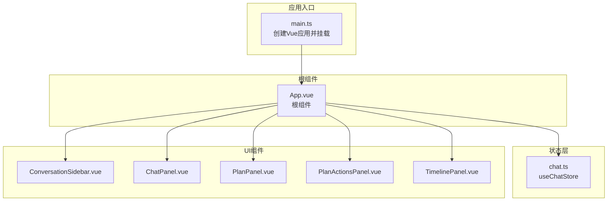
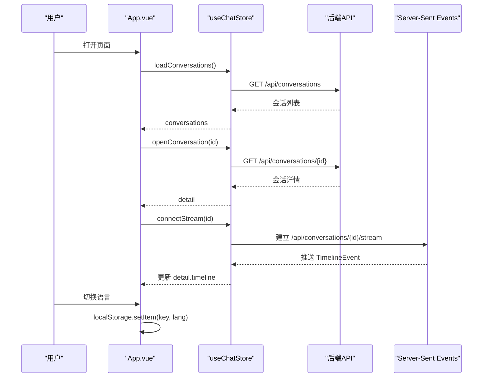
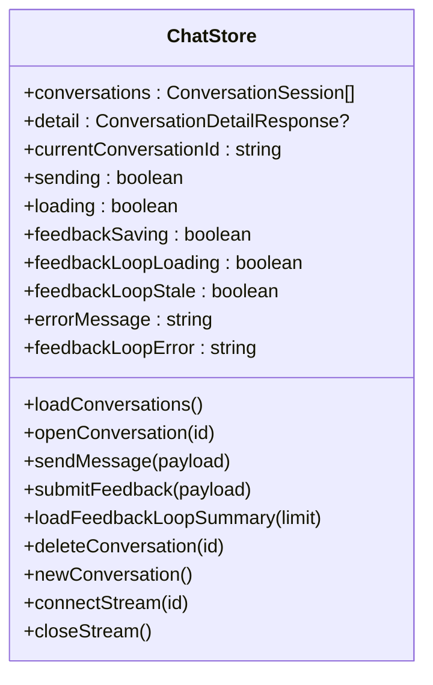
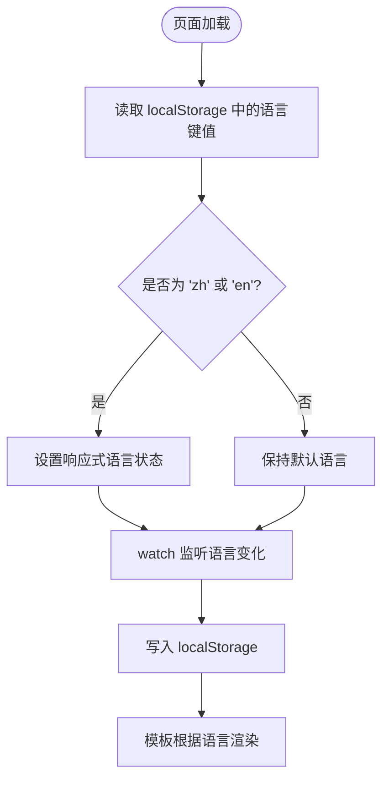
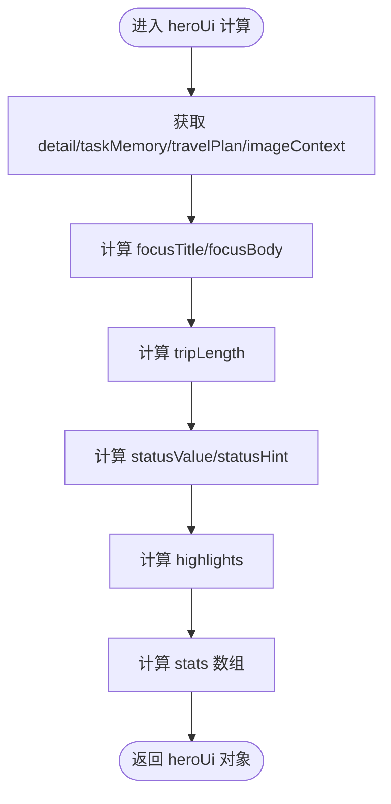
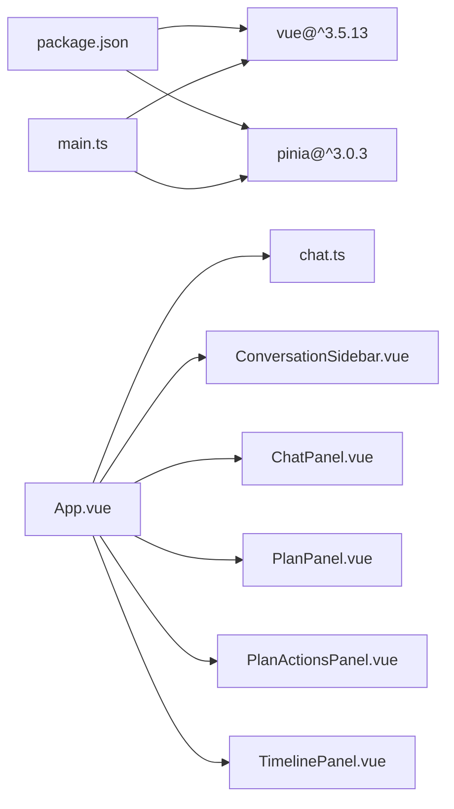

# App主组件

<cite>
**本文档引用的文件**
- [App.vue](file://web/src/App.vue)
- [main.ts](file://web/src/main.ts)
- [chat.ts](file://web/src/stores/chat.ts)
- [ChatPanel.vue](file://web/src/components/ChatPanel.vue)
- [TimelinePanel.vue](file://web/src/components/TimelinePanel.vue)
- [PlanPanel.vue](file://web/src/components/PlanPanel.vue)
- [PlanActionsPanel.vue](file://web/src/components/PlanActionsPanel.vue)
- [ConversationSidebar.vue](file://web/src/components/ConversationSidebar.vue)
- [text.ts](file://web/src/utils/text.ts)
- [api.ts](file://web/src/types/api.ts)
- [package.json](file://web/package.json)
</cite>

## 目录
1. [简介](#简介)
2. [项目结构](#项目结构)
3. [核心组件](#核心组件)
4. [架构总览](#架构总览)
5. [详细组件分析](#详细组件分析)
6. [依赖关系分析](#依赖关系分析)
7. [性能考虑](#性能考虑)
8. [故障排除指南](#故障排除指南)
9. [结论](#结论)
10. [附录](#附录)

## 简介
本文件聚焦于App主组件（App.vue），系统性解析其作为旅行规划工作台根组件的设计与实现。内容涵盖：
- 组件树结构与布局组织
- Pinia状态管理集成（useChatStore）与响应式数据流
- 语言切换与本地存储持久化
- hero区域数据展示逻辑（任务记忆、旅行计划、时间线）
- 最佳实践建议（模板结构、事件处理、生命周期）

## 项目结构
Web前端采用Vue 3 + TypeScript + Vite构建，状态管理基于Pinia。App.vue位于web/src目录下，是应用入口根组件，负责：
- 全局状态接入（Pinia）
- 侧边栏会话管理
- 主工作区布局（聊天面板、方案面板、时间线面板）
- 语言切换与本地存储
- hero区域信息聚合展示

图表来源
- [main.ts:1-7](file://web/src/main.ts#L1-L7)
- [App.vue:1-381](file://web/src/App.vue#L1-L381)
- [chat.ts:1-196](file://web/src/stores/chat.ts#L1-L196)

章节来源
- [main.ts:1-7](file://web/src/main.ts#L1-L7)
- [App.vue:1-381](file://web/src/App.vue#L1-L381)

## 核心组件
- App.vue：根组件，承载全局布局、状态注入、语言切换、hero区域渲染与子组件编排。
- useChatStore：Pinia仓库，统一管理会话列表、当前会话详情、发送状态、反馈状态、错误信息以及服务端事件流。
- 子组件：
  - ConversationSidebar：会话列表与操作（新建、选择、删除）
  - ChatPanel：消息对话、图片附件、简报摘要、提示词建议、反馈提交
  - PlanPanel：旅行方案概览、决策卡片、预算与约束检查、每日行程
  - PlanActionsPanel：旅行手账导出（分享版/执行版）
  - TimelinePanel：生成过程时间线事件

章节来源
- [App.vue:1-381](file://web/src/App.vue#L1-L381)
- [chat.ts:1-196](file://web/src/stores/chat.ts#L1-L196)
- [ConversationSidebar.vue:1-88](file://web/src/components/ConversationSidebar.vue#L1-L88)
- [ChatPanel.vue:1-797](file://web/src/components/ChatPanel.vue#L1-L797)
- [PlanPanel.vue:1-800](file://web/src/components/PlanPanel.vue#L1-L800)
- [PlanActionsPanel.vue:1-334](file://web/src/components/PlanActionsPanel.vue#L1-L334)
- [TimelinePanel.vue:1-157](file://web/src/components/TimelinePanel.vue#L1-L157)

## 架构总览
App.vue通过Pinia集中管理应用状态，并以响应式计算属性驱动hero区域与各子面板的数据展示。语言切换通过localStorage持久化，确保刷新后仍保持用户偏好。

图表来源
- [App.vue:264-270](file://web/src/App.vue#L264-L270)
- [chat.ts:32-56](file://web/src/stores/chat.ts#L32-L56)
- [chat.ts:146-164](file://web/src/stores/chat.ts#L146-L164)

## 详细组件分析

### App.vue：根组件与状态管理
- 状态注入与解构
  - 使用useChatStore获取会话列表、当前会话ID、详情、发送状态、加载状态、反馈保存状态、错误信息等。
  - 通过storeToRefs进行响应式解构，保证模板中直接使用响应式引用。
- 语言切换与持久化
  - 初始化从localStorage读取语言键值；watch监听语言变化并写回localStorage。
  - 提供setLanguage方法与按钮交互，支持中英文切换。
- hero区域数据聚合
  - heroCopy：根据语言返回不同文案。
  - heroUi：综合任务记忆、旅行计划、图片上下文候选等，动态生成焦点标题、描述、高亮标签与统计指标。
  - heroFlow：根据任务记忆、旅行计划与时间线长度判断三阶段流程状态（采集需求、核对地点、输出方案）。
- 工作区布局
  - 侧边栏：会话列表、新建、选择、删除
  - 聊天面板：消息展示、图片附件、简报摘要、提示词建议、反馈提交
  - 方案面板：概览、决策卡片、预算与约束检查、每日行程
  - 时间线面板：生成过程事件流
- 生命周期
  - onMounted：加载会话列表并打开首个或当前会话

章节来源
- [App.vue:1-381](file://web/src/App.vue#L1-L381)
- [chat.ts:1-196](file://web/src/stores/chat.ts#L1-L196)

### Pinia状态管理集成（useChatStore）
- 数据模型
  - conversations：会话数组
  - detail：当前会话详情（含消息、旅行计划、任务记忆、时间线、反馈、图片上下文候选）
  - currentConversationId：当前选中会话ID
  - sending/loading/feedbackSaving/feedbackLoopLoading/feedbackLoopStale/errorMessage/feedbackLoopError：状态标志与错误信息
- 关键方法
  - loadConversations：拉取会话列表
  - openConversation：打开指定会话并建立SSE连接
  - sendMessage：发送消息或图片附件，自动刷新会话列表并打开新会话
  - submitFeedback：提交反馈
  - loadFeedbackLoopSummary：加载反馈循环摘要
  - deleteConversation/newConversation：会话管理
  - connectStream/closeStream：SSE事件流管理
- 错误处理
  - formatError统一格式化错误信息，避免未捕获异常导致崩溃

图表来源
- [chat.ts:15-196](file://web/src/stores/chat.ts#L15-L196)

章节来源
- [chat.ts:1-196](file://web/src/stores/chat.ts#L1-L196)

### 语言切换与本地存储
- 语言键名常量：用于localStorage的键名
- 初始化：在浏览器环境下读取localStorage中的语言值，若为'zh'或'en'则设置为当前语言
- 持久化：watch监听语言变化，写入localStorage
- 视图：hero区域语言按钮绑定setLanguage方法，实时切换

图表来源
- [App.vue:27-40](file://web/src/App.vue#L27-L40)

章节来源
- [App.vue:12-40](file://web/src/App.vue#L12-L40)

### hero区域数据展示逻辑
- heroCopy：根据preferChinese返回不同文案
- heroUi：
  - focusTitle：优先取任务记忆的目的地或旅行计划标题，否则显示占位文案
  - focusBody：若存在旅行计划则显示摘要，否则取任务记忆摘要或图片待确认提示
  - tripLength：旅行计划天数或任务记忆天数
  - statusValue/statusHint：根据是否有图片待确认、旅行计划是否存在、任务记忆是否存在决定状态与提示
  - highlights：旅行计划高亮、任务记忆偏好或默认高亮
  - stats：统计项包括已保存会话数、当前消息数、行程窗口、当前状态
- heroFlow：
  - intakeDone：当任务记忆包含目的地、天数且预算或偏好存在时视为完成
  - groundingDone：当旅行计划存在、有图片待确认或时间线长度大于0时视为完成
  - planDone：旅行计划存在即完成
  - 三阶段状态：等待/进行中/已完成

图表来源
- [App.vue:60-184](file://web/src/App.vue#L60-L184)
- [App.vue:186-258](file://web/src/App.vue#L186-L258)

章节来源
- [App.vue:48-184](file://web/src/App.vue#L48-L184)
- [App.vue:186-258](file://web/src/App.vue#L186-L258)

### 子组件集成与数据流
- ConversationSidebar
  - 接收conversations、currentConversationId、loading与preferChinese
  - 通过事件选择、新建、删除会话
- ChatPanel
  - 接收detail、sending、feedback、feedbackSaving、errorMessage与preferChinese
  - 发送消息与反馈，支持图片拖拽/粘贴上传
- PlanPanel
  - 接收travelPlan与preferChinese
  - 展示概览、决策卡片、预算与约束检查、每日行程
- PlanActionsPanel
  - 接收travelPlan与preferChinese
  - 导出旅行手账（分享版/执行版）
- TimelinePanel
  - 接收timeline与preferChinese
  - 展示生成过程事件流

章节来源
- [ConversationSidebar.vue:1-88](file://web/src/components/ConversationSidebar.vue#L1-L88)
- [ChatPanel.vue:1-797](file://web/src/components/ChatPanel.vue#L1-L797)
- [PlanPanel.vue:1-800](file://web/src/components/PlanPanel.vue#L1-L800)
- [PlanActionsPanel.vue:1-334](file://web/src/components/PlanActionsPanel.vue#L1-L334)
- [TimelinePanel.vue:1-157](file://web/src/components/TimelinePanel.vue#L1-L157)

## 依赖关系分析
- 运行时依赖
  - vue：3.5.x
  - pinia：3.0.x
- 开发依赖
  - vite、@vitejs/plugin-vue、typescript、vue-tsc、vitest等
- 应用启动
  - main.ts创建应用实例，注册Pinia插件，挂载到#app

图表来源
- [package.json:12-25](file://web/package.json#L12-L25)
- [main.ts:1-7](file://web/src/main.ts#L1-L7)
- [App.vue:1-381](file://web/src/App.vue#L1-L381)

章节来源
- [package.json:1-26](file://web/package.json#L1-L26)
- [main.ts:1-7](file://web/src/main.ts#L1-L7)

## 性能考虑
- 响应式计算的粒度控制
  - heroUi与heroFlow均为computed，避免重复计算；在数据稳定时可减少重渲染
- 事件流与内存管理
  - connectStream建立SSE连接，离开页面或切换会话需调用closeStream释放资源
- 图片附件处理
  - 限制最大附件数量与大小，上传前校验类型与尺寸，避免大文件阻塞
- 模板渲染优化
  - 大列表使用key稳定标识，避免不必要的DOM重排
- 本地存储访问
  - 仅在浏览器环境读取localStorage，避免SSR场景异常

## 故障排除指南
- 语言切换无效
  - 检查localStorage键名与值是否正确写入
  - 确认watch回调在浏览器环境下执行
- 会话列表为空
  - 确认loadConversations请求成功，检查errorMessage
  - 确保后端接口可用且返回合法JSON
- 无法接收时间线事件
  - 检查SSE连接是否建立，openConversation后是否调用connectStream
  - 确认EventSource路径正确且后端支持跨域
- 发送消息无响应
  - 检查sending状态，避免重复提交
  - 确认后端接口返回正确的conversationId并触发SSE推送
- 文本乱码显示
  - 使用normalizeDisplayText进行UTF-8修复与中文字符计数判断

章节来源
- [App.vue:29-40](file://web/src/App.vue#L29-L40)
- [chat.ts:32-56](file://web/src/stores/chat.ts#L32-L56)
- [chat.ts:146-164](file://web/src/stores/chat.ts#L146-L164)
- [text.ts:19-30](file://web/src/utils/text.ts#L19-L30)

## 结论
App.vue作为旅行规划工作台的根组件，通过Pinia集中管理状态、以响应式计算驱动hero区域与子面板展示，并结合localStorage实现语言偏好持久化。其组件树清晰、职责明确，具备良好的扩展性与维护性。建议在后续迭代中进一步细化错误边界与加载态提示，增强用户体验一致性。

## 附录
- 最佳实践清单
  - 模板结构：语义化标签、稳定key、条件渲染
  - 事件处理：防抖/节流、错误捕获、状态归零
  - 生命周期：onMounted中初始化数据，离开页面清理SSE与定时器
  - 状态管理：storeToRefs解构、computed组合、模块化拆分
  - 国际化：统一文案对象、computed切换、本地存储键名常量化