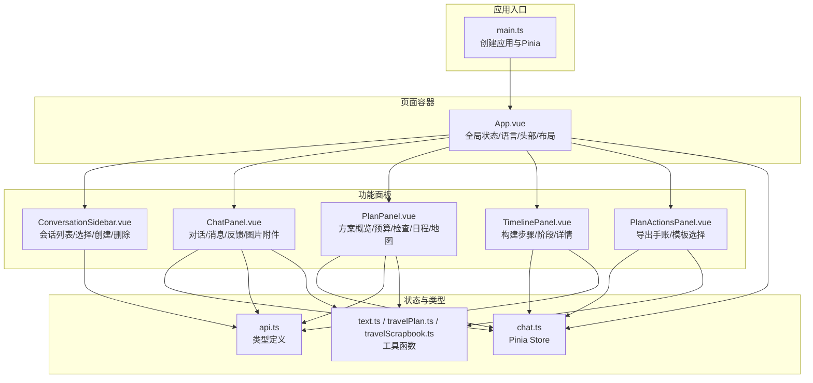
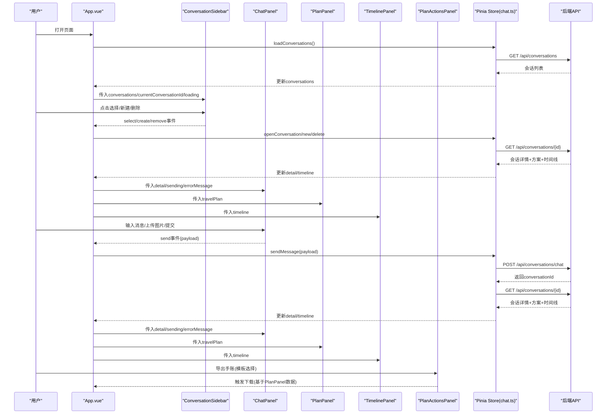
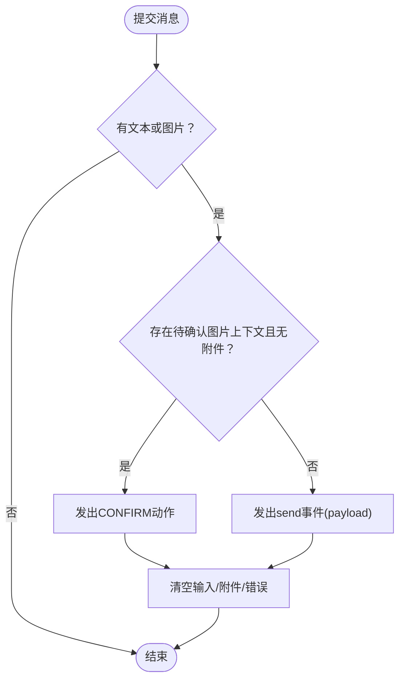
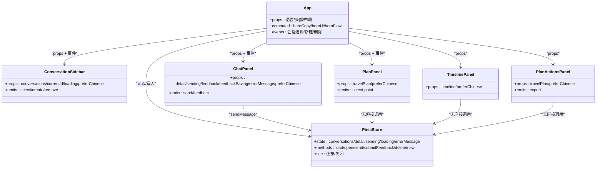

# Vue组件架构

<cite>
**本文档引用的文件**
- [App.vue](file://web/src/App.vue)
- [ConversationSidebar.vue](file://web/src/components/ConversationSidebar.vue)
- [ChatPanel.vue](file://web/src/components/ChatPanel.vue)
- [PlanPanel.vue](file://web/src/components/PlanPanel.vue)
- [TimelinePanel.vue](file://web/src/components/TimelinePanel.vue)
- [PlanActionsPanel.vue](file://web/src/components/PlanActionsPanel.vue)
- [chat.ts](file://web/src/stores/chat.ts)
- [api.ts](file://web/src/types/api.ts)
- [text.ts](file://web/src/utils/text.ts)
- [travelPlan.ts](file://web/src/utils/travelPlan.ts)
- [travelScrapbook.ts](file://web/src/utils/travelScrapbook.ts)
- [main.ts](file://web/src/main.ts)
</cite>

## 目录
1. [简介](#简介)
2. [项目结构](#项目结构)
3. [核心组件](#核心组件)
4. [架构总览](#架构总览)
5. [详细组件分析](#详细组件分析)
6. [依赖关系分析](#依赖关系分析)
7. [性能考量](#性能考量)
8. [故障排查指南](#故障排查指南)
9. [结论](#结论)
10. [附录](#附录)

## 简介
本文件系统性梳理了旅行规划工作台前端的Vue组件架构，重点解析App.vue主组件与四大核心面板（侧边栏、聊天、方案、时间线）之间的设计模式、数据流与交互关系。文档覆盖props传递、事件冒泡、状态共享、生命周期管理、响应式与计算属性使用，并给出组件开发最佳实践与复用策略，帮助开发者快速理解与扩展该工作台。

## 项目结构
前端位于web/src目录，采用“页面容器 + 功能面板”的组织方式：
- 页面容器：App.vue负责全局状态、语言切换、头部信息与布局
- 功能面板：ConversationSidebar、ChatPanel、PlanPanel、TimelinePanel、PlanActionsPanel
- 状态管理：Pinia Store（chat.ts）
- 类型定义：统一在types/api.ts中
- 工具函数：text.ts、travelPlan.ts、travelScrapbook.ts

图表来源
- [main.ts:1-7](file://web/src/main.ts#L1-L7)
- [App.vue:1-381](file://web/src/App.vue#L1-L381)
- [chat.ts:1-196](file://web/src/stores/chat.ts#L1-L196)
- [api.ts:1-349](file://web/src/types/api.ts#L1-L349)

章节来源
- [main.ts:1-7](file://web/src/main.ts#L1-L7)
- [App.vue:1-381](file://web/src/App.vue#L1-L381)

## 核心组件
本节聚焦四大核心组件的职责与协作：
- ConversationSidebar：会话库管理，支持选择、新建、删除会话
- ChatPanel：对话与消息展示，支持文本与图片附件输入，支持图片上下文确认/忽略
- PlanPanel：旅行方案的综合视图，包含概览、决策卡片、预算、检查、每日行程与地图
- TimelinePanel：显示规划过程中的关键步骤与细节
- PlanActionsPanel：导出手账（分享版/执行版），基于旅行方案生成

章节来源
- [ConversationSidebar.vue:1-88](file://web/src/components/ConversationSidebar.vue#L1-L88)
- [ChatPanel.vue:1-797](file://web/src/components/ChatPanel.vue#L1-L797)
- [PlanPanel.vue:1-800](file://web/src/components/PlanPanel.vue#L1-L800)
- [TimelinePanel.vue:1-157](file://web/src/components/TimelinePanel.vue#L1-L157)
- [PlanActionsPanel.vue:1-334](file://web/src/components/PlanActionsPanel.vue#L1-L334)

## 架构总览
App.vue作为根容器，聚合所有子面板并通过Pinia Store集中管理状态。组件间通过props向下传递数据，通过事件向上冒泡触发业务动作；Pinia Store负责与后端API交互、维护会话与方案数据、建立服务端事件流以实时更新时间线。

图表来源
- [App.vue:264-270](file://web/src/App.vue#L264-L270)
- [chat.ts:32-96](file://web/src/stores/chat.ts#L32-L96)
- [ChatPanel.vue:315-339](file://web/src/components/ChatPanel.vue#L315-L339)
- [PlanActionsPanel.vue:122-132](file://web/src/components/PlanActionsPanel.vue#L122-L132)

## 详细组件分析

### App.vue 主容器
- 设计模式
  - 单一职责：承载全局UI状态（语言、头部信息）、布局与子面板挂载
  - 计算属性：根据当前会话详情动态生成头部文案、统计与流程状态
  - 生命周期：mounted时加载会话并打开首个或当前会话
- 关键特性
  - 本地化：语言存储于localStorage，支持中英切换
  - 头部信息：焦点标题/摘要、亮点、统计、流程步骤
  - 子面板：左侧会话库、右侧聊天+方案+时间线+操作面板
- 与Pinia交互
  - 使用storeToRefs解构读取状态，避免丢失响应性
  - 通过事件回调直接调用store方法，实现父子通信

章节来源
- [App.vue:1-381](file://web/src/App.vue#L1-L381)
- [chat.ts:173-194](file://web/src/stores/chat.ts#L173-L194)

### ConversationSidebar 会话侧边栏
- 职责
  - 展示历史会话列表，支持选择、新建、删除
  - 显示最近更新时间与空态文案
- 数据与事件
  - props: conversations、currentConversationId、loading、preferChinese
  - emits: select、create、remove
- 交互细节
  - 点击会话项触发select事件
  - 删除按钮阻止冒泡，触发remove事件
  - 本地化文案按语言切换

章节来源
- [ConversationSidebar.vue:1-88](file://web/src/components/ConversationSidebar.vue#L1-L88)

### ChatPanel 对话面板
- 职责
  - 展示消息列表、任务简报、图片上下文确认、反馈按钮
  - 支持文本输入、粘贴/拖拽上传图片、批量附件限制与校验
- 数据与事件
  - props: detail、sending、feedback、feedbackSaving、errorMessage、preferChinese
  - emits: send、feedback
- 关键逻辑
  - 图片附件：最多4张、单张≤5MB、限定PNG/JPEG/WEBP/GIF
  - 图片上下文：pendingImageContext存在时，提供确认/忽略操作
  - 反馈：仅对最新一条助手消息开放，支持接受/部分/拒绝
  - 本地化：多处文案按语言切换，偏好翻译用户输入的偏好词
- 性能注意
  - 大量消息渲染时，建议结合虚拟滚动（当前未实现）

图表来源
- [ChatPanel.vue:315-339](file://web/src/components/ChatPanel.vue#L315-L339)
- [ChatPanel.vue:352-381](file://web/src/components/ChatPanel.vue#L352-L381)

章节来源
- [ChatPanel.vue:1-797](file://web/src/components/ChatPanel.vue#L1-L797)

### PlanPanel 方案面板
- 职责
  - 综合展示旅行方案：概览、决策卡片、预算、检查、每日行程、地图
  - 提供快速导航到各区块
- 数据与交互
  - props: travelPlan、preferChinese
  - 通过PlanMap组件展示地图与选中点位
  - 通过activePointId与父组件通信，实现点击联动
- 决策与建议
  - 基于约束检查、预算、节拍度、地点置信度生成“执行把握”等卡片
  - 基于检查与预算生成“下一步建议”
- 性能注意
  - 大型列表渲染建议结合虚拟滚动（当前未实现）

章节来源
- [PlanPanel.vue:1-800](file://web/src/components/PlanPanel.vue#L1-L800)
- [travelPlan.ts:1-123](file://web/src/utils/travelPlan.ts#L1-L123)

### TimelinePanel 时间线面板
- 职责
  - 展示规划过程的关键步骤（阶段/消息/详情）
- 数据与交互
  - props: timeline、preferChinese
  - 阶段与消息均按语言本地化
  - 详情对象过滤空值后展示为标签

章节来源
- [TimelinePanel.vue:1-157](file://web/src/components/TimelinePanel.vue#L1-L157)

### PlanActionsPanel 导出面板
- 职责
  - 将旅行方案导出为可分享的手账（分享版/执行版）
- 数据与交互
  - props: travelPlan、preferChinese
  - 选择模板后，统计天数/站点/酒店数量，展示特性说明
  - 调用downloadTravelScrapbook生成并下载图片
- 性能注意
  - 导出涉及Canvas绘制，建议在后台线程或异步队列中进行

章节来源
- [PlanActionsPanel.vue:1-334](file://web/src/components/PlanActionsPanel.vue#L1-L334)
- [travelScrapbook.ts:81-110](file://web/src/utils/travelScrapbook.ts#L81-L110)

## 依赖关系分析

图表来源
- [App.vue:273-380](file://web/src/App.vue#L273-L380)
- [chat.ts:15-196](file://web/src/stores/chat.ts#L15-L196)

章节来源
- [App.vue:273-380](file://web/src/App.vue#L273-L380)
- [chat.ts:15-196](file://web/src/stores/chat.ts#L15-L196)

## 性能考量
- 渲染优化
  - 大列表（消息、每日行程、检查项）建议引入虚拟滚动或分页
  - 图片附件预览与Canvas导出建议在Web Worker中处理
- 状态与响应式
  - 使用storeToRefs解构读取，避免丢失响应性
  - 计算属性尽量缓存中间结果，减少重复计算
- 网络与流
  - SSE连接在切换会话时及时关闭与重建，避免内存泄漏
  - 错误统一格式化，避免频繁重试导致抖动

[本节为通用指导，无需特定文件来源]

## 故障排查指南
- 常见问题
  - 会话列表为空：检查loadConversations是否成功，查看errorMessage
  - 发送消息失败：查看errorMessage，确认sending状态与payload合法性
  - 时间线不更新：确认SSE连接是否正常，事件id去重逻辑
  - 图片上传失败：检查附件数量/大小/类型限制
- 定位手段
  - 在App.vue中观察errorMessage与loading状态
  - 在chat.ts中定位API调用与SSE连接逻辑
  - 在ChatPanel.vue中核对附件校验与错误提示

章节来源
- [chat.ts:32-96](file://web/src/stores/chat.ts#L32-L96)
- [ChatPanel.vue:352-381](file://web/src/components/ChatPanel.vue#L352-L381)

## 结论
该Vue组件架构以App.vue为中心，通过Pinia Store统一管理状态与后端交互，四大核心面板职责清晰、边界明确。组件间通过props与事件形成清晰的数据流与控制流，配合计算属性与本地化工具，实现了良好的可维护性与可扩展性。后续可在大列表渲染、Canvas导出与SSE稳定性方面进一步优化。

[本节为总结，无需特定文件来源]

## 附录

### 组件开发最佳实践
- 命名规范
  - 组件文件名使用PascalCase（如PlanPanel.vue）
  - props使用camelCase，事件使用kebab-case风格
- 模板结构
  - 合理拆分语义区块，使用局部变量提升可读性
  - 为可复用UI元素抽象为子组件或插槽
- 响应式与计算属性
  - 将派生数据放入computed，避免在模板中做复杂计算
  - 使用watch监听关键状态变化，触发副作用
- 事件与状态
  - 子向父传递事件时，尽量封装payload，保持接口稳定
  - Pinia store集中管理跨组件共享状态，避免跨层级props

[本节为通用指导，无需特定文件来源]

### 插槽与自定义指令示例
- 插槽
  - PlanPanel中可将“快速导航”、“决策卡片”等抽象为具名插槽，便于主题化定制
- 自定义指令
  - 可引入v-tooltip用于长文本截断提示
  - 可引入v-intersect用于懒加载与虚拟滚动

[本节为概念性建议，无需特定文件来源]