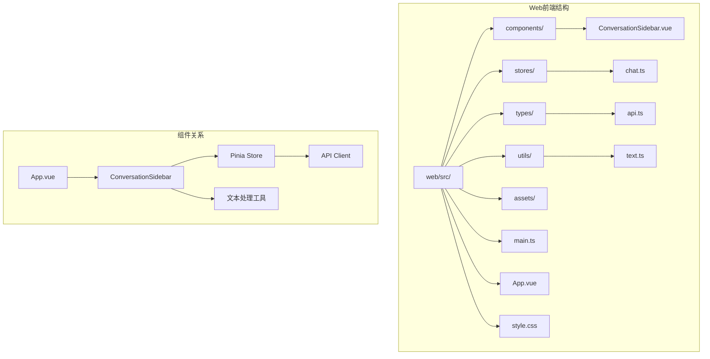
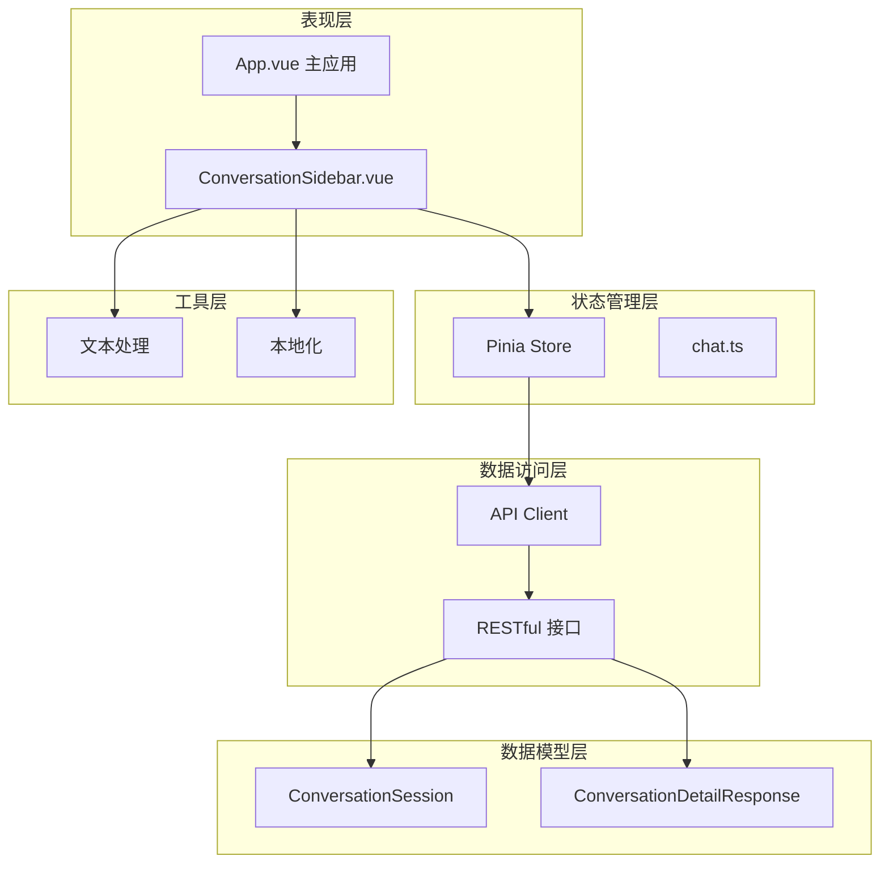
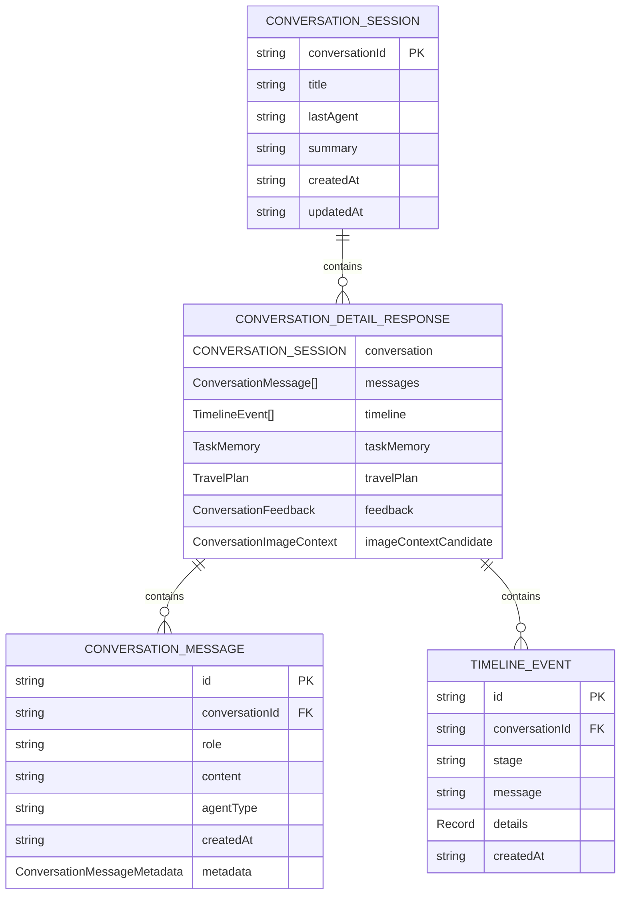
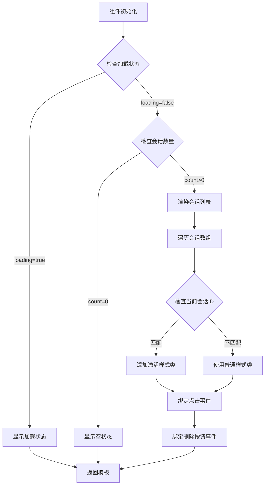
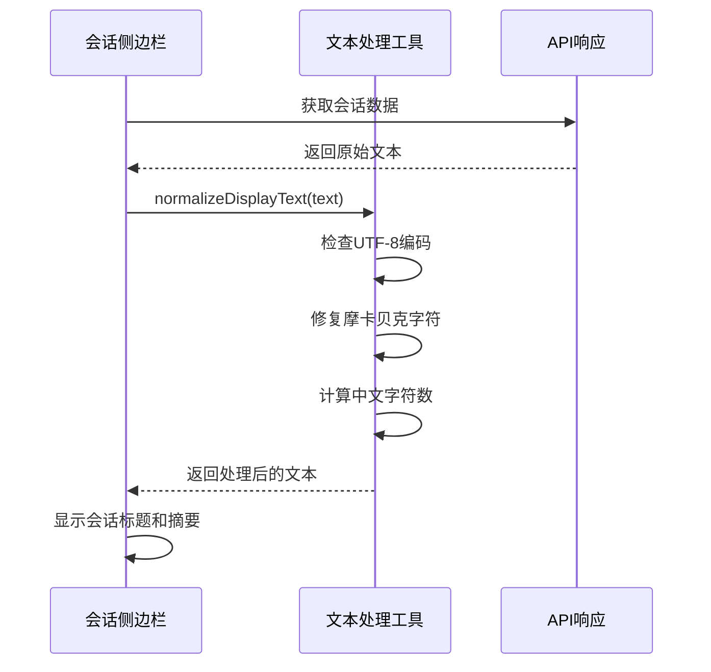
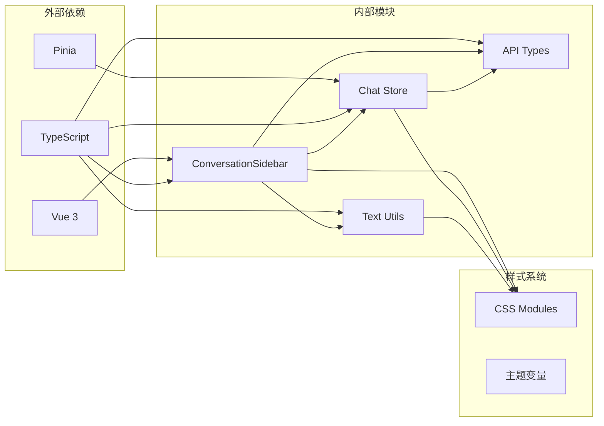
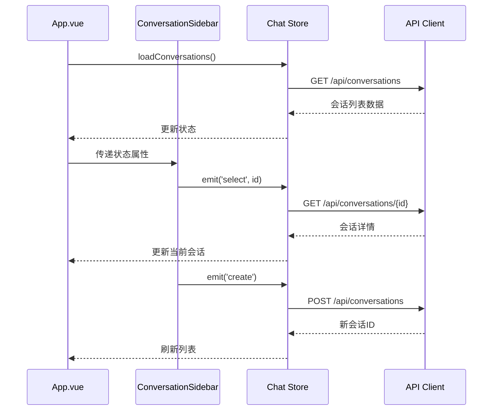

# 会话侧边栏组件

<cite>
**本文档引用的文件**
- [ConversationSidebar.vue](file://web/src/components/ConversationSidebar.vue)
- [chat.ts](file://web/src/stores/chat.ts)
- [api.ts](file://web/src/types/api.ts)
- [text.ts](file://web/src/utils/text.ts)
- [App.vue](file://web/src/App.vue)
- [style.css](file://web/src/style.css)
</cite>

## 目录
1. [简介](#简介)
2. [项目结构](#项目结构)
3. [核心组件](#核心组件)
4. [架构概览](#架构概览)
5. [详细组件分析](#详细组件分析)
6. [依赖关系分析](#依赖关系分析)
7. [性能考虑](#性能考虑)
8. [故障排除指南](#故障排除指南)
9. [结论](#结论)

## 简介

ConversationSidebar 是旅行代理系统中的核心侧边栏组件，负责展示和管理用户的会话历史记录。该组件提供了完整的会话列表渲染、交互式操作和状态可视化功能，是用户与旅行规划工作流交互的主要入口点。

该组件采用现代化的 Vue 3 Composition API 构建，集成了 Pinia 状态管理，实现了响应式的会话管理和实时的状态更新。组件支持中英文双语界面，具备完整的国际化支持和本地化存储功能。

## 项目结构

会话侧边栏组件位于前端项目的组件目录中，与状态管理、类型定义和工具函数紧密协作：

**图表来源**
- [ConversationSidebar.vue:1-88](file://web/src/components/ConversationSidebar.vue#L1-L88)
- [chat.ts:1-196](file://web/src/stores/chat.ts#L1-L196)
- [App.vue:273-283](file://web/src/App.vue#L273-L283)

**章节来源**
- [ConversationSidebar.vue:1-88](file://web/src/components/ConversationSidebar.vue#L1-L88)
- [chat.ts:15-196](file://web/src/stores/chat.ts#L15-L196)
- [App.vue:273-283](file://web/src/App.vue#L273-L283)

## 核心组件

### 组件属性和事件

ConversationSidebar 组件通过清晰的接口定义了其核心功能：

**属性定义：**
- `conversations`: 会话数组，包含所有保存的对话历史
- `currentConversationId`: 当前激活的会话标识符
- `loading`: 加载状态指示器
- `preferChinese`: 语言偏好设置（默认为中文）

**事件发射：**
- `select`: 会话选择事件，传递选中的会话ID
- `create`: 新建会话事件
- `remove`: 删除会话事件，传递要删除的会话ID

**章节来源**
- [ConversationSidebar.vue:6-19](file://web/src/components/ConversationSidebar.vue#L6-L19)

### 国际化支持

组件内置了完整的中英文双语支持，包括：
- 品牌标识和标题显示
- 会话数量统计
- 操作按钮文本
- 时间格式化
- 空状态提示信息

**章节来源**
- [ConversationSidebar.vue:21-43](file://web/src/components/ConversationSidebar.vue#L21-L43)

## 架构概览

会话侧边栏组件采用分层架构设计，各层职责明确且高度解耦：

**图表来源**
- [App.vue:16-25](file://web/src/App.vue#L16-L25)
- [chat.ts:15-196](file://web/src/stores/chat.ts#L15-L196)
- [api.ts:24-349](file://web/src/types/api.ts#L24-L349)

## 详细组件分析

### 数据模型结构

会话数据采用标准化的数据模型设计，确保前后端数据一致性：

**图表来源**
- [api.ts:24-349](file://web/src/types/api.ts#L24-L349)

**章节来源**
- [api.ts:24-349](file://web/src/types/api.ts#L24-L349)

### 渲染逻辑分析

组件的渲染逻辑遵循响应式数据驱动的设计原则：

**图表来源**
- [ConversationSidebar.vue:65-85](file://web/src/components/ConversationSidebar.vue#L65-L85)

**章节来源**
- [ConversationSidebar.vue:65-85](file://web/src/components/ConversationSidebar.vue#L65-L85)

### 交互设计实现

组件实现了丰富的交互效果，提升用户体验：

**视觉反馈机制：**
- 鼠标悬停时的轻微位移效果
- 激活状态的渐变背景和阴影
- 按钮的过渡动画效果

**状态可视化：**
- 会话标题的清晰展示
- 最后消息摘要的智能回退
- 更新时间的本地化格式化

**章节来源**
- [style.css:253-293](file://web/src/style.css#L253-L293)
- [ConversationSidebar.vue:45-47](file://web/src/components/ConversationSidebar.vue#L45-L47)

### 文本处理机制

组件集成了智能的文本处理功能，确保显示内容的正确性和可读性：

**图表来源**
- [text.ts:19-30](file://web/src/utils/text.ts#L19-L30)
- [ConversationSidebar.vue:77-78](file://web/src/components/ConversationSidebar.vue#L77-L78)

**章节来源**
- [text.ts:19-30](file://web/src/utils/text.ts#L19-L30)
- [ConversationSidebar.vue:77-78](file://web/src/components/ConversationSidebar.vue#L77-L78)

## 依赖关系分析

### 组件间依赖关系

**图表来源**
- [ConversationSidebar.vue:1-5](file://web/src/components/ConversationSidebar.vue#L1-L5)
- [chat.ts:1-13](file://web/src/stores/chat.ts#L1-L13)
- [text.ts:1-31](file://web/src/utils/text.ts#L1-L31)

### 状态管理集成

组件与 Pinia 状态管理系统的深度集成：

**图表来源**
- [App.vue:264-270](file://web/src/App.vue#L264-L270)
- [chat.ts:32-42](file://web/src/stores/chat.ts#L32-L42)
- [chat.ts:44-56](file://web/src/stores/chat.ts#L44-L56)

**章节来源**
- [App.vue:264-270](file://web/src/App.vue#L264-L270)
- [chat.ts:32-56](file://web/src/stores/chat.ts#L32-L56)

## 性能考虑

### 列表渲染优化

虽然当前实现使用标准的 v-for 渲染，但具备良好的扩展性以支持虚拟化：

**现有优化措施：**
- 条件渲染避免不必要的 DOM 元素
- 计算属性缓存重复计算结果
- 事件委托减少监听器数量

**虚拟化建议：**
- 使用 vue-virtual-scroller 库
- 实现虚拟滚动条
- 设置合理的缓冲区大小

### 内存管理

组件在内存使用方面表现出色：
- 无状态组件设计，避免额外状态存储
- 合理的事件处理，防止内存泄漏
- 及时清理定时器和订阅

### 网络请求优化

状态管理中实现了完善的错误处理和重试机制：
- 统一的错误格式化
- 加载状态管理
- 失败重试策略

## 故障排除指南

### 常见问题诊断

**会话列表不显示：**
1. 检查网络连接状态
2. 验证 API 端点可用性
3. 查看浏览器控制台错误信息

**会话选择无效：**
1. 确认会话 ID 格式正确
2. 检查路由配置
3. 验证权限设置

**文本显示异常：**
1. 检查 UTF-8 编码
2. 验证本地化资源
3. 确认字体支持

### 调试技巧

**开发工具使用：**
- Vue DevTools 检查组件状态
- Network 面板监控 API 请求
- Console 查看错误日志

**性能监控：**
- 使用 Performance 面板分析渲染时间
- 监控内存使用情况
- 检查事件监听器数量

**章节来源**
- [chat.ts:166-171](file://web/src/stores/chat.ts#L166-L171)
- [text.ts:19-30](file://web/src/utils/text.ts#L19-L30)

## 结论

ConversationSidebar 侧边栏组件展现了现代前端开发的最佳实践，通过清晰的架构设计、完善的国际化支持和优秀的用户体验，为旅行代理系统提供了强大的会话管理能力。

组件的核心优势包括：
- **模块化设计**：职责分离，易于维护和扩展
- **响应式架构**：基于 Vue 3 和 Pinia 的现代技术栈
- **国际化支持**：完整的中英文双语界面
- **性能优化**：合理的渲染策略和状态管理
- **用户体验**：直观的交互设计和视觉反馈

未来可以进一步增强的功能包括：
- 列表虚拟化支持大量会话
- 搜索和过滤功能
- 批量操作支持
- 更丰富的键盘导航
- 离线缓存机制

该组件为整个旅行代理系统的用户界面奠定了坚实的基础，是构建复杂单页应用的优秀范例。