# 旅行计划面板组件

<cite>
**本文档引用的文件**
- [PlanPanel.vue](file://web/src/components/PlanPanel.vue)
- [PlanMap.vue](file://web/src/components/PlanMap.vue)
- [PlanActionsPanel.vue](file://web/src/components/PlanActionsPanel.vue)
- [travelPlan.ts](file://web/src/utils/travelPlan.ts)
- [travelScrapbook.ts](file://web/src/utils/travelScrapbook.ts)
- [api.ts](file://web/src/types/api.ts)
- [TravelPlan.java](file://travel-agent-domain/src/main/java/com/travalagent/domain/model/entity/TravelPlan.java)
- [TravelPlanDay.java](file://travel-agent-domain/src/main/java/com/travalagent/domain/model/entity/TravelPlanDay.java)
- [TravelPlanSlot.java](file://travel-agent-domain/src/main/java/com/travalagent/domain/model/entity/TravelPlanSlot.java)
- [chat.ts](file://web/src/stores/chat.ts)
- [App.vue](file://web/src/App.vue)
- [PlanPanel.spec.ts](file://web/src/components/PlanPanel.spec.ts)
- [text.ts](file://web/src/utils/text.ts)
- [style.css](file://web/src/style.css)
</cite>

## 目录
1. [项目概述](#项目概述)
2. [组件架构设计](#组件架构设计)
3. [核心数据结构](#核心数据结构)
4. [旅行计划展示逻辑](#旅行计划展示逻辑)
5. [地图可视化处理](#地图可视化处理)
6. [编辑与版本控制](#编辑与版本控制)
7. [导出功能实现](#导出功能实现)
8. [性能优化策略](#性能优化策略)
9. [最佳实践指南](#最佳实践指南)
10. [故障排除](#故障排除)
11. [总结](#总结)

## 项目概述

旅行计划面板组件是TravelAgent旅行助手系统的核心展示组件，负责将复杂的旅行计划数据结构化地呈现给用户。该组件采用Vue 3 Composition API构建，支持中英文双语显示，具备完整的旅行计划可视化、交互式地图展示和多种导出功能。

组件主要功能包括：
- 结构化展示旅行计划的各个维度（概览、每日行程、住宿、预算等）
- 实时地图可视化，支持路线连接和地点标注
- 智能决策卡片和行动建议
- 多格式导出功能（图片、PDF等）
- 响应式设计和无障碍访问支持

## 组件架构设计

### 整体架构图

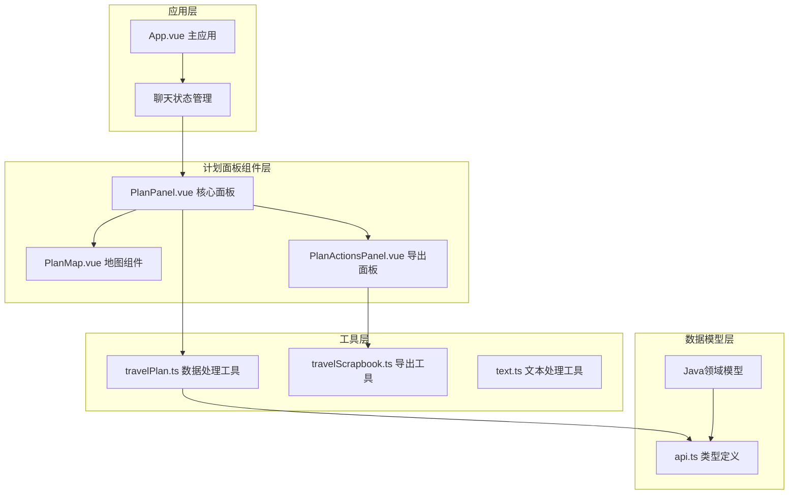

**图表来源**
- [PlanPanel.vue:1-1421](file://web/src/components/PlanPanel.vue#L1-L1421)
- [PlanMap.vue:1-221](file://web/src/components/PlanMap.vue#L1-L221)
- [PlanActionsPanel.vue:1-334](file://web/src/components/PlanActionsPanel.vue#L1-L334)

### 组件关系图

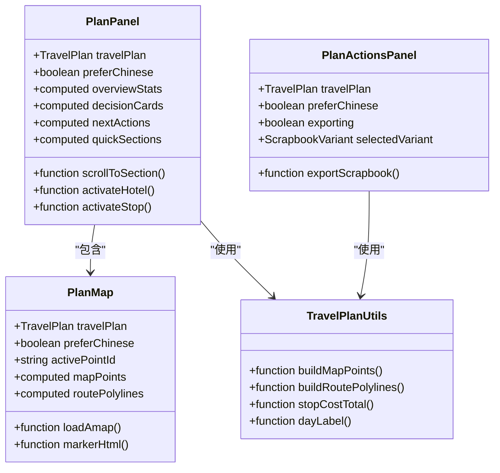

**图表来源**
- [PlanPanel.vue:9-620](file://web/src/components/PlanPanel.vue#L9-L620)
- [PlanMap.vue:6-179](file://web/src/components/PlanMap.vue#L6-L179)
- [travelPlan.ts:31-123](file://web/src/utils/travelPlan.ts#L31-L123)

**章节来源**
- [PlanPanel.vue:1-1421](file://web/src/components/PlanPanel.vue#L1-L1421)
- [App.vue:363-376](file://web/src/App.vue#L363-L376)

## 核心数据结构

### 旅行计划数据模型

旅行计划采用分层数据结构，从顶层的TravelPlan到具体的每日行程和停靠点：

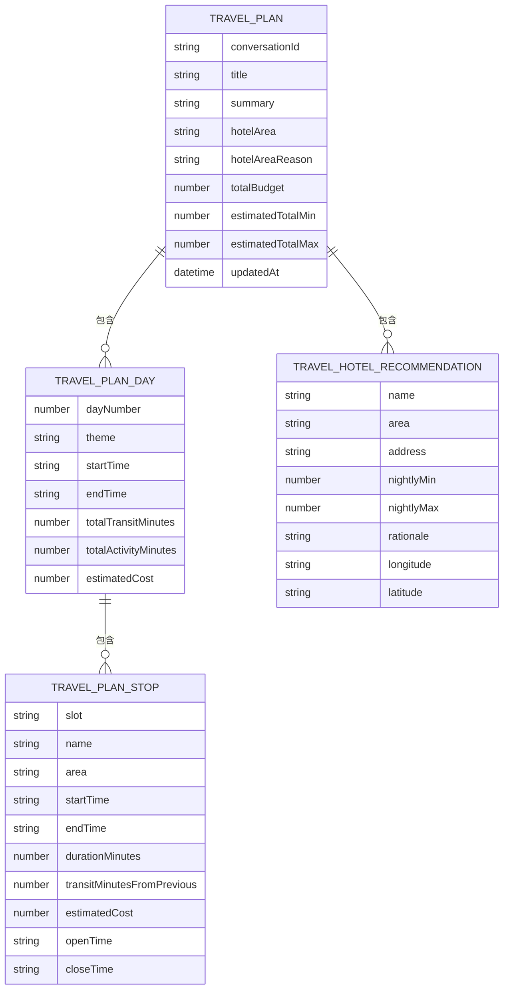

**图表来源**
- [api.ts:229-248](file://web/src/types/api.ts#L229-L248)
- [api.ts:185-195](file://web/src/types/api.ts#L185-L195)
- [api.ts:165-183](file://web/src/types/api.ts#L165-L183)
- [api.ts:153-163](file://web/src/types/api.ts#L153-L163)

### Java领域模型映射

后端Java实体类与前端类型定义保持一致：

| 前端类型 | 后端实体 | 字段对应关系 |
|---------|---------|-------------|
| TravelPlan | TravelPlan | 所有字段映射 |
| TravelPlanDay | TravelPlanDay | 日常行程字段 |
| TravelPlanStop | TravelPlanStop | 停靠点字段 |
| TravelHotelRecommendation | TravelHotelRecommendation | 住宿推荐字段 |

**章节来源**
- [api.ts:229-248](file://web/src/types/api.ts#L229-L248)
- [TravelPlan.java:9-28](file://travel-agent-domain/src/main/java/com/travalagent/domain/model/entity/TravelPlan.java#L9-L28)
- [TravelPlanDay.java:5-15](file://travel-agent-domain/src/main/java/com/travalagent/domain/model/entity/TravelPlanDay.java#L5-L15)

## 旅行计划展示逻辑

### 概览卡片渲染

概览卡片展示旅行计划的核心信息，包括总费用、住宿区域和行程天数：

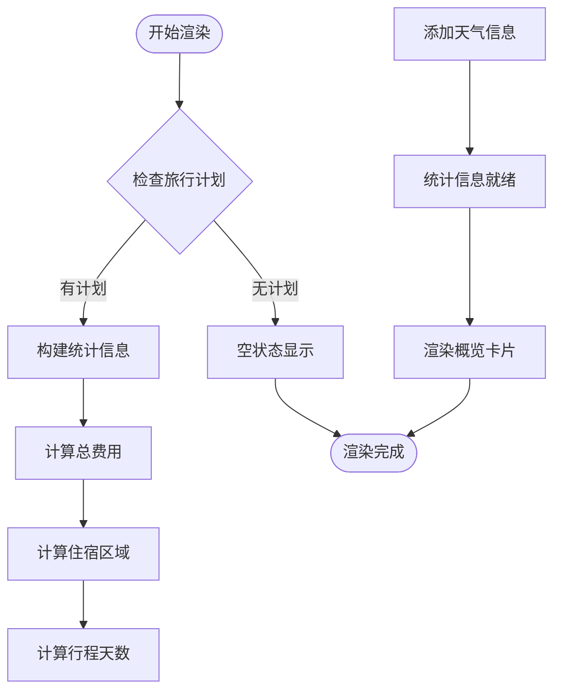

**图表来源**
- [PlanPanel.vue:210-248](file://web/src/components/PlanPanel.vue#L210-L248)

### 决策卡片系统

决策卡片基于旅行计划的约束检查、预算状况和位置置信度生成智能建议：

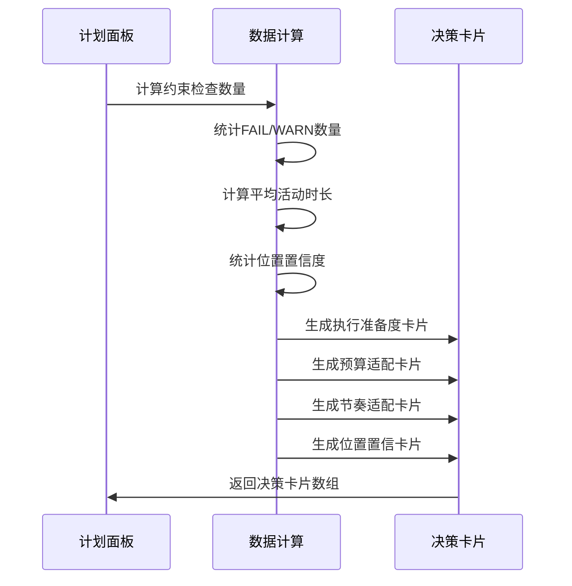

**图表来源**
- [PlanPanel.vue:250-361](file://web/src/components/PlanPanel.vue#L250-L361)

### 每日行程组织

每日行程采用日期分组的方式组织，支持上午、下午、晚上的时间段划分：

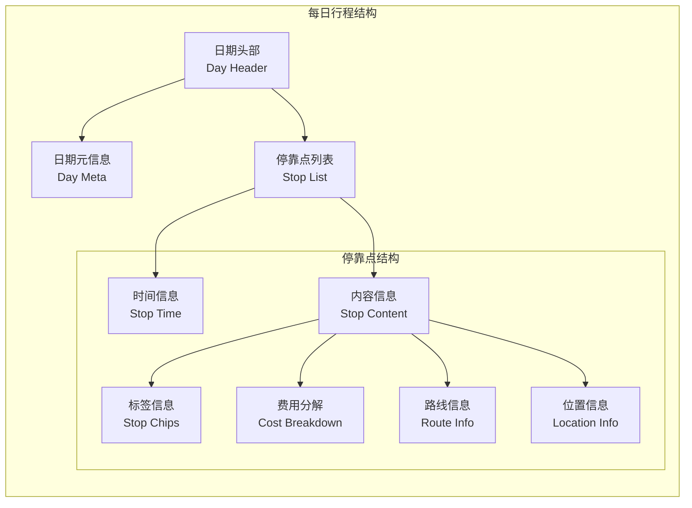

**图表来源**
- [PlanPanel.vue:794-904](file://web/src/components/PlanPanel.vue#L794-L904)

**章节来源**
- [PlanPanel.vue:636-904](file://web/src/components/PlanPanel.vue#L636-L904)

## 地图可视化处理

### 地图数据构建

地图组件通过专门的数据处理工具将旅行计划转换为地图可视化的数据结构：

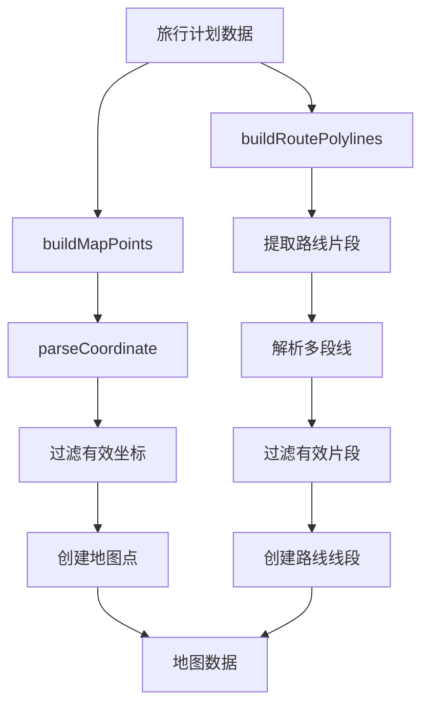

**图表来源**
- [travelPlan.ts:31-86](file://web/src/utils/travelPlan.ts#L31-L86)

### 地图渲染流程

地图组件使用高德地图API进行渲染，支持路线绘制和标记点管理：

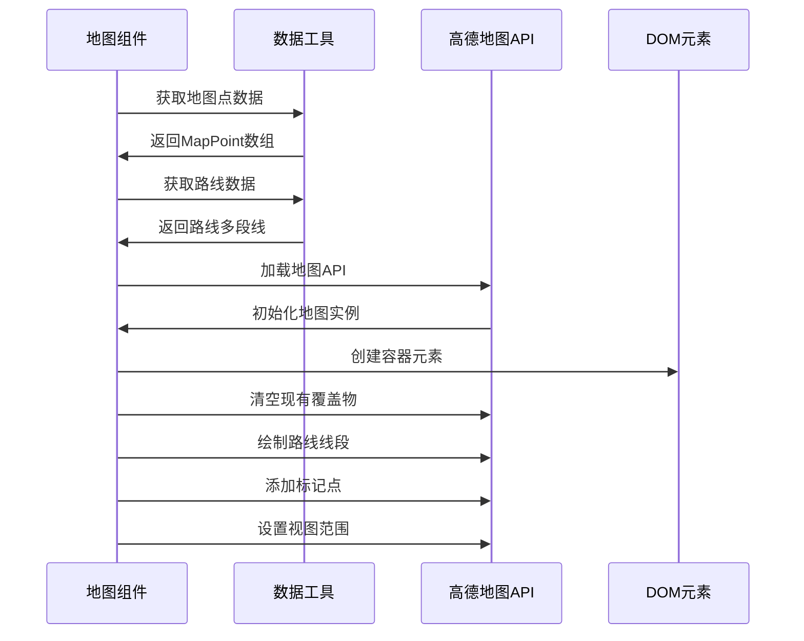

**图表来源**
- [PlanMap.vue:62-114](file://web/src/components/PlanMap.vue#L62-L114)

### 交互功能实现

地图支持多种交互操作，包括点击选择、悬停高亮和自动定位：

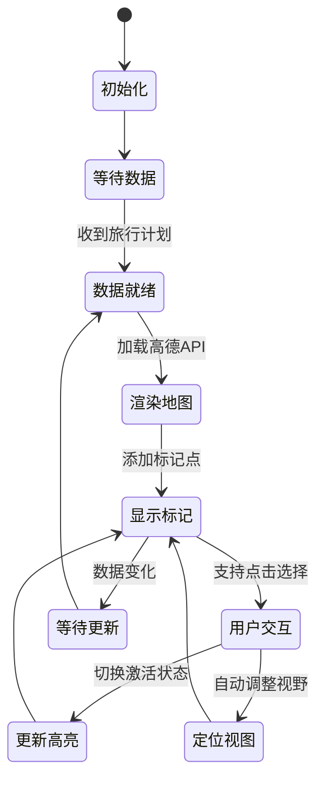

**图表来源**
- [PlanMap.vue:116-124](file://web/src/components/PlanMap.vue#L116-L124)

**章节来源**
- [PlanMap.vue:1-221](file://web/src/components/PlanMap.vue#L1-L221)
- [travelPlan.ts:31-123](file://web/src/utils/travelPlan.ts#L31-L123)

## 编辑与版本控制

### 版本控制机制

旅行计划采用时间戳机制进行版本控制，确保数据的一致性和可追溯性：

| 版本字段 | 类型 | 描述 | 使用场景 |
|---------|------|------|----------|
| updatedAt | datetime | 最后更新时间 | 版本标识、排序、缓存失效 |
| conversationId | string | 对话会话ID | 关联用户对话历史 |
| title | string | 计划标题 | 用户界面显示 |
| summary | string | 计划摘要 | 快速预览 |

### 数据更新流程

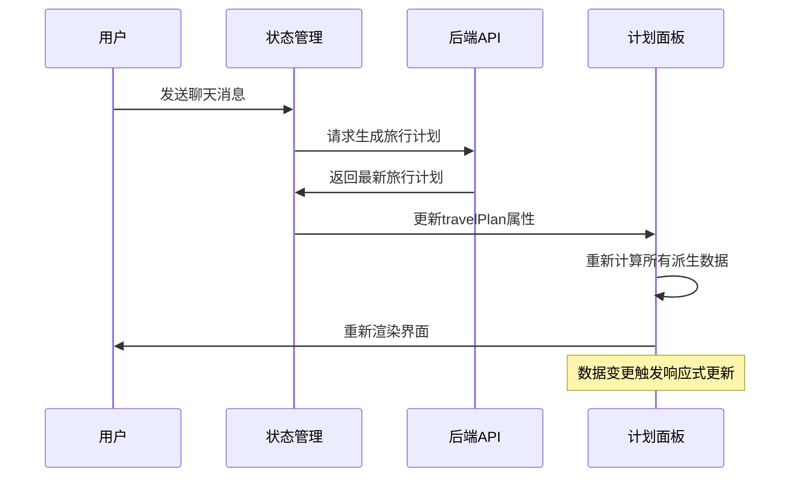

**图表来源**
- [chat.ts:58-80](file://web/src/stores/chat.ts#L58-L80)

### 编辑功能限制

当前版本的旅行计划面板主要用于**展示**而非**编辑**。任何修改都需要通过重新生成旅行计划来实现：

- **重新生成**：通过发送新的聊天请求或上传新的截图来更新计划
- **版本比较**：通过updatedAt字段比较不同版本的差异
- **撤销操作**：通过切换到之前的对话会话实现

**章节来源**
- [chat.ts:15-195](file://web/src/stores/chat.ts#L15-L195)
- [PlanPanel.vue:1-1421](file://web/src/components/PlanPanel.vue#L1-1421)

## 导出功能实现

### 导出工具架构

旅行计划导出功能基于Canvas技术实现，支持多种模板格式：

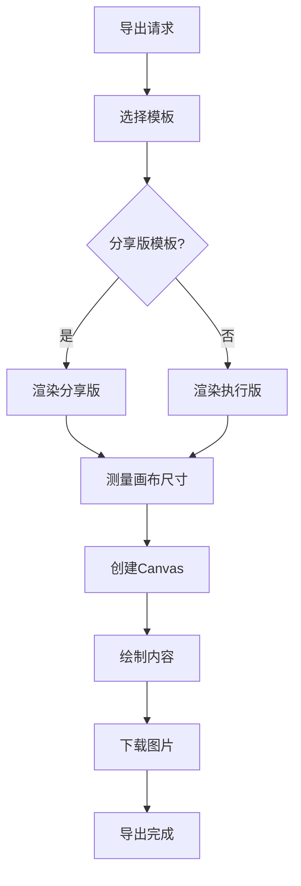

**图表来源**
- [travelScrapbook.ts:81-110](file://web/src/utils/travelScrapbook.ts#L81-L110)

### 模板系统设计

系统提供两种导出模板，满足不同的使用场景：

| 模板类型 | 适用场景 | 主要特点 | 输出内容 |
|---------|---------|----------|----------|
| Share Story | 分享传播 | 完整详细 | 全天行程、路线草图、预算分解 |
| Trip Brief | 出发前预览 | 紧凑实用 | 关键信息、执行要点、简洁日程 |

### 导出流程实现

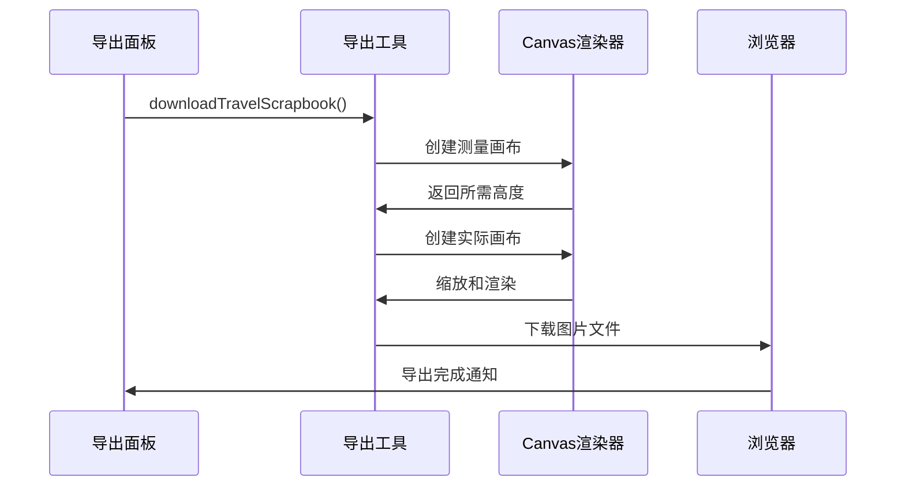

**图表来源**
- [travelScrapbook.ts:81-110](file://web/src/utils/travelScrapbook.ts#L81-L110)

**章节来源**
- [PlanActionsPanel.vue:122-132](file://web/src/components/PlanActionsPanel.vue#L122-L132)
- [travelScrapbook.ts:112-257](file://web/src/utils/travelScrapbook.ts#L112-L257)

## 性能优化策略

### 响应式数据优化

组件采用Vue 3的组合式API，通过computed属性实现智能缓存：

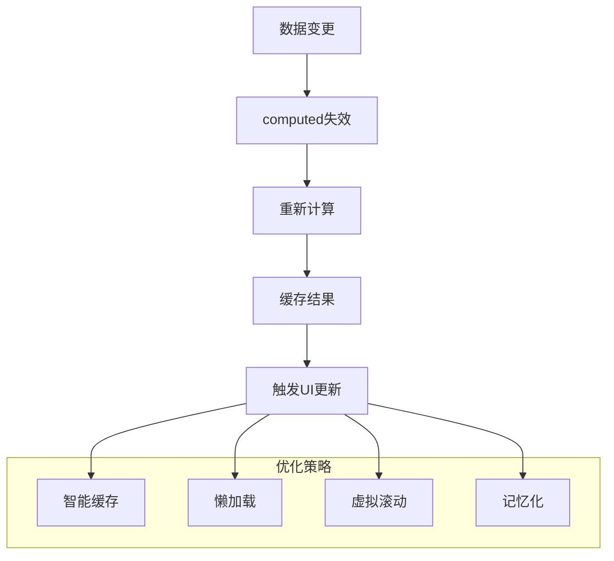

### 地图性能优化

地图组件实现了多项性能优化措施：

- **按需加载**：仅在需要时加载高德地图API
- **数据预处理**：在组件外部进行数据转换和验证
- **批量更新**：使用requestAnimationFrame进行批量DOM更新
- **内存管理**：及时清理地图实例和事件监听器

### 内存管理策略

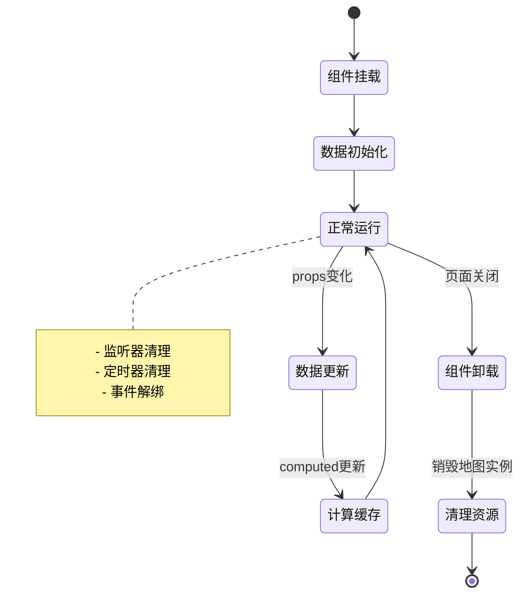

**章节来源**
- [PlanMap.vue:126-134](file://web/src/components/PlanMap.vue#L126-L134)
- [PlanPanel.vue:1-1421](file://web/src/components/PlanPanel.vue#L1-L1421)

## 最佳实践指南

### 数据格式化最佳实践

1. **统一文本处理**：使用`normalizeDisplayText`函数处理UTF-8乱码问题
2. **坐标数据验证**：通过`parseCoordinate`函数确保经纬度数据的有效性
3. **时间格式标准化**：统一使用24小时制时间格式
4. **货币金额处理**：使用本地化格式显示价格信息

### 组件复用策略

1. **单一职责原则**：每个组件专注于特定功能领域
2. **属性接口设计**：清晰定义props接口，便于组件间通信
3. **事件驱动架构**：通过事件实现组件间的松耦合通信
4. **插槽系统**：利用Vue插槽实现灵活的内容定制

### 用户体验优化

1. **渐进式渲染**：优先渲染关键信息，次要内容延迟加载
2. **状态反馈**：提供明确的操作状态和错误提示
3. **无障碍访问**：确保键盘导航和屏幕阅读器支持
4. **响应式设计**：适配不同屏幕尺寸和设备类型

### 错误处理策略

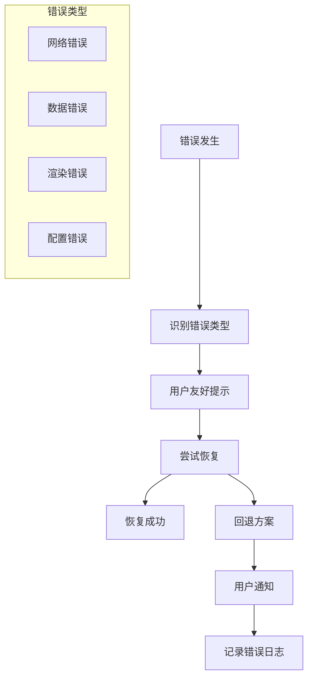

**章节来源**
- [text.ts:19-30](file://web/src/utils/text.ts#L19-L30)
- [travelPlan.ts:22-29](file://web/src/utils/travelPlan.ts#L22-L29)

## 故障排除

### 常见问题诊断

| 问题类型 | 症状描述 | 可能原因 | 解决方案 |
|---------|---------|---------|---------|
| 地图不显示 | 显示"准备就绪但需要密钥" | 缺少高德Web Key | 配置VITE_AMAP_WEB_KEY环境变量 |
| 坐标无效 | 位置标注为空 | 经纬度数据格式错误 | 检查数据源和parseCoordinate函数 |
| 导出失败 | 图片下载失败 | Canvas渲染异常 | 检查浏览器兼容性和权限设置 |
| 性能问题 | 页面卡顿 | 数据量过大 | 实施虚拟滚动和懒加载 |

### 调试工具使用

1. **Vue DevTools**：检查组件状态和props传递
2. **浏览器开发者工具**：监控网络请求和JavaScript错误
3. **性能面板**：分析渲染性能和内存使用情况
4. **网络面板**：调试API请求和响应

### 日志记录策略

组件实现了多层次的日志记录机制：

- **错误级别**：捕获并记录所有运行时错误
- **性能指标**：记录关键操作的执行时间和内存使用
- **用户行为**：跟踪用户交互和功能使用情况
- **系统状态**：监控组件生命周期和状态变化

**章节来源**
- [PlanMap.vue:156-179](file://web/src/components/PlanMap.vue#L156-L179)
- [PlanPanel.spec.ts:151-199](file://web/src/components/PlanPanel.spec.ts#L151-L199)

## 总结

旅行计划面板组件是一个功能完整、架构清晰的Vue 3组件系统，具有以下核心优势：

### 技术亮点

1. **模块化设计**：组件职责明确，易于维护和扩展
2. **数据驱动**：基于响应式数据流，自动更新界面状态
3. **性能优化**：采用多种优化策略，确保流畅的用户体验
4. **国际化支持**：完整的中英文双语支持
5. **可访问性**：遵循Web标准，支持辅助技术

### 应用价值

- **用户体验**：提供直观、易用的旅行计划管理界面
- **数据可视化**：通过地图和图表清晰展示复杂信息
- **工作流程集成**：与聊天机器人和知识检索系统无缝集成
- **多平台支持**：支持桌面和移动设备访问

### 发展方向

未来可以考虑的功能增强：
- 增加旅行计划的直接编辑功能
- 集成更多第三方服务（如酒店预订、交通查询）
- 实现离线模式支持
- 添加更多导出格式选项
- 增强个性化推荐算法

该组件为TravelAgent系统的用户提供了强大而优雅的旅行计划管理解决方案，是现代Web应用开发的优秀实践案例。