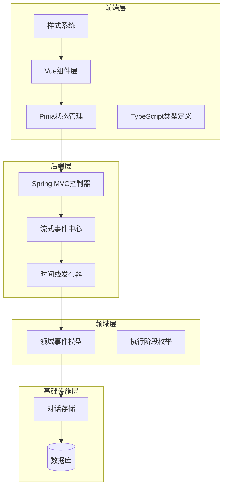
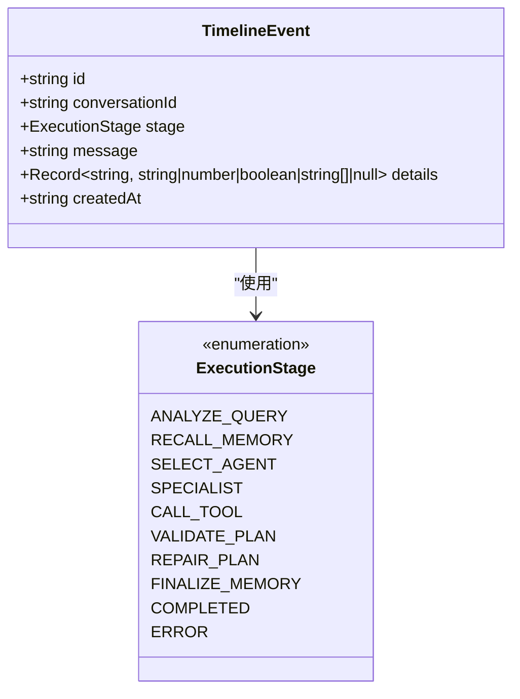
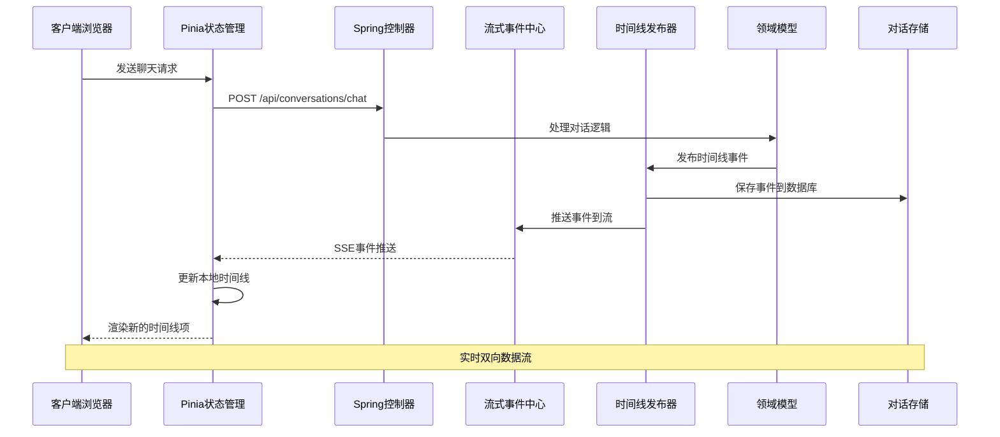
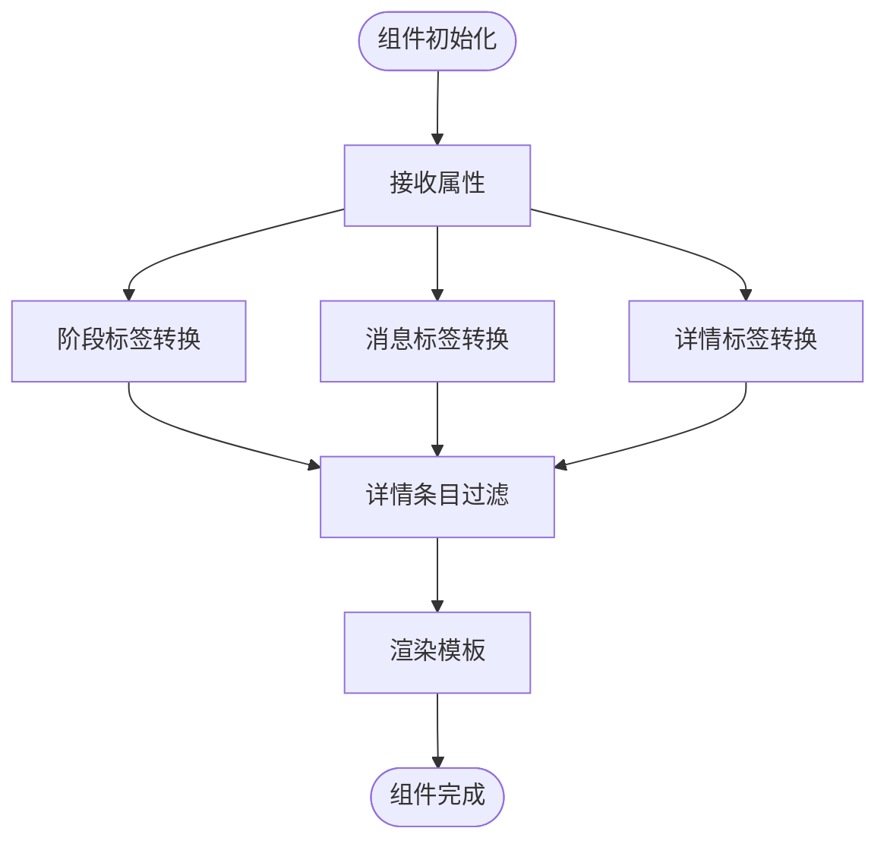
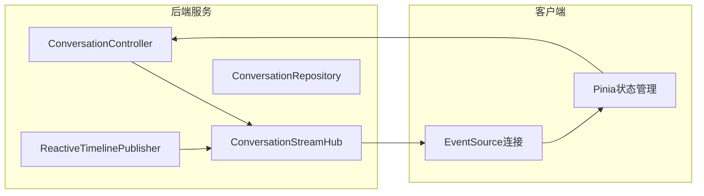
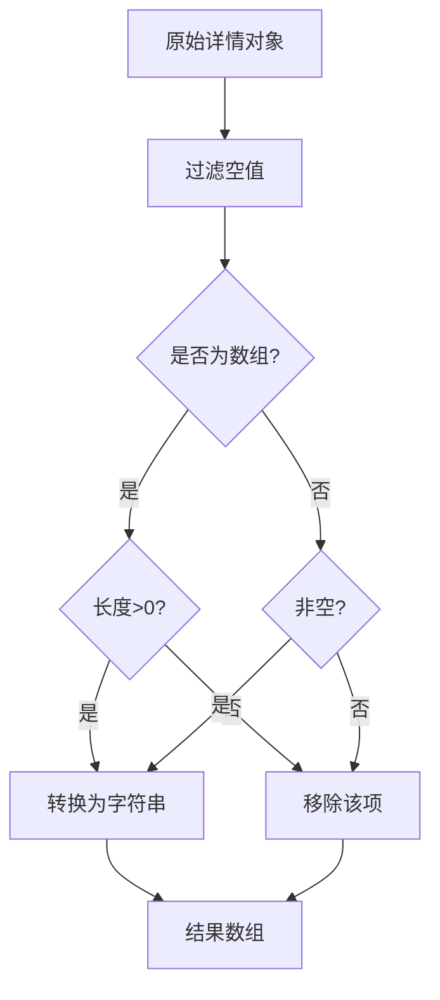
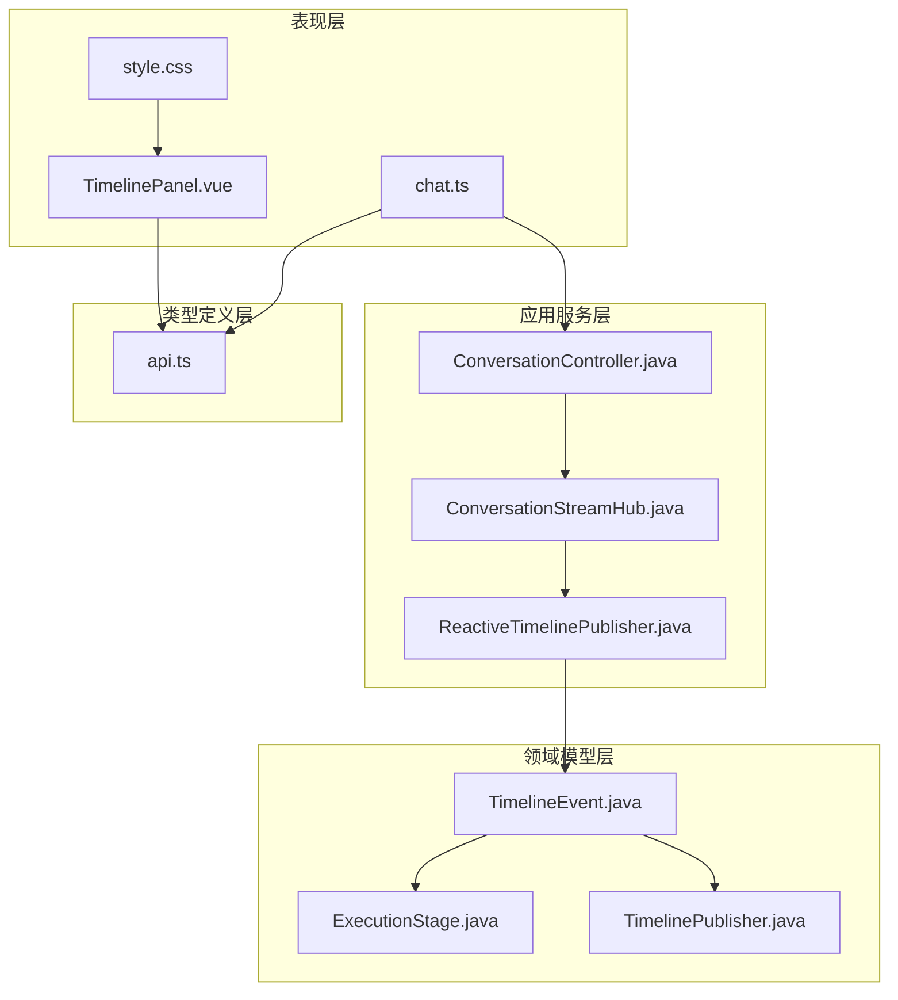

# 时间线面板组件

<cite>
**本文档引用的文件**
- [web/src/components/TimelinePanel.vue](file://web/src/components/TimelinePanel.vue)
- [web/src/components/TimelinePanel.spec.ts](file://web/src/components/TimelinePanel.spec.ts)
- [web/src/stores/chat.ts](file://web/src/stores/chat.ts)
- [web/src/types/api.ts](file://web/src/types/api.ts)
- [web/src/style.css](file://web/src/style.css)
- [travel-agent-domain/src/main/java/com/travalagent/domain/model/entity/TimelineEvent.java](file://travel-agent-domain/src/main/java/com/travalagent/domain/model/entity/TimelineEvent.java)
- [travel-agent-domain/src/main/java/com/travalagent/domain/event/TimelinePublisher.java](file://travel-agent-domain/src/main/java/com/travalagent/domain/event/TimelinePublisher.java)
- [travel-agent-domain/src/main/java/com/travalagent/domain/model/valobj/ExecutionStage.java](file://travel-agent-domain/src/main/java/com/travalagent/domain/model/valobj/ExecutionStage.java)
- [travel-agent-app/src/main/java/com/travalagent/app/stream/ReactiveTimelinePublisher.java](file://travel-agent-app/src/main/java/com/travalagent/app/stream/ReactiveTimelinePublisher.java)
- [travel-agent-app/src/main/java/com/travalagent/app/controller/ConversationController.java](file://travel-agent-app/src/main/java/com/travalagent/app/controller/ConversationController.java)
- [travel-agent-app/src/main/java/com/travalagent/app/stream/ConversationStreamHub.java](file://travel-agent-app/src/main/java/com/travalagent/app/stream/ConversationStreamHub.java)
</cite>

## 更新摘要
**所做更改**
- 更新了UI格式化改进部分，标准化了时间线事件详情标签的显示格式
- 在关键标签后添加冒号分隔符，提升界面一致性
- 增强了详情标签的视觉层次和可读性

## 目录
1. [简介](#简介)
2. [项目结构](#项目结构)
3. [核心组件](#核心组件)
4. [架构概览](#架构概览)
5. [详细组件分析](#详细组件分析)
6. [UI格式化改进](#ui格式化改进)
7. [依赖关系分析](#依赖关系分析)
8. [性能考虑](#性能考虑)
9. [故障排除指南](#故障排除指南)
10. [结论](#结论)
11. [附录](#附录)

## 简介

时间线面板组件是旅行代理系统中的关键可视化组件，负责展示智能体执行过程中的关键步骤、工具调用记录和状态变化。该组件实现了完整的实时更新机制，通过Server-Sent Events (SSE) 实时接收后端推送的时间线事件，并以结构化的方式呈现给用户。

组件支持多语言本地化，包含中英文界面切换功能，能够清晰地展示从需求分析到最终完成的完整执行流程。每个时间线事件都包含阶段标识、执行消息、详细信息和时间戳等关键信息，为用户提供全面的执行过程可视化。

**更新** 组件现已实现标准化的UI格式化，详情标签采用统一的冒号分隔符格式，提升了界面的一致性和可读性。

## 项目结构

时间线面板组件位于前端Web应用的组件目录中，与后端服务通过REST API和SSE进行通信。整个系统采用分层架构设计，从前端UI到后端服务再到数据存储形成完整的数据流。



**图表来源**
- [web/src/components/TimelinePanel.vue:1-157](file://web/src/components/TimelinePanel.vue#L1-L157)
- [web/src/stores/chat.ts:1-196](file://web/src/stores/chat.ts#L1-L196)
- [travel-agent-app/src/main/java/com/travalagent/app/controller/ConversationController.java:92-99](file://travel-agent-app/src/main/java/com/travalagent/app/controller/ConversationController.java#L92-L99)

**章节来源**
- [web/src/components/TimelinePanel.vue:1-157](file://web/src/components/TimelinePanel.vue#L1-L157)
- [web/src/stores/chat.ts:1-196](file://web/src/stores/chat.ts#L1-L196)

## 核心组件

### TimelinePanel 组件

TimelinePanel 是一个专门用于展示时间线事件的Vue组件，具有以下核心特性：

- **响应式数据绑定**：接收时间线事件数组作为属性，自动更新显示内容
- **多语言支持**：支持中文和英文界面切换，动态调整标签文本
- **结构化详情展示**：将事件的详细信息以标签形式展示，便于快速理解
- **本地化时间显示**：根据用户偏好显示本地化的时间格式
- **标准化UI格式**：详情标签采用统一的冒号分隔符格式

组件的核心数据结构包括：
- `timeline`: TimelineEvent[] - 时间线事件数组
- `preferChinese`: boolean - 是否优先使用中文显示
- `copy`: 对象字面量 - 包含中英文标题和空状态提示

**章节来源**
- [web/src/components/TimelinePanel.vue:1-157](file://web/src/components/TimelinePanel.vue#L1-L157)
- [web/src/types/api.ts:322-329](file://web/src/types/api.ts#L322-L329)

### 数据类型定义

时间线事件的数据结构在多个层级中定义，确保了类型安全性和一致性：



**图表来源**
- [web/src/types/api.ts:322-329](file://web/src/types/api.ts#L322-L329)
- [travel-agent-domain/src/main/java/com/travalagent/domain/model/valobj/ExecutionStage.java:3-14](file://travel-agent-domain/src/main/java/com/travalagent/domain/model/valobj/ExecutionStage.java#L3-L14)

**章节来源**
- [web/src/types/api.ts:322-329](file://web/src/types/api.ts#L322-L329)
- [travel-agent-domain/src/main/java/com/travalagent/domain/model/valobj/ExecutionStage.java:1-14](file://travel-agent-domain/src/main/java/com/travalagent/domain/model/valobj/ExecutionStage.java#L1-L14)

## 架构概览

时间线面板组件的架构设计体现了现代Web应用的最佳实践，实现了前后端分离和实时通信的完美结合。



**图表来源**
- [web/src/stores/chat.ts:146-159](file://web/src/stores/chat.ts#L146-L159)
- [travel-agent-app/src/main/java/com/travalagent/app/controller/ConversationController.java:92-99](file://travel-agent-app/src/main/java/com/travalagent/app/controller/ConversationController.java#L92-L99)
- [travel-agent-app/src/main/java/com/travalagent/app/stream/ReactiveTimelinePublisher.java:22-26](file://travel-agent-app/src/main/java/com/travalagent/app/stream/ReactiveTimelinePublisher.java#L22-L26)

### 实时更新机制

组件实现了完整的SSE事件监听和增量更新机制：

1. **事件连接建立**：通过EventSource连接到后端SSE端点
2. **事件去重处理**：检查本地时间线是否已存在相同ID的事件
3. **增量数据更新**：将新事件追加到现有时间线数组末尾
4. **自动清理机制**：在新会话开始或组件卸载时关闭连接

**章节来源**
- [web/src/stores/chat.ts:146-159](file://web/src/stores/chat.ts#L146-L159)
- [travel-agent-app/src/main/java/com/travalagent/app/controller/ConversationController.java:92-99](file://travel-agent-app/src/main/java/com/travalagent/app/controller/ConversationController.java#L92-L99)

## 详细组件分析

### 前端组件实现

TimelinePanel组件采用了函数式编程风格，使用Vue 3的Composition API实现：

#### 核心功能函数

组件包含多个专门的功能函数来处理数据转换和本地化：



**图表来源**
- [web/src/components/TimelinePanel.vue:22-122](file://web/src/components/TimelinePanel.vue#L22-L122)

#### 本地化支持

组件实现了完整的多语言支持机制：

- **阶段名称本地化**：将技术性的执行阶段翻译为用户友好的中文描述
- **消息内容本地化**：将系统生成的消息转换为自然语言描述
- **详情字段本地化**：对详情对象的键值进行本地化映射
- **时间格式本地化**：根据用户偏好显示本地化时间格式

**章节来源**
- [web/src/components/TimelinePanel.vue:22-107](file://web/src/components/TimelinePanel.vue#L22-L107)

### 后端服务集成

后端通过Spring MVC控制器提供SSE端点，实现事件的实时推送：

#### SSE事件流



**图表来源**
- [travel-agent-app/src/main/java/com/travalagent/app/controller/ConversationController.java:92-99](file://travel-agent-app/src/main/java/com/travalagent/app/controller/ConversationController.java#L92-L99)
- [travel-agent-app/src/main/java/com/travalagent/app/stream/ConversationStreamHub.java:14-24](file://travel-agent-app/src/main/java/com/travalagent/app/stream/ConversationStreamHub.java#L14-L24)

#### 事件发布流程

后端的事件发布遵循严格的顺序：

1. **事件持久化**：将时间线事件保存到数据库
2. **事件广播**：通过流式事件中心向所有订阅者推送
3. **客户端更新**：前端EventSource接收到新事件并更新UI

**章节来源**
- [travel-agent-app/src/main/java/com/travalagent/app/stream/ReactiveTimelinePublisher.java:22-26](file://travel-agent-app/src/main/java/com/travalagent/app/stream/ReactiveTimelinePublisher.java#L22-L26)
- [travel-agent-app/src/main/java/com/travalagent/app/stream/ConversationStreamHub.java:16-24](file://travel-agent-app/src/main/java/com/travalagent/app/stream/ConversationStreamHub.java#L16-L24)

### 数据结构处理

组件实现了复杂的数据结构处理逻辑，确保用户界面的友好性和信息的完整性：

#### 详情数据处理



**图表来源**
- [web/src/components/TimelinePanel.vue:109-122](file://web/src/components/TimelinePanel.vue#L109-L122)

#### 时间戳处理

组件支持多种时间格式的显示：
- ISO 8601字符串格式
- JavaScript Date对象
- 本地化时间格式转换

**章节来源**
- [web/src/components/TimelinePanel.vue:147-147](file://web/src/components/TimelinePanel.vue#L147-L147)

## UI格式化改进

### 标准化详情标签显示

**更新** 组件现已实现标准化的UI格式化改进，详情标签采用统一的冒号分隔符格式，显著提升了界面的一致性和可读性。

#### 格式化规则

详情标签的显示格式现已标准化，采用以下格式：
- **中文模式**：`标签名: 值`
- **英文模式**：`Label: Value`

#### 视觉层次优化

详情标签采用统一的视觉设计：
- **标签部分**：使用浅色文字，强调标签的识别性
- **冒号分隔符**：提供清晰的语义分隔
- **值部分**：使用深色文字，突出实际数值

#### 样式实现

```css
.timeline-item__detail {
  font-size: 0.7rem;
  background: var(--bg-soft);
  padding: 4px 10px;
  border-radius: 6px;
  border: 1px solid var(--line);
  display: flex;
  gap: 6px;
}

.timeline-item__detail-key {
  color: var(--muted);
}

.timeline-item__detail-value {
  color: var(--ink);
}
```

**章节来源**
- [web/src/components/TimelinePanel.vue:190-193](file://web/src/components/TimelinePanel.vue#L190-L193)
- [web/src/style.css:1525-1548](file://web/src/style.css#L1525-L1548)

### 详情标签本地化

组件支持中英文两种语言环境下的详情标签本地化：

#### 中文本地化

- `longTermCount` → `长期记忆命中`
- `agent` → `处理代理`
- `reason` → `原因`
- `routeReason` → `路线原因`
- `destination` → `目的地`
- `source` → `来源`
- `attempt` → `第几次`
- `accepted` → `是否通过`
- `failCount` → `失败项`
- `warningCount` → `警告项`
- `repairCodes` → `修复类型`
- `hasSummary` → `已保存摘要`
- `hasPlan` → `已保存方案`

#### 英文本地化

- `longTermCount` → `Long-term memory`
- `agent` → `Agent`
- `reason` → `Reason`
- `routeReason` → `Route reason`
- `destination` → `Destination`
- `source` → `Source`
- `attempt` → `Attempt`
- `accepted` → `Accepted`
- `failCount` → `Failures`
- `warningCount` → `Warnings`
- `repairCodes` → `Repair codes`
- `hasSummary` → `Summary saved`
- `hasPlan` → `Plan saved`

**章节来源**
- [web/src/components/TimelinePanel.vue:88-121](file://web/src/components/TimelinePanel.vue#L88-L121)

## 依赖关系分析

时间线面板组件的依赖关系体现了清晰的分层架构和职责分离：



**图表来源**
- [web/src/components/TimelinePanel.vue:1-9](file://web/src/components/TimelinePanel.vue#L1-L9)
- [web/src/stores/chat.ts:1-13](file://web/src/stores/chat.ts#L1-L13)
- [travel-agent-app/src/main/java/com/travalagent/app/stream/ReactiveTimelinePublisher.java:3-6](file://travel-agent-app/src/main/java/com/travalagent/app/stream/ReactiveTimelinePublisher.java#L3-L6)

### 组件耦合度分析

组件间耦合度控制良好，主要体现在：

- **低耦合高内聚**：TimelinePanel专注于展示逻辑，不直接依赖后端实现
- **接口隔离**：通过接口定义明确的依赖边界
- **依赖注入**：通过Spring容器管理依赖关系
- **类型安全**：使用TypeScript确保编译时类型检查

**章节来源**
- [web/src/components/TimelinePanel.vue:1-10](file://web/src/components/TimelinePanel.vue#L1-L10)
- [travel-agent-domain/src/main/java/com/travalagent/domain/event/TimelinePublisher.java:5-8](file://travel-agent-domain/src/main/java/com/travalagent/domain/event/TimelinePublisher.java#L5-L8)

## 性能考虑

时间线面板组件在设计时充分考虑了性能优化，特别是在处理大量事件和实时更新场景下的表现。

### 渲染性能优化

1. **虚拟DOM优化**：使用Vue的响应式系统避免不必要的重渲染
2. **列表渲染优化**：通过唯一key确保列表项的正确更新
3. **条件渲染**：只有存在详情时才渲染详情区域
4. **本地化缓存**：翻译映射表在组件实例内缓存
5. **样式缓存**：统一的样式类减少CSS计算开销

### 内存管理

1. **事件源清理**：组件卸载时自动清理EventSource连接
2. **数组引用优化**：使用不可变更新策略避免内存泄漏
3. **定时器清理**：确保所有定时器在组件销毁时被清理

### 网络性能

1. **SSE连接复用**：单个连接处理所有时间线事件
2. **事件去重**：防止重复事件导致的重复渲染
3. **按需加载**：只在需要时建立SSE连接

## 故障排除指南

### 常见问题及解决方案

#### 1. 时间线不更新

**症状**：发送请求后时间线面板没有显示任何事件

**可能原因**：
- SSE连接未建立
- 事件被后端过滤
- 前端事件处理错误

**解决步骤**：
1. 检查浏览器开发者工具的Network标签页确认SSE连接状态
2. 验证后端日志确认事件是否被正确发布
3. 检查前端控制台是否有JavaScript错误

#### 2. 事件重复显示

**症状**：同一事件在时间线上多次出现

**可能原因**：
- 前端去重逻辑失效
- 后端重复发布事件
- 多个EventSource连接同时工作

**解决步骤**：
1. 检查事件ID的唯一性
2. 验证去重逻辑的正确性
3. 确保只有一个活动的EventSource连接

#### 3. 详情标签格式异常

**症状**：详情标签缺少冒号分隔符或格式不一致

**可能原因**：
- 样式文件未正确加载
- 模板渲染逻辑错误
- CSS选择器冲突

**解决步骤**：
1. 检查样式文件的加载状态
2. 验证模板中冒号分隔符的正确插入
3. 确认CSS选择器的优先级和作用范围

#### 4. 本地化显示异常

**症状**：中文或英文显示不符合预期

**可能原因**：
- 语言设置配置错误
- 翻译映射缺失
- 字符编码问题

**解决步骤**：
1. 验证preferChinese属性的设置
2. 检查翻译映射表的完整性
3. 确认字符编码设置

**章节来源**
- [web/src/stores/chat.ts:146-159](file://web/src/stores/chat.ts#L146-L159)
- [web/src/components/TimelinePanel.vue:149-157](file://web/src/components/TimelinePanel.vue#L149-L157)

## 结论

时间线面板组件是一个设计精良、功能完整的可视化组件，成功实现了智能体执行过程的实时监控和展示。组件通过清晰的架构设计、完善的多语言支持和高效的性能优化，为用户提供了优秀的用户体验。

**更新** 最新的UI格式化改进进一步提升了组件的专业性和用户体验，标准化的详情标签格式使信息展示更加清晰一致。

该组件的主要优势包括：
- **实时性强**：基于SSE技术实现实时事件推送
- **扩展性好**：模块化设计便于功能扩展
- **用户体验佳**：多语言支持和直观的界面设计
- **维护成本低**：清晰的代码结构和完善的测试覆盖
- **界面专业**：标准化的UI格式提升整体视觉质量

未来可以考虑的改进方向：
- 添加事件搜索和筛选功能
- 实现事件导出和分享功能
- 增强离线事件缓存机制
- 优化大数据量场景下的渲染性能
- 扩展更多本地化语言支持

## 附录

### 开发最佳实践

#### 1. 数据转换最佳实践

- 使用TypeScript确保类型安全
- 实现严格的输入验证和输出格式化
- 缓存昂贵的计算结果
- 避免在渲染函数中进行复杂计算

#### 2. 性能优化建议

- 使用虚拟滚动处理大量事件
- 实现事件批处理减少DOM操作
- 优化图片和媒体资源的加载
- 使用Web Workers处理复杂计算

#### 3. 可访问性设计

- 提供键盘导航支持
- 确保足够的颜色对比度
- 支持屏幕阅读器
- 提供替代文本和描述

#### 4. 错误处理策略

- 实现渐进式增强
- 提供友好的错误提示
- 记录详细的错误日志
- 实现自动重试机制

#### 5. UI格式化最佳实践

- 保持界面元素的一致性
- 使用标准化的分隔符和标点符号
- 确保不同语言环境下的格式统一
- 优化视觉层次和可读性
- 考虑响应式设计的兼容性