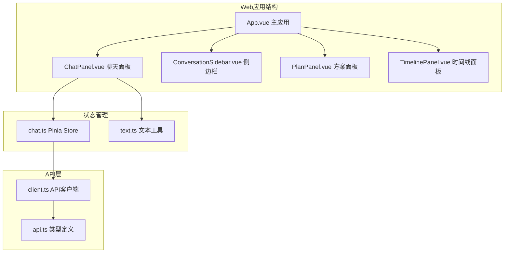
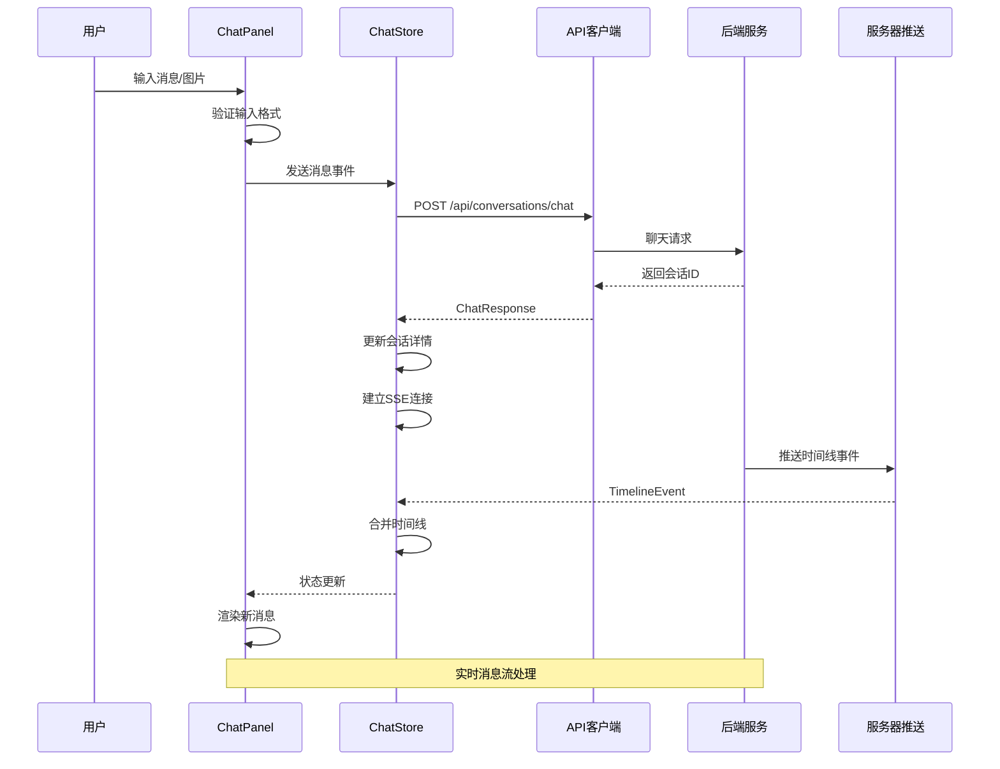
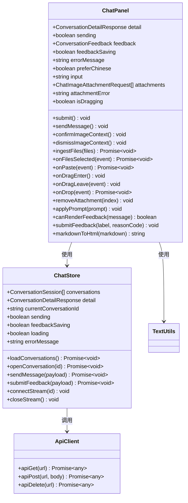
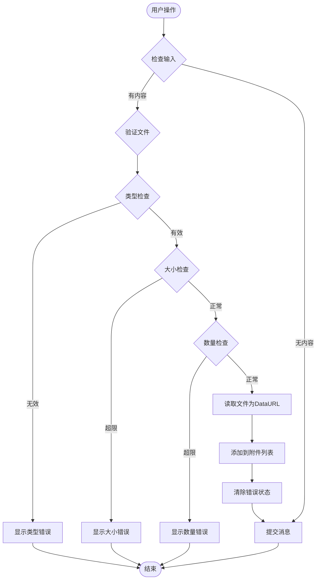
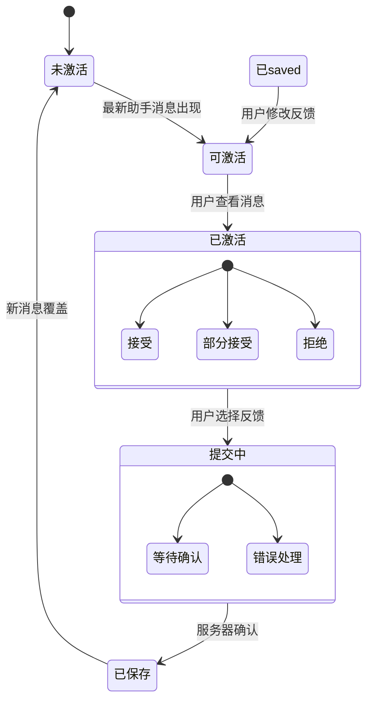
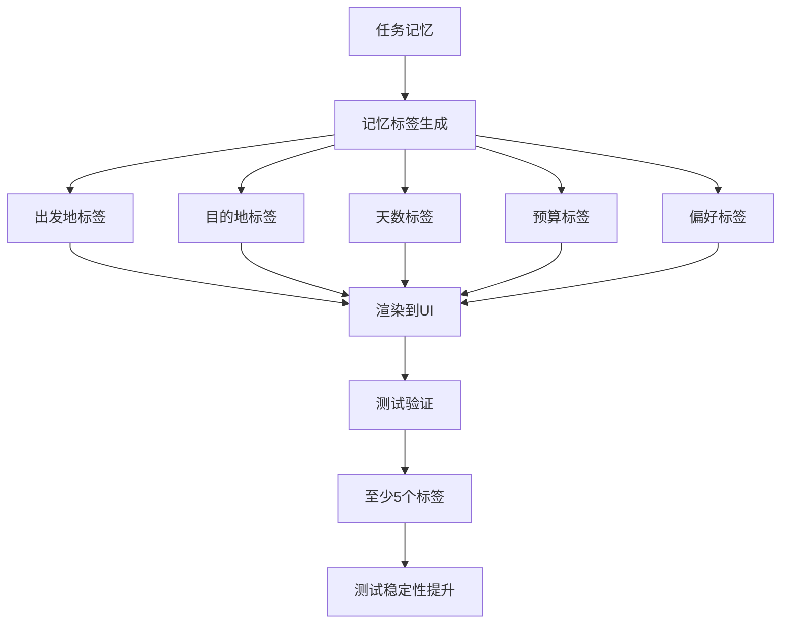
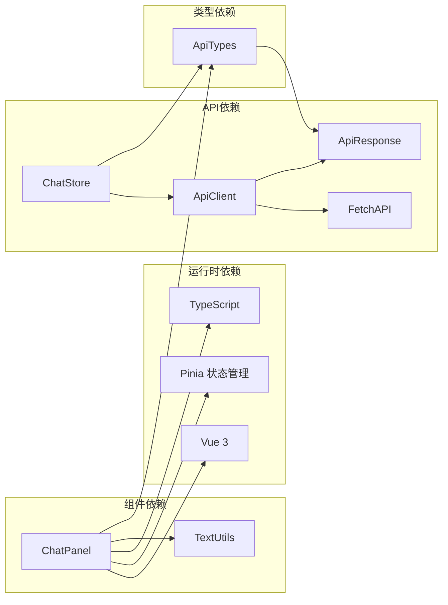

# 聊天面板组件

<cite>
**本文档引用的文件**
- [ChatPanel.vue](file://web/src/components/ChatPanel.vue)
- [chat.ts](file://web/src/stores/chat.ts)
- [client.ts](file://web/src/api/client.ts)
- [api.ts](file://web/src/types/api.ts)
- [text.ts](file://web/src/utils/text.ts)
- [App.vue](file://web/src/App.vue)
- [ChatPanel.spec.ts](file://web/src/components/ChatPanel.spec.ts)
</cite>

## 更新摘要
**变更内容**
- 更新了记忆标签数量测试的稳定性改进，从精确匹配5个标签改为至少5个标签
- 增强了测试对动态标签数量的适应能力
- 改进了测试断言的灵活性，提高测试可靠性

## 目录
1. [简介](#简介)
2. [项目结构](#项目结构)
3. [核心组件](#核心组件)
4. [架构概览](#架构概览)
5. [详细组件分析](#详细组件分析)
6. [依赖关系分析](#依赖关系分析)
7. [性能考虑](#性能考虑)
8. [故障排除指南](#故障排除指南)
9. [结论](#结论)

## 简介

ChatPanel聊天面板组件是旅行规划工作台的核心交互界面，负责处理用户与AI助手之间的对话交流。该组件实现了完整的聊天功能，包括消息渲染、实时流式传输、图片上传、反馈系统等高级特性。组件采用Vue 3 Composition API构建，结合Pinia状态管理，提供了流畅的用户体验和强大的功能性。

## 项目结构

ChatPanel组件位于Web前端项目的组件目录中，与状态管理、API客户端和类型定义紧密协作：

**图表来源**
- [App.vue:352-361](file://web/src/App.vue#L352-L361)
- [chat.ts:15-195](file://web/src/stores/chat.ts#L15-L195)

**章节来源**
- [ChatPanel.vue:1-846](file://web/src/components/ChatPanel.vue#L1-L846)
- [App.vue:1-381](file://web/src/App.vue#L1-L381)

## 核心组件

ChatPanel组件是一个功能完整的聊天界面，包含以下核心功能模块：

### 消息渲染系统
- **用户消息渲染**：纯文本显示，支持中文字符规范化
- **助手回复渲染**：Markdown到HTML转换，支持标题、列表、代码块
- **系统通知**：特殊样式标识，区分不同类型的消息

### 输入功能系统
- **文本输入框**：支持多行输入，快捷键提交
- **图片上传**：拖拽、粘贴、点击选择多种方式
- **附件管理**：预览、删除、数量限制

### 实时流处理
- **SSE连接**：服务器推送事件实时更新
- **消息增量**：时间线事件的增量添加
- **滚动同步**：新消息自动滚动到底部

### 反馈系统
- **内联反馈**：针对最新助手消息的即时评价
- **评分机制**：接受、部分接受、拒绝三种状态
- **保存状态**：防止重复提交和并发问题

### 记忆标签系统
- **动态标签生成**：根据任务记忆自动生成标签
- **标签数量稳定性**：测试改进后支持至少5个标签的灵活匹配
- **标签内容验证**：验证关键信息如预算、偏好等的正确显示

**章节来源**
- [ChatPanel.vue:13-27](file://web/src/components/ChatPanel.vue#L13-L27)
- [chat.ts:15-195](file://web/src/stores/chat.ts#L15-L195)

## 架构概览

ChatPanel组件采用分层架构设计，确保关注点分离和可维护性：

**图表来源**
- [chat.ts:58-80](file://web/src/stores/chat.ts#L58-L80)
- [chat.ts:146-164](file://web/src/stores/chat.ts#L146-L164)

## 详细组件分析

### 组件类结构

**图表来源**
- [ChatPanel.vue:13-498](file://web/src/components/ChatPanel.vue#L13-L498)
- [chat.ts:15-195](file://web/src/stores/chat.ts#L15-L195)
- [client.ts:14-36](file://web/src/api/client.ts#L14-L36)

### 消息渲染机制

组件实现了三种不同类型消息的差异化渲染：

#### 用户消息处理
- **纯文本显示**：直接渲染用户输入内容
- **中文字符处理**：使用`normalizeDisplayText`函数处理编码问题
- **时间戳显示**：本地化时间格式化

#### 助手回复处理
- **Markdown转换**：支持标题、段落、列表语法
- **HTML转义**：防止XSS攻击的安全处理
- **代码高亮**：内联代码块的特殊样式

#### 系统通知处理
- **特殊标识**：通过CSS类名区分不同角色
- **元数据展示**：支持图片附件的可视化展示

### 图片上传功能

**图表来源**
- [ChatPanel.vue:352-381](file://web/src/components/ChatPanel.vue#L352-L381)
- [ChatPanel.vue:487-494](file://web/src/components/ChatPanel.vue#L487-L494)

### 实时消息流处理

组件通过Server-Sent Events (SSE) 实现实时消息流：

#### 连接建立流程
1. **会话打开**：用户选择或创建会话后建立连接
2. **事件监听**：设置`onmessage`回调处理新事件
3. **数据解析**：JSON字符串解析为TimelineEvent对象
4. **状态更新**：合并到现有时间线中

#### 流式更新机制
- **去重处理**：检查事件ID避免重复添加
- **会话匹配**：确保事件属于当前活跃会话
- **增量更新**：只添加新的时间线事件

### 反馈系统集成

**图表来源**
- [ChatPanel.vue:418-426](file://web/src/components/ChatPanel.vue#L418-L426)
- [chat.ts:98-118](file://web/src/stores/chat.ts#L98-L118)

### 记忆标签系统

**图表来源**
- [ChatPanel.vue:281-293](file://web/src/components/ChatPanel.vue#L281-L293)
- [ChatPanel.spec.ts:79-80](file://web/src/components/ChatPanel.spec.ts#L79-L80)

## 依赖关系分析

### 外部依赖

**图表来源**
- [main.ts:1-7](file://web/src/main.ts#L1-L7)
- [chat.ts:1-13](file://web/src/stores/chat.ts#L1-L13)

### 内部依赖关系

组件间的依赖关系清晰明确：

- **ChatPanel** 依赖 **chat.ts** 的状态管理
- **chat.ts** 依赖 **client.ts** 的API调用
- **client.ts** 依赖 **api.ts** 的类型定义
- **ChatPanel** 依赖 **text.ts** 的文本处理工具

**章节来源**
- [ChatPanel.vue:1-11](file://web/src/components/ChatPanel.vue#L1-L11)
- [chat.ts:1-3](file://web/src/stores/chat.ts#L1-L3)

## 性能考虑

### 渲染优化

1. **虚拟列表**：对于大量消息的场景，可以考虑实现虚拟滚动
2. **懒加载**：图片附件采用懒加载策略
3. **防抖处理**：输入框的实时预览功能需要防抖优化

### 内存管理

1. **事件清理**：组件卸载时自动关闭SSE连接
2. **文件释放**：移除附件时释放DataURL内存
3. **状态清理**：会话切换时清理相关状态

### 网络优化

1. **连接复用**：同一会话内的多次操作复用SSE连接
2. **错误重试**：网络异常时的智能重试机制
3. **缓存策略**：合理利用浏览器缓存减少重复请求

## 故障排除指南

### 常见问题及解决方案

#### 消息无法发送
- **检查网络连接**：确认API端点可达性
- **验证输入格式**：确保消息内容或附件至少有一个
- **查看错误状态**：检查errorMessage属性

#### 图片上传失败
- **检查文件类型**：仅支持PNG、JPEG、WEBP、GIF格式
- **验证文件大小**：单张图片不超过5MB
- **确认数量限制**：每轮最多4张图片

#### 实时更新不生效
- **检查SSE连接**：确认EventSource连接状态
- **验证会话ID**：确保当前会话ID正确
- **查看控制台日志**：检查是否有JavaScript错误

#### 反馈提交失败
- **检查反馈状态**：确保feedbackSaving为false
- **验证会话存在**：确认currentConversationId有效
- **查看服务器响应**：检查API返回的错误信息

#### 记忆标签测试不稳定
- **检查标签数量**：确保至少有5个标签显示
- **验证标签内容**：确认预算、偏好等关键信息正确
- **查看测试断言**：使用`toBeGreaterThanOrEqual(5)`而非精确匹配

**章节来源**
- [ChatPanel.vue:315-329](file://web/src/components/ChatPanel.vue#L315-L329)
- [chat.ts:58-80](file://web/src/stores/chat.ts#L58-L80)

## 结论

ChatPanel聊天面板组件展现了现代前端开发的最佳实践，通过合理的架构设计和丰富的功能实现，为用户提供了一个强大而易用的旅行规划对话界面。组件的关键优势包括：

1. **完整的功能集**：从基础聊天到高级反馈系统的一体化设计
2. **优秀的用户体验**：实时消息流、拖拽上传、多语言支持
3. **健壮的错误处理**：全面的输入验证和错误提示机制
4. **良好的可维护性**：清晰的代码结构和完善的类型定义

**更新** 组件在测试方面进行了重要改进，特别是在记忆标签数量测试的稳定性上。通过将精确匹配5个标签的严格要求改为至少5个标签的灵活验证，显著提高了测试的可靠性，减少了由于标签数量动态变化导致的测试失败。

该组件为旅行规划工作台提供了坚实的基础，支持未来功能的扩展和增强。通过遵循文档中提到的最佳实践，开发者可以安全地扩展组件功能，同时保持代码质量和性能表现。