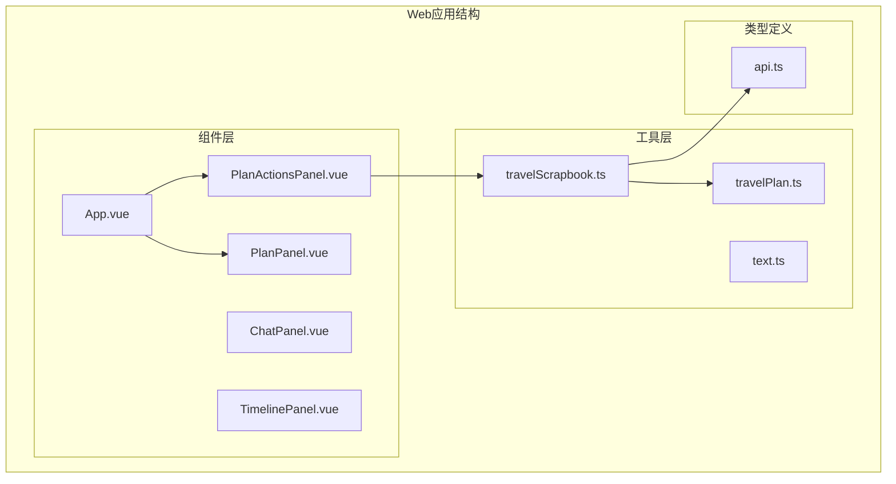
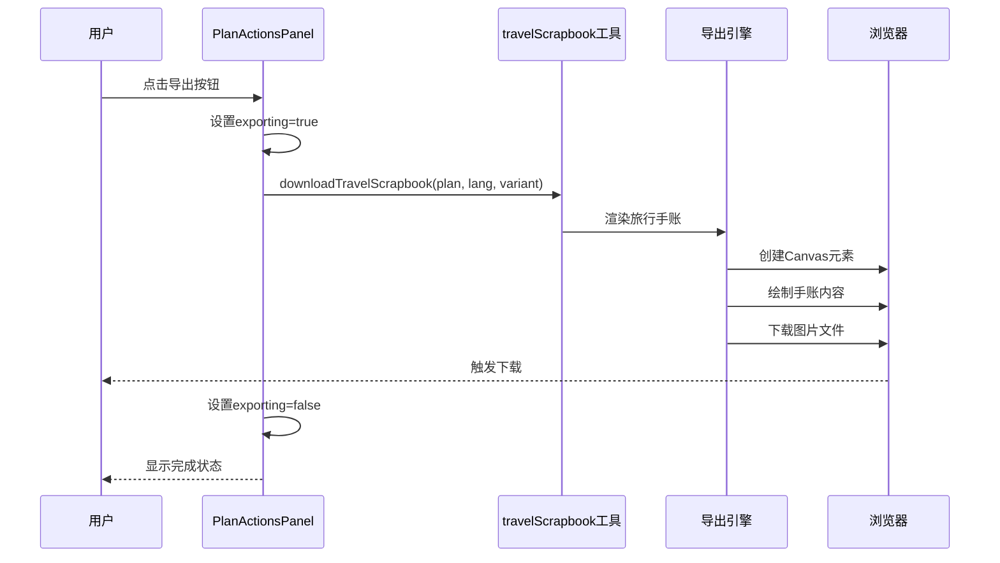
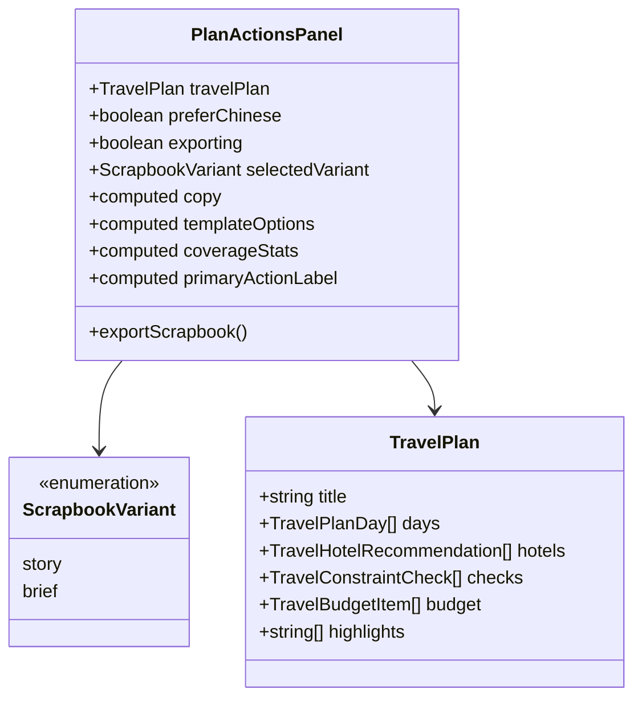
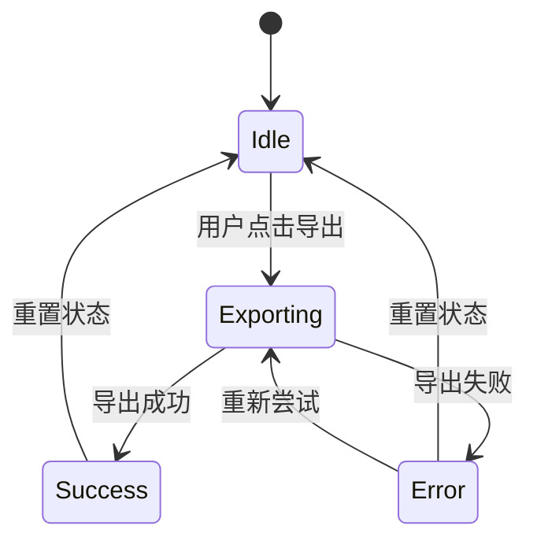
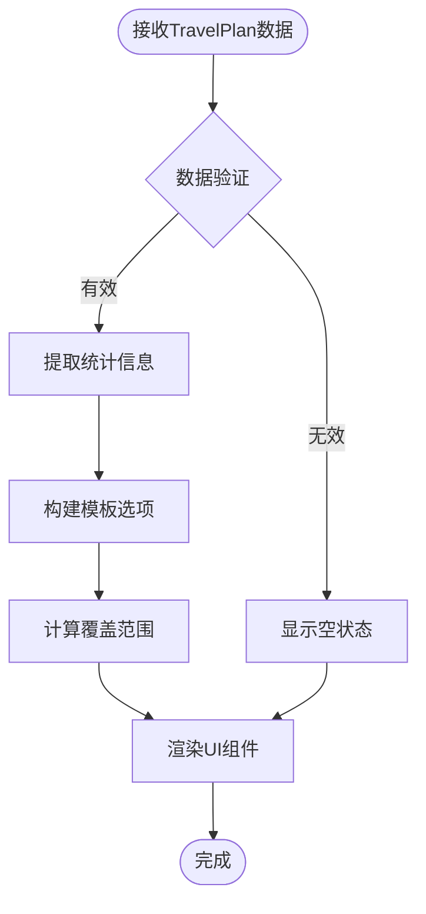
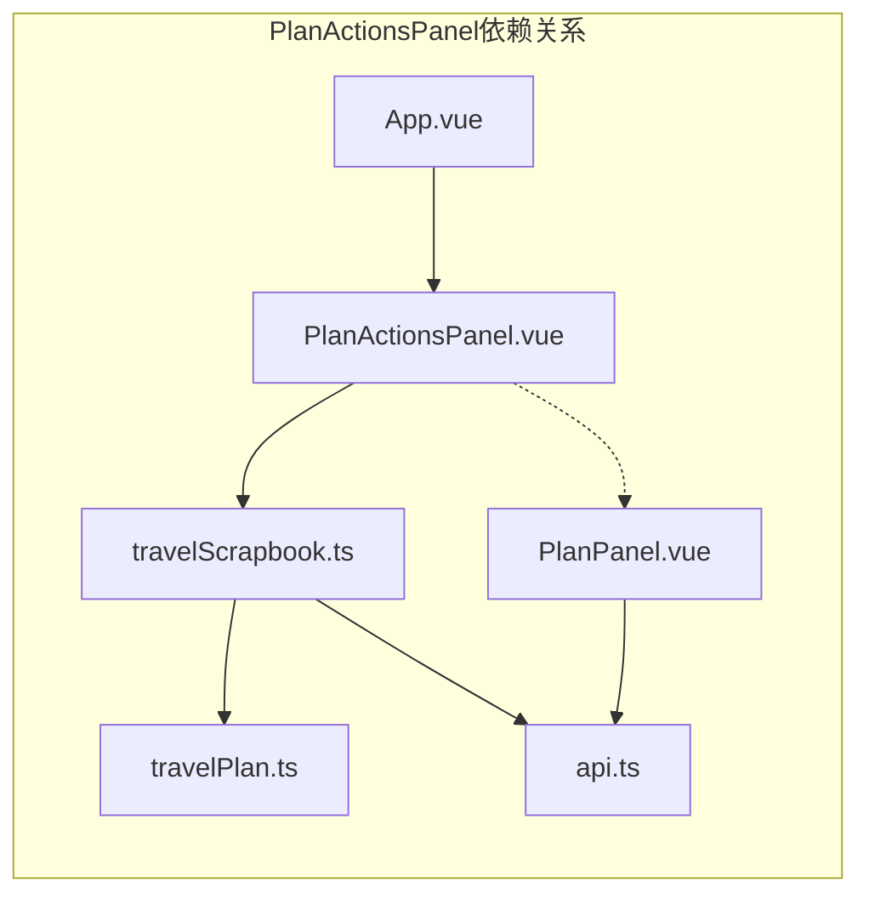

# 计划操作面板组件

<cite>
**本文档引用的文件**
- [PlanActionsPanel.vue](file://web/src/components/PlanActionsPanel.vue)
- [travelScrapbook.ts](file://web/src/utils/travelScrapbook.ts)
- [travelPlan.ts](file://web/src/utils/travelPlan.ts)
- [api.ts](file://web/src/types/api.ts)
- [App.vue](file://web/src/App.vue)
- [PlanPanel.vue](file://web/src/components/PlanPanel.vue)
</cite>

## 目录
1. [简介](#简介)
2. [项目结构](#项目结构)
3. [核心组件](#核心组件)
4. [架构概览](#架构概览)
5. [详细组件分析](#详细组件分析)
6. [依赖关系分析](#依赖关系分析)
7. [性能考虑](#性能考虑)
8. [故障排除指南](#故障排除指南)
9. [结论](#结论)
10. [附录](#附录)

## 简介

PlanActionsPanel（计划操作面板）是TravelAgent旅行规划系统中的一个关键UI组件，专门负责为用户提供旅行计划的导出和分享功能。该组件实现了完整的旅行手账导出流程，支持多种导出模板和语言本地化，为用户提供了直观易用的操作界面。

该组件的核心功能包括：
- 旅行手账导出（支持分享版和执行版两种模板）
- 多语言界面支持（中英文切换）
- 实时预览和统计信息展示
- 加载状态管理和错误处理
- 用户友好的交互体验

## 项目结构

PlanActionsPanel组件位于前端Web应用的组件目录中，与其它核心组件协同工作，形成完整的旅行规划工作区。

**图表来源**
- [App.vue:363-367](file://web/src/App.vue#L363-L367)
- [PlanActionsPanel.vue:1-10](file://web/src/components/PlanActionsPanel.vue#L1-L10)

**章节来源**
- [App.vue:350-381](file://web/src/App.vue#L350-L381)
- [PlanActionsPanel.vue:1-334](file://web/src/components/PlanActionsPanel.vue#L1-L334)

## 核心组件

PlanActionsPanel组件采用Vue 3 Composition API实现，具有以下核心特性：

### 主要属性和状态
- `travelPlan`: 旅行计划数据（可为空）
- `preferChinese`: 语言偏好设置（默认true）
- `exporting`: 导出状态标志
- `selectedVariant`: 选中的导出模板变体

### 功能特性
- **双模板支持**: 分享版（Share Story）和执行版（Trip Brief）
- **实时统计**: 自动计算行程天数、停靠点数量、住宿推荐数量
- **多语言界面**: 完整的中英文界面支持
- **响应式设计**: 适配不同屏幕尺寸
- **无障碍访问**: 完整的键盘导航和屏幕阅读器支持

**章节来源**
- [PlanActionsPanel.vue:7-12](file://web/src/components/PlanActionsPanel.vue#L7-L12)
- [PlanActionsPanel.vue:14-16](file://web/src/components/PlanActionsPanel.vue#L14-L16)
- [PlanActionsPanel.vue:103-114](file://web/src/components/PlanActionsPanel.vue#L103-L114)

## 架构概览

PlanActionsPanel组件在整个应用架构中扮演着重要的桥梁角色，连接用户界面和底层数据处理逻辑。

**图表来源**
- [PlanActionsPanel.vue:122-132](file://web/src/components/PlanActionsPanel.vue#L122-L132)
- [travelScrapbook.ts:81-110](file://web/src/utils/travelScrapbook.ts#L81-L110)

## 详细组件分析

### 组件结构和数据流

PlanActionsPanel采用响应式数据绑定和计算属性模式，确保UI状态与业务逻辑的同步。

**图表来源**
- [PlanActionsPanel.vue:1-133](file://web/src/components/PlanActionsPanel.vue#L1-L133)
- [api.ts:229-248](file://web/src/types/api.ts#L229-L248)

### 模板系统设计

组件支持两种导出模板，每种模板都有独特的布局和内容重点：

#### 分享版模板（Share Story）
- **目标用户**: 与他人分享旅行计划
- **内容特点**: 完整的每日行程、路线草图、住宿建议
- **适用场景**: 社交分享、旅行回忆记录

#### 执行版模板（Trip Brief）
- **目标用户**: 出行前快速预览
- **内容特点**: 关键决策摘要、紧凑的日程安排
- **适用场景**: 出行前检查清单、快速浏览

**章节来源**
- [PlanActionsPanel.vue:51-99](file://web/src/components/PlanActionsPanel.vue#L51-L99)
- [travelScrapbook.ts:112-183](file://web/src/utils/travelScrapbook.ts#L112-L183)

### 状态管理系统

组件实现了完整的状态管理机制，包括加载状态、错误处理和用户反馈。

**图表来源**
- [PlanActionsPanel.vue:14](file://web/src/components/PlanActionsPanel.vue#L14)
- [PlanActionsPanel.vue:122-132](file://web/src/components/PlanActionsPanel.vue#L122-L132)

### 数据处理和转换

组件使用多种工具函数处理旅行计划数据，确保输出内容的准确性和一致性。

**图表来源**
- [PlanActionsPanel.vue:103-114](file://web/src/components/PlanActionsPanel.vue#L103-L114)
- [travelPlan.ts:31-71](file://web/src/utils/travelPlan.ts#L31-L71)

**章节来源**
- [PlanActionsPanel.vue:103-120](file://web/src/components/PlanActionsPanel.vue#L103-L120)
- [travelPlan.ts:31-71](file://web/src/utils/travelPlan.ts#L31-L71)

### 错误处理和用户体验

组件实现了多层次的错误处理机制，确保用户在各种情况下都能获得清晰的反馈。

#### 加载状态管理
- 导出过程中禁用按钮
- 显示加载动画
- 防止重复提交

#### 错误恢复机制
- 导出失败后自动重置状态
- 提供重新尝试选项
- 显示错误原因

#### 用户反馈系统
- 成功导出后的确认提示
- 失败情况下的错误消息
- 进度指示器

**章节来源**
- [PlanActionsPanel.vue:122-132](file://web/src/components/PlanActionsPanel.vue#L122-L132)
- [PlanActionsPanel.vue:327-332](file://web/src/components/PlanActionsPanel.vue#L327-L332)

## 依赖关系分析

PlanActionsPanel组件与其他模块存在紧密的依赖关系，形成了完整的功能体系。

**图表来源**
- [PlanActionsPanel.vue:3-5](file://web/src/components/PlanActionsPanel.vue#L3-L5)
- [travelScrapbook.ts:1-10](file://web/src/utils/travelScrapbook.ts#L1-L10)
- [App.vue:363-367](file://web/src/App.vue#L363-L367)

### 外部依赖

组件依赖于以下外部库和工具：
- **Vue 3**: 响应式框架基础
- **Canvas API**: 图像渲染和导出
- **浏览器下载功能**: 文件下载机制
- **Pinia**: 状态管理（通过App.vue）

### 内部依赖

组件内部模块间的依赖关系：
- PlanActionsPanel -> travelScrapbook（导出功能）
- travelScrapbook -> travelPlan（数据处理）
- travelScrapbook -> api.ts（类型定义）

**章节来源**
- [PlanActionsPanel.vue:1-10](file://web/src/components/PlanActionsPanel.vue#L1-L10)
- [travelScrapbook.ts:1-11](file://web/src/utils/travelScrapbook.ts#L1-L11)

## 性能考虑

### 导出性能优化

旅行手账导出涉及复杂的Canvas渲染过程，组件采用了多项性能优化策略：

#### 渲染优化
- **分阶段渲染**: 先测量后绘制，避免重复计算
- **缩放控制**: 动态调整Canvas缩放比例，限制最大高度
- **内存管理**: 及时清理Canvas元素和上下文

#### 用户体验优化
- **防抖处理**: 防止重复点击触发多次导出
- **进度反馈**: 实时显示导出进度
- **错误恢复**: 导出失败后自动重置状态

### 内存管理

组件实现了严格的内存管理机制：
- 导出完成后立即释放Canvas资源
- 使用finally块确保状态重置
- 避免内存泄漏和性能下降

## 故障排除指南

### 常见问题和解决方案

#### 导出失败
**症状**: 导出按钮变为禁用状态，无文件下载
**可能原因**:
- Canvas渲染失败
- 浏览器不支持Canvas API
- 内存不足

**解决方法**:
1. 检查浏览器控制台错误信息
2. 尝试刷新页面后重试
3. 减少旅行计划规模后重试

#### 模板选择异常
**症状**: 模板选项无法切换或显示错误
**可能原因**:
- 旅行计划数据格式不正确
- 语言设置冲突

**解决方法**:
1. 验证TravelPlan数据结构
2. 检查preferChinese属性设置
3. 重新加载页面

#### 性能问题
**症状**: 导出过程缓慢或卡顿
**可能原因**:
- 旅行计划包含大量数据
- 浏览器性能不足

**解决方法**:
1. 简化旅行计划内容
2. 关闭其他占用资源的标签页
3. 更新到最新版本的浏览器

**章节来源**
- [PlanActionsPanel.vue:122-132](file://web/src/components/PlanActionsPanel.vue#L122-L132)
- [travelScrapbook.ts:81-110](file://web/src/utils/travelScrapbook.ts#L81-L110)

## 结论

PlanActionsPanel组件是一个设计精良的旅行计划导出工具，具有以下突出特点：

### 技术优势
- **模块化设计**: 清晰的职责分离和依赖管理
- **响应式架构**: 基于Vue 3的现代前端技术栈
- **性能优化**: 针对Canvas渲染的专门优化
- **用户体验**: 直观的界面设计和流畅的交互

### 功能完整性
- 支持多种导出模板和语言
- 完整的状态管理和错误处理
- 丰富的统计数据和预览功能
- 与整体系统的无缝集成

### 最佳实践体现
- 清晰的组件边界和接口定义
- 有效的状态管理模式
- 健壮的错误处理机制
- 良好的可维护性和扩展性

该组件为TravelAgent系统提供了强大的旅行计划导出能力，是整个应用生态系统中的重要组成部分。

## 附录

### 开发最佳实践

#### 组件设计原则
1. **单一职责**: 专注于导出功能，不承担其他职责
2. **数据驱动**: 基于响应式数据的UI更新
3. **状态隔离**: 明确的状态管理和生命周期控制
4. **错误处理**: 完善的异常捕获和恢复机制

#### 用户体验优化
1. **即时反馈**: 导出过程中的进度指示
2. **容错设计**: 对异常情况的优雅降级
3. **性能监控**: 导出时间的合理控制
4. **可访问性**: 完整的键盘导航支持

#### 维护建议
1. **代码注释**: 详细的函数和组件说明
2. **类型安全**: 完整的TypeScript类型定义
3. **测试覆盖**: 关键功能的单元测试
4. **文档更新**: 随代码变更更新技术文档