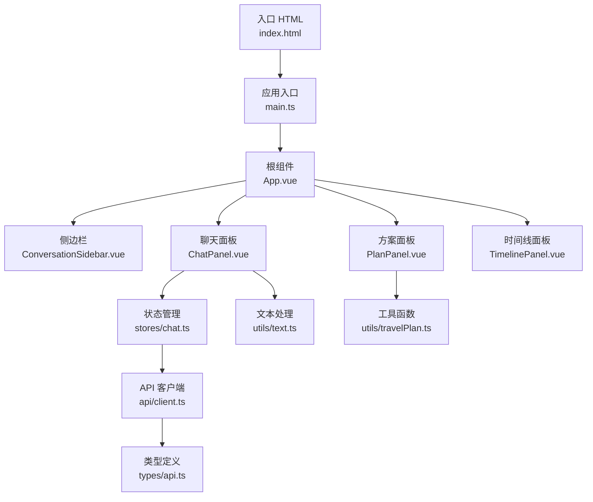
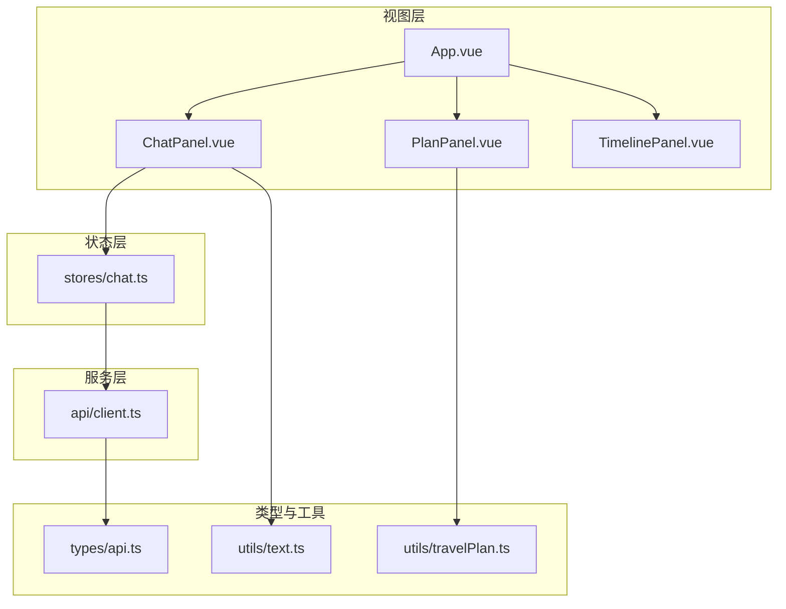
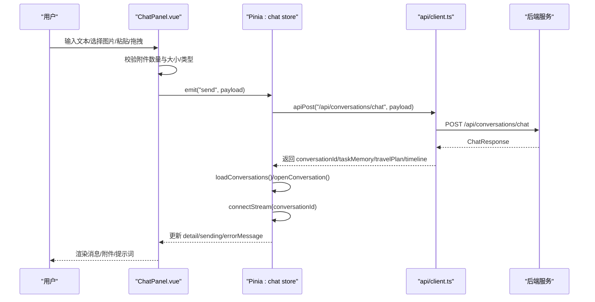
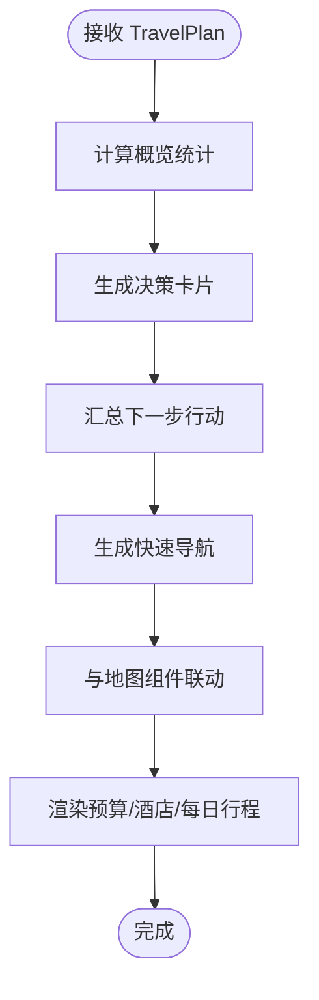
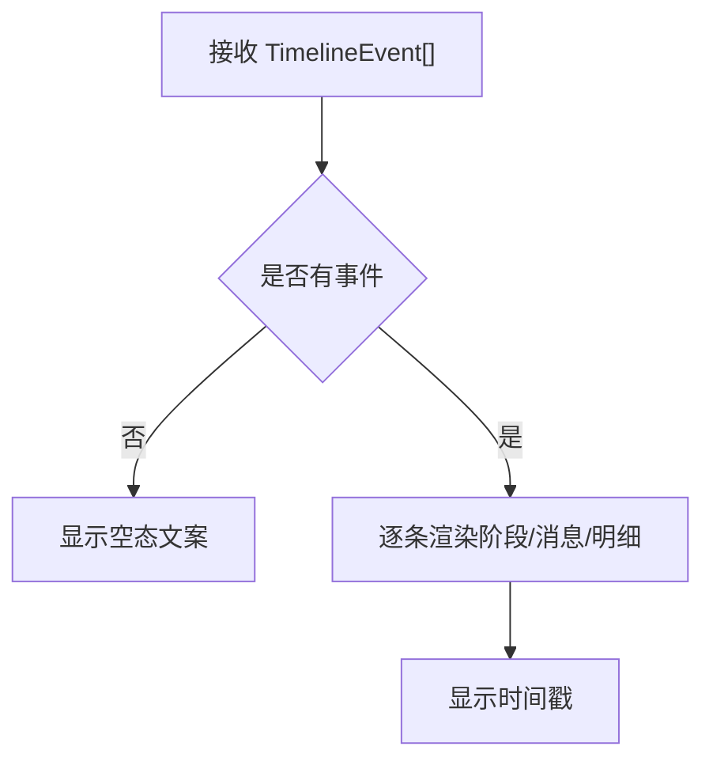
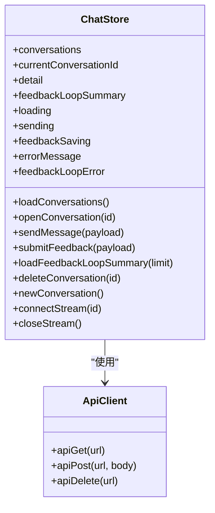
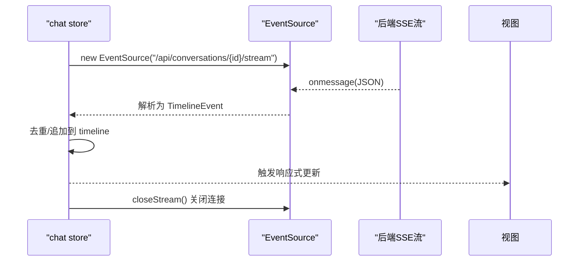
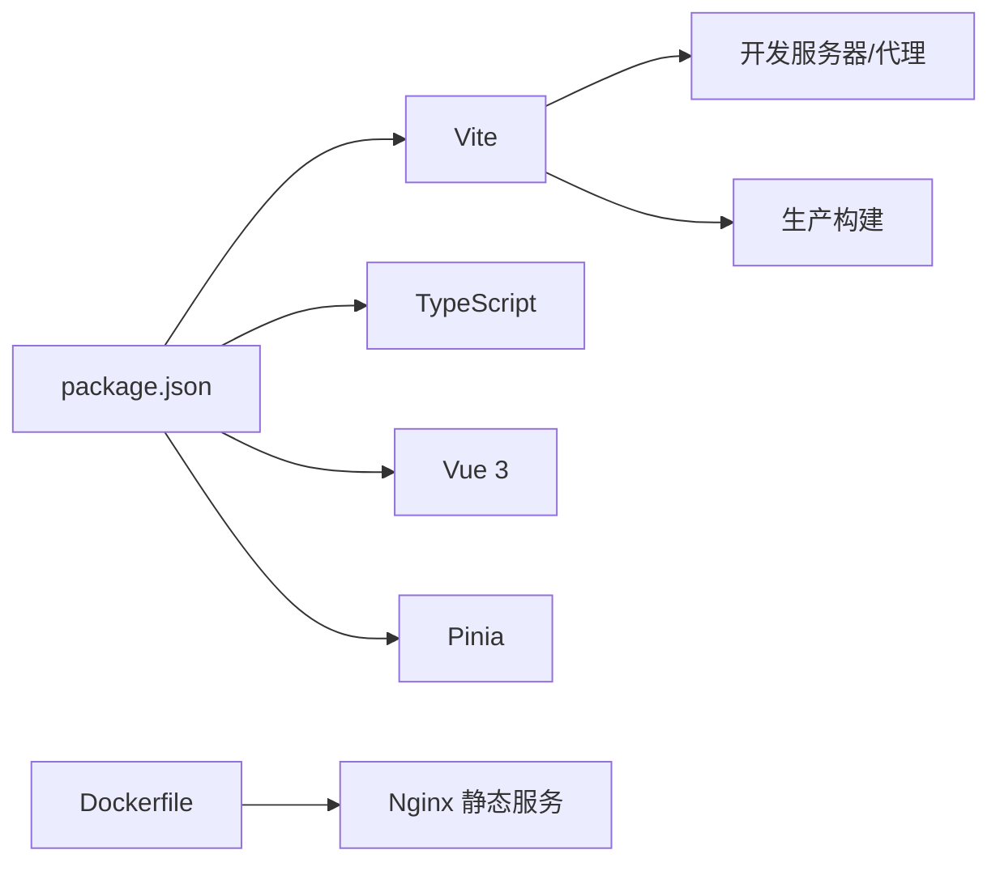

# 前端开发指南

<cite>
**本文档引用的文件**
- [web/package.json](file://web/package.json)
- [web/vite.config.ts](file://web/vite.config.ts)
- [web/tsconfig.json](file://web/tsconfig.json)
- [web/src/main.ts](file://web/src/main.ts)
- [web/index.html](file://web/index.html)
- [web/src/App.vue](file://web/src/App.vue)
- [web/src/stores/chat.ts](file://web/src/stores/chat.ts)
- [web/src/components/ChatPanel.vue](file://web/src/components/ChatPanel.vue)
- [web/src/components/PlanPanel.vue](file://web/src/components/PlanPanel.vue)
- [web/src/components/TimelinePanel.vue](file://web/src/components/TimelinePanel.vue)
- [web/src/api/client.ts](file://web/src/api/client.ts)
- [web/src/types/api.ts](file://web/src/types/api.ts)
- [web/src/utils/text.ts](file://web/src/utils/text.ts)
- [web/src/utils/travelPlan.ts](file://web/src/utils/travelPlan.ts)
- [web/Dockerfile](file://web/Dockerfile)
</cite>

## 目录
1. [简介](#简介)
2. [项目结构](#项目结构)
3. [核心组件](#核心组件)
4. [架构总览](#架构总览)
5. [组件详解](#组件详解)
6. [依赖关系分析](#依赖关系分析)
7. [性能与优化](#性能与优化)
8. [故障排查指南](#故障排查指南)
9. [结论](#结论)
10. [附录](#附录)

## 简介
本指南面向TravelAgent前端团队，系统讲解基于Vue 3 + TypeScript + Vite的开发环境搭建与配置，深入解析前端组件架构（ChatPanel、PlanPanel、TimelinePanel等），详解Pinia状态管理在聊天会话中的应用，阐述实时流式通信（SSE）的实现与数据更新机制，并提供组件开发最佳实践、构建配置、开发工具链与性能优化建议。

## 项目结构
前端位于web目录，采用Vite作为构建工具，使用Vue 3单文件组件与TypeScript类型系统，Pinia进行状态管理，通过自定义API客户端封装后端接口调用。

图表来源
- [web/index.html:1-13](file://web/index.html#L1-L13)
- [web/src/main.ts:1-7](file://web/src/main.ts#L1-L7)
- [web/src/App.vue:1-381](file://web/src/App.vue#L1-L381)
- [web/src/stores/chat.ts:1-196](file://web/src/stores/chat.ts#L1-L196)
- [web/src/components/ChatPanel.vue:1-797](file://web/src/components/ChatPanel.vue#L1-L797)
- [web/src/components/PlanPanel.vue:1-800](file://web/src/components/PlanPanel.vue#L1-L800)
- [web/src/components/TimelinePanel.vue:1-157](file://web/src/components/TimelinePanel.vue#L1-L157)
- [web/src/api/client.ts:1-37](file://web/src/api/client.ts#L1-L37)
- [web/src/types/api.ts:1-349](file://web/src/types/api.ts#L1-L349)
- [web/src/utils/text.ts:1-31](file://web/src/utils/text.ts#L1-L31)
- [web/src/utils/travelPlan.ts:1-123](file://web/src/utils/travelPlan.ts#L1-L123)

章节来源
- [web/package.json:1-26](file://web/package.json#L1-L26)
- [web/vite.config.ts:1-19](file://web/vite.config.ts#L1-L19)
- [web/tsconfig.json:1-17](file://web/tsconfig.json#L1-L17)
- [web/src/main.ts:1-7](file://web/src/main.ts#L1-L7)
- [web/index.html:1-13](file://web/index.html#L1-L13)

## 核心组件
- ChatPanel：负责用户输入、消息展示、图片附件上传、图像上下文确认、反馈提交与提示词引导。
- PlanPanel：展示旅行计划的概览、决策卡片、预算与酒店推荐、每日行程与地图联动。
- TimelinePanel：展示生成过程中的关键步骤与细节，按阶段与时间排序。
- App.vue：应用壳层，组织布局、语言切换、侧边栏与工作区网格，协调各子组件。
- stores/chat：Pinia聊天状态仓库，封装会话列表、当前会话详情、发送消息、SSE流式更新、反馈提交等。

章节来源
- [web/src/components/ChatPanel.vue:1-797](file://web/src/components/ChatPanel.vue#L1-L797)
- [web/src/components/PlanPanel.vue:1-800](file://web/src/components/PlanPanel.vue#L1-L800)
- [web/src/components/TimelinePanel.vue:1-157](file://web/src/components/TimelinePanel.vue#L1-L157)
- [web/src/App.vue:1-381](file://web/src/App.vue#L1-L381)
- [web/src/stores/chat.ts:1-196](file://web/src/stores/chat.ts#L1-L196)

## 架构总览
前端采用“组件化 + 状态集中管理”的架构模式：
- 视图层：App.vue组织布局；ChatPanel、PlanPanel、TimelinePanel分别渲染不同视图区域。
- 状态层：Pinia chat store统一管理会话、消息、计划、时间线、错误信息与SSE连接。
- 服务层：api/client封装HTTP请求，统一错误处理与响应解包。
- 类型层：types/api.ts定义所有前后端交互的数据模型，确保类型安全。
- 工具层：utils/text.ts与utils/travelPlan.ts提供文本规范化与地图点位计算等辅助能力。

图表来源
- [web/src/App.vue:1-381](file://web/src/App.vue#L1-L381)
- [web/src/components/ChatPanel.vue:1-797](file://web/src/components/ChatPanel.vue#L1-L797)
- [web/src/components/PlanPanel.vue:1-800](file://web/src/components/PlanPanel.vue#L1-L800)
- [web/src/components/TimelinePanel.vue:1-157](file://web/src/components/TimelinePanel.vue#L1-L157)
- [web/src/stores/chat.ts:1-196](file://web/src/stores/chat.ts#L1-L196)
- [web/src/api/client.ts:1-37](file://web/src/api/client.ts#L1-L37)
- [web/src/types/api.ts:1-349](file://web/src/types/api.ts#L1-L349)
- [web/src/utils/text.ts:1-31](file://web/src/utils/text.ts#L1-L31)
- [web/src/utils/travelPlan.ts:1-123](file://web/src/utils/travelPlan.ts#L1-L123)

## 组件详解

### ChatPanel 组件
职责与特性
- 输入与发送：支持纯文本与图片附件（最多4张，每张≤5MB，类型限制），支持粘贴截图与拖拽上传。
- 图像上下文：当后端返回待确认的事实时，提供“使用事实”“忽略”操作，触发imageContextAction。
- 消息渲染：区分用户与助手消息，支持Markdown到HTML的简单转换，显示时间戳与图片附件。
- 提示词引导：根据任务记忆与已有计划动态生成“下一步建议”，提升交互效率。
- 反馈提交：对最新一条助手消息进行“接受/部分接受/拒绝”反馈，支持原因码与备注。
- 错误处理：统一显示发送与附件错误，避免重复提交。

图表来源
- [web/src/components/ChatPanel.vue:1-797](file://web/src/components/ChatPanel.vue#L1-L797)
- [web/src/stores/chat.ts:58-80](file://web/src/stores/chat.ts#L58-L80)
- [web/src/api/client.ts:18-28](file://web/src/api/client.ts#L18-L28)

章节来源
- [web/src/components/ChatPanel.vue:1-797](file://web/src/components/ChatPanel.vue#L1-L797)

### PlanPanel 组件
职责与特性
- 概览与统计：展示估算总费用、推荐住宿区域、行程天数与天气摘要。
- 决策卡片：执行就绪度、预算匹配度、节律适配度、地点置信度四维评估。
- 下一步行动：基于约束检查、预算与地点置信度给出优化建议。
- 快速导航：提供“优先查看”快捷锚点，平滑滚动至对应区块。
- 地图联动：与PlanMap组件配合，激活酒店或站点高亮，支持点位选择回调。
- 预算与酒店：分项预算明细与酒店推荐卡片，含坐标与地址等详情。
- 每日行程：按日展示停靠点、通勤时间、活动时间与成本。

图表来源
- [web/src/components/PlanPanel.vue:1-800](file://web/src/components/PlanPanel.vue#L1-L800)
- [web/src/utils/travelPlan.ts:31-71](file://web/src/utils/travelPlan.ts#L31-L71)

章节来源
- [web/src/components/PlanPanel.vue:1-800](file://web/src/components/PlanPanel.vue#L1-L800)
- [web/src/utils/travelPlan.ts:1-123](file://web/src/utils/travelPlan.ts#L1-L123)

### TimelinePanel 组件
职责与特性
- 展示生成流程：按阶段（如“理解需求”“生成方案”“校验方案”等）与消息描述呈现。
- 明细标签：将内部键值映射为中英文可读标签，过滤空值，仅展示有效字段。
- 时间戳：以本地化格式显示事件创建时间。

图表来源
- [web/src/components/TimelinePanel.vue:1-157](file://web/src/components/TimelinePanel.vue#L1-L157)

章节来源
- [web/src/components/TimelinePanel.vue:1-157](file://web/src/components/TimelinePanel.vue#L1-L157)

### App.vue 布局与语言切换
- 语言存储：使用localStorage持久化UI语言偏好，初始化时读取，变更时写入。
- 英雄区：根据当前会话的任务记忆与旅行计划动态生成焦点标题、摘要、亮点与流程状态。
- 工作区网格：左侧侧边栏，右侧聊天、方案与时间线三栏布局。

章节来源
- [web/src/App.vue:1-381](file://web/src/App.vue#L1-L381)

### Pinia 聊天状态管理（chat store）
状态设计
- 会话相关：conversations、currentConversationId、detail、feedbackLoopSummary
- 加载与错误：loading、feedbackLoopLoading、feedbackLoopError、errorMessage
- 发送与反馈：sending、feedbackSaving、feedbackLoopStale、feedbackLoopLimit
- SSE：eventSource实例，connectStream/closeStream

数据流与组件通信
- App.vue通过storeToRefs读取响应式状态，向子组件传递props与事件。
- ChatPanel通过emit("send")与emit("feedback")与store交互。
- store内部通过apiGet/apiPost/apiDelete封装HTTP请求，统一错误格式化。

图表来源
- [web/src/stores/chat.ts:1-196](file://web/src/stores/chat.ts#L1-L196)
- [web/src/api/client.ts:1-37](file://web/src/api/client.ts#L1-L37)

章节来源
- [web/src/stores/chat.ts:1-196](file://web/src/stores/chat.ts#L1-L196)

### 实时流式通信（SSE）
- 连接建立：openConversation成功后，connectStream为当前会话创建EventSource连接。
- 数据更新：onmessage解析JSON为TimelineEvent，去重后追加到detail.timeline。
- 生命周期：组件卸载或重新打开会话时，closeStream关闭旧连接，避免内存泄漏。

图表来源
- [web/src/stores/chat.ts:146-164](file://web/src/stores/chat.ts#L146-L164)

章节来源
- [web/src/stores/chat.ts:146-164](file://web/src/stores/chat.ts#L146-L164)

## 依赖关系分析
- 开发与运行时依赖：Vue 3、Pinia、Vite、TypeScript、测试工具（vitest/jsdom）。
- 构建与代理：Vite插件、开发服务器端口与/api代理到后端8080。
- 类型系统：严格模式、ESNext模块解析、DOM/ESNext库、全局类型声明。
- Docker：多阶段构建，注入高德地图密钥与安全码，Nginx提供静态资源服务。

图表来源
- [web/package.json:1-26](file://web/package.json#L1-L26)
- [web/vite.config.ts:1-19](file://web/vite.config.ts#L1-L19)
- [web/Dockerfile:1-22](file://web/Dockerfile#L1-L22)

章节来源
- [web/package.json:1-26](file://web/package.json#L1-L26)
- [web/vite.config.ts:1-19](file://web/vite.config.ts#L1-L19)
- [web/tsconfig.json:1-17](file://web/tsconfig.json#L1-L17)
- [web/Dockerfile:1-22](file://web/Dockerfile#L1-L22)

## 性能与优化
- 响应式拆分：使用storeToRefs从store中解构只读引用，减少不必要的重渲染。
- 列表渲染：为列表项提供稳定key，避免重复DOM节点创建。
- 图片处理：上传前校验类型与大小，限制并发读取，及时释放内存。
- SSE复用：同一会话内复用EventSource，避免重复连接；组件卸载时关闭。
- 懒加载与滚动：PlanPanel的锚点滚动使用smooth，避免阻塞主线程。
- 构建优化：生产构建开启类型检查与打包，Docker镜像最小化部署。

## 故障排查指南
常见问题与定位
- 接口失败：检查api/client.ts的unwrap逻辑与后端响应code字段，关注errorMessage。
- SSE不更新：确认connectStream已建立且未被close；检查conversationId是否匹配；查看onmessage解析是否异常。
- 附件上传失败：检查MAX_ATTACHMENTS、MAX_ATTACHMENT_BYTES与ALLOWED_IMAGE_TYPES限制；查看attachmentError提示。
- 文本乱码：使用normalizeDisplayText进行UTF-8摩卡贝克修复与中文字符计数判断。
- Docker构建失败：确认VITE_AMAP_WEB_KEY与VITE_AMAP_SECURITY_JS_CODE参数传入。

章节来源
- [web/src/api/client.ts:1-37](file://web/src/api/client.ts#L1-L37)
- [web/src/stores/chat.ts:166-171](file://web/src/stores/chat.ts#L166-L171)
- [web/src/components/ChatPanel.vue:35-37](file://web/src/components/ChatPanel.vue#L35-L37)
- [web/src/utils/text.ts:1-31](file://web/src/utils/text.ts#L1-L31)
- [web/Dockerfile:9-12](file://web/Dockerfile#L9-L12)

## 结论
本指南提供了从环境搭建到组件实现、状态管理与实时通信的完整前端开发路径。通过清晰的组件边界、Pinia集中状态与严格的类型约束，前端能够高效地与后端协作，提供流畅的旅行规划体验。建议在后续迭代中持续完善可访问性、国际化与性能监控。

## 附录

### 开发环境搭建与配置
- 安装依赖：使用npm ci安装依赖。
- 启动开发：npm run dev，访问本地开发服务器。
- 生产构建：npm run build，产物输出至dist。
- 预览构建：npm run preview。
- 测试：npm run test。

章节来源
- [web/package.json:6-11](file://web/package.json#L6-L11)
- [web/vite.config.ts:6-14](file://web/vite.config.ts#L6-L14)
- [web/tsconfig.json:2-14](file://web/tsconfig.json#L2-L14)

### API 客户端与类型定义
- api/client.ts：统一封装GET/POST/DELETE，统一错误抛出与响应解包。
- types/api.ts：定义会话、消息、旅行计划、预算、约束检查、时间线事件等完整类型体系。

章节来源
- [web/src/api/client.ts:1-37](file://web/src/api/client.ts#L1-L37)
- [web/src/types/api.ts:1-349](file://web/src/types/api.ts#L1-L349)