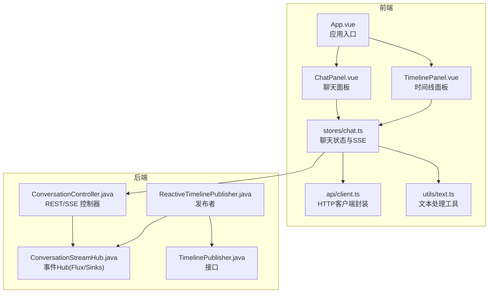
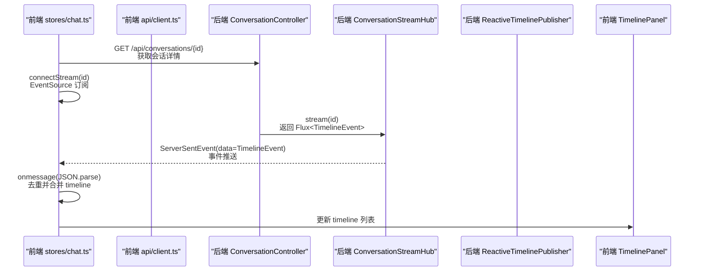
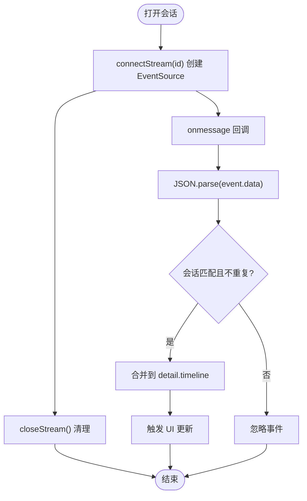
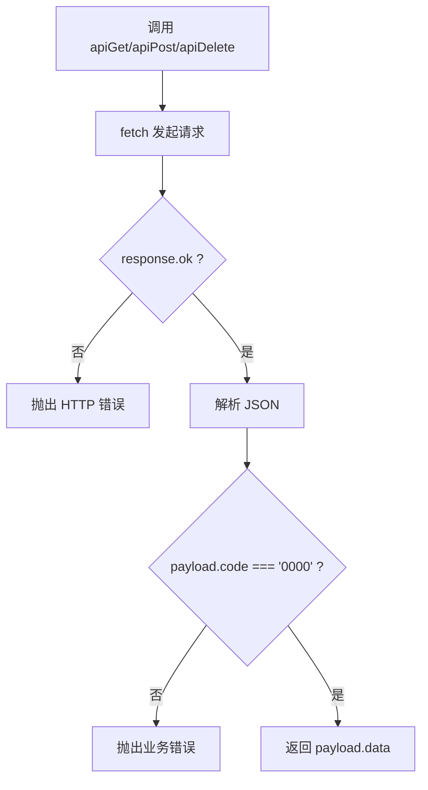
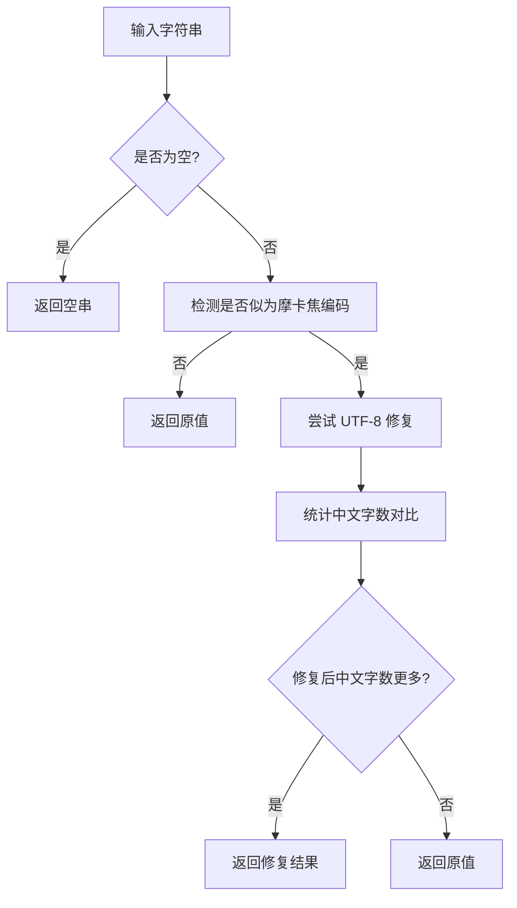
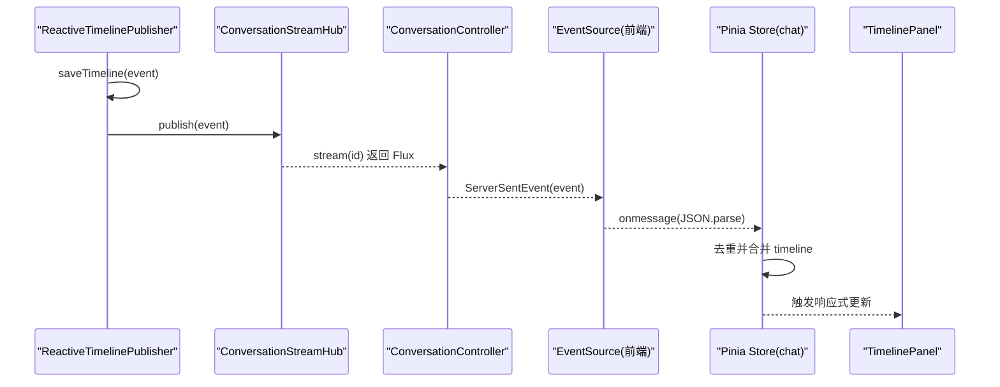
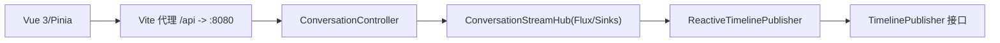

# 实时通信

<cite>
**本文引用的文件**
- [web/src/api/client.ts](file://web/src/api/client.ts)
- [web/src/utils/text.ts](file://web/src/utils/text.ts)
- [web/src/stores/chat.ts](file://web/src/stores/chat.ts)
- [web/src/App.vue](file://web/src/App.vue)
- [web/src/components/ChatPanel.vue](file://web/src/components/ChatPanel.vue)
- [web/src/components/TimelinePanel.vue](file://web/src/components/TimelinePanel.vue)
- [web/vite.config.ts](file://web/vite.config.ts)
- [web/package.json](file://web/package.json)
- [travel-agent-app/src/main/java/com/travalagent/app/controller/ConversationController.java](file://travel-agent-app/src/main/java/com/travalagent/app/controller/ConversationController.java)
- [travel-agent-app/src/main/java/com/travalagent/app/stream/ConversationStreamHub.java](file://travel-agent-app/src/main/java/com/travalagent/app/stream/ConversationStreamHub.java)
- [travel-agent-app/src/main/java/com/travalagent/app/stream/ReactiveTimelinePublisher.java](file://travel-agent-app/src/main/java/com/travalagent/app/stream/ReactiveTimelinePublisher.java)
- [travel-agent-domain/src/main/java/com/travalagent/domain/event/TimelinePublisher.java](file://travel-agent-domain/src/main/java/com/travalagent/domain/event/TimelinePublisher.java)
- [travel-agent-app/src/main/java/com/travalagent/app/stream/ConversationStreamHub.java](file://travel-agent-app/src/main/java/com/travalagent/app/stream/ConversationStreamHub.java)
- [web/src/types/api.ts](file://web/src/types/api.ts)
</cite>

## 目录
1. [引言](#引言)
2. [项目结构](#项目结构)
3. [核心组件](#核心组件)
4. [架构总览](#架构总览)
5. [详细组件分析](#详细组件分析)
6. [依赖关系分析](#依赖关系分析)
7. [性能考量](#性能考量)
8. [故障排查指南](#故障排查指南)
9. [结论](#结论)
10. [附录](#附录)

## 引言
本文件面向实时通信系统，聚焦于基于 Server-Sent Events（SSE）的流式传输实现，涵盖连接建立、事件监听与断线重连策略；同时对前端 API 客户端设计（请求/响应封装、错误处理）、文本处理工具函数（如 normalizeDisplayText 的设计思路）进行深入解析，并给出实时数据更新的处理流程（消息推送、状态同步与 UI 响应）。此外，文档还提供 WebSocket 集成与长连接管理的可选实现建议、网络异常处理方案以及性能监控与调试工具的使用指南。

## 项目结构
前端采用 Vue 3 + Pinia 架构，后端为 Spring WebFlux（Reactor）+ Spring MVC，SSE 使用 ServerSentEvent 输出。核心交互路径如下：
- 前端通过 EventSource 订阅后端 SSE 流
- 后端将领域事件转换为 ServerSentEvent 推送至前端
- 前端 Store 将事件合并到本地 timeline 并驱动 UI 更新

图表来源
- [web/src/App.vue:1-381](file://web/src/App.vue#L1-L381)
- [web/src/components/ChatPanel.vue:1-797](file://web/src/components/ChatPanel.vue#L1-L797)
- [web/src/components/TimelinePanel.vue:1-157](file://web/src/components/TimelinePanel.vue#L1-L157)
- [web/src/stores/chat.ts:1-196](file://web/src/stores/chat.ts#L1-L196)
- [web/src/api/client.ts:1-37](file://web/src/api/client.ts#L1-L37)
- [web/src/utils/text.ts:1-31](file://web/src/utils/text.ts#L1-L31)
- [travel-agent-app/src/main/java/com/travalagent/app/controller/ConversationController.java:1-101](file://travel-agent-app/src/main/java/com/travalagent/app/controller/ConversationController.java#L1-L101)
- [travel-agent-app/src/main/java/com/travalagent/app/stream/ConversationStreamHub.java:1-33](file://travel-agent-app/src/main/java/com/travalagent/app/stream/ConversationStreamHub.java#L1-L33)
- [travel-agent-app/src/main/java/com/travalagent/app/stream/ReactiveTimelinePublisher.java:1-28](file://travel-agent-app/src/main/java/com/travalagent/app/stream/ReactiveTimelinePublisher.java#L1-L28)
- [travel-agent-domain/src/main/java/com/travalagent/domain/event/TimelinePublisher.java:1-9](file://travel-agent-domain/src/main/java/com/travalagent/domain/event/TimelinePublisher.java#L1-L9)

章节来源
- [web/src/App.vue:1-381](file://web/src/App.vue#L1-L381)
- [web/src/stores/chat.ts:1-196](file://web/src/stores/chat.ts#L1-L196)
- [travel-agent-app/src/main/java/com/travalagent/app/controller/ConversationController.java:1-101](file://travel-agent-app/src/main/java/com/travalagent/app/controller/ConversationController.java#L1-L101)

## 核心组件
- 前端 API 客户端：统一处理响应码校验、错误抛出与 JSON 解析，提供 GET/POST/DELETE 方法。
- 文本处理工具：针对显示文本进行 UTF-8 摩卡焦修复与中英文字符计数，保证 UI 正确渲染。
- 聊天 Store：负责会话列表加载、打开会话、发送消息、删除会话、提交反馈、加载反馈环摘要，以及 SSE 连接与事件合并。
- SSE 控制器：以 TEXT_EVENT_STREAM_VALUE 输出 ServerSentEvent，事件名映射为执行阶段。
- 事件 Hub：基于 Reactor Sinks 多播并缓冲，支持按会话维度的流订阅与完成通知。

章节来源
- [web/src/api/client.ts:1-37](file://web/src/api/client.ts#L1-L37)
- [web/src/utils/text.ts:1-31](file://web/src/utils/text.ts#L1-L31)
- [web/src/stores/chat.ts:1-196](file://web/src/stores/chat.ts#L1-L196)
- [travel-agent-app/src/main/java/com/travalagent/app/controller/ConversationController.java:92-100](file://travel-agent-app/src/main/java/com/travalagent/app/controller/ConversationController.java#L92-L100)
- [travel-agent-app/src/main/java/com/travalagent/app/stream/ConversationStreamHub.java:1-33](file://travel-agent-app/src/main/java/com/travalagent/app/stream/ConversationStreamHub.java#L1-L33)

## 架构总览
SSE 实时通信链路从后端领域事件到前端 UI 的完整流程如下：

图表来源
- [web/src/stores/chat.ts:146-164](file://web/src/stores/chat.ts#L146-L164)
- [travel-agent-app/src/main/java/com/travalagent/app/controller/ConversationController.java:92-100](file://travel-agent-app/src/main/java/com/travalagent/app/controller/ConversationController.java#L92-L100)
- [travel-agent-app/src/main/java/com/travalagent/app/stream/ConversationStreamHub.java:21-24](file://travel-agent-app/src/main/java/com/travalagent/app/stream/ConversationStreamHub.java#L21-L24)
- [web/src/components/TimelinePanel.vue:125-156](file://web/src/components/TimelinePanel.vue#L125-L156)

## 详细组件分析

### SSE 连接与事件监听（前端）
- 连接建立：在打开会话后调用 connectStream，创建 EventSource 并指向 /api/conversations/{id}/stream。
- 事件监听：onmessage 回调中解析 event.data 为 TimelineEvent，进行会话 ID 与重复项校验后合并到 detail.timeline。
- 断线与清理：closeStream 关闭当前 EventSource；删除会话时同步关闭流，避免内存泄漏。

图表来源
- [web/src/stores/chat.ts:146-164](file://web/src/stores/chat.ts#L146-L164)

章节来源
- [web/src/stores/chat.ts:146-164](file://web/src/stores/chat.ts#L146-L164)

### API 客户端设计（请求拦截器、响应处理与错误重试）
- 统一响应处理：unwrap 对响应状态与业务 code 进行校验，非成功状态抛出错误；成功时提取 data 字段。
- 请求方法：提供 apiGet、apiPost、apiDelete，统一 Content-Type 与 JSON 序列化。
- 错误重试机制：当前未实现自动重试；可在调用侧包装重试逻辑或引入拦截器层扩展。

图表来源
- [web/src/api/client.ts:3-12](file://web/src/api/client.ts#L3-L12)
- [web/src/api/client.ts:14-36](file://web/src/api/client.ts#L14-L36)

章节来源
- [web/src/api/client.ts:1-37](file://web/src/api/client.ts#L1-L37)

### 文本处理工具函数（normalizeDisplayText 等）
- normalizeDisplayText：当输入为空或非摩卡焦编码时直接返回；否则尝试修复为 UTF-8，再比较中文字数以决定是否采用修复结果。
- 设计思路：优先保证显示正确性，避免乱码；对空值安全处理，确保 UI 不崩溃。

图表来源
- [web/src/utils/text.ts:19-30](file://web/src/utils/text.ts#L19-L30)

章节来源
- [web/src/utils/text.ts:1-31](file://web/src/utils/text.ts#L1-L31)

### 实时数据更新流程（消息推送、状态同步与 UI 响应）
- 消息推送：后端将领域事件写入存储并经 Hub 发布，前端 EventSource 接收 ServerSentEvent。
- 状态同步：前端 Store 在 onmessage 中去重并追加 timeline，computed 依赖自动触发 UI 更新。
- UI 响应：TimelinePanel 读取 timeline 并渲染阶段标签、消息与详情键值对。

图表来源
- [travel-agent-app/src/main/java/com/travalagent/app/stream/ReactiveTimelinePublisher.java:22-26](file://travel-agent-app/src/main/java/com/travalagent/app/stream/ReactiveTimelinePublisher.java#L22-L26)
- [travel-agent-app/src/main/java/com/travalagent/app/stream/ConversationStreamHub.java:16-24](file://travel-agent-app/src/main/java/com/travalagent/app/stream/ConversationStreamHub.java#L16-L24)
- [travel-agent-app/src/main/java/com/travalagent/app/controller/ConversationController.java:93-99](file://travel-agent-app/src/main/java/com/travalagent/app/controller/ConversationController.java#L93-L99)
- [web/src/stores/chat.ts:149-158](file://web/src/stores/chat.ts#L149-L158)
- [web/src/components/TimelinePanel.vue:125-156](file://web/src/components/TimelinePanel.vue#L125-L156)

章节来源
- [web/src/stores/chat.ts:146-164](file://web/src/stores/chat.ts#L146-L164)
- [web/src/components/TimelinePanel.vue:1-157](file://web/src/components/TimelinePanel.vue#L1-L157)
- [travel-agent-app/src/main/java/com/travalagent/app/stream/ReactiveTimelinePublisher.java:1-28](file://travel-agent-app/src/main/java/com/travalagent/app/stream/ReactiveTimelinePublisher.java#L1-L28)
- [travel-agent-app/src/main/java/com/travalagent/app/stream/ConversationStreamHub.java:1-33](file://travel-agent-app/src/main/java/com/travalagent/app/stream/ConversationStreamHub.java#L1-L33)
- [travel-agent-app/src/main/java/com/travalagent/app/controller/ConversationController.java:92-100](file://travel-agent-app/src/main/java/com/travalagent/app/controller/ConversationController.java#L92-L100)

### WebSocket 集成与长连接管理（可选实现建议）
- 当前系统采用 SSE；若需双向实时交互或更低延迟场景，可考虑引入 WebSocket。
- 集成建议：
  - 后端：使用 Spring WebSocket 或 RSocket，维护会话标识与订阅集合。
  - 前端：使用原生 WebSocket 或 Socket.IO，实现心跳、断线重连与消息去重。
  - 共享状态：将 SSE 与 WebSocket 的事件合并到同一 Store，按通道类型区分处理。
- 注意事项：避免与现有 SSE 冲突，确保会话维度隔离与资源释放。

[本节为概念性建议，不对应具体源码文件]

### 网络异常处理与断线重连策略
- 断线重连：EventSource 默认具备自动重连能力；可在 onerror 中自定义指数退避与最大重试次数。
- 前端优化：在 connectStream 前后设置 loading 状态，删除会话时主动 closeStream，防止旧连接干扰。
- 错误提示：formatError 统一格式化错误信息，结合 errorMessage 展示给用户。

章节来源
- [web/src/stores/chat.ts:146-171](file://web/src/stores/chat.ts#L146-L171)

## 依赖关系分析
- 前端依赖
  - Vue 3 + Pinia：状态管理与响应式 UI
  - Vite：开发服务器与代理配置（/api -> http://localhost:8080）
- 后端依赖
  - Spring WebFlux + Reactor：构建响应式流式服务
  - Spring MVC：提供 REST 接口与 SSE 支持

图表来源
- [web/vite.config.ts:6-14](file://web/vite.config.ts#L6-L14)
- [web/package.json:1-26](file://web/package.json#L1-L26)
- [travel-agent-app/src/main/java/com/travalagent/app/controller/ConversationController.java:32-45](file://travel-agent-app/src/main/java/com/travalagent/app/controller/ConversationController.java#L32-L45)
- [travel-agent-app/src/main/java/com/travalagent/app/stream/ConversationStreamHub.java:11-32](file://travel-agent-app/src/main/java/com/travalagent/app/stream/ConversationStreamHub.java#L11-L32)
- [travel-agent-app/src/main/java/com/travalagent/app/stream/ReactiveTimelinePublisher.java:8-27](file://travel-agent-app/src/main/java/com/travalagent/app/stream/ReactiveTimelinePublisher.java#L8-L27)
- [travel-agent-domain/src/main/java/com/travalagent/domain/event/TimelinePublisher.java:5-9](file://travel-agent-domain/src/main/java/com/travalagent/domain/event/TimelinePublisher.java#L5-L9)

章节来源
- [web/vite.config.ts:1-19](file://web/vite.config.ts#L1-L19)
- [web/package.json:1-26](file://web/package.json#L1-L26)
- [travel-agent-app/src/main/java/com/travalagent/app/controller/ConversationController.java:1-101](file://travel-agent-app/src/main/java/com/travalagent/app/controller/ConversationController.java#L1-L101)
- [travel-agent-app/src/main/java/com/travalagent/app/stream/ConversationStreamHub.java:1-33](file://travel-agent-app/src/main/java/com/travalagent/app/stream/ConversationStreamHub.java#L1-L33)
- [travel-agent-app/src/main/java/com/travalagent/app/stream/ReactiveTimelinePublisher.java:1-28](file://travel-agent-app/src/main/java/com/travalagent/app/stream/ReactiveTimelinePublisher.java#L1-L28)
- [travel-agent-domain/src/main/java/com/travalagent/domain/event/TimelinePublisher.java:1-9](file://travel-agent-domain/src/main/java/com/travalagent/domain/event/TimelinePublisher.java#L1-L9)

## 性能考量
- SSE 背压与缓冲：后端使用 onBackpressureBuffer 缓冲事件，避免快速生产导致丢弃；前端按会话维度合并，减少重复渲染。
- 前端渲染优化：使用 computed 与响应式 ref，仅在必要时更新 UI；对长列表可考虑虚拟滚动。
- 网络与代理：开发环境通过 Vite 代理简化跨域；生产环境建议 Nginx 反向代理与压缩开启。
- 事件去重：前端已做基于 id 的去重，建议后端也保证事件唯一性，降低前端开销。

[本节为通用性能建议，不涉及具体源码分析]

## 故障排查指南
- SSE 无法接收事件
  - 检查 /api/conversations/{id}/stream 是否返回 TEXT_EVENT_STREAM_VALUE
  - 查看浏览器 Network 面板 SSE 连接状态与事件流
  - 确认前端 connectStream 已在 openConversation 后调用
- 事件重复或错乱
  - 核对前端去重逻辑（基于 id），确认会话切换时已 closeStream
- 文本显示乱码
  - 使用 normalizeDisplayText 修复摩卡焦编码问题
- 错误提示
  - formatError 统一捕获并展示错误信息；检查后端 unwrap 抛出的业务错误

章节来源
- [web/src/stores/chat.ts:146-171](file://web/src/stores/chat.ts#L146-L171)
- [web/src/utils/text.ts:19-30](file://web/src/utils/text.ts#L19-L30)
- [web/src/api/client.ts:3-12](file://web/src/api/client.ts#L3-L12)
- [travel-agent-app/src/main/java/com/travalagent/app/controller/ConversationController.java:92-100](file://travel-agent-app/src/main/java/com/travalagent/app/controller/ConversationController.java#L92-L100)

## 结论
该系统以 SSE 为核心实现实时通信，前后端职责清晰：后端负责事件生成与多播，前端负责连接管理与 UI 同步。通过统一的 API 客户端与文本处理工具，系统在可用性与稳定性方面具备良好基础。后续可在错误重试、断线重连、WebSocket 扩展与性能优化方面进一步完善。

## 附录
- 数据模型要点（与 SSE 事件相关）
  - TimelineEvent：包含 id、conversationId、stage、message、details、createdAt
  - ChatResponse/ConversationDetailResponse：包含 timeline、messages、taskMemory、travelPlan 等

章节来源
- [web/src/types/api.ts:322-348](file://web/src/types/api.ts#L322-L348)