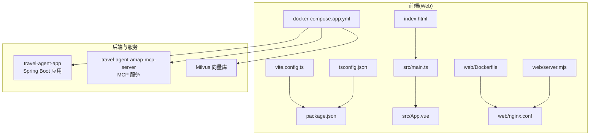
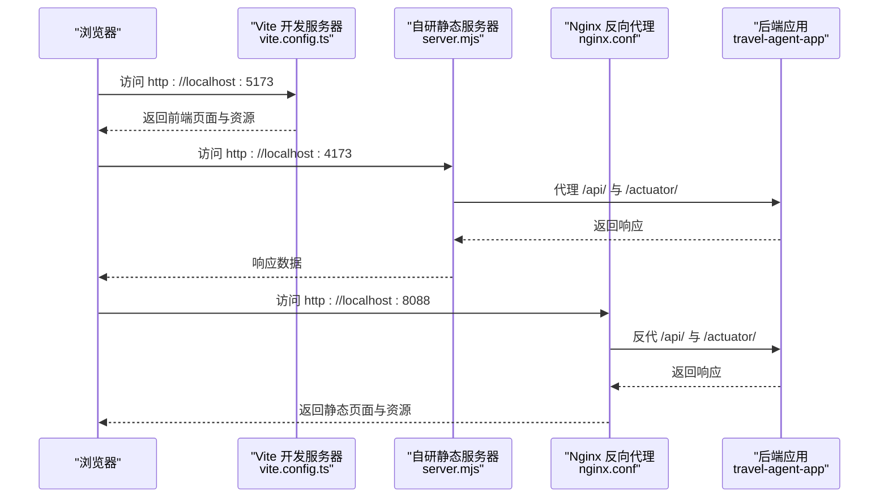
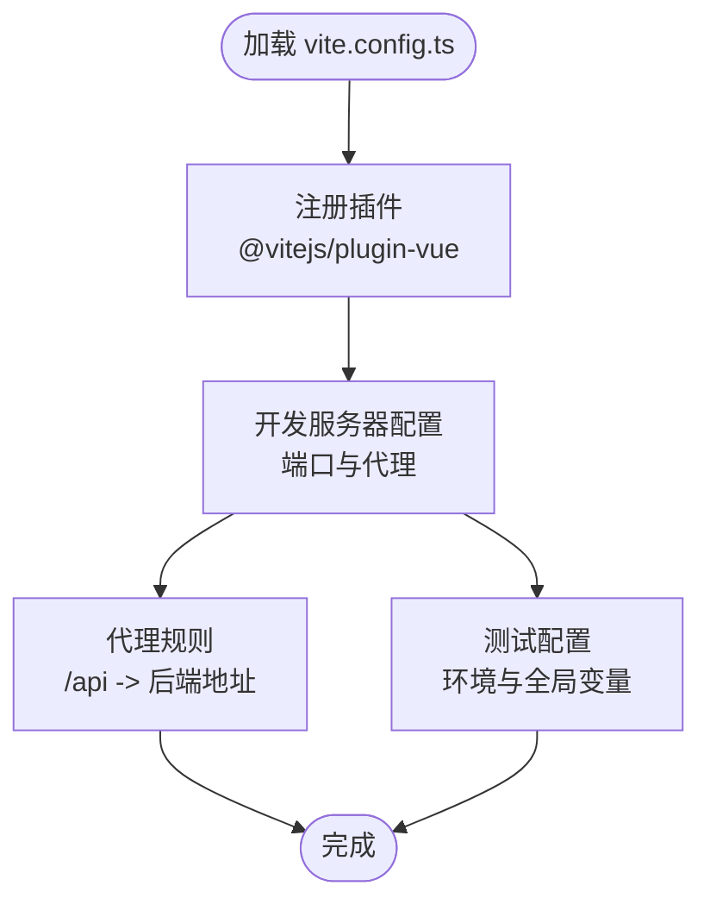
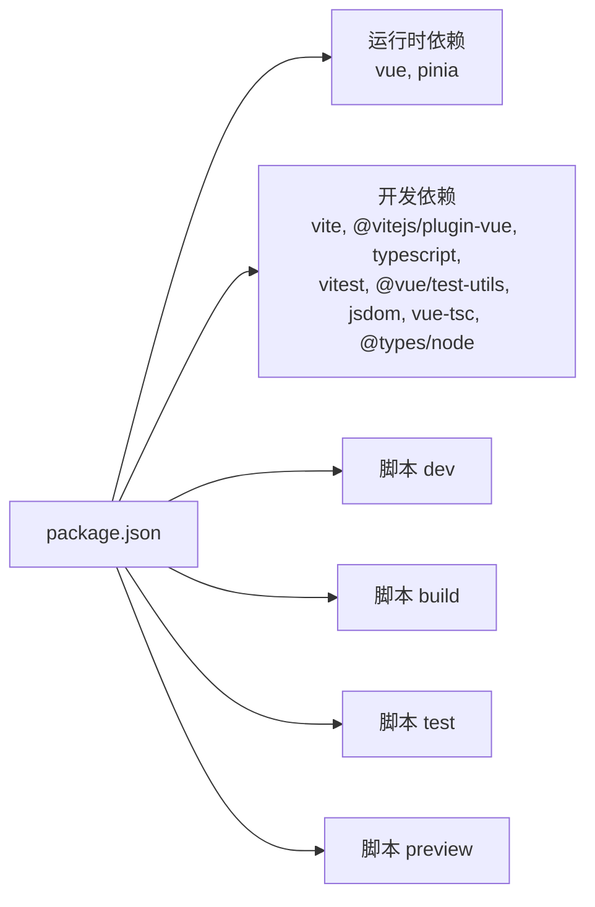
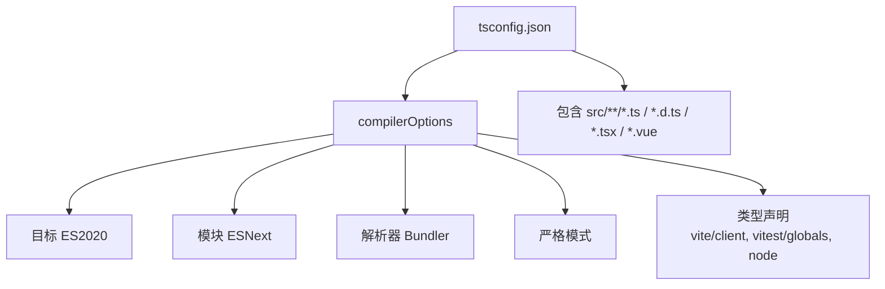
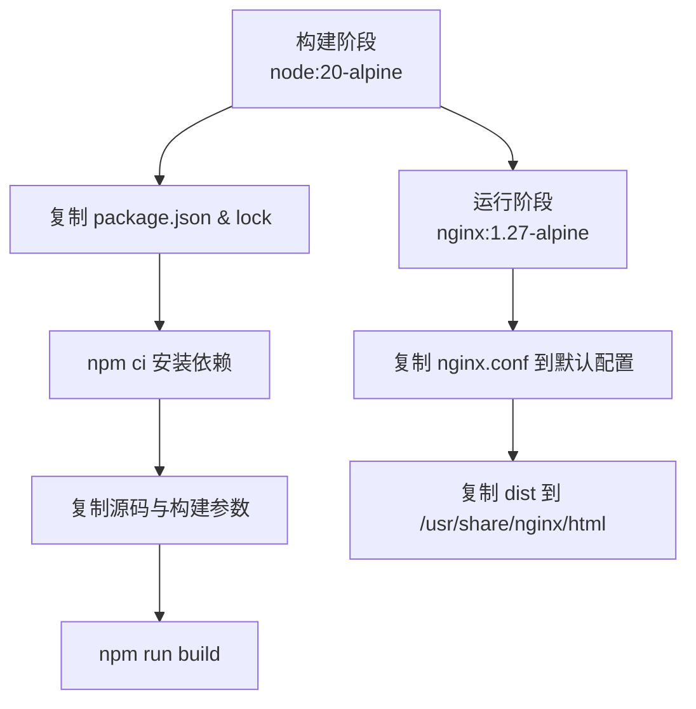
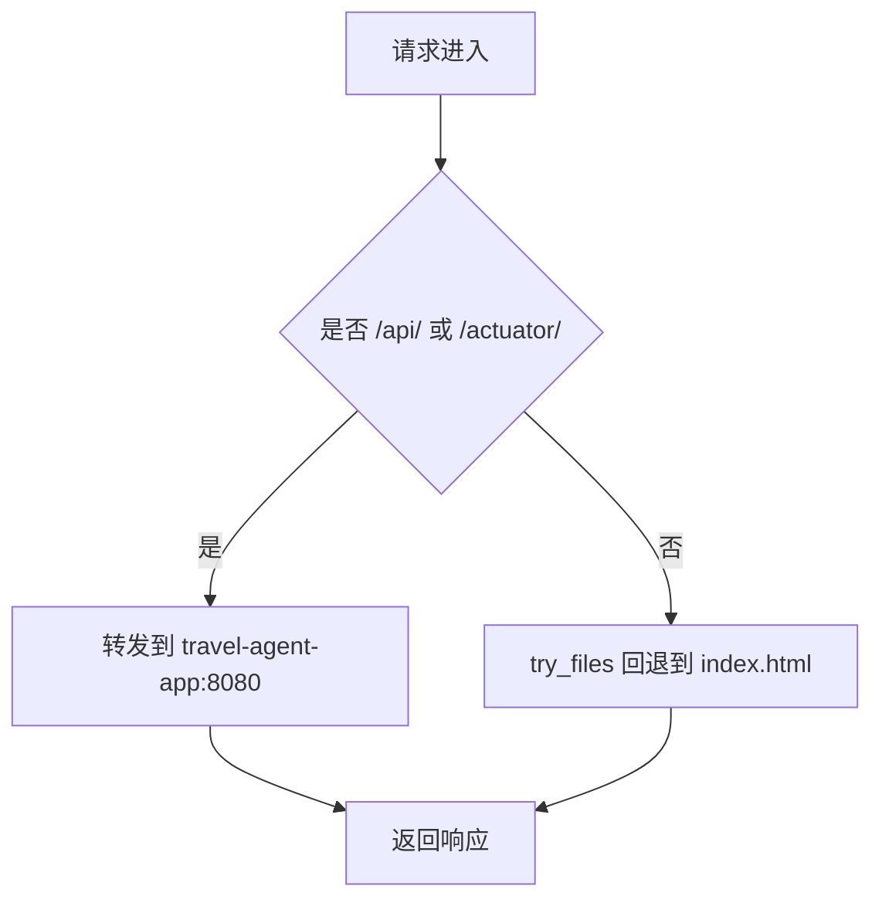
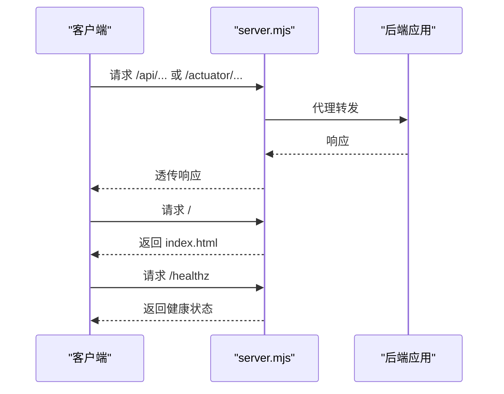
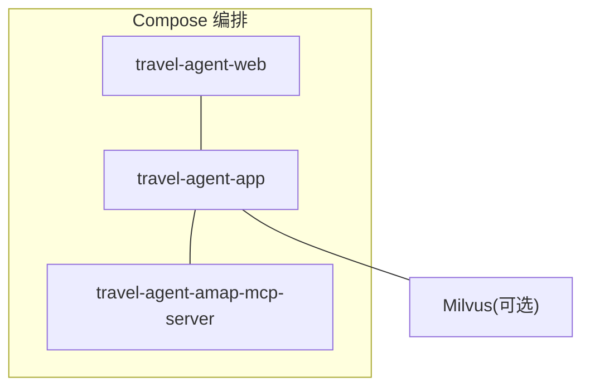
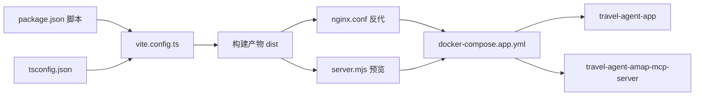

# 构建配置

<cite>
**本文引用的文件**
- [vite.config.ts](file://web/vite.config.ts)
- [package.json](file://web/package.json)
- [tsconfig.json](file://web/tsconfig.json)
- [Dockerfile](file://web/Dockerfile)
- [.dockerignore](file://web/.dockerignore)
- [server.mjs](file://web/server.mjs)
- [nginx.conf](file://web/nginx.conf)
- [docker-compose.app.yml](file://docker-compose.app.yml)
- [docker-compose.milvus.yml](file://docker-compose.milvus.yml)
- [Dockerfile.mcp](file://Dockerfile.mcp)
- [main.ts](file://web/src/main.ts)
- [App.vue](file://web/src/App.vue)
- [index.html](file://web/index.html)
</cite>

## 目录
1. [简介](#简介)
2. [项目结构](#项目结构)
3. [核心组件](#核心组件)
4. [架构总览](#架构总览)
5. [详细组件分析](#详细组件分析)
6. [依赖关系分析](#依赖关系分析)
7. [性能考虑](#性能考虑)
8. [故障排查指南](#故障排查指南)
9. [结论](#结论)
10. [附录](#附录)

## 简介
本指南围绕前端构建与运行体系，系统性梳理 Vite 构建配置、TypeScript 编译设置、依赖与脚本管理、Docker 容器化与多阶段构建、Nginx 反向代理与健康检查、以及开发与调试最佳实践。目标是帮助开发者快速理解并高效维护该前端工程的构建与发布流程。

## 项目结构
前端工程位于 web 目录，采用 Vite + Vue 3 + TypeScript 技术栈；后端由 Spring Boot 应用与可选的 Milvus 向量数据库组成；通过 docker-compose 将前端、后端与 MCP 服务编排为可一键启动的整体环境。

图表来源
- [vite.config.ts:1-19](file://web/vite.config.ts#L1-L19)
- [package.json:1-26](file://web/package.json#L1-L26)
- [tsconfig.json:1-17](file://web/tsconfig.json#L1-L17)
- [index.html:1-13](file://web/index.html#L1-L13)
- [main.ts:1-7](file://web/src/main.ts#L1-L7)
- [App.vue:1-381](file://web/src/App.vue#L1-L381)
- [Dockerfile:1-22](file://web/Dockerfile#L1-L22)
- [nginx.conf:1-30](file://web/nginx.conf#L1-L30)
- [server.mjs:1-121](file://web/server.mjs#L1-L121)
- [docker-compose.app.yml:1-62](file://docker-compose.app.yml#L1-L62)

章节来源
- [vite.config.ts:1-19](file://web/vite.config.ts#L1-L19)
- [package.json:1-26](file://web/package.json#L1-L26)
- [tsconfig.json:1-17](file://web/tsconfig.json#L1-L17)
- [index.html:1-13](file://web/index.html#L1-L13)
- [main.ts:1-7](file://web/src/main.ts#L1-L7)
- [App.vue:1-381](file://web/src/App.vue#L1-L381)
- [Dockerfile:1-22](file://web/Dockerfile#L1-L22)
- [nginx.conf:1-30](file://web/nginx.conf#L1-L30)
- [server.mjs:1-121](file://web/server.mjs#L1-L121)
- [docker-compose.app.yml:1-62](file://docker-compose.app.yml#L1-L62)

## 核心组件
- Vite 构建与开发服务器：定义插件、开发服务器端口与代理、测试环境。
- TypeScript 编译配置：模块系统、严格模式、类型声明与包含范围。
- 包管理与脚本：开发、构建、预览与测试命令。
- Docker 多阶段构建：Node 构建阶段与 Nginx 镜像分层部署。
- Nginx 反向代理：静态资源与 API/Actuator 转发。
- 自研静态服务器：用于本地预览与代理后端接口。
- Compose 编排：前端、后端与 MCP 服务联动。

章节来源
- [vite.config.ts:1-19](file://web/vite.config.ts#L1-L19)
- [package.json:1-26](file://web/package.json#L1-L26)
- [tsconfig.json:1-17](file://web/tsconfig.json#L1-L17)
- [Dockerfile:1-22](file://web/Dockerfile#L1-L22)
- [nginx.conf:1-30](file://web/nginx.conf#L1-L30)
- [server.mjs:1-121](file://web/server.mjs#L1-L121)
- [docker-compose.app.yml:1-62](file://docker-compose.app.yml#L1-L62)

## 架构总览
下图展示从浏览器到后端服务的请求链路，包括 Vite 开发代理、自研静态服务器与 Nginx 反代三种运行形态。

图表来源
- [vite.config.ts:6-14](file://web/vite.config.ts#L6-L14)
- [server.mjs:39-61](file://web/server.mjs#L39-L61)
- [nginx.conf:8-24](file://web/nginx.conf#L8-L24)
- [docker-compose.app.yml:50-62](file://docker-compose.app.yml#L50-L62)

## 详细组件分析

### Vite 构建配置（vite.config.ts）
- 插件集成：启用 Vue 插件以支持单文件组件与模板编译。
- 开发服务器：监听端口、配置 API 代理到后端地址，便于前后端联调。
- 测试环境：指定测试运行环境与全局变量，适配 Vitest。

图表来源
- [vite.config.ts:1-19](file://web/vite.config.ts#L1-L19)

章节来源
- [vite.config.ts:1-19](file://web/vite.config.ts#L1-L19)

### 依赖与脚本（package.json）
- 类型与模块：ES 模块、类型声明与包版本。
- 运行脚本：dev、build、test、preview。
- 依赖分层：运行时依赖（Vue、Pinia）与开发依赖（Vite、Vue 插件、TypeScript、Vitest、vue-tsc）。

图表来源
- [package.json:1-26](file://web/package.json#L1-L26)

章节来源
- [package.json:1-26](file://web/package.json#L1-L26)

### TypeScript 编译配置（tsconfig.json）
- 目标与模块：ES 目标、ESNext 模块与 Bundler 解析。
- 严格性与兼容：严格模式、ES 启用、DOM 类型、Node 类型。
- 类型声明：Vite 与 Vitest 全局类型。
- 包含范围：src 下所有 TS/TSX/Vue 文件。

图表来源
- [tsconfig.json:1-17](file://web/tsconfig.json#L1-L17)

章节来源
- [tsconfig.json:1-17](file://web/tsconfig.json#L1-L17)

### Docker 容器化（web/Dockerfile）
- 多阶段构建：Node 构建阶段安装依赖、复制源码、注入构建参数并执行构建；Nginx 阶段拷贝 Nginx 配置与构建产物。
- 构建参数：通过 ARG 注入前端密钥与安全码，通过 ENV 写入环境变量。
- 镜像暴露：容器对外暴露 80 端口。

图表来源
- [Dockerfile:1-22](file://web/Dockerfile#L1-L22)

章节来源
- [Dockerfile:1-22](file://web/Dockerfile#L1-L22)

### Nginx 反向代理（web/nginx.conf）
- 监听 80 端口，根目录指向构建产物。
- API 与 Actuator 代理至后端应用，保留必要头部信息。
- 首页回退：未命中资源时回退到 index.html，支持 SPA 路由。

图表来源
- [nginx.conf:1-30](file://web/nginx.conf#L1-L30)

章节来源
- [nginx.conf:1-30](file://web/nginx.conf#L1-L30)

### 自研静态服务器（web/server.mjs）
- 支持命令行参数：root、port、backend。
- 静态资源服务：根据扩展名设置 Content-Type，处理目录与回退到 index.html。
- API/Actuator 代理：将请求转发至后端，错误时返回 JSON。
- 健康检查：/healthz 探活接口，返回状态与后端信息。

图表来源
- [server.mjs:39-61](file://web/server.mjs#L39-L61)
- [server.mjs:63-84](file://web/server.mjs#L63-L84)
- [server.mjs:91-114](file://web/server.mjs#L91-L114)

章节来源
- [server.mjs:1-121](file://web/server.mjs#L1-L121)

### Compose 编排（docker-compose.app.yml）
- 服务编排：后端应用、MCP 服务、前端 Web。
- 环境变量：OpenAI、AMap、MCP、CORS、内存与 Milvus 参数。
- 端口映射：前端映射到 8088，后端 8080。
- 依赖关系：前端依赖后端，MCP 服务按需启用。

图表来源
- [docker-compose.app.yml:1-62](file://docker-compose.app.yml#L1-L62)

章节来源
- [docker-compose.app.yml:1-62](file://docker-compose.app.yml#L1-L62)

### Milvus 编排（docker-compose.milvus.yml）
- Etcd、MinIO、Milvus Standalone 三组件健康检查与持久化。
- 端口暴露：19530、9091，网络隔离为独立网络。

章节来源
- [docker-compose.milvus.yml:1-64](file://docker-compose.milvus.yml#L1-L64)

### MCP 服务镜像（Dockerfile.mcp）
- 多阶段：Maven 构建与 JRE 运行。
- 打包：仅打包 MCP 子模块，输出可执行 Jar。
- 入口：Java 启动 Jar，暴露 8090。

章节来源
- [Dockerfile.mcp:1-28](file://Dockerfile.mcp#L1-L28)

### 应用入口与页面（index.html、main.ts、App.vue）
- 页面入口：index.html 引入应用挂载点与入口脚本。
- 应用入口：main.ts 创建 Vue 应用、Pinia 并挂载。
- 主组件：App.vue 组织侧边栏、聊天、时间线与计划面板，提供中英切换与状态展示。

章节来源
- [index.html:1-13](file://web/index.html#L1-L13)
- [main.ts:1-7](file://web/src/main.ts#L1-L7)
- [App.vue:1-381](file://web/src/App.vue#L1-L381)

## 依赖关系分析
- 构建链路：package.json 的脚本驱动 Vite 构建；tsconfig.json 控制类型检查；vite.config.ts 提供开发与代理能力。
- 运行链路：Dockerfile 将构建产物交给 Nginx；server.mjs 提供替代运行方式；nginx.conf 实现反向代理。
- 编排链路：docker-compose.app.yml 将前端、后端与 MCP 串联；可选 Milvus 通过独立 compose 启动。

图表来源
- [package.json:6-11](file://web/package.json#L6-L11)
- [vite.config.ts:4-19](file://web/vite.config.ts#L4-L19)
- [tsconfig.json:1-17](file://web/tsconfig.json#L1-L17)
- [nginx.conf:1-30](file://web/nginx.conf#L1-L30)
- [server.mjs:91-114](file://web/server.mjs#L91-L114)
- [docker-compose.app.yml:50-62](file://docker-compose.app.yml#L50-L62)

章节来源
- [package.json:1-26](file://web/package.json#L1-L26)
- [vite.config.ts:1-19](file://web/vite.config.ts#L1-L19)
- [tsconfig.json:1-17](file://web/tsconfig.json#L1-L17)
- [nginx.conf:1-30](file://web/nginx.conf#L1-L30)
- [server.mjs:1-121](file://web/server.mjs#L1-L121)
- [docker-compose.app.yml:1-62](file://docker-compose.app.yml#L1-L62)

## 性能考虑
- 代码分割与懒加载
  - 使用动态导入进行路由或组件级懒加载，减少首屏体积。
  - 对大型第三方库采用外部化策略，避免重复打包。
- 资源压缩与缓存
  - 生产构建开启压缩与最小化；利用 Nginx 设置静态资源缓存头。
  - 合理拆分 vendor 与业务代码，提升缓存命中率。
- 构建优化
  - 在 Vite 中启用合适的预构建与依赖外部化；在 tsconfig 中关闭不必要的检查以加速构建。
- 代理与网络
  - 开发代理仅代理必要路径，避免无关流量；生产环境通过 Nginx 统一转发，减少中间层开销。
- 调试与可观测性
  - 保持清晰的日志与健康检查端点；对代理失败进行统一错误处理与返回。

## 故障排查指南
- 开发代理不可用
  - 检查 vite.config.ts 的 server.port 与 proxy.target 是否与后端一致。
  - 确认后端已启动且可访问。
- 预览服务器问题
  - server.mjs 的 root、port、backend 参数是否正确；确认 dist 目录存在。
- Nginx 反代异常
  - 检查 nginx.conf 的 proxy_pass 地址与容器网络；确认后端服务可达。
- Docker 构建失败
  - 确认 package.json 与 lock 文件同步；检查 ARG 注入的环境变量是否为空。
- 健康检查失败
  - /healthz 返回状态与后端连通性；查看容器日志定位具体错误。

章节来源
- [vite.config.ts:6-14](file://web/vite.config.ts#L6-L14)
- [server.mjs:86-89](file://web/server.mjs#L86-L89)
- [nginx.conf:8-24](file://web/nginx.conf#L8-L24)
- [Dockerfile:9-12](file://web/Dockerfile#L9-L12)
- [docker-compose.app.yml:50-62](file://docker-compose.app.yml#L50-L62)

## 结论
本指南从配置文件入手，串联了前端构建、类型检查、容器化与反向代理的全链路实践。通过明确的职责划分与编排策略，既保证开发效率，也确保生产部署的稳定性与可维护性。建议在团队内固化脚本与参数命名规范，持续优化构建与缓存策略，以获得更佳的用户体验与运维效率。

## 附录
- 开发环境搭建步骤
  - 安装 Node.js 与包管理器；安装依赖；启动后端与 MCP（可选）；运行 dev 脚本；访问开发服务器。
- 热重载与调试
  - Vite 默认启用热重载；可在浏览器控制台与网络面板观察模块更新与请求行为。
- 发布流程
  - 执行 build 脚本生成 dist；使用 Dockerfile 构建镜像；通过 docker-compose 启动；验证 /healthz 与 API 代理。