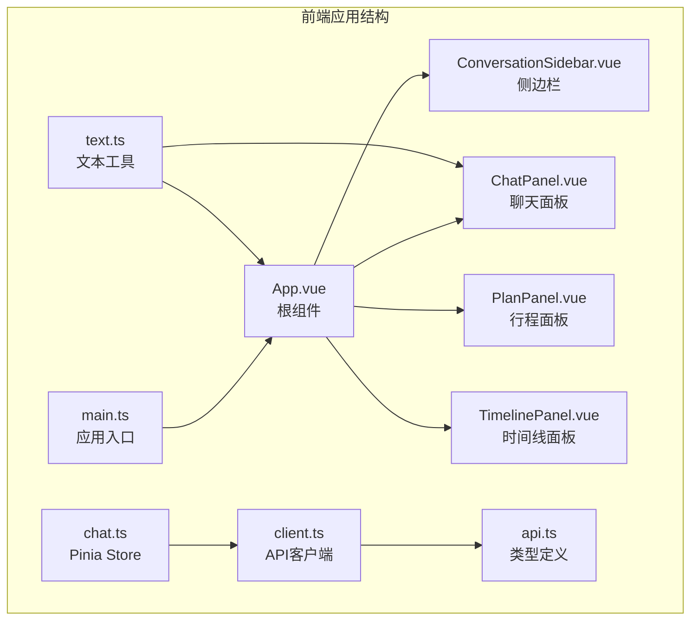
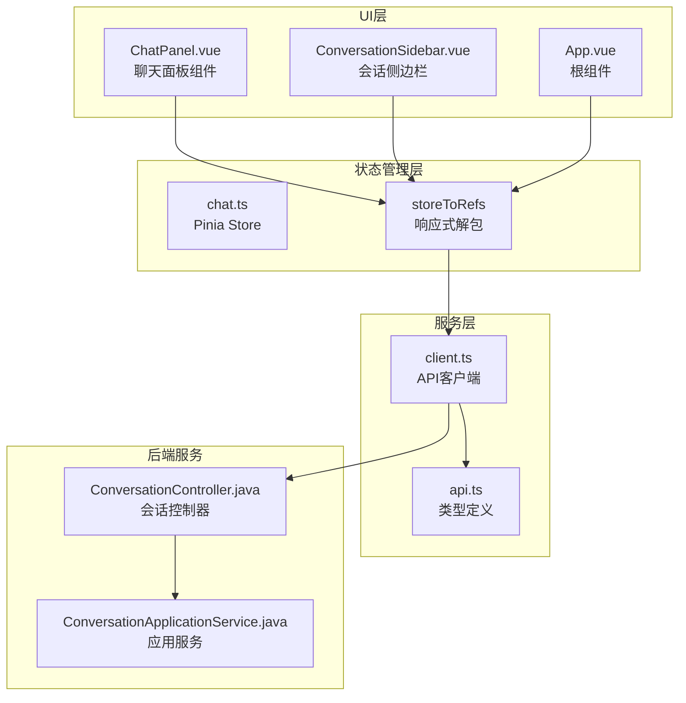
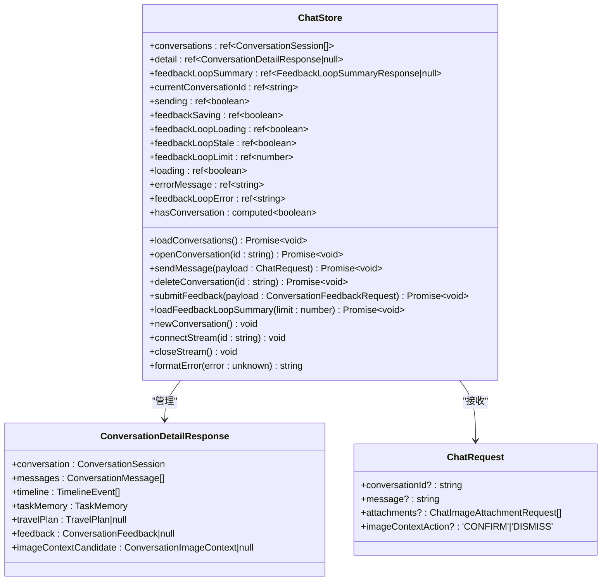
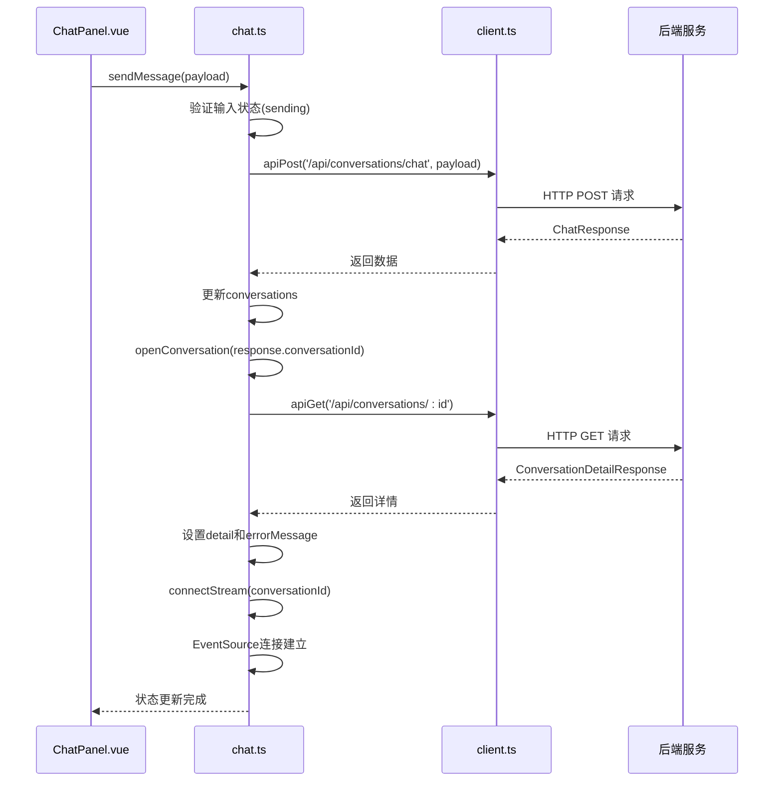
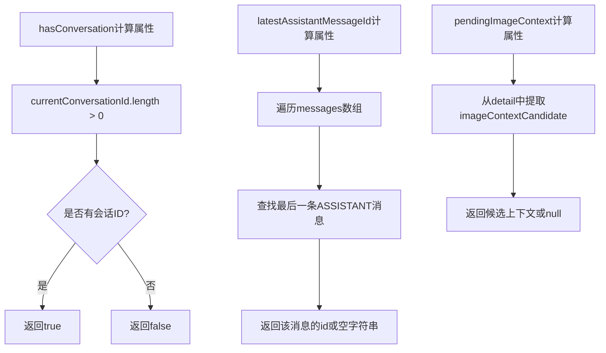
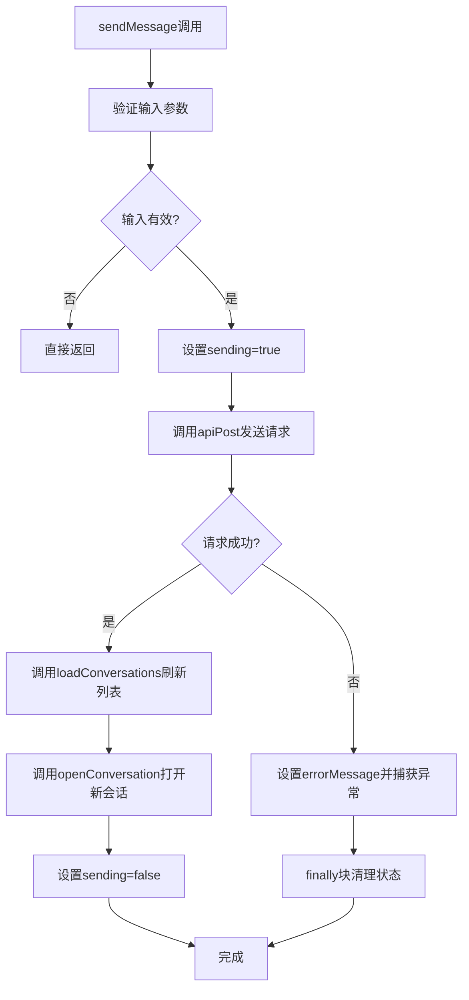
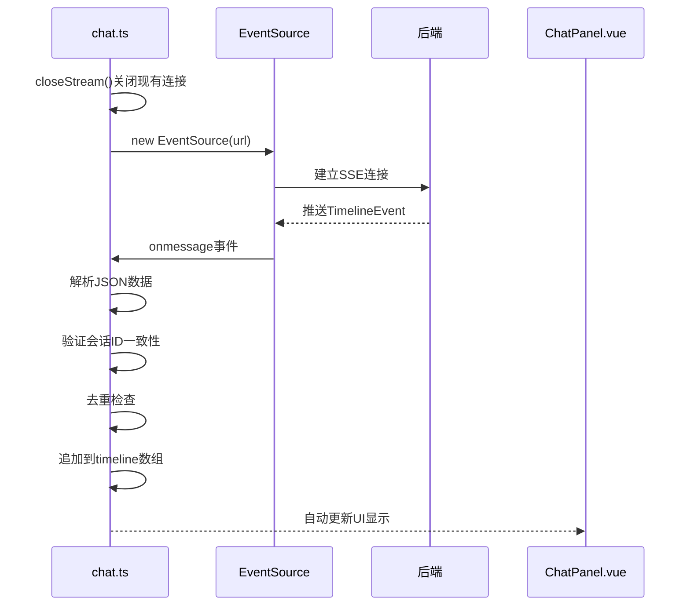
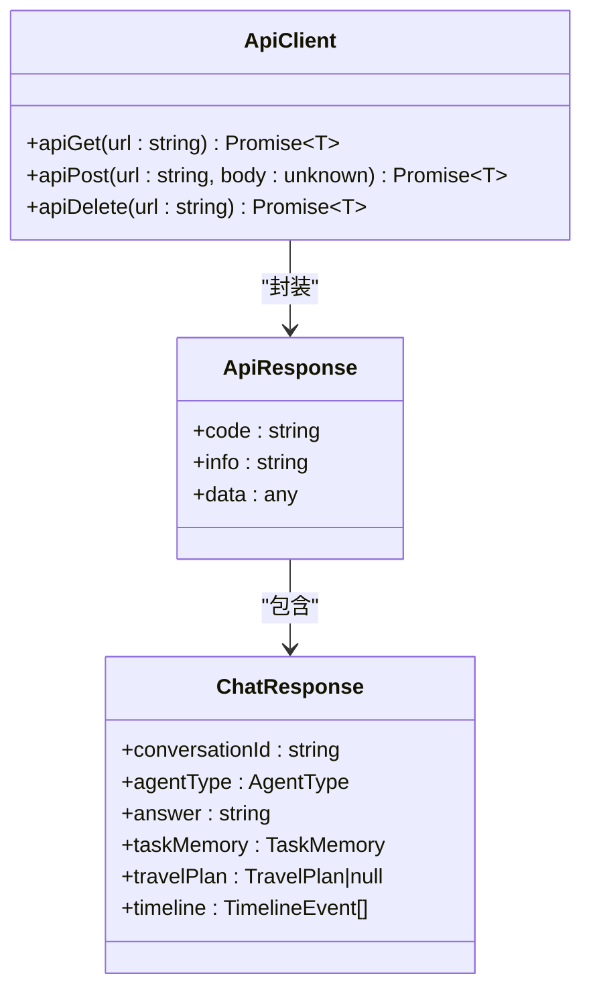

# 状态管理

<cite>
**本文引用的文件列表**
- [chat.ts](file://web/src/stores/chat.ts)
- [main.ts](file://web/src/main.ts)
- [App.vue](file://web/src/App.vue)
- [ChatPanel.vue](file://web/src/components/ChatPanel.vue)
- [ConversationSidebar.vue](file://web/src/components/ConversationSidebar.vue)
- [client.ts](file://web/src/api/client.ts)
- [api.ts](file://web/src/types/api.ts)
- [text.ts](file://web/src/utils/text.ts)
- [package.json](file://web/package.json)
</cite>

## 目录
1. [简介](#简介)
2. [项目结构](#项目结构)
3. [核心组件](#核心组件)
4. [架构总览](#架构总览)
5. [详细组件分析](#详细组件分析)
6. [依赖关系分析](#依赖关系分析)
7. [性能考量](#性能考量)
8. [故障排除指南](#故障排除指南)
9. [结论](#结论)

## 简介
本指南深入解析TravelAgent前端应用中基于Pinia的状态管理系统，重点围绕chat store的设计架构展开。该系统采用组合式API风格的store定义，通过响应式状态、计算属性和异步action实现完整的对话式旅行规划工作流。系统支持实时消息流、图片附件处理、反馈循环统计等功能，并通过EventSource实现服务器推送的增量更新。

## 项目结构
前端Web应用采用Vue 3 + Pinia的现代化架构，核心状态管理集中在web/src/stores目录下，业务组件分布在web/src/components目录中，类型定义位于web/src/types目录。



**图表来源**
- [main.ts:1-7](file://web/src/main.ts#L1-L7)
- [App.vue:1-381](file://web/src/App.vue#L1-L381)
- [chat.ts:1-196](file://web/src/stores/chat.ts#L1-L196)

**章节来源**
- [main.ts:1-7](file://web/src/main.ts#L1-L7)
- [package.json:1-26](file://web/package.json#L1-L26)

## 核心组件
chat store是整个状态管理的核心，采用组合式API风格定义，包含以下关键要素：

### 状态定义
- **conversations**: ConversationSession[] - 会话列表数组
- **detail**: ConversationDetailResponse | null - 当前会话详情
- **feedbackLoopSummary**: FeedbackLoopSummaryResponse | null - 反馈循环统计摘要
- **currentConversationId**: string - 当前选中的会话ID
- **sending**: boolean - 发送消息时的加载状态
- **feedbackSaving**: boolean - 提交反馈时的保存状态
- **feedbackLoopLoading**: boolean - 加载反馈循环数据时的加载状态
- **feedbackLoopStale**: boolean - 反馈循环数据是否需要刷新
- **feedbackLoopLimit**: number - 反馈循环查询限制
- **loading**: boolean - 通用加载状态
- **errorMessage**: string - 错误信息
- **feedbackLoopError**: string - 反馈循环错误信息

### 计算属性
- **hasConversation**: computed<boolean> - 判断是否存在当前会话

### 异步Action
- **loadConversations**: 加载会话列表
- **openConversation**: 打开指定会话并建立流连接
- **sendMessage**: 发送消息（支持文本和图片附件）
- **deleteConversation**: 删除会话
- **submitFeedback**: 提交反馈
- **loadFeedbackLoopSummary**: 加载反馈循环统计
- **newConversation**: 创建新会话
- **connectStream**: 建立EventSource连接
- **closeStream**: 关闭EventSource连接

**章节来源**
- [chat.ts:15-196](file://web/src/stores/chat.ts#L15-L196)

## 架构总览
系统采用分层架构设计，从UI组件到状态管理再到API服务形成清晰的职责分离。



**图表来源**
- [App.vue:16-25](file://web/src/App.vue#L16-L25)
- [chat.ts:15-196](file://web/src/stores/chat.ts#L15-L196)
- [client.ts:1-37](file://web/src/api/client.ts#L1-L37)

## 详细组件分析

### Chat Store架构分析
chat store采用函数式定义方式，返回所有状态和方法，体现了现代Vue 3 + Pinia的最佳实践。



**图表来源**
- [chat.ts:15-196](file://web/src/stores/chat.ts#L15-L196)
- [api.ts:340-349](file://web/src/types/api.ts#L340-L349)
- [api.ts:277-282](file://web/src/types/api.ts#L277-L282)

### 组件与Store交互模式
系统采用storeToRefs进行响应式状态绑定，确保UI组件能够自动响应状态变化。



**图表来源**
- [ChatPanel.vue:315-329](file://web/src/components/ChatPanel.vue#L315-L329)
- [chat.ts:58-80](file://web/src/stores/chat.ts#L58-L80)
- [client.ts:18-28](file://web/src/api/client.ts#L18-L28)

### 状态数据结构设计
系统采用规范化状态设计，每个核心状态字段都有明确的职责分工：

#### conversations状态
- **作用**: 存储用户的所有会话历史记录
- **数据结构**: ConversationSession[] 数组
- **更新机制**: 
  - loadConversations(): 从API获取最新列表
  - deleteConversation(): 删除后重新加载
  - sendMessage(): 成功发送后刷新列表

#### currentConversationId状态
- **作用**: 标识当前活跃的会话
- **更新机制**: 
  - openConversation(): 切换到指定会话
  - newConversation(): 清空当前会话
  - deleteConversation(): 删除后清空

#### detail状态
- **作用**: 存储当前会话的完整信息
- **包含内容**: 
  - conversation: 会话基本信息
  - messages: 消息列表
  - timeline: 执行时间线
  - taskMemory: 任务记忆
  - travelPlan: 生成的旅行计划
  - feedback: 用户反馈
  - imageContextCandidate: 图片上下文候选

#### sending状态
- **作用**: 控制发送按钮的禁用状态
- **更新机制**: 
  - sendMessage(): 开始发送设置为true，完成后设置为false
  - 防止重复提交

**章节来源**
- [chat.ts:16-28](file://web/src/stores/chat.ts#L16-L28)
- [chat.ts:32-80](file://web/src/stores/chat.ts#L32-L80)

### Getter计算属性实现
系统使用computed创建多个派生状态，提高代码复用性和性能。



**图表来源**
- [chat.ts:30](file://web/src/stores/chat.ts#L30)
- [chat.ts:40-42](file://web/src/stores/chat.ts#L40-L42)
- [chat.ts:39](file://web/src/stores/chat.ts#L39)

**章节来源**
- [chat.ts:30-42](file://web/src/stores/chat.ts#L30-L42)

### Action方法详解
#### sendMessage方法
实现了完整的消息发送流程，支持文本和图片附件：



**图表来源**
- [chat.ts:58-80](file://web/src/stores/chat.ts#L58-L80)

#### connectStream方法
使用EventSource实现实时消息流：



**图表来源**
- [chat.ts:146-164](file://web/src/stores/chat.ts#L146-L164)

**章节来源**
- [chat.ts:58-80](file://web/src/stores/chat.ts#L58-L80)
- [chat.ts:146-164](file://web/src/stores/chat.ts#L146-L164)

## 依赖关系分析
系统依赖关系清晰，遵循单一职责原则和依赖倒置原则。

```mermaid
graph TB
subgraph "运行时依赖"
A[Vue 3.5.13]
B[Pinia 3.0.3]
end
subgraph "开发时依赖"
C[@vitejs/plugin-vue]
D[typescript]
E[vitest]
F[jsdom]
end
subgraph "应用模块"
G[chat.ts]
H[client.ts]
I[api.ts]
J[text.ts]
end
A --> G
B --> G
C --> G
D --> G
E --> G
F --> G
G --> H
H --> I
G --> J
```

**图表来源**
- [package.json:12-25](file://web/package.json#L12-L25)

### 外部依赖集成
系统通过API客户端封装HTTP请求，统一错误处理和响应格式。



**图表来源**
- [client.ts:1-37](file://web/src/api/client.ts#L1-L37)
- [api.ts:18-22](file://web/src/types/api.ts#L18-L22)
- [api.ts:331-338](file://web/src/types/api.ts#L331-L338)

**章节来源**
- [client.ts:1-37](file://web/src/api/client.ts#L1-L37)
- [api.ts:18-22](file://web/src/types/api.ts#L18-L22)

## 性能考量
系统在多个层面实现了性能优化：

### 响应式状态优化
- 使用ref包装简单状态，computed创建派生状态
- storeToRefs避免不必要的响应式转换
- 条件渲染减少DOM更新

### 网络请求优化
- 防抖和去重机制防止重复请求
- 加载状态控制UI交互
- 错误状态隔离影响范围

### 内存管理
- EventSource连接及时清理
- 会话切换时自动断开旧连接
- 状态重置机制释放资源

## 故障排除指南
### 常见问题及解决方案

#### 状态不同步问题
**症状**: UI显示与实际状态不一致
**原因**: 缺少storeToRefs响应式绑定
**解决**: 确保使用storeToRefs解包store状态

#### 实时消息丢失
**症状**: SSE连接断开导致消息缺失
**原因**: EventSource连接异常
**解决**: 
- 检查connectStream方法中的会话ID验证
- 实现自动重连机制
- 添加连接状态监控

#### 图片上传失败
**症状**: 附件无法上传或显示
**原因**: 文件大小或类型校验失败
**解决**: 
- 检查MAX_ATTACHMENT_BYTES限制
- 验证ALLOWED_IMAGE_TYPES集合
- 实施更友好的错误提示

**章节来源**
- [chat.ts:146-164](file://web/src/stores/chat.ts#L146-L164)
- [ChatPanel.vue:352-381](file://web/src/components/ChatPanel.vue#L352-L381)

## 结论
TravelAgent的Pinia状态管理系统展现了现代前端应用的最佳实践：清晰的职责分离、完善的错误处理、优雅的用户体验和良好的可维护性。通过组合式API风格的store定义、响应式状态绑定和异步action模式，系统实现了复杂业务逻辑的简洁表达。建议在后续开发中继续强化：
- 状态持久化策略（localStorage或IndexedDB）
- 更完善的类型安全检查
- 性能监控和分析工具集成
- 离线支持和缓存策略