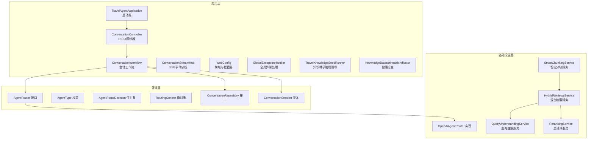
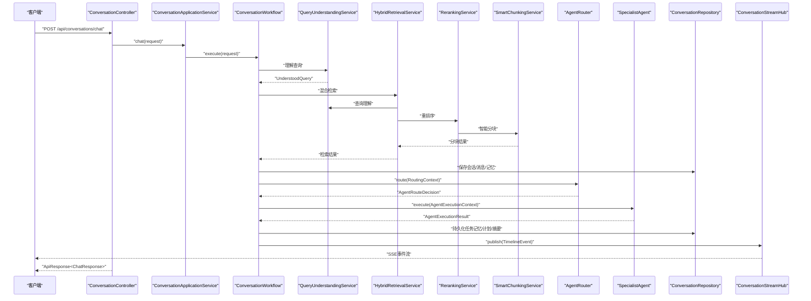
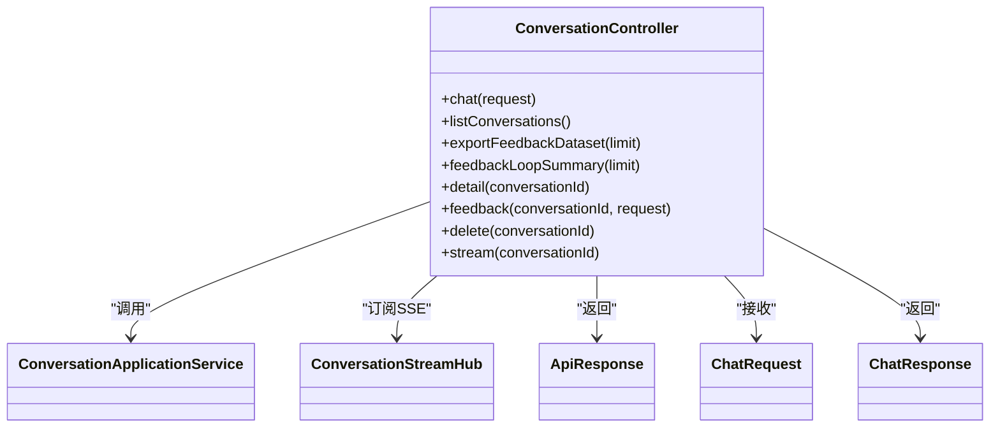
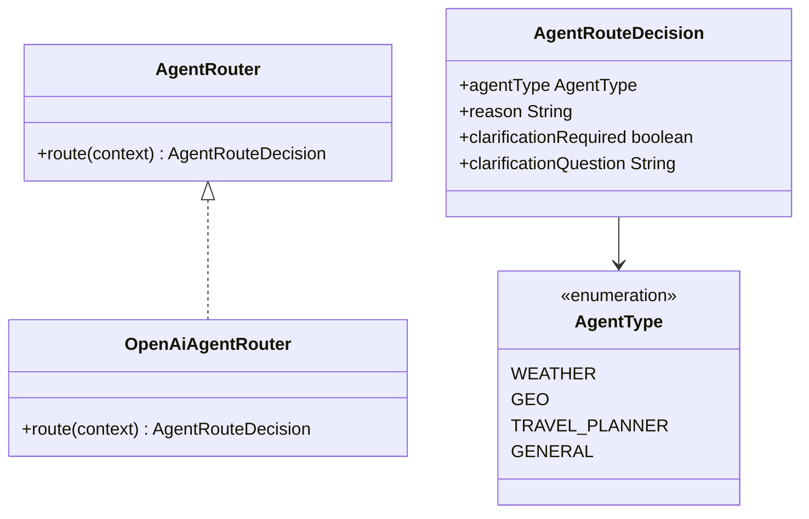
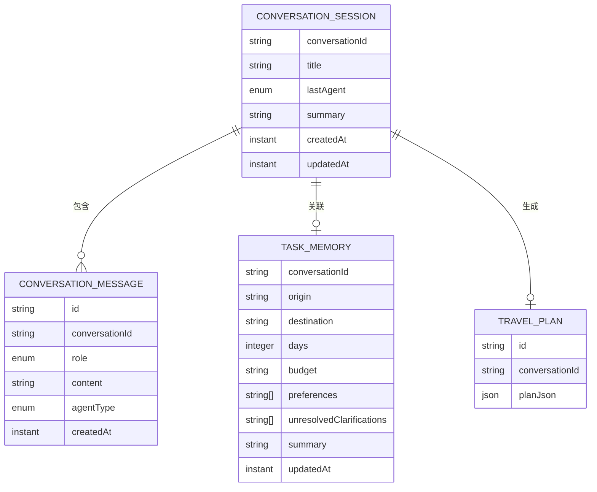
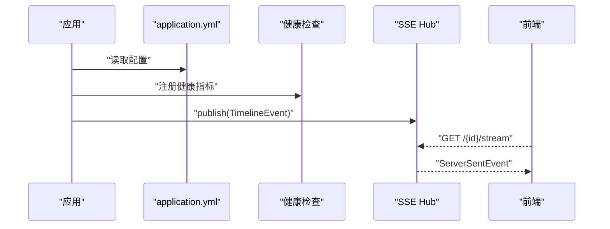
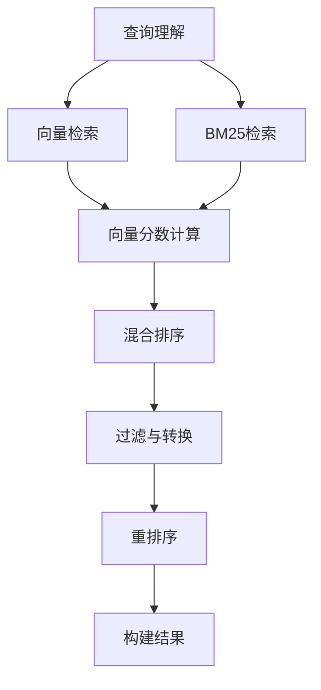
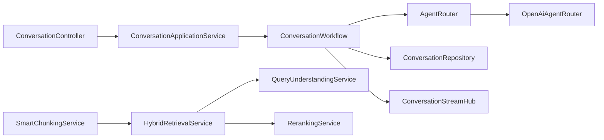

# 后端开发指南

<cite>
**本文引用的文件**
- [TravelAgentApplication.java](file://travel-agent-app/src/main/java/com/travalagent/app/TravelAgentApplication.java)
- [application.yml](file://travel-agent-app/src/main/resources/application.yml)
- [ConversationController.java](file://travel-agent-app/src/main/java/com/travalagent/app/controller/ConversationController.java)
- [ConversationWorkflow.java](file://travel-agent-app/src/main/java/com/travalagent/app/service/ConversationWorkflow.java)
- [ConversationStreamHub.java](file://travel-agent-app/src/main/java/com/travalagent/app/stream/ConversationStreamHub.java)
- [TravelKnowledgeSeedRunner.java](file://travel-agent-app/src/main/java/com/travalagent/app/bootstrap/TravelKnowledgeSeedRunner.java)
- [GlobalExceptionHandler.java](file://travel-agent-app/src/main/java/com/travalagent/app/controller/GlobalExceptionHandler.java)
- [WebConfig.java](file://travel-agent-app/src/main/java/com/travalagent/app/controller/WebConfig.java)
- [KnowledgeDatasetHealthIndicator.java](file://travel-agent-app/src/main/java/com/travalagent/app/health/KnowledgeDatasetHealthIndicator.java)
- [ChatRequest.java](file://travel-agent-app/src/main/java/com/travalagent/app/dto/ChatRequest.java)
- [ChatResponse.java](file://travel-agent-app/src/main/java/com/travalagent/app/dto/ChatResponse.java)
- [ConversationDetailResponse.java](file://travel-agent-app/src/main/java/com/travalagent/app/dto/ConversationDetailResponse.java)
- [ConversationFeedbackRequest.java](file://travel-agent-app/app/src/main/java/com/travalagent/app/dto/ConversationFeedbackRequest.java)
- [FeedbackLoopSummaryResponse.java](file://travel-agent-app/src/main/java/com/travalagent/app/dto/FeedbackLoopSummaryResponse.java)
- [FeedbackDatasetRecord.java](file://travel-agent-app/src/main/java/com/travalagent/app/dto/FeedbackDatasetRecord.java)
- [ConversationApplicationService.java](file://travel-agent-app/src/main/java/com/travalagent/app/service/ConversationApplicationService.java)
- [AgentRouter.java](file://travel-agent-domain/src/main/java/com/travalagent/domain/service/AgentRouter.java)
- [OpenAiAgentRouter.java](file://travel-agent-infrastructure/src/main/java/com/travalagent/infrastructure/gateway/llm/OpenAiAgentRouter.java)
- [AgentType.java](file://travel-agent-domain/src/main/java/com/travalagent/domain/model/valobj/AgentType.java)
- [AgentRouteDecision.java](file://travel-agent-domain/src/main/java/com/travalagent/domain/model/valobj/AgentRouteDecision.java)
- [RoutingContext.java](file://travel-agent-domain/src/main/java/com/travalagent/domain/model/valobj/RoutingContext.java)
- [ConversationRepository.java](file://travel-agent-domain/src/main/java/com/travalagent/domain/repository/ConversationRepository.java)
- [ConversationSession.java](file://travel-agent-domain/src/main/java/com/travalagent/domain/model/entity/ConversationSession.java)
- [AppException.java](file://travel-agent-types/src/main/java/com/travalagent/types/exception/AppException.java)
- [ApiResponse.java](file://travel-agent-types/src/main/java/com/travalagent/types/response/ApiResponse.java)
- [ResponseCode.java](file://travel-agent-types/src/main/java/com/travalagent/types/enums/ResponseCode.java)
- [schema.sql](file://travel-agent-app/src/main/resources/schema.sql)
- [HybridRetrievalService.java](file://travel-agent-infrastructure/src/main/java/com/travalagent/infrastructure/repository/HybridRetrievalService.java)
- [QueryUnderstandingService.java](file://travel-agent-infrastructure/src/main/java/com/travalagent/infrastructure/repository/QueryUnderstandingService.java)
- [RerankingService.java](file://travel-agent-infrastructure/src/main/java/com/travalagent/infrastructure/repository/RerankingService.java)
- [SmartChunkingService.java](file://travel-agent-infrastructure/src/main/java/com/travalagent/infrastructure/repository/SmartChunkingService.java)
- [TravelKnowledgeVectorStoreRepository.java](file://travel-agent-infrastructure/src/main/java/com/travalagent/infrastructure/repository/TravelKnowledgeVectorStoreRepository.java)
- [QueryUnderstandingServiceTest.java](file://travel-agent-infrastructure/src/test/java/com/travalagent/infrastructure/repository/QueryUnderstandingServiceTest.java)
- [RerankingServiceTest.java](file://travel-agent-infrastructure/src/test/java/com/travalagent/infrastructure/repository/RerankingServiceTest.java)
- [SmartChunkingServiceTest.java](file://travel-agent-infrastructure/src/test/java/com/travalagent/infrastructure/repository/SmartChunkingServiceTest.java)
- [TravelAgentSmokeIntegrationTest.java](file://travel-agent-app/src/test/java/com/travalagent/app/integration/TravelAgentSmokeIntegrationTest.java)
</cite>

## 更新摘要
**所做更改**
- 新增四个核心基础设施服务类的详细文档：HybridRetrievalService、QueryUnderstandingService、RerankingService、SmartChunkingService
- 更新检索与重排序流程的架构图和实现细节
- 增强测试基础设施和集成测试类的说明
- 完善RAG（检索增强生成）系统的技术栈说明

## 目录
1. [简介](#简介)
2. [项目结构](#项目结构)
3. [核心组件](#核心组件)
4. [架构总览](#架构总览)
5. [详细组件分析](#详细组件分析)
6. [依赖分析](#依赖分析)
7. [性能考虑](#性能考虑)
8. [故障排查指南](#故障排查指南)
9. [结论](#结论)
10. [附录](#附录)

## 简介
本指南面向TravelAgent后端开发者，聚焦于Spring Boot 4应用的启动与配置、REST API设计与实现（含ConversationController）、会话工作流（ConversationWorkflow）编排、智能体路由（AgentRouter）决策、领域驱动设计（DDD）在后端的应用（实体、值对象、仓储接口），以及配置管理、健康检查、SSE流式传输等关键能力。

**更新** 新增四个核心基础设施服务类，包括混合检索服务、查询理解服务、重排序服务和智能分块服务，构成完整的RAG（检索增强生成）技术栈。

## 项目结构
后端采用多模块分层组织：应用层（travel-agent-app）、领域层（travel-agent-domain）、基础设施层（travel-agent-infrastructure）、类型与异常定义（travel-agent-types）。应用层负责HTTP入口、流式事件发布、健康检查与引导任务；领域层定义业务实体、值对象与仓储接口；基础设施层实现具体的技术细节（如LLM路由、向量检索、MCP工具网关等）。

**图表来源**
- [TravelAgentApplication.java:1-15](file://travel-agent-app/src/main/java/com/travalagent/app/TravelAgentApplication.java#L1-L15)
- [ConversationController.java:1-101](file://travel-agent-app/src/main/java/com/travalagent/app/controller/ConversationController.java#L1-L101)
- [ConversationWorkflow.java:1-814](file://travel-agent-app/src/main/java/com/travalagent/app/service/ConversationWorkflow.java#L1-L814)
- [ConversationStreamHub.java:1-33](file://travel-agent-app/src/main/java/com/travalagent/app/stream/ConversationStreamHub.java#L1-L33)
- [WebConfig.java](file://travel-agent-app/src/main/java/com/travalagent/app/controller/WebConfig.java)
- [GlobalExceptionHandler.java](file://travel-agent-app/src/main/java/com/travalagent/app/controller/GlobalExceptionHandler.java)
- [TravelKnowledgeSeedRunner.java:1-82](file://travel-agent-app/src/main/java/com/travalagent/app/bootstrap/TravelKnowledgeSeedRunner.java#L1-L82)
- [KnowledgeDatasetHealthIndicator.java:1-31](file://travel-agent-app/src/main/java/com/travalagent/app/health/KnowledgeDatasetHealthIndicator.java#L1-L31)
- [AgentRouter.java:1-10](file://travel-agent-domain/src/main/java/com/travalagent/domain/service/AgentRouter.java#L1-L10)
- [OpenAiAgentRouter.java:1-145](file://travel-agent-infrastructure/src/main/java/com/travalagent/infrastructure/gateway/llm/OpenAiAgentRouter.java#L1-L145)
- [ConversationRepository.java:1-55](file://travel-agent-domain/src/main/java/com/travalagent/domain/repository/ConversationRepository.java#L1-L55)
- [ConversationSession.java:1-16](file://travel-agent-domain/src/main/java/com/travalagent/domain/model/entity/ConversationSession.java#L1-L16)
- [HybridRetrievalService.java:1-333](file://travel-agent-infrastructure/src/main/java/com/travalagent/infrastructure/repository/HybridRetrievalService.java#L1-L333)
- [QueryUnderstandingService.java:1-567](file://travel-agent-infrastructure/src/main/java/com/travalagent/infrastructure/repository/QueryUnderstandingService.java#L1-L567)
- [RerankingService.java:1-584](file://travel-agent-infrastructure/src/main/java/com/travalagent/infrastructure/repository/RerankingService.java#L1-L584)
- [SmartChunkingService.java:1-491](file://travel-agent-infrastructure/src/main/java/com/travalagent/infrastructure/repository/SmartChunkingService.java#L1-L491)

**章节来源**
- [TravelAgentApplication.java:1-15](file://travel-agent-app/src/main/java/com/travalagent/app/TravelAgentApplication.java#L1-L15)
- [application.yml:1-100](file://travel-agent-app/src/main/resources/application.yml#L1-L100)

## 核心组件
- 应用启动与配置
  - 启动类通过SpringBootApplication与@ConfigurationPropertiesScan启用自动装配与配置属性扫描。
  - application.yml集中管理数据库连接、OpenAI/MCP配置、管理端点、遥测采样与旅行相关参数。
- REST API
  - ConversationController提供聊天、会话列表、反馈导出/汇总、会话详情、删除会话、SSE流等接口。
  - 使用ApiResponse统一响应包装，结合Mono/Flux实现异步非阻塞处理。
- 会话工作流
  - ConversationWorkflow负责消息规范化、图像上下文处理、记忆构建、路由决策、专家智能体执行、结果归档与SSE事件发布。
- 智能体路由
  - AgentRouter为路由接口，OpenAiAgentRouter基于LLM与启发式规则进行AgentType选择，并支持澄清问题提示。
- 领域模型
  - AgentType、AgentRouteDecision、RoutingContext等值对象承载路由与执行上下文；ConversationSession等实体封装会话状态。
- 健康检查与引导
  - 健康指示器检查本地旅行知识数据集；引导器在启动时按需加载默认知识并可选验证。
- **新增** RAG核心服务
  - HybridRetrievalService：混合检索服务，结合BM25关键词检索和向量检索，实现精确匹配与语义相似度的融合。
  - QueryUnderstandingService：查询理解服务，提供查询扩展、重写、意图识别、上下文保持和拼写纠错功能。
  - RerankingService：重排序服务，基于Cross-Encoder相关性评分、用户偏好匹配、时效性加权和MMR多样性保证。
  - SmartChunkingService：智能分块服务，将长文档按主题、地理位置、时间维度智能分割，保持语义完整性。

**章节来源**
- [TravelAgentApplication.java:1-15](file://travel-agent-app/src/main/java/com/travalagent/app/TravelAgentApplication.java#L1-L15)
- [application.yml:1-100](file://travel-agent-app/src/main/resources/application.yml#L1-L100)
- [ConversationController.java:1-101](file://travel-agent-app/src/main/java/com/travalagent/app/controller/ConversationController.java#L1-L101)
- [ConversationWorkflow.java:1-814](file://travel-agent-app/src/main/java/com/travalagent/app/service/ConversationWorkflow.java#L1-L814)
- [AgentRouter.java:1-10](file://travel-agent-domain/src/main/java/com/travalagent/domain/service/AgentRouter.java#L1-L10)
- [OpenAiAgentRouter.java:1-145](file://travel-agent-infrastructure/src/main/java/com/travalagent/infrastructure/gateway/llm/OpenAiAgentRouter.java#L1-L145)
- [AgentType.java:1-9](file://travel-agent-domain/src/main/java/com/travalagent/domain/model/valobj/AgentType.java#L1-L9)
- [AgentRouteDecision.java:1-10](file://travel-agent-domain/src/main/java/com/travalagent/domain/model/valobj/AgentRouteDecision.java#L1-L10)
- [RoutingContext.java](file://travel-agent-domain/src/main/java/com/travalagent/domain/model/valobj/RoutingContext.java)
- [ConversationRepository.java:1-55](file://travel-agent-domain/src/main/java/com/travalagent/domain/repository/ConversationRepository.java#L1-L55)
- [ConversationSession.java:1-16](file://travel-agent-domain/src/main/java/com/travalagent/domain/model/entity/ConversationSession.java#L1-L16)
- [KnowledgeDatasetHealthIndicator.java:1-31](file://travel-agent-app/src/main/java/com/travalagent/app/health/KnowledgeDatasetHealthIndicator.java#L1-L31)
- [TravelKnowledgeSeedRunner.java:1-82](file://travel-agent-app/src/main/java/com/travalagent/app/bootstrap/TravelKnowledgeSeedRunner.java#L1-L82)
- [HybridRetrievalService.java:14-333](file://travel-agent-infrastructure/src/main/java/com/travalagent/infrastructure/repository/HybridRetrievalService.java#L14-L333)
- [QueryUnderstandingService.java:8-567](file://travel-agent-infrastructure/src/main/java/com/travalagent/infrastructure/repository/QueryUnderstandingService.java#L8-L567)
- [RerankingService.java:8-584](file://travel-agent-infrastructure/src/main/java/com/travalagent/infrastructure/repository/RerankingService.java#L8-L584)
- [SmartChunkingService.java:10-491](file://travel-agent-infrastructure/src/main/java/com/travalagent/infrastructure/repository/SmartChunkingService.java#L10-L491)

## 架构总览
下图展示从HTTP请求到智能体执行与事件发布的整体流程，体现应用层、领域层与基础设施层的职责边界与交互关系。**更新** 新增RAG核心服务的集成，形成完整的检索增强生成链路。

**图表来源**
- [ConversationController.java:47-51](file://travel-agent-app/src/main/java/com/travalagent/app/controller/ConversationController.java#L47-L51)
- [ConversationWorkflow.java:106-160](file://travel-agent-app/src/main/java/com/travalagent/app/service/ConversationWorkflow.java#L106-L160)
- [AgentRouter.java:6-9](file://travel-agent-domain/src/main/java/com/travalagent/domain/service/AgentRouter.java#L6-L9)
- [OpenAiAgentRouter.java:29-72](file://travel-agent-infrastructure/src/main/java/com/travalagent/infrastructure/gateway/llm/OpenAiAgentRouter.java#L29-L72)
- [ConversationRepository.java:14-55](file://travel-agent-domain/src/main/java/com/travalagent/domain/repository/ConversationRepository.java#L14-L55)
- [ConversationStreamHub.java:16-24](file://travel-agent-app/src/main/java/com/travalagent/app/stream/ConversationStreamHub.java#L16-L24)
- [HybridRetrievalService.java:78-134](file://travel-agent-infrastructure/src/main/java/com/travalagent/infrastructure/repository/HybridRetrievalService.java#L78-L134)
- [QueryUnderstandingService.java:92-123](file://travel-agent-infrastructure/src/main/java/com/travalagent/infrastructure/repository/QueryUnderstandingService.java#L92-L123)
- [RerankingService.java:38-77](file://travel-agent-infrastructure/src/main/java/com/travalagent/infrastructure/repository/RerankingService.java#L38-L77)
- [SmartChunkingService.java:34-64](file://travel-agent-infrastructure/src/main/java/com/travalagent/infrastructure/repository/SmartChunkingService.java#L34-L64)

## 详细组件分析

### Spring Boot 启动与配置管理
- 启动类
  - 使用@SpringBootApplication与@ConfigurationPropertiesScan，确保包扫描与配置属性绑定生效。
- 配置文件
  - 数据源使用SQLite，初始化脚本位于schema.sql。
  - OpenAI/MCP集成参数通过环境变量注入，支持不同运行环境切换。
  - 管理端点暴露health/info，开启遥测与OTLP追踪。
  - 旅行相关参数（记忆窗口、摘要阈值、工具/记忆提供者、允许的前端域名等）集中配置。

**章节来源**
- [TravelAgentApplication.java:7-14](file://travel-agent-app/src/main/java/com/travalagent/app/TravelAgentApplication.java#L7-L14)
- [application.yml:1-100](file://travel-agent-app/src/main/resources/application.yml#L1-L100)
- [schema.sql](file://travel-agent-app/src/main/resources/schema.sql)

### REST API 设计与实现（ConversationController）
- 路由与职责
  - 提供聊天、会话列表、反馈导出/汇总、会话详情、删除会话、SSE流等接口。
  - 使用ApiResponse统一封装返回，配合Mono/Flux实现非阻塞处理。
- 请求/响应模型
  - ChatRequest/ChatResponse/ConversationDetailResponse等DTO承载业务数据。
  - SSE通过ServerSentEvent输出TimelineEvent，事件名映射为ExecutionStage。
- 错误处理
  - 全局异常处理器捕获AppException并转换为标准响应码。

**图表来源**
- [ConversationController.java:32-101](file://travel-agent-app/src/main/java/com/travalagent/app/controller/ConversationController.java#L32-L101)
- [ChatRequest.java:1-18](file://travel-agent-app/src/main/java/com/travalagent/app/dto/ChatRequest.java#L1-L18)
- [ChatResponse.java](file://travel-agent-app/src/main/java/com/travalagent/app/dto/ChatResponse.java)
- [ConversationDetailResponse.java](file://travel-agent-app/src/main/java/com/travalagent/app/dto/ConversationDetailResponse.java)
- [ConversationFeedbackRequest.java](file://travel-agent-app/src/main/java/com/travalagent/app/dto/ConversationFeedbackRequest.java)
- [FeedbackLoopSummaryResponse.java](file://travel-agent-app/src/main/java/com/travalagent/app/dto/FeedbackLoopSummaryResponse.java)
- [FeedbackDatasetRecord.java](file://travel-agent-app/src/main/java/com/travalagent/app/dto/FeedbackDatasetRecord.java)
- [ConversationStreamHub.java:11-33](file://travel-agent-app/src/main/java/com/travalagent/app/stream/ConversationStreamHub.java#L11-L33)

**章节来源**
- [ConversationController.java:32-101](file://travel-agent-app/src/main/java/com/travalagent/app/controller/ConversationController.java#L32-L101)
- [GlobalExceptionHandler.java](file://travel-agent-app/src/main/java/com/travalagent/app/controller/GlobalExceptionHandler.java)
- [WebConfig.java](file://travel-agent-app/src/main/java/com/travalagent/app/controller/WebConfig.java)

### 会话工作流（ConversationWorkflow）编排逻辑
- 关键阶段
  - 图像附件标准化与校验、用户消息规范化、图像上下文确认/忽略、准备会话与消息、构建记忆上下文、路由决策、专家智能体执行、结果归档与摘要、SSE事件发布。
- 记忆与摘要
  - 结合短期窗口消息、长期记忆与任务记忆，动态更新任务记忆并按阈值触发摘要。
- 事件发布
  - 通过TimelinePublisher与ConversationStreamHub发布ExecutionStage事件，前端以SSE消费。

**图表来源**
- [ConversationWorkflow.java:106-160](file://travel-agent-app/src/main/java/com/travalagent/app/service/ConversationWorkflow.java#L106-L160)
- [ConversationWorkflow.java:348-406](file://travel-agent-app/src/main/java/com/travalagent/app/service/ConversationWorkflow.java#L348-L406)
- [ConversationWorkflow.java:408-486](file://travel-agent-app/src/main/java/com/travalagent/app/service/ConversationWorkflow.java#L408-L486)
- [ConversationStreamHub.java:16-24](file://travel-agent-app/src/main/java/com/travalagent/app/stream/ConversationStreamHub.java#L16-L24)

**章节来源**
- [ConversationWorkflow.java:1-814](file://travel-agent-app/src/main/java/com/travalagent/app/service/ConversationWorkflow.java#L1-L814)

### 智能体路由（AgentRouter）与专家智能体
- AgentRouter接口
  - 定义route方法，输入RoutingContext，输出AgentRouteDecision。
- OpenAiAgentRouter实现
  - 优先使用LLM进行路由，若不可用则回退启发式规则；支持澄清问题生成与语言适配。
- AgentType与AgentOutcome
  - AgentType枚举定义WEATHER/GEO/TRAVEL_PLANNER/GENERAL；AgentOutcome承载答案与可选旅行计划。

**图表来源**
- [AgentRouter.java:6-9](file://travel-agent-domain/src/main/java/com/travalagent/domain/service/AgentRouter.java#L6-L9)
- [OpenAiAgentRouter.java:12-72](file://travel-agent-infrastructure/src/main/java/com/travalagent/infrastructure/gateway/llm/OpenAiAgentRouter.java#L12-L72)
- [AgentType.java:3-8](file://travel-agent-domain/src/main/java/com/travalagent/domain/model/valobj/AgentType.java#L3-L8)
- [AgentRouteDecision.java:3-9](file://travel-agent-domain/src/main/java/com/travalagent/domain/model/valobj/AgentRouteDecision.java#L3-L9)

**章节来源**
- [AgentRouter.java:1-10](file://travel-agent-domain/src/main/java/com/travalagent/domain/service/AgentRouter.java#L1-L10)
- [OpenAiAgentRouter.java:1-145](file://travel-agent-infrastructure/src/main/java/com/travalagent/infrastructure/gateway/llm/OpenAiAgentRouter.java#L1-L145)
- [AgentType.java:1-9](file://travel-agent-domain/src/main/java/com/travalagent/domain/model/valobj/AgentType.java#L1-L9)
- [AgentRouteDecision.java:1-10](file://travel-agent-domain/src/main/java/com/travalagent/domain/model/valobj/AgentRouteDecision.java#L1-L10)

### 领域驱动设计（DDD）实践
- 实体
  - ConversationSession记录会话标题、摘要、最后代理类型与时间戳。
- 值对象
  - AgentType、AgentRouteDecision、RoutingContext等描述行为与上下文。
- 仓储接口
  - ConversationRepository抽象会话、消息、任务记忆、旅行计划、时间线与反馈的读写。
- 应用服务
  - ConversationApplicationService协调工作流与控制器交互，保持业务逻辑与表现层解耦。

**图表来源**
- [ConversationSession.java:7-15](file://travel-agent-domain/src/main/java/com/travalagent/domain/model/entity/ConversationSession.java#L7-L15)
- [ConversationRepository.java:14-55](file://travel-agent-domain/src/main/java/com/travalagent/domain/repository/ConversationRepository.java#L14-L55)

**章节来源**
- [ConversationSession.java:1-16](file://travel-agent-domain/src/main/java/com/travalagent/domain/model/entity/ConversationSession.java#L1-L16)
- [ConversationRepository.java:1-55](file://travel-agent-domain/src/main/java/com/travalagent/domain/repository/ConversationRepository.java#L1-L55)

### 配置管理、健康检查与SSE
- 配置管理
  - application.yml集中管理数据库、OpenAI/MCP、管理端点、遥测、旅行参数与外部服务（高德地图）配置。
- 健康检查
  - KnowledgeDatasetHealthIndicator检查本地旅行知识数据集条目数量，用于Kubernetes等平台的存活/就绪探针。
- SSE流式传输
  - ConversationStreamHub基于Reactor Sinks维护每个会话的事件通道，Controller通过SSE输出TimelineEvent。

**图表来源**
- [application.yml:42-56](file://travel-agent-app/src/main/resources/application.yml#L42-L56)
- [KnowledgeDatasetHealthIndicator.java:8-31](file://travel-agent-app/src/main/java/com/travalagent/app/health/KnowledgeDatasetHealthIndicator.java#L8-L31)
- [ConversationStreamHub.java:16-24](file://travel-agent-app/src/main/java/com/travalagent/app/stream/ConversationStreamHub.java#L16-L24)
- [ConversationController.java:92-99](file://travel-agent-app/src/main/java/com/travalagent/app/controller/ConversationController.java#L92-L99)

**章节来源**
- [application.yml:1-100](file://travel-agent-app/src/main/resources/application.yml#L1-L100)
- [KnowledgeDatasetHealthIndicator.java:1-31](file://travel-agent-app/src/main/java/com/travalagent/app/health/KnowledgeDatasetHealthIndicator.java#L1-L31)
- [ConversationStreamHub.java:1-33](file://travel-agent-app/src/main/java/com/travalagent/app/stream/ConversationStreamHub.java#L1-L33)
- [ConversationController.java:92-99](file://travel-agent-app/src/main/java/com/travalagent/app/controller/ConversationController.java#L92-L99)

### 智能体系统的开发指南
- 扩展专家智能体
  - 实现SpecialistAgent接口，定义supports(AgentType)与execute(AgentExecutionContext)。
  - 在构造函数中注册到ConversationWorkflow的specialistAgents映射，以便按AgentType分派。
- 专家智能体模板
  - 参考现有实现（如旅行规划、天气、地理、通用智能体）的模式，复用AgentExecutionContext中的上下文信息。
- 路由策略
  - 可在AgentRouter实现中增加LLM或启发式规则，必要时设置clarificationRequired与clarificationQuestion，引导用户提供缺失信息。

**章节来源**
- [ConversationWorkflow.java:84-104](file://travel-agent-app/src/main/java/com/travalagent/app/service/ConversationWorkflow.java#L84-L104)
- [OpenAiAgentRouter.java:29-72](file://travel-agent-infrastructure/src/main/java/com/travalagent/infrastructure/gateway/llm/OpenAiAgentRouter.java#L29-L72)

### **新增** RAG核心服务详解

#### 混合检索服务（HybridRetrievalService）
- **功能概述**
  - 结合BM25关键词检索和向量检索，实现精确匹配与语义相似度的融合。
  - 检索策略：1. BM25关键词检索（精确匹配地名、专有名词）；2. 向量检索（语义相似度）；3. 加权融合：score = α * bm25_score + β * vector_score。
- **核心算法**
  - BM25参数：K1 = 1.5（词频饱和参数），B = 0.75（文档长度归一化参数）
  - 权重配置：BM25_WEIGHT = 0.4，VECTOR_WEIGHT = 0.6
  - 分词支持：中英文混合分词，支持Unicode字符集
- **处理流程**
  1. 查询理解（QueryUnderstandingService）
  2. 向量检索（VectorStore.similaritySearch）
  3. BM25分数计算
  4. 向量相似度分数计算
  5. 混合排序与过滤
  6. 重排序（RerankingService）
  7. 结果构建与返回

**图表来源**
- [HybridRetrievalService.java:78-134](file://travel-agent-infrastructure/src/main/java/com/travalagent/infrastructure/repository/HybridRetrievalService.java#L78-L134)
- [HybridRetrievalService.java:139-271](file://travel-agent-infrastructure/src/main/java/com/travalagent/infrastructure/repository/HybridRetrievalService.java#L139-L271)

#### 查询理解服务（QueryUnderstandingService）
- **功能特性**
  - 查询扩展：同义词、相关词增强
  - 查询重写：地名标准化、时间表达标准化、预算表达标准化
  - 意图识别：景点/酒店/美食/交通/购物/行程规划识别
  - 上下文保持：多轮对话上下文融合
  - 拼写纠错：常见错误纠正与拼音错误修正
- **词典配置**
  - 同义词词典：包含景点、酒店、美食、交通、购物等领域的同义词
  - 地名标准化：支持杭州、北京、上海、成都、广州、深圳等主要城市的标准化
  - 意图关键词：涵盖旅游相关的各种意图类型
  - 拼写纠错：针对常见拼音错误的自动修正
- **处理流程**
  1. 拼写纠错
  2. 查询重写（标准化）
  3. 查询扩展
  4. 意图识别
  5. 上下文融合
  6. 实体提取

**章节来源**
- [HybridRetrievalService.java:14-41](file://travel-agent-infrastructure/src/main/java/com/travalagent/infrastructure/repository/HybridRetrievalService.java#L14-L41)
- [QueryUnderstandingService.java:8-83](file://travel-agent-infrastructure/src/main/java/com/travalagent/infrastructure/repository/QueryUnderstandingService.java#L8-L83)
- [QueryUnderstandingService.java:92-123](file://travel-agent-infrastructure/src/main/java/com/travalagent/infrastructure/repository/QueryUnderstandingService.java#L92-L123)

#### 重排序服务（RerankingService）
- **重排序策略**
  - Cross-Encoder相关性评分（模拟实现）
  - 用户偏好匹配
  - 时效性加权（季节、质量评分、评分）
  - MMR多样性保证（最大边际相关性）
- **权重配置**
  - 相关性权重：0.35
  - 偏好匹配权重：0.25
  - 时效性权重：0.20
  - 多样性权重：0.20
  - MMR参数：λ = 0.7
- **算法实现**
  - Cross-Encoder模拟：基于标题匹配（40%）、内容匹配（30%）、标签匹配（15%）、元数据匹配（15%）
  - 语义相似度：Jaccard相似度计算
  - MMR公式：argmax [ λ * Sim(q, di) - (1-λ) * max(Sim(di, dj)) ]
- **处理流程**
  1. 计算相关性分数
  2. 计算偏好匹配分数
  3. 计算时效性分数
  4. 加权融合
  5. MMR多样性选择

**章节来源**
- [RerankingService.java:8-77](file://travel-agent-infrastructure/src/main/java/com/travalagent/infrastructure/repository/RerankingService.java#L8-L77)
- [RerankingService.java:38-77](file://travel-agent-infrastructure/src/main/java/com/travalagent/infrastructure/repository/RerankingService.java#L38-L77)
- [RerankingService.java:362-423](file://travel-agent-infrastructure/src/main/java/com/travalagent/infrastructure/repository/RerankingService.java#L362-L423)

#### 智能分块服务（SmartChunkingService）
- **分块策略**
  - 按主题分块：景点/酒店/交通/美食/购物/娱乐
  - 按地理位置分块：城市/区域/地标
  - 按时间维度分块：季节/月份/时段
  - 语义完整性：避免在句子中间切断
  - 重叠分块：10-20% overlap保持上下文连贯
- **配置参数**
  - 最小分块大小：200字符
  - 最大分块大小：800字符
  - 重叠大小：100字符
  - 重叠比例：15%
- **处理流程**
  1. 短内容检查（无需分块）
  2. 主题分块尝试
  3. 地理分块尝试
  4. 时间分块尝试
  5. 通用重叠分块
  6. 句子边界检测
  7. 分块有效性验证

**章节来源**
- [SmartChunkingService.java:10-64](file://travel-agent-infrastructure/src/main/java/com/travalagent/infrastructure/repository/SmartChunkingService.java#L10-L64)
- [SmartChunkingService.java:34-64](file://travel-agent-infrastructure/src/main/java/com/travalagent/infrastructure/repository/SmartChunkingService.java#L34-L64)
- [SmartChunkingService.java:279-331](file://travel-agent-infrastructure/src/main/java/com/travalagent/infrastructure/repository/SmartChunkingService.java#L279-L331)

### **新增** 测试基础设施与集成测试

#### 单元测试框架
- **QueryUnderstandingServiceTest**
  - 测试拼写纠错功能：验证"西糊"自动纠正为"西湖"
  - 测试查询扩展：验证同义词扩展和相关词生成
  - 测试意图识别：验证景点、酒店、美食等意图识别
  - 测试实体提取：验证城市、时间、预算等实体提取
  - 测试上下文融合：验证多轮对话上下文保持
  - 测试批量处理：验证批量查询理解功能

- **RerankingServiceTest**
  - 测试偏好匹配：验证旅行风格、预算偏好等匹配
  - 测试季节偏好：验证当前季节的偏好匹配
  - 测试MMR多样性：验证结果的多样化保证
  - 测试批量重排序：验证多查询的批量处理
  - 测试权重配置：验证权重分配的正确性

- **SmartChunkingServiceTest**
  - 测试短内容处理：验证短内容无需分块
  - 测试主题分块：验证按景点、美食、住宿等主题分块
  - 测试重叠分块：验证长内容的重叠分块处理
  - 测试地理分块：验证按区域、地标等地理信息分块
  - 测试季节分块：验证按季节信息分块
  - 测试批量分块：验证多个内容的批量处理

#### 集成测试
- **TravelAgentSmokeIntegrationTest**
  - 端到端集成测试，验证完整的旅行规划流程
  - 配置禁用真实LLM服务，使用模拟ChatClient
  - 验证健康检查端点返回UP状态
  - 验证旅行规划API返回结构化旅行计划
  - 测试向量存储Mock配置，确保无Milvus依赖
  - 验证天气快照和知识检索结果的完整性

**章节来源**
- [QueryUnderstandingServiceTest.java:17-296](file://travel-agent-infrastructure/src/test/java/com/travalagent/infrastructure/repository/QueryUnderstandingServiceTest.java#L17-L296)
- [RerankingServiceTest.java:18-444](file://travel-agent-infrastructure/src/test/java/com/travalagent/infrastructure/repository/RerankingServiceTest.java#L18-L444)
- [SmartChunkingServiceTest.java:18-281](file://travel-agent-infrastructure/src/test/java/com/travalagent/infrastructure/repository/SmartChunkingServiceTest.java#L18-L281)
- [TravelAgentSmokeIntegrationTest.java:67-99](file://travel-agent-app/src/test/java/com/travalagent/app/integration/TravelAgentSmokeIntegrationTest.java#L67-L99)

## 依赖分析
- 组件耦合
  - 控制器仅依赖应用服务；应用服务依赖工作流；工作流依赖领域接口（AgentRouter、ConversationRepository）与基础设施实现。
  - **新增** RAG服务间依赖：HybridRetrievalService依赖QueryUnderstandingService和RerankingService；SmartChunkingService被TravelKnowledgeVectorStoreRepository使用。
- 外部依赖
  - OpenAI/MCP、SQLite、Reactor、Spring Boot Actuator与遥测栈。
- 循环依赖
  - 当前结构清晰，未见循环依赖迹象。

**图表来源**
- [ConversationController.java:36-45](file://travel-agent-app/src/main/java/com/travalagent/app/controller/ConversationController.java#L36-L45)
- [ConversationWorkflow.java:74-104](file://travel-agent-app/src/main/java/com/travalagent/app/service/ConversationWorkflow.java#L74-L104)
- [AgentRouter.java:6-9](file://travel-agent-domain/src/main/java/com/travalagent/domain/service/AgentRouter.java#L6-L9)
- [OpenAiAgentRouter.java:12-27](file://travel-agent-infrastructure/src/main/java/com/travalagent/infrastructure/gateway/llm/OpenAiAgentRouter.java#L12-L27)
- [ConversationRepository.java:14-55](file://travel-agent-domain/src/main/java/com/travalagent/domain/repository/ConversationRepository.java#L14-L55)
- [ConversationStreamHub.java:11-33](file://travel-agent-app/src/main/java/com/travalagent/app/stream/ConversationStreamHub.java#L11-L33)
- [HybridRetrievalService.java:25-41](file://travel-agent-infrastructure/src/main/java/com/travalagent/infrastructure/repository/HybridRetrievalService.java#L25-L41)
- [TravelKnowledgeVectorStoreRepository.java:46-55](file://travel-agent-infrastructure/src/main/java/com/travalagent/infrastructure/repository/TravelKnowledgeVectorStoreRepository.java#L46-55)

**章节来源**
- [ConversationController.java:1-101](file://travel-agent-app/src/main/java/com/travalagent/app/controller/ConversationController.java#L1-L101)
- [ConversationWorkflow.java:1-814](file://travel-agent-app/src/main/java/com/travalagent/app/service/ConversationWorkflow.java#L1-L814)
- [AgentRouter.java:1-10](file://travel-agent-domain/src/main/java/com/travalagent/domain/service/AgentRouter.java#L1-L10)
- [OpenAiAgentRouter.java:1-145](file://travel-agent-infrastructure/src/main/java/com/travalagent/infrastructure/gateway/llm/OpenAiAgentRouter.java#L1-L145)
- [ConversationRepository.java:1-55](file://travel-agent-domain/src/main/java/com/travalagent/domain/repository/ConversationRepository.java#L1-L55)
- [ConversationStreamHub.java:1-33](file://travel-agent-app/src/main/java/com/travalagent/app/stream/ConversationStreamHub.java#L1-L33)
- [HybridRetrievalService.java:22-41](file://travel-agent-infrastructure/src/main/java/com/travalagent/infrastructure/repository/HybridRetrievalService.java#L22-L41)
- [TravelKnowledgeVectorStoreRepository.java:46-55](file://travel-agent-infrastructure/src/main/java/com/travalagent/infrastructure/repository/TravelKnowledgeVectorStoreRepository.java#L46-55)

## 性能考虑
- 异步与背压
  - 控制器使用Mono/Flux与boundedElastic调度器，避免阻塞主线程；SSE使用Reactor Sinks的背压缓冲。
- 数据库与连接池
  - SQLite连接池大小限制为1，适用于开发/小规模场景；生产建议评估并发与事务隔离需求。
- 记忆窗口与摘要阈值
  - 通过配置memory-window与summary-threshold平衡性能与上下文质量。
- LLM路由降级
  - OpenAiAgentRouter在不可用时回退启发式规则，保障系统可用性。
- **新增** RAG性能优化
  - 混合检索权重调优：BM25_WEIGHT = 0.4，VECTOR_WEIGHT = 0.6，可根据业务场景调整
  - 向量检索扩大候选集：Math.max(limit * 6, 18)，确保足够的候选结果
  - 重排序阈值控制：当候选集大于limit时才进行重排序，避免不必要的计算
  - 分块策略优化：智能分块减少重复内容，提高检索效率

**章节来源**
- [ConversationController.java:48-51](file://travel-agent-app/src/main/java/com/travalagent/app/controller/ConversationController.java#L48-L51)
- [application.yml:8-12](file://travel-agent-app/src/main/resources/application.yml#L8-L12)
- [application.yml:59-60](file://travel-agent-app/src/main/resources/application.yml#L59-L60)
- [OpenAiAgentRouter.java:31-33](file://travel-agent-infrastructure/src/main/java/com/travalagent/infrastructure/gateway/llm/OpenAiAgentRouter.java#L31-L33)
- [HybridRetrievalService.java:139-150](file://travel-agent-infrastructure/src/main/java/com/travalagent/infrastructure/repository/HybridRetrievalService.java#L139-L150)
- [HybridRetrievalService.java:120-128](file://travel-agent-infrastructure/src/main/java/com/travalagent/infrastructure/repository/HybridRetrievalService.java#L120-L128)

## 故障排查指南
- 常见异常与处理
  - AppException携带响应码，全局异常处理器将其转换为标准响应；检查响应码与消息定位问题。
- 配置问题
  - OpenAI/MCP密钥或URL未正确注入；检查环境变量与application.yml对应项。
- SSE无法接收
  - 确认ConversationStreamHub已发布事件且前端正确订阅；检查跨域配置与网络连通性。
- 健康检查失败
  - 知识数据集为空会导致健康检查DOWN，先执行种子加载引导任务。
- **新增** RAG服务故障排查
  - 查询理解服务：检查同义词词典、地名标准化映射、意图关键词配置
  - 混合检索服务：验证BM25参数设置、向量检索配置、权重分配
  - 重排序服务：检查Cross-Encoder模拟实现、MMR参数配置、偏好匹配逻辑
  - 智能分块服务：验证分块策略配置、句子边界检测、重叠计算

**章节来源**
- [AppException.java:1-23](file://travel-agent-types/src/main/java/com/travalagent/types/exception/AppException.java#L1-L23)
- [GlobalExceptionHandler.java](file://travel-agent-app/src/main/java/com/travalagent/app/controller/GlobalExceptionHandler.java)
- [application.yml:18-41](file://travel-agent-app/src/main/resources/application.yml#L18-L41)
- [ConversationStreamHub.java:16-24](file://travel-agent-app/src/main/java/com/travalagent/app/stream/ConversationStreamHub.java#L16-L24)
- [KnowledgeDatasetHealthIndicator.java:17-29](file://travel-agent-app/src/main/java/com/travalagent/app/health/KnowledgeDatasetHealthIndicator.java#L17-L29)
- [TravelKnowledgeSeedRunner.java:39-70](file://travel-agent-app/src/main/java/com/travalagent/app/bootstrap/TravelKnowledgeSeedRunner.java#L39-L70)
- [QueryUnderstandingService.java:32-83](file://travel-agent-infrastructure/src/main/java/com/travalagent/infrastructure/repository/QueryUnderstandingService.java#L32-L83)
- [HybridRetrievalService.java:29-41](file://travel-agent-infrastructure/src/main/java/com/travalagent/infrastructure/repository/HybridRetrievalService.java#L29-L41)
- [RerankingService.java:20-28](file://travel-agent-infrastructure/src/main/java/com/travalagent/infrastructure/repository/RerankingService.java#L20-L28)
- [SmartChunkingService.java:22-27](file://travel-agent-infrastructure/src/main/java/com/travalagent/infrastructure/repository/SmartChunkingService.java#L22-L27)

## 结论
本指南系统梳理了TravelAgent后端的启动配置、REST API、会话工作流、智能体路由与DDD建模，并提供了配置管理、健康检查与SSE的关键实现要点。

**更新** 新增的四个核心基础设施服务（HybridRetrievalService、QueryUnderstandingService、RerankingService、SmartChunkingService）构成了完整的RAG（检索增强生成）技术栈，显著提升了系统的检索精度、查询理解和内容处理能力。通过单元测试、集成测试和端到端验证，确保了各组件的稳定性和可靠性。

开发者可基于本文档高效扩展新功能、优化性能并提升系统稳定性，同时利用新增的RAG服务构建更智能的旅行助手系统。

## 附录
- 启动与引导
  - 启动类与配置文件路径参见"项目结构"与"配置管理"章节。
- API参考
  - 控制器接口定义与响应模型参见"REST API 设计与实现"章节。
- 领域模型参考
  - 实体与值对象定义参见"领域驱动设计（DDD）实践"。
- **新增** RAG服务参考
  - 混合检索、查询理解、重排序、智能分块服务的详细实现与测试用例参见"RAG核心服务详解"与"测试基础设施与集成测试"章节。