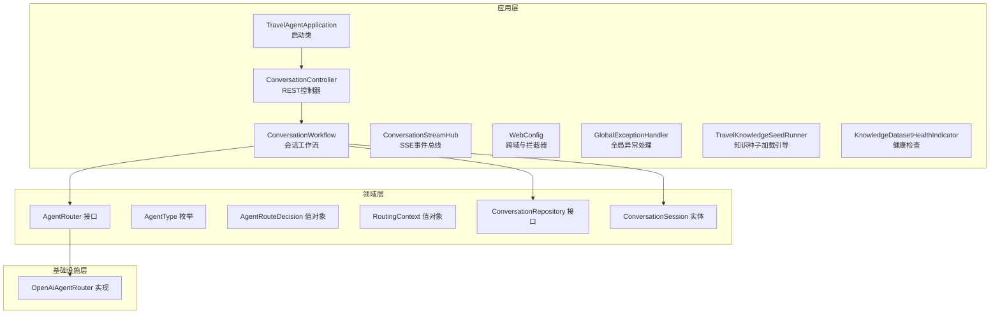
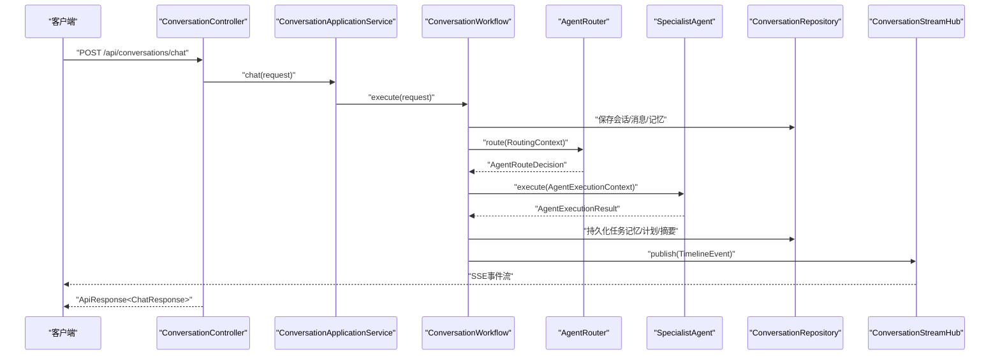
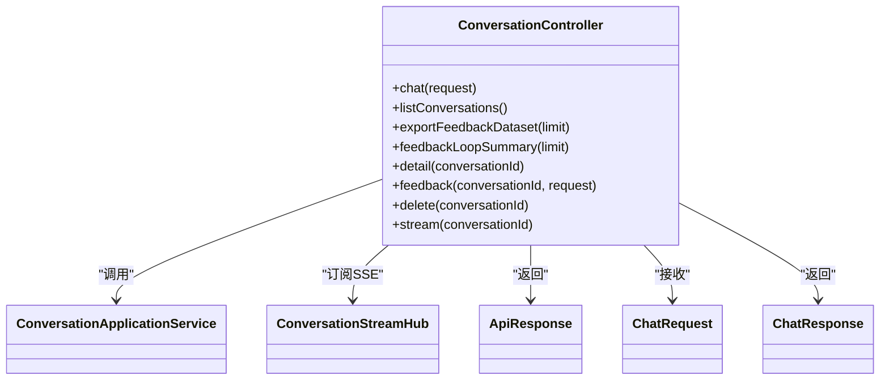
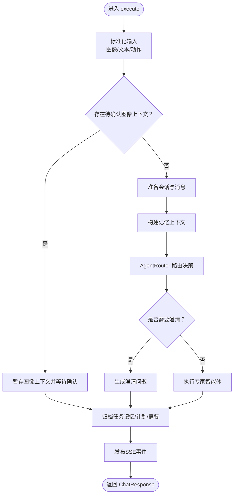
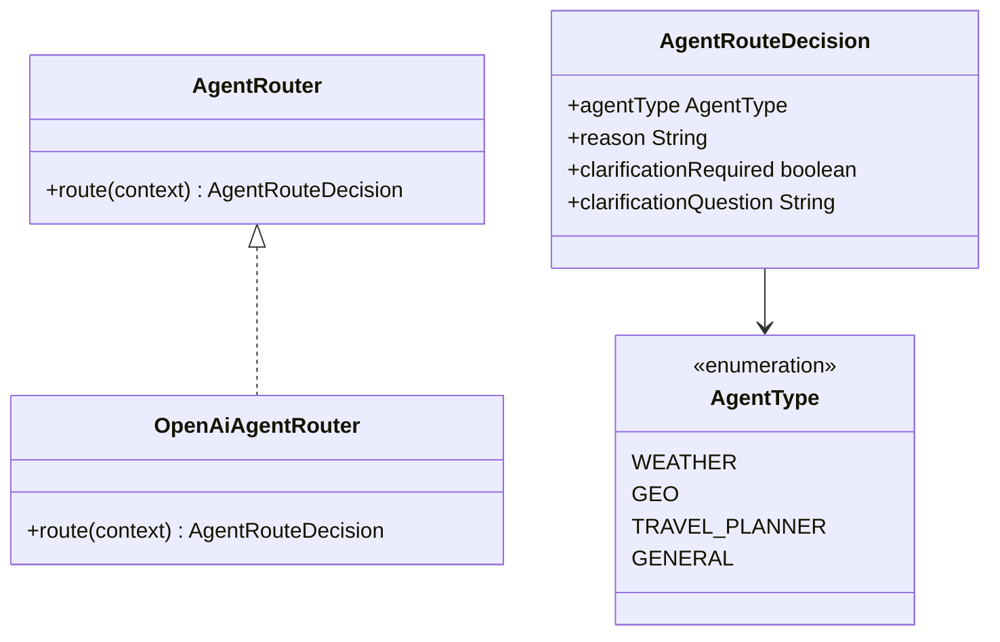
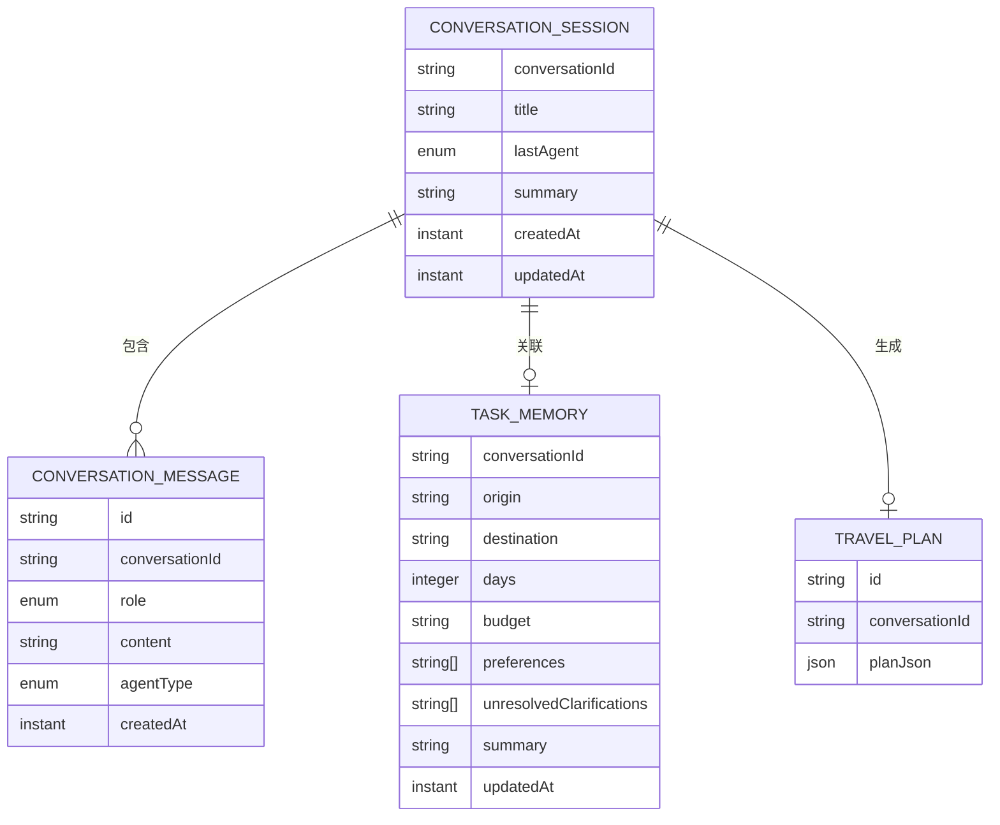
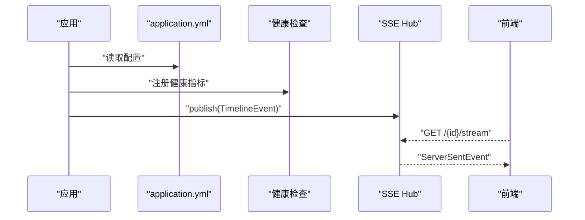
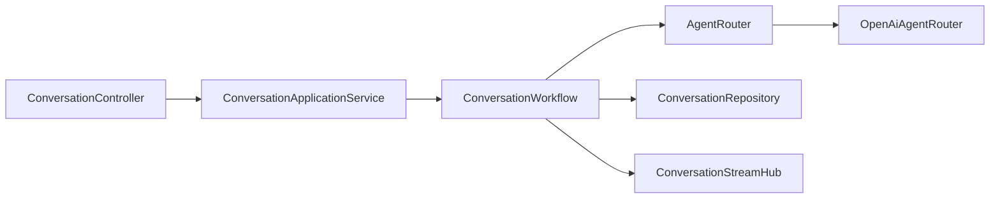

# 后端开发指南

<cite>
**本文引用的文件**
- [TravelAgentApplication.java](file://travel-agent-app/src/main/java/com/travalagent/app/TravelAgentApplication.java)
- [application.yml](file://travel-agent-app/src/main/resources/application.yml)
- [ConversationController.java](file://travel-agent-app/src/main/java/com/travalagent/app/controller/ConversationController.java)
- [ConversationWorkflow.java](file://travel-agent-app/src/main/java/com/travalagent/app/service/ConversationWorkflow.java)
- [ConversationStreamHub.java](file://travel-agent-app/src/main/java/com/travalagent/app/stream/ConversationStreamHub.java)
- [TravelKnowledgeSeedRunner.java](file://travel-agent-app/src/main/java/com/travalagent/app/bootstrap/TravelKnowledgeSeedRunner.java)
- [GlobalExceptionHandler.java](file://travel-agent-app/src/main/java/com/travalagent/app/controller/GlobalExceptionHandler.java)
- [WebConfig.java](file://travel-agent-app/src/main/java/com/travalagent/app/controller/WebConfig.java)
- [KnowledgeDatasetHealthIndicator.java](file://travel-agent-app/src/main/java/com/travalagent/app/health/KnowledgeDatasetHealthIndicator.java)
- [ChatRequest.java](file://travel-agent-app/src/main/java/com/travalagent/app/dto/ChatRequest.java)
- [ChatResponse.java](file://travel-agent-app/src/main/java/com/travalagent/app/dto/ChatResponse.java)
- [ConversationDetailResponse.java](file://travel-agent-app/src/main/java/com/travalagent/app/dto/ConversationDetailResponse.java)
- [ConversationFeedbackRequest.java](file://travel-agent-app/app/src/main/java/com/travalagent/app/dto/ConversationFeedbackRequest.java)
- [FeedbackLoopSummaryResponse.java](file://travel-agent-app/src/main/java/com/travalagent/app/dto/FeedbackLoopSummaryResponse.java)
- [FeedbackDatasetRecord.java](file://travel-agent-app/src/main/java/com/travalagent/app/dto/FeedbackDatasetRecord.java)
- [ConversationApplicationService.java](file://travel-agent-app/src/main/java/com/travalagent/app/service/ConversationApplicationService.java)
- [AgentRouter.java](file://travel-agent-domain/src/main/java/com/travalagent/domain/service/AgentRouter.java)
- [OpenAiAgentRouter.java](file://travel-agent-infrastructure/src/main/java/com/travalagent/infrastructure/gateway/llm/OpenAiAgentRouter.java)
- [AgentType.java](file://travel-agent-domain/src/main/java/com/travalagent/domain/model/valobj/AgentType.java)
- [AgentRouteDecision.java](file://travel-agent-domain/src/main/java/com/travalagent/domain/model/valobj/AgentRouteDecision.java)
- [RoutingContext.java](file://travel-agent-domain/src/main/java/com/travalagent/domain/model/valobj/RoutingContext.java)
- [ConversationRepository.java](file://travel-agent-domain/src/main/java/com/travalagent/domain/repository/ConversationRepository.java)
- [ConversationSession.java](file://travel-agent-domain/src/main/java/com/travalagent/domain/model/entity/ConversationSession.java)
- [AppException.java](file://travel-agent-types/src/main/java/com/travalagent/types/exception/AppException.java)
- [ApiResponse.java](file://travel-agent-types/src/main/java/com/travalagent/types/response/ApiResponse.java)
- [ResponseCode.java](file://travel-agent-types/src/main/java/com/travalagent/types/enums/ResponseCode.java)
- [schema.sql](file://travel-agent-app/src/main/resources/schema.sql)
</cite>

## 目录
1. [简介](#简介)
2. [项目结构](#项目结构)
3. [核心组件](#核心组件)
4. [架构总览](#架构总览)
5. [详细组件分析](#详细组件分析)
6. [依赖分析](#依赖分析)
7. [性能考虑](#性能考虑)
8. [故障排查指南](#故障排查指南)
9. [结论](#结论)
10. [附录](#附录)

## 简介
本指南面向TravelAgent后端开发者，聚焦于Spring Boot 4应用的启动与配置、REST API设计与实现（含ConversationController）、会话工作流（ConversationWorkflow）编排、智能体路由（AgentRouter）决策、领域驱动设计（DDD）在后端的应用（实体、值对象、仓储接口），以及配置管理、健康检查、SSE流式传输等关键能力。文档以循序渐进的方式呈现，既适合初学者快速上手，也便于资深工程师深入理解系统设计与实现。

## 项目结构
后端采用多模块分层组织：应用层（travel-agent-app）、领域层（travel-agent-domain）、基础设施层（travel-agent-infrastructure）、类型与异常定义（travel-agent-types）。应用层负责HTTP入口、流式事件发布、健康检查与引导任务；领域层定义业务实体、值对象与仓储接口；基础设施层实现具体的技术细节（如LLM路由、向量检索、MCP工具网关等）。

图表来源
- [TravelAgentApplication.java:1-15](file://travel-agent-app/src/main/java/com/travalagent/app/TravelAgentApplication.java#L1-L15)
- [ConversationController.java:1-101](file://travel-agent-app/src/main/java/com/travalagent/app/controller/ConversationController.java#L1-L101)
- [ConversationWorkflow.java:1-814](file://travel-agent-app/src/main/java/com/travalagent/app/service/ConversationWorkflow.java#L1-L814)
- [ConversationStreamHub.java:1-33](file://travel-agent-app/src/main/java/com/travalagent/app/stream/ConversationStreamHub.java#L1-L33)
- [WebConfig.java](file://travel-agent-app/src/main/java/com/travalagent/app/controller/WebConfig.java)
- [GlobalExceptionHandler.java](file://travel-agent-app/src/main/java/com/travalagent/app/controller/GlobalExceptionHandler.java)
- [TravelKnowledgeSeedRunner.java:1-82](file://travel-agent-app/src/main/java/com/travalagent/app/bootstrap/TravelKnowledgeSeedRunner.java#L1-L82)
- [KnowledgeDatasetHealthIndicator.java:1-31](file://travel-agent-app/src/main/java/com/travalagent/app/health/KnowledgeDatasetHealthIndicator.java#L1-L31)
- [AgentRouter.java:1-10](file://travel-agent-domain/src/main/java/com/travalagent/domain/service/AgentRouter.java#L1-L10)
- [OpenAiAgentRouter.java:1-145](file://travel-agent-infrastructure/src/main/java/com/travalagent/infrastructure/gateway/llm/OpenAiAgentRouter.java#L1-L145)
- [ConversationRepository.java:1-55](file://travel-agent-domain/src/main/java/com/travalagent/domain/repository/ConversationRepository.java#L1-L55)
- [ConversationSession.java:1-16](file://travel-agent-domain/src/main/java/com/travalagent/domain/model/entity/ConversationSession.java#L1-L16)

章节来源
- [TravelAgentApplication.java:1-15](file://travel-agent-app/src/main/java/com/travalagent/app/TravelAgentApplication.java#L1-L15)
- [application.yml:1-100](file://travel-agent-app/src/main/resources/application.yml#L1-L100)

## 核心组件
- 应用启动与配置
  - 启动类通过SpringBootApplication与@ConfigurationPropertiesScan启用自动装配与配置属性扫描。
  - application.yml集中管理数据库连接、OpenAI/MCP配置、管理端点、遥测采样与旅行相关参数。
- REST API
  - ConversationController提供聊天、会话列表、反馈导出/汇总、会话详情、删除会话、SSE流等接口。
  - 使用ApiResponse统一响应包装，结合Mono/Flux实现异步非阻塞处理。
- 会话工作流
  - ConversationWorkflow负责消息规范化、图像上下文处理、记忆构建、路由决策、专家智能体执行、结果归档与SSE事件发布。
- 智能体路由
  - AgentRouter为路由接口，OpenAiAgentRouter基于LLM与启发式规则进行AgentType选择，并支持澄清问题提示。
- 领域模型
  - AgentType、AgentRouteDecision、RoutingContext等值对象承载路由与执行上下文；ConversationSession等实体封装会话状态。
- 健康检查与引导
  - 健康指示器检查本地旅行知识数据集；引导器在启动时按需加载默认知识并可选验证。

章节来源
- [TravelAgentApplication.java:1-15](file://travel-agent-app/src/main/java/com/travalagent/app/TravelAgentApplication.java#L1-L15)
- [application.yml:1-100](file://travel-agent-app/src/main/resources/application.yml#L1-L100)
- [ConversationController.java:1-101](file://travel-agent-app/src/main/java/com/travalagent/app/controller/ConversationController.java#L1-L101)
- [ConversationWorkflow.java:1-814](file://travel-agent-app/src/main/java/com/travalagent/app/service/ConversationWorkflow.java#L1-L814)
- [AgentRouter.java:1-10](file://travel-agent-domain/src/main/java/com/travalagent/domain/service/AgentRouter.java#L1-L10)
- [OpenAiAgentRouter.java:1-145](file://travel-agent-infrastructure/src/main/java/com/travalagent/infrastructure/gateway/llm/OpenAiAgentRouter.java#L1-L145)
- [AgentType.java:1-9](file://travel-agent-domain/src/main/java/com/travalagent/domain/model/valobj/AgentType.java#L1-L9)
- [AgentRouteDecision.java:1-10](file://travel-agent-domain/src/main/java/com/travalagent/domain/model/valobj/AgentRouteDecision.java#L1-L10)
- [RoutingContext.java](file://travel-agent-domain/src/main/java/com/travalagent/domain/model/valobj/RoutingContext.java)
- [ConversationRepository.java:1-55](file://travel-agent-domain/src/main/java/com/travalagent/domain/repository/ConversationRepository.java#L1-L55)
- [ConversationSession.java:1-16](file://travel-agent-domain/src/main/java/com/travalagent/domain/model/entity/ConversationSession.java#L1-L16)
- [KnowledgeDatasetHealthIndicator.java:1-31](file://travel-agent-app/src/main/java/com/travalagent/app/health/KnowledgeDatasetHealthIndicator.java#L1-L31)
- [TravelKnowledgeSeedRunner.java:1-82](file://travel-agent-app/src/main/java/com/travalagent/app/bootstrap/TravelKnowledgeSeedRunner.java#L1-L82)

## 架构总览
下图展示从HTTP请求到智能体执行与事件发布的整体流程，体现应用层、领域层与基础设施层的职责边界与交互关系。

图表来源
- [ConversationController.java:47-51](file://travel-agent-app/src/main/java/com/travalagent/app/controller/ConversationController.java#L47-L51)
- [ConversationWorkflow.java:106-160](file://travel-agent-app/src/main/java/com/travalagent/app/service/ConversationWorkflow.java#L106-L160)
- [AgentRouter.java:6-9](file://travel-agent-domain/src/main/java/com/travalagent/domain/service/AgentRouter.java#L6-L9)
- [OpenAiAgentRouter.java:29-72](file://travel-agent-infrastructure/src/main/java/com/travalagent/infrastructure/gateway/llm/OpenAiAgentRouter.java#L29-L72)
- [ConversationRepository.java:14-55](file://travel-agent-domain/src/main/java/com/travalagent/domain/repository/ConversationRepository.java#L14-L55)
- [ConversationStreamHub.java:16-24](file://travel-agent-app/src/main/java/com/travalagent/app/stream/ConversationStreamHub.java#L16-L24)

## 详细组件分析

### Spring Boot 启动与配置管理
- 启动类
  - 使用@SpringBootApplication与@ConfigurationPropertiesScan，确保包扫描与配置属性绑定生效。
- 配置文件
  - 数据源使用SQLite，初始化脚本位于schema.sql。
  - OpenAI/MCP集成参数通过环境变量注入，支持不同运行环境切换。
  - 管理端点暴露health/info，开启遥测与OTLP追踪。
  - 旅行相关参数（记忆窗口、摘要阈值、工具/记忆提供者、允许的前端域名等）集中配置。

章节来源
- [TravelAgentApplication.java:7-14](file://travel-agent-app/src/main/java/com/travalagent/app/TravelAgentApplication.java#L7-L14)
- [application.yml:1-100](file://travel-agent-app/src/main/resources/application.yml#L1-L100)
- [schema.sql](file://travel-agent-app/src/main/resources/schema.sql)

### REST API 设计与实现（ConversationController）
- 路由与职责
  - 提供聊天、会话列表、反馈导出/汇总、会话详情、删除会话、SSE流等接口。
  - 使用ApiResponse统一封装返回，配合Mono/Flux实现非阻塞处理。
- 请求/响应模型
  - ChatRequest/ChatResponse/ConversationDetailResponse等DTO承载业务数据。
  - SSE通过ServerSentEvent输出TimelineEvent，事件名映射为ExecutionStage。
- 错误处理
  - 全局异常处理器捕获AppException并转换为标准响应码。

图表来源
- [ConversationController.java:32-101](file://travel-agent-app/src/main/java/com/travalagent/app/controller/ConversationController.java#L32-L101)
- [ChatRequest.java:1-18](file://travel-agent-app/src/main/java/com/travalagent/app/dto/ChatRequest.java#L1-L18)
- [ChatResponse.java](file://travel-agent-app/src/main/java/com/travalagent/app/dto/ChatResponse.java)
- [ConversationDetailResponse.java](file://travel-agent-app/src/main/java/com/travalagent/app/dto/ConversationDetailResponse.java)
- [ConversationFeedbackRequest.java](file://travel-agent-app/src/main/java/com/travalagent/app/dto/ConversationFeedbackRequest.java)
- [FeedbackLoopSummaryResponse.java](file://travel-agent-app/src/main/java/com/travalagent/app/dto/FeedbackLoopSummaryResponse.java)
- [FeedbackDatasetRecord.java](file://travel-agent-app/src/main/java/com/travalagent/app/dto/FeedbackDatasetRecord.java)
- [ConversationStreamHub.java:11-33](file://travel-agent-app/src/main/java/com/travalagent/app/stream/ConversationStreamHub.java#L11-L33)

章节来源
- [ConversationController.java:32-101](file://travel-agent-app/src/main/java/com/travalagent/app/controller/ConversationController.java#L32-L101)
- [GlobalExceptionHandler.java](file://travel-agent-app/src/main/java/com/travalagent/app/controller/GlobalExceptionHandler.java)
- [WebConfig.java](file://travel-agent-app/src/main/java/com/travalagent/app/controller/WebConfig.java)

### 会话工作流（ConversationWorkflow）编排逻辑
- 关键阶段
  - 图像附件标准化与校验、用户消息规范化、图像上下文确认/忽略、准备会话与消息、构建记忆上下文、路由决策、专家智能体执行、结果归档与摘要、SSE事件发布。
- 记忆与摘要
  - 结合短期窗口消息、长期记忆与任务记忆，动态更新任务记忆并按阈值触发摘要。
- 事件发布
  - 通过TimelinePublisher与ConversationStreamHub发布ExecutionStage事件，前端以SSE消费。

图表来源
- [ConversationWorkflow.java:106-160](file://travel-agent-app/src/main/java/com/travalagent/app/service/ConversationWorkflow.java#L106-L160)
- [ConversationWorkflow.java:348-406](file://travel-agent-app/src/main/java/com/travalagent/app/service/ConversationWorkflow.java#L348-L406)
- [ConversationWorkflow.java:408-486](file://travel-agent-app/src/main/java/com/travalagent/app/service/ConversationWorkflow.java#L408-L486)
- [ConversationStreamHub.java:16-24](file://travel-agent-app/src/main/java/com/travalagent/app/stream/ConversationStreamHub.java#L16-L24)

章节来源
- [ConversationWorkflow.java:1-814](file://travel-agent-app/src/main/java/com/travalagent/app/service/ConversationWorkflow.java#L1-L814)

### 智能体路由（AgentRouter）与专家智能体
- AgentRouter接口
  - 定义route方法，输入RoutingContext，输出AgentRouteDecision。
- OpenAiAgentRouter实现
  - 优先使用LLM进行路由，若不可用则回退启发式规则；支持澄清问题生成与语言适配。
- AgentType与AgentOutcome
  - AgentType枚举定义WEATHER/GEO/TRAVEL_PLANNER/GENERAL；AgentOutcome承载答案与可选旅行计划。

图表来源
- [AgentRouter.java:6-9](file://travel-agent-domain/src/main/java/com/travalagent/domain/service/AgentRouter.java#L6-L9)
- [OpenAiAgentRouter.java:12-72](file://travel-agent-infrastructure/src/main/java/com/travalagent/infrastructure/gateway/llm/OpenAiAgentRouter.java#L12-L72)
- [AgentType.java:3-8](file://travel-agent-domain/src/main/java/com/travalagent/domain/model/valobj/AgentType.java#L3-L8)
- [AgentRouteDecision.java:3-9](file://travel-agent-domain/src/main/java/com/travalagent/domain/model/valobj/AgentRouteDecision.java#L3-L9)

章节来源
- [AgentRouter.java:1-10](file://travel-agent-domain/src/main/java/com/travalagent/domain/service/AgentRouter.java#L1-L10)
- [OpenAiAgentRouter.java:1-145](file://travel-agent-infrastructure/src/main/java/com/travalagent/infrastructure/gateway/llm/OpenAiAgentRouter.java#L1-L145)
- [AgentType.java:1-9](file://travel-agent-domain/src/main/java/com/travalagent/domain/model/valobj/AgentType.java#L1-L9)
- [AgentRouteDecision.java:1-10](file://travel-agent-domain/src/main/java/com/travalagent/domain/model/valobj/AgentRouteDecision.java#L1-L10)

### 领域驱动设计（DDD）实践
- 实体
  - ConversationSession记录会话标题、摘要、最后代理类型与时间戳。
- 值对象
  - AgentType、AgentRouteDecision、RoutingContext等描述行为与上下文。
- 仓储接口
  - ConversationRepository抽象会话、消息、任务记忆、旅行计划、时间线与反馈的读写。
- 应用服务
  - ConversationApplicationService协调工作流与控制器交互，保持业务逻辑与表现层解耦。

图表来源
- [ConversationSession.java:7-15](file://travel-agent-domain/src/main/java/com/travalagent/domain/model/entity/ConversationSession.java#L7-L15)
- [ConversationRepository.java:14-55](file://travel-agent-domain/src/main/java/com/travalagent/domain/repository/ConversationRepository.java#L14-L55)

章节来源
- [ConversationSession.java:1-16](file://travel-agent-domain/src/main/java/com/travalagent/domain/model/entity/ConversationSession.java#L1-L16)
- [ConversationRepository.java:1-55](file://travel-agent-domain/src/main/java/com/travalagent/domain/repository/ConversationRepository.java#L1-L55)

### 配置管理、健康检查与SSE
- 配置管理
  - application.yml集中管理数据库、OpenAI/MCP、管理端点、遥测、旅行参数与外部服务（高德地图）配置。
- 健康检查
  - KnowledgeDatasetHealthIndicator检查本地旅行知识数据集条目数量，用于Kubernetes等平台的存活/就绪探针。
- SSE流式传输
  - ConversationStreamHub基于Reactor Sinks维护每个会话的事件通道，Controller通过SSE输出TimelineEvent。

图表来源
- [application.yml:42-56](file://travel-agent-app/src/main/resources/application.yml#L42-L56)
- [KnowledgeDatasetHealthIndicator.java:8-31](file://travel-agent-app/src/main/java/com/travalagent/app/health/KnowledgeDatasetHealthIndicator.java#L8-L31)
- [ConversationStreamHub.java:16-24](file://travel-agent-app/src/main/java/com/travalagent/app/stream/ConversationStreamHub.java#L16-L24)
- [ConversationController.java:92-99](file://travel-agent-app/src/main/java/com/travalagent/app/controller/ConversationController.java#L92-L99)

章节来源
- [application.yml:1-100](file://travel-agent-app/src/main/resources/application.yml#L1-L100)
- [KnowledgeDatasetHealthIndicator.java:1-31](file://travel-agent-app/src/main/java/com/travalagent/app/health/KnowledgeDatasetHealthIndicator.java#L1-L31)
- [ConversationStreamHub.java:1-33](file://travel-agent-app/src/main/java/com/travalagent/app/stream/ConversationStreamHub.java#L1-L33)
- [ConversationController.java:92-99](file://travel-agent-app/src/main/java/com/travalagent/app/controller/ConversationController.java#L92-L99)

### 智能体系统的开发指南
- 扩展专家智能体
  - 实现SpecialistAgent接口，定义supports(AgentType)与execute(AgentExecutionContext)。
  - 在构造函数中注册到ConversationWorkflow的specialistAgents映射，以便按AgentType分派。
- 专家智能体模板
  - 参考现有实现（如旅行规划、天气、地理、通用智能体）的模式，复用AgentExecutionContext中的上下文信息。
- 路由策略
  - 可在AgentRouter实现中增加LLM或启发式规则，必要时设置clarificationRequired与clarificationQuestion，引导用户提供缺失信息。

章节来源
- [ConversationWorkflow.java:84-104](file://travel-agent-app/src/main/java/com/travalagent/app/service/ConversationWorkflow.java#L84-L104)
- [OpenAiAgentRouter.java:29-72](file://travel-agent-infrastructure/src/main/java/com/travalagent/infrastructure/gateway/llm/OpenAiAgentRouter.java#L29-L72)

## 依赖分析
- 组件耦合
  - 控制器仅依赖应用服务；应用服务依赖工作流；工作流依赖领域接口（AgentRouter、ConversationRepository）与基础设施实现。
- 外部依赖
  - OpenAI/MCP、SQLite、Reactor、Spring Boot Actuator与遥测栈。
- 循环依赖
  - 当前结构清晰，未见循环依赖迹象。

图表来源
- [ConversationController.java:36-45](file://travel-agent-app/src/main/java/com/travalagent/app/controller/ConversationController.java#L36-L45)
- [ConversationWorkflow.java:74-104](file://travel-agent-app/src/main/java/com/travalagent/app/service/ConversationWorkflow.java#L74-L104)
- [AgentRouter.java:6-9](file://travel-agent-domain/src/main/java/com/travalagent/domain/service/AgentRouter.java#L6-L9)
- [OpenAiAgentRouter.java:12-27](file://travel-agent-infrastructure/src/main/java/com/travalagent/infrastructure/gateway/llm/OpenAiAgentRouter.java#L12-L27)
- [ConversationRepository.java:14-55](file://travel-agent-domain/src/main/java/com/travalagent/domain/repository/ConversationRepository.java#L14-L55)
- [ConversationStreamHub.java:11-33](file://travel-agent-app/src/main/java/com/travalagent/app/stream/ConversationStreamHub.java#L11-L33)

章节来源
- [ConversationController.java:1-101](file://travel-agent-app/src/main/java/com/travalagent/app/controller/ConversationController.java#L1-L101)
- [ConversationWorkflow.java:1-814](file://travel-agent-app/src/main/java/com/travalagent/app/service/ConversationWorkflow.java#L1-L814)
- [AgentRouter.java:1-10](file://travel-agent-domain/src/main/java/com/travalagent/domain/service/AgentRouter.java#L1-L10)
- [OpenAiAgentRouter.java:1-145](file://travel-agent-infrastructure/src/main/java/com/travalagent/infrastructure/gateway/llm/OpenAiAgentRouter.java#L1-L145)
- [ConversationRepository.java:1-55](file://travel-agent-domain/src/main/java/com/travalagent/domain/repository/ConversationRepository.java#L1-L55)
- [ConversationStreamHub.java:1-33](file://travel-agent-app/src/main/java/com/travalagent/app/stream/ConversationStreamHub.java#L1-L33)

## 性能考虑
- 异步与背压
  - 控制器使用Mono/Flux与boundedElastic调度器，避免阻塞主线程；SSE使用Reactor Sinks的背压缓冲。
- 数据库与连接池
  - SQLite连接池大小限制为1，适用于开发/小规模场景；生产建议评估并发与事务隔离需求。
- 记忆窗口与摘要阈值
  - 通过配置memory-window与summary-threshold平衡性能与上下文质量。
- LLM路由降级
  - OpenAiAgentRouter在不可用时回退启发式规则，保障系统可用性。

章节来源
- [ConversationController.java:48-51](file://travel-agent-app/src/main/java/com/travalagent/app/controller/ConversationController.java#L48-L51)
- [application.yml:8-12](file://travel-agent-app/src/main/resources/application.yml#L8-L12)
- [application.yml:59-60](file://travel-agent-app/src/main/resources/application.yml#L59-L60)
- [OpenAiAgentRouter.java:31-33](file://travel-agent-infrastructure/src/main/java/com/travalagent/infrastructure/gateway/llm/OpenAiAgentRouter.java#L31-L33)

## 故障排查指南
- 常见异常与处理
  - AppException携带响应码，全局异常处理器将其转换为标准响应；检查响应码与消息定位问题。
- 配置问题
  - OpenAI/MCP密钥或URL未正确注入；检查环境变量与application.yml对应项。
- SSE无法接收
  - 确认ConversationStreamHub已发布事件且前端正确订阅；检查跨域配置与网络连通性。
- 健康检查失败
  - 知识数据集为空会导致健康检查DOWN，先执行种子加载引导任务。

章节来源
- [AppException.java:1-23](file://travel-agent-types/src/main/java/com/travalagent/types/exception/AppException.java#L1-L23)
- [GlobalExceptionHandler.java](file://travel-agent-app/src/main/java/com/travalagent/app/controller/GlobalExceptionHandler.java)
- [application.yml:18-41](file://travel-agent-app/src/main/resources/application.yml#L18-L41)
- [ConversationStreamHub.java:16-24](file://travel-agent-app/src/main/java/com/travalagent/app/stream/ConversationStreamHub.java#L16-L24)
- [KnowledgeDatasetHealthIndicator.java:17-29](file://travel-agent-app/src/main/java/com/travalagent/app/health/KnowledgeDatasetHealthIndicator.java#L17-L29)
- [TravelKnowledgeSeedRunner.java:39-70](file://travel-agent-app/src/main/java/com/travalagent/app/bootstrap/TravelKnowledgeSeedRunner.java#L39-L70)

## 结论
本指南系统梳理了TravelAgent后端的启动配置、REST API、会话工作流、智能体路由与DDD建模，并提供了配置管理、健康检查与SSE的关键实现要点。遵循本文档，开发者可高效扩展新功能、优化性能并提升系统稳定性。

## 附录
- 启动与引导
  - 启动类与配置文件路径参见“项目结构”与“配置管理”章节。
- API参考
  - 控制器接口定义与响应模型参见“REST API 设计与实现”章节。
- 领域模型参考
  - 实体与值对象定义参见“领域驱动设计（DDD）实践”。