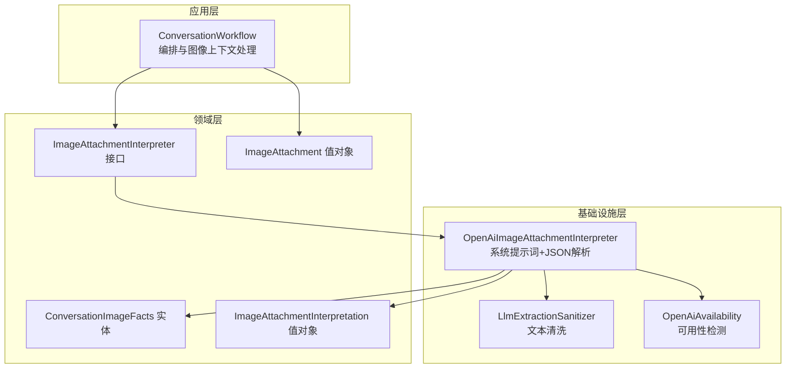
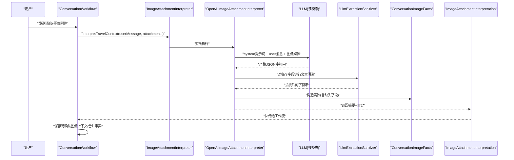
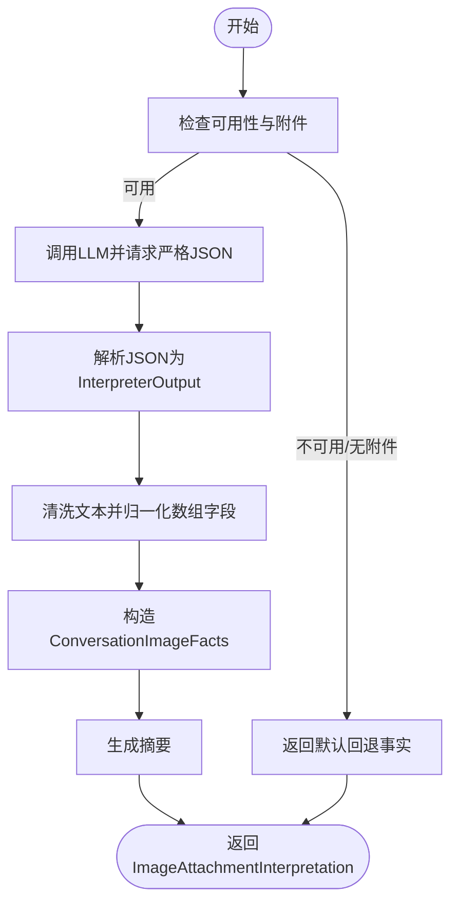
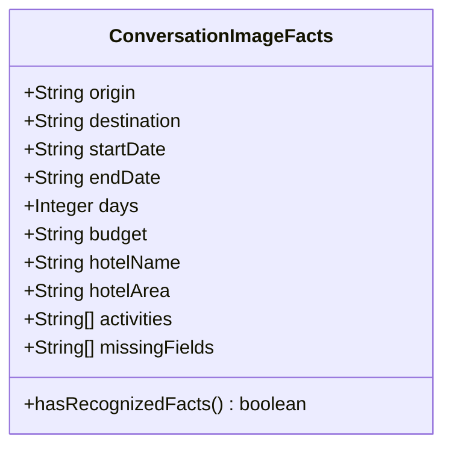
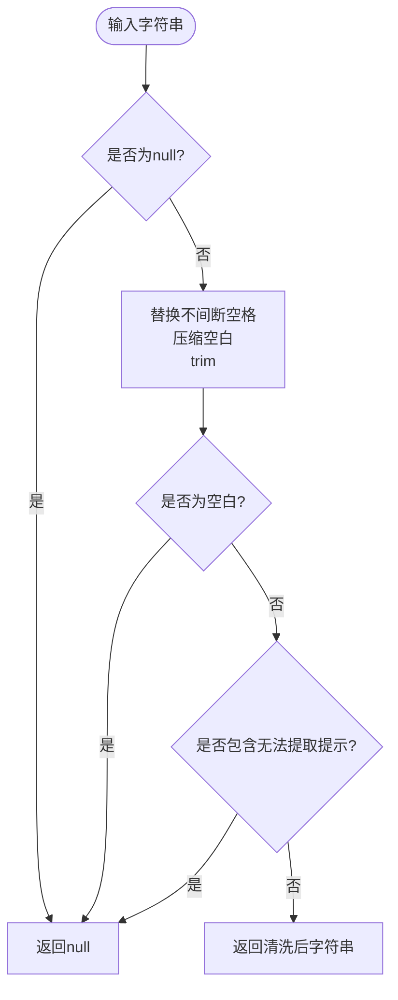
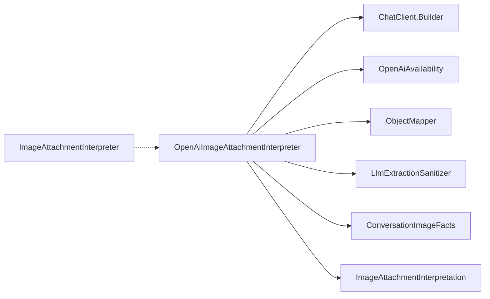

# OCR旅行事实提取

<cite>
**本文引用的文件**
- [OpenAiImageAttachmentInterpreter.java](file://travel-agent-infrastructure/src/main/java/com/travalagent/infrastructure/gateway/llm/OpenAiImageAttachmentInterpreter.java)
- [LlmExtractionSanitizer.java](file://travel-agent-infrastructure/src/main/java/com/travalagent/infrastructure/gateway/llm/LlmExtractionSanitizer.java)
- [ConversationImageFacts.java](file://travel-agent-domain/src/main/java/com/travalagent/domain/model/entity/ConversationImageFacts.java)
- [ImageAttachmentInterpretation.java](file://travel-agent-domain/src/main/java/com/travalagent/domain/model/valobj/ImageAttachmentInterpretation.java)
- [ImageAttachment.java](file://travel-agent-domain/src/main/java/com/travalagent/domain/model/valobj/ImageAttachment.java)
- [ImageAttachmentInterpreter.java](file://travel-agent-domain/src/main/java/com/travalagent/domain/service/ImageAttachmentInterpreter.java)
- [ConversationWorkflow.java](file://travel-agent-app/src/main/java/com/travalagent/app/service/ConversationWorkflow.java)
- [OpenAiAvailability.java](file://travel-agent-infrastructure/src/main/java/com/travalagent/infrastructure/gateway/llm/OpenAiAvailability.java)
- [OpenAiHealthIndicator.java](file://travel-agent-app/src/main/resources/application.yml)
- [application.yml](file://travel-agent-app/src/main/resources/application.yml)
- [README.md](file://README.md)
</cite>

## 目录
1. [简介](#简介)
2. [项目结构](#项目结构)
3. [核心组件](#核心组件)
4. [架构总览](#架构总览)
5. [详细组件分析](#详细组件分析)
6. [依赖关系分析](#依赖关系分析)
7. [性能与可靠性考量](#性能与可靠性考量)
8. [故障排查指南](#故障排查指南)
9. [结论](#结论)
10. [附录：提取示例与失败案例](#附录提取示例与失败案例)

## 简介
本文件面向“OCR旅行事实提取”子系统，聚焦于基于大语言模型（LLM）的图像多模态事实抽取能力，重点解析以下内容：
- OpenAiImageAttachmentInterpreter中的系统提示词设计、JSON输出模式与结构化解析流程
- ConversationImageFacts实体模型的字段定义、数据类型与验证规则
- LlmExtractionSanitizer的文本清理机制（格式标准化、噪声过滤、完整性检查）
- 准确性优化策略（上下文理解、歧义处理、缺失信息标注）
- 实际提取示例与失败案例分析

该系统通过上传的旅行截图，自动抽取出发地、目的地、日期、天数、预算、酒店名称与区域、活动列表等结构化旅行事实，并在无法提取时返回明确的缺失字段清单，以支持后续规划与校验。

## 项目结构
本系统采用分层架构与端到端工作流：
- 领域层（Domain）：定义实体、值对象、服务契约与仓库接口
- 应用层（App）：编排对话与工作流，处理图像上下文确认与回退
- 基础设施层（Infrastructure）：实现LLM交互、图像媒体支持、清洗器与可用性检测
- 前端（Web）：接收用户输入与图像附件，展示提取摘要与事实

图表来源
- [ConversationWorkflow.java:122-211](file://travel-agent-app/src/main/java/com/travalagent/app/service/ConversationWorkflow.java#L122-L211)
- [ImageAttachmentInterpreter.java:8-11](file://travel-agent-domain/src/main/java/com/travalagent/domain/service/ImageAttachmentInterpreter.java#L8-L11)
- [OpenAiImageAttachmentInterpreter.java:14-29](file://travel-agent-infrastructure/src/main/java/com/travalagent/infrastructure/gateway/llm/OpenAiImageAttachmentInterpreter.java#L14-L29)
- [LlmExtractionSanitizer.java:3-29](file://travel-agent-infrastructure/src/main/java/com/travalagent/infrastructure/gateway/llm/LlmExtractionSanitizer.java#L3-L29)
- [OpenAiAvailability.java:7-23](file://travel-agent-infrastructure/src/main/java/com/travalagent/infrastructure/gateway/llm/OpenAiAvailability.java#L7-L23)

章节来源
- [README.md:76-128](file://README.md#L76-L128)

## 核心组件
- OpenAiImageAttachmentInterpreter：负责构建系统提示词、调用LLM、解析严格JSON、归一化文本与缺失字段、生成摘要与事实对象
- LlmExtractionSanitizer：对结构化文本进行空白与噪声过滤、统一空白字符、识别“无法提取”的提示
- ConversationImageFacts：结构化旅行事实的不可变记录，包含缺失字段清单与识别有效性判断
- ImageAttachmentInterpreter：领域服务接口，抽象图像事实解释器
- ImageAttachmentInterpretation：封装摘要与事实的值对象
- ImageAttachment：图像附件元数据的值对象
- OpenAiAvailability：基于配置检测OpenAI可用性的组件

章节来源
- [OpenAiImageAttachmentInterpreter.java:14-29](file://travel-agent-infrastructure/src/main/java/com/travalagent/infrastructure/gateway/llm/OpenAiImageAttachmentInterpreter.java#L14-L29)
- [LlmExtractionSanitizer.java:3-29](file://travel-agent-infrastructure/src/main/java/com/travalagent/infrastructure/gateway/llm/LlmExtractionSanitizer.java#L3-L29)
- [ConversationImageFacts.java:5-37](file://travel-agent-domain/src/main/java/com/travalagent/domain/model/entity/ConversationImageFacts.java#L5-L37)
- [ImageAttachmentInterpretation.java:5-9](file://travel-agent-domain/src/main/java/com/travalagent/domain/model/valobj/ImageAttachmentInterpretation.java#L5-L9)
- [ImageAttachment.java:8-31](file://travel-agent-domain/src/main/java/com/travalagent/domain/model/valobj/ImageAttachment.java#L8-L31)
- [ImageAttachmentInterpreter.java:8-11](file://travel-agent-domain/src/main/java/com/travalagent/domain/service/ImageAttachmentInterpreter.java#L8-L11)
- [OpenAiAvailability.java:7-23](file://travel-agent-infrastructure/src/main/java/com/travalagent/infrastructure/gateway/llm/OpenAiAvailability.java#L7-L23)

## 架构总览
下图展示了从用户上传图像到最终生成旅行计划的事实抽取与合并路径。

图表来源
- [ConversationWorkflow.java:122-211](file://travel-agent-app/src/main/java/com/travalagent/app/service/ConversationWorkflow.java#L122-L211)
- [OpenAiImageAttachmentInterpreter.java:31-84](file://travel-agent-infrastructure/src/main/java/com/travalagent/infrastructure/gateway/llm/OpenAiImageAttachmentInterpreter.java#L31-L84)
- [LlmExtractionSanitizer.java:8-29](file://travel-agent-infrastructure/src/main/java/com/travalagent/infrastructure/gateway/llm/LlmExtractionSanitizer.java#L8-L29)
- [ImageAttachmentInterpretation.java:5-9](file://travel-agent-domain/src/main/java/com/travalagent/domain/model/valobj/ImageAttachmentInterpretation.java#L5-L9)
- [ConversationImageFacts.java:5-37](file://travel-agent-domain/src/main/java/com/travalagent/domain/model/entity/ConversationImageFacts.java#L5-L37)

## 详细组件分析

### 组件A：OpenAiImageAttachmentInterpreter（基于LLM的事实提取算法）
- 系统提示词设计
  - 明确职责：仅从图像中提取旅行规划相关结构化事实
  - 输出约束：严格JSON，避免自然语言解释
  - 字段形状与允许缺失：origin/destination/startDate/endDate/days/budget/hotelName/hotelArea可为null；activities与missingFields为数组
  - 规则约束：只包含图像可见事实、不允许猜测、缺失字段必须来自预定义集合
  - 语言偏好：优先使用图像中已有的语言
- JSON输出解析
  - 使用对象映射将LLM返回的JSON字符串解析为内部InterpreterOutput记录
  - 对activities与missingFields进行去空、去空白、去重处理
  - 对字符串字段调用清洗器进行格式标准化与噪声过滤
- 归一化与摘要
  - 将清洗后的字段组装为ConversationImageFacts
  - 生成人类可读摘要，按存在性拼接各字段
- 回退策略
  - 当无附件、LLM不可用、返回为空或解析异常时，返回全缺失字段的默认事实与提示性摘要

图表来源
- [OpenAiImageAttachmentInterpreter.java:31-157](file://travel-agent-infrastructure/src/main/java/com/travalagent/infrastructure/gateway/llm/OpenAiImageAttachmentInterpreter.java#L31-L157)

章节来源
- [OpenAiImageAttachmentInterpreter.java:31-157](file://travel-agent-infrastructure/src/main/java/com/travalagent/infrastructure/gateway/llm/OpenAiImageAttachmentInterpreter.java#L31-L157)

### 组件B：ConversationImageFacts（旅行事实实体模型）
- 字段定义与数据类型
  - origin/destination/startDate/endDate/budget/hotelName/hotelArea：字符串或null
  - days：整数或null
  - activities：字符串列表（非空时去重、去空白）
  - missingFields：字符串列表（预定义集合的缺失项）
- 验证规则与语义
  - 构造时对activities与missingFields进行不可变复制
  - hasRecognizedFacts用于判定是否存在任何可识别的事实
  - notBlank辅助方法确保空白字符串被视作缺失

图表来源
- [ConversationImageFacts.java:5-37](file://travel-agent-domain/src/main/java/com/travalagent/domain/model/entity/ConversationImageFacts.java#L5-L37)

章节来源
- [ConversationImageFacts.java:5-37](file://travel-agent-domain/src/main/java/com/travalagent/domain/model/entity/ConversationImageFacts.java#L5-L37)

### 组件C：LlmExtractionSanitizer（文本清洗机制）
- 格式标准化
  - 将不间断空格替换为空格，压缩多余空白，去除首尾空白
- 噪声过滤
  - 过滤“无法提取清晰旅行事实”类提示（大小写不敏感）
  - 中文提示“未能从图片里提取出确定的旅行信息”同样视为无效
- 完整性检查
  - 清洗后若为空白，返回null，表示该字段不可用

图表来源
- [LlmExtractionSanitizer.java:8-29](file://travel-agent-infrastructure/src/main/java/com/travalagent/infrastructure/gateway/llm/LlmExtractionSanitizer.java#L8-L29)

章节来源
- [LlmExtractionSanitizer.java:8-29](file://travel-agent-infrastructure/src/main/java/com/travalagent/infrastructure/gateway/llm/LlmExtractionSanitizer.java#L8-L29)

### 组件D：工作流集成与回退
- ConversationWorkflow在收到图像附件时，会先调用图像事实解释器
- 若解释器返回空或摘要为空，工作流会根据语言环境选择中英文提示
- 待确认的图像上下文会被持久化，等待用户确认后再进入规划阶段

章节来源
- [ConversationWorkflow.java:122-211](file://travel-agent-app/src/main/java/com/travalagent/app/service/ConversationWorkflow.java#L122-L211)

## 依赖关系分析
- OpenAiImageAttachmentInterpreter依赖
  - ChatClient.Builder：构建多模态提示
  - OpenAiAvailability：检测OpenAI可用性
  - ObjectMapper：JSON反序列化
  - LlmExtractionSanitizer：文本清洗
  - ConversationImageFacts：结构化事实
  - ImageAttachmentInterpretation：结果封装
- ImageAttachmentInterpreter为领域接口，便于替换不同实现
- OpenAiAvailability基于配置检测API Key状态，影响可用性

图表来源
- [OpenAiImageAttachmentInterpreter.java:17-29](file://travel-agent-infrastructure/src/main/java/com/travalagent/infrastructure/gateway/llm/OpenAiImageAttachmentInterpreter.java#L17-L29)
- [OpenAiAvailability.java:7-23](file://travel-agent-infrastructure/src/main/java/com/travalagent/infrastructure/gateway/llm/OpenAiAvailability.java#L7-L23)
- [ImageAttachmentInterpreter.java:8-11](file://travel-agent-domain/src/main/java/com/travalagent/domain/service/ImageAttachmentInterpreter.java#L8-L11)

章节来源
- [OpenAiImageAttachmentInterpreter.java:17-29](file://travel-agent-infrastructure/src/main/java/com/travalagent/infrastructure/gateway/llm/OpenAiImageAttachmentInterpreter.java#L17-L29)
- [OpenAiAvailability.java:7-23](file://travel-agent-infrastructure/src/main/java/com/travalagent/infrastructure/gateway/llm/OpenAiAvailability.java#L7-L23)
- [ImageAttachmentInterpreter.java:8-11](file://travel-agent-domain/src/main/java/com/travalagent/domain/service/ImageAttachmentInterpreter.java#L8-L11)

## 性能与可靠性考量
- 提示词与JSON约束
  - 严格JSON输出减少后处理开销，提高解析稳定性
  - 缺失字段清单限制了LLM的自由度，降低误报
- 文本清洗
  - 统一空白字符与噪声过滤，提升下游一致性
- 可用性检测
  - 在无有效API Key时快速回退，避免无效调用
- 数组归一化
  - activities与missingFields去重与去空白，减少重复与冗余

章节来源
- [OpenAiImageAttachmentInterpreter.java:39-64](file://travel-agent-infrastructure/src/main/java/com/travalagent/infrastructure/gateway/llm/OpenAiImageAttachmentInterpreter.java#L39-L64)
- [LlmExtractionSanitizer.java:12-29](file://travel-agent-infrastructure/src/main/java/com/travalagent/infrastructure/gateway/llm/LlmExtractionSanitizer.java#L12-L29)
- [OpenAiAvailability.java:15-23](file://travel-agent-infrastructure/src/main/java/com/travalagent/infrastructure/gateway/llm/OpenAiAvailability.java#L15-L23)

## 故障排查指南
- 症状：始终返回“无法提取清晰旅行事实”
  - 检查系统提示词是否被修改
  - 确认LLM返回的JSON是否符合预期形状
  - 核对LlmExtractionSanitizer的噪声过滤逻辑是否误判
- 症状：activities或missingFields为空
  - 检查原始图像中是否明确显示对应信息
  - 确认提示词中关于“仅包含图像可见事实”的规则是否被遵守
- 症状：days字段为null
  - 确认图像中是否包含明确的天数信息
  - 检查日期字段是否被正确识别并转换为整数
- 症状：摘要为空
  - 检查ConversationWorkflow的摘要生成逻辑与语言环境
- 症状：系统提示词未生效
  - 检查OpenAI可用性检测与配置项

章节来源
- [OpenAiImageAttachmentInterpreter.java:39-64](file://travel-agent-infrastructure/src/main/java/com/travalagent/infrastructure/gateway/llm/OpenAiImageAttachmentInterpreter.java#L39-L64)
- [LlmExtractionSanitizer.java:21-27](file://travel-agent-infrastructure/src/main/java/com/travalagent/infrastructure/gateway/llm/LlmExtractionSanitizer.java#L21-L27)
- [ConversationWorkflow.java:162-211](file://travel-agent-app/src/main/java/com/travalagent/app/service/ConversationWorkflow.java#L162-L211)
- [OpenAiHealthIndicator.java:8-30](file://travel-agent-app/src/main/resources/application.yml#L8-L30)

## 结论
本系统通过严格的系统提示词、JSON输出约束与文本清洗机制，实现了从旅行图像中稳定提取结构化旅行事实的能力。ConversationImageFacts提供了清晰的数据模型与缺失字段标注，配合工作流的确认机制，能够将图像事实可靠地融入后续的旅行规划流程。建议在生产环境中持续监控可用性与提示词效果，并结合业务反馈迭代优化。

## 附录：提取示例与失败案例

### 示例A：成功提取（部分字段）
- 输入：图像包含“上海”“北京”“2025-06-01”“2025-06-05”“5天”“3000元”“酒店名称”“酒店区域”“徒步、登山”等信息
- 输出：origin=“上海”，destination=“北京”，startDate=“2025-06-01”，endDate=“2025-06-05”，days=5，budget=“3000元”，hotelName=“酒店名称”，hotelArea=“酒店区域”，activities=[“徒步”、“登山”]，missingFields=[]
- 摘要：按存在性拼接各字段，形成简洁摘要

章节来源
- [OpenAiImageAttachmentInterpreter.java:105-147](file://travel-agent-infrastructure/src/main/java/com/travalagent/infrastructure/gateway/llm/OpenAiImageAttachmentInterpreter.java#L105-L147)
- [ConversationImageFacts.java:23-33](file://travel-agent-domain/src/main/java/com/travalagent/domain/model/entity/ConversationImageFacts.java#L23-L33)

### 示例B：成功提取（部分字段缺失）
- 输入：图像仅显示“杭州”“西湖”“徒步”“登山”
- 输出：origin=null，destination=“杭州”，startDate=null，endDate=null，days=null，budget=null，hotelName=null，hotelArea=null，activities=[“徒步”、“登山”]，missingFields=[“origin”, “startDate”, “endDate”, “days”, “budget”, “hotelName”, “hotelArea”]
- 摘要：仅拼接存在的字段，缺失字段在摘要中标注

章节来源
- [OpenAiImageAttachmentInterpreter.java:105-147](file://travel-agent-infrastructure/src/main/java/com/travalagent/infrastructure/gateway/llm/OpenAiImageAttachmentInterpreter.java#L105-L147)
- [ConversationImageFacts.java:18-21](file://travel-agent-domain/src/main/java/com/travalagent/domain/model/entity/ConversationImageFacts.java#L18-L21)

### 失败案例A：LLM返回空或无效JSON
- 现象：interpretation.content为空或解析异常
- 处理：回退到默认事实（全部missingFields），并返回提示性摘要
- 建议：检查提示词与模型参数，必要时增加示例或调整温度

章节来源
- [OpenAiImageAttachmentInterpreter.java:75-83](file://travel-agent-infrastructure/src/main/java/com/travalagent/infrastructure/gateway/llm/OpenAiImageAttachmentInterpreter.java#L75-L83)
- [OpenAiImageAttachmentInterpreter.java:86-103](file://travel-agent-infrastructure/src/main/java/com/travalagent/infrastructure/gateway/llm/OpenAiImageAttachmentInterpreter.java#L86-L103)

### 失败案例B：图像中无明确旅行事实
- 现象：LLM返回“无法提取清晰旅行事实”类提示
- 处理：LlmExtractionSanitizer将其识别为无效，返回null，最终missingFields包含全部字段
- 建议：在前端引导用户提供更清晰的旅行截图，或补充文字描述

章节来源
- [LlmExtractionSanitizer.java:21-27](file://travel-agent-infrastructure/src/main/java/com/travalagent/infrastructure/gateway/llm/LlmExtractionSanitizer.java#L21-L27)
- [OpenAiImageAttachmentInterpreter.java:86-103](file://travel-agent-infrastructure/src/main/java/com/travalagent/infrastructure/gateway/llm/OpenAiImageAttachmentInterpreter.java#L86-L103)

### 失败案例C：API Key不可用
- 现象：OpenAiAvailability检测到API Key缺失或占位符
- 处理：直接回退到默认事实，避免无效调用
- 建议：检查环境变量与配置文件，确保SPRING_AI_OPENAI_API_KEY有效

章节来源
- [OpenAiAvailability.java:15-23](file://travel-agent-infrastructure/src/main/java/com/travalagent/infrastructure/gateway/llm/OpenAiAvailability.java#L15-L23)
- [OpenAiImageAttachmentInterpreter.java:33-35](file://travel-agent-infrastructure/src/main/java/com/travalagent/infrastructure/gateway/llm/OpenAiImageAttachmentInterpreter.java#L33-L35)