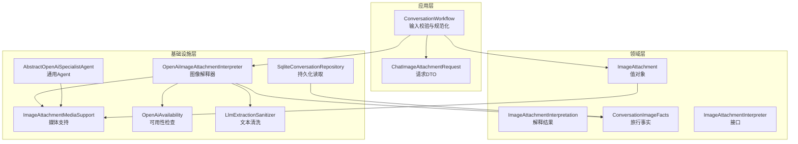
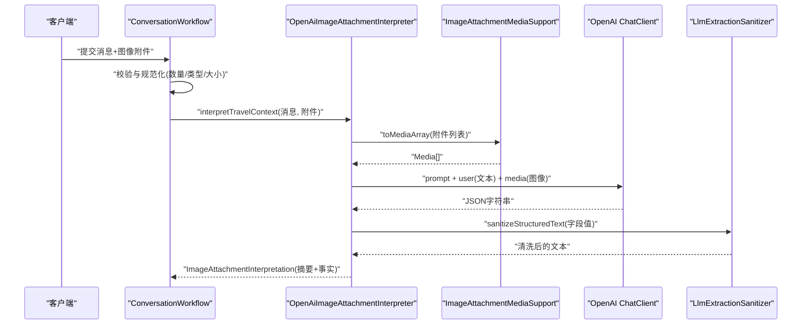
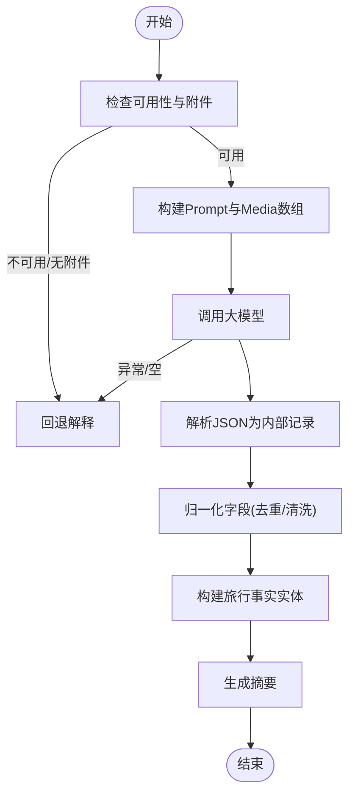
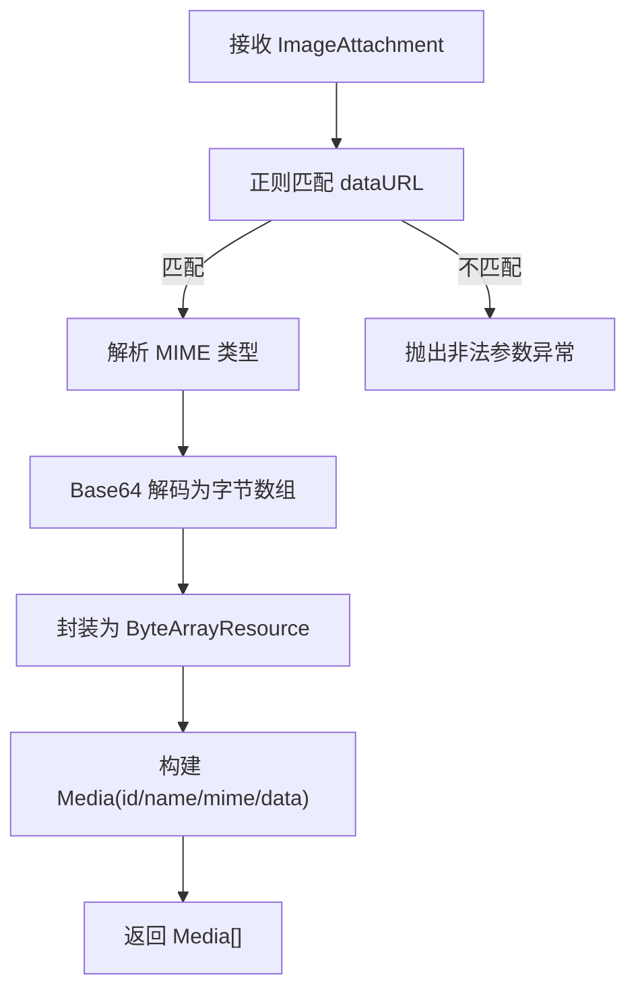
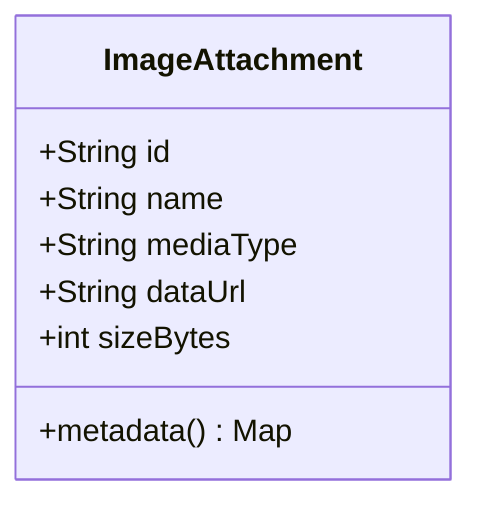
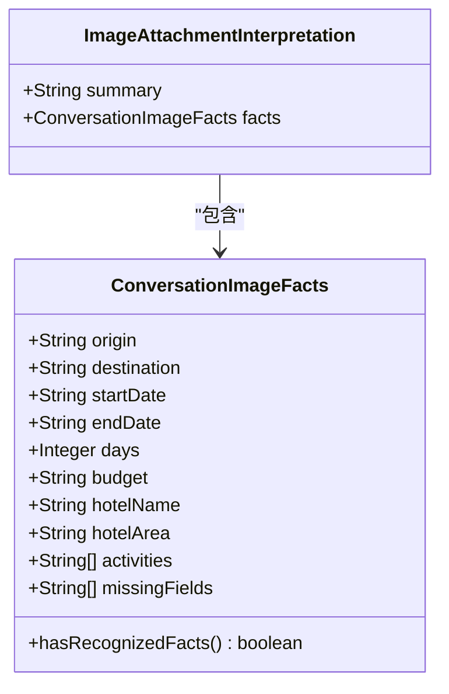
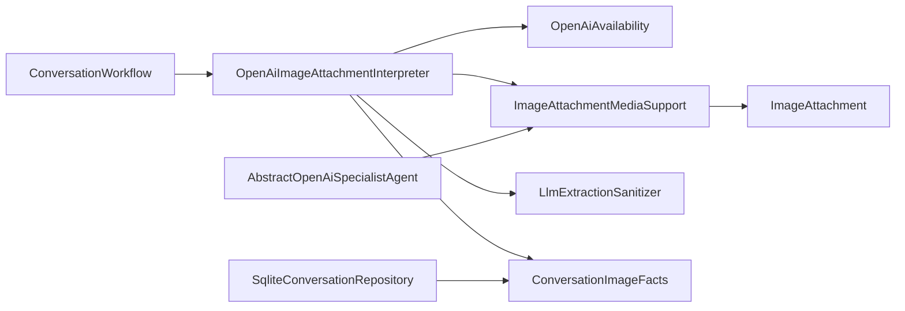

# 图像处理管道

<cite>
**本文引用的文件**
- [OpenAiImageAttachmentInterpreter.java](file://travel-agent-infrastructure/src/main/java/com/travalagent/infrastructure/gateway/llm/OpenAiImageAttachmentInterpreter.java)
- [ImageAttachmentMediaSupport.java](file://travel-agent-infrastructure/src/main/java/com/travalagent/infrastructure/gateway/llm/ImageAttachmentMediaSupport.java)
- [LlmExtractionSanitizer.java](file://travel-agent-infrastructure/src/main/java/com/travalagent/infrastructure/gateway/llm/LlmExtractionSanitizer.java)
- [OpenAiAvailability.java](file://travel-agent-infrastructure/src/main/java/com/travalagent/infrastructure/gateway/llm/OpenAiAvailability.java)
- [ImageAttachment.java](file://travel-agent-domain/src/main/java/com/travalagent/domain/model/valobj/ImageAttachment.java)
- [ImageAttachmentInterpretation.java](file://travel-agent-domain/src/main/java/com/travalagent/domain/model/valobj/ImageAttachmentInterpretation.java)
- [ConversationImageFacts.java](file://travel-agent-domain/src/main/java/com/travalagent/domain/model/entity/ConversationImageFacts.java)
- [ImageAttachmentInterpreter.java](file://travel-agent-domain/src/main/java/com/travalagent/domain/service/ImageAttachmentInterpreter.java)
- [ConversationWorkflow.java](file://travel-agent-app/src/main/java/com/travalagent/app/service/ConversationWorkflow.java)
- [ChatImageAttachmentRequest.java](file://travel-agent-app/src/main/java/com/travalagent/app/dto/ChatImageAttachmentRequest.java)
- [SqliteConversationRepository.java](file://travel-agent-infrastructure/src/main/java/com/travalagent/infrastructure/repository/SqliteConversationRepository.java)
- [AbstractOpenAiSpecialistAgent.java](file://travel-agent-infrastructure/src/main/java/com/travalagent/infrastructure/gateway/llm/AbstractOpenAiSpecialistAgent.java)
</cite>

## 目录
1. [简介](#简介)
2. [项目结构](#项目结构)
3. [核心组件](#核心组件)
4. [架构总览](#架构总览)
5. [详细组件分析](#详细组件分析)
6. [依赖分析](#依赖分析)
7. [性能考虑](#性能考虑)
8. [故障排查指南](#故障排查指南)
9. [结论](#结论)
10. [附录：配置与参数说明](#附录配置与参数说明)

## 简介
本文件聚焦于“图像处理管道”的设计与实现，围绕以下目标展开：
- 深入解析 OpenAiImageAttachmentInterpreter 中的图像处理流程（图像预处理、格式转换、尺寸优化等）。
- 详解 ImageAttachmentMediaSupport 的媒体支持机制（支持的图像格式、分辨率限制与质量控制）。
- 阐述 ImageAttachment 数据模型的设计（图像元数据、编码格式与存储策略）。
- 提供图像处理最佳实践（性能优化、内存管理与错误处理策略）。
- 给出具体代码示例路径与配置参数说明。

## 项目结构
图像处理管道横跨应用层、领域层与基础设施层：
- 应用层负责输入校验、图像附件规范化与上下文拼装。
- 领域层定义图像附件与解释结果的数据模型。
- 基础设施层对接大模型服务，执行图像事实抽取与回退策略。

图表来源
- [ConversationWorkflow.java:534-575](file://travel-agent-app/src/main/java/com/travalagent/app/service/ConversationWorkflow.java#L534-L575)
- [ImageAttachment.java:8-32](file://travel-agent-domain/src/main/java/com/travalagent/domain/model/valobj/ImageAttachment.java#L8-L32)
- [ImageAttachmentInterpretation.java:5-9](file://travel-agent-domain/src/main/java/com/travalagent/domain/model/valobj/ImageAttachmentInterpretation.java#L5-L9)
- [ConversationImageFacts.java:5-38](file://travel-agent-domain/src/main/java/com/travalagent/domain/model/entity/ConversationImageFacts.java#L5-L38)
- [ImageAttachmentMediaSupport.java:22-42](file://travel-agent-infrastructure/src/main/java/com/travalagent/infrastructure/gateway/llm/ImageAttachmentMediaSupport.java#L22-L42)
- [OpenAiImageAttachmentInterpreter.java:31-84](file://travel-agent-infrastructure/src/main/java/com/travalagent/infrastructure/gateway/llm/OpenAiImageAttachmentInterpreter.java#L31-L84)
- [OpenAiAvailability.java:15-23](file://travel-agent-infrastructure/src/main/java/com/travalagent/infrastructure/gateway/llm/OpenAiAvailability.java#L15-L23)
- [LlmExtractionSanitizer.java:8-29](file://travel-agent-infrastructure/src/main/java/com/travalagent/infrastructure/gateway/llm/LlmExtractionSanitizer.java#L8-L29)
- [SqliteConversationRepository.java:500-520](file://travel-agent-infrastructure/src/main/java/com/travalagent/infrastructure/repository/SqliteConversationRepository.java#L500-L520)
- [AbstractOpenAiSpecialistAgent.java:31-57](file://travel-agent-infrastructure/src/main/java/com/travalagent/infrastructure/gateway/llm/AbstractOpenAiSpecialistAgent.java#L31-L57)

章节来源
- [ConversationWorkflow.java:51-575](file://travel-agent-app/src/main/java/com/travalagent/app/service/ConversationWorkflow.java#L51-L575)
- [ImageAttachment.java:8-32](file://travel-agent-domain/src/main/java/com/travalagent/domain/model/valobj/ImageAttachment.java#L8-L32)
- [ImageAttachmentInterpretation.java:5-9](file://travel-agent-domain/src/main/java/com/travalagent/domain/model/valobj/ImageAttachmentInterpretation.java#L5-L9)
- [ConversationImageFacts.java:5-38](file://travel-agent-domain/src/main/java/com/travalagent/domain/model/entity/ConversationImageFacts.java#L5-L38)
- [ImageAttachmentMediaSupport.java:15-59](file://travel-agent-infrastructure/src/main/java/com/travalagent/infrastructure/gateway/llm/ImageAttachmentMediaSupport.java#L15-L59)
- [OpenAiImageAttachmentInterpreter.java:14-173](file://travel-agent-infrastructure/src/main/java/com/travalagent/infrastructure/gateway/llm/OpenAiImageAttachmentInterpreter.java#L14-L173)
- [OpenAiAvailability.java:7-24](file://travel-agent-infrastructure/src/main/java/com/travalagent/infrastructure/gateway/llm/OpenAiAvailability.java#L7-L24)
- [LlmExtractionSanitizer.java:3-30](file://travel-agent-infrastructure/src/main/java/com/travalagent/infrastructure/gateway/llm/LlmExtractionSanitizer.java#L3-L30)
- [SqliteConversationRepository.java:500-520](file://travel-agent-infrastructure/src/main/java/com/travalagent/infrastructure/repository/SqliteConversationRepository.java#L500-L520)
- [AbstractOpenAiSpecialistAgent.java:31-57](file://travel-agent-infrastructure/src/main/java/com/travalagent/infrastructure/gateway/llm/AbstractOpenAiSpecialistAgent.java#L31-L57)

## 核心组件
- 图像附件值对象：封装 id、名称、媒体类型、dataURL、大小等字段，并提供只读语义与元数据导出。
- 解释器接口：定义从用户消息与图像附件中抽取旅行事实的统一入口。
- OpenAI 图像解释器：实现基于大模型的事实抽取、回退策略与摘要生成。
- 媒体支持工具：将 base64 dataURL 转换为 Spring AI Media 对象，供大模型调用。
- 文本清洗器：对大模型输出进行标准化与无效值过滤。
- 可用性检查：根据配置判断是否启用 OpenAI 相关能力。
- 旅行事实实体：承载抽取到的旅行相关信息与缺失字段列表。
- 应用层规范化：在进入解释器前完成输入校验、格式约束与大小限制。

章节来源
- [ImageAttachment.java:8-32](file://travel-agent-domain/src/main/java/com/travalagent/domain/model/valobj/ImageAttachment.java#L8-L32)
- [ImageAttachmentInterpretation.java:5-9](file://travel-agent-domain/src/main/java/com/travalagent/domain/model/valobj/ImageAttachmentInterpretation.java#L5-L9)
- [ImageAttachmentInterpreter.java:8-11](file://travel-agent-domain/src/main/java/com/travalagent/domain/service/ImageAttachmentInterpreter.java#L8-L11)
- [OpenAiImageAttachmentInterpreter.java:14-173](file://travel-agent-infrastructure/src/main/java/com/travalagent/infrastructure/gateway/llm/OpenAiImageAttachmentInterpreter.java#L14-L173)
- [ImageAttachmentMediaSupport.java:15-59](file://travel-agent-infrastructure/src/main/java/com/travalagent/infrastructure/gateway/llm/ImageAttachmentMediaSupport.java#L15-L59)
- [LlmExtractionSanitizer.java:3-30](file://travel-agent-infrastructure/src/main/java/com/travalagent/infrastructure/gateway/llm/LlmExtractionSanitizer.java#L3-L30)
- [OpenAiAvailability.java:7-24](file://travel-agent-infrastructure/src/main/java/com/travalagent/infrastructure/gateway/llm/OpenAiAvailability.java#L7-L24)
- [ConversationImageFacts.java:5-38](file://travel-agent-domain/src/main/java/com/travalagent/domain/model/entity/ConversationImageFacts.java#L5-L38)
- [ConversationWorkflow.java:534-575](file://travel-agent-app/src/main/java/com/travalagent/app/service/ConversationWorkflow.java#L534-L575)

## 架构总览
图像处理管道的关键交互如下：

图表来源
- [ConversationWorkflow.java:534-575](file://travel-agent-app/src/main/java/com/travalagent/app/service/ConversationWorkflow.java#L534-L575)
- [OpenAiImageAttachmentInterpreter.java:31-84](file://travel-agent-infrastructure/src/main/java/com/travalagent/infrastructure/gateway/llm/OpenAiImageAttachmentInterpreter.java#L31-L84)
- [ImageAttachmentMediaSupport.java:22-42](file://travel-agent-infrastructure/src/main/java/com/travalagent/infrastructure/gateway/llm/ImageAttachmentMediaSupport.java#L22-L42)
- [LlmExtractionSanitizer.java:8-29](file://travel-agent-infrastructure/src/main/java/com/travalagent/infrastructure/gateway/llm/LlmExtractionSanitizer.java#L8-L29)

## 详细组件分析

### OpenAiImageAttachmentInterpreter：图像处理流程
- 输入校验与可用性检查：当附件为空或不可用时，直接返回回退解释结果。
- Prompt 构建：系统提示限定 JSON 结构与字段集合；用户提示强调仅从图像中提取可见事实。
- 媒体注入：通过媒体支持工具将 base64 dataURL 转为 Media 数组传入大模型。
- 结果解析与归一化：将 JSON 反序列化为内部记录类型，再映射为旅行事实实体；对活动与缺失字段去重与清洗。
- 摘要生成：按字段顺序生成可读摘要，若无任何事实则给出兜底提示。
- 错误处理：异常或空响应时回退至默认解释结果。

图表来源
- [OpenAiImageAttachmentInterpreter.java:31-147](file://travel-agent-infrastructure/src/main/java/com/travalagent/infrastructure/gateway/llm/OpenAiImageAttachmentInterpreter.java#L31-L147)

章节来源
- [OpenAiImageAttachmentInterpreter.java:14-173](file://travel-agent-infrastructure/src/main/java/com/travalagent/infrastructure/gateway/llm/OpenAiImageAttachmentInterpreter.java#L14-L173)

### ImageAttachmentMediaSupport：媒体支持机制
- 支持的图像格式：通过正则匹配 dataURL 的 MIME 类型，结合白名单校验，确保仅允许 PNG、JPEG、WEBP、GIF。
- 分辨率与质量控制：该工具不直接参与解码与尺寸调整，但通过 base64 字节长度与应用层最大大小限制共同约束资源占用。
- 编码与传输：将 dataURL 解析为字节数组，封装为 Spring Resource 并以 Media 形式传递给大模型客户端。

图表来源
- [ImageAttachmentMediaSupport.java:22-52](file://travel-agent-infrastructure/src/main/java/com/travalagent/infrastructure/gateway/llm/ImageAttachmentMediaSupport.java#L22-L52)

章节来源
- [ImageAttachmentMediaSupport.java:15-59](file://travel-agent-infrastructure/src/main/java/com/travalagent/infrastructure/gateway/llm/ImageAttachmentMediaSupport.java#L15-L59)
- [ConversationWorkflow.java:546-575](file://travel-agent-app/src/main/java/com/travalagent/app/service/ConversationWorkflow.java#L546-L575)

### ImageAttachment 数据模型设计
- 字段与语义：id、name、mediaType、dataUrl、sizeBytes；构造器保证非空与规范化（小写、去空白、非负大小）。
- 元数据导出：提供只读元数据映射，便于日志与审计。
- 存储策略：原始 dataURL 与字节大小保存，避免重复解码；实际解码发生在媒体支持阶段。

图表来源
- [ImageAttachment.java:8-32](file://travel-agent-domain/src/main/java/com/travalagent/domain/model/valobj/ImageAttachment.java#L8-L32)

章节来源
- [ImageAttachment.java:8-32](file://travel-agent-domain/src/main/java/com/travalagent/domain/model/valobj/ImageAttachment.java#L8-L32)

### 旅行事实与解释结果
- 旅行事实：包含出发地、目的地、起止日期、天数、预算、酒店名称与区域、活动列表、缺失字段列表；提供识别到事实的判定方法。
- 解释结果：包含摘要与旅行事实，用于后续对话与计划构建。

图表来源
- [ConversationImageFacts.java:5-38](file://travel-agent-domain/src/main/java/com/travalagent/domain/model/entity/ConversationImageFacts.java#L5-L38)
- [ImageAttachmentInterpretation.java:5-9](file://travel-agent-domain/src/main/java/com/travalagent/domain/model/valobj/ImageAttachmentInterpretation.java#L5-L9)

章节来源
- [ConversationImageFacts.java:5-38](file://travel-agent-domain/src/main/java/com/travalagent/domain/model/entity/ConversationImageFacts.java#L5-L38)
- [ImageAttachmentInterpretation.java:5-9](file://travel-agent-domain/src/main/java/com/travalagent/domain/model/valobj/ImageAttachmentInterpretation.java#L5-L9)

### 应用层规范化与约束
- 最大附件数量：最多 4 张。
- 支持的媒体类型：PNG、JPEG、WEBP、GIF。
- 单图最大大小：5MB。
- 校验规则：dataURL 必须为 base64；媒体类型需与 dataURL 匹配；解码失败则拒绝。
- 名称回退：若未提供名称，则按媒体类型派生默认名称。

章节来源
- [ConversationWorkflow.java:51-575](file://travel-agent-app/src/main/java/com/travalagent/app/service/ConversationWorkflow.java#L51-L575)
- [ChatImageAttachmentRequest.java:5-10](file://travel-agent-app/src/main/java/com/travalagent/app/dto/ChatImageAttachmentRequest.java#L5-L10)

### 文本清洗与回退策略
- 清洗逻辑：去除不间断空格、多空白归一化、剔除无意义提示（如无法提取明确旅行事实）。
- 回退策略：当大模型无有效输出或异常时，返回默认解释结果，包含所有字段标记为缺失。

章节来源
- [LlmExtractionSanitizer.java:3-30](file://travel-agent-infrastructure/src/main/java/com/travalagent/infrastructure/gateway/llm/LlmExtractionSanitizer.java#L3-L30)
- [OpenAiImageAttachmentInterpreter.java:86-103](file://travel-agent-infrastructure/src/main/java/com/travalagent/infrastructure/gateway/llm/OpenAiImageAttachmentInterpreter.java#L86-L103)

### 与其他组件的集成点
- 通用 Agent 集成：在需要时将图像附件注入到通用 Agent 的 prompt 中。
- 持久化读取：从 JSON 字段恢复图像附件与旅行事实，异常时提供兜底。

章节来源
- [AbstractOpenAiSpecialistAgent.java:31-57](file://travel-agent-infrastructure/src/main/java/com/travalagent/infrastructure/gateway/llm/AbstractOpenAiSpecialistAgent.java#L31-L57)
- [SqliteConversationRepository.java:500-520](file://travel-agent-infrastructure/src/main/java/com/travalagent/infrastructure/repository/SqliteConversationRepository.java#L500-L520)

## 依赖分析
- 组件耦合：
  - OpenAiImageAttachmentInterpreter 依赖 OpenAiAvailability、ImageAttachmentMediaSupport、LlmExtractionSanitizer 与领域模型。
  - 应用层 ConversationWorkflow 在进入解释器前完成严格的输入约束。
- 外部依赖：
  - Spring AI ChatClient 用于与大模型通信。
  - Jackson 用于 JSON 解析。
- 循环依赖：
  - 未发现循环依赖迹象，职责边界清晰。

图表来源
- [ConversationWorkflow.java:534-575](file://travel-agent-app/src/main/java/com/travalagent/app/service/ConversationWorkflow.java#L534-L575)
- [OpenAiImageAttachmentInterpreter.java:17-29](file://travel-agent-infrastructure/src/main/java/com/travalagent/infrastructure/gateway/llm/OpenAiImageAttachmentInterpreter.java#L17-L29)
- [ImageAttachmentMediaSupport.java:22-42](file://travel-agent-infrastructure/src/main/java/com/travalagent/infrastructure/gateway/llm/ImageAttachmentMediaSupport.java#L22-L42)
- [LlmExtractionSanitizer.java:8-29](file://travel-agent-infrastructure/src/main/java/com/travalagent/infrastructure/gateway/llm/LlmExtractionSanitizer.java#L8-L29)
- [SqliteConversationRepository.java:500-520](file://travel-agent-infrastructure/src/main/java/com/travalagent/infrastructure/repository/SqliteConversationRepository.java#L500-L520)
- [AbstractOpenAiSpecialistAgent.java:31-57](file://travel-agent-infrastructure/src/main/java/com/travalagent/infrastructure/gateway/llm/AbstractOpenAiSpecialistAgent.java#L31-L57)

## 性能考虑
- 内存管理
  - base64 字节在应用层解码后仅用于计算大小与构造资源，避免重复解码。
  - Media 构造使用 ByteArrayResource，减少额外拷贝。
- I/O 与网络
  - 严格限制单图大小与附件数量，降低大模型调用成本与超时风险。
  - 使用流式响应与事件推送（前端 Store）提升交互体验。
- 计算开销
  - 清洗与去重在内存中完成，复杂度与字段数量线性相关。
  - JSON 解析与对象映射由 Jackson 承担，建议保持字段数量稳定。

## 故障排查指南
- 常见错误与定位
  - “图像附件必须为 base64 dataURL”：检查 dataURL 格式与 MIME 是否匹配。
  - “仅支持 PNG/JPEG/WEBP/GIF”：确认上传类型是否在白名单内。
  - “每个图像必须小于等于 5MB”：压缩图像或降低分辨率。
  - “OpenAI API key 为空或占位符”：检查配置项 spring.ai.openai.api-key。
  - “大模型无有效输出”：查看回退解释结果，确认 Prompt 与图像质量。
- 排查步骤
  - 在应用层打印 ImageAttachment 元数据（id、name、mediaType、sizeBytes）。
  - 检查 Media 构造是否成功，确认 MIME 与字节长度。
  - 观察解释器回退分支是否被触发。
  - 校验持久化字段是否正确读取与写入。

章节来源
- [ConversationWorkflow.java:546-575](file://travel-agent-app/src/main/java/com/travalagent/app/service/ConversationWorkflow.java#L546-L575)
- [OpenAiAvailability.java:15-23](file://travel-agent-infrastructure/src/main/java/com/travalagent/infrastructure/gateway/llm/OpenAiAvailability.java#L15-L23)
- [OpenAiImageAttachmentInterpreter.java:86-103](file://travel-agent-infrastructure/src/main/java/com/travalagent/infrastructure/gateway/llm/OpenAiImageAttachmentInterpreter.java#L86-L103)
- [SqliteConversationRepository.java:500-520](file://travel-agent-infrastructure/src/main/java/com/travalagent/infrastructure/repository/SqliteConversationRepository.java#L500-L520)

## 结论
本图像处理管道通过严格的输入约束、清晰的媒体支持与稳健的回退策略，实现了从图像到旅行事实的可靠抽取。应用层负责质量把关，基础设施层负责与大模型交互，领域层提供稳定的事实模型。遵循本文最佳实践可在保证质量的同时提升性能与稳定性。

## 附录：配置与参数说明
- 配置项
  - spring.ai.openai.api-key：OpenAI API 密钥，决定是否启用图像解释功能。
- 参数与限制
  - 最大附件数量：4
  - 支持的媒体类型：image/png、image/jpeg、image/webp、image/gif
  - 单图最大大小：5MB
  - 名称回退规则：若未提供名称，按媒体类型派生默认名称
- 代码示例路径
  - 图像解释器主流程：[OpenAiImageAttachmentInterpreter.java:31-84](file://travel-agent-infrastructure/src/main/java/com/travalagent/infrastructure/gateway/llm/OpenAiImageAttachmentInterpreter.java#L31-L84)
  - 媒体支持转换：[ImageAttachmentMediaSupport.java:22-42](file://travel-agent-infrastructure/src/main/java/com/travalagent/infrastructure/gateway/llm/ImageAttachmentMediaSupport.java#L22-L42)
  - 文本清洗逻辑：[LlmExtractionSanitizer.java:8-29](file://travel-agent-infrastructure/src/main/java/com/travalagent/infrastructure/gateway/llm/LlmExtractionSanitizer.java#L8-L29)
  - 应用层规范化：[ConversationWorkflow.java:534-575](file://travel-agent-app/src/main/java/com/travalagent/app/service/ConversationWorkflow.java#L534-L575)
  - 请求 DTO 定义：[ChatImageAttachmentRequest.java:5-10](file://travel-agent-app/src/main/java/com/travalagent/app/dto/ChatImageAttachmentRequest.java#L5-L10)