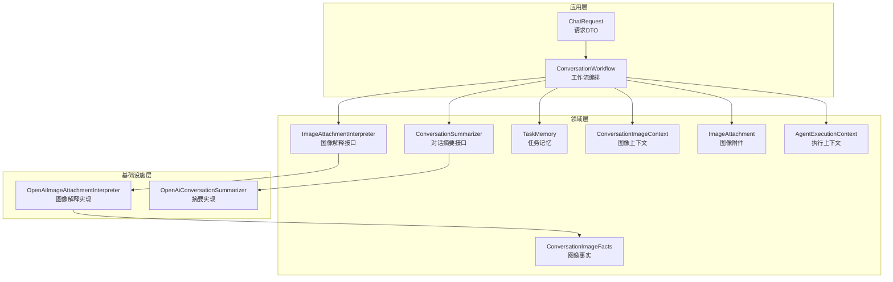
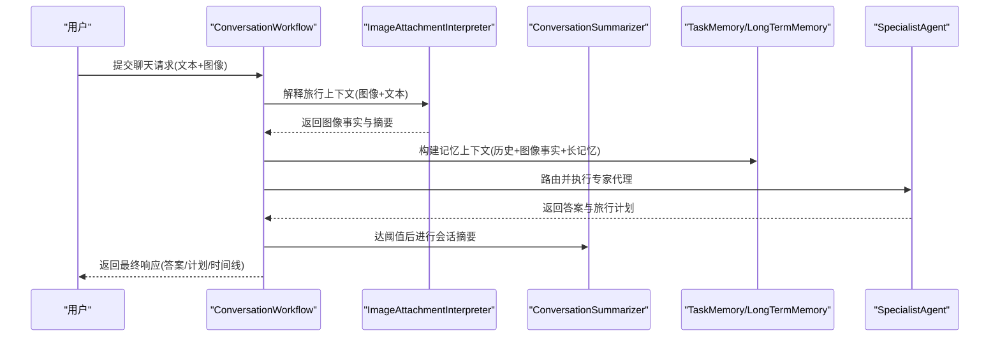
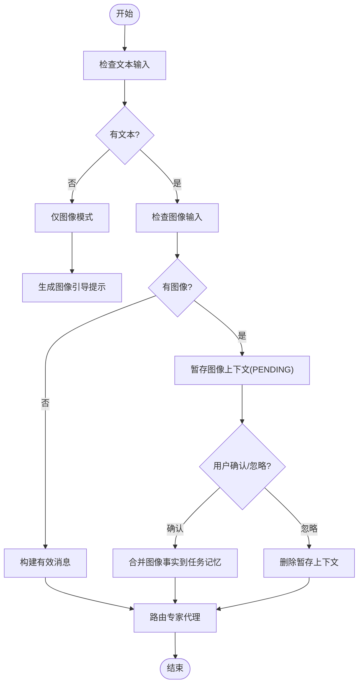
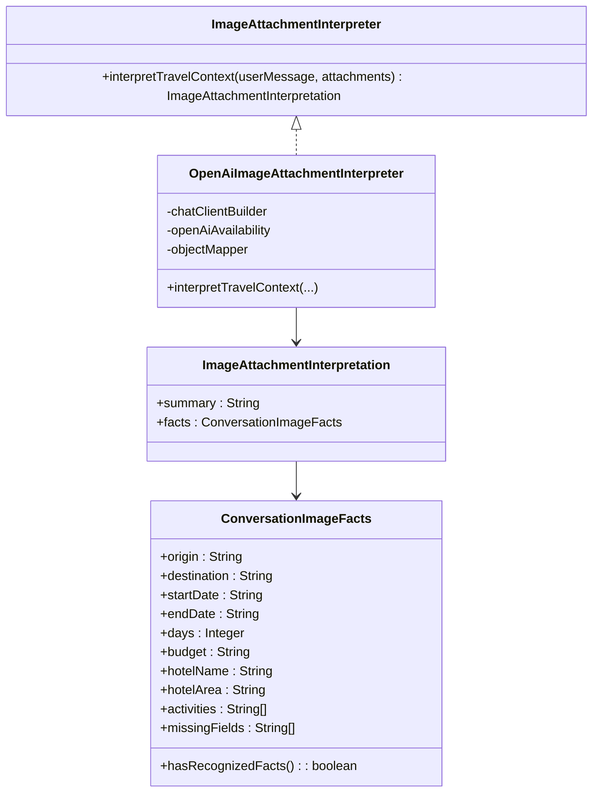
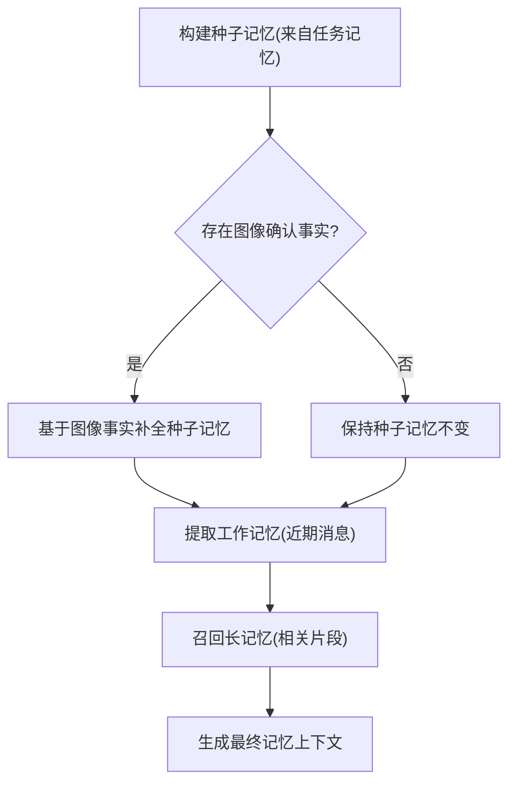
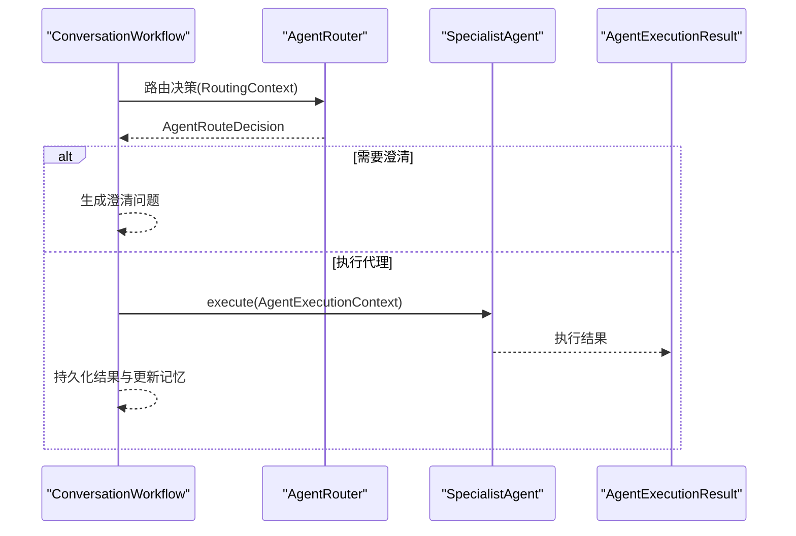
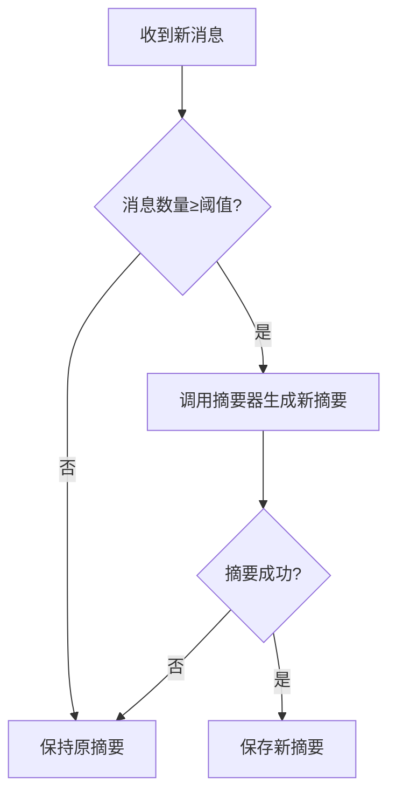
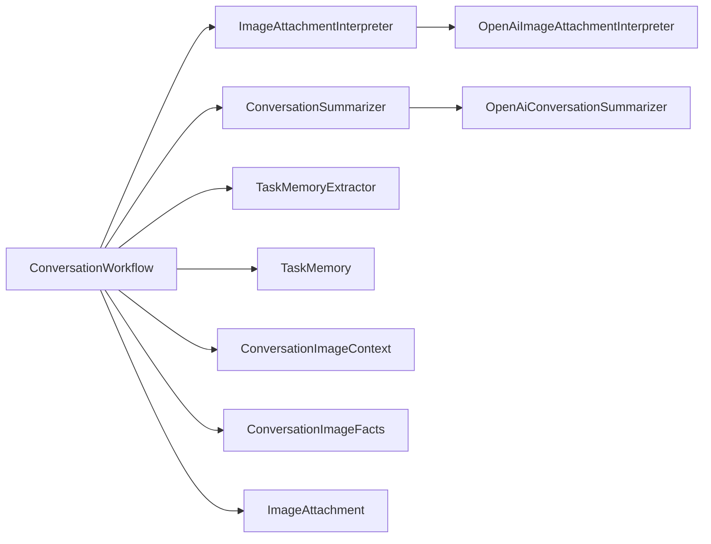

# 图像辅助规划工作流

<cite>
**本文档引用的文件**
- [ConversationWorkflow.java](file://travel-agent-app/src/main/java/com/travalagent/app/service/ConversationWorkflow.java)
- [ConversationSummarizer.java](file://travel-agent-domain/src/main/java/com/travalagent/domain/service/ConversationSummarizer.java)
- [ImageAttachmentInterpreter.java](file://travel-agent-domain/src/main/java/com/travalagent/domain/service/ImageAttachmentInterpreter.java)
- [OpenAiImageAttachmentInterpreter.java](file://travel-agent-infrastructure/src/main/java/com/travalagent/infrastructure/gateway/llm/OpenAiImageAttachmentInterpreter.java)
- [OpenAiConversationSummarizer.java](file://travel-agent-infrastructure/src/main/java/com/travalagent/infrastructure/gateway/llm/OpenAiConversationSummarizer.java)
- [ConversationImageFacts.java](file://travel-agent-domain/src/main/java/com/travalagent/domain/model/entity/ConversationImageFacts.java)
- [ConversationImageContext.java](file://travel-agent-domain/src/main/java/com/travalagent/domain/model/entity/ConversationImageContext.java)
- [ImageAttachment.java](file://travel-agent-domain/src/main/java/com/travalagent/domain/model/valobj/ImageAttachment.java)
- [ImageAttachmentInterpretation.java](file://travel-agent-domain/src/main/java/com/travalagent/domain/model/valobj/ImageAttachmentInterpretation.java)
- [AgentExecutionContext.java](file://travel-agent-domain/src/main/java/com/travalagent/domain/model/valobj/AgentExecutionContext.java)
- [AgentExecutionResult.java](file://travel-agent-domain/src/main/java/com/travalagent/domain/model/valobj/AgentExecutionResult.java)
- [ChatRequest.java](file://travel-agent-app/src/main/java/com/travalagent/app/dto/ChatRequest.java)
- [ExecutionStage.java](file://travel-agent-domain/src/main/java/com/travalagent/domain/model/valobj/ExecutionStage.java)
- [TaskMemory.java](file://travel-agent-domain/src/main/java/com/travalagent/domain/model/entity/TaskMemory.java)
- [TaskMemoryExtractor.java](file://travel-agent-domain/src/main/java/com/travalagent/domain/service/TaskMemoryExtractor.java)
</cite>

## 目录
1. [简介](#简介)
2. [项目结构](#项目结构)
3. [核心组件](#核心组件)
4. [架构总览](#架构总览)
5. [详细组件分析](#详细组件分析)
6. [依赖关系分析](#依赖关系分析)
7. [性能考虑](#性能考虑)
8. [故障排除指南](#故障排除指南)
9. [结论](#结论)

## 简介
本文件面向“图像辅助规划工作流”的完整技术文档，聚焦于从图像上传到旅行计划生成的端到端流程。文档详细说明了用户交互、图像处理、事实提取与计划生成各阶段的协调机制；深入解析 ConversationWorkflow 中的多模态处理逻辑（图像输入的处理优先级与文本/图像融合策略）；阐述 ConversationSummarizer 在多模态场景下的总结机制；并提供针对图像处理失败、事实提取不完整等异常情况的错误处理与回退策略，以及性能监控与优化建议。

## 项目结构
该系统采用分层架构：应用层负责请求编排与状态持久化；领域层定义模型与服务接口；基础设施层提供具体实现（如多模态解释器、对话摘要器）。图像辅助规划的关键路径由应用层的 ConversationWorkflow 驱动，贯穿领域层的任务记忆与上下文管理，并通过基础设施层的多模态能力完成事实抽取与总结。

图表来源
- [ConversationWorkflow.java:106-160](file://travel-agent-app/src/main/java/com/travalagent/app/service/ConversationWorkflow.java#L106-L160)
- [OpenAiImageAttachmentInterpreter.java:31-84](file://travel-agent-infrastructure/src/main/java/com/travalagent/infrastructure/gateway/llm/OpenAiImageAttachmentInterpreter.java#L31-L84)
- [OpenAiConversationSummarizer.java:21-52](file://travel-agent-infrastructure/src/main/java/com/travalagent/infrastructure/gateway/llm/OpenAiConversationSummarizer.java#L21-L52)
- [ConversationImageFacts.java:5-38](file://travel-agent-domain/src/main/java/com/travalagent/domain/model/entity/ConversationImageFacts.java#L5-L38)
- [ConversationImageContext.java:6-18](file://travel-agent-domain/src/main/java/com/travalagent/domain/model/entity/ConversationImageContext.java#L6-L18)
- [ImageAttachment.java:8-32](file://travel-agent-domain/src/main/java/com/travalagent/domain/model/valobj/ImageAttachment.java#L8-L32)
- [AgentExecutionContext.java:8-37](file://travel-agent-domain/src/main/java/com/travalagent/domain/model/valobj/AgentExecutionContext.java#L8-L37)

章节来源
- [ConversationWorkflow.java:106-160](file://travel-agent-app/src/main/java/com/travalagent/app/service/ConversationWorkflow.java#L106-L160)

## 核心组件
- 工作流编排器：负责接收用户输入（文本+图像），进行图像事实提取与确认、构建记忆上下文、路由专家代理、执行与总结、持久化最终结果。
- 图像解释器：将用户上传的图像转换为结构化的旅行事实（出发地、目的地、日期、预算、酒店、活动等）。
- 对话摘要器：在消息达到一定阈值时，对会话进行摘要更新，以降低后续推理成本。
- 任务记忆与上下文：整合历史消息、长短期记忆、图像确认的事实，形成统一的工作记忆。
- 执行上下文：向专家代理传递完整的上下文（含图像附件与图像摘要）。

章节来源
- [ConversationWorkflow.java:74-104](file://travel-agent-app/src/main/java/com/travalagent/app/service/ConversationWorkflow.java#L74-L104)
- [ImageAttachmentInterpreter.java:8-11](file://travel-agent-domain/src/main/java/com/travalagent/domain/service/ImageAttachmentInterpreter.java#L8-L11)
- [ConversationSummarizer.java:7-10](file://travel-agent-domain/src/main/java/com/travalagent/domain/service/ConversationSummarizer.java#L7-L10)
- [TaskMemory.java:9-64](file://travel-agent-domain/src/main/java/com/travalagent/domain/model/entity/TaskMemory.java#L9-L64)

## 架构总览
下图展示了从用户提交到最终生成旅行计划的完整流程，包括图像上传、事实提取、记忆融合、代理路由与执行、摘要与持久化。

图表来源
- [ConversationWorkflow.java:106-160](file://travel-agent-app/src/main/java/com/travalagent/app/service/ConversationWorkflow.java#L106-L160)
- [OpenAiImageAttachmentInterpreter.java:31-84](file://travel-agent-infrastructure/src/main/java/com/travalagent/infrastructure/gateway/llm/OpenAiImageAttachmentInterpreter.java#L31-L84)
- [OpenAiConversationSummarizer.java:21-52](file://travel-agent-infrastructure/src/main/java/com/travalagent/infrastructure/gateway/llm/OpenAiConversationSummarizer.java#L21-L52)

## 详细组件分析

### 多模态输入处理与优先级
- 输入规范化：支持纯文本或图像上传，二者至少其一。若仅上传图像，将自动生成提示语作为有效消息。
- 图像附件校验：限制数量（最多4张）、类型（PNG/JPEG/WEBP/GIF）、大小（每张≤5MB），并要求数据URL格式与媒体类型一致。
- 图像上下文状态机：支持“待确认”“已确认”“已忽略”三种状态，用于控制是否将图像事实合并入任务记忆与最终消息。

图表来源
- [ConversationWorkflow.java:106-160](file://travel-agent-app/src/main/java/com/travalagent/app/service/ConversationWorkflow.java#L106-L160)
- [ConversationWorkflow.java:162-224](file://travel-agent-app/src/main/java/com/travalagent/app/service/ConversationWorkflow.java#L162-L224)
- [ConversationWorkflow.java:226-272](file://travel-agent-app/src/main/java/com/travalagent/app/service/ConversationWorkflow.java#L226-L272)
- [ConversationWorkflow.java:534-575](file://travel-agent-app/src/main/java/com/travalagent/app/service/ConversationWorkflow.java#L534-L575)

章节来源
- [ConversationWorkflow.java:106-160](file://travel-agent-app/src/main/java/com/travalagent/app/service/ConversationWorkflow.java#L106-L160)
- [ConversationWorkflow.java:162-224](file://travel-agent-app/src/main/java/com/travalagent/app/service/ConversationWorkflow.java#L162-L224)
- [ConversationWorkflow.java:226-272](file://travel-agent-app/src/main/java/com/travalagent/app/service/ConversationWorkflow.java#L226-L272)
- [ChatRequest.java:7-17](file://travel-agent-app/src/main/java/com/travalagent/app/dto/ChatRequest.java#L7-L17)

### 图像解释器与事实抽取
- 结构化输出：返回摘要与结构化事实（出发地、目的地、日期、天数、预算、酒店、区域、活动列表、缺失字段）。
- 回退策略：当不可用或解析失败时，返回空事实并标记所有字段为缺失，同时给出默认摘要。
- 安全清洗：对抽取的文本进行清洗，避免脏数据进入后续流程。

图表来源
- [ImageAttachmentInterpreter.java:8-11](file://travel-agent-domain/src/main/java/com/travalagent/domain/service/ImageAttachmentInterpreter.java#L8-L11)
- [OpenAiImageAttachmentInterpreter.java:31-84](file://travel-agent-infrastructure/src/main/java/com/travalagent/infrastructure/gateway/llm/OpenAiImageAttachmentInterpreter.java#L31-L84)
- [ImageAttachmentInterpretation.java:5-9](file://travel-agent-domain/src/main/java/com/travalagent/domain/model/valobj/ImageAttachmentInterpretation.java#L5-L9)
- [ConversationImageFacts.java:5-38](file://travel-agent-domain/src/main/java/com/travalagent/domain/model/entity/ConversationImageFacts.java#L5-L38)

章节来源
- [OpenAiImageAttachmentInterpreter.java:31-84](file://travel-agent-infrastructure/src/main/java/com/travalagent/infrastructure/gateway/llm/OpenAiImageAttachmentInterpreter.java#L31-L84)
- [OpenAiImageAttachmentInterpreter.java:86-103](file://travel-agent-infrastructure/src/main/java/com/travalagent/infrastructure/gateway/llm/OpenAiImageAttachmentInterpreter.java#L86-L103)
- [OpenAiImageAttachmentInterpreter.java:105-128](file://travel-agent-infrastructure/src/main/java/com/travalagent/infrastructure/gateway/llm/OpenAiImageAttachmentInterpreter.java#L105-L128)
- [OpenAiImageAttachmentInterpreter.java:130-147](file://travel-agent-infrastructure/src/main/java/com/travalagent/infrastructure/gateway/llm/OpenAiImageAttachmentInterpreter.java#L130-L147)

### 记忆融合与多模态上下文
- 任务记忆合并：将图像确认的事实与现有任务记忆合并，优先使用图像中明确可见的信息，其余保持不变。
- 近期消息增强：在最终消息中附加“已确认的图像事实”与“上传图片名”，便于专家代理与工具调用时参考。
- 长短期记忆：结合近期窗口与长记忆，提升规划的上下文完整性。

图表来源
- [ConversationWorkflow.java:331-346](file://travel-agent-app/src/main/java/com/travalagent/app/service/ConversationWorkflow.java#L331-L346)
- [ConversationWorkflow.java:656-677](file://travel-agent-app/src/main/java/com/travalagent/app/service/ConversationWorkflow.java#L656-L677)
- [ConversationWorkflow.java:711-756](file://travel-agent-app/src/main/java/com/travalagent/app/service/ConversationWorkflow.java#L711-L756)

章节来源
- [ConversationWorkflow.java:331-346](file://travel-agent-app/src/main/java/com/travalagent/app/service/ConversationWorkflow.java#L331-L346)
- [ConversationWorkflow.java:656-677](file://travel-agent-app/src/main/java/com/travalagent/app/service/ConversationWorkflow.java#L656-L677)
- [TaskMemory.java:29-44](file://travel-agent-domain/src/main/java/com/travalagent/domain/model/entity/TaskMemory.java#L29-L44)

### 专家代理执行与计划生成
- 路由决策：根据用户意图、近期消息、工作记忆与长记忆选择最优专家代理；若需要澄清则返回澄清问题。
- 执行上下文：向代理传递对话ID、用户消息、近期消息、工作记忆、会话摘要、长记忆、路由原因、图像附件与图像摘要。
- 执行结果：代理返回答案与可选的旅行计划，工作流将其持久化并更新任务记忆。

图表来源
- [ConversationWorkflow.java:348-406](file://travel-agent-app/src/main/java/com/travalagent/app/service/ConversationWorkflow.java#L348-L406)
- [AgentExecutionContext.java:8-37](file://travel-agent-domain/src/main/java/com/travalagent/domain/model/valobj/AgentExecutionContext.java#L8-L37)
- [AgentExecutionResult.java:7-14](file://travel-agent-domain/src/main/java/com/travalagent/domain/model/valobj/AgentExecutionResult.java#L7-L14)

章节来源
- [ConversationWorkflow.java:348-406](file://travel-agent-app/src/main/java/com/travalagent/app/service/ConversationWorkflow.java#L348-L406)
- [AgentExecutionContext.java:8-37](file://travel-agent-domain/src/main/java/com/travalagent/domain/model/valobj/AgentExecutionContext.java#L8-L37)
- [AgentExecutionResult.java:7-14](file://travel-agent-domain/src/main/java/com/travalagent/domain/model/valobj/AgentExecutionResult.java#L7-L14)

### 对话摘要与多模态总结
- 触发条件：当消息数量超过阈值且可用时，对会话进行摘要更新，保留目的地、预算、天数、偏好、未完成问题与最新决策。
- 多模态融合：摘要内容包含图像确认的事实摘要，确保后续规划与工具调用能复用这些结构化信息。

图表来源
- [OpenAiConversationSummarizer.java:21-52](file://travel-agent-infrastructure/src/main/java/com/travalagent/infrastructure/gateway/llm/OpenAiConversationSummarizer.java#L21-L52)
- [ConversationWorkflow.java:447-449](file://travel-agent-app/src/main/java/com/travalagent/app/service/ConversationWorkflow.java#L447-L449)

章节来源
- [OpenAiConversationSummarizer.java:21-52](file://travel-agent-infrastructure/src/main/java/com/travalagent/infrastructure/gateway/llm/OpenAiConversationSummarizer.java#L21-L52)
- [ConversationWorkflow.java:447-449](file://travel-agent-app/src/main/java/com/travalagent/app/service/ConversationWorkflow.java#L447-L449)

## 依赖关系分析
- 组件耦合：工作流编排器依赖领域接口（解释器、摘要器、任务记忆提取器），并通过专家代理实现具体功能；基础设施层提供具体实现。
- 外部依赖：多模态解释与摘要依赖外部大模型服务可用性；当不可用时，系统自动回退至安全策略。
- 可能的循环依赖：当前设计通过接口解耦，未见直接循环依赖。

图表来源
- [ConversationWorkflow.java:74-104](file://travel-agent-app/src/main/java/com/travalagent/app/service/ConversationWorkflow.java#L74-L104)
- [OpenAiImageAttachmentInterpreter.java:14-29](file://travel-agent-infrastructure/src/main/java/com/travalagent/infrastructure/gateway/llm/OpenAiImageAttachmentInterpreter.java#L14-L29)
- [OpenAiConversationSummarizer.java:10-19](file://travel-agent-infrastructure/src/main/java/com/travalagent/infrastructure/gateway/llm/OpenAiConversationSummarizer.java#L10-L19)

章节来源
- [ConversationWorkflow.java:74-104](file://travel-agent-app/src/main/java/com/travalagent/app/service/ConversationWorkflow.java#L74-L104)

## 性能考虑
- 图像处理成本：单次图像解释涉及多模态调用与JSON解析，建议限制并发与批量大小；对无效或重复图像进行去重。
- 记忆窗口与摘要：合理设置记忆窗口与摘要阈值，避免过长的历史消息导致上下文膨胀；在摘要失败时快速回退。
- 代理执行：对专家代理的调用进行超时与重试控制；对计划验证与修复阶段进行资源配额限制。
- 缓存与预热：对常用查询与事实抽取进行缓存；在低峰期预热模型服务，减少首帧延迟。
- 监控指标：跟踪每个 ExecutionStage 的耗时、成功率与错误码分布，识别瓶颈环节。

## 故障排除指南
- 图像上传失败
  - 现象：抛出请求非法异常（如媒体类型不匹配、Base64无效、超出大小限制）。
  - 处理：前端校验文件类型与大小；后端严格拒绝不符合规范的附件；记录详细错误信息以便定位。
- 图像解释失败
  - 现象：解释器回退为“无法提取清晰事实”，缺失字段标记为全部缺失。
  - 处理：提示用户重新上传清晰照片；或引导用户提供文本补充（目的地、天数、预算）。
- 会话摘要失败
  - 现象：摘要器返回原摘要，系统继续使用旧摘要。
  - 处理：检查模型服务可用性与网络连通性；必要时降级为简要摘要规则。
- 专家代理执行异常
  - 现象：代理执行抛出异常或返回空计划。
  - 处理：记录路由原因与上下文；回退到通用代理或提示澄清问题；对计划进行验证与修复。
- 图像上下文确认冲突
  - 现象：用户先暂存图像上下文，但未确认即继续对话。
  - 处理：工作流按“已忽略”处理，不再合并图像事实；可在UI上提示用户先确认或忽略。

章节来源
- [ConversationWorkflow.java:534-575](file://travel-agent-app/src/main/java/com/travalagent/app/service/ConversationWorkflow.java#L534-L575)
- [OpenAiImageAttachmentInterpreter.java:81-83](file://travel-agent-infrastructure/src/main/java/com/travalagent/infrastructure/gateway/llm/OpenAiImageAttachmentInterpreter.java#L81-L83)
- [OpenAiConversationSummarizer.java:49-51](file://travel-agent-infrastructure/src/main/java/com/travalagent/infrastructure/gateway/llm/OpenAiConversationSummarizer.java#L49-L51)
- [ConversationWorkflow.java:226-272](file://travel-agent-app/src/main/java/com/travalagent/app/service/ConversationWorkflow.java#L226-L272)

## 结论
该图像辅助规划工作流通过严格的输入校验、图像事实抽取与多模态记忆融合，实现了从图像到旅行计划的闭环。系统在可用性不足时具备稳健的回退策略，并通过摘要与阶段化监控保障性能与稳定性。未来可在图像质量评估、事实一致性校验与计划自动化修复方面进一步增强，以提升用户体验与规划质量。