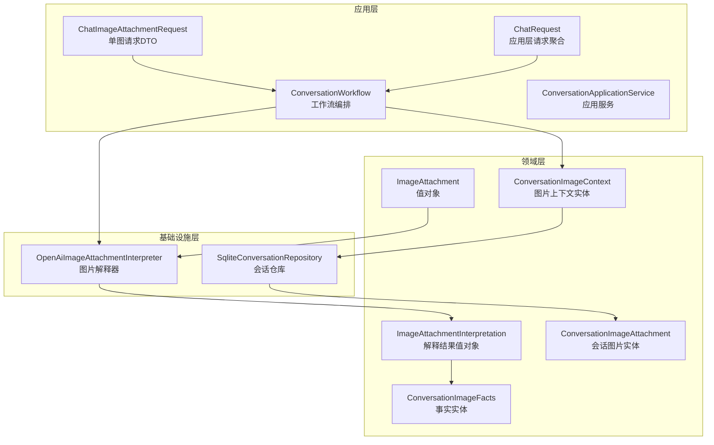
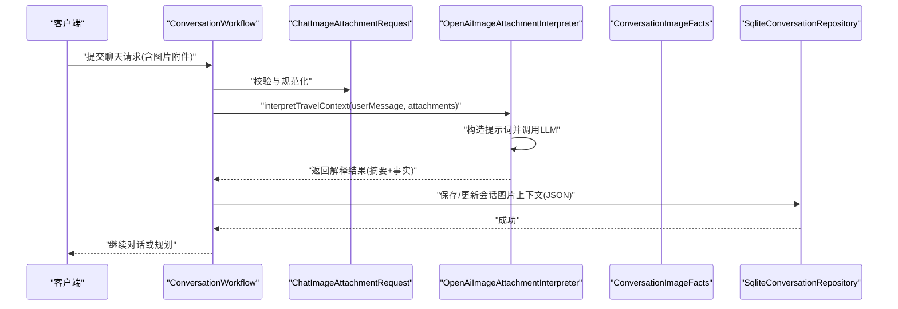
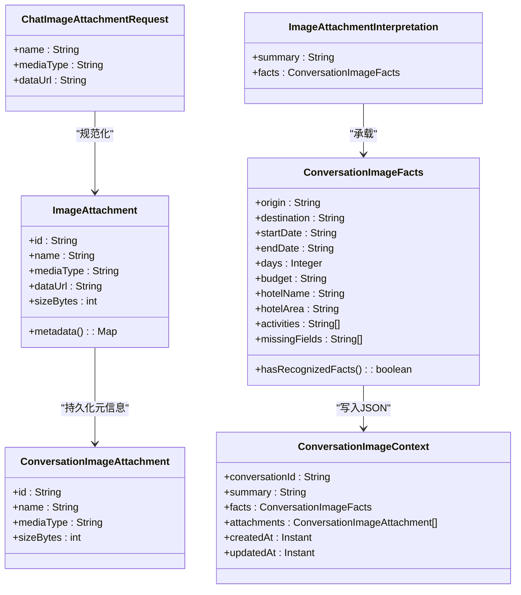
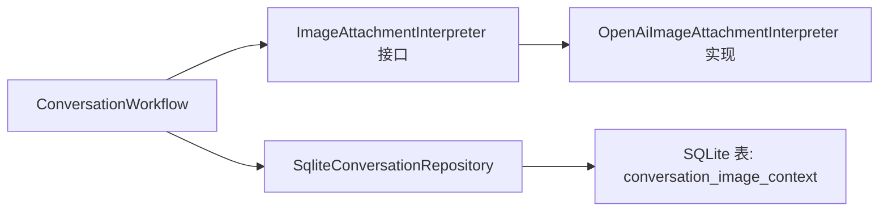

# 多模态数据模型

<cite>
**本文引用的文件**
- [ChatImageAttachmentRequest.java](file://travel-agent-app/src/main/java/com/travalagent/app/dto/ChatImageAttachmentRequest.java)
- [ChatRequest.java](file://travel-agent-app/src/main/java/com/travalagent/app/dto/ChatRequest.java)
- [ConversationWorkflow.java](file://travel-agent-app/src/main/java/com/travalagent/app/service/ConversationWorkflow.java)
- [ConversationApplicationService.java](file://travel-agent-app/src/main/java/com/travalagent/app/service/ConversationApplicationService.java)
- [schema.sql](file://travel-agent-app/src/main/resources/schema.sql)
- [ImageAttachment.java](file://travel-agent-domain/src/main/java/com/travalagent/domain/model/valobj/ImageAttachment.java)
- [ConversationImageAttachment.java](file://travel-agent-domain/src/main/java/com/travalagent/domain/model/entity/ConversationImageAttachment.java)
- [ConversationImageContext.java](file://travel-agent-domain/src/main/java/com/travalagent/domain/model/entity/ConversationImageContext.java)
- [ConversationImageFacts.java](file://travel-agent-domain/src/main/java/com/travalagent/domain/model/entity/ConversationImageFacts.java)
- [ImageAttachmentInterpretation.java](file://travel-agent-domain/src/main/java/com/travalagent/domain/model/valobj/ImageAttachmentInterpretation.java)
- [ImageAttachmentInterpreter.java](file://travel-agent-domain/src/main/java/com/travalagent/domain/service/ImageAttachmentInterpreter.java)
- [OpenAiImageAttachmentInterpreter.java](file://travel-agent-infrastructure/src/main/java/com/travalagent/infrastructure/gateway/llm/OpenAiImageAttachmentInterpreter.java)
- [SqliteConversationRepository.java](file://travel-agent-infrastructure/src/main/java/com/travalagent/infrastructure/repository/SqliteConversationRepository.java)
</cite>

## 目录
1. [简介](#简介)
2. [项目结构](#项目结构)
3. [核心组件](#核心组件)
4. [架构总览](#架构总览)
5. [详细组件分析](#详细组件分析)
6. [依赖分析](#依赖分析)
7. [性能考量](#性能考量)
8. [故障排查指南](#故障排查指南)
9. [结论](#结论)
10. [附录](#附录)

## 简介
本文件系统性梳理旅行对话场景中的多模态数据模型，围绕以下目标展开：
- 深入解析 ChatImageAttachmentRequest 的请求参数定义、验证规则与序列化格式
- 详解 ConversationImageAttachment 的持久化模型：数据库字段映射、索引设计与查询优化
- 阐述 ImageAttachmentInterpretation 的解释结果模型：结构化输出、摘要生成与元数据管理
- 提供数据模型之间的转换映射关系：DTO 到实体的映射、字段映射规则与数据一致性保障
- 讨论版本演进与向后兼容性策略

## 项目结构
多模态数据模型横跨应用层 DTO、领域层值对象与实体、基础设施层解释器与存储实现。关键模块如下：
- 应用层：接收用户上传图片的请求 DTO，进行输入校验与规范化，并驱动工作流
- 领域层：定义图片附件、解释结果、事实抽取等不可变值对象与实体
- 基础设施层：负责与 LLM 对话网关交互进行图片事实抽取，以及将上下文持久化到 SQLite

图表来源
- [ChatRequest.java:7-16](file://travel-agent-app/src/main/java/com/travalagent/app/dto/ChatRequest.java#L7-L16)
- [ChatImageAttachmentRequest.java:5-9](file://travel-agent-app/src/main/java/com/travalagent/app/dto/ChatImageAttachmentRequest.java#L5-L9)
- [ConversationWorkflow.java:534-575](file://travel-agent-app/src/main/java/com/travalagent/app/service/ConversationWorkflow.java#L534-L575)
- [ImageAttachment.java:8-32](file://travel-agent-domain/src/main/java/com/travalagent/domain/model/valobj/ImageAttachment.java#L8-L32)
- [ImageAttachmentInterpretation.java:5-8](file://travel-agent-domain/src/main/java/com/travalagent/domain/model/valobj/ImageAttachmentInterpretation.java#L5-L8)
- [ConversationImageFacts.java:5-37](file://travel-agent-domain/src/main/java/com/travalagent/domain/model/entity/ConversationImageFacts.java#L5-L37)
- [ConversationImageAttachment.java:3-8](file://travel-agent-domain/src/main/java/com/travalagent/domain/model/entity/ConversationImageAttachment.java#L3-L8)
- [ConversationImageContext.java:6-17](file://travel-agent-domain/src/main/java/com/travalagent/domain/model/entity/ConversationImageContext.java#L6-L17)
- [OpenAiImageAttachmentInterpreter.java:31-84](file://travel-agent-infrastructure/src/main/java/com/travalagent/infrastructure/gateway/llm/OpenAiImageAttachmentInterpreter.java#L31-L84)
- [SqliteConversationRepository.java:248-277](file://travel-agent-infrastructure/src/main/java/com/travalagent/infrastructure/repository/SqliteConversationRepository.java#L248-L277)

章节来源
- [ChatRequest.java:7-16](file://travel-agent-app/src/main/java/com/travalagent/app/dto/ChatRequest.java#L7-L16)
- [ChatImageAttachmentRequest.java:5-9](file://travel-agent-app/src/main/java/com/travalagent/app/dto/ChatImageAttachmentRequest.java#L5-L9)
- [ConversationWorkflow.java:534-575](file://travel-agent-app/src/main/java/com/travalagent/app/service/ConversationWorkflow.java#L534-L575)
- [schema.sql:80-87](file://travel-agent-app/src/main/resources/schema.sql#L80-L87)

## 核心组件
本节聚焦三类核心模型及其职责边界：
- 请求层 DTO：ChatImageAttachmentRequest 定义图片上传的最小必要字段与约束
- 领域值对象与实体：ImageAttachment（值对象）、ImageAttachmentInterpretation（值对象）、ConversationImageFacts（实体）、ConversationImageAttachment（实体）、ConversationImageContext（实体）
- 解释器与存储：OpenAiImageAttachmentInterpreter 负责从图片中抽取结构化旅行事实；SqliteConversationRepository 负责将解释结果与图片附件持久化为 JSON 字段

章节来源
- [ChatImageAttachmentRequest.java:5-9](file://travel-agent-app/src/main/java/com/travalagent/app/dto/ChatImageAttachmentRequest.java#L5-L9)
- [ImageAttachment.java:8-32](file://travel-agent-domain/src/main/java/com/travalagent/domain/model/valobj/ImageAttachment.java#L8-L32)
- [ImageAttachmentInterpretation.java:5-8](file://travel-agent-domain/src/main/java/com/travalagent/domain/model/valobj/ImageAttachmentInterpretation.java#L5-L8)
- [ConversationImageFacts.java:5-37](file://travel-agent-domain/src/main/java/com/travalagent/domain/model/entity/ConversationImageFacts.java#L5-L37)
- [ConversationImageAttachment.java:3-8](file://travel-agent-domain/src/main/java/com/travalagent/domain/model/entity/ConversationImageAttachment.java#L3-L8)
- [ConversationImageContext.java:6-17](file://travel-agent-domain/src/main/java/com/travalagent/domain/model/entity/ConversationImageContext.java#L6-L17)
- [OpenAiImageAttachmentInterpreter.java:31-84](file://travel-agent-infrastructure/src/main/java/com/travalagent/infrastructure/gateway/llm/OpenAiImageAttachmentInterpreter.java#L31-L84)
- [SqliteConversationRepository.java:248-277](file://travel-agent-infrastructure/src/main/java/com/travalagent/infrastructure/repository/SqliteConversationRepository.java#L248-L277)

## 架构总览
下图展示从请求到解释再到持久化的端到端流程。

图表来源
- [ConversationWorkflow.java:534-575](file://travel-agent-app/src/main/java/com/travalagent/app/service/ConversationWorkflow.java#L534-L575)
- [OpenAiImageAttachmentInterpreter.java:31-84](file://travel-agent-infrastructure/src/main/java/com/travalagent/infrastructure/gateway/llm/OpenAiImageAttachmentInterpreter.java#L31-L84)
- [SqliteConversationRepository.java:259-277](file://travel-agent-infrastructure/src/main/java/com/travalagent/infrastructure/repository/SqliteConversationRepository.java#L259-L277)

## 详细组件分析

### ChatImageAttachmentRequest：请求参数定义、验证规则与序列化格式
- 参数定义
  - name：可选字符串，用于标识图片名称
  - mediaType：必填字符串，必须非空，指示图片 MIME 类型
  - dataUrl：必填字符串，必须非空，要求为 base64 data URL 格式
- 验证规则
  - 使用注解确保 mediaType 与 dataUrl 非空
  - 在应用层工作流中进一步校验：
    - 必须是合法的 base64 data URL（包含媒体类型前缀与编码数据）
    - mediaType 与 data URL 中声明的类型需一致
    - 仅允许 PNG、JPEG、WEBP、GIF 四种类型
    - 单张图片大小不超过 5MB
    - 同次请求最多支持 4 张图片
- 序列化格式
  - 作为 ChatRequest 的子结构，通过 JSON 数组传递
  - 服务器端将其规范化为领域值对象 ImageAttachment，统一处理字段与元数据

章节来源
- [ChatImageAttachmentRequest.java:5-9](file://travel-agent-app/src/main/java/com/travalagent/app/dto/ChatImageAttachmentRequest.java#L5-L9)
- [ChatRequest.java:7-16](file://travel-agent-app/src/main/java/com/travalagent/app/dto/ChatRequest.java#L7-L16)
- [ConversationWorkflow.java:534-575](file://travel-agent-app/src/main/java/com/travalagent/app/service/ConversationWorkflow.java#L534-L575)

### ConversationImageAttachment：持久化模型（数据库字段映射、索引与查询优化）
- 数据库表：conversation_image_context
  - 字段映射
    - conversation_id：主键，关联会话
    - summary：文本摘要
    - facts_json：JSON 存储结构化事实
    - attachments_json：JSON 存储图片附件信息
    - created_at / updated_at：时间戳
  - 索引设计
    - 表级主键：conversation_id
    - 查询路径：按 conversation_id 查找/更新图片上下文
- 查询优化建议
  - 由于按会话 ID 进行读写，主键命中率高，避免额外索引
  - JSON 字段仅在需要时解析，减少不必要的反序列化开销

章节来源
- [schema.sql:80-87](file://travel-agent-app/src/main/resources/schema.sql#L80-L87)
- [SqliteConversationRepository.java:248-277](file://travel-agent-infrastructure/src/main/java/com/travalagent/infrastructure/repository/SqliteConversationRepository.java#L248-L277)

### ImageAttachmentInterpretation：解释结果模型（结构化输出、摘要生成与元数据）
- 结构组成
  - summary：自然语言摘要，汇总已识别的事实
  - facts：ConversationImageFacts 实体，承载结构化旅行事实
- 摘要生成
  - 解释器根据抽取到的事实动态拼装摘要，若无事实则给出兜底提示
- 元数据管理
  - 通过 ConversationWorkflow 将解释结果与图片附件元数据合并写入消息元数据，便于后续检索与分析

章节来源
- [ImageAttachmentInterpretation.java:5-8](file://travel-agent-domain/src/main/java/com/travalagent/domain/model/valobj/ImageAttachmentInterpretation.java#L5-L8)
- [OpenAiImageAttachmentInterpreter.java:129-147](file://travel-agent-infrastructure/src/main/java/com/travalagent/infrastructure/gateway/llm/OpenAiImageAttachmentInterpreter.java#L129-L147)
- [ConversationWorkflow.java:612-639](file://travel-agent-app/src/main/java/com/travalagent/app/service/ConversationWorkflow.java#L612-L639)

### 数据模型之间的转换映射关系
- DTO 到领域值对象
  - ChatImageAttachmentRequest → ImageAttachment
    - 字段映射：name → name；mediaType → mediaType；dataUrl → dataUrl；计算 sizeBytes
    - 规范化：统一小写媒体类型、去除空白、生成唯一 ID、限制大小
- 领域值对象到实体
  - ImageAttachment → ConversationImageAttachment
    - 字段映射：id/name/mediaType/sizeBytes
    - 用途：持久化图片元信息，不存储原始数据
- 解释结果到持久化上下文
  - ImageAttachmentInterpretation → ConversationImageContext
    - 字段映射：summary → summary；facts → facts_json；attachments → attachments_json
    - 用途：缓存本次图片解释的摘要与事实，供后续确认或重放使用

图表来源
- [ChatImageAttachmentRequest.java:5-9](file://travel-agent-app/src/main/java/com/travalagent/app/dto/ChatImageAttachmentRequest.java#L5-L9)
- [ImageAttachment.java:8-32](file://travel-agent-domain/src/main/java/com/travalagent/domain/model/valobj/ImageAttachment.java#L8-L32)
- [ConversationImageAttachment.java:3-8](file://travel-agent-domain/src/main/java/com/travalagent/domain/model/entity/ConversationImageAttachment.java#L3-L8)
- [ImageAttachmentInterpretation.java:5-8](file://travel-agent-domain/src/main/java/com/travalagent/domain/model/valobj/ImageAttachmentInterpretation.java#L5-L8)
- [ConversationImageFacts.java:5-37](file://travel-agent-domain/src/main/java/com/travalagent/domain/model/entity/ConversationImageFacts.java#L5-L37)
- [ConversationImageContext.java:6-17](file://travel-agent-domain/src/main/java/com/travalagent/domain/model/entity/ConversationImageContext.java#L6-L17)

章节来源
- [ConversationWorkflow.java:534-575](file://travel-agent-app/src/main/java/com/travalagent/app/service/ConversationWorkflow.java#L534-L575)
- [SqliteConversationRepository.java:259-277](file://travel-agent-infrastructure/src/main/java/com/travalagent/infrastructure/repository/SqliteConversationRepository.java#L259-L277)

### 版本演进与向后兼容性
- 字段演进策略
  - JSON 字段（facts_json、attachments_json）采用“新增字段即扩展”的方式，旧版本读取时忽略未知字段，保证向前兼容
  - 值对象与实体的不可变特性（record）天然支持只增不改的演进模式
- 兼容性保障
  - 解释器对 LLM 输出进行严格解析与兜底处理，避免因模型输出变化导致系统异常
  - 应用层对输入进行强约束与清洗，降低历史数据迁移成本
- 建议
  - 新增 JSON 字段时，保留默认值与空集合的兼容语义
  - 对于实体字段变更，优先采用可选字段与默认值，避免破坏主键与外键约束

## 依赖分析
- 组件耦合
  - 应用层工作流依赖解释器接口，具体实现由基础设施层提供
  - 领域层值对象与实体之间通过不可变结构传递，降低耦合度
- 外部依赖
  - LLM 解释器依赖 Spring AI ChatClient 与 JSON 映射
  - 存储依赖 SQLite 与 JSON 字段能力

图表来源
- [ConversationWorkflow.java:534-575](file://travel-agent-app/src/main/java/com/travalagent/app/service/ConversationWorkflow.java#L534-L575)
- [ImageAttachmentInterpreter.java:8-11](file://travel-agent-domain/src/main/java/com/travalagent/domain/service/ImageAttachmentInterpreter.java#L8-L11)
- [OpenAiImageAttachmentInterpreter.java:31-84](file://travel-agent-infrastructure/src/main/java/com/travalagent/infrastructure/gateway/llm/OpenAiImageAttachmentInterpreter.java#L31-L84)
- [SqliteConversationRepository.java:248-277](file://travel-agent-infrastructure/src/main/java/com/travalagent/infrastructure/repository/SqliteConversationRepository.java#L248-L277)

章节来源
- [ImageAttachmentInterpreter.java:8-11](file://travel-agent-domain/src/main/java/com/travalagent/domain/service/ImageAttachmentInterpreter.java#L8-L11)
- [OpenAiImageAttachmentInterpreter.java:31-84](file://travel-agent-infrastructure/src/main/java/com/travalagent/infrastructure/gateway/llm/OpenAiImageAttachmentInterpreter.java#L31-L84)
- [SqliteConversationRepository.java:248-277](file://travel-agent-infrastructure/src/main/java/com/travalagent/infrastructure/repository/SqliteConversationRepository.java#L248-L277)

## 性能考量
- 输入校验前置：在应用层尽早拒绝非法输入，减少下游解释器与存储压力
- 批量与并发：单次请求限制图片数量与大小，避免大体积 JSON 导致序列化/反序列化开销过大
- JSON 存储：仅在需要时解析 facts_json/attachments_json，避免重复 IO
- 索引策略：当前按主键访问，无需额外索引；如未来引入多维查询，再评估添加复合索引

## 故障排查指南
- 常见错误与定位
  - 图片格式不匹配：检查 mediaType 与 data URL 声明是否一致
  - 非法 base64：确认 data URL 编码正确且未被截断
  - 超出大小限制：确认单张图片不超过 5MB
  - 超过最大附件数：确认同次请求不超过 4 张图片
- 解释失败回退
  - 当 LLM 不可用或输出为空时，解释器返回兜底摘要与全缺失字段列表
- 存储异常
  - 若 JSON 写入失败，检查对象映射配置与字段命名一致性

章节来源
- [ConversationWorkflow.java:534-575](file://travel-agent-app/src/main/java/com/travalagent/app/service/ConversationWorkflow.java#L534-L575)
- [OpenAiImageAttachmentInterpreter.java:86-103](file://travel-agent-infrastructure/src/main/java/com/travalagent/infrastructure/gateway/llm/OpenAiImageAttachmentInterpreter.java#L86-L103)
- [SqliteConversationRepository.java:259-277](file://travel-agent-infrastructure/src/main/java/com/travalagent/infrastructure/repository/SqliteConversationRepository.java#L259-L277)

## 结论
本多模态数据模型以不可变值对象与实体为核心，结合严格的输入校验与 JSON 存储策略，在保证数据一致性的同时兼顾了可演进性与可维护性。通过明确的 DTO→值对象→实体映射与解释器/存储的分层设计，系统能够在复杂旅行规划场景中稳定地提取与利用图片中的结构化事实。

## 附录
- 关键流程：图片上传 → 规范化 → LLM 解释 → 摘要与事实生成 → 上下文持久化 → 后续对话/规划
- 参考实现：OpenAI 解释器与 SQLite 仓库的具体行为可参考相应源文件