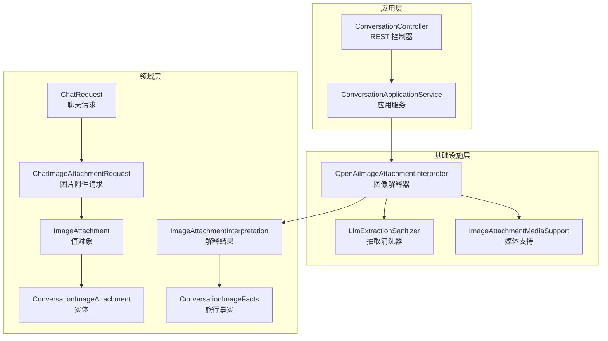
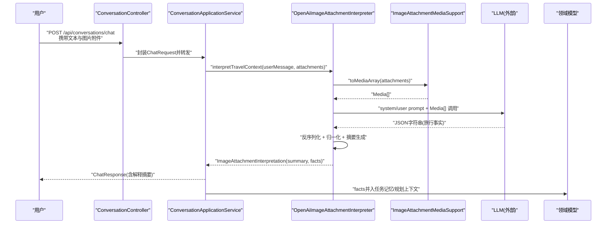
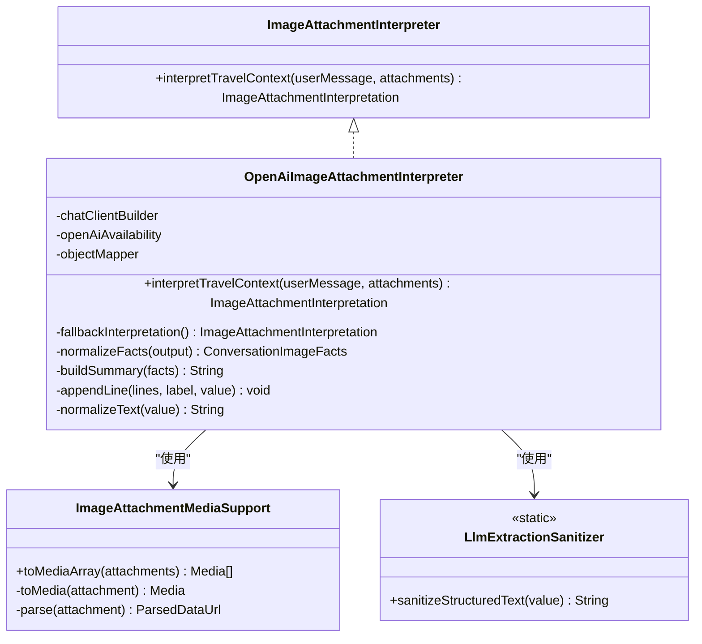
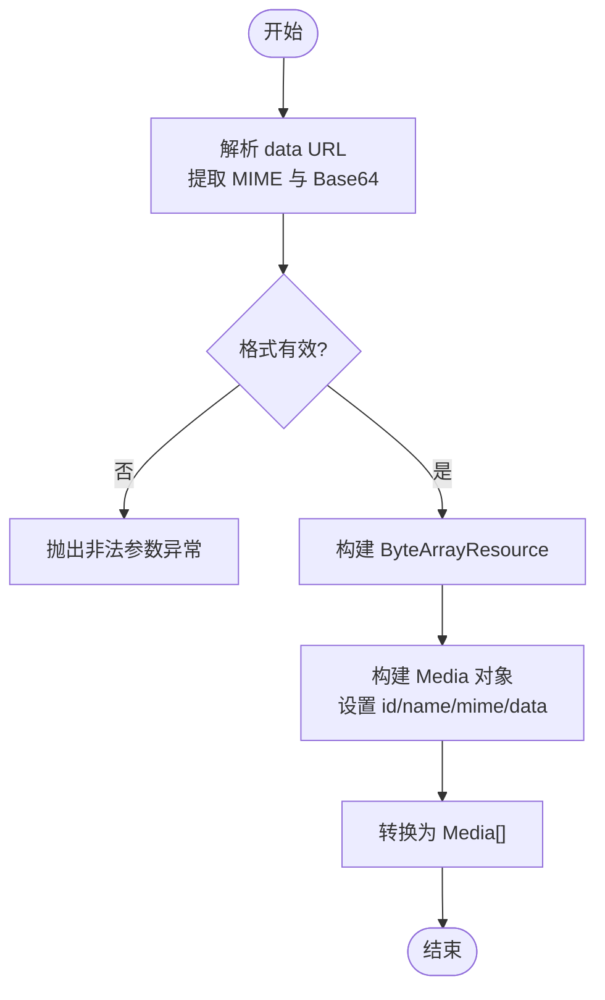
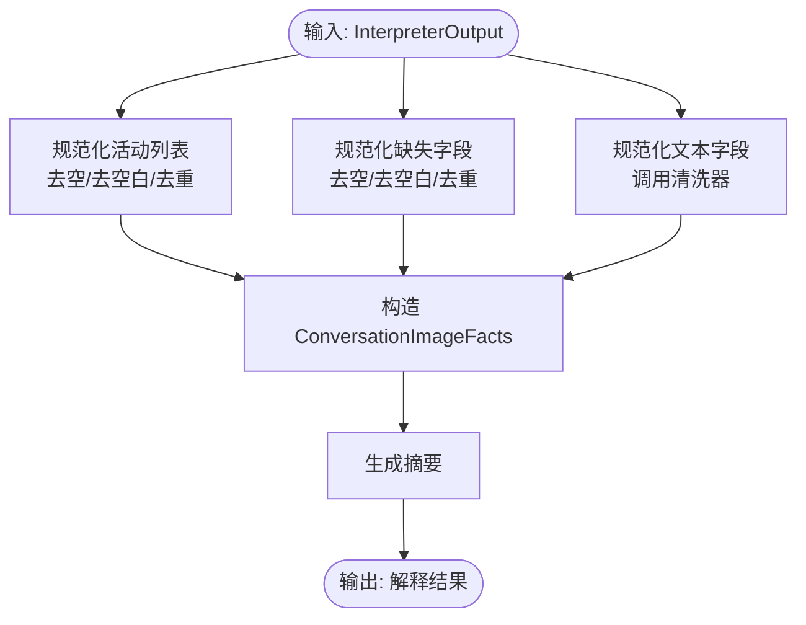
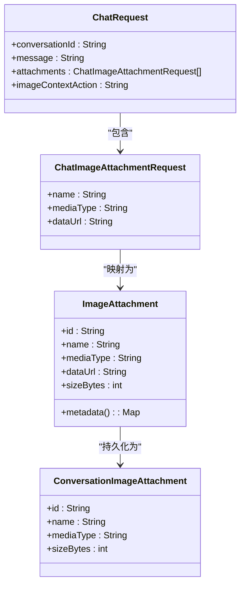
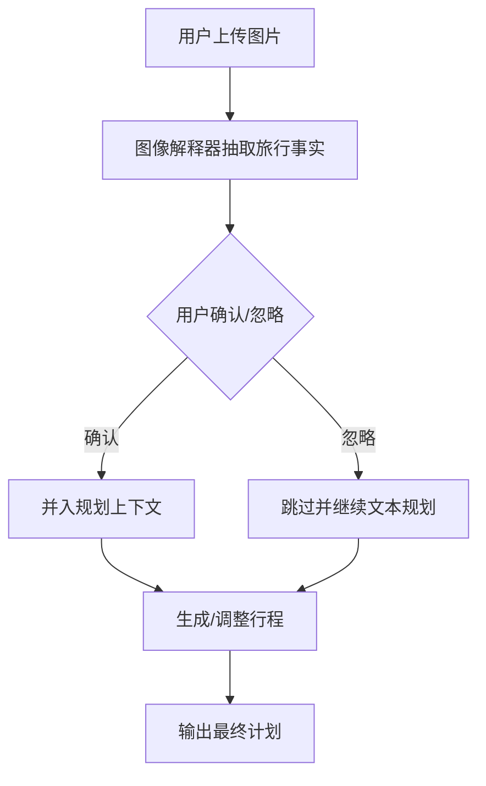
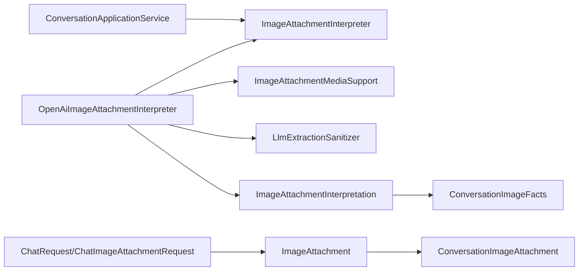

# 多模态集成

<cite>
**本文引用的文件**
- [OpenAiImageAttachmentInterpreter.java](file://travel-agent-infrastructure/src/main/java/com/travalagent/infrastructure/gateway/llm/OpenAiImageAttachmentInterpreter.java)
- [ImageAttachmentInterpreter.java](file://travel-agent-domain/src/main/java/com/travalagent/domain/service/ImageAttachmentInterpreter.java)
- [ImageAttachmentMediaSupport.java](file://travel-agent-infrastructure/src/main/java/com/travalagent/infrastructure/gateway/llm/ImageAttachmentMediaSupport.java)
- [LlmExtractionSanitizer.java](file://travel-agent-infrastructure/src/main/java/com/travalagent/infrastructure/gateway/llm/LlmExtractionSanitizer.java)
- [ChatImageAttachmentRequest.java](file://travel-agent-app/src/main/java/com/travalagent/app/dto/ChatImageAttachmentRequest.java)
- [ChatRequest.java](file://travel-agent-app/src/main/java/com/travalagent/app/dto/ChatRequest.java)
- [ConversationImageAttachment.java](file://travel-agent-domain/src/main/java/com/travalagent/domain/model/entity/ConversationImageAttachment.java)
- [ImageAttachment.java](file://travel-agent-domain/src/main/java/com/travalagent/domain/model/valobj/ImageAttachment.java)
- [ImageAttachmentInterpretation.java](file://travel-agent-domain/src/main/java/com/travalagent/domain/model/valobj/ImageAttachmentInterpretation.java)
- [ConversationImageFacts.java](file://travel-agent-domain/src/main/java/com/travalagent/domain/model/entity/ConversationImageFacts.java)
- [ConversationController.java](file://travel-agent-app/src/main/java/com/travalagent/app/controller/ConversationController.java)
- [ConversationApplicationService.java](file://travel-agent-app/src/main/java/com/travalagent/app/service/ConversationApplicationService.java)
- [multimodal-roadmap.zh-CN.md](file://docs/multimodal-roadmap.zh-CN.md)
</cite>

## 目录
1. [引言](#引言)
2. [项目结构](#项目结构)
3. [核心组件](#核心组件)
4. [架构总览](#架构总览)
5. [详细组件分析](#详细组件分析)
6. [依赖分析](#依赖分析)
7. [性能考虑](#性能考虑)
8. [故障排查指南](#故障排查指南)
9. [结论](#结论)
10. [附录](#附录)

## 引言
本文件面向TravelAgent的多模态集成，聚焦“图像附件处理”的完整流程：从用户上传图片，到图像解释（旅行事实抽取），再到结构化输出与后续规划链路的衔接。重点解析OpenAiImageAttachmentInterpreter的实现细节，包括图像预处理、提示词驱动的结构化抽取、旅行事实归一化与摘要生成，并阐述多模态输入在系统中的数据模型与控制流设计。最后给出图像辅助规划的工作流程与多模态路线图的未来方向。

## 项目结构
多模态能力横跨应用层、领域层与基础设施层：
- 应用层负责接收前端请求、编排对话工作流与返回响应。
- 领域层定义值对象与实体，描述图像附件、解释结果与旅行事实。
- 基础设施层对接大模型服务，执行图像解释与媒体格式转换。

图表来源
- [ConversationController.java:32-101](file://travel-agent-app/src/main/java/com/travalagent/app/controller/ConversationController.java#L32-L101)
- [ConversationApplicationService.java:34-54](file://travel-agent-app/src/main/java/com/travalagent/app/service/ConversationApplicationService.java#L34-L54)
- [OpenAiImageAttachmentInterpreter.java:14-84](file://travel-agent-infrastructure/src/main/java/com/travalagent/infrastructure/gateway/llm/OpenAiImageAttachmentInterpreter.java#L14-L84)
- [ImageAttachmentMediaSupport.java:15-60](file://travel-agent-infrastructure/src/main/java/com/travalagent/infrastructure/gateway/llm/ImageAttachmentMediaSupport.java#L15-L60)
- [LlmExtractionSanitizer.java:3-31](file://travel-agent-infrastructure/src/main/java/com/travalagent/infrastructure/gateway/llm/LlmExtractionSanitizer.java#L3-L31)
- [ChatRequest.java:7-17](file://travel-agent-app/src/main/java/com/travalagent/app/dto/ChatRequest.java#L7-L17)
- [ChatImageAttachmentRequest.java:5-11](file://travel-agent-app/src/main/java/com/travalagent/app/dto/ChatImageAttachmentRequest.java#L5-L11)
- [ImageAttachment.java:8-33](file://travel-agent-domain/src/main/java/com/travalagent/domain/model/valobj/ImageAttachment.java#L8-L33)
- [ConversationImageAttachment.java:3-9](file://travel-agent-domain/src/main/java/com/travalagent/domain/model/entity/ConversationImageAttachment.java#L3-L9)
- [ImageAttachmentInterpretation.java:5-9](file://travel-agent-domain/src/main/java/com/travalagent/domain/model/valobj/ImageAttachmentInterpretation.java#L5-L9)
- [ConversationImageFacts.java:5-39](file://travel-agent-domain/src/main/java/com/travalagent/domain/model/entity/ConversationImageFacts.java#L5-L39)

章节来源
- [ConversationController.java:32-101](file://travel-agent-app/src/main/java/com/travalagent/app/controller/ConversationController.java#L32-L101)
- [ConversationApplicationService.java:34-54](file://travel-agent-app/src/main/java/com/travalagent/app/service/ConversationApplicationService.java#L34-L54)
- [OpenAiImageAttachmentInterpreter.java:14-84](file://travel-agent-infrastructure/src/main/java/com/travalagent/infrastructure/gateway/llm/OpenAiImageAttachmentInterpreter.java#L14-L84)
- [ImageAttachmentMediaSupport.java:15-60](file://travel-agent-infrastructure/src/main/java/com/travalagent/infrastructure/gateway/llm/ImageAttachmentMediaSupport.java#L15-L60)
- [LlmExtractionSanitizer.java:3-31](file://travel-agent-infrastructure/src/main/java/com/travalagent/infrastructure/gateway/llm/LlmExtractionSanitizer.java#L3-L31)
- [ChatRequest.java:7-17](file://travel-agent-app/src/main/java/com/travalagent/app/dto/ChatRequest.java#L7-L17)
- [ChatImageAttachmentRequest.java:5-11](file://travel-agent-app/src/main/java/com/travalagent/app/dto/ChatImageAttachmentRequest.java#L5-L11)
- [ImageAttachment.java:8-33](file://travel-agent-domain/src/main/java/com/travalagent/domain/model/valobj/ImageAttachment.java#L8-L33)
- [ConversationImageAttachment.java:3-9](file://travel-agent-domain/src/main/java/com/travalagent/domain/model/entity/ConversationImageAttachment.java#L3-L9)
- [ImageAttachmentInterpretation.java:5-9](file://travel-agent-domain/src/main/java/com/travalagent/domain/model/valobj/ImageAttachmentInterpretation.java#L5-L9)
- [ConversationImageFacts.java:5-39](file://travel-agent-domain/src/main/java/com/travalagent/domain/model/entity/ConversationImageFacts.java#L5-L39)

## 核心组件
- 图像解释器接口：定义统一的图像旅行事实解释入口。
- OpenAI图像解释器实现：基于Spring AI ChatClient，执行结构化抽取与摘要生成。
- 媒体支持工具：将Base64 data URL解码为Spring AI Media数组，供LLM消费。
- 清洗器：对LLM输出进行规范化与无效值过滤。
- 数据模型：
  - 请求侧：ChatRequest与ChatImageAttachmentRequest承载用户消息与图片附件。
  - 领域侧：ImageAttachment（值对象）、ConversationImageAttachment（实体）、ConversationImageFacts（旅行事实）、ImageAttachmentInterpretation（解释结果）。

章节来源
- [ImageAttachmentInterpreter.java:8-11](file://travel-agent-domain/src/main/java/com/travalagent/domain/service/ImageAttachmentInterpreter.java#L8-L11)
- [OpenAiImageAttachmentInterpreter.java:14-84](file://travel-agent-infrastructure/src/main/java/com/travalagent/infrastructure/gateway/llm/OpenAiImageAttachmentInterpreter.java#L14-L84)
- [ImageAttachmentMediaSupport.java:15-60](file://travel-agent-infrastructure/src/main/java/com/travalagent/infrastructure/gateway/llm/ImageAttachmentMediaSupport.java#L15-L60)
- [LlmExtractionSanitizer.java:3-31](file://travel-agent-infrastructure/src/main/java/com/travalagent/infrastructure/gateway/llm/LlmExtractionSanitizer.java#L3-L31)
- [ChatRequest.java:7-17](file://travel-agent-app/src/main/java/com/travalagent/app/dto/ChatRequest.java#L7-L17)
- [ChatImageAttachmentRequest.java:5-11](file://travel-agent-app/src/main/java/com/travalagent/app/dto/ChatImageAttachmentRequest.java#L5-L11)
- [ImageAttachment.java:8-33](file://travel-agent-domain/src/main/java/com/travalagent/domain/model/valobj/ImageAttachment.java#L8-L33)
- [ConversationImageAttachment.java:3-9](file://travel-agent-domain/src/main/java/com/travalagent/domain/model/entity/ConversationImageAttachment.java#L3-L9)
- [ImageAttachmentInterpretation.java:5-9](file://travel-agent-domain/src/main/java/com/travalagent/domain/model/valobj/ImageAttachmentInterpretation.java#L5-L9)
- [ConversationImageFacts.java:5-39](file://travel-agent-domain/src/main/java/com/travalagent/domain/model/entity/ConversationImageFacts.java#L5-L39)

## 架构总览
多模态输入以“文本+图片附件”形式进入系统，经由应用服务编排，调用图像解释器完成结构化抽取，随后将解释结果并入规划上下文，供后续路由、记忆、校验、修复与行程生成使用。

图表来源
- [ConversationController.java:47-51](file://travel-agent-app/src/main/java/com/travalagent/app/controller/ConversationController.java#L47-L51)
- [ConversationApplicationService.java:52-54](file://travel-agent-app/src/main/java/com/travalagent/app/service/ConversationApplicationService.java#L52-L54)
- [OpenAiImageAttachmentInterpreter.java:31-84](file://travel-agent-infrastructure/src/main/java/com/travalagent/infrastructure/gateway/llm/OpenAiImageAttachmentInterpreter.java#L31-L84)
- [ImageAttachmentMediaSupport.java:22-42](file://travel-agent-infrastructure/src/main/java/com/travalagent/infrastructure/gateway/llm/ImageAttachmentMediaSupport.java#L22-L42)

## 详细组件分析

### OpenAiImageAttachmentInterpreter 实现解析
- 输入与可用性检查：当无附件或不可用时，返回兜底解释结果。
- 系统提示词：限定仅返回严格JSON，定义旅行事实字段与缺失字段集合，强调“仅包含图像可见事实”“禁止猜测”“遵循用户语言”等规则。
- 用户提示词：结合用户消息，要求从上传图像中提取旅行相关信息。
- 媒体转换：通过ImageAttachmentMediaSupport将值对象列表转换为Spring AI Media数组。
- 结果解析与归一化：反序列化为内部记录类，对活动与缺失字段去空/去重/去空白；对文本字段调用清洗器进行规范化与无效值剔除。
- 摘要生成：按字段拼接摘要，若无任何事实则返回默认提示。
- 兜底策略：异常或空内容时返回全字段缺失的解释结果。

图表来源
- [ImageAttachmentInterpreter.java:8-11](file://travel-agent-domain/src/main/java/com/travalagent/domain/service/ImageAttachmentInterpreter.java#L8-L11)
- [OpenAiImageAttachmentInterpreter.java:14-173](file://travel-agent-infrastructure/src/main/java/com/travalagent/infrastructure/gateway/llm/OpenAiImageAttachmentInterpreter.java#L14-L173)
- [ImageAttachmentMediaSupport.java:15-60](file://travel-agent-infrastructure/src/main/java/com/travalagent/infrastructure/gateway/llm/ImageAttachmentMediaSupport.java#L15-L60)
- [LlmExtractionSanitizer.java:3-31](file://travel-agent-infrastructure/src/main/java/com/travalagent/infrastructure/gateway/llm/LlmExtractionSanitizer.java#L3-L31)

章节来源
- [OpenAiImageAttachmentInterpreter.java:31-173](file://travel-agent-infrastructure/src/main/java/com/travalagent/infrastructure/gateway/llm/OpenAiImageAttachmentInterpreter.java#L31-L173)

### 图像预处理与媒体支持
- 数据URL解析：从ImageAttachment.dataUrl中解析MIME类型与Base64字节流。
- 资源构建：将字节流包装为ByteArrayResource，并设置文件名（附件名称）。
- Media数组：将多个附件转换为Spring AI Media[]，用于LLM多模态调用。

图表来源
- [ImageAttachmentMediaSupport.java:22-52](file://travel-agent-infrastructure/src/main/java/com/travalagent/infrastructure/gateway/llm/ImageAttachmentMediaSupport.java#L22-L52)

章节来源
- [ImageAttachmentMediaSupport.java:15-60](file://travel-agent-infrastructure/src/main/java/com/travalagent/infrastructure/gateway/llm/ImageAttachmentMediaSupport.java#L15-L60)

### 旅行事实抽取与结构化输出
- 字段定义：出发地、目的地、起止日期、天数、预算、酒店名称与区域、活动列表、缺失字段集合。
- 规范化策略：活动与缺失字段去空/去空白/去重；文本字段调用清洗器；空值统一为null。
- 摘要生成：按字段拼接，若无事实则返回默认提示。
- 兜底策略：当LLM无内容或异常时，返回全缺失解释结果。

图表来源
- [OpenAiImageAttachmentInterpreter.java:105-157](file://travel-agent-infrastructure/src/main/java/com/travalagent/infrastructure/gateway/llm/OpenAiImageAttachmentInterpreter.java#L105-L157)

章节来源
- [OpenAiImageAttachmentInterpreter.java:105-157](file://travel-agent-infrastructure/src/main/java/com/travalagent/infrastructure/gateway/llm/OpenAiImageAttachmentInterpreter.java#L105-L157)

### 多模态输入的数据模型与控制流
- ChatRequest：承载会话ID、用户消息、附件列表与图片上下文操作标记。
- ChatImageAttachmentRequest：单个图片附件的名称、媒体类型与data URL。
- 领域值对象与实体：ImageAttachment（值对象，含元数据）、ConversationImageAttachment（实体，持久化元数据）。
- 控制流：控制器接收请求，应用服务编排工作流，调用解释器，最终将解释摘要返回给用户，并将事实并入规划上下文。

图表来源
- [ChatRequest.java:7-17](file://travel-agent-app/src/main/java/com/travalagent/app/dto/ChatRequest.java#L7-L17)
- [ChatImageAttachmentRequest.java:5-11](file://travel-agent-app/src/main/java/com/travalagent/app/dto/ChatImageAttachmentRequest.java#L5-L11)
- [ImageAttachment.java:8-33](file://travel-agent-domain/src/main/java/com/travalagent/domain/model/valobj/ImageAttachment.java#L8-L33)
- [ConversationImageAttachment.java:3-9](file://travel-agent-domain/src/main/java/com/travalagent/domain/model/entity/ConversationImageAttachment.java#L3-L9)

章节来源
- [ChatRequest.java:7-17](file://travel-agent-app/src/main/java/com/travalagent/app/dto/ChatRequest.java#L7-L17)
- [ChatImageAttachmentRequest.java:5-11](file://travel-agent-app/src/main/java/com/travalagent/app/dto/ChatImageAttachmentRequest.java#L5-L11)
- [ImageAttachment.java:8-33](file://travel-agent-domain/src/main/java/com/travalagent/domain/model/valobj/ImageAttachment.java#L8-L33)
- [ConversationImageAttachment.java:3-9](file://travel-agent-domain/src/main/java/com/travalagent/domain/model/entity/ConversationImageAttachment.java#L3-L9)

### 图像辅助规划工作流程
- 截图分析：用户上传预订/行程/地图/海报等截图。
- 事实确认：系统提取结构化旅行事实并展示摘要，允许用户确认或忽略。
- 计划调整：将确认的事实并入任务记忆/规划上下文，触发路由、检索、校验与修复流程，生成或调整行程。

图表来源
- [OpenAiImageAttachmentInterpreter.java:31-84](file://travel-agent-infrastructure/src/main/java/com/travalagent/infrastructure/gateway/llm/OpenAiImageAttachmentInterpreter.java#L31-L84)
- [ConversationApplicationService.java:62-73](file://travel-agent-app/src/main/java/com/travalagent/app/service/ConversationApplicationService.java#L62-L73)

章节来源
- [OpenAiImageAttachmentInterpreter.java:31-84](file://travel-agent-infrastructure/src/main/java/com/travalagent/infrastructure/gateway/llm/OpenAiImageAttachmentInterpreter.java#L31-L84)
- [ConversationApplicationService.java:62-73](file://travel-agent-app/src/main/java/com/travalagent/app/service/ConversationApplicationService.java#L62-L73)

## 依赖分析
- 组件耦合与内聚：
  - OpenAiImageAttachmentInterpreter依赖ChatClient.Builder、可用性检查与ObjectMapper，职责单一且内聚。
  - ImageAttachmentMediaSupport与LlmExtractionSanitizer均为纯工具类，低耦合、高复用。
- 直接与间接依赖：
  - 应用服务通过接口ImageAttachmentInterpreter与具体实现解耦。
  - 领域模型作为稳定契约，避免上层与基础设施直接耦合。
- 外部依赖与集成点：
  - 大模型服务通过Spring AI ChatClient接入，媒体支持与抽取清洗器作为中间层。
- 接口契约与实现细节：
  - ImageAttachmentInterpreter定义统一入口，OpenAiImageAttachmentInterpreter提供具体实现，便于替换与扩展。

图表来源
- [ConversationApplicationService.java:38-50](file://travel-agent-app/src/main/java/com/travalagent/app/service/ConversationApplicationService.java#L38-L50)
- [ImageAttachmentInterpreter.java:8-11](file://travel-agent-domain/src/main/java/com/travalagent/domain/service/ImageAttachmentInterpreter.java#L8-L11)
- [OpenAiImageAttachmentInterpreter.java:14-84](file://travel-agent-infrastructure/src/main/java/com/travalagent/infrastructure/gateway/llm/OpenAiImageAttachmentInterpreter.java#L14-L84)
- [ImageAttachmentMediaSupport.java:15-60](file://travel-agent-infrastructure/src/main/java/com/travalagent/infrastructure/gateway/llm/ImageAttachmentMediaSupport.java#L15-L60)
- [LlmExtractionSanitizer.java:3-31](file://travel-agent-infrastructure/src/main/java/com/travalagent/infrastructure/gateway/llm/LlmExtractionSanitizer.java#L3-L31)
- [ChatRequest.java:7-17](file://travel-agent-app/src/main/java/com/travalagent/app/dto/ChatRequest.java#L7-L17)
- [ChatImageAttachmentRequest.java:5-11](file://travel-agent-app/src/main/java/com/travalagent/app/dto/ChatImageAttachmentRequest.java#L5-L11)
- [ImageAttachment.java:8-33](file://travel-agent-domain/src/main/java/com/travalagent/domain/model/valobj/ImageAttachment.java#L8-L33)
- [ConversationImageAttachment.java:3-9](file://travel-agent-domain/src/main/java/com/travalagent/domain/model/entity/ConversationImageAttachment.java#L3-L9)
- [ImageAttachmentInterpretation.java:5-9](file://travel-agent-domain/src/main/java/com/travalagent/domain/model/valobj/ImageAttachmentInterpretation.java#L5-L9)
- [ConversationImageFacts.java:5-39](file://travel-agent-domain/src/main/java/com/travalagent/domain/model/entity/ConversationImageFacts.java#L5-L39)

章节来源
- [ConversationApplicationService.java:38-50](file://travel-agent-app/src/main/java/com/travalagent/app/service/ConversationApplicationService.java#L38-L50)
- [ImageAttachmentInterpreter.java:8-11](file://travel-agent-domain/src/main/java/com/travalagent/domain/service/ImageAttachmentInterpreter.java#L8-L11)
- [OpenAiImageAttachmentInterpreter.java:14-84](file://travel-agent-infrastructure/src/main/java/com/travalagent/infrastructure/gateway/llm/OpenAiImageAttachmentInterpreter.java#L14-L84)
- [ImageAttachmentMediaSupport.java:15-60](file://travel-agent-infrastructure/src/main/java/com/travalagent/infrastructure/gateway/llm/ImageAttachmentMediaSupport.java#L15-L60)
- [LlmExtractionSanitizer.java:3-31](file://travel-agent-infrastructure/src/main/java/com/travalagent/infrastructure/gateway/llm/LlmExtractionSanitizer.java#L3-L31)
- [ChatRequest.java:7-17](file://travel-agent-app/src/main/java/com/travalagent/app/dto/ChatRequest.java#L7-L17)
- [ChatImageAttachmentRequest.java:5-11](file://travel-agent-app/src/main/java/com/travalagent/app/dto/ChatImageAttachmentRequest.java#L5-L11)
- [ImageAttachment.java:8-33](file://travel-agent-domain/src/main/java/com/travalagent/domain/model/valobj/ImageAttachment.java#L8-L33)
- [ConversationImageAttachment.java:3-9](file://travel-agent-domain/src/main/java/com/travalagent/domain/model/entity/ConversationImageAttachment.java#L3-L9)
- [ImageAttachmentInterpretation.java:5-9](file://travel-agent-domain/src/main/java/com/travalagent/domain/model/valobj/ImageAttachmentInterpretation.java#L5-L9)
- [ConversationImageFacts.java:5-39](file://travel-agent-domain/src/main/java/com/travalagent/domain/model/entity/ConversationImageFacts.java#L5-L39)

## 性能考虑
- 媒体转换开销：Base64解析与字节流构建为O(n)线性复杂度，建议限制单次附件数量与大小，避免超大图片导致内存压力。
- LLM调用延迟：提示词长度与媒体尺寸直接影响响应时间，建议对图片进行预缩放与格式优化。
- 反序列化与清洗：JSON解析与字符串清洗为常数级开销，整体影响较小。
- 缓存与降级：在不可用或失败时快速返回兜底结果，保证用户体验与系统稳定性。

## 故障排查指南
- 附件为空或不可用：检查OpenAiAvailability状态与输入参数，确认返回兜底解释。
- data URL格式错误：ImageAttachmentMediaSupport会抛出非法参数异常，需确保前端正确编码。
- LLM输出为空或异常：解释器捕获异常并返回兜底结果，建议查看日志与提示词配置。
- 文本清洗无效：LlmExtractionSanitizer会过滤特定提示语句，确保抽取结果可读性与一致性。

章节来源
- [OpenAiImageAttachmentInterpreter.java:31-84](file://travel-agent-infrastructure/src/main/java/com/travalagent/infrastructure/gateway/llm/OpenAiImageAttachmentInterpreter.java#L31-L84)
- [ImageAttachmentMediaSupport.java:44-52](file://travel-agent-infrastructure/src/main/java/com/travalagent/infrastructure/gateway/llm/ImageAttachmentMediaSupport.java#L44-L52)
- [LlmExtractionSanitizer.java:8-29](file://travel-agent-infrastructure/src/main/java/com/travalagent/infrastructure/gateway/llm/LlmExtractionSanitizer.java#L8-L29)

## 结论
本多模态方案以“文本+图片附件”为核心输入，通过OpenAiImageAttachmentInterpreter实现结构化旅行事实抽取，并与既有规划链路无缝衔接。系统采用清晰的分层与契约设计，具备良好的可维护性与扩展性。未来可在结构化抽取质量、输入类型丰富度与处理策略智能化方面持续演进。

## 附录
- 多模态路线图要点：
  - 当前已实现“文本+图片附件”输入与旅行事实抽取链路。
  - 建议优先强化结构化字段抽取与附件管理策略。
  - 评估图片输入对规划接受率的影响后再扩展到更广义的多模态支持。

章节来源
- [multimodal-roadmap.zh-CN.md:1-88](file://docs/multimodal-roadmap.zh-CN.md#L1-L88)