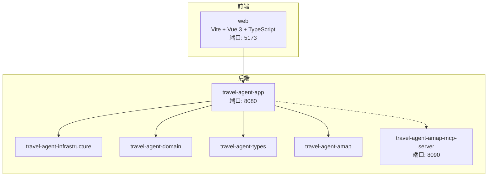
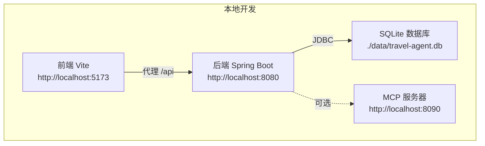
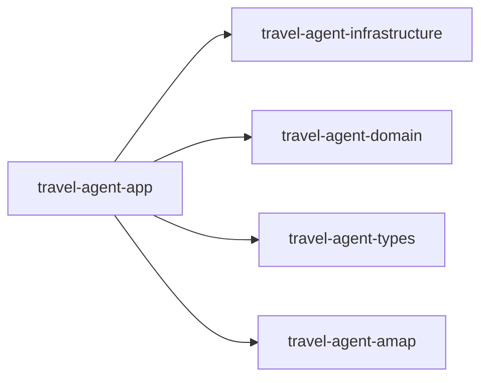

# IDE开发环境配置

<cite>
**本文档引用的文件**
- [pom.xml](file://pom.xml)
- [README.md](file://README.md)
- [CONTRIBUTING.md](file://CONTRIBUTING.md)
- [travel-agent-app/pom.xml](file://travel-agent-app/pom.xml)
- [travel-agent-app/src/main/resources/application.yml](file://travel-agent-app/src/main/resources/application.yml)
- [travel-agent-amap-mcp-server/src/main/resources/application.yml](file://travel-agent-amap-mcp-server/src/main/resources/application.yml)
- [docker-compose.app.yml](file://docker-compose.app.yml)
- [docker-compose.milvus.yml](file://docker-compose.milvus.yml)
- [Dockerfile.mcp](file://Dockerfile.mcp)
- [web/package.json](file://web/package.json)
- [web/tsconfig.json](file://web/tsconfig.json)
- [web/vite.config.ts](file://web/vite.config.ts)
- [.gitignore](file://.gitignore)
</cite>

## 目录
1. [简介](#简介)
2. [项目结构](#项目结构)
3. [核心组件](#核心组件)
4. [架构总览](#架构总览)
5. [详细组件分析](#详细组件分析)
6. [依赖关系分析](#依赖关系分析)
7. [性能考虑](#性能考虑)
8. [故障排除指南](#故障排除指南)
9. [结论](#结论)
10. [附录](#附录)

## 简介
本指南面向在主流IDE中进行TravelAgent项目开发的工程师，提供从后端（Spring Boot + Java 21）到前端（Vue 3 + TypeScript + Vite）的完整开发环境配置方法，涵盖：
- IntelliJ IDEA的Maven项目导入与JDK配置、插件推荐与调试配置
- VS Code的前端开发环境设置（TypeScript、Vue插件、ESLint与Prettier）
- 数据库工具配置（SQLite浏览器与数据库连接）
- Git集成配置（分支管理、提交规范、代码审查工具）
- 开发快捷键、重构技巧与性能优化建议

## 项目结构
TravelAgent采用多模块Maven聚合工程，包含后端应用、领域层、基础设施层、高德地图适配器、MCP服务器以及前端工作区。后端默认端口为8080，前端默认端口为5173，MCP服务器默认端口为8090。

图表来源
- [pom.xml:22-29](file://pom.xml#L22-L29)
- [travel-agent-app/src/main/resources/application.yml:1-100](file://travel-agent-app/src/main/resources/application.yml#L1-L100)
- [web/vite.config.ts:6-14](file://web/vite.config.ts#L6-L14)
- [docker-compose.app.yml:1-62](file://docker-compose.app.yml#L1-L62)

章节来源
- [README.md:236-261](file://README.md#L236-L261)
- [pom.xml:22-29](file://pom.xml#L22-L29)

## 核心组件
- 后端应用模块：提供REST API、SSE流式传输、健康检查与对话工作流。
- 基础设施模块：实现LLM代理、检索、持久化适配器、校验器、修复器与规划增强器。
- 领域模块：定义实体、值对象、仓库接口、网关与服务契约。
- 高德适配器模块：通过HTTP对接高德地图服务。
- MCP服务器模块：独立运行的高德工具MCP服务。
- 前端模块：基于Vue 3 + TypeScript + Vite的交互界面。

章节来源
- [README.md:76-86](file://README.md#L76-L86)
- [travel-agent-app/pom.xml:16-64](file://travel-agent-app/pom.xml#L16-L64)

## 架构总览
下图展示了本地开发时各组件的端口与交互关系，便于IDE调试与联调。

图表来源
- [web/vite.config.ts:8-13](file://web/vite.config.ts#L8-L13)
- [travel-agent-app/src/main/resources/application.yml:8-16](file://travel-agent-app/src/main/resources/application.yml#L8-L16)
- [docker-compose.app.yml:15-16](file://docker-compose.app.yml#L15-L16)

## 详细组件分析

### IntelliJ IDEA 后端开发环境配置
- 导入Maven项目
  - 使用“Import Project”选择根目录的pom.xml，勾选“Import project from external model”并选择Maven。
  - 确认子模块已正确识别（types/domain/infrastructure/app/amap/amap-mcp-server）。
- JDK配置
  - 设置JDK版本为21（项目属性与编译参数均使用Java 21）。
- Maven设置
  - 在“Build, Execution, Deployment > Build Tools > Maven”中启用“Use plugin registry”和“Always update snapshots”。
  - 配置Maven Wrapper路径以便统一构建。
- 插件推荐
  - Lombok（简化实体类代码生成）
  - EditorConfig（统一代码风格）
  - .ignore（忽略文件支持）
  - Rainbow Brackets（括号层级可视化）
- 调试配置
  - 新建“Spring Boot”运行配置，主类选择后端应用模块的启动类。
  - VM选项：根据需要添加内存与日志相关参数。
  - 环境变量：在运行配置的Environment Variables中设置后端所需环境变量（如OpenAI密钥、高德API密钥等）。
- 测试运行
  - 右键测试类或包，选择“Run Tests”执行单元测试与集成测试。

章节来源
- [pom.xml:31-36](file://pom.xml#L31-L36)
- [travel-agent-app/pom.xml:66-77](file://travel-agent-app/pom.xml#L66-L77)
- [CONTRIBUTING.md:11-29](file://CONTRIBUTING.md#L11-L29)

### VS Code 前端开发环境设置
- 安装推荐扩展
  - Vue Language Features (Volar) 与 Vue Language Features (Volar) 同时安装以获得最佳TypeScript支持。
  - ESLint（代码质量与自动修复）
  - Prettier（格式化）
  - TypeScript Importer（自动导入）
  - DotENV（环境变量语法高亮）
- TypeScript配置
  - 使用项目内tsconfig.json作为语言服务配置。
  - 确保目标与模块解析策略与项目一致（ESNext、Bundler）。
- Vite配置
  - 代理配置将/api前缀转发至后端8080端口，便于前后端联调。
  - 测试环境使用jsdom，确保DOM API可用。
- 任务与脚本
  - 使用package.json中的脚本命令：dev、build、test、preview。
  - 在VS Code终端中直接执行这些脚本。
- ESLint与Prettier
  - 在工作区设置中启用ESLint自动修复与Prettier格式化。
  - 推荐在保存时触发ESLint自动修复与Prettier格式化。

章节来源
- [web/package.json:6-11](file://web/package.json#L6-L11)
- [web/tsconfig.json:2-16](file://web/tsconfig.json#L2-L16)
- [web/vite.config.ts:4-19](file://web/vite.config.ts#L4-L19)

### 数据库工具配置（SQLite）
- 默认数据库
  - 后端使用SQLite，数据文件位于应用工作目录下的data子目录。
  - JDBC URL指向相对路径文件，首次启动会按schema初始化。
- 连接设置
  - 驱动类名：SQLite JDBC驱动
  - 最大连接池：为开发环境设置较小的连接数以避免资源占用
- 推荐工具
  - DB Browser for SQLite（开源、易用）
  - VS Code扩展：SQLite（查看与编辑）
  - DBeaver（跨平台数据库工具）

章节来源
- [travel-agent-app/src/main/resources/application.yml:8-16](file://travel-agent-app/src/main/resources/application.yml#L8-L16)

### Git集成配置
- 分支管理
  - 主分支：main（受保护）
  - 功能分支：feature/* 或 feature/子系统/*
  - 修复分支：fix/* 或 hotfix/*
- 提交规范
  - 类型：feat、fix、docs、style、refactor、test、chore
  - 格式：type(scope): subject
  - 示例：feat(app): 添加对话历史功能
- 代码审查
  - PR模板：在PR描述中包含变更摘要、原因、测试覆盖与截图/示例
  - 小而可审查的变更：单次PR只处理单一问题或小范围改动
- 忽略规则
  - 使用.gitignore忽略构建产物、日志与IDE临时文件

章节来源
- [CONTRIBUTING.md:58-66](file://CONTRIBUTING.md#L58-L66)
- [.gitignore](file://.gitignore)

### 开发快捷键与重构技巧
- IntelliJ IDEA
  - 重构：Alt+Shift+T（提取方法/常量/变量）、Alt+Shift+L（内联）
  - 导航：Ctrl+Shift+R（查找结构）、Ctrl+Shift+U（切换大小写）
  - 生成：Alt+Insert（生成getter/setter/toString等）
  - 代码清理：Ctrl+Alt+L（格式化）、Ctrl+Alt+O（优化导入）
- VS Code
  - 重构：F2（重命名）、Ctrl+Shift+P（重构菜单）
  - 代码补全：Ctrl+Space；智能提示：Ctrl+Shift+Space
  - 多光标：Alt+Click；列选择：Alt+Shift+方向键
  - 终端：Ctrl+` 打开/关闭集成终端

### 性能优化建议
- 后端
  - 合理设置数据库连接池大小，避免过度并发导致锁竞争
  - 对外部API调用增加超时与重试策略
  - 使用响应式WebFlux减少阻塞线程占用
- 前端
  - 按需加载与懒加载组件，减少首屏体积
  - 使用Vite的预构建缓存与HMR优化开发体验
  - 避免不必要的响应式更新，合理拆分组件状态
- 数据库
  - 仅在必要时开启较大连接池，开发环境建议最小化配置
  - 定期备份与清理数据文件，避免磁盘膨胀

## 依赖关系分析
下图展示后端应用模块与其依赖的其他模块之间的关系，有助于理解IDE中的模块依赖与调试顺序。

图表来源
- [travel-agent-app/pom.xml:17-31](file://travel-agent-app/pom.xml#L17-L31)

章节来源
- [pom.xml:22-29](file://pom.xml#L22-L29)
- [travel-agent-app/pom.xml:16-64](file://travel-agent-app/pom.xml#L16-L64)

## 性能考虑
- 启动顺序
  - 先启动后端应用（8080），再启动前端（5173），最后按需启动MCP服务器（8090）
- 端口冲突
  - 若端口被占用，可在对应配置文件中调整端口或停止占用进程
- 资源限制
  - 开发环境适当降低数据库连接池与日志级别，避免资源浪费
- 缓存与预热
  - 前端Vite使用HMR与缓存，后端Spring Boot使用DevTools提升重启速度

## 故障排除指南
- 后端无法连接数据库
  - 检查数据目录权限与schema初始化是否成功
  - 确认JDBC驱动与URL配置正确
- 前端无法访问后端API
  - 检查Vite代理配置是否指向正确的后端地址
  - 确认CORS允许的来源包含前端地址
- MCP服务器不可用
  - 检查MCP服务器端口与环境变量配置
  - 确认后端已启用MCP客户端并正确配置端点
- Docker相关问题
  - 使用Compose文件启动时，确认数据卷挂载与网络配置正确
  - 如需Milvus，先启动Milvus相关服务再启动应用

章节来源
- [web/vite.config.ts:8-13](file://web/vite.config.ts#L8-L13)
- [travel-agent-app/src/main/resources/application.yml:63-64](file://travel-agent-app/src/main/resources/application.yml#L63-L64)
- [docker-compose.app.yml:15-16](file://docker-compose.app.yml#L15-L16)

## 结论
通过以上配置，开发者可以在IntelliJ IDEA与VS Code中高效地进行TravelAgent项目的后端与前端开发，并结合SQLite数据库与可选的MCP/Milvus服务完成端到端联调。遵循Git规范与代码审查流程，可确保团队协作的一致性与代码质量。

## 附录
- 常用命令速查
  - 后端测试：在根目录执行Maven测试命令
  - 前端测试与构建：在web目录执行npm脚本
  - MCP服务器：在根目录执行Maven启动命令
- 环境变量参考
  - OpenAI相关：API密钥、基础URL、模型名称
  - 高德相关：API密钥、基础URL、请求速率
  - CORS与MCP：允许来源、MCP端点与超时

章节来源
- [README.md:141-192](file://README.md#L141-L192)
- [CONTRIBUTING.md:11-29](file://CONTRIBUTING.md#L11-L29)