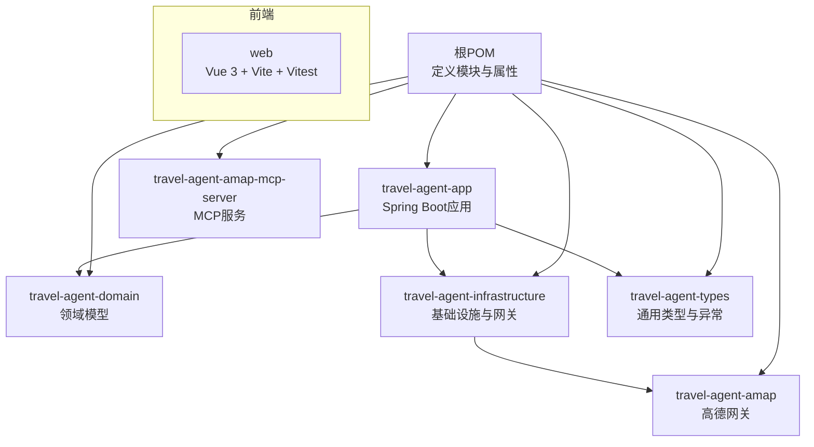
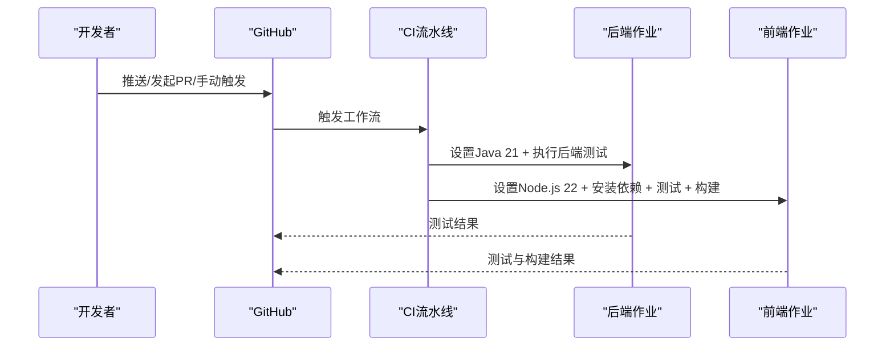
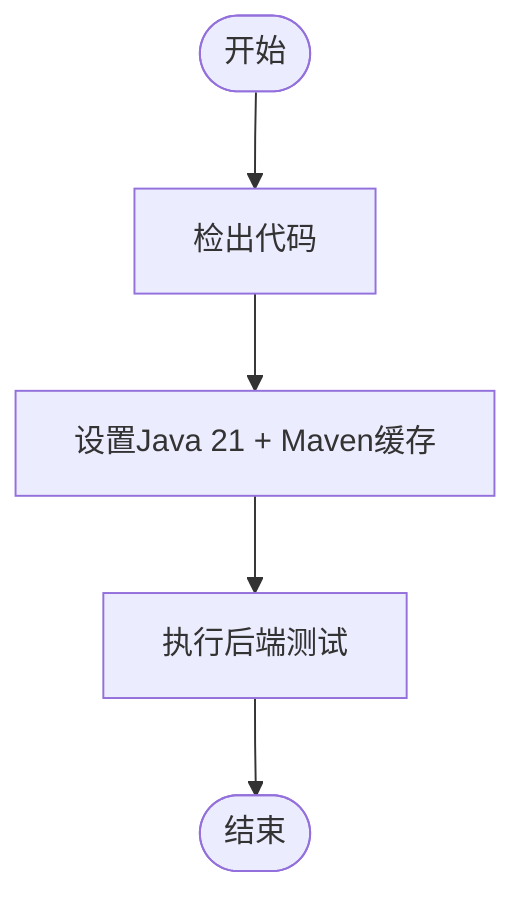
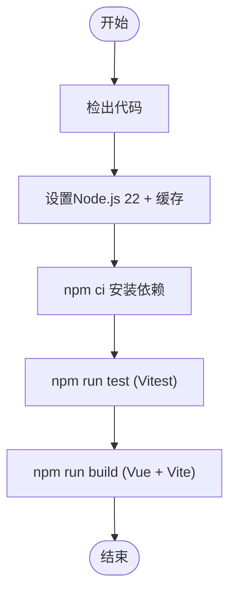
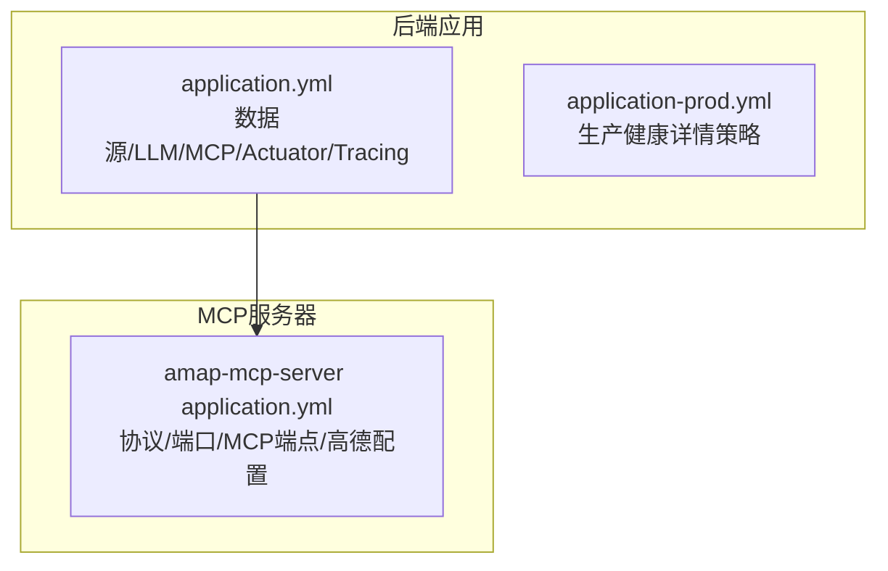
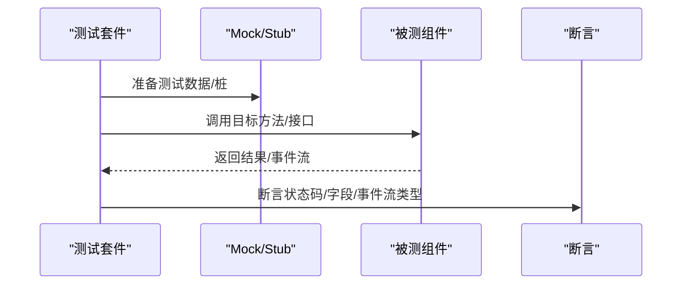
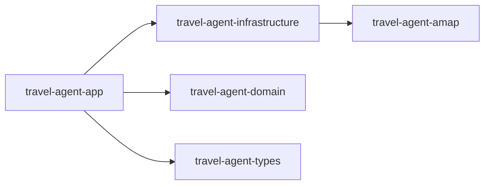

# 代码质量工具

<cite>
**本文引用的文件**
- [.github/workflows/ci.yml](file://.github/workflows/ci.yml)
- [pom.xml](file://pom.xml)
- [travel-agent-app/pom.xml](file://travel-agent-app/pom.xml)
- [web/package.json](file://web/package.json)
- [web/vite.config.ts](file://web/vite.config.ts)
- [web/tsconfig.json](file://web/tsconfig.json)
- [travel-agent-app/src/main/resources/application.yml](file://travel-agent-app/src/main/resources/application.yml)
- [travel-agent-app/src/main/resources/application-prod.yml](file://travel-agent-app/src/main/resources/application-prod.yml)
- [travel-agent-amap-mcp-server/src/main/resources/application.yml](file://travel-agent-amap-mcp-server/src/main/resources/application.yml)
- [CONTRIBUTING.md](file://CONTRIBUTING.md)
- [SECURITY.md](file://SECURITY.md)
- [travel-agent-app/src/test/java/com/travalagent/app/controller/ConversationControllerTest.java](file://travel-agent-app/src/test/java/com/travalagent/app/controller/ConversationControllerTest.java)
- [web/src/components/ChatPanel.spec.ts](file://web/src/components/ChatPanel.spec.ts)
</cite>

## 目录
1. [简介](#简介)
2. [项目结构](#项目结构)
3. [核心组件](#核心组件)
4. [架构总览](#架构总览)
5. [详细组件分析](#详细组件分析)
6. [依赖关系分析](#依赖关系分析)
7. [性能考量](#性能考量)
8. [故障排查指南](#故障排查指南)
9. [结论](#结论)
10. [附录](#附录)

## 简介
本指南聚焦于TravelAgent项目的代码质量工具链与CI/CD最佳实践，涵盖以下方面：
- GitHub Actions CI流水线：触发条件、构建步骤、测试执行与产物产出
- 代码规范与质量：后端Java与前端TypeScript/Vue的测试与类型校验配置
- 自动化测试策略：单元测试、集成测试与端到端测试的组织方式与运行路径
- 代码审查与贡献流程：PR规范、本地开发与验证步骤
- 安全与合规：敏感信息处理与漏洞上报流程
- 持续集成最佳实践与性能监控配置（基于现有配置）

## 项目结构
项目采用多模块Maven聚合工程，包含后端应用、领域模型、基础设施、第三方网关与前端Web应用。CI流水线分别对后端与前端执行独立作业。

图表来源
- [pom.xml:22-29](file://pom.xml#L22-L29)
- [travel-agent-app/pom.xml:16-31](file://travel-agent-app/pom.xml#L16-L31)

章节来源
- [pom.xml:1-58](file://pom.xml#L1-L58)
- [.github/workflows/ci.yml:13-60](file://.github/workflows/ci.yml#L13-L60)

## 核心组件
- 后端CI作业
  - 触发：推送至main分支、拉取请求、手动触发
  - 步骤：检出代码、设置Java 21、使Maven Wrapper可执行、执行后端测试
- 前端CI作业
  - 触发：同上
  - 步骤：检出代码、设置Node.js 22、安装依赖、执行测试、构建产物
- 测试与类型校验
  - 后端：Spring Boot Starter Test、Reactor Test
  - 前端：Vitest运行测试、Vue Test Utils、JSDOM环境、TypeScript编译检查
- 配置与运行时
  - 后端：OpenTelemetry遥测、Micrometer追踪、Actuator健康端点
  - 前端：Vite代理到后端、测试环境为jsdom

章节来源
- [.github/workflows/ci.yml:3-8](file://.github/workflows/ci.yml#L3-L8)
- [.github/workflows/ci.yml:14-33](file://.github/workflows/ci.yml#L14-L33)
- [.github/workflows/ci.yml:34-60](file://.github/workflows/ci.yml#L34-L60)
- [travel-agent-app/pom.xml:56-63](file://travel-agent-app/pom.xml#L56-L63)
- [web/package.json:6-11](file://web/package.json#L6-L11)
- [web/vite.config.ts:15-18](file://web/vite.config.ts#L15-L18)
- [web/tsconfig.json:1-17](file://web/tsconfig.json#L1-L17)

## 架构总览
下图展示CI流水线在不同模块中的职责划分与测试范围：

图表来源
- [.github/workflows/ci.yml:13-60](file://.github/workflows/ci.yml#L13-L60)

## 详细组件分析

### 后端CI与测试配置
- 触发条件
  - 推送至main分支
  - 拉取请求
  - 工作流手动触发
- 运行环境
  - Ubuntu运行器
  - Java 21（Temurin），启用Maven缓存
- 关键步骤
  - 检出代码
  - 使mvnw可执行
  - 执行后端测试（Maven Test）
- 依赖与测试框架
  - Spring Boot Starter Test
  - Reactor Test
  - 示例：控制器层WebTestClient测试用例覆盖聊天、流式响应、反馈导出等接口

图表来源
- [.github/workflows/ci.yml:18-32](file://.github/workflows/ci.yml#L18-L32)
- [travel-agent-app/pom.xml:56-63](file://travel-agent-app/pom.xml#L56-L63)

章节来源
- [.github/workflows/ci.yml:3-8](file://.github/workflows/ci.yml#L3-L8)
- [.github/workflows/ci.yml:14-33](file://.github/workflows/ci.yml#L14-L33)
- [travel-agent-app/src/test/java/com/travalagent/app/controller/ConversationControllerTest.java:34-180](file://travel-agent-app/src/test/java/com/travalagent/app/controller/ConversationControllerTest.java#L34-L180)

### 前端CI与测试配置
- 触发条件
  - 同后端一致
- 运行环境
  - Ubuntu运行器
  - Node.js 22，npm依赖缓存
- 关键步骤
  - 检出代码
  - 安装依赖（npm ci）
  - 运行测试（Vitest）
  - 构建（Vite + TypeScript类型检查）
- 测试与类型校验
  - Vitest + jsdom环境
  - Vue Test Utils用于组件测试
  - TypeScript严格模式与模块解析配置

图表来源
- [.github/workflows/ci.yml:42-59](file://.github/workflows/ci.yml#L42-L59)
- [web/package.json:6-11](file://web/package.json#L6-L11)
- [web/vite.config.ts:15-18](file://web/vite.config.ts#L15-L18)
- [web/tsconfig.json:1-17](file://web/tsconfig.json#L1-L17)

章节来源
- [.github/workflows/ci.yml:34-60](file://.github/workflows/ci.yml#L34-L60)
- [web/package.json:1-26](file://web/package.json#L1-L26)
- [web/vite.config.ts:1-19](file://web/vite.config.ts#L1-L19)
- [web/tsconfig.json:1-17](file://web/tsconfig.json#L1-L17)
- [web/src/components/ChatPanel.spec.ts:66-128](file://web/src/components/ChatPanel.spec.ts#L66-L128)

### 配置与运行时监控
- 后端配置要点
  - 数据源：SQLite（开发默认）
  - OpenAI配置：通过环境变量注入
  - MCP客户端：支持同步与流式HTTP，可配置超时与工具回调
  - Actuator：暴露health、info端点；生产环境健康详情受控
  - 遥测：OpenTelemetry OTLP端点可配置采样概率
- MCP服务器配置
  - 协议：STREAMABLE/SYNC
  - 端口与MCP端点可通过环境变量配置
  - 高德API密钥与基础URL可注入

图表来源
- [travel-agent-app/src/main/resources/application.yml:1-100](file://travel-agent-app/src/main/resources/application.yml#L1-L100)
- [travel-agent-app/src/main/resources/application-prod.yml:1-6](file://travel-agent-app/src/main/resources/application-prod.yml#L1-L6)
- [travel-agent-amap-mcp-server/src/main/resources/application.yml:1-35](file://travel-agent-amap-mcp-server/src/main/resources/application.yml#L1-L35)

章节来源
- [travel-agent-app/src/main/resources/application.yml:1-100](file://travel-agent-app/src/main/resources/application.yml#L1-L100)
- [travel-agent-app/src/main/resources/application-prod.yml:1-6](file://travel-agent-app/src/main/resources/application-prod.yml#L1-L6)
- [travel-agent-amap-mcp-server/src/main/resources/application.yml:1-35](file://travel-agent-amap-mcp-server/src/main/resources/application.yml#L1-L35)

### 自动化测试策略
- 单元测试
  - 后端：使用Spring Boot Test与Reactor Test，示例覆盖控制器行为与响应封装
  - 前端：使用Vitest与Vue Test Utils，示例覆盖组件渲染、事件发射与错误消息显示
- 集成测试
  - 后端：示例包含集成测试类，建议在CI中统一由Maven测试阶段执行
- 端到端测试
  - 当前未发现端到端测试配置；可在本地或专用作业中引入Cypress或Playwright，并通过工作流矩阵扩展

图表来源
- [travel-agent-app/src/test/java/com/travalagent/app/controller/ConversationControllerTest.java:27-32](file://travel-agent-app/src/test/java/com/travalagent/app/controller/ConversationControllerTest.java#L27-L32)
- [web/src/components/ChatPanel.spec.ts:66-95](file://web/src/components/ChatPanel.spec.ts#L66-L95)

章节来源
- [travel-agent-app/src/test/java/com/travalagent/app/controller/ConversationControllerTest.java:1-214](file://travel-agent-app/src/test/java/com/travalagent/app/controller/ConversationControllerTest.java#L1-L214)
- [web/src/components/ChatPanel.spec.ts:1-129](file://web/src/components/ChatPanel.spec.ts#L1-L129)

### 代码审查与贡献流程
- 开发前准备
  - 对于较大变更先开Issue讨论
  - 变更保持小而可审查
  - 不提交机密信息、本地日志与生成数据
- 本地开发
  - 后端：在travel-agent-app模块启动Spring Boot应用
  - 前端：进入web目录，安装依赖并启动开发服务器
- 提交要求
  - 清晰描述变更内容、原因、测试覆盖与必要时的截图/示例
- 验证清单
  - 在本地运行后端与前端测试与构建命令后再提交PR

章节来源
- [CONTRIBUTING.md:5-38](file://CONTRIBUTING.md#L5-L38)
- [CONTRIBUTING.md:43-56](file://CONTRIBUTING.md#L43-L56)

### 安全与合规
- 支持的使用场景
  - 仓库用于自托管部署，安全修复优先合并至默认分支
- 漏洞报告
  - 私密渠道报告，避免公开Issue
  - 包含最小复现、受影响文件/端点与影响评估
- 机密处理
  - 明确禁止提交的敏感文件与凭据
  - 发生泄露时的处置流程（轮换、清理、检查历史、替换）
- 现有防护
  - 忽略本地环境文件与证书/密钥类型
  - 生产profile下健康详情限制
  - 可配置高德HTTP请求节流

章节来源
- [SECURITY.md:3-58](file://SECURITY.md#L3-L58)

## 依赖关系分析
- 模块间依赖
  - travel-agent-app依赖domain、infrastructure、types
  - infrastructure依赖amap与types
- CI作业耦合
  - 后端与前端作业相互独立，降低耦合度
  - 共享触发条件，便于跨模块变更的统一验证

图表来源
- [pom.xml:22-29](file://pom.xml#L22-L29)
- [travel-agent-app/pom.xml:16-31](file://travel-agent-app/pom.xml#L16-L31)

章节来源
- [pom.xml:1-58](file://pom.xml#L1-L58)
- [travel-agent-app/pom.xml:1-78](file://travel-agent-app/pom.xml#L1-L78)

## 性能考量
- CI性能优化建议
  - 并行化：后端与前端作业已并行执行
  - 缓存：Maven与npm依赖缓存已启用
  - 运行器：Ubuntu最新版本提升稳定性
- 运行时性能
  - Actuator与OpenTelemetry遥测已配置，建议结合外部监控系统（如Prometheus/Grafana）进行指标采集与告警
  - 生产环境健康详情策略可按需调整以平衡可观测性与安全性

章节来源
- [.github/workflows/ci.yml:23-26](file://.github/workflows/ci.yml#L23-L26)
- [.github/workflows/ci.yml:48-50](file://.github/workflows/ci.yml#L48-L50)
- [travel-agent-app/src/main/resources/application.yml:42-55](file://travel-agent-app/src/main/resources/application.yml#L42-L55)
- [travel-agent-app/src/main/resources/application-prod.yml:1-6](file://travel-agent-app/src/main/resources/application-prod.yml#L1-L6)

## 故障排查指南
- CI失败定位
  - 后端：查看Maven测试输出与日志
  - 前端：查看Vitest测试与构建日志
- 常见问题
  - 依赖安装失败：确认npm ci与网络可达性
  - 测试环境差异：确保jsdom与Vitest配置正确
  - 遥测/健康端点：核对OTLP端点与采样概率配置
- 安全事件
  - 如发现凭证泄露，立即按安全策略执行轮换与清理

章节来源
- [.github/workflows/ci.yml:18-32](file://.github/workflows/ci.yml#L18-L32)
- [.github/workflows/ci.yml:52-59](file://.github/workflows/ci.yml#L52-L59)
- [SECURITY.md:39-44](file://SECURITY.md#L39-L44)

## 结论
本项目已具备完善的前后端分离CI流水线与基础测试配置。建议后续在CI中补充端到端测试作业、引入静态分析与安全扫描（如SpotBugs/OWASP依赖检查），并在生产环境完善监控与告警体系，以进一步提升交付质量与运维可靠性。

## 附录
- 本地开发与验证
  - 后端：在travel-agent-app模块执行Spring Boot运行命令
  - 前端：进入web目录执行npm ci、npm run dev与npm run test/build
- PR与贡献
  - 遵循贡献指南中的变更范围、测试与文档更新要求

章节来源
- [CONTRIBUTING.md:11-29](file://CONTRIBUTING.md#L11-L29)
- [CONTRIBUTING.md:43-56](file://CONTRIBUTING.md#L43-L56)