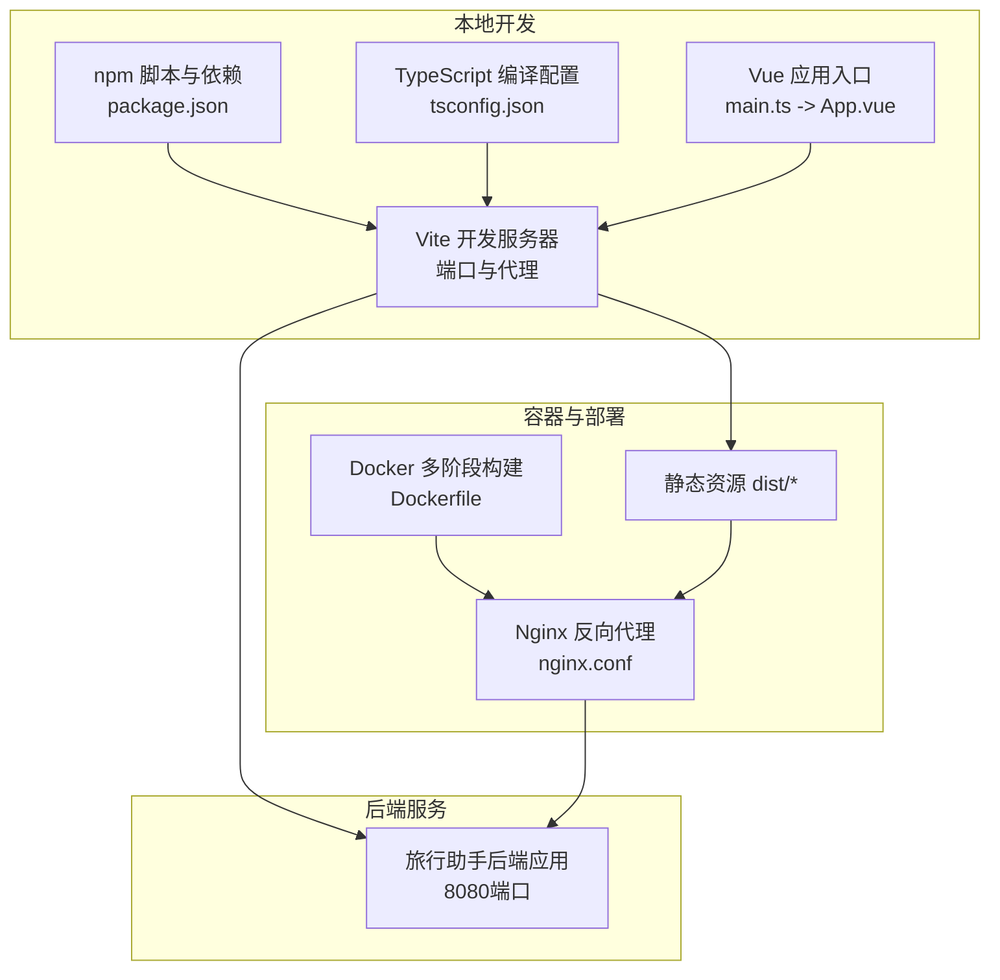
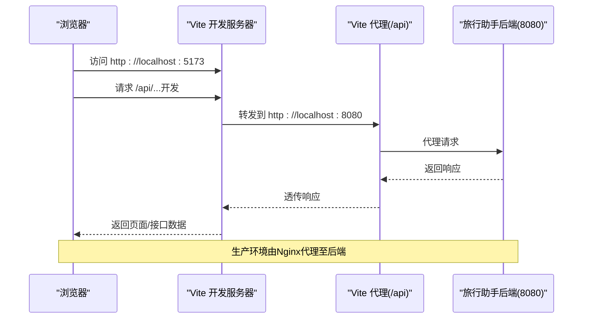
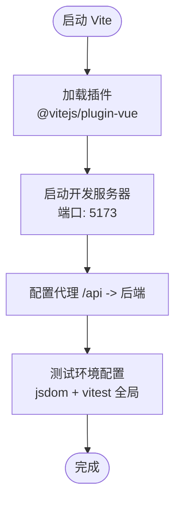
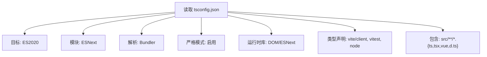
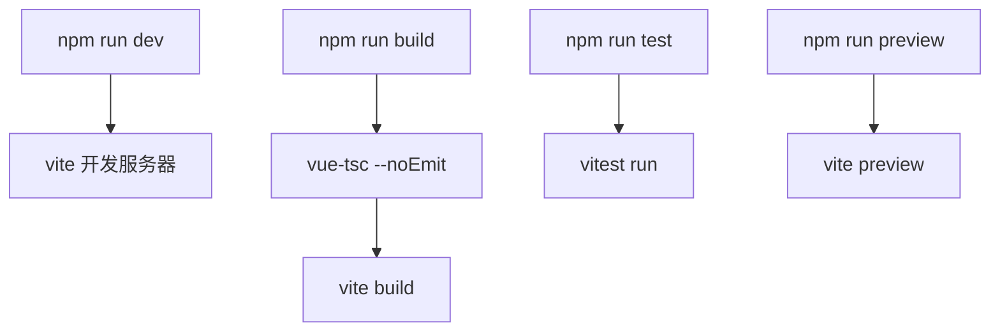
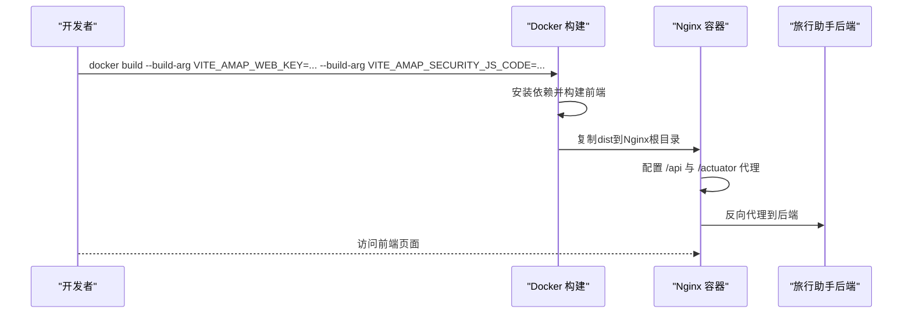
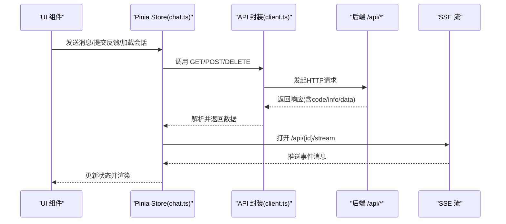
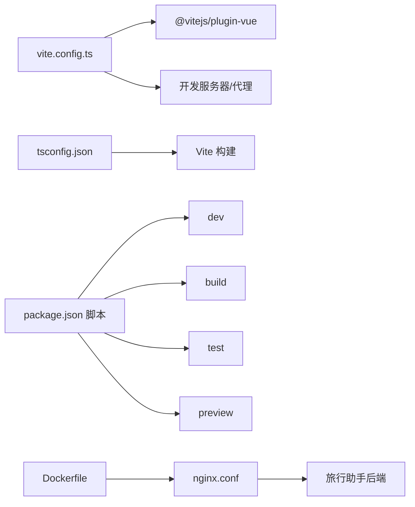

# 前端开发工具

<cite>
**本文引用的文件**
- [web/vite.config.ts](file://web/vite.config.ts)
- [web/tsconfig.json](file://web/tsconfig.json)
- [web/package.json](file://web/package.json)
- [web/Dockerfile](file://web/Dockerfile)
- [web/nginx.conf](file://web/nginx.conf)
- [web/.dockerignore](file://web/.dockerignore)
- [web/server.mjs](file://web/server.mjs)
- [web/index.html](file://web/index.html)
- [web/src/main.ts](file://web/src/main.ts)
- [web/src/App.vue](file://web/src/App.vue)
- [web/src/api/client.ts](file://web/src/api/client.ts)
- [web/src/types/api.ts](file://web/src/types/api.ts)
- [web/src/stores/chat.ts](file://web/src/stores/chat.ts)
</cite>

## 目录
1. [简介](#简介)
2. [项目结构](#项目结构)
3. [核心组件](#核心组件)
4. [架构总览](#架构总览)
5. [详细组件分析](#详细组件分析)
6. [依赖关系分析](#依赖关系分析)
7. [性能考虑](#性能考虑)
8. [故障排查指南](#故障排查指南)
9. [结论](#结论)
10. [附录](#附录)

## 简介
本指南面向TravelAgent前端团队与协作开发者，系统性梳理并解释前端开发工具链的配置与使用，涵盖以下主题：
- Vite构建工具配置：开发服务器、代理、插件与测试配置
- TypeScript编译配置：目标、模块解析、类型检查与严格模式
- npm包管理：依赖安装、脚本命令与版本管理建议
- 开发环境配置：热重载、源码映射与调试
- 容器化与生产构建：Docker多阶段构建、Nginx反向代理与静态资源服务
- 关键数据流与状态管理：API封装、Pinia Store与事件流

本指南以仓库中的实际配置为依据，避免臆测，确保可操作与可复现。

## 项目结构
前端位于web目录，采用Vue 3 + TypeScript + Vite技术栈，配合Pinia进行状态管理，通过Vite代理访问后端应用，最终以Docker镜像在生产环境中由Nginx提供静态资源服务。

图表来源
- [web/vite.config.ts:1-19](file://web/vite.config.ts#L1-L19)
- [web/tsconfig.json:1-17](file://web/tsconfig.json#L1-L17)
- [web/package.json:1-26](file://web/package.json#L1-L26)
- [web/Dockerfile:1-22](file://web/Dockerfile#L1-L22)
- [web/nginx.conf:1-30](file://web/nginx.conf#L1-L30)

章节来源
- [web/vite.config.ts:1-19](file://web/vite.config.ts#L1-L19)
- [web/tsconfig.json:1-17](file://web/tsconfig.json#L1-L17)
- [web/package.json:1-26](file://web/package.json#L1-L26)
- [web/Dockerfile:1-22](file://web/Dockerfile#L1-L22)
- [web/nginx.conf:1-30](file://web/nginx.conf#L1-L30)

## 核心组件
- 构建与开发服务器：Vite负责开发时热重载、代理转发与打包
- 类型系统：TypeScript严格模式与ESNext模块解析
- 包管理与脚本：npm脚本统一执行开发、构建、预览与测试
- 容器化：Docker多阶段构建，Nginx提供生产级静态资源服务
- 前端应用：Vue 3单页应用，Pinia集中状态，API封装与事件流订阅

章节来源
- [web/vite.config.ts:1-19](file://web/vite.config.ts#L1-L19)
- [web/tsconfig.json:1-17](file://web/tsconfig.json#L1-L17)
- [web/package.json:1-26](file://web/package.json#L1-L26)
- [web/Dockerfile:1-22](file://web/Dockerfile#L1-L22)
- [web/nginx.conf:1-30](file://web/nginx.conf#L1-L30)

## 架构总览
下图展示从浏览器到后端的请求路径，以及开发与生产的差异：

图表来源
- [web/vite.config.ts:6-14](file://web/vite.config.ts#L6-L14)
- [web/nginx.conf:8-24](file://web/nginx.conf#L8-L24)

章节来源
- [web/vite.config.ts:6-14](file://web/vite.config.ts#L6-L14)
- [web/nginx.conf:8-24](file://web/nginx.conf#L8-L24)

## 详细组件分析

### Vite 配置详解
- 插件与框架支持：启用Vue插件以获得单文件组件与模板编译能力
- 开发服务器：监听本地端口，便于与后端联调
- 代理规则：将/api前缀转发至后端地址，解决跨域与联调问题
- 测试环境：使用jsdom运行单元测试，支持全局测试API

图表来源
- [web/vite.config.ts:4-19](file://web/vite.config.ts#L4-L19)

章节来源
- [web/vite.config.ts:4-19](file://web/vite.config.ts#L4-L19)

### TypeScript 编译配置
- 目标与模块：ES2020目标与ESNext模块，适配现代浏览器与打包器
- 模块解析：Bundler解析，利于Vite等打包器处理
- 严格性：开启严格模式，提升类型安全
- 运行时库：包含DOM、ESNext等库，满足前端运行环境
- 类型声明：引入vite/client、vitest/globals与Node类型，增强开发体验
- 包含范围：覆盖所有TS/TSX/Vue文件与类型声明

图表来源
- [web/tsconfig.json:2-17](file://web/tsconfig.json#L2-L17)

章节来源
- [web/tsconfig.json:2-17](file://web/tsconfig.json#L2-L17)

### npm 脚本与依赖管理
- 脚本命令
  - dev：启动Vite开发服务器
  - build：先类型检查，再执行Vite构建
  - test：运行单元测试
  - preview：本地预览构建产物
- 依赖与开发依赖：Vue生态、Vite、TypeScript、Pinia、Vitest及相关类型

图表来源
- [web/package.json:6-11](file://web/package.json#L6-L11)

章节来源
- [web/package.json:6-11](file://web/package.json#L6-L11)

### 开发环境配置
- 热重载：Vite默认启用，修改代码自动刷新
- 源码映射：可通过Vite配置生成source map（当前未显式配置，如需请在Vite中添加对应字段）
- 调试：结合浏览器开发者工具与Vitest调试；必要时可在Vite中增加调试参数或日志级别

章节来源
- [web/vite.config.ts:4-19](file://web/vite.config.ts#L4-L19)

### 容器化与生产构建
- 多阶段构建：第一阶段使用Node Alpine安装依赖并构建；第二阶段使用Nginx提供静态资源服务
- 环境变量注入：通过构建参数传递高德Web Key与安全JS代码，注入到Vite构建时的环境变量
- Nginx配置：对/api与/actuator进行反向代理，静态资源返回index.html以支持前端路由
- Docker忽略：排除node_modules、dist与日志文件

图表来源
- [web/Dockerfile:1-22](file://web/Dockerfile#L1-L22)
- [web/nginx.conf:1-30](file://web/nginx.conf#L1-L30)
- [web/.dockerignore:1-4](file://web/.dockerignore#L1-L4)

章节来源
- [web/Dockerfile:1-22](file://web/Dockerfile#L1-L22)
- [web/nginx.conf:1-30](file://web/nginx.conf#L1-L30)
- [web/.dockerignore:1-4](file://web/.dockerignore#L1-L4)

### 前端应用与数据流
- 应用入口：创建Vue应用，挂载Pinia与根组件
- 页面结构：App.vue组织侧边栏、聊天面板、时间线与行程面板
- API封装：统一封装GET/POST/DELETE，校验响应码与错误信息
- 状态管理：Pinia Store集中管理会话列表、当前会话详情、反馈循环统计、发送与加载状态
- 事件流：通过Server-Sent Events订阅后端实时事件，增量更新时间线

图表来源
- [web/src/main.ts:1-7](file://web/src/main.ts#L1-L7)
- [web/src/App.vue:1-381](file://web/src/App.vue#L1-L381)
- [web/src/api/client.ts:1-37](file://web/src/api/client.ts#L1-L37)
- [web/src/stores/chat.ts:1-196](file://web/src/stores/chat.ts#L1-L196)

章节来源
- [web/src/main.ts:1-7](file://web/src/main.ts#L1-L7)
- [web/src/App.vue:1-381](file://web/src/App.vue#L1-L381)
- [web/src/api/client.ts:1-37](file://web/src/api/client.ts#L1-L37)
- [web/src/stores/chat.ts:1-196](file://web/src/stores/chat.ts#L1-L196)

## 依赖关系分析
- Vite与Vue：Vite通过插件支持Vue单文件组件与模板
- TypeScript与Vite：Vite读取tsconfig进行类型检查与模块解析
- npm脚本与工具链：Vitest、vue-tsc与Vite协同完成测试与构建
- 容器与Nginx：Docker多阶段构建产物交由Nginx提供静态资源与反向代理

图表来源
- [web/vite.config.ts:1-19](file://web/vite.config.ts#L1-L19)
- [web/tsconfig.json:1-17](file://web/tsconfig.json#L1-L17)
- [web/package.json:6-11](file://web/package.json#L6-L11)
- [web/Dockerfile:1-22](file://web/Dockerfile#L1-L22)
- [web/nginx.conf:1-30](file://web/nginx.conf#L1-L30)

章节来源
- [web/vite.config.ts:1-19](file://web/vite.config.ts#L1-L19)
- [web/tsconfig.json:1-17](file://web/tsconfig.json#L1-L17)
- [web/package.json:6-11](file://web/package.json#L6-L11)
- [web/Dockerfile:1-22](file://web/Dockerfile#L1-L22)
- [web/nginx.conf:1-30](file://web/nginx.conf#L1-L30)

## 性能考虑
- 构建优化：在生产构建中启用压缩与分包策略（Vite默认行为），结合Nginx缓存头与gzip配置进一步优化传输
- 依赖精简：仅保留必要依赖，避免重复与冗余包
- 懒加载：对非首屏组件采用动态导入，降低初始包体
- 图片与媒体：使用现代格式与按需加载策略
- 源码映射：开发阶段启用，生产阶段关闭或降级，平衡调试与体积
- 代理与网络：合理设置代理超时与重试，避免阻塞用户交互

## 故障排查指南
- 开发服务器无法访问
  - 检查端口占用与防火墙设置
  - 确认Vite代理是否正确指向后端地址
- 代理失败或跨域问题
  - 核对代理路径与后端端口
  - 在Nginx中确认/api与/actuator代理配置
- 构建失败
  - 先执行类型检查，修正类型错误后再构建
  - 清理node_modules与缓存后重试
- 容器启动异常
  - 确认构建参数已传入Vite相关环境变量
  - 检查Nginx配置与后端服务可达性
- 前端路由404
  - 确保Nginx对静态资源回退到index.html以支持前端路由

章节来源
- [web/vite.config.ts:6-14](file://web/vite.config.ts#L6-L14)
- [web/nginx.conf:26-28](file://web/nginx.conf#L26-L28)
- [web/Dockerfile:9-12](file://web/Dockerfile#L9-L12)

## 结论
本指南基于仓库现有配置，系统化地梳理了Vite、TypeScript、npm与Docker在TravelAgent前端中的使用方式。遵循本文档的配置与最佳实践，可快速搭建稳定、可维护且易于部署的前端开发与生产环境。

## 附录
- HTML入口与应用挂载：入口HTML与应用根节点绑定
- 类型定义：统一的API响应与领域模型类型，保障前后端契约清晰

章节来源
- [web/index.html:1-13](file://web/index.html#L1-L13)
- [web/src/main.ts:1-7](file://web/src/main.ts#L1-L7)
- [web/src/types/api.ts:1-349](file://web/src/types/api.ts#L1-L349)