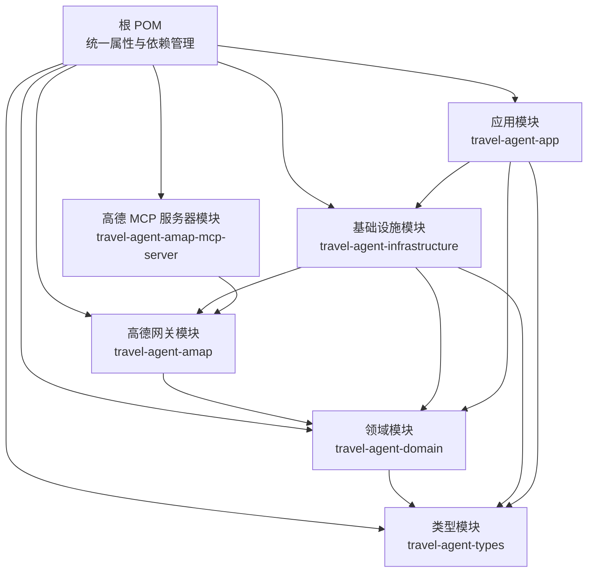
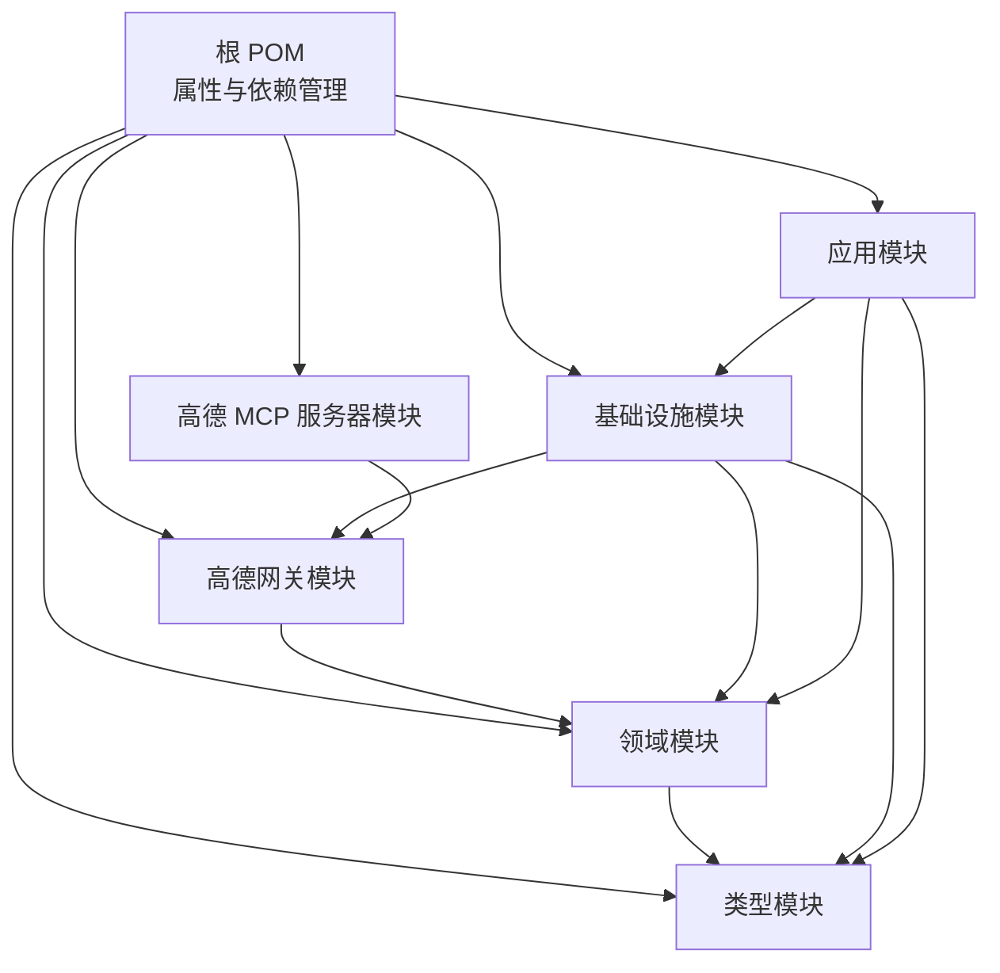
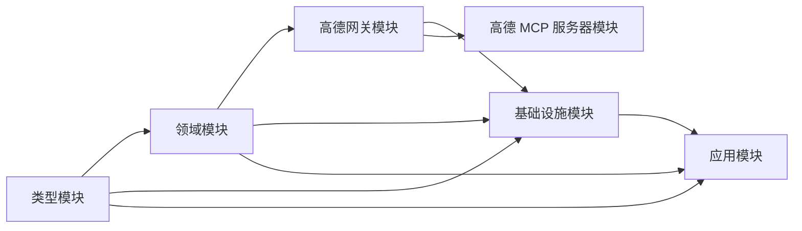

# 后端构建工具

<cite>
**本文引用的文件**
- [根 POM（pom.xml）](file://pom.xml)
- [.mvn/wrapper/maven-wrapper.properties](file://.mvn/wrapper/maven-wrapper.properties)
- [Maven 包装器脚本（Windows，mvnw.cmd）](file://mvnw.cmd)
- [旅行代理类型模块（travel-agent-types/pom.xml）](file://travel-agent-types/pom.xml)
- [领域模型模块（travel-agent-domain/pom.xml）](file://travel-agent-domain/pom.xml)
- [高德网关模块（travel-agent-amap/pom.xml）](file://travel-agent-amap/pom.xml)
- [基础设施模块（travel-agent-infrastructure/pom.xml）](file://travel-agent-infrastructure/pom.xml)
- [应用服务模块（travel-agent-app/pom.xml）](file://travel-agent-app/pom.xml)
- [高德 MCP 服务器模块（travel-agent-amap-mcp-server/pom.xml）](file://travel-agent-amap-mcp-server/pom.xml)
- [CI 工作流（.github/workflows/ci.yml）](file://.github/workflows/ci.yml)
- [应用配置（application.yml）](file://travel-agent-app/src/main/resources/application.yml)
- [应用入口（TravelAgentApplication.java）](file://travel-agent-app/src/main/java/com/travalagent/app/TravelAgentApplication.java)
</cite>

## 目录
1. [简介](#简介)
2. [项目结构](#项目结构)
3. [核心组件](#核心组件)
4. [架构总览](#架构总览)
5. [详细组件分析](#详细组件分析)
6. [依赖分析](#依赖分析)
7. [性能考虑](#性能考虑)
8. [故障排除指南](#故障排除指南)
9. [结论](#结论)
10. [附录：Maven 命令与生命周期](#附录maven-命令与生命周期)

## 简介
本指南面向 TravelAgent 后端构建工具，系统讲解基于 Maven 的多模块项目配置与使用方法，涵盖：
- 根 POM 中的模块声明、依赖管理与属性配置
- Maven Wrapper 的使用与配置文件作用
- Spring Boot 4 与 Spring AI 2.0 的版本管理策略
- Maven 命令行操作与标准生命周期阶段
- 模块间依赖关系与构建顺序
- 构建优化技巧与常见问题排查

## 项目结构
TravelAgent 采用多模块聚合工程组织，根 POM 负责统一版本与仓库配置，各子模块按职责分层：
- 类型层：定义通用数据类型与异常
- 领域层：业务实体、值对象与领域服务
- 基础设施层：外部网关、存储与 AI 组件集成
- 应用层：WebFlux 入口、控制器与工作流编排
- 高德 MCP 服务器：独立运行的 MCP 服务模块
- Web 前端：非本指南重点，但与后端通过环境变量交互

图表来源
- [根 POM（pom.xml）:22-29](file://pom.xml#L22-L29)
- [旅行代理类型模块（travel-agent-types/pom.xml）:7-11](file://travel-agent-types/pom.xml#L7-L11)
- [领域模型模块（travel-agent-domain/pom.xml）:7-11](file://travel-agent-domain/pom.xml#L7-L11)
- [高德网关模块（travel-agent-amap/pom.xml）:7-11](file://travel-agent-amap/pom.xml#L7-L11)
- [基础设施模块（travel-agent-infrastructure/pom.xml）:7-11](file://travel-agent-infrastructure/pom.xml#L7-L11)
- [应用服务模块（travel-agent-app/pom.xml）:7-11](file://travel-agent-app/pom.xml#L7-L11)
- [高德 MCP 服务器模块（travel-agent-amap-mcp-server/pom.xml）:7-11](file://travel-agent-amap-mcp-server/pom.xml#L7-L11)

章节来源
- [根 POM（pom.xml）:22-29](file://pom.xml#L22-L29)
- [旅行代理类型模块（travel-agent-types/pom.xml）:7-11](file://travel-agent-types/pom.xml#L7-L11)
- [领域模型模块（travel-agent-domain/pom.xml）:7-11](file://travel-agent-domain/pom.xml#L7-L11)
- [高德网关模块（travel-agent-amap/pom.xml）:7-11](file://travel-agent-amap/pom.xml#L7-L11)
- [基础设施模块（travel-agent-infrastructure/pom.xml）:7-11](file://travel-agent-infrastructure/pom.xml#L7-L11)
- [应用服务模块（travel-agent-app/pom.xml）:7-11](file://travel-agent-app/pom.xml#L7-L11)
- [高德 MCP 服务器模块（travel-agent-amap-mcp-server/pom.xml）:7-11](file://travel-agent-amap-mcp-server/pom.xml#L7-L11)

## 核心组件
- 根 POM（统一属性与依赖管理）
  - 继承 Spring Boot Starter Parent（版本 4.0.3），确保插件与依赖版本一致性
  - 定义模块清单与 Java 21 编译目标
  - 通过 Spring AI BOM 管理 Spring AI 生态版本（版本号在属性中集中定义）
  - 配置里程碑仓库以获取 Spring AI 2.0-M2
- Maven Wrapper
  - 使用 mvnw.cmd 在 Windows 上启动 Maven，自动下载并缓存指定版本的 Maven 分发包
  - 通过 maven-wrapper.properties 指定分发源与版本，支持阿里云镜像加速
- 模块化结构
  - 类型层为无副作用的纯数据与异常定义
  - 领域层依赖类型层
  - 基础设施层同时依赖类型与领域层，并引入 Spring AI 与数据库相关依赖
  - 应用层依赖基础设施与领域层，提供 WebFlux 入口与打包插件配置
  - 高德 MCP 服务器模块独立于应用层，仅依赖高德网关模块

章节来源
- [根 POM（pom.xml）:7-12](file://pom.xml#L7-L12)
- [根 POM（pom.xml）:31-36](file://pom.xml#L31-L36)
- [根 POM（pom.xml）:46-56](file://pom.xml#L46-L56)
- [根 POM（pom.xml）:38-44](file://pom.xml#L38-L44)
- [.mvn/wrapper/maven-wrapper.properties:1-4](file://.mvn/wrapper/maven-wrapper.properties#L1-L4)
- [Maven 包装器脚本（Windows，mvnw.cmd）:34-39](file://mvnw.cmd#L34-L39)
- [Maven 包装器脚本（Windows，mvnw.cmd）:60-61](file://mvnw.cmd#L60-L61)
- [Maven 包装器脚本（Windows，mvnw.cmd）:88-107](file://mvnw.cmd#L88-L107)
- [Maven 包装器脚本（Windows，mvnw.cmd）:132-154](file://mvnw.cmd#L132-L154)
- [Maven 包装器脚本（Windows，mvnw.cmd）:156-184](file://mvnw.cmd#L156-L184)

## 架构总览
下图展示从根 POM 到各模块的依赖关系与构建顺序建议（自上而下依次构建）：

图表来源
- [根 POM（pom.xml）:22-29](file://pom.xml#L22-L29)
- [旅行代理类型模块（travel-agent-types/pom.xml）:16-22](file://travel-agent-types/pom.xml#L16-L22)
- [领域模型模块（travel-agent-domain/pom.xml）:16-22](file://travel-agent-domain/pom.xml#L16-L22)
- [高德网关模块（travel-agent-amap/pom.xml）:16-46](file://travel-agent-amap/pom.xml#L16-L46)
- [基础设施模块（travel-agent-infrastructure/pom.xml）:16-76](file://travel-agent-infrastructure/pom.xml#L16-L76)
- [应用服务模块（travel-agent-app/pom.xml）:16-64](file://travel-agent-app/pom.xml#L16-L64)
- [高德 MCP 服务器模块（travel-agent-amap-mcp-server/pom.xml）:16-40](file://travel-agent-amap-mcp-server/pom.xml#L16-L40)

## 详细组件分析

### 根 POM（统一属性与依赖管理）
- 模块声明
  - 明确列出六个子模块，确保聚合构建时包含全部模块
- 属性配置
  - Java 版本与编译目标统一为 21
  - 项目编码与 BOM 版本集中管理
- 依赖管理
  - 引入 Spring AI BOM，统一管理 Spring AI 生态组件版本
  - 配置里程碑仓库以获取 Spring AI 2.0-M2
- 仓库配置
  - 添加 Spring Milestone 仓库，保证可解析到里程碑版本

章节来源
- [根 POM（pom.xml）:22-29](file://pom.xml#L22-L29)
- [根 POM（pom.xml）:31-36](file://pom.xml#L31-L36)
- [根 POM（pom.xml）:46-56](file://pom.xml#L46-L56)
- [根 POM（pom.xml）:38-44](file://pom.xml#L38-L44)

### Maven Wrapper（Windows）
- 自动下载与缓存
  - 通过 PowerShell 逻辑解析 maven-wrapper.properties，计算 MAVEN_HOME 并下载分发包
  - 支持校验 SHA-256（若配置），并处理临时目录清理
- 执行行为
  - 优先使用项目内置 JDK（JDK 21），可通过环境变量跳过
  - 输出 MVN_CMD 供后续步骤调用
- 配置要点
  - distributionType=only-script 仅提供脚本模式
  - distributionUrl 指向阿里云镜像，提升下载速度

章节来源
- [.mvn/wrapper/maven-wrapper.properties:1-4](file://.mvn/wrapper/maven-wrapper.properties#L1-L4)
- [Maven 包装器脚本（Windows，mvnw.cmd）:34-39](file://mvnw.cmd#L34-L39)
- [Maven 包装器脚本（Windows，mvnw.cmd）:60-61](file://mvnw.cmd#L60-L61)
- [Maven 包装器脚本（Windows，mvnw.cmd）:88-107](file://mvnw.cmd#L88-L107)
- [Maven 包装器脚本（Windows，mvnw.cmd）:132-154](file://mvnw.cmd#L132-L154)
- [Maven 包装器脚本（Windows，mvnw.cmd）:156-184](file://mvnw.cmd#L156-L184)

### 类型模块（travel-agent-types）
- 角色定位：提供跨模块共享的数据类型与异常定义
- 依赖：无对外依赖，保持纯净

章节来源
- [旅行代理类型模块（travel-agent-types/pom.xml）:16-22](file://travel-agent-types/pom.xml#L16-L22)

### 领域模块（travel-agent-domain）
- 角色定位：承载业务实体、值对象与领域服务
- 依赖：依赖类型模块

章节来源
- [领域模型模块（travel-agent-domain/pom.xml）:16-22](file://travel-agent-domain/pom.xml#L16-L22)

### 高德网关模块（travel-agent-amap）
- 角色定位：封装高德 API 访问与配置
- 依赖：领域模块；引入 Spring Web、Jackson、配置处理器与测试 Starter

章节来源
- [高德网关模块（travel-agent-amap/pom.xml）:16-46](file://travel-agent-amap/pom.xml#L16-L46)

### 基础设施模块（travel-agent-infrastructure）
- 角色定位：集成 AI、数据库与外部工具
- 依赖：类型、领域、高德网关模块；引入 Spring AI、Milvus 向量存储、SQLite JDBC、配置处理器与测试 Starter

章节来源
- [基础设施模块（travel-agent-infrastructure/pom.xml）:16-76](file://travel-agent-infrastructure/pom.xml#L16-L76)

### 应用模块（travel-agent-app）
- 角色定位：WebFlux 入口，提供控制器与健康检查
- 依赖：基础设施、领域、类型模块；引入 Spring Boot WebFlux、验证、Actuator、Micrometer/OpenTelemetry、测试与 Reactor 测试
- 构建：配置 Spring Boot Maven 插件，指定主类

章节来源
- [应用服务模块（travel-agent-app/pom.xml）:16-64](file://travel-agent-app/pom.xml#L16-L64)
- [应用服务模块（travel-agent-app/pom.xml）:66-77](file://travel-agent-app/pom.xml#L66-L77)
- [应用入口（TravelAgentApplication.java）:7-8](file://travel-agent-app/src/main/java/com/travalagent/app/TravelAgentApplication.java#L7-L8)

### 高德 MCP 服务器模块（travel-agent-amap-mcp-server）
- 角色定位：独立运行的 MCP 服务器
- 依赖：高德网关模块；引入 Spring AI MCP Server、JSON、Actuator、测试 Starter
- 构建：配置 Spring Boot Maven 插件，指定主类

章节来源
- [高德 MCP 服务器模块（travel-agent-amap-mcp-server/pom.xml）:16-40](file://travel-agent-amap-mcp-server/pom.xml#L16-L40)
- [高德 MCP 服务器模块（travel-agent-amap-mcp-server/pom.xml）:42-53](file://travel-agent-amap-mcp-server/pom.xml#L42-L53)

### CI 工作流（.github/workflows/ci.yml）
- 后端作业
  - 设置 Java 21（Temurin），启用 Maven 缓存
  - 使 mvnw 可执行并执行测试
- 前端作业
  - 切换到 web 目录，设置 Node.js 22，安装依赖并执行测试与构建

章节来源
- [.github/workflows/ci.yml:14-33](file://.github/workflows/ci.yml#L14-L33)
- [.github/workflows/ci.yml:34-60](file://.github/workflows/ci.yml#L34-L60)

## 依赖分析
- 版本管理策略
  - Spring Boot：根 POM 继承 starter parent，统一插件与依赖版本
  - Spring AI：通过 BOM 集中管理，避免版本冲突
  - Java：统一使用 Java 21，编译目标与运行时一致
- 模块依赖链
  - 类型 → 领域 → 高德网关 → 基础设施 → 应用
  - 高德 MCP 服务器依赖高德网关
- 冲突与兼容性
  - 通过 BOM 锁定 Spring AI 版本，确保与 Spring Boot 4 兼容
  - SQLite JDBC 显式版本避免与 BOM 冲突

图表来源
- [旅行代理类型模块（travel-agent-types/pom.xml）:16-22](file://travel-agent-types/pom.xml#L16-L22)
- [领域模型模块（travel-agent-domain/pom.xml）:16-22](file://travel-agent-domain/pom.xml#L16-L22)
- [高德网关模块（travel-agent-amap/pom.xml）:16-46](file://travel-agent-amap/pom.xml#L16-L46)
- [基础设施模块（travel-agent-infrastructure/pom.xml）:16-76](file://travel-agent-infrastructure/pom.xml#L16-L76)
- [应用服务模块（travel-agent-app/pom.xml）:16-64](file://travel-agent-app/pom.xml#L16-L64)
- [高德 MCP 服务器模块（travel-agent-amap-mcp-server/pom.xml）:16-40](file://travel-agent-amap-mcp-server/pom.xml#L16-L40)

## 性能考虑
- 使用 Maven Wrapper
  - 本地缓存 MAVEN_HOME，避免重复下载
  - 在 CI 中启用缓存（如 GitHub Actions 的 Maven 缓存）以缩短构建时间
- 并行与增量
  - 在本地开发时可使用并行构建（Maven 默认支持），但在 CI 中建议串行以保证稳定性
- 依赖精简
  - 仅引入必要依赖，减少传递依赖体积
- 仓库选择
  - 使用阿里云镜像（已在 wrapper 配置中体现）提升下载速度

## 故障排除指南
- 无法解析 Spring AI 依赖
  - 确认已启用里程碑仓库且网络可达
  - 检查 spring-ai.version 属性是否正确
- 无法找到 Maven 分发包或校验失败
  - 检查 maven-wrapper.properties 的 distributionUrl 与 distributionSha256Sum 配置
  - 清理本地 wrapper 缓存目录后重试
- Java 版本不匹配
  - 确保本地与 CI 使用 Java 21；Wrapper 会优先使用项目内置 JDK
- 构建顺序错误导致失败
  - 优先构建类型与领域模块，再构建基础设施与应用模块
- CI 测试失败
  - 确保 mvnw 可执行权限；在 CI 中先执行 ./mvnw -B test

章节来源
- [根 POM（pom.xml）:38-44](file://pom.xml#L38-L44)
- [根 POM（pom.xml）:46-56](file://pom.xml#L46-L56)
- [.mvn/wrapper/maven-wrapper.properties:1-4](file://.mvn/wrapper/maven-wrapper.properties#L1-L4)
- [Maven 包装器脚本（Windows，mvnw.cmd）:144-154](file://mvnw.cmd#L144-L154)
- [.github/workflows/ci.yml:28-32](file://.github/workflows/ci.yml#L28-L32)

## 结论
本指南总结了 TravelAgent 后端构建工具的关键配置与实践建议。通过根 POM 的统一属性与依赖管理、Maven Wrapper 的标准化执行、以及清晰的模块化结构，项目实现了可维护、可扩展且易于 CI 集成的构建体系。遵循本文的构建顺序与优化建议，可显著提升本地与 CI 的构建效率与稳定性。

## 附录：Maven 命令与生命周期
- 常用命令
  - 清理：mvn clean
  - 编译：mvn compile
  - 测试：mvn test
  - 打包：mvn package
  - 安装：mvn install
  - 发布：mvn deploy（需配置仓库）
- 生命周期阶段
  - 清理：clean
  - 初始化：validate → initialize → generate-sources → process-sources
  - 编译：compile → process-classes
  - 测试：test
  - 打包：package
  - 验证：verify
  - 安装：install
  - 发布：deploy
- Maven Wrapper 使用
  - Windows：使用 mvnw.cmd
  - Linux/macOS：使用 mvnw（需赋予可执行权限）

章节来源
- [.github/workflows/ci.yml:28-32](file://.github/workflows/ci.yml#L28-L32)
- [Maven 包装器脚本（Windows，mvnw.cmd）:30-51](file://mvnw.cmd#L30-L51)