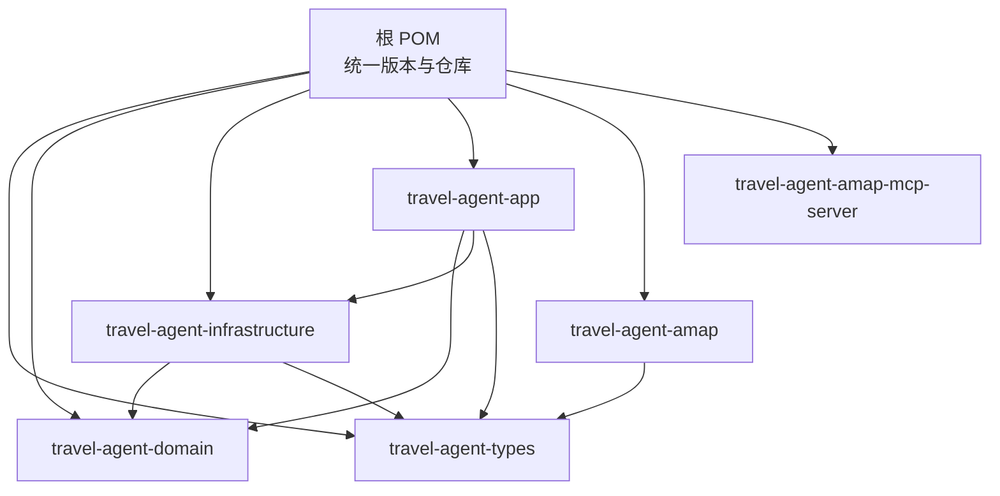
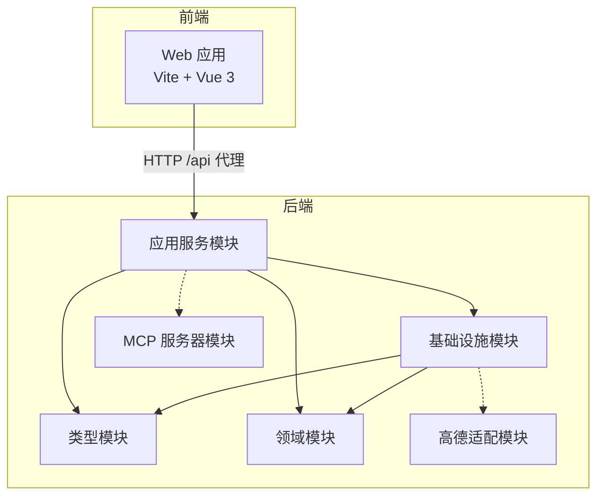
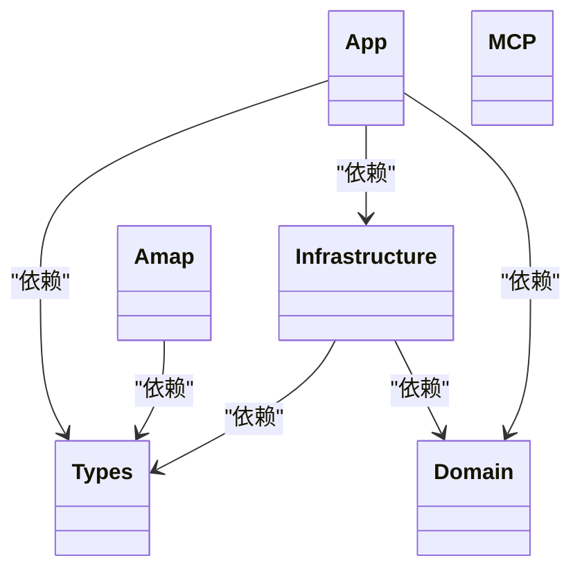
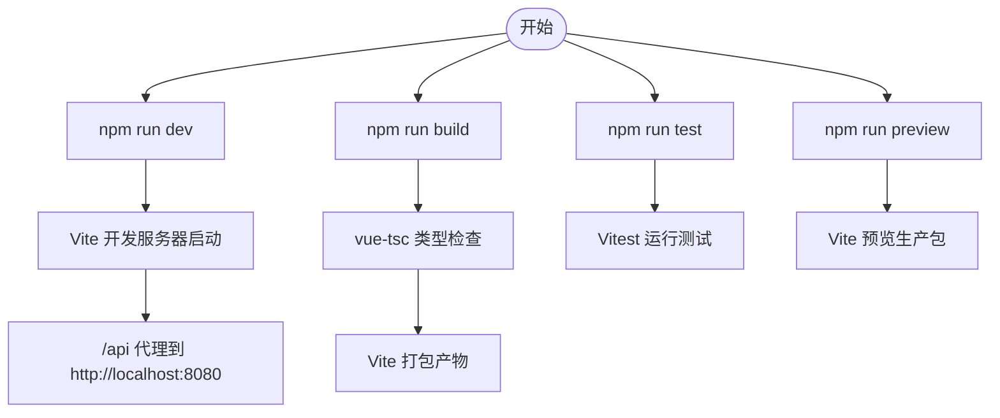
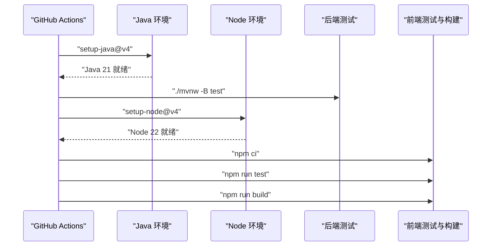
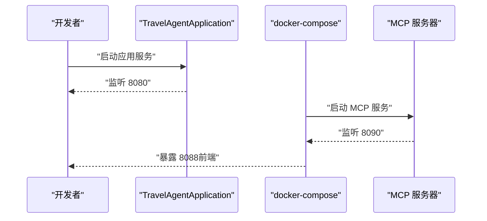
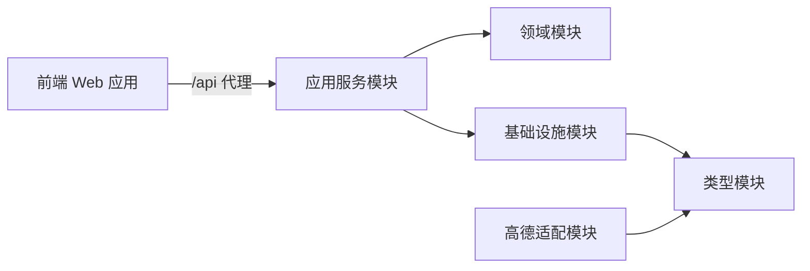

# 开发工具链

<cite>
**本文引用的文件**
- [根 POM（父级）](file://pom.xml)
- [应用模块 POM](file://travel-agent-app/pom.xml)
- [领域模块 POM](file://travel-agent-domain/pom.xml)
- [前端包管理与脚本](file://web/package.json)
- [前端 Vite 配置](file://web/vite.config.ts)
- [前端 TypeScript 配置](file://web/tsconfig.json)
- [CI 工作流](file://.github/workflows/ci.yml)
- [贡献指南](file://CONTRIBUTING.md)
- [应用入口类](file://travel-agent-app/src/main/java/com/travalagent/app/TravelAgentApplication.java)
- [前端入口文件](file://web/src/main.ts)
- [前端根组件](file://web/src/App.vue)
- [应用服务编排（Compose）](file://docker-compose.app.yml)
- [MCP 专用镜像构建](file://Dockerfile.mcp)
- [运行与本地命令说明](file://docs/operations.md)
</cite>

## 目录
1. [简介](#简介)
2. [项目结构](#项目结构)
3. [核心组件](#核心组件)
4. [架构总览](#架构总览)
5. [详细组件分析](#详细组件分析)
6. [依赖关系分析](#依赖关系分析)
7. [性能考量](#性能考量)
8. [故障排查指南](#故障排查指南)
9. [结论](#结论)
10. [附录](#附录)

## 简介
本指南面向 TravelAgent 的开发团队，系统性梳理后端 Maven 多模块构建、前端 Vite 工具链、测试与质量保障、CI 流水线、IDE 配置建议、版本控制与分支策略、以及本地开发与常见问题处理。目标是帮助新成员快速上手并保持一致的工程化实践。

## 项目结构
项目采用多模块聚合工程组织，后端以 Spring Boot 为主，前端使用 Vue 3 + Vite。根 POM 负责统一版本与仓库配置，子模块按职责拆分：类型定义、领域模型、基础设施、应用服务、第三方网关适配与 MCP 服务器等。前端通过 Vite 提供开发服务器与打包能力，并集成 Vitest 进行单元测试。

图表来源
- [根 POM（父级）:22-29](file://pom.xml#L22-L29)
- [应用模块 POM:16-31](file://travel-agent-app/pom.xml#L16-L31)
- [领域模块 POM:16-21](file://travel-agent-domain/pom.xml#L16-L21)

章节来源
- [根 POM（父级）:1-58](file://pom.xml#L1-L58)
- [应用模块 POM:1-78](file://travel-agent-app/pom.xml#L1-L78)
- [领域模块 POM:1-24](file://travel-agent-domain/pom.xml#L1-L24)

## 核心组件
- 后端多模块与构建
  - 使用 Spring Boot 父 POM 统一管理版本与插件；通过 dependencyManagement 引入 Spring AI BOM，确保依赖一致性。
  - 模块间依赖清晰：应用层依赖领域与基础设施；基础设施依赖领域与类型；第三方适配模块独立。
- 前端工具链
  - Vite 提供开发服务器与代理；TypeScript 编译与类型检查；Vitest 单元测试；Vue 插件生态。
- CI 与测试
  - GitHub Actions 分别执行后端与前端流水线，分别安装 Java 与 Node.js，执行测试与构建。
- 运行与部署
  - docker-compose 编排应用、MCP 服务与可选前端；MCP 专用镜像构建仅打包指定模块。

章节来源
- [根 POM（父级）:31-56](file://pom.xml#L31-L56)
- [应用模块 POM:66-77](file://travel-agent-app/pom.xml#L66-L77)
- [前端包管理与脚本:6-11](file://web/package.json#L6-L11)
- [CI 工作流:13-60](file://.github/workflows/ci.yml#L13-L60)
- [应用服务编排（Compose）:1-62](file://docker-compose.app.yml#L1-L62)
- [MCP 专用镜像构建:1-28](file://Dockerfile.mcp#L1-L28)

## 架构总览
下图展示后端模块关系与运行时交互，以及前端与后端 API 的代理关系。

图表来源
- [根 POM（父级）:22-29](file://pom.xml#L22-L29)
- [应用模块 POM:16-31](file://travel-agent-app/pom.xml#L16-L31)
- [前端 Vite 配置:6-14](file://web/vite.config.ts#L6-L14)

章节来源
- [前端 Vite 配置:1-19](file://web/vite.config.ts#L1-L19)
- [应用模块 POM:16-31](file://travel-agent-app/pom.xml#L16-L31)

## 详细组件分析

### 后端 Maven 多模块构建
- 版本与仓库
  - 父 POM 统一继承 Spring Boot 父 POM，设置 Java 版本与编码；声明 Spring AI BOM 并在 dependencyManagement 中导入，避免版本漂移。
- 模块划分
  - 类型模块：公共枚举、异常与响应体。
  - 领域模块：领域事件、值对象、实体、仓储接口与领域服务。
  - 基础设施模块：对外网关适配、向量存储、内存实现、配置与工具。
  - 应用模块：Spring WebFlux 控制器、全局异常、健康检查、工作流与应用服务。
  - 第三方适配模块：高德 HTTP 网关。
  - MCP 服务器模块：独立运行的 MCP 服务。
- 构建与插件
  - 应用模块启用 Spring Boot Maven 插件并指定主类，便于直接运行与打包。

图表来源
- [根 POM（父级）:22-29](file://pom.xml#L22-L29)
- [应用模块 POM:16-31](file://travel-agent-app/pom.xml#L16-L31)
- [领域模块 POM:16-21](file://travel-agent-domain/pom.xml#L16-L21)

章节来源
- [根 POM（父级）:31-56](file://pom.xml#L31-L56)
- [应用模块 POM:66-77](file://travel-agent-app/pom.xml#L66-L77)
- [领域模块 POM:16-21](file://travel-agent-domain/pom.xml#L16-L21)

### 前端 Vite 工具链
- 脚本与任务
  - dev：启动开发服务器；build：先进行类型检查再打包；test：运行单元测试；preview：预览生产包。
- 配置要点
  - 服务器端口与 /api 代理到后端 8080；测试环境为 jsdom，支持全局测试 API。
  - TypeScript 编译选项启用严格模式、ESNext 模块解析、DOM 类型、Node 类型与 Vite 客户端类型。
- 入口与组件
  - 入口创建 Vue 应用并挂载；根组件负责会话、计划、时间线等 UI 展示与语言切换。

图表来源
- [前端包管理与脚本:6-11](file://web/package.json#L6-L11)
- [前端 Vite 配置:4-19](file://web/vite.config.ts#L4-L19)
- [前端 TypeScript 配置:2-16](file://web/tsconfig.json#L2-L16)
- [前端入口文件:1-7](file://web/src/main.ts#L1-L7)
- [前端根组件:1-381](file://web/src/App.vue#L1-L381)

章节来源
- [前端包管理与脚本:1-26](file://web/package.json#L1-L26)
- [前端 Vite 配置:1-19](file://web/vite.config.ts#L1-L19)
- [前端 TypeScript 配置:1-17](file://web/tsconfig.json#L1-L17)
- [前端入口文件:1-7](file://web/src/main.ts#L1-L7)
- [前端根组件:1-381](file://web/src/App.vue#L1-L381)

### CI 与自动化测试
- 触发条件
  - 推送 main 分支、拉取请求或手动触发。
- 后端流水线
  - 设置 Java 21，赋予 mvnw 可执行权限，执行 Maven 测试。
- 前端流水线
  - 切换到 web 目录，设置 Node.js 22，使用 npm ci 安装依赖，运行测试与构建。
- 权限
  - 读取仓库内容的最小权限。

图表来源
- [CI 工作流:14-60](file://.github/workflows/ci.yml#L14-L60)

章节来源
- [CI 工作流:1-60](file://.github/workflows/ci.yml#L1-L60)

### 运行与本地命令
- 后端
  - 在根目录使用 Maven 指定模块并增量构建运行应用服务。
- 前端
  - 进入 web 目录，使用 npm ci 安装依赖，运行开发服务器。
- 可选 MCP 服务
  - 可单独运行 MCP 服务器模块用于本地联调。
- 数据与日志
  - 本地 SQLite 数据库、向量数据库状态与导出目录遵循统一约定，避免混入仓库。

章节来源
- [贡献指南:11-29](file://CONTRIBUTING.md#L11-L29)
- [运行与本地命令说明:25-67](file://docs/operations.md#L25-L67)

### 应用入口与运行编排
- 应用入口类启用 Spring Boot 自动装配与配置属性扫描，作为后端主程序入口。
- Compose 文件定义了应用、MCP 服务器与前端的服务编排、环境变量、端口映射与依赖关系。
- MCP 专用镜像构建仅对 MCP 子模块进行打包，减少构建范围。

图表来源
- [应用入口类:7-13](file://travel-agent-app/src/main/java/com/travalagent/app/TravelAgentApplication.java#L7-L13)
- [应用服务编排（Compose）:1-62](file://docker-compose.app.yml#L1-L62)
- [MCP 专用镜像构建:19-24](file://Dockerfile.mcp#L19-L24)

章节来源
- [应用入口类:1-15](file://travel-agent-app/src/main/java/com/travalagent/app/TravelAgentApplication.java#L1-L15)
- [应用服务编排（Compose）:1-62](file://docker-compose.app.yml#L1-L62)
- [MCP 专用镜像构建:1-28](file://Dockerfile.mcp#L1-L28)

## 依赖关系分析
- 后端模块耦合
  - 应用层对领域与基础设施存在强依赖，基础设施层对领域与类型有依赖，第三方适配模块对类型模块有依赖，保证内聚与边界清晰。
- 前端与后端
  - 前端通过 /api 代理访问后端接口，开发期无需跨域处理；TypeScript 类型与 Vite 配置确保开发体验与构建稳定性。

图表来源
- [前端 Vite 配置:8-13](file://web/vite.config.ts#L8-L13)
- [应用模块 POM:16-31](file://travel-agent-app/pom.xml#L16-L31)
- [根 POM（父级）:22-29](file://pom.xml#L22-L29)

章节来源
- [前端 Vite 配置:1-19](file://web/vite.config.ts#L1-L19)
- [应用模块 POM:16-31](file://travel-agent-app/pom.xml#L16-L31)
- [根 POM（父级）:22-29](file://pom.xml#L22-L29)

## 性能考量
- 后端
  - 使用 WebFlux 以非阻塞方式处理请求，结合 Micrometer 与 OpenTelemetry 支持可观测性。
  - 向量检索与外部服务调用需注意超时与重试策略，避免阻塞主线程。
- 前端
  - Vite 开发服务器默认代理到后端，减少跨域与网络往返；生产构建开启压缩与 Tree-shaking。
  - TypeScript 严格模式有助于提前发现潜在性能问题与类型错误。

章节来源
- [应用模块 POM:33-53](file://travel-agent-app/pom.xml#L33-L53)
- [前端包管理与脚本:6-11](file://web/package.json#L6-L11)
- [前端 TypeScript 配置:7-14](file://web/tsconfig.json#L7-L14)

## 故障排查指南
- 后端
  - 确认 Java 版本与 Maven Wrapper 权限；使用指定模块运行应用服务；查看日志与数据目录约定。
- 前端
  - 确认 Node.js 版本与依赖安装；检查 /api 代理是否指向正确地址；查看测试与构建输出。
- CI
  - 若流水线失败，优先检查 Java/Node 版本缓存与工作目录路径；前后端分别定位问题。

章节来源
- [CI 工作流:21-26](file://.github/workflows/ci.yml#L21-L26)
- [运行与本地命令说明:25-67](file://docs/operations.md#L25-L67)
- [贡献指南:11-29](file://CONTRIBUTING.md#L11-L29)

## 结论
本指南从多模块构建、前端工具链、CI 流水线、运行编排到故障排查，提供了 TravelAgent 工程化的完整视图。建议在日常开发中严格遵循模块边界、测试先行与统一的本地与 CI 行为，以确保高质量交付。

## 附录

### IDE 配置建议
- IntelliJ IDEA
  - 导入根 POM，启用 Maven 自动导入；设置 Java 21 与 Maven Wrapper；为前端模块配置 Node.js 解释器。
  - 后端应用入口类作为运行配置主类；可配置 Spring Boot 运行参数与环境变量。
- VS Code
  - 安装 Vue、TypeScript、ESLint、Prettier 等扩展；配置 TypeScript 与 Vite 的工作目录与任务。
  - 前端测试可在终端使用 npm run test；后端测试可在 Maven 工具窗口执行。

[本节为通用实践建议，不直接分析具体文件，故无“章节来源”]

### 版本控制与分支策略
- 分支保护
  - 主分支受保护，变更通过 PR 合并；PR 需通过 CI 与代码审查。
- 提交规范
  - 小步提交、明确变更范围；避免提交密钥、本地配置与生成文件。
- 代码审查
  - 关注模块边界、测试覆盖与回归风险；优先修复根因而非临时补丁。

章节来源
- [贡献指南:5-37](file://CONTRIBUTING.md#L5-L37)

### 本地开发与常见问题
- 启动顺序
  - 先启动后端应用服务，再启动前端；如需 MCP 联调，额外启动 MCP 服务器。
- 端口冲突
  - 修改 Vite 代理或后端端口；确认 Compose 映射未被占用。
- 数据与日志
  - 遵循运行约定，将日志与导出文件放入指定目录，避免混入仓库。

章节来源
- [贡献指南:11-29](file://CONTRIBUTING.md#L11-L29)
- [运行与本地命令说明:5-23](file://docs/operations.md#L5-L23)
- [应用服务编排（Compose）:30-31](file://docker-compose.app.yml#L30-L31)