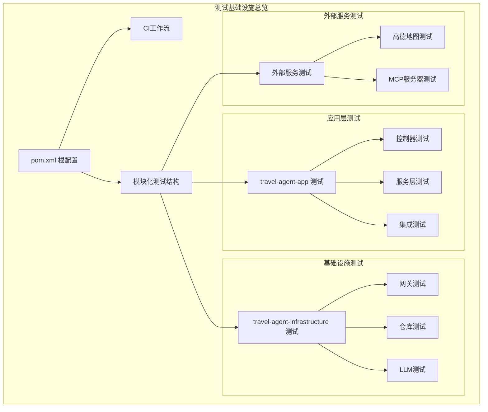
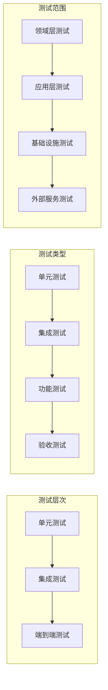
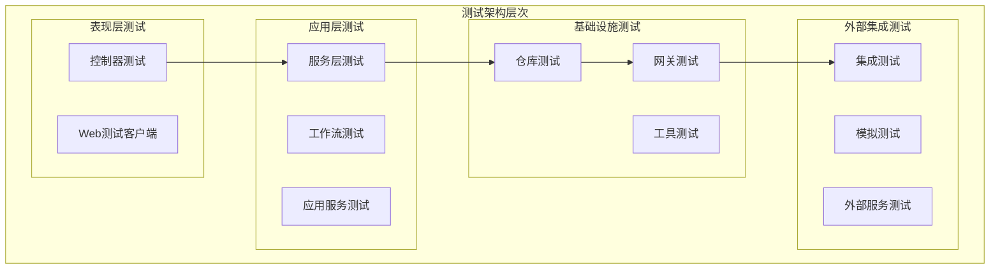
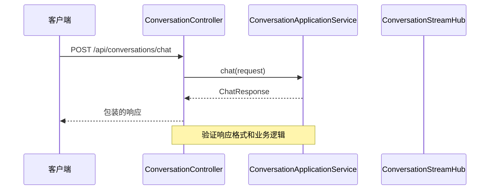
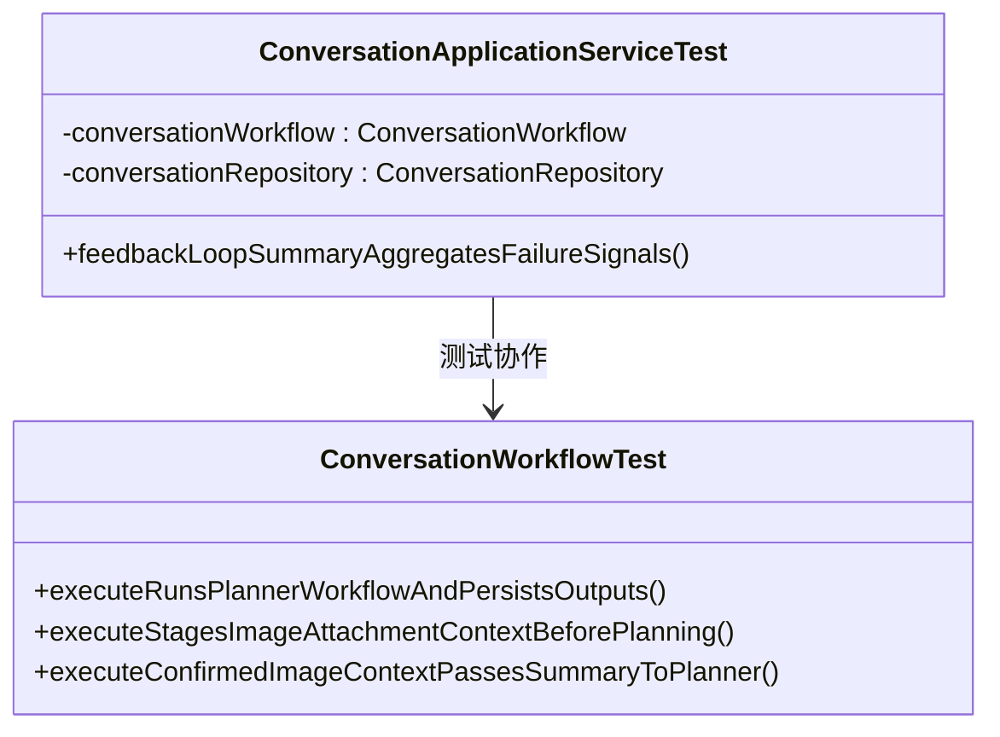
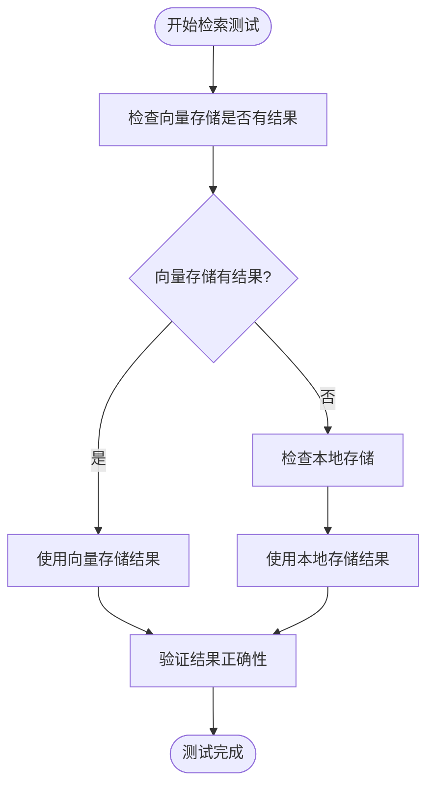
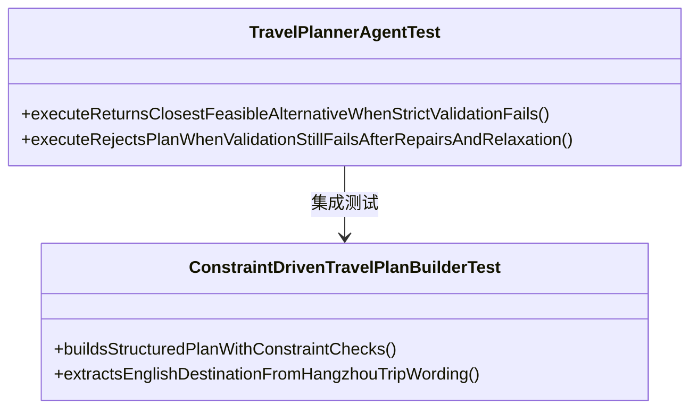
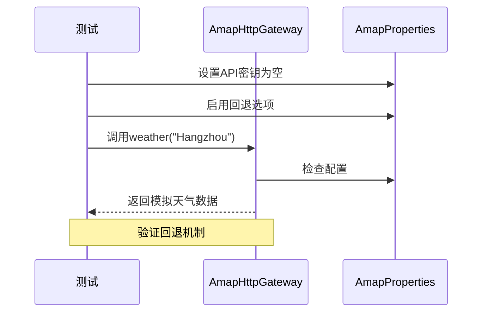
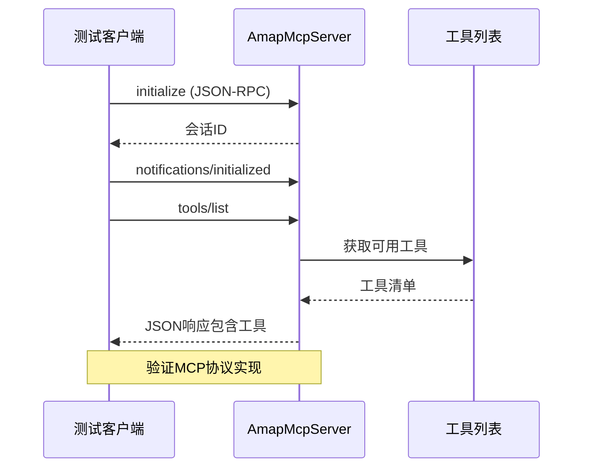
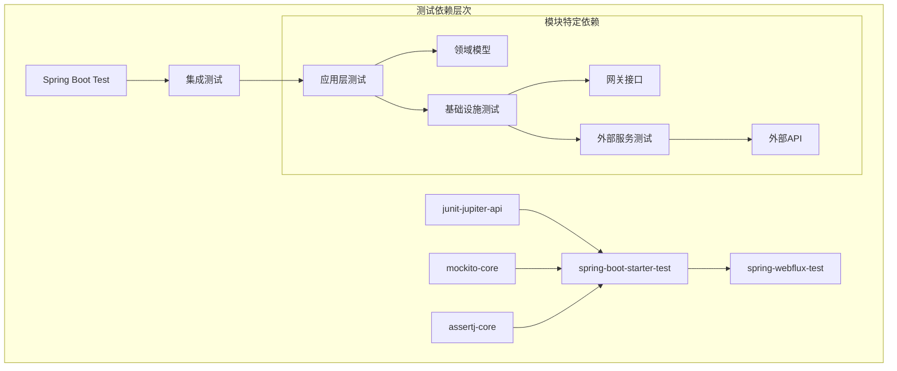

# 测试基础设施

<cite>
**本文档引用的文件**
- [pom.xml](file://pom.xml)
- [ci.yml](file://.github/workflows/ci.yml)
- [mvnw.cmd](file://mvnw.cmd)
- [TravelAgentSmokeIntegrationTest.java](file://travel-agent-app/src/test/java/com/travalagent/app/integration/TravelAgentSmokeIntegrationTest.java)
- [ConversationControllerTest.java](file://travel-agent-app/src/test/java/com/travalagent/app/controller/ConversationControllerTest.java)
- [ConversationApplicationServiceTest.java](file://travel-agent-app/src/test/java/com/travalagent/app/service/ConversationApplicationServiceTest.java)
- [ConversationWorkflowTest.java](file://travel-agent-app/src/test/java/com/travalagent/app/service/ConversationWorkflowTest.java)
- [AmapHttpGatewayTest.java](file://travel-agent-amap/src/test/java/com/travalagent/amap/gateway/AmapHttpGatewayTest.java)
- [AmapMcpServerIntegrationTest.java](file://travel-agent-amap-mcp-server/src/test/java/com/travalagent/amap/mcp/server/AmapMcpServerIntegrationTest.java)
- [ConstraintDrivenTravelPlanBuilderTest.java](file://travel-agent-infrastructure/src/test/java/com/travalagent/infrastructure/gateway/llm/ConstraintDrivenTravelPlanBuilderTest.java)
- [LocalTravelKnowledgeRepositoryTest.java](file://travel-agent-infrastructure/src/test/java/com/travalagent/infrastructure/repository/LocalTravelKnowledgeRepositoryTest.java)
- [AmapMcpGatewayTest.java](file://travel-agent-infrastructure/src/test/java/com/travalagent/infrastructure/gateway/tool/AmapMcpGatewayTest.java)
- [RoutingTravelKnowledgeRepositoryTest.java](file://travel-agent-infrastructure/src/test/java/com/travalagent/infrastructure/repository/RoutingTravelKnowledgeRepositoryTest.java)
</cite>

## 目录
1. [简介](#简介)
2. [项目结构](#项目结构)
3. [核心组件](#核心组件)
4. [架构概览](#架构概览)
5. [详细组件分析](#详细组件分析)
6. [依赖分析](#依赖分析)
7. [性能考虑](#性能考虑)
8. [故障排除指南](#故障排除指南)
9. [结论](#结论)

## 简介

TravelAgent项目的测试基础设施是一个全面、分层的测试框架，涵盖了从单元测试到集成测试的完整测试金字塔。该项目采用Spring Boot和JUnit 5作为主要测试框架，结合Mockito进行模拟测试，以及WebTestClient进行Web层测试。

测试基础设施的主要特点包括：
- 分层测试策略：单元测试、集成测试、端到端测试
- 模块化设计：针对不同模块的专门测试
- 自动化CI/CD集成：GitHub Actions工作流
- 全面的功能覆盖：从API层到业务逻辑层的完整测试

## 项目结构

项目采用多模块Maven结构，每个模块都有独立的测试套件：

**图表来源**
- [pom.xml:1-58](file://pom.xml#L1-L58)
- [ci.yml:1-60](file://.github/workflows/ci.yml#L1-L60)

**章节来源**
- [pom.xml:1-58](file://pom.xml#L1-L58)
- [ci.yml:1-60](file://.github/workflows/ci.yml#L1-L60)

## 核心组件

### 测试框架配置

项目使用以下核心测试技术栈：

- **JUnit 5**: 主要的测试框架，提供注解驱动的测试方法
- **Spring Boot Test**: 提供Spring应用上下文的集成测试支持
- **Mockito**: 用于创建和配置模拟对象
- **WebTestClient**: 用于Web层的HTTP请求测试
- **AssertJ**: 提供丰富的断言库

### 测试分类

**章节来源**
- [TravelAgentSmokeIntegrationTest.java:1-151](file://travel-agent-app/src/test/java/com/travalagent/app/integration/TravelAgentSmokeIntegrationTest.java#L1-L151)
- [ConversationControllerTest.java:1-214](file://travel-agent-app/src/test/java/com/travalagent/app/controller/ConversationControllerTest.java#L1-L214)

## 架构概览

测试基础设施采用分层架构，确保测试的可维护性和可扩展性：

**图表来源**
- [ConversationWorkflowTest.java:1-421](file://travel-agent-app/src/test/java/com/travalagent/app/service/ConversationWorkflowTest.java#L1-L421)
- [AmapMcpGatewayTest.java:1-134](file://travel-agent-infrastructure/src/test/java/com/travalagent/infrastructure/gateway/tool/AmapMcpGatewayTest.java#L1-L134)

## 详细组件分析

### 应用层测试组件

#### 控制器层测试

控制器测试专注于API端点的行为验证：

**图表来源**
- [ConversationControllerTest.java:34-92](file://travel-agent-app/src/test/java/com/travalagent/app/controller/ConversationControllerTest.java#L34-L92)

#### 服务层测试

服务层测试验证核心业务逻辑：

**图表来源**
- [ConversationApplicationServiceTest.java:26-106](file://travel-agent-app/src/test/java/com/travalagent/app/service/ConversationApplicationServiceTest.java#L26-L106)
- [ConversationWorkflowTest.java:85-188](file://travel-agent-app/src/test/java/com/travalagent/app/service/ConversationWorkflowTest.java#L85-L188)

**章节来源**
- [ConversationControllerTest.java:1-214](file://travel-agent-app/src/test/java/com/travalagent/app/controller/ConversationControllerTest.java#L1-L214)
- [ConversationApplicationServiceTest.java:1-108](file://travel-agent-app/src/test/java/com/travalagent/app/service/ConversationApplicationServiceTest.java#L1-L108)
- [ConversationWorkflowTest.java:1-421](file://travel-agent-app/src/test/java/com/travalagent/app/service/ConversationWorkflowTest.java#L1-L421)

### 基础设施层测试组件

#### 知识库检索测试

知识库测试验证智能检索和路由机制：

**图表来源**
- [RoutingTravelKnowledgeRepositoryTest.java:17-80](file://travel-agent-infrastructure/src/test/java/com/travalagent/infrastructure/repository/RoutingTravelKnowledgeRepositoryTest.java#L17-L80)

#### LLM代理测试

LLM代理测试验证旅行规划能力：

**图表来源**
- [TravelPlannerAgentTest.java:44-151](file://travel-agent-infrastructure/src/test/java/com/travalagent/infrastructure/gateway/llm/TravelPlannerAgentTest.java#L44-L151)
- [ConstraintDrivenTravelPlanBuilderTest.java:19-52](file://travel-agent-infrastructure/src/test/java/com/travalagent/infrastructure/gateway/llm/ConstraintDrivenTravelPlanBuilderTest.java#L19-L52)

**章节来源**
- [RoutingTravelKnowledgeRepositoryTest.java:1-107](file://travel-agent-infrastructure/src/test/java/com/travalagent/infrastructure/repository/RoutingTravelKnowledgeRepositoryTest.java#L1-L107)
- [ConstraintDrivenTravelPlanBuilderTest.java:1-82](file://travel-agent-infrastructure/src/test/java/com/travalagent/infrastructure/gateway/llm/ConstraintDrivenTravelPlanBuilderTest.java#L1-L82)
- [TravelPlannerAgentTest.java:1-229](file://travel-agent-infrastructure/src/test/java/com/travalagent/infrastructure/gateway/llm/TravelPlannerAgentTest.java#L1-L229)

### 外部服务测试组件

#### 高德地图网关测试

高德地图网关测试验证API调用和错误处理：

**图表来源**
- [AmapHttpGatewayTest.java:16-39](file://travel-agent-amap/src/test/java/com/travalagent/amap/gateway/AmapHttpGatewayTest.java#L16-L39)

#### MCP服务器集成测试

MCP服务器测试验证JSON-RPC协议实现：

**图表来源**
- [AmapMcpServerIntegrationTest.java:32-75](file://travel-agent-amap-mcp-server/src/test/java/com/travalagent/amap/mcp/server/AmapMcpServerIntegrationTest.java#L32-L75)

**章节来源**
- [AmapHttpGatewayTest.java:1-58](file://travel-agent-amap/src/test/java/com/travalagent/amap/gateway/AmapHttpGatewayTest.java#L1-L58)
- [AmapMcpServerIntegrationTest.java:1-135](file://travel-agent-amap-mcp-server/src/test/java/com/travalagent/amap/mcp/server/AmapMcpServerIntegrationTest.java#L1-L135)

## 依赖分析

测试基础设施的依赖关系体现了清晰的分层架构：

**图表来源**
- [pom.xml:46-56](file://pom.xml#L46-L56)

**章节来源**
- [pom.xml:1-58](file://pom.xml#L1-L58)

## 性能考虑

测试基础设施在性能方面采用了多项优化策略：

### 并行测试执行
- 使用JUnit 5的并发测试支持
- 避免测试间的资源竞争
- 合理的测试隔离策略

### 内存管理
- 集成测试中使用SQLite内存数据库
- 动态属性注册减少配置开销
- 及时清理测试资源

### 测试数据管理
- 使用Mock对象避免真实外部依赖
- 测试数据的最小化原则
- 重复使用测试数据集

## 故障排除指南

### 常见测试问题

#### 集成测试失败
当集成测试失败时，首先检查以下方面：
- 数据库连接配置是否正确
- 外部服务API密钥设置
- 网络连接和防火墙设置

#### Mock对象行为异常
如果Mock对象行为不符合预期：
- 验证Mockito配置
- 检查参数匹配器使用
- 确认方法调用顺序

#### CI/CD环境问题
在GitHub Actions环境中遇到问题：
- 检查Java版本兼容性
- 验证依赖缓存配置
- 确认网络访问权限

**章节来源**
- [ci.yml:13-33](file://.github/workflows/ci.yml#L13-L33)
- [mvnw.cmd:34-50](file://mvnw.cmd#L34-L50)

## 结论

TravelAgent项目的测试基础设施展现了现代Java项目的最佳实践：

### 主要优势
- **完整的测试金字塔**：从单元测试到端到端测试的全面覆盖
- **模块化设计**：针对不同层次和模块的专门测试
- **自动化CI/CD**：与GitHub Actions的无缝集成
- **高质量断言**：使用AssertJ提供丰富的断言能力

### 技术亮点
- **Spring Boot Test**：充分利用Spring生态系统的测试支持
- **Mockito集成**：优雅的模拟对象管理
- **WebTestClient**：现代化的Web层测试工具
- **分层架构**：清晰的测试组织结构

### 改进建议
- 考虑添加更多的性能测试
- 增加代码覆盖率监控
- 实施测试数据管理策略
- 扩展可视化测试报告

该测试基础设施为项目的持续发展提供了坚实的基础，确保了代码质量和系统稳定性。