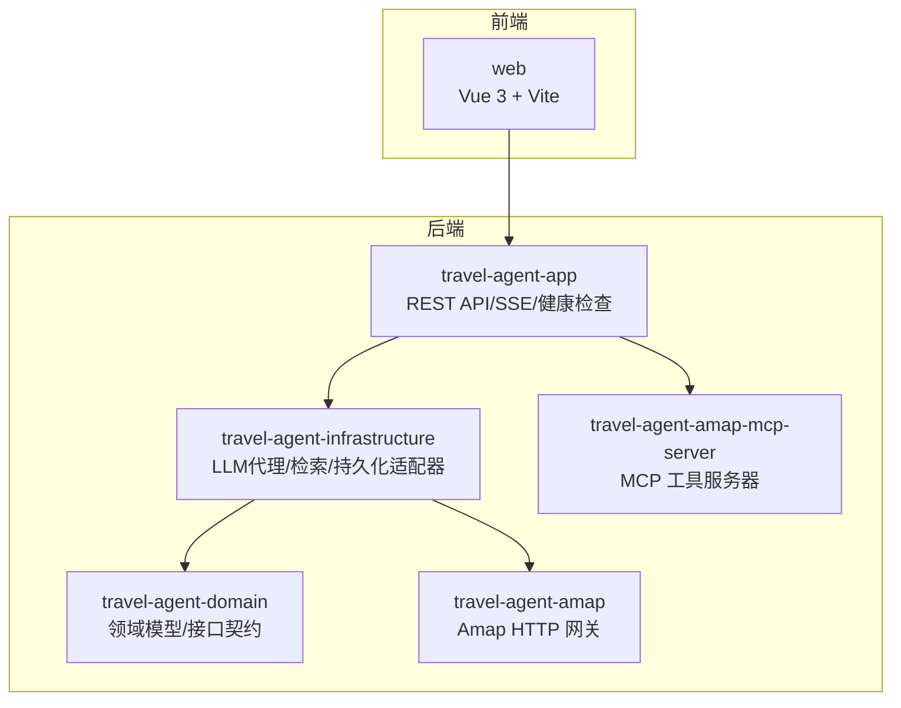
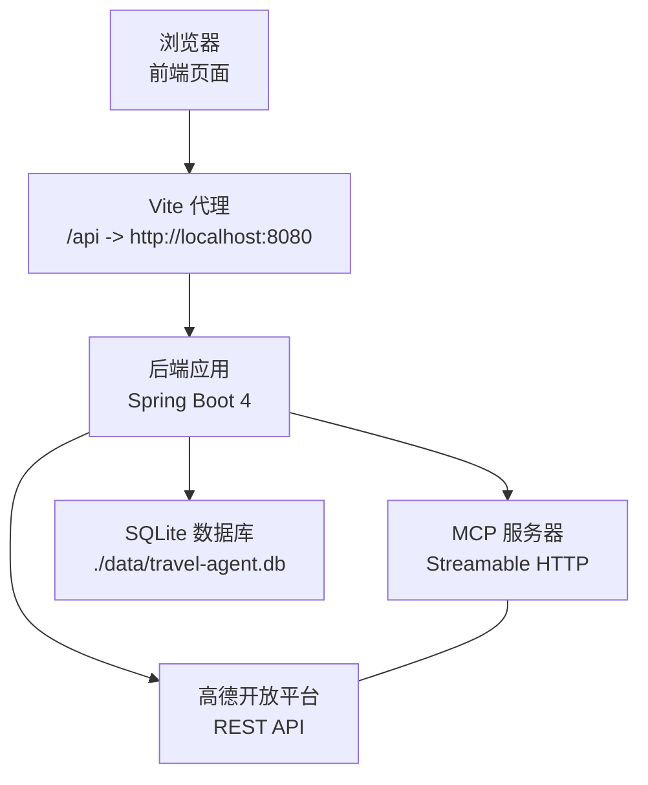
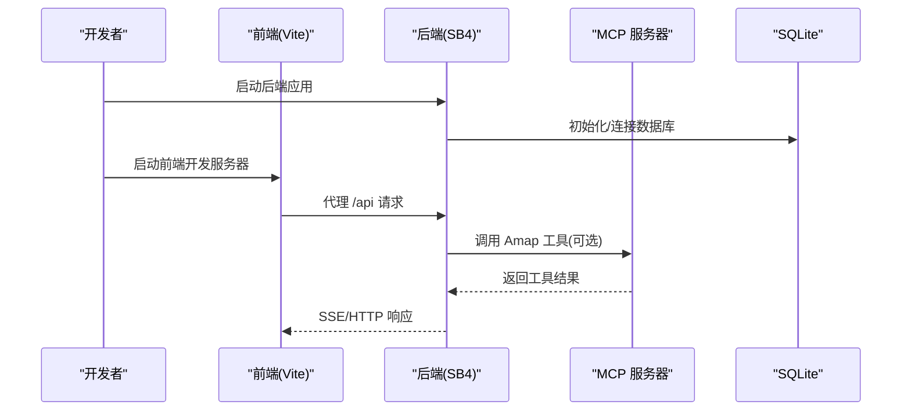
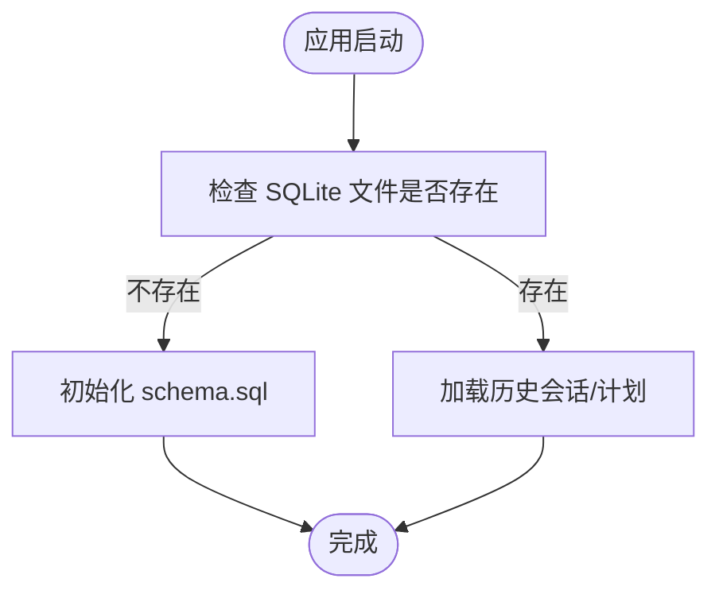

# 快速开始

<cite>
**本文引用的文件**
- [README.md](file://README.md)
- [pom.xml](file://pom.xml)
- [application.yml](file://travel-agent-app/src/main/resources/application.yml)
- [schema.sql](file://travel-agent-app/src/main/resources/schema.sql)
- [AmapProperties.java](file://travel-agent-amap/src/main/java/com/travalagent/amap/config/AmapProperties.java)
- [TravelAgentProperties.java](file://travel-agent-infrastructure/src/main/java/com/travalagent/infrastructure/config/TravelAgentProperties.java)
- [package.json](file://web/package.json)
- [vite.config.ts](file://web/vite.config.ts)
- [server.mjs](file://web/server.mjs)
- [Dockerfile.mcp](file://Dockerfile.mcp)
- [web/Dockerfile](file://web/Dockerfile)
- [docker-compose.app.yml](file://docker-compose.app.yml)
- [Amap MCP Server README.md](file://travel-agent-amap-mcp-server/README.md)
</cite>

## 目录
1. [简介](#简介)
2. [项目结构](#项目结构)
3. [核心组件](#核心组件)
4. [架构总览](#架构总览)
5. [详细组件分析](#详细组件分析)
6. [依赖分析](#依赖分析)
7. [性能考虑](#性能考虑)
8. [故障排除指南](#故障排除指南)
9. [结论](#结论)
10. [附录](#附录)

## 简介
本指南面向首次接触 TravelAgent 的开发者与使用者，帮助你在最短时间内完成环境准备、配置与启动，体验从对话到结构化行程的完整工作流。你将学会：
- 安装与验证 Java 21、Node.js、Docker Desktop（可选）
- 配置必要的环境变量（OpenAI API 密钥、高德地图 API 密钥等）
- 启动后端、前端与可选的 MCP 服务器
- 访问默认端点并停止服务
- 常见问题排查与优化建议

## 项目结构
TravelAgent 采用多模块 Maven 架构，包含后端应用、领域层、基础设施层、Amap 集成、独立 MCP 服务器以及 Vue 前端。下图展示主要模块与其职责关系。

图表来源
- [pom.xml](file://pom.xml)
- [README.md](file://README.md)

章节来源
- [pom.xml](file://pom.xml)
- [README.md](file://README.md)

## 核心组件
- 后端应用（travel-agent-app）：提供 REST API、SSE 流式事件、健康检查与会话工作流。
- 基础设施（travel-agent-infrastructure）：实现 LLM 专家代理、检索、校验修复、计划构建与 Amap 工具集成。
- Amap 集成（travel-agent-amap）：通过 HTTP 调用高德开放平台能力。
- MCP 服务器（travel-agent-amap-mcp-server）：以 Streamable HTTP 暴露 Amap 工具（天气、地理编码、公交路线等）。
- 前端（web）：Vue 3 应用，使用 Vite 开发，代理转发 /api 到后端。

章节来源
- [README.md](file://README.md)
- [application.yml](file://travel-agent-app/src/main/resources/application.yml)
- [AmapProperties.java](file://travel-agent-amap/src/main/java/com/travalagent/amap/config/AmapProperties.java)
- [TravelAgentProperties.java](file://travel-agent-infrastructure/src/main/java/com/travalagent/infrastructure/config/TravelAgentProperties.java)
- [package.json](file://web/package.json)
- [vite.config.ts](file://web/vite.config.ts)

## 架构总览
下图展示系统在本地开发时的典型交互：前端通过 Vite 代理访问后端；后端根据配置选择工具提供方（MCP 或本地），并通过 Amap 获取地理与天气信息；SQLite 存储会话与计划数据。

图表来源
- [vite.config.ts](file://web/vite.config.ts)
- [application.yml](file://travel-agent-app/src/main/resources/application.yml)
- [schema.sql](file://travel-agent-app/src/main/resources/schema.sql)

章节来源
- [vite.config.ts](file://web/vite.config.ts)
- [application.yml](file://travel-agent-app/src/main/resources/application.yml)
- [schema.sql](file://travel-agent-app/src/main/resources/schema.sql)

## 详细组件分析

### 环境准备与验证
- Java 21
  - Maven POM 显式声明 Java 版本为 21，并使用 Maven Wrapper 运行。
  - 建议使用与 Maven 配置一致的 JDK 版本，避免编译或运行期不兼容。
- Node.js 与 npm
  - 前端使用 Vite，package.json 提供开发、构建与测试脚本。
- Docker Desktop（可选）
  - 若需要 Milvus 或容器化部署，需安装 Docker Desktop。
  - 仓库提供 docker-compose.app.yml，用于一键编排后端应用、MCP 服务器与前端。

章节来源
- [pom.xml](file://pom.xml)
- [package.json](file://web/package.json)
- [docker-compose.app.yml](file://docker-compose.app.yml)

### 环境变量配置
你需要准备并设置以下关键环境变量（后端与前端均可能读取）：
- OpenAI 相关
  - SPRING_AI_OPENAI_API_KEY：OpenAI API 密钥
  - SPRING_AI_OPENAI_BASE_URL：OpenAI 兼容服务地址（可选，默认指向官方）
  - SPRING_AI_OPENAI_CHAT_MODEL：聊天模型名称（可选，默认 gpt-4.1-mini）
  - SPRING_AI_OPENAI_EMBEDDING_MODEL：嵌入模型名称（可选）
- 工具提供方与 MCP
  - TRAVEL_AGENT_TOOL_PROVIDER：工具提供方（LOCAL 或 MCP，默认 MCP）
  - TRAVEL_AGENT_AMAP_MCP_ENABLED：是否启用 MCP（默认 true）
  - TRAVEL_AGENT_AMAP_MCP_INITIALIZED：是否已初始化（默认 true）
  - TRAVEL_AGENT_AMAP_MCP_BASE_URL：MCP 服务器基础地址（默认 http://localhost:8090）
  - TRAVEL_AGENT_AMAP_MCP_ENDPOINT：MCP 端点路径（默认 /mcp）
- 高德地图
  - TRAVEL_AGENT_AMAP_API_KEY：高德 Web 服务密钥
  - TRAVEL_AGENT_AMAP_BASE_URL：高德 REST API 地址（默认 https://restapi.amap.com）
  - TRAVEL_AGENT_AMAP_REQUESTS_PER_SECOND：限流请求速率（默认 3.0）
- 允许的前端源
  - TRAVEL_AGENT_ALLOWED_ORIGIN：允许跨域的前端地址（默认 http://localhost:5173）
- 内存与向量存储（可选）
  - TRAVEL_AGENT_MEMORY_PROVIDER：内存提供方（AUTO/SQLITE/MILVUS，默认 AUTO）
  - TRAVEL_AGENT_MILVUS_ENABLED/URI/USERNAME/PASSWORD/DATABASE/COLLECTION 等（可选）
- 前端构建参数（Docker 构建时）
  - VITE_AMAP_WEB_KEY、VITE_AMAP_SECURITY_JS_CODE：高德 JS 安全校验相关参数

提示
- 后端配置文件 application.yml 中大量使用占位符 ${VAR:默认值}，未设置时将采用默认值。
- 前端 Vite 默认开发端口为 5173，可通过 vite.config.ts 的 server.port 修改。

章节来源
- [application.yml](file://travel-agent-app/src/main/resources/application.yml)
- [AmapProperties.java](file://travel-agent-amap/src/main/java/com/travalagent/amap/config/AmapProperties.java)
- [TravelAgentProperties.java](file://travel-agent-infrastructure/src/main/java/com/travalagent/infrastructure/config/TravelAgentProperties.java)
- [vite.config.ts](file://web/vite.config.ts)
- [web/Dockerfile](file://web/Dockerfile)

### 启动流程

#### 1) 启动后端应用
- 使用 Maven Wrapper 在 travel-agent-app 模块启动 Spring Boot 应用。
- 默认监听端口 8080，数据库文件位于 ./data/travel-agent.db。
- 可通过命令行传入 OpenAI 密钥等变量进行覆盖。

参考命令
- 在根目录执行：
  - 后端启动：./mvnw -pl travel-agent-app -am spring-boot:run
  - 可选：带 OpenAI 密钥启动：SPRING_AI_OPENAI_API_KEY="<你的密钥>" ./mvnw -pl travel-agent-app -am spring-boot:run

章节来源
- [README.md](file://README.md)
- [application.yml](file://travel-agent-app/src/main/resources/application.yml)
- [schema.sql](file://travel-agent-app/src/main/resources/schema.sql)

#### 2) 启动前端应用
- 进入 web 目录，安装依赖并启动开发服务器。
- Vite 默认端口 5173，代理将 /api 请求转发至后端 8080。
- 如需自定义端口，可在 vite.config.ts 中修改 server.port。

参考命令
- cd web
- npm ci
- npm run dev

章节来源
- [package.json](file://web/package.json)
- [vite.config.ts](file://web/vite.config.ts)

#### 3) 可选：启动 MCP 服务器
- MCP 服务器提供 Amap 工具（天气、地理编码、公交路线等）。
- 默认监听 8090 端口，端点为 /mcp。
- 需要设置 TRAVEL_AGENT_AMAP_API_KEY 并确保后端能访问该地址。

参考命令
- ./mvnw -pl travel-agent-amap-mcp-server -am spring-boot:run
- 或在 MCP 服务器中设置密钥后启动

章节来源
- [Amap MCP Server README.md](file://travel-agent-amap-mcp-server/README.md)
- [application.yml](file://travel-agent-app/src/main/resources/application.yml)

#### 4) 默认端点与访问方式
- 后端：http://localhost:8080
- 前端：http://localhost:5173
- 健康检查：http://localhost:8080/actuator/health
- 前端健康探针：http://localhost:5173/healthz（由 server.mjs 提供）

章节来源
- [application.yml](file://travel-agent-app/src/main/resources/application.yml)
- [vite.config.ts](file://web/vite.config.ts)
- [server.mjs](file://web/server.mjs)

#### 5) 停止服务
- 在各终端按 Ctrl + C 停止后端、前端与 MCP（如已启动）。
- Docker 编排场景下，使用 docker compose 停止对应服务。

章节来源
- [README.md](file://README.md)

### 关键流程图解

#### 启动序列（含 MCP）

图表来源
- [vite.config.ts](file://web/vite.config.ts)
- [application.yml](file://travel-agent-app/src/main/resources/application.yml)
- [Amap MCP Server README.md](file://travel-agent-amap-mcp-server/README.md)

#### 数据库初始化流程

图表来源
- [schema.sql](file://travel-agent-app/src/main/resources/schema.sql)
- [application.yml](file://travel-agent-app/src/main/resources/application.yml)

## 依赖分析
- 后端技术栈
  - Java 21、Spring Boot 4、Spring WebFlux、Actuator、Spring AI 2.0
  - OpenAI 兼容聊天与嵌入、MCP 客户端、SQLite、可选 Milvus
- 前端技术栈
  - Vue 3、TypeScript、Vite、Pinia、Vitest
- 运维与打包
  - Docker、Docker Compose、Nginx（生产镜像）

章节来源
- [README.md](file://README.md)
- [pom.xml](file://pom.xml)
- [web/Dockerfile](file://web/Dockerfile)
- [Dockerfile.mcp](file://Dockerfile.mcp)
- [docker-compose.app.yml](file://docker-compose.app.yml)

## 性能考虑
- 限流与稳定性
  - 高德请求速率默认 3.0 RPS，可根据配额调整 TRAVEL_AGENT_AMAP_REQUESTS_PER_SECOND。
- 内存窗口与摘要阈值
  - memoryWindow 与 summaryThreshold 控制上下文长度与摘要触发频率，影响响应速度与准确性。
- 向量存储
  - Milvus 可提升检索性能，但需额外资源与运维成本；默认关闭。
- 前端代理
  - Vite 代理仅用于开发，生产请使用 Nginx 或反向代理。

章节来源
- [application.yml](file://travel-agent-app/src/main/resources/application.yml)
- [TravelAgentProperties.java](file://travel-agent-infrastructure/src/main/java/com/travalagent/infrastructure/config/TravelAgentProperties.java)

## 故障排除指南
- 后端无法启动或端口占用
  - 确认 8080 端口未被占用；必要时修改 server.port 或停止占用进程。
- 前端无法访问后端 API
  - 检查 vite.config.ts 的代理配置是否正确指向 http://localhost:8080。
  - 确认后端已启动且 /actuator/health 返回可用状态。
- OpenAI 配置错误
  - 确保 SPRING_AI_OPENAI_API_KEY 已设置；若使用自建兼容服务，请设置 SPRING_AI_OPENAI_BASE_URL 与模型名。
- MCP 工具不可用
  - 若启用 MCP（TRAVEL_AGENT_TOOL_PROVIDER=MCP），需同时启动 MCP 服务器并设置 TRAVEL_AGENT_AMAP_API_KEY。
  - 检查 TRAVEL_AGENT_AMAP_MCP_BASE_URL 与端点 /mcp 是否可达。
- 高德地图调用失败
  - 设置 TRAVEL_AGENT_AMAP_API_KEY；若密钥缺失，配置文件允许在缺钥或出错时进行模拟（mock）。
- 数据库初始化失败
  - 确认 ./data 目录可写；schema.sql 将在首次启动时自动执行。
- 前端静态资源 404
  - 使用 npm run build 生成 dist 后再通过 server.mjs 预览或使用 Nginx 提供服务。
- Docker 编排问题
  - 确认 docker-compose.app.yml 中的环境变量已正确注入；必要时使用 docker compose --profile mcp 启用 MCP 服务。

章节来源
- [application.yml](file://travel-agent-app/src/main/resources/application.yml)
- [AmapProperties.java](file://travel-agent-amap/src/main/java/com/travalagent/amap/config/AmapProperties.java)
- [vite.config.ts](file://web/vite.config.ts)
- [server.mjs](file://web/server.mjs)
- [docker-compose.app.yml](file://docker-compose.app.yml)

## 结论
按照本指南完成环境准备与配置后，你可以在本地快速启动 TravelAgent 的后端、前端与可选 MCP 服务器，并通过默认端点进行交互。遇到问题时，优先检查环境变量、端口占用与代理配置，结合健康检查与日志定位问题。

## 附录

### 环境变量一览表
- OpenAI
  - SPRING_AI_OPENAI_API_KEY
  - SPRING_AI_OPENAI_BASE_URL
  - SPRING_AI_OPENAI_CHAT_MODEL
  - SPRING_AI_OPENAI_EMBEDDING_MODEL
- 工具提供方与 MCP
  - TRAVEL_AGENT_TOOL_PROVIDER
  - TRAVEL_AGENT_AMAP_MCP_ENABLED
  - TRAVEL_AGENT_AMAP_MCP_INITIALIZED
  - TRAVEL_AGENT_AMAP_MCP_BASE_URL
  - TRAVEL_AGENT_AMAP_MCP_ENDPOINT
- 高德地图
  - TRAVEL_AGENT_AMAP_API_KEY
  - TRAVEL_AGENT_AMAP_BASE_URL
  - TRAVEL_AGENT_AMAP_REQUESTS_PER_SECOND
- 跨域与前端
  - TRAVEL_AGENT_ALLOWED_ORIGIN
- 内存与向量存储
  - TRAVEL_AGENT_MEMORY_PROVIDER
  - TRAVEL_AGENT_MILVUS_*（可选）
- 前端构建参数
  - VITE_AMAP_WEB_KEY
  - VITE_AMAP_SECURITY_JS_CODE

章节来源
- [application.yml](file://travel-agent-app/src/main/resources/application.yml)
- [AmapProperties.java](file://travel-agent-amap/src/main/java/com/travalagent/amap/config/AmapProperties.java)
- [TravelAgentProperties.java](file://travel-agent-infrastructure/src/main/java/com/travalagent/infrastructure/config/TravelAgentProperties.java)
- [web/Dockerfile](file://web/Dockerfile)