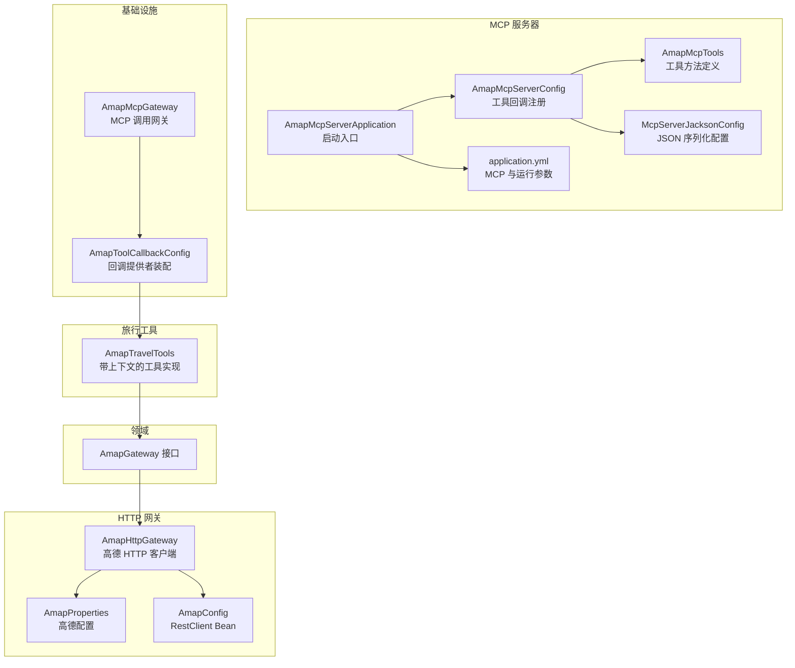
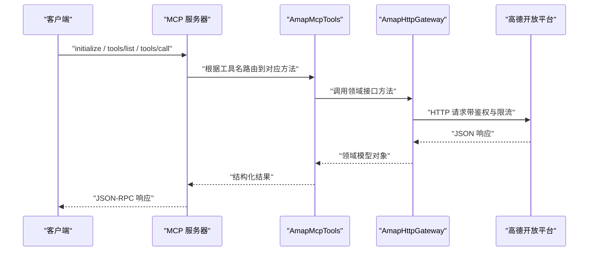
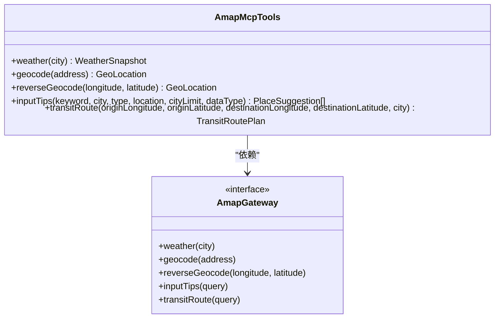
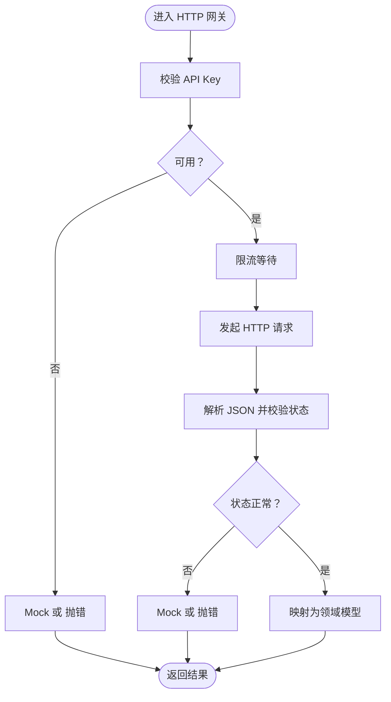
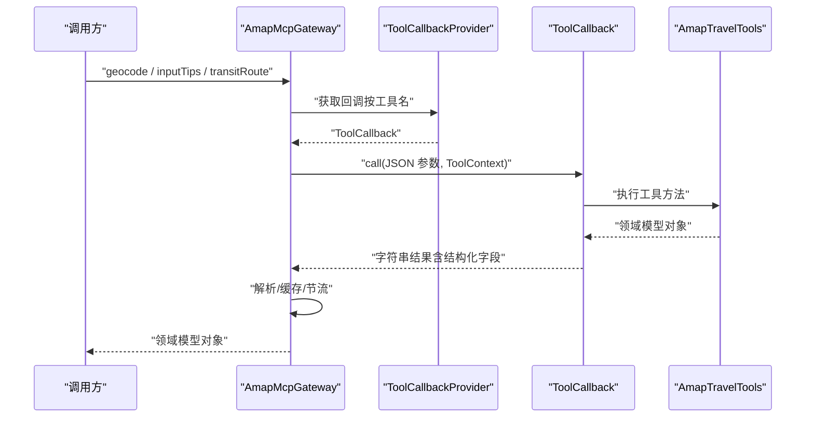
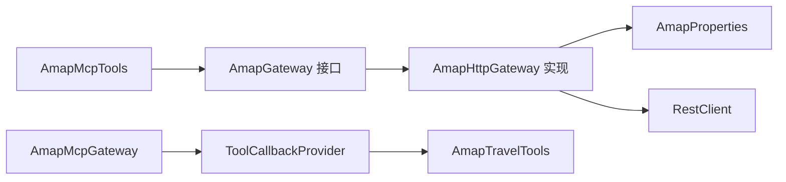

# 工具集成开发

<cite>
**本文引用的文件**
- [AmapMcpServerApplication.java](file://travel-agent-amap-mcp-server/src/main/java/com/travalagent/amap/mcp/server/AmapMcpServerApplication.java)
- [AmapMcpServerConfig.java](file://travel-agent-amap-mcp-server/src/main/java/com/travalagent/amap/mcp/server/AmapMcpServerConfig.java)
- [AmapMcpTools.java](file://travel-agent-amap-mcp-server/src/main/java/com/travalagent/amap/mcp/server/AmapMcpTools.java)
- [McpServerJacksonConfig.java](file://travel-agent-amap-mcp-server/src/main/java/com/travalagent/amap/mcp/server/McpServerJacksonConfig.java)
- [application.yml](file://travel-agent-amap-mcp-server/src/main/resources/application.yml)
- [README.md](file://travel-agent-amap-mcp-server/README.md)
- [AmapHttpGateway.java](file://travel-agent-amap/src/main/java/com/travalagent/amap/gateway/AmapHttpGateway.java)
- [AmapConfig.java](file://travel-agent-amap/src/main/java/com/travalagent/amap/config/AmapConfig.java)
- [AmapProperties.java](file://travel-agent-amap/src/main/java/com/travalagent/amap/config/AmapProperties.java)
- [AmapGateway.java](file://travel-agent-domain/src/main/java/com/travalagent/domain/gateway/AmapGateway.java)
- [AmapTravelTools.java](file://travel-agent-infrastructure/src/main/java/com/travalagent/infrastructure/gateway/tool/AmapTravelTools.java)
- [AmapMcpGateway.java](file://travel-agent-infrastructure/src/main/java/com/travalagent/infrastructure/gateway/tool/AmapMcpGateway.java)
- [AmapToolCallbackConfig.java](file://travel-agent-infrastructure/src/main/java/com/travalagent/infrastructure/config/AmapToolCallbackConfig.java)
- [AmapMcpServerIntegrationTest.java](file://travel-agent-amap-mcp-server/src/test/java/com/travalagent/amap/mcp/server/AmapMcpServerIntegrationTest.java)
- [AmapMcpGatewayTest.java](file://travel-agent-infrastructure/src/test/java/com/travalagent/infrastructure/gateway/tool/AmapMcpGatewayTest.java)
</cite>

## 目录
1. [引言](#引言)
2. [项目结构](#项目结构)
3. [核心组件](#核心组件)
4. [架构总览](#架构总览)
5. [详细组件分析](#详细组件分析)
6. [依赖分析](#依赖分析)
7. [性能考虑](#性能考虑)
8. [故障排查指南](#故障排查指南)
9. [结论](#结论)
10. [附录](#附录)

## 引言
本指南面向需要在旅行智能体系统中集成工具（尤其是高德地图能力）的开发者，围绕 Model Context Protocol（MCP）协议实现与工具链集成展开。内容涵盖：
- MCP 服务器的启动配置与工具注册机制
- AmapMcpTools 工具集的设计模式与参数/返回值处理
- HTTP 网关与 MCP 服务器的集成方式（请求转换、响应处理、错误映射）
- 自定义工具开发的全流程（接口定义、实现类、注册与测试）
- 工具调用的上下文管理、回调机制与性能监控

## 项目结构
该仓库采用多模块结构，与工具集成密切相关的模块如下：
- travel-agent-amap-mcp-server：MCP 协议服务器，暴露工具能力
- travel-agent-amap：高德 HTTP 网关与配置
- travel-agent-domain：领域网关接口定义
- travel-agent-infrastructure：工具回调配置、MCP 网关与旅行工具实现
- travel-agent-app：应用入口与控制器（非本次重点）

图表来源
- [AmapMcpServerApplication.java:1-15](file://travel-agent-amap-mcp-server/src/main/java/com/travalagent/amap/mcp/server/AmapMcpServerApplication.java#L1-L15)
- [AmapMcpServerConfig.java:1-18](file://travel-agent-amap-mcp-server/src/main/java/com/travalagent/amap/mcp/server/AmapMcpServerConfig.java#L1-L18)
- [AmapMcpTools.java:1-104](file://travel-agent-amap-mcp-server/src/main/java/com/travalagent/amap/mcp/server/AmapMcpTools.java#L1-L104)
- [McpServerJacksonConfig.java:1-14](file://travel-agent-amap-mcp-server/src/main/java/com/travalagent/amap/mcp/server/McpServerJacksonConfig.java#L1-L14)
- [application.yml:1-35](file://travel-agent-amap-mcp-server/src/main/resources/application.yml#L1-L35)
- [AmapMcpGateway.java:1-196](file://travel-agent-infrastructure/src/main/java/com/travalagent/infrastructure/gateway/tool/AmapMcpGateway.java#L1-L196)
- [AmapToolCallbackConfig.java:1-32](file://travel-agent-infrastructure/src/main/java/com/travalagent/infrastructure/config/AmapToolCallbackConfig.java#L1-L32)
- [AmapHttpGateway.java:1-481](file://travel-agent-amap/src/main/java/com/travalagent/amap/gateway/AmapHttpGateway.java#L1-L481)
- [AmapProperties.java:1-54](file://travel-agent-amap/src/main/java/com/travalagent/amap/config/AmapProperties.java#L1-L54)
- [AmapConfig.java:1-17](file://travel-agent-amap/src/main/java/com/travalagent/amap/config/AmapConfig.java#L1-L17)
- [AmapGateway.java:1-28](file://travel-agent-domain/src/main/java/com/travalagent/domain/gateway/AmapGateway.java#L1-L28)
- [AmapTravelTools.java:1-119](file://travel-agent-infrastructure/src/main/java/com/travalagent/infrastructure/gateway/tool/AmapTravelTools.java#L1-L119)

章节来源
- [AmapMcpServerApplication.java:1-15](file://travel-agent-amap-mcp-server/src/main/java/com/travalagent/amap/mcp/server/AmapMcpServerApplication.java#L1-L15)
- [application.yml:1-35](file://travel-agent-amap-mcp-server/src/main/resources/application.yml#L1-L35)

## 核心组件
- MCP 服务器启动与配置
  - 启动入口负责扫描包路径并加载配置属性
  - 工具回调通过 MethodToolCallbackProvider 注册到 Spring 容器
  - Jackson 配置确保 MCP 服务器序列化一致性
- 工具集设计
  - 使用注解声明工具名称与描述，参数使用 ToolParam 注解进行约束与说明
  - 参数校验与默认值处理在工具方法内部完成
  - 返回值为领域模型对象，便于上层统一消费
- HTTP 网关与领域接口
  - AmapGateway 接口定义工具契约
  - AmapHttpGateway 实现 HTTP 请求、参数拼装、响应解析与错误映射
- MCP 网关与回调装配
  - AmapMcpGateway 将 MCP 回调封装为可复用的工具调用器，支持缓存与节流
  - AmapToolCallbackConfig 根据配置选择本地工具或 MCP 远程工具

章节来源
- [AmapMcpServerApplication.java:1-15](file://travel-agent-amap-mcp-server/src/main/java/com/travalagent/amap/mcp/server/AmapMcpServerApplication.java#L1-L15)
- [AmapMcpServerConfig.java:1-18](file://travel-agent-amap-mcp-server/src/main/java/com/travalagent/amap/mcp/server/AmapMcpServerConfig.java#L1-L18)
- [McpServerJacksonConfig.java:1-14](file://travel-agent-amap-mcp-server/src/main/java/com/travalagent/amap/mcp/server/McpServerJacksonConfig.java#L1-L14)
- [AmapMcpTools.java:1-104](file://travel-agent-amap-mcp-server/src/main/java/com/travalagent/amap/mcp/server/AmapMcpTools.java#L1-L104)
- [AmapGateway.java:1-28](file://travel-agent-domain/src/main/java/com/travalagent/domain/gateway/AmapGateway.java#L1-L28)
- [AmapHttpGateway.java:1-481](file://travel-agent-amap/src/main/java/com/travalagent/amap/gateway/AmapHttpGateway.java#L1-L481)
- [AmapMcpGateway.java:1-196](file://travel-agent-infrastructure/src/main/java/com/travalagent/infrastructure/gateway/tool/AmapMcpGateway.java#L1-L196)
- [AmapToolCallbackConfig.java:1-32](file://travel-agent-infrastructure/src/main/java/com/travalagent/infrastructure/config/AmapToolCallbackConfig.java#L1-L32)

## 架构总览
下图展示了从客户端发起 MCP 请求到调用高德 HTTP 服务的整体流程，以及工具上下文与回调机制的协作。

图表来源
- [AmapMcpServerApplication.java:1-15](file://travel-agent-amap-mcp-server/src/main/java/com/travalagent/amap/mcp/server/AmapMcpServerApplication.java#L1-L15)
- [AmapMcpTools.java:1-104](file://travel-agent-amap-mcp-server/src/main/java/com/travalagent/amap/mcp/server/AmapMcpTools.java#L1-L104)
- [AmapHttpGateway.java:1-481](file://travel-agent-amap/src/main/java/com/travalagent/amap/gateway/AmapHttpGateway.java#L1-L481)

## 详细组件分析

### MCP 服务器启动与工具注册
- 启动类
  - 扫描 com.travalagent.amap 包，加载配置属性与工具回调
- 工具回调注册
  - 通过 MethodToolCallbackProvider 将 AmapMcpTools 的 @Tool 方法注册为 MCP 工具
- Jackson 配置
  - 注册模块以支持复杂类型序列化
- 配置文件要点
  - MCP 协议类型、同步/流式传输、端点路径
  - 管理端点暴露、健康检查
  - 高德 API Key、基础地址、是否在缺 Key 或错误时启用 Mock

章节来源
- [AmapMcpServerApplication.java:1-15](file://travel-agent-amap-mcp-server/src/main/java/com/travalagent/amap/mcp/server/AmapMcpServerApplication.java#L1-L15)
- [AmapMcpServerConfig.java:1-18](file://travel-agent-amap-mcp-server/src/main/java/com/travalagent/amap/mcp/server/AmapMcpServerConfig.java#L1-L18)
- [McpServerJacksonConfig.java:1-14](file://travel-agent-amap-mcp-server/src/main/java/com/travalagent/amap/mcp/server/McpServerJacksonConfig.java#L1-L14)
- [application.yml:1-35](file://travel-agent-amap-mcp-server/src/main/resources/application.yml#L1-L35)

### AmapMcpTools 工具集设计
- 设计模式
  - 使用 @Component 与 @Tool/@ToolParam 注解声明工具与参数
  - 参数校验与默认值处理集中在工具方法内，保证输入健壮性
- 工具方法族
  - 天气查询、地理编码、逆地理编码、地点提示、公交路线规划
- 参数与返回值
  - 参数通过 ToolParam 描述，返回值为领域模型对象（如 WeatherSnapshot、GeoLocation、PlaceSuggestion、TransitRoutePlan）
- 上下文与回调（对比旅行工具）
  - 本模块未直接使用 ToolContext；若需上下文追踪，可参考旅行工具中的实现

图表来源
- [AmapMcpTools.java:1-104](file://travel-agent-amap-mcp-server/src/main/java/com/travalagent/amap/mcp/server/AmapMcpTools.java#L1-L104)
- [AmapGateway.java:1-28](file://travel-agent-domain/src/main/java/com/travalagent/domain/gateway/AmapGateway.java#L1-L28)

章节来源
- [AmapMcpTools.java:1-104](file://travel-agent-amap-mcp-server/src/main/java/com/travalagent/amap/mcp/server/AmapMcpTools.java#L1-L104)

### HTTP 网关与错误映射
- 参数与限流
  - 统一注入 API Key，支持按 QPS 限流
- 请求与响应
  - 按接口组装查询参数，解析 JSON 并映射到领域模型
- 错误处理
  - 缺失 Key 时可选择抛错或 Mock
  - 请求失败时可选择抛错或 Mock
  - 对 Amap 返回的状态码进行校验与异常映射

图表来源
- [AmapHttpGateway.java:1-481](file://travel-agent-amap/src/main/java/com/travalagent/amap/gateway/AmapHttpGateway.java#L1-L481)
- [AmapProperties.java:1-54](file://travel-agent-amap/src/main/java/com/travalagent/amap/config/AmapProperties.java#L1-L54)

章节来源
- [AmapHttpGateway.java:1-481](file://travel-agent-amap/src/main/java/com/travalagent/amap/gateway/AmapHttpGateway.java#L1-L481)
- [AmapProperties.java:1-54](file://travel-agent-amap/src/main/java/com/travalagent/amap/config/AmapProperties.java#L1-L54)

### MCP 网关与回调机制
- AmapMcpGateway
  - 通过 ToolCallbackProvider 获取工具回调，按工具名路由
  - 支持会话级缓存（同一 conversationId 下相同参数复用结果）
  - 内置最小调用间隔节流，避免触发下游限流
  - 结果解析具备多种形态兼容（structuredContent、result、content 数组等）
- AmapToolCallbackConfig
  - 根据配置选择本地工具（MethodToolCallbackProvider）或 MCP 远程工具（SyncMcpToolCallbackProvider）
  - 当选择 MCP 但未发现远程提供者时抛出明确异常

图表来源
- [AmapMcpGateway.java:1-196](file://travel-agent-infrastructure/src/main/java/com/travalagent/infrastructure/gateway/tool/AmapMcpGateway.java#L1-L196)
- [AmapToolCallbackConfig.java:1-32](file://travel-agent-infrastructure/src/main/java/com/travalagent/infrastructure/config/AmapToolCallbackConfig.java#L1-L32)
- [AmapTravelTools.java:1-119](file://travel-agent-infrastructure/src/main/java/com/travalagent/infrastructure/gateway/tool/AmapTravelTools.java#L1-L119)

章节来源
- [AmapMcpGateway.java:1-196](file://travel-agent-infrastructure/src/main/java/com/travalagent/infrastructure/gateway/tool/AmapMcpGateway.java#L1-L196)
- [AmapToolCallbackConfig.java:1-32](file://travel-agent-infrastructure/src/main/java/com/travalagent/infrastructure/config/AmapToolCallbackConfig.java#L1-L32)
- [AmapTravelTools.java:1-119](file://travel-agent-infrastructure/src/main/java/com/travalagent/infrastructure/gateway/tool/AmapTravelTools.java#L1-L119)

### 工具调用上下文管理与性能监控
- 上下文管理
  - 旅行工具版本在工具方法中接收 ToolContext，并向时间线发布事件，便于追踪工具调用
  - MCP 网关在回调调用时传入 ToolContext，保持上下文一致
- 性能监控
  - HTTP 层：基于 QPS 的限流，避免超配额
  - MCP 层：固定最小调用间隔，减少频繁调用带来的抖动
  - 缓存：同一会话内相同参数的结果缓存，降低重复调用成本

章节来源
- [AmapTravelTools.java:106-117](file://travel-agent-infrastructure/src/main/java/com/travalagent/infrastructure/gateway/tool/AmapTravelTools.java#L106-L117)
- [AmapMcpGateway.java:102-123](file://travel-agent-infrastructure/src/main/java/com/travalagent/infrastructure/gateway/tool/AmapMcpGateway.java#L102-L123)
- [AmapHttpGateway.java:460-479](file://travel-agent-amap/src/main/java/com/travalagent/amap/gateway/AmapHttpGateway.java#L460-L479)

## 依赖分析
- 组件耦合
  - AmapMcpTools 依赖 AmapGateway 接口，便于替换实现
  - AmapMcpGateway 依赖 ToolCallbackProvider 与 ObjectMapper，解耦工具实现
  - AmapHttpGateway 依赖 RestClient、ObjectMapper 与 AmapProperties，集中配置与网络行为
- 外部依赖
  - 高德开放平台 API
  - Spring AI 的 MCP 与工具回调框架

图表来源
- [AmapMcpTools.java:1-104](file://travel-agent-amap-mcp-server/src/main/java/com/travalagent/amap/mcp/server/AmapMcpTools.java#L1-L104)
- [AmapGateway.java:1-28](file://travel-agent-domain/src/main/java/com/travalagent/domain/gateway/AmapGateway.java#L1-L28)
- [AmapHttpGateway.java:1-481](file://travel-agent-amap/src/main/java/com/travalagent/amap/gateway/AmapHttpGateway.java#L1-L481)
- [AmapMcpGateway.java:1-196](file://travel-agent-infrastructure/src/main/java/com/travalagent/infrastructure/gateway/tool/AmapMcpGateway.java#L1-L196)
- [AmapTravelTools.java:1-119](file://travel-agent-infrastructure/src/main/java/com/travalagent/infrastructure/gateway/tool/AmapTravelTools.java#L1-L119)
- [AmapProperties.java:1-54](file://travel-agent-amap/src/main/java/com/travalagent/amap/config/AmapProperties.java#L1-L54)
- [AmapConfig.java:1-17](file://travel-agent-amap/src/main/java/com/travalagent/amap/config/AmapConfig.java#L1-L17)

## 性能考虑
- 限流策略
  - HTTP 层：按配置的每秒请求数限制，避免被高德限流
  - MCP 层：固定最小调用间隔，平滑请求节奏
- 缓存策略
  - 同一会话内相同参数的工具调用结果缓存，显著降低重复请求
- 解析与序列化
  - 统一 Jackson 配置，减少序列化开销与不一致问题

## 故障排查指南
- 启动与端点
  - 确认 MCP 端口与端点配置正确
  - 使用 README 中的 curl 流程进行初始化与工具列表校验
- API Key 与 Mock
  - 若未设置 API Key，HTTP 网关可能抛错或进入 Mock；可通过配置项控制
- 结果解析
  - MCP 网关对多种返回结构有兼容处理；若解析失败，检查回调输出格式
- 单元与集成测试
  - 参考集成测试与单元测试，验证初始化、工具列表与天气调用流程

章节来源
- [README.md:1-60](file://travel-agent-amap-mcp-server/README.md#L1-L60)
- [AmapMcpServerIntegrationTest.java:1-135](file://travel-agent-amap-mcp-server/src/test/java/com/travalagent/amap/mcp/server/AmapMcpServerIntegrationTest.java#L1-L135)
- [AmapMcpGatewayTest.java:1-134](file://travel-agent-infrastructure/src/test/java/com/travalagent/infrastructure/gateway/tool/AmapMcpGatewayTest.java#L1-L134)

## 结论
本指南梳理了基于 MCP 的工具集成方案，覆盖了服务器启动、工具注册、HTTP 网关与错误映射、MCP 网关与回调机制、上下文管理与性能监控。通过清晰的接口与可插拔的实现，系统既能在本地直接调用，也能通过 MCP 远程复用工具能力，满足不同部署场景的需求。

## 附录

### 自定义工具开发流程
- 定义工具接口
  - 在领域层定义工具契约（已有示例：AmapGateway）
- 实现工具类
  - 使用注解声明工具方法与参数，必要时在工具方法内做参数校验与默认值处理
  - 返回领域模型对象，便于上层统一消费
- 注册与装配
  - 若为 MCP 服务器侧工具，通过 MethodToolCallbackProvider 注册
  - 若为应用侧工具，通过 AmapToolCallbackConfig 选择本地或 MCP 提供者
- 测试验证
  - 编写单元测试与集成测试，覆盖初始化、工具列表与典型调用路径

章节来源
- [AmapGateway.java:1-28](file://travel-agent-domain/src/main/java/com/travalagent/domain/gateway/AmapGateway.java#L1-L28)
- [AmapMcpTools.java:1-104](file://travel-agent-amap-mcp-server/src/main/java/com/travalagent/amap/mcp/server/AmapMcpTools.java#L1-L104)
- [AmapMcpServerConfig.java:1-18](file://travel-agent-amap-mcp-server/src/main/java/com/travalagent/amap/mcp/server/AmapMcpServerConfig.java#L1-L18)
- [AmapToolCallbackConfig.java:1-32](file://travel-agent-infrastructure/src/main/java/com/travalagent/infrastructure/config/AmapToolCallbackConfig.java#L1-L32)
- [AmapMcpGatewayTest.java:1-134](file://travel-agent-infrastructure/src/test/java/com/travalagent/infrastructure/gateway/tool/AmapMcpGatewayTest.java#L1-L134)