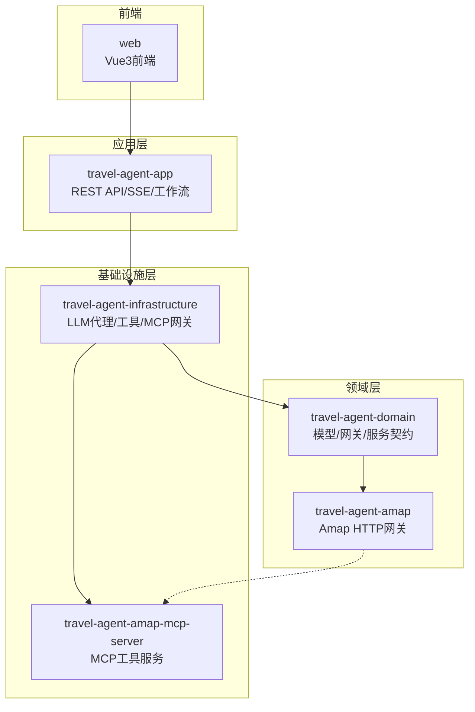
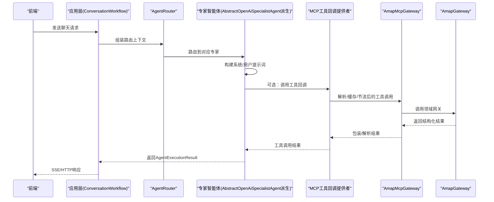
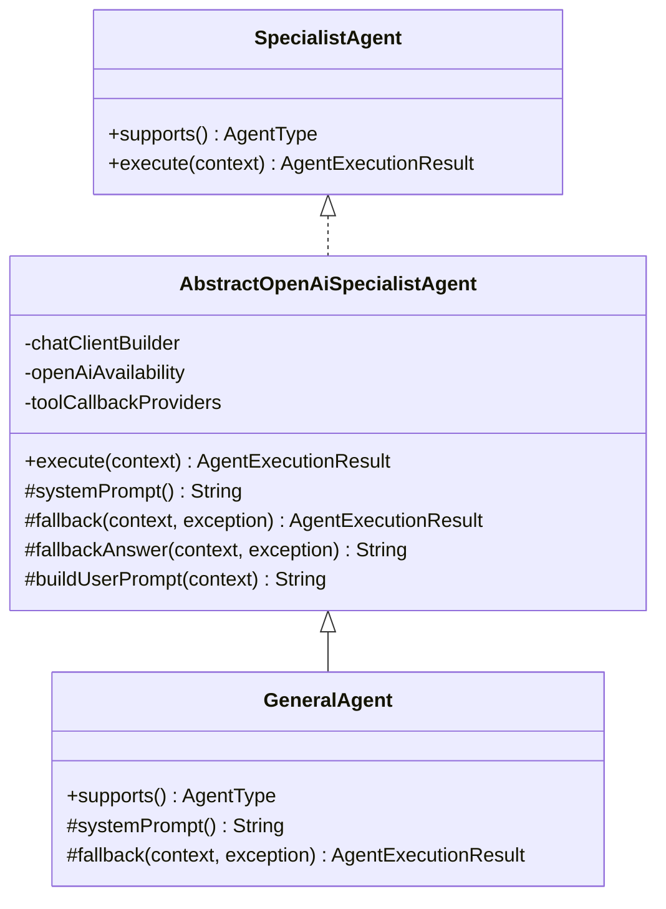
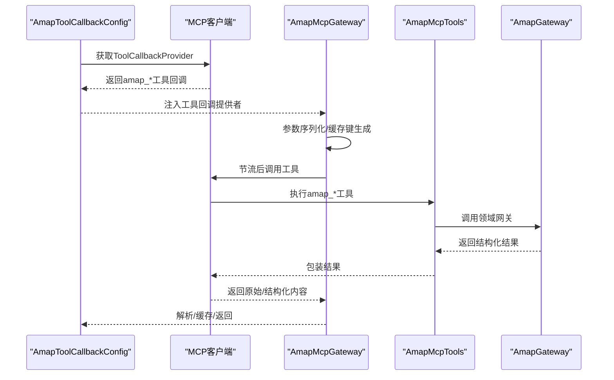
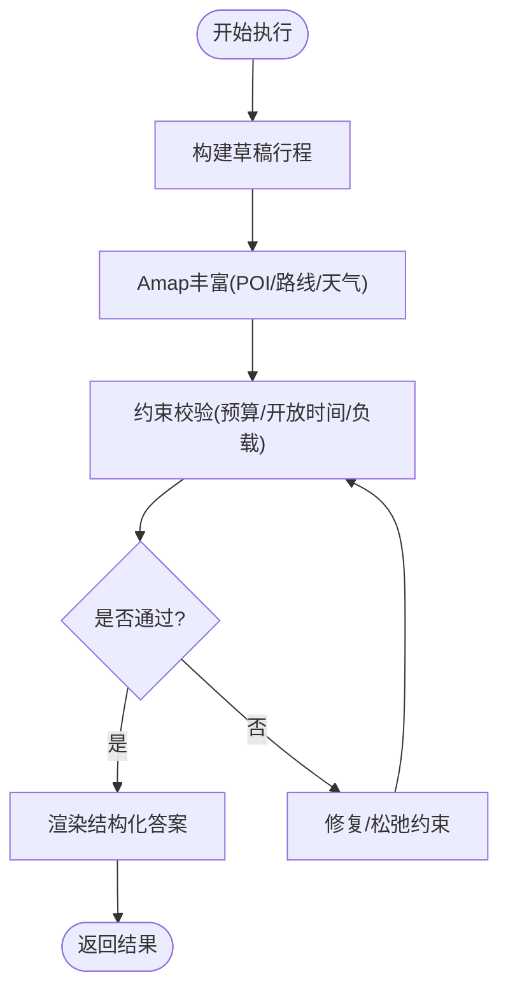
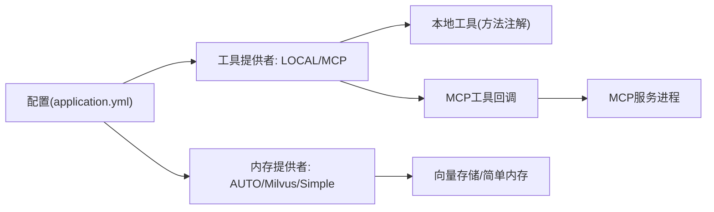
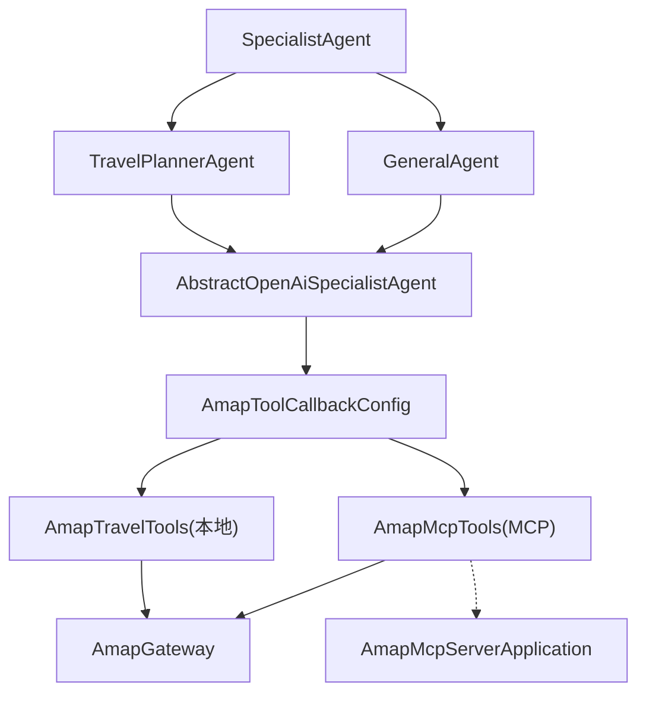

# 扩展开发

<cite>
**本文引用的文件**
- [AbstractOpenAiSpecialistAgent.java](file://travel-agent-infrastructure/src/main/java/com/travalagent/infrastructure/gateway/llm/AbstractOpenAiSpecialistAgent.java)
- [AmapMcpGateway.java](file://travel-agent-infrastructure/src/main/java/com/travalagent/infrastructure/gateway/tool/AmapMcpGateway.java)
- [AmapTravelTools.java](file://travel-agent-infrastructure/src/main/java/com/travalagent/infrastructure/gateway/tool/AmapTravelTools.java)
- [AmapMcpServerApplication.java](file://travel-agent-amap-mcp-server/src/main/java/com/travalagent/amap/mcp/server/AmapMcpServerApplication.java)
- [AmapMcpTools.java](file://travel-agent-amap-mcp-server/src/main/java/com/travalagent/amap/mcp/server/AmapMcpTools.java)
- [SpecialistAgent.java](file://travel-agent-domain/src/main/java/com/travalagent/domain/service/SpecialistAgent.java)
- [AmapGateway.java](file://travel-agent-domain/src/main/java/com/travalagent/domain/gateway/AmapGateway.java)
- [GeneralAgent.java](file://travel-agent-infrastructure/src/main/java/com/travalagent/infrastructure/gateway/llm/GeneralAgent.java)
- [TravelPlannerAgent.java](file://travel-agent-infrastructure/src/main/java/com/travalagent/infrastructure/gateway/llm/TravelPlannerAgent.java)
- [AmapToolCallbackConfig.java](file://travel-agent-infrastructure/src/main/java/com/travalagent/infrastructure/config/AmapToolCallbackConfig.java)
- [application.yml](file://travel-agent-app/src/main/resources/application.yml)
- [AgentType.java](file://travel-agent-domain/src/main/java/com/travalagent/domain/model/valobj/AgentType.java)
- [AgentExecutionContext.java](file://travel-agent-domain/src/main/java/com/travalagent/domain/model/valobj/AgentExecutionContext.java)
- [README.md](file://README.md)
</cite>

## 目录
1. [简介](#简介)
2. [项目结构](#项目结构)
3. [核心组件](#核心组件)
4. [架构总览](#架构总览)
5. [详细组件分析](#详细组件分析)
6. [依赖分析](#依赖分析)
7. [性能考虑](#性能考虑)
8. [故障排查指南](#故障排查指南)
9. [结论](#结论)
10. [附录](#附录)

## 简介
本指南面向希望为 TravelAgent 扩展开发的工程师，系统讲解如何基于现有框架新增智能体、集成工具与第三方服务。内容覆盖：
- 新智能体开发流程：继承 AbstractOpenAiSpecialistAgent 的实现模板与最佳实践
- 工具集成方法：MCP 协议实现、工具注册与调用机制
- 插件系统架构：可插拔的工具提供者与内存提供者
- 第三方集成：地图服务、AI 模型提供商与数据源接入
- 扩展点设计原则、接口规范与常见问题处理
- 具体扩展示例：新智能体、自定义工具与新功能模块的集成步骤

## 项目结构
TravelAgent 采用分层与端口适配（Ports & Adapters）风格，结合领域驱动设计（DDD）思想：
- travel-agent-domain：领域模型、值对象、仓库接口、网关与服务契约
- travel-agent-app：应用编排、HTTP API、SSE 流与对话工作流
- travel-agent-infrastructure：LLM 代理、检索、持久化适配器、验证器、修复器与计划增强器
- travel-agent-amap：Amap HTTP 集成（领域网关）
- travel-agent-amap-mcp-server：独立 MCP 服务器，承载 Amap 工具能力
- web：前端工作区

图表来源
- [README.md: 76-98:76-98](file://README.md#L76-L98)
- [README.md: 236-261:236-261](file://README.md#L236-L261)

章节来源
- [README.md: 76-98:76-98](file://README.md#L76-L98)
- [README.md: 236-261:236-261](file://README.md#L236-L261)

## 核心组件
- SpecialistAgent 接口：统一的专家智能体抽象，定义 supports() 与 execute() 方法
- AgentType 枚举：WEATHER、GEO、TRAVEL_PLANNER、GENERAL 四类专家
- AgentExecutionContext：执行上下文，封装会话、任务记忆、近期消息、长程记忆等
- AbstractOpenAiSpecialistAgent：通用 OpenAI 专家智能体基类，负责系统提示词构建、工具回调、回退策略与元数据生成
- AmapMcpGateway：MCP 工具调用网关，支持缓存、节流与结果解析
- AmapTravelTools：基于注解的工具集合，声明 amap_* 工具
- AmapMcpTools：MCP 侧工具实现，对接领域网关 AmapGateway
- AmapToolCallbackConfig：根据配置选择本地工具或 MCP 工具回调提供者
- application.yml：运行时配置，含 MCP 客户端、工具提供者、内存提供者等

章节来源
- [SpecialistAgent.java: 7-12:7-12](file://travel-agent-domain/src/main/java/com/travalagent/domain/service/SpecialistAgent.java#L7-L12)
- [AgentType.java: 3-8:3-8](file://travel-agent-domain/src/main/java/com/travalagent/domain/model/valobj/AgentType.java#L3-L8)
- [AgentExecutionContext.java: 8-37:8-37](file://travel-agent-domain/src/main/java/com/travalagent/domain/model/valobj/AgentExecutionContext.java#L8-L37)
- [AbstractOpenAiSpecialistAgent.java: 15-185:15-185](file://travel-agent-infrastructure/src/main/java/com/travalagent/infrastructure/gateway/llm/AbstractOpenAiSpecialistAgent.java#L15-L185)
- [AmapMcpGateway.java: 28-195:28-195](file://travel-agent-infrastructure/src/main/java/com/travalagent/infrastructure/gateway/tool/AmapMcpGateway.java#L28-L195)
- [AmapTravelTools.java: 22-118:22-118](file://travel-agent-infrastructure/src/main/java/com/travalagent/infrastructure/gateway/tool/AmapTravelTools.java#L22-L118)
- [AmapMcpTools.java: 17-103:17-103](file://travel-agent-amap-mcp-server/src/main/java/com/travalagent/amap/mcp/server/AmapMcpTools.java#L17-L103)
- [AmapToolCallbackConfig.java: 14-43:14-43](file://travel-agent-infrastructure/src/main/java/com/travalagent/infrastructure/config/AmapToolCallbackConfig.java#L14-L43)
- [application.yml: 57-100:57-100](file://travel-agent-app/src/main/resources/application.yml#L57-L100)

## 架构总览
下图展示了从对话请求到工具调用与响应返回的关键路径，以及 MCP 工具链路：

图表来源
- [AbstractOpenAiSpecialistAgent.java: 32-68:32-68](file://travel-agent-infrastructure/src/main/java/com/travalagent/infrastructure/gateway/llm/AbstractOpenAiSpecialistAgent.java#L32-L68)
- [AmapMcpGateway.java: 102-123:102-123](file://travel-agent-infrastructure/src/main/java/com/travalagent/infrastructure/gateway/tool/AmapMcpGateway.java#L102-L123)
- [AmapToolCallbackConfig.java: 17-43:17-43](file://travel-agent-infrastructure/src/main/java/com/travalagent/infrastructure/config/AmapToolCallbackConfig.java#L17-L43)
- [AmapMcpTools.java: 25-81:25-81](file://travel-agent-amap-mcp-server/src/main/java/com/travalagent/amap/mcp/server/AmapMcpTools.java#L25-L81)
- [AmapGateway.java: 12-27:12-27](file://travel-agent-domain/src/main/java/com/travalagent/domain/gateway/AmapGateway.java#L12-L27)

## 详细组件分析

### 组件A：专家智能体基类与实现模板
- AbstractOpenAiSpecialistAgent 提供统一的执行流程：可用性检查、提示词构造、工具回调、回退处理与元数据生成
- 子类只需实现 supports() 与 systemPrompt()，并可覆写 fallback() 与 fallbackAnswer() 以定制错误回退文案
- 支持图片附件媒体输入，自动注入到提示词中

图表来源
- [SpecialistAgent.java: 7-12:7-12](file://travel-agent-domain/src/main/java/com/travalagent/domain/service/SpecialistAgent.java#L7-L12)
- [AbstractOpenAiSpecialistAgent.java: 15-185:15-185](file://travel-agent-infrastructure/src/main/java/com/travalagent/infrastructure/gateway/llm/AbstractOpenAiSpecialistAgent.java#L15-L185)
- [GeneralAgent.java: 9-62:9-62](file://travel-agent-infrastructure/src/main/java/com/travalagent/infrastructure/gateway/llm/GeneralAgent.java#L9-L62)

章节来源
- [AbstractOpenAiSpecialistAgent.java: 15-185:15-185](file://travel-agent-infrastructure/src/main/java/com/travalagent/infrastructure/gateway/llm/AbstractOpenAiSpecialistAgent.java#L15-L185)
- [GeneralAgent.java: 9-62:9-62](file://travel-agent-infrastructure/src/main/java/com/travalagent/infrastructure/gateway/llm/GeneralAgent.java#L9-L62)

### 组件B：MCP 工具集成与调用机制
- AmapMcpTools 在 MCP 服务端声明 amap_* 工具，参数校验与默认值处理
- AmapTravelTools 在基础设施侧声明相同工具，用于本地工具模式
- AmapToolCallbackConfig 根据配置选择本地工具或 MCP 工具回调提供者，并过滤 amap_* 工具
- AmapMcpGateway 负责工具调用：参数序列化、缓存、节流、结果解析与异常包装

图表来源
- [AmapToolCallbackConfig.java: 17-43:17-43](file://travel-agent-infrastructure/src/main/java/com/travalagent/infrastructure/config/AmapToolCallbackConfig.java#L17-L43)
- [AmapMcpGateway.java: 102-153:102-153](file://travel-agent-infrastructure/src/main/java/com/travalagent/infrastructure/gateway/tool/AmapMcpGateway.java#L102-L153)
- [AmapMcpTools.java: 25-81:25-81](file://travel-agent-amap-mcp-server/src/main/java/com/travalagent/amap/mcp/server/AmapMcpTools.java#L25-L81)
- [AmapGateway.java: 12-27:12-27](file://travel-agent-domain/src/main/java/com/travalagent/domain/gateway/AmapGateway.java#L12-L27)

章节来源
- [AmapMcpTools.java: 17-103:17-103](file://travel-agent-amap-mcp-server/src/main/java/com/travalagent/amap/mcp/server/AmapMcpTools.java#L17-L103)
- [AmapTravelTools.java: 22-118:22-118](file://travel-agent-infrastructure/src/main/java/com/travalagent/infrastructure/gateway/tool/AmapTravelTools.java#L22-L118)
- [AmapToolCallbackConfig.java: 14-43:14-43](file://travel-agent-infrastructure/src/main/java/com/travalagent/infrastructure/config/AmapToolCallbackConfig.java#L14-L43)
- [AmapMcpGateway.java: 28-195:28-195](file://travel-agent-infrastructure/src/main/java/com/travalagent/infrastructure/gateway/tool/AmapMcpGateway.java#L28-L195)

### 组件C：旅行规划专家（示例：TravelPlannerAgent）
- 作为 SpecialistAgent 的具体实现，负责行程规划的构建、丰富、校验、修复与最终渲染
- 通过 TimelinePublisher 记录各阶段事件，便于前端追踪与审计
- 与 AmapGateway、知识库检索、天气查询等外部能力协作

图表来源
- [TravelPlannerAgent.java: 66-137:66-137](file://travel-agent-infrastructure/src/main/java/com/travalagent/infrastructure/gateway/llm/TravelPlannerAgent.java#L66-L137)
- [TravelPlannerAgent.java: 139-183:139-183](file://travel-agent-infrastructure/src/main/java/com/travalagent/infrastructure/gateway/llm/TravelPlannerAgent.java#L139-L183)

章节来源
- [TravelPlannerAgent.java: 28-570:28-570](file://travel-agent-infrastructure/src/main/java/com/travalagent/infrastructure/gateway/llm/TravelPlannerAgent.java#L28-L570)

### 组件D：插件系统与可插拔架构
- 工具提供者：LOCAL 或 MCP，通过配置切换；MCP 模式下仅注入 amap_* 工具回调
- 内存提供者：支持 AUTO、Milvus、Simple 等，通过配置启用
- MCP 服务：独立进程，便于扩展更多 amap_* 工具或引入其他地图/模型服务

图表来源
- [application.yml: 57-100:57-100](file://travel-agent-app/src/main/resources/application.yml#L57-L100)
- [AmapToolCallbackConfig.java: 23-42:23-42](file://travel-agent-infrastructure/src/main/java/com/travalagent/infrastructure/config/AmapToolCallbackConfig.java#L23-L42)

章节来源
- [application.yml: 57-100:57-100](file://travel-agent-app/src/main/resources/application.yml#L57-L100)
- [AmapToolCallbackConfig.java: 14-43:14-43](file://travel-agent-infrastructure/src/main/java/com/travalagent/infrastructure/config/AmapToolCallbackConfig.java#L14-L43)

## 依赖分析
- 抽象层与实现层解耦：SpecialistAgent 与 AgentType 抽象了专家类型；具体专家实现位于基础设施层
- 工具链路：AmapMcpTools 与 AmapTravelTools 通过 AmapGateway 对接领域能力
- 配置驱动：AmapToolCallbackConfig 依据 application.yml 中的工具提供者决定使用本地工具还是 MCP 工具回调
- MCP 独立部署：AmapMcpServerApplication 启动独立 MCP 服务，便于横向扩展

图表来源
- [SpecialistAgent.java: 7-12:7-12](file://travel-agent-domain/src/main/java/com/travalagent/domain/service/SpecialistAgent.java#L7-L12)
- [GeneralAgent.java: 9-62:9-62](file://travel-agent-infrastructure/src/main/java/com/travalagent/infrastructure/gateway/llm/GeneralAgent.java#L9-L62)
- [TravelPlannerAgent.java: 28-570:28-570](file://travel-agent-infrastructure/src/main/java/com/travalagent/infrastructure/gateway/llm/TravelPlannerAgent.java#L28-L570)
- [AbstractOpenAiSpecialistAgent.java: 15-185:15-185](file://travel-agent-infrastructure/src/main/java/com/travalagent/infrastructure/gateway/llm/AbstractOpenAiSpecialistAgent.java#L15-L185)
- [AmapToolCallbackConfig.java: 14-43:14-43](file://travel-agent-infrastructure/src/main/java/com/travalagent/infrastructure/config/AmapToolCallbackConfig.java#L14-L43)
- [AmapMcpTools.java: 17-103:17-103](file://travel-agent-amap-mcp-server/src/main/java/com/travalagent/amap/mcp/server/AmapMcpTools.java#L17-L103)
- [AmapTravelTools.java: 22-118:22-118](file://travel-agent-infrastructure/src/main/java/com/travalagent/infrastructure/gateway/tool/AmapTravelTools.java#L22-L118)
- [AmapGateway.java: 12-27:12-27](file://travel-agent-domain/src/main/java/com/travalagent/domain/gateway/AmapGateway.java#L12-L27)
- [AmapMcpServerApplication.java: 9-14:9-14](file://travel-agent-amap-mcp-server/src/main/java/com/travalagent/amap/mcp/server/AmapMcpServerApplication.java#L9-L14)

章节来源
- [AmapToolCallbackConfig.java: 14-43:14-43](file://travel-agent-infrastructure/src/main/java/com/travalagent/infrastructure/config/AmapToolCallbackConfig.java#L14-L43)
- [AmapMcpGateway.java: 28-195:28-195](file://travel-agent-infrastructure/src/main/java/com/travalagent/infrastructure/gateway/tool/AmapMcpGateway.java#L28-L195)

## 性能考虑
- 工具调用节流：AmapMcpGateway 在每次工具调用前进行最小间隔限制，避免触发第三方速率限制
- 请求缓存：按工具名与参数排序生成缓存键，同一会话内重复调用命中缓存，降低延迟与成本
- 结果解析健壮性：对嵌套 JSON、数组首元素 text 字段、structuredContent/result 等多种返回形态进行兼容解析
- 配置优化：通过 application.yml 调整 MCP 客户端超时、连接数与采样概率，平衡吞吐与稳定性

章节来源
- [AmapMcpGateway.java: 32-38:32-38](file://travel-agent-infrastructure/src/main/java/com/travalagent/infrastructure/gateway/tool/AmapMcpGateway.java#L32-L38)
- [AmapMcpGateway.java: 102-123:102-123](file://travel-agent-infrastructure/src/main/java/com/travalagent/infrastructure/gateway/tool/AmapMcpGateway.java#L102-L123)
- [AmapMcpGateway.java: 175-178:175-178](file://travel-agent-infrastructure/src/main/java/com/travalagent/infrastructure/gateway/tool/AmapMcpGateway.java#L175-L178)
- [AmapMcpGateway.java: 180-194:180-194](file://travel-agent-infrastructure/src/main/java/com/travalagent/infrastructure/gateway/tool/AmapMcpGateway.java#L180-L194)
- [application.yml: 28-41:28-41](file://travel-agent-app/src/main/resources/application.yml#L28-L41)
- [application.yml: 50-55:50-55](file://travel-agent-app/src/main/resources/application.yml#L50-L55)

## 故障排查指南
- 工具提供者配置错误
  - 现象：MCP 模式下抛出“无可用工具回调”或“未发现 amap_* 工具”
  - 排查：确认 application.yml 中 TRAVEL_AGENT_TOOL_PROVIDER 设置为 MCP，并确保 MCP 服务已启动且暴露 amap_* 工具
- OpenAI 可用性检查失败
  - 现象：专家智能体回退，提示模型服务不可用
  - 排查：检查 SPRING_AI_OPENAI_API_KEY、BASE_URL、CHAT_MODEL 是否正确配置
- MCP 工具调用异常
  - 现象：解析失败或返回非预期格式
  - 排查：查看 AmapMcpGateway 的解析分支与异常包装逻辑，确认 MCP 服务端返回结构符合约定
- 会话缓存与节流
  - 现象：偶发超时或调用被阻塞
  - 排查：检查 MIN_TOOL_CALL_INTERVAL_MS 与 MCP 客户端超时设置，必要时提升阈值或增加并发连接

章节来源
- [AmapToolCallbackConfig.java: 23-42:23-42](file://travel-agent-infrastructure/src/main/java/com/travalagent/infrastructure/config/AmapToolCallbackConfig.java#L23-L42)
- [AbstractOpenAiSpecialistAgent.java: 32-35:32-35](file://travel-agent-infrastructure/src/main/java/com/travalagent/infrastructure/gateway/llm/AbstractOpenAiSpecialistAgent.java#L32-L35)
- [AmapMcpGateway.java: 102-153:102-153](file://travel-agent-infrastructure/src/main/java/com/travalagent/infrastructure/gateway/tool/AmapMcpGateway.java#L102-L153)
- [application.yml: 18-27:18-27](file://travel-agent-app/src/main/resources/application.yml#L18-L27)
- [application.yml: 28-41:28-41](file://travel-agent-app/src/main/resources/application.yml#L28-L41)

## 结论
通过以上组件与机制，TravelAgent 提供了清晰的扩展点与可插拔架构。开发者可基于 AbstractOpenAiSpecialistAgent 快速实现新专家智能体，借助 MCP 工具链路集成第三方能力，并通过配置灵活切换工具与内存提供者。遵循本文的设计原则与最佳实践，可在不破坏核心流程的前提下安全地扩展系统能力。

## 附录

### 扩展开发清单与最佳实践
- 新增专家智能体
  - 继承 AbstractOpenAiSpecialistAgent，实现 supports() 与 systemPrompt()
  - 如需工具回调，将 ToolCallbackProvider 注入构造函数并在 execute() 中启用
  - 覆写 fallback() 与 fallbackAnswer() 以提供本地化回退文案
- 新增 MCP 工具
  - 在 MCP 服务端实现 AmapMcpTools 的同名工具，完成参数校验与默认值处理
  - 在基础设施侧保持 AmapTravelTools 的声明一致，保证本地模式可用
  - 通过 AmapToolCallbackConfig 过滤 amap_* 工具，确保只注入目标工具
- 第三方集成
  - 地图服务：实现领域网关 AmapGateway 的对应方法，供工具与专家调用
  - AI 模型提供商：通过 OpenAI 兼容配置（application.yml）接入，无需修改专家实现
  - 数据源：通过领域仓库/网关适配器接入，保持与现有检索与计划流程一致
- 配置与部署
  - 工具提供者：LOCAL 适合开发调试，MCP 适合生产与横向扩展
  - 内存提供者：AUTO 自动选择，Milvus/Simple 可按需启用
  - MCP 服务：独立进程部署，便于热插拔与版本管理

章节来源
- [AbstractOpenAiSpecialistAgent.java: 15-185:15-185](file://travel-agent-infrastructure/src/main/java/com/travalagent/infrastructure/gateway/llm/AbstractOpenAiSpecialistAgent.java#L15-L185)
- [AmapMcpTools.java: 17-103:17-103](file://travel-agent-amap-mcp-server/src/main/java/com/travalagent/amap/mcp/server/AmapMcpTools.java#L17-L103)
- [AmapTravelTools.java: 22-118:22-118](file://travel-agent-infrastructure/src/main/java/com/travalagent/infrastructure/gateway/tool/AmapTravelTools.java#L22-L118)
- [AmapToolCallbackConfig.java: 14-43:14-43](file://travel-agent-infrastructure/src/main/java/com/travalagent/infrastructure/config/AmapToolCallbackConfig.java#L14-L43)
- [AmapGateway.java: 12-27:12-27](file://travel-agent-domain/src/main/java/com/travalagent/domain/gateway/AmapGateway.java#L12-L27)
- [application.yml: 57-100:57-100](file://travel-agent-app/src/main/resources/application.yml#L57-L100)