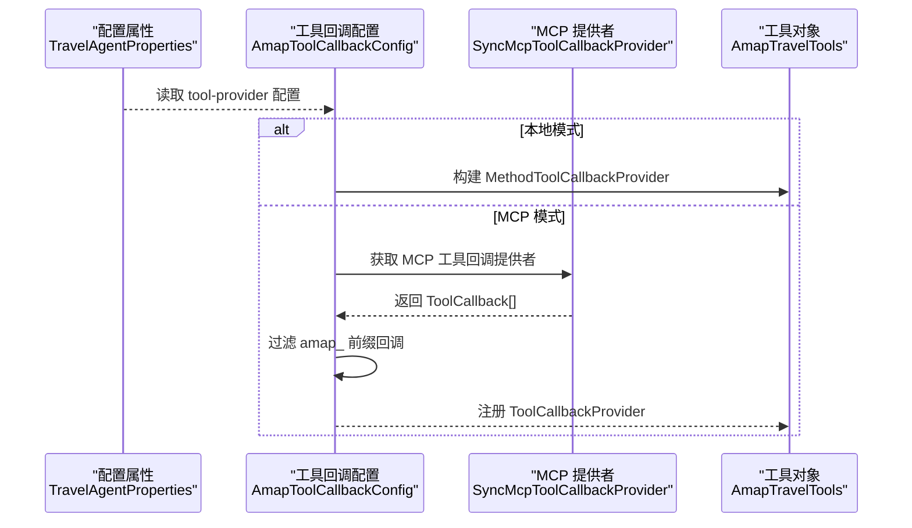
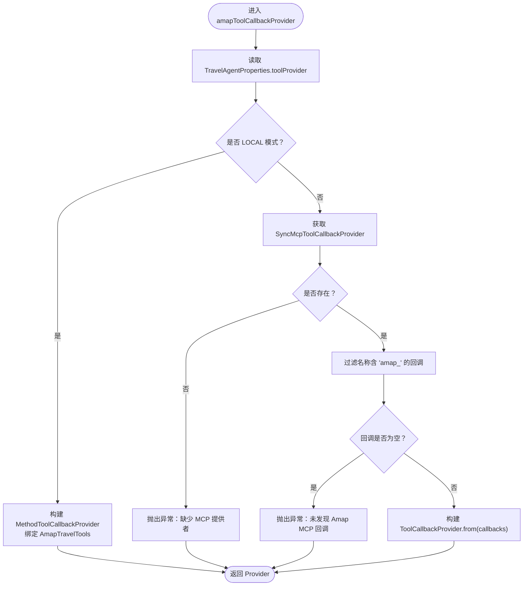
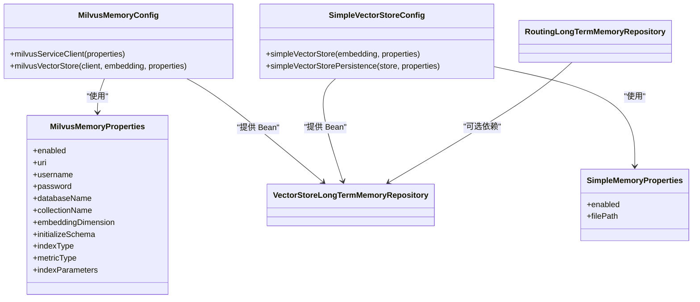
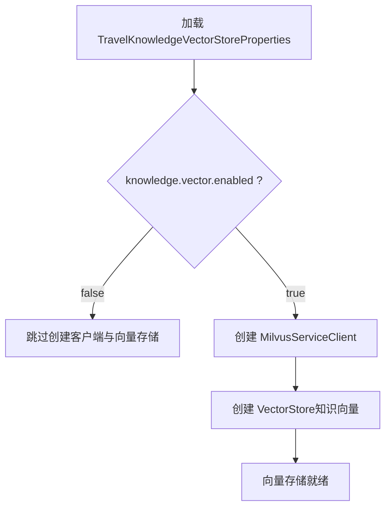
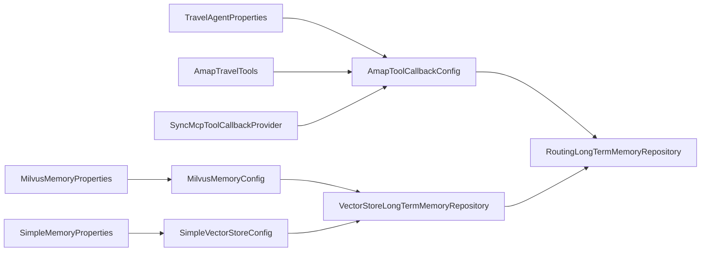

# 插件系统架构

<cite>
**本文档引用的文件**
- [AmapToolCallbackConfig.java](file://travel-agent-infrastructure/src/main/java/com/travalagent/infrastructure/config/AmapToolCallbackConfig.java)
- [AmapTravelTools.java](file://travel-agent-infrastructure/src/main/java/com/travalagent/infrastructure/gateway/tool/AmapTravelTools.java)
- [MilvusMemoryConfig.java](file://travel-agent-infrastructure/src/main/java/com/travalagent/infrastructure/config/MilvusMemoryConfig.java)
- [MilvusMemoryProperties.java](file://travel-agent-infrastructure/src/main/java/com/travalagent/infrastructure/config/MilvusMemoryProperties.java)
- [SimpleMemoryProperties.java](file://travel-agent-infrastructure/src/main/java/com/travalagent/infrastructure/config/SimpleMemoryProperties.java)
- [SimpleVectorStoreConfig.java](file://travel-agent-infrastructure/src/main/java/com/travalagent/infrastructure/config/SimpleVectorStoreConfig.java)
- [TravelKnowledgeVectorStoreProperties.java](file://travel-agent-infrastructure/src/main/java/com/travalagent/infrastructure/config/TravelKnowledgeVectorStoreProperties.java)
- [InfrastructureConfig.java](file://travel-agent-infrastructure/src/main/java/com/travalagent/infrastructure/config/InfrastructureConfig.java)
- [TravelAgentProperties.java](file://travel-agent-infrastructure/src/main/java/com/travalagent/infrastructure/config/TravelAgentProperties.java)
- [RoutingLongTermMemoryRepository.java](file://travel-agent-infrastructure/src/main/java/com/travalagent/infrastructure/repository/RoutingLongTermMemoryRepository.java)
- [VectorStoreLongTermMemoryRepository.java](file://travel-agent-infrastructure/src/main/java/com/travalagent/infrastructure/repository/VectorStoreLongTermMemoryRepository.java)
- [application.yml（应用）](file://travel-agent-app/src/main/resources/application.yml)
- [application.yml（MCP服务器）](file://travel-agent-amap-mcp-server/src/main/resources/application.yml)
- [AmapToolCallbackConfigTest.java](file://travel-agent-infrastructure/src/test/java/com/travalagent/infrastructure/config/AmapToolCallbackConfigTest.java)
</cite>

## 目录
1. [简介](#简介)
2. [项目结构](#项目结构)
3. [核心组件](#核心组件)
4. [架构总览](#架构总览)
5. [详细组件分析](#详细组件分析)
6. [依赖分析](#依赖分析)
7. [性能考虑](#性能考虑)
8. [故障排查指南](#故障排查指南)
9. [结论](#结论)
10. [附录](#附录)

## 简介
本文件系统性梳理旅行代理系统的插件化架构，重点覆盖以下方面：
- 可插拔工具提供者的实现机制：通过 AmapToolCallbackConfig 的配置模式与工具回调注册流程，支持本地方法工具与 MCP 工具回调两种模式的动态切换。
- 可插拔内存提供者的设计原理：对比 MilvusMemoryConfig 与 SimpleMemoryProperties 的配置差异，解释向量存储与简单持久化的选择策略。
- 旅行知识向量存储的插件化设计：阐述 TravelKnowledgeVectorStoreProperties 的属性配置与存储提供者的切换机制。
- 插件系统的扩展点：接口规范、实现模板与配置管理；包含生命周期管理、依赖注入与运行时配置的动态加载方法。

## 项目结构
该系统采用多模块分层组织，插件化能力主要集中在 travel-agent-infrastructure 模块中，通过 Spring Boot 配置属性与条件装配实现按需启用与切换。

**图表来源**
- [application.yml（应用）:1-100](file://travel-agent-app/src/main/resources/application.yml#L1-L100)
- [application.yml（MCP服务器）:1-35](file://travel-agent-amap-mcp-server/src/main/resources/application.yml#L1-L35)
- [AmapToolCallbackConfig.java:1-44](file://travel-agent-infrastructure/src/main/java/com/travalagent/infrastructure/config/AmapToolCallbackConfig.java#L1-L44)
- [MilvusMemoryConfig.java:1-45](file://travel-agent-infrastructure/src/main/java/com/travalagent/infrastructure/config/MilvusMemoryConfig.java#L1-L45)
- [SimpleVectorStoreConfig.java:1-57](file://travel-agent-infrastructure/src/main/java/com/travalagent/infrastructure/config/SimpleVectorStoreConfig.java#L1-L57)
- [InfrastructureConfig.java:1-36](file://travel-agent-infrastructure/src/main/java/com/travalagent/infrastructure/config/InfrastructureConfig.java#L1-L36)
- [TravelAgentProperties.java:1-67](file://travel-agent-infrastructure/src/main/java/com/travalagent/infrastructure/config/TravelAgentProperties.java#L1-L67)
- [MilvusMemoryProperties.java:1-107](file://travel-agent-infrastructure/src/main/java/com/travalagent/infrastructure/config/MilvusMemoryProperties.java#L1-L107)
- [SimpleMemoryProperties.java:1-26](file://travel-agent-infrastructure/src/main/java/com/travalagent/infrastructure/config/SimpleMemoryProperties.java#L1-L26)
- [TravelKnowledgeVectorStoreProperties.java:1-108](file://travel-agent-infrastructure/src/main/java/com/travalagent/infrastructure/config/TravelKnowledgeVectorStoreProperties.java#L1-L108)
- [RoutingLongTermMemoryRepository.java:1-54](file://travel-agent-infrastructure/src/main/java/com/travalagent/infrastructure/repository/RoutingLongTermMemoryRepository.java#L1-L54)
- [VectorStoreLongTermMemoryRepository.java:1-58](file://travel-agent-infrastructure/src/main/java/com/travalagent/infrastructure/repository/VectorStoreLongTermMemoryRepository.java#L1-L58)

**章节来源**
- [application.yml（应用）:1-100](file://travel-agent-app/src/main/resources/application.yml#L1-L100)
- [application.yml（MCP服务器）:1-35](file://travel-agent-amap-mcp-server/src/main/resources/application.yml#L1-L35)

## 核心组件
- 工具回调提供者：根据全局属性选择本地方法工具或 MCP 工具回调，并进行过滤与装配。
- 内存提供者：通过条件装配在 Milvus 与简单向量存储之间切换，支持 AUTO/SQLITE/MILVUS 三种模式。
- 旅行知识向量存储：独立于长期记忆的向量存储，具备独立的连接参数与索引配置。
- 路由记忆仓库：依据配置在 SQLite 与向量存储之间动态路由，确保在 MILVUS 模式下必须可用。

**章节来源**
- [AmapToolCallbackConfig.java:1-44](file://travel-agent-infrastructure/src/main/java/com/travalagent/infrastructure/config/AmapToolCallbackConfig.java#L1-L44)
- [TravelAgentProperties.java:1-67](file://travel-agent-infrastructure/src/main/java/com/travalagent/infrastructure/config/TravelAgentProperties.java#L1-L67)
- [RoutingLongTermMemoryRepository.java:1-54](file://travel-agent-infrastructure/src/main/java/com/travalagent/infrastructure/repository/RoutingLongTermMemoryRepository.java#L1-L54)
- [MilvusMemoryConfig.java:1-45](file://travel-agent-infrastructure/src/main/java/com/travalagent/infrastructure/config/MilvusMemoryConfig.java#L1-L45)
- [SimpleVectorStoreConfig.java:1-57](file://travel-agent-infrastructure/src/main/java/com/travalagent/infrastructure/config/SimpleVectorStoreConfig.java#L1-L57)
- [TravelKnowledgeVectorStoreProperties.java:1-108](file://travel-agent-infrastructure/src/main/java/com/travalagent/infrastructure/config/TravelKnowledgeVectorStoreProperties.java#L1-L108)

## 架构总览
插件系统围绕“配置驱动 + 条件装配 + 运行时路由”的原则构建，关键交互如下：

**图表来源**
- [AmapToolCallbackConfig.java:17-43](file://travel-agent-infrastructure/src/main/java/com/travalagent/infrastructure/config/AmapToolCallbackConfig.java#L17-L43)
- [TravelAgentProperties.java:41-47](file://travel-agent-infrastructure/src/main/java/com/travalagent/infrastructure/config/TravelAgentProperties.java#L41-L47)
- [AmapTravelTools.java:22-119](file://travel-agent-infrastructure/src/main/java/com/travalagent/infrastructure/gateway/tool/AmapTravelTools.java#L22-L119)

**章节来源**
- [AmapToolCallbackConfig.java:1-44](file://travel-agent-infrastructure/src/main/java/com/travalagent/infrastructure/config/AmapToolCallbackConfig.java#L1-L44)
- [AmapTravelTools.java:1-119](file://travel-agent-infrastructure/src/main/java/com/travalagent/infrastructure/gateway/tool/AmapTravelTools.java#L1-L119)

## 详细组件分析

### 可插拔工具提供者：AmapToolCallbackConfig
- 配置模式
  - 通过 TravelAgentProperties 的 ToolProvider 控制工具提供方式：LOCAL 或 MCP。
  - 在 LOCAL 模式下，使用 MethodToolCallbackProvider 将 AmapTravelTools 中的 @Tool 方法直接暴露为工具回调。
  - 在 MCP 模式下，从 Spring 容器获取 SyncMcpToolCallbackProvider，筛选名称以 "amap_" 开头的回调，构造 ToolCallbackProvider。
- 回调注册流程
  - 若配置为 MCP 但未发现 SyncMcpToolCallbackProvider，抛出异常提示缺少 Bean。
  - 若 MCP 回调为空，抛出异常提示未发现任何 Amap 工具回调。
  - 最终通过 ToolCallbackProvider.from(callbacks) 注册到运行时。

**图表来源**
- [AmapToolCallbackConfig.java:17-43](file://travel-agent-infrastructure/src/main/java/com/travalagent/infrastructure/config/AmapToolCallbackConfig.java#L17-L43)
- [TravelAgentProperties.java:41-47](file://travel-agent-infrastructure/src/main/java/com/travalagent/infrastructure/config/TravelAgentProperties.java#L41-L47)

**章节来源**
- [AmapToolCallbackConfig.java:1-44](file://travel-agent-infrastructure/src/main/java/com/travalagent/infrastructure/config/AmapToolCallbackConfig.java#L1-L44)
- [AmapTravelTools.java:22-119](file://travel-agent-infrastructure/src/main/java/com/travalagent/infrastructure/gateway/tool/AmapTravelTools.java#L22-L119)
- [AmapToolCallbackConfigTest.java:69-98](file://travel-agent-infrastructure/src/test/java/com/travalagent/infrastructure/config/AmapToolCallbackConfigTest.java#L69-L98)

### 可插拔内存提供者：Milvus 与 Simple 的配置差异
- MilvusMemoryConfig
  - 通过 @ConditionalOnProperty(prefix = "travel.agent.memory.milvus", name = "enabled", havingValue = "true") 条件启用。
  - 创建 MilvusServiceClient 并基于 MilvusMemoryProperties 构建 VectorStore，支持数据库名、集合名、维度、索引类型、度量类型与索引参数等配置。
- SimpleVectorStoreConfig
  - 通过 @ConditionalOnProperty(prefix = "travel.agent.memory.simple", name = "enabled", havingValue = "true") 条件启用。
  - 使用 SimpleMemoryProperties 指定 JSON 文件路径，自动加载与保存向量数据；提供 SimpleVectorStorePersistence 在容器销毁时持久化。
- 配置差异
  - Milvus：面向生产级向量检索，支持高维特征与复杂索引；需要外部 Milvus 实例。
  - Simple：面向开发与轻量场景，以文件形式持久化，便于快速验证与演示。

**图表来源**
- [MilvusMemoryConfig.java:18-44](file://travel-agent-infrastructure/src/main/java/com/travalagent/infrastructure/config/MilvusMemoryConfig.java#L18-L44)
- [MilvusMemoryProperties.java:1-107](file://travel-agent-infrastructure/src/main/java/com/travalagent/infrastructure/config/MilvusMemoryProperties.java#L1-L107)
- [SimpleVectorStoreConfig.java:16-56](file://travel-agent-infrastructure/src/main/java/com/travalagent/infrastructure/config/SimpleVectorStoreConfig.java#L16-L56)
- [SimpleMemoryProperties.java:1-26](file://travel-agent-infrastructure/src/main/java/com/travalagent/infrastructure/config/SimpleMemoryProperties.java#L1-L26)
- [VectorStoreLongTermMemoryRepository.java:22-58](file://travel-agent-infrastructure/src/main/java/com/travalagent/infrastructure/repository/VectorStoreLongTermMemoryRepository.java#L22-L58)
- [RoutingLongTermMemoryRepository.java:20-53](file://travel-agent-infrastructure/src/main/java/com/travalagent/infrastructure/repository/RoutingLongTermMemoryRepository.java#L20-L53)

**章节来源**
- [MilvusMemoryConfig.java:1-45](file://travel-agent-infrastructure/src/main/java/com/travalagent/infrastructure/config/MilvusMemoryConfig.java#L1-L45)
- [SimpleVectorStoreConfig.java:1-57](file://travel-agent-infrastructure/src/main/java/com/travalagent/infrastructure/config/SimpleVectorStoreConfig.java#L1-L57)
- [MilvusMemoryProperties.java:1-107](file://travel-agent-infrastructure/src/main/java/com/travalagent/infrastructure/config/MilvusMemoryProperties.java#L1-L107)
- [SimpleMemoryProperties.java:1-26](file://travel-agent-infrastructure/src/main/java/com/travalagent/infrastructure/config/SimpleMemoryProperties.java#L1-L26)
- [VectorStoreLongTermMemoryRepository.java:1-58](file://travel-agent-infrastructure/src/main/java/com/travalagent/infrastructure/repository/VectorStoreLongTermMemoryRepository.java#L1-L58)
- [RoutingLongTermMemoryRepository.java:1-54](file://travel-agent-infrastructure/src/main/java/com/travalagent/infrastructure/repository/RoutingLongTermMemoryRepository.java#L1-L54)

### 旅行知识向量存储的插件化设计
- 属性配置
  - TravelKnowledgeVectorStoreProperties 提供与 MilvusMemoryProperties 类似的配置项，包括连接参数、数据库名、集合名、维度、索引与度量类型等。
  - 应用配置中 knowledge.vector.enabled 默认跟随 Milvus 内存开关，其他参数可独立覆盖。
- 存储提供者切换机制
  - InfrastructureConfig 条件创建 MilvusServiceClient 与旅行知识专用嵌入模型 Bean。
  - 通过 TravelKnowledgeVectorStoreProperties 的 enabled 与连接参数控制向量存储的启用与行为。
  - 与长期记忆的路由逻辑解耦，允许独立启用/禁用与独立配置。

**图表来源**
- [InfrastructureConfig.java:20-34](file://travel-agent-infrastructure/src/main/java/com/travalagent/infrastructure/config/InfrastructureConfig.java#L20-L34)
- [TravelKnowledgeVectorStoreProperties.java:1-108](file://travel-agent-infrastructure/src/main/java/com/travalagent/infrastructure/config/TravelKnowledgeVectorStoreProperties.java#L1-L108)
- [application.yml（应用）:87-100](file://travel-agent-app/src/main/resources/application.yml#L87-L100)

**章节来源**
- [InfrastructureConfig.java:1-36](file://travel-agent-infrastructure/src/main/java/com/travalagent/infrastructure/config/InfrastructureConfig.java#L1-L36)
- [TravelKnowledgeVectorStoreProperties.java:1-108](file://travel-agent-infrastructure/src/main/java/com/travalagent/infrastructure/config/TravelKnowledgeVectorStoreProperties.java#L1-L108)
- [application.yml（应用）:87-100](file://travel-agent-app/src/main/resources/application.yml#L87-L100)

### 插件系统的扩展点与实现模板
- 接口规范
  - 工具回调：遵循 ToolCallbackProvider 与 ToolCallback 规范，支持本地方法工具与 MCP 工具回调两类实现。
  - 内存提供者：统一实现 VectorStore 接口，支持 Milvus 与 Simple 两种实现。
- 实现模板
  - 工具提供者：参考 AmapToolCallbackConfig 的条件判断与回调过滤逻辑，结合 TravelAgentProperties 的 ToolProvider 枚举进行分支处理。
  - 内存提供者：参考 MilvusMemoryConfig 与 SimpleVectorStoreConfig 的条件装配与 Bean 构建方式，结合各自 Properties 进行配置注入。
- 配置管理
  - 全局属性：TravelAgentProperties 提供 tool-provider 与 memory-provider 的枚举值。
  - 组件属性：MilvusMemoryProperties、SimpleMemoryProperties、TravelKnowledgeVectorStoreProperties 分别承载对应组件的配置前缀。
  - 应用配置：application.yml 中通过环境变量与默认值实现运行时动态加载。

**章节来源**
- [AmapToolCallbackConfig.java:1-44](file://travel-agent-infrastructure/src/main/java/com/travalagent/infrastructure/config/AmapToolCallbackConfig.java#L1-L44)
- [TravelAgentProperties.java:1-67](file://travel-agent-infrastructure/src/main/java/com/travalagent/infrastructure/config/TravelAgentProperties.java#L1-L67)
- [MilvusMemoryConfig.java:1-45](file://travel-agent-infrastructure/src/main/java/com/travalagent/infrastructure/config/MilvusMemoryConfig.java#L1-L45)
- [SimpleVectorStoreConfig.java:1-57](file://travel-agent-infrastructure/src/main/java/com/travalagent/infrastructure/config/SimpleVectorStoreConfig.java#L1-L57)
- [application.yml（应用）:57-100](file://travel-agent-app/src/main/resources/application.yml#L57-L100)

## 依赖分析
- 组件耦合与内聚
  - AmapToolCallbackConfig 对 TravelAgentProperties 与 AmapTravelTools 强依赖，对 SyncMcpToolCallbackProvider 为弱依赖（ObjectProvider）。
  - RoutingLongTermMemoryRepository 对 TravelAgentProperties 与 VectorStoreLongTermMemoryRepository 为弱依赖，确保 AUTO 模式下的灵活切换。
- 外部依赖与集成点
  - MCP 协议：通过 spring-ai-mcp 提供 SyncMcpToolCallbackProvider 与 ToolCallbackProvider。
  - 向量存储：Milvus 作为外部服务，通过 MilvusServiceClient 与 MilvusVectorStore 集成。
- 循环依赖
  - 未见循环依赖迹象；配置类仅作为装配入口，不直接互相依赖。

**图表来源**
- [AmapToolCallbackConfig.java:17-43](file://travel-agent-infrastructure/src/main/java/com/travalagent/infrastructure/config/AmapToolCallbackConfig.java#L17-L43)
- [TravelAgentProperties.java:41-47](file://travel-agent-infrastructure/src/main/java/com/travalagent/infrastructure/config/TravelAgentProperties.java#L41-L47)
- [RoutingLongTermMemoryRepository.java:40-53](file://travel-agent-infrastructure/src/main/java/com/travalagent/infrastructure/repository/RoutingLongTermMemoryRepository.java#L40-L53)
- [MilvusMemoryConfig.java:18-44](file://travel-agent-infrastructure/src/main/java/com/travalagent/infrastructure/config/MilvusMemoryConfig.java#L18-L44)
- [SimpleVectorStoreConfig.java:16-56](file://travel-agent-infrastructure/src/main/java/com/travalagent/infrastructure/config/SimpleVectorStoreConfig.java#L16-L56)

**章节来源**
- [RoutingLongTermMemoryRepository.java:1-54](file://travel-agent-infrastructure/src/main/java/com/travalagent/infrastructure/repository/RoutingLongTermMemoryRepository.java#L1-L54)
- [MilvusMemoryConfig.java:1-45](file://travel-agent-infrastructure/src/main/java/com/travalagent/infrastructure/config/MilvusMemoryConfig.java#L1-L45)
- [SimpleVectorStoreConfig.java:1-57](file://travel-agent-infrastructure/src/main/java/com/travalagent/infrastructure/config/SimpleVectorStoreConfig.java#L1-L57)

## 性能考虑
- 工具回调
  - LOCAL 模式避免网络往返，适合低延迟与离线场景；MCP 模式具备远程扩展能力但引入网络开销。
- 向量存储
  - Milvus 支持高维特征与复杂索引，适合大规模知识检索；Simple 则以文件持久化，适合小规模与快速验证。
- 连接与初始化
  - Milvus 客户端在启用时建立连接，建议合理设置超时与重试策略；Schema 初始化仅在首次启用时执行，避免重复开销。

## 故障排查指南
- 工具回调
  - 症状：MCP 模式下抛出“缺少 MCP 提供者”或“未发现 Amap MCP 回调”异常。
  - 排查：确认 application.yml 中 spring.ai.mcp.client.enabled 与 toolcallback.enabled；检查 MCP 服务器端点与鉴权配置。
- 内存提供者
  - 症状：MILVUS 模式下抛出“未找到 VectorStore Bean”异常。
  - 排查：确认 travel.agent.memory.milvus.enabled 与连接参数；确保 Milvus 服务可达且认证正确。
- 长期记忆路由
  - 症状：AUTO 模式下未走向量存储。
  - 排查：确认向量存储 Bean 是否成功创建；检查 ObjectProvider 是否能获取到 VectorStoreLongTermMemoryRepository。

**章节来源**
- [AmapToolCallbackConfig.java:29-42](file://travel-agent-infrastructure/src/main/java/com/travalagent/infrastructure/config/AmapToolCallbackConfig.java#L29-L42)
- [RoutingLongTermMemoryRepository.java:48-53](file://travel-agent-infrastructure/src/main/java/com/travalagent/infrastructure/repository/RoutingLongTermMemoryRepository.java#L48-L53)
- [application.yml（应用）:28-41](file://travel-agent-app/src/main/resources/application.yml#L28-L41)

## 结论
该插件系统通过“配置驱动 + 条件装配 + 运行时路由”的设计，在工具提供与内存存储两个关键领域实现了高度可插拔与可扩展的能力。AmapToolCallbackConfig 与 Milvus/Simple 向量存储配置共同构成了系统的核心扩展点，配合 TravelAgentProperties 与各组件属性类，提供了清晰的接口规范与灵活的运行时切换机制。通过测试用例与集成测试，系统在不同模式下的行为得到了有效验证。

## 附录
- 关键配置前缀
  - 工具提供：travel.agent.tool-provider
  - 内存提供：travel.agent.memory-provider
  - Milvus 内存：travel.agent.memory.milvus.*
  - 简单内存：travel.agent.memory.simple.*
  - 旅行知识向量：travel.agent.knowledge.vector.*

**章节来源**
- [TravelAgentProperties.java:8-16](file://travel-agent-infrastructure/src/main/java/com/travalagent/infrastructure/config/TravelAgentProperties.java#L8-L16)
- [application.yml（应用）:57-100](file://travel-agent-app/src/main/resources/application.yml#L57-L100)