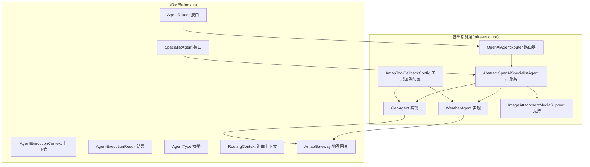
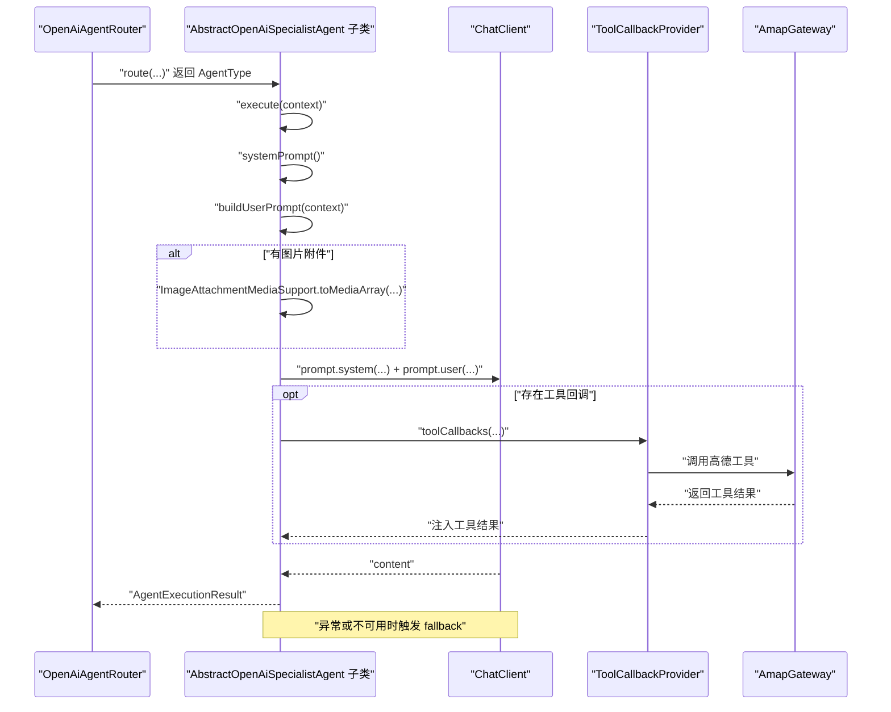
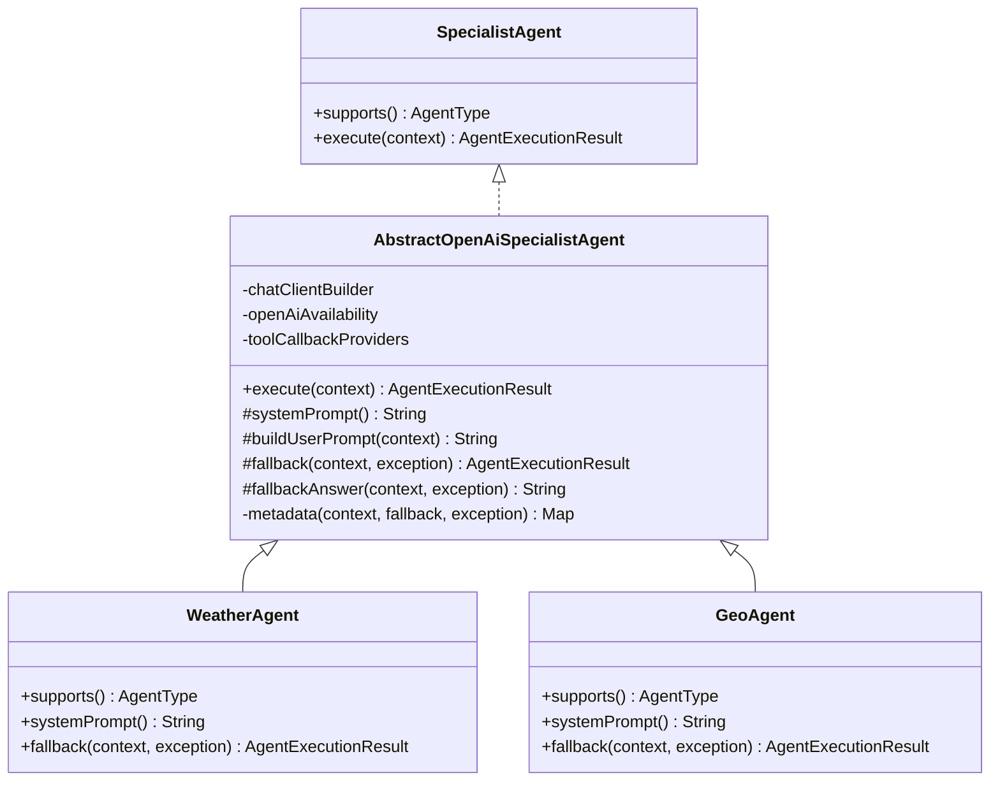
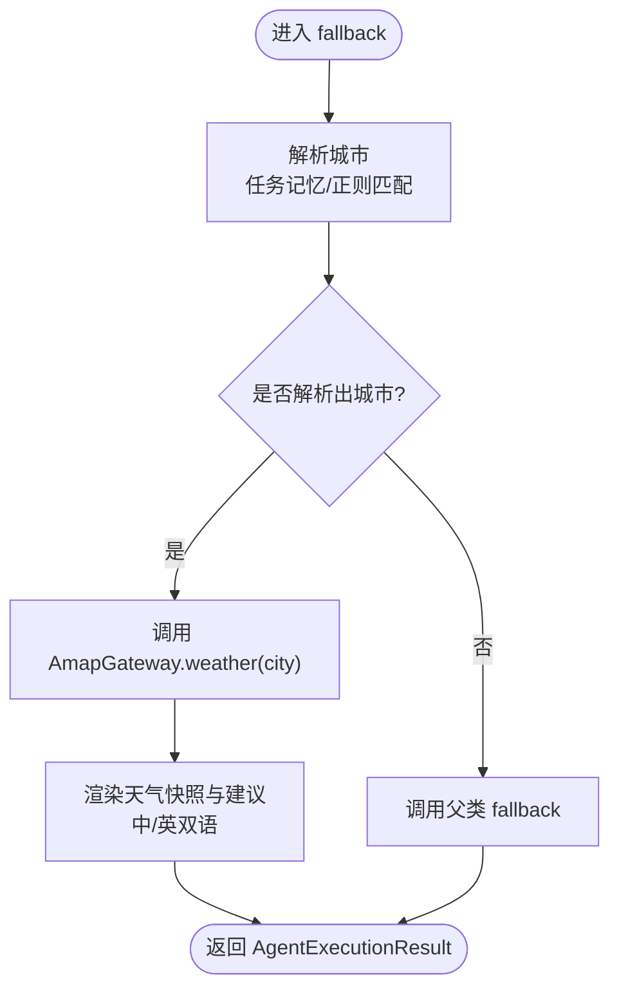
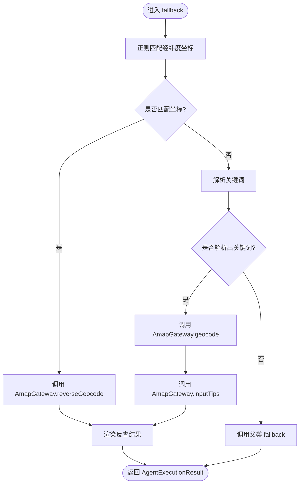
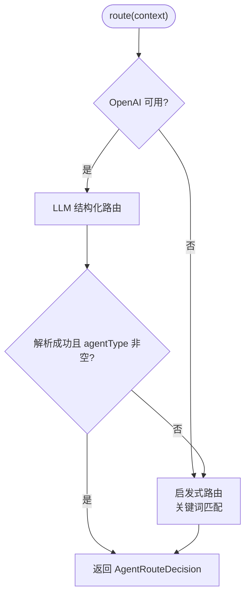
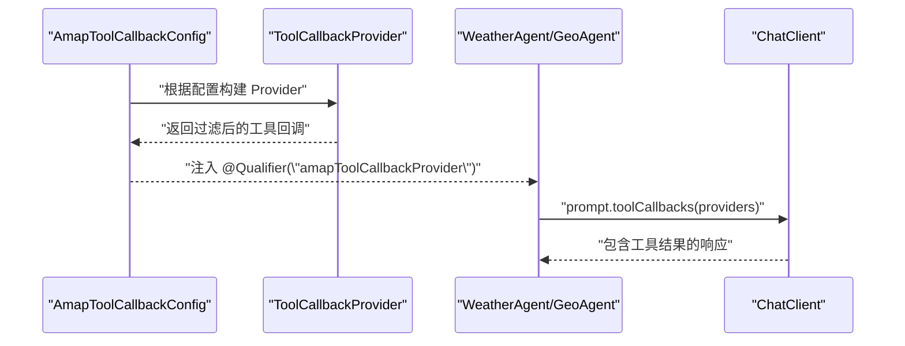
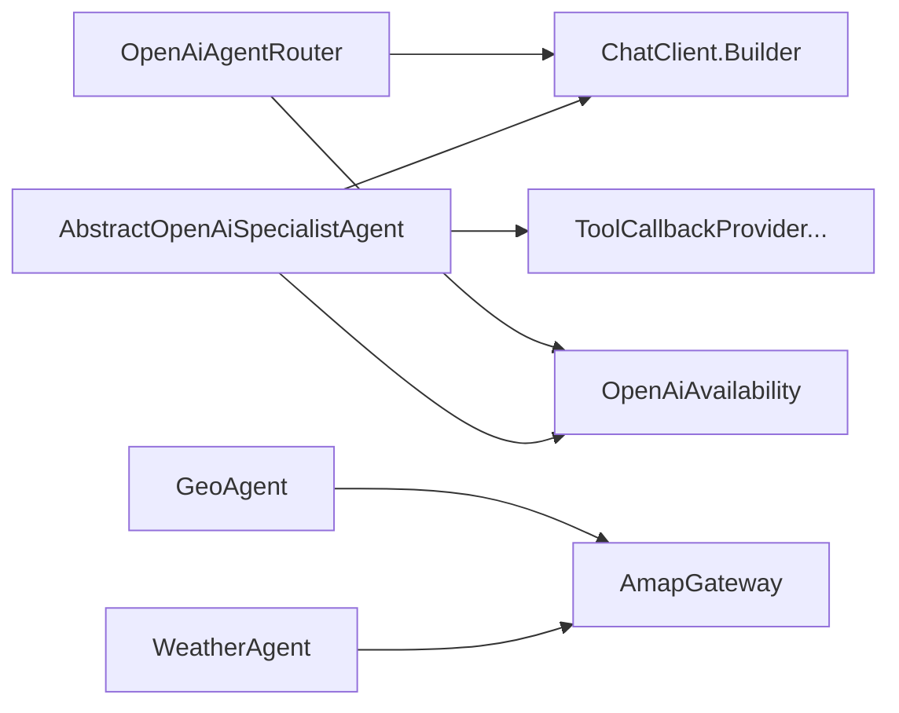

# 智能体扩展开发

<cite>
**本文引用的文件**
- [AbstractOpenAiSpecialistAgent.java](file://travel-agent-infrastructure/src/main/java/com/travalagent/infrastructure/gateway/llm/AbstractOpenAiSpecialistAgent.java)
- [WeatherAgent.java](file://travel-agent-infrastructure/src/main/java/com/travalagent/infrastructure/gateway/llm/WeatherAgent.java)
- [GeoAgent.java](file://travel-agent-infrastructure/src/main/java/com/travalagent/infrastructure/gateway/llm/GeoAgent.java)
- [OpenAiAgentRouter.java](file://travel-agent-infrastructure/src/main/java/com/travalagent/infrastructure/gateway/llm/OpenAiAgentRouter.java)
- [SpecialistAgent.java](file://travel-agent-domain/src/main/java/com/travalagent/domain/service/SpecialistAgent.java)
- [AgentExecutionContext.java](file://travel-agent-domain/src/main/java/com/travalagent/domain/model/valobj/AgentExecutionContext.java)
- [AgentExecutionResult.java](file://travel-agent-domain/src/main/java/com/travalagent/domain/model/valobj/AgentExecutionResult.java)
- [AgentType.java](file://travel-agent-domain/src/main/java/com/travalagent/domain/model/valobj/AgentType.java)
- [RoutingContext.java](file://travel-agent-domain/src/main/java/com/travalagent/domain/model/valobj/RoutingContext.java)
- [AgentRouter.java](file://travel-agent-domain/src/main/java/com/travalagent/domain/service/AgentRouter.java)
- [ImageAttachmentMediaSupport.java](file://travel-agent-infrastructure/src/main/java/com/travalagent/infrastructure/gateway/llm/ImageAttachmentMediaSupport.java)
- [AmapGateway.java](file://travel-agent-domain/src/main/java/com/travalagent/domain/gateway/AmapGateway.java)
- [AmapToolCallbackConfig.java](file://travel-agent-infrastructure/src/main/java/com/travalagent/infrastructure/config/AmapToolCallbackConfig.java)
</cite>

## 目录
1. [引言](#引言)
2. [项目结构](#项目结构)
3. [核心组件](#核心组件)
4. [架构总览](#架构总览)
5. [详细组件分析](#详细组件分析)
6. [依赖分析](#依赖分析)
7. [性能考虑](#性能考虑)
8. [故障排查指南](#故障排查指南)
9. [结论](#结论)
10. [附录](#附录)

## 引言
本指南面向希望扩展与定制“旅行智能体”的开发者，围绕 AbstractOpenAiSpecialistAgent 抽象类的设计模式与实现模板进行深入解析，并提供从继承、提示词设计、用户提示构建、元数据处理到回退机制与工具回调集成的完整实践路径。同时给出 WeatherAgent 与 GeoAgent 的实现范式，阐述智能体生命周期、错误处理与性能优化策略，并覆盖智能体注册、路由配置与工具回调集成方法。

## 项目结构
本项目采用分层与领域驱动设计（DDD）相结合的方式组织代码：
- domain 层：定义智能体接口、上下文对象、类型枚举与路由接口，确保业务契约稳定。
- infrastructure 层：实现具体智能体与路由逻辑，封装与外部 LLM 与工具的交互。
- app 层：对外提供控制器与应用服务，编排对话与工作流。

图表来源
- [SpecialistAgent.java:1-13](file://travel-agent-domain/src/main/java/com/travalagent/domain/service/SpecialistAgent.java#L1-L13)
- [AgentRouter.java:1-10](file://travel-agent-domain/src/main/java/com/travalagent/domain/service/AgentRouter.java#L1-L10)
- [AgentExecutionContext.java:1-38](file://travel-agent-domain/src/main/java/com/travalagent/domain/model/valobj/AgentExecutionContext.java#L1-L38)
- [AgentExecutionResult.java:1-15](file://travel-agent-domain/src/main/java/com/travalagent/domain/model/valobj/AgentExecutionResult.java#L1-L15)
- [AgentType.java:1-9](file://travel-agent-domain/src/main/java/com/travalagent/domain/model/valobj/AgentType.java#L1-L9)
- [RoutingContext.java:1-17](file://travel-agent-domain/src/main/java/com/travalagent/domain/model/valobj/RoutingContext.java#L1-L17)
- [AbstractOpenAiSpecialistAgent.java:1-186](file://travel-agent-infrastructure/src/main/java/com/travalagent/infrastructure/gateway/llm/AbstractOpenAiSpecialistAgent.java#L1-L186)
- [WeatherAgent.java:1-163](file://travel-agent-infrastructure/src/main/java/com/travalagent/infrastructure/gateway/llm/WeatherAgent.java#L1-L163)
- [GeoAgent.java:1-191](file://travel-agent-infrastructure/src/main/java/com/travalagent/infrastructure/gateway/llm/GeoAgent.java#L1-L191)
- [OpenAiAgentRouter.java:1-145](file://travel-agent-infrastructure/src/main/java/com/travalagent/infrastructure/gateway/llm/OpenAiAgentRouter.java#L1-L145)
- [ImageAttachmentMediaSupport.java:1-60](file://travel-agent-infrastructure/src/main/java/com/travalagent/infrastructure/gateway/llm/ImageAttachmentMediaSupport.java#L1-L60)
- [AmapGateway.java:1-28](file://travel-agent-domain/src/main/java/com/travalagent/domain/gateway/AmapGateway.java#L1-L28)
- [AmapToolCallbackConfig.java:1-44](file://travel-agent-infrastructure/src/main/java/com/travalagent/infrastructure/config/AmapToolCallbackConfig.java#L1-L44)

章节来源
- [AbstractOpenAiSpecialistAgent.java:1-186](file://travel-agent-infrastructure/src/main/java/com/travalagent/infrastructure/gateway/llm/AbstractOpenAiSpecialistAgent.java#L1-L186)
- [OpenAiAgentRouter.java:1-145](file://travel-agent-infrastructure/src/main/java/com/travalagent/infrastructure/gateway/llm/OpenAiAgentRouter.java#L1-L145)

## 核心组件
本节聚焦 AbstractOpenAiSpecialistAgent 抽象类及其关键职责：
- 统一的执行入口 execute：负责可用性检查、提示词组装、工具回调、结果封装与异常回退。
- 可插拔的系统提示词 systemPrompt：由子类实现，定义角色与行为约束。
- 用户提示构建 buildUserPrompt：默认拼装多源上下文，支持覆盖以适配特定任务。
- 回退机制 fallback：在不可用或异常时生成兜底回答与元数据。
- 元数据 metadata：记录路由原因、工具启用状态、图片附件数量、图像上下文、是否回退及回退原因等。

章节来源
- [AbstractOpenAiSpecialistAgent.java:15-186](file://travel-agent-infrastructure/src/main/java/com/travalagent/infrastructure/gateway/llm/AbstractOpenAiSpecialistAgent.java#L15-L186)
- [AgentExecutionContext.java:8-38](file://travel-agent-domain/src/main/java/com/travalagent/domain/model/valobj/AgentExecutionContext.java#L8-L38)
- [AgentExecutionResult.java:7-15](file://travel-agent-domain/src/main/java/com/travalagent/domain/model/valobj/AgentExecutionResult.java#L7-L15)
- [AgentType.java:3-9](file://travel-agent-domain/src/main/java/com/travalagent/domain/model/valobj/AgentType.java#L3-L9)

## 架构总览
下图展示从路由到智能体执行、工具回调与回退的整体流程：

图表来源
- [OpenAiAgentRouter.java:29-72](file://travel-agent-infrastructure/src/main/java/com/travalagent/infrastructure/gateway/llm/OpenAiAgentRouter.java#L29-L72)
- [AbstractOpenAiSpecialistAgent.java:31-68](file://travel-agent-infrastructure/src/main/java/com/travalagent/infrastructure/gateway/llm/AbstractOpenAiSpecialistAgent.java#L31-L68)
- [ImageAttachmentMediaSupport.java:22-42](file://travel-agent-infrastructure/src/main/java/com/travalagent/infrastructure/gateway/llm/ImageAttachmentMediaSupport.java#L22-L42)
- [AmapToolCallbackConfig.java:17-43](file://travel-agent-infrastructure/src/main/java/com/travalagent/infrastructure/config/AmapToolCallbackConfig.java#L17-L43)
- [AmapGateway.java:14-27](file://travel-agent-domain/src/main/java/com/travalagent/domain/gateway/AmapGateway.java#L14-L27)

## 详细组件分析

### AbstractOpenAiSpecialistAgent 抽象类
- 设计要点
  - 封装统一的执行流程，屏蔽 LLM 调用细节与工具回调注入。
  - 提供可覆盖的 systemPrompt 与 buildUserPrompt，便于按专业领域定制。
  - 内置回退机制，保证在不可用或异常时仍输出可用响应与元数据。
  - 支持图片附件媒体注入，增强多模态能力。
- 关键方法与职责
  - 构造函数参数
    - ChatClient.Builder：用于构建 LLM 客户端请求规范。
    - OpenAiAvailability：可用性检查，决定是否走回退。
    - ToolCallbackProvider...：可变长度工具回调数组，按需启用工具。
  - execute(context)
    - 可用性检查失败：立即 fallback。
    - 组装 systemPrompt 与 userPrompt；若存在图片附件，转换为 Media 数组并注入。
    - 若存在工具回调，注入工具上下文（如 conversationId），并执行工具调用。
    - 成功则封装 AgentExecutionResult，否则捕获异常并 fallback。
  - buildUserPrompt(context)
    - 默认模板包含最新用户请求、任务记忆、对话摘要、长期记忆与最近消息。
    - 可在子类中重写以适配更复杂的上下文拼装。
  - fallback(context, exception)
    - 生成兜底答案与元数据，标记 fallback=true 并记录回退原因。
  - metadata(context, fallback, exception)
    - 记录路由原因、工具启用状态、图片附件数量、图像上下文、回退标志与原因。
- 错误处理与国际化
  - fallbackAnswer：根据用户语言选择中文或英文兜底文案。
  - rootMessage：提取异常根因，避免深层堆栈导致信息冗长。

图表来源
- [SpecialistAgent.java:7-12](file://travel-agent-domain/src/main/java/com/travalagent/domain/service/SpecialistAgent.java#L7-L12)
- [AbstractOpenAiSpecialistAgent.java:15-186](file://travel-agent-infrastructure/src/main/java/com/travalagent/infrastructure/gateway/llm/AbstractOpenAiSpecialistAgent.java#L15-L186)
- [WeatherAgent.java:17-37](file://travel-agent-infrastructure/src/main/java/com/travalagent/infrastructure/gateway/llm/WeatherAgent.java#L17-L37)
- [GeoAgent.java:19-38](file://travel-agent-infrastructure/src/main/java/com/travalagent/infrastructure/gateway/llm/GeoAgent.java#L19-L38)

章节来源
- [AbstractOpenAiSpecialistAgent.java:21-29](file://travel-agent-infrastructure/src/main/java/com/travalagent/infrastructure/gateway/llm/AbstractOpenAiSpecialistAgent.java#L21-L29)
- [AbstractOpenAiSpecialistAgent.java:31-68](file://travel-agent-infrastructure/src/main/java/com/travalagent/infrastructure/gateway/llm/AbstractOpenAiSpecialistAgent.java#L31-L68)
- [AbstractOpenAiSpecialistAgent.java:88-113](file://travel-agent-infrastructure/src/main/java/com/travalagent/infrastructure/gateway/llm/AbstractOpenAiSpecialistAgent.java#L88-L113)
- [AbstractOpenAiSpecialistAgent.java:171-184](file://travel-agent-infrastructure/src/main/java/com/travalagent/infrastructure/gateway/llm/AbstractOpenAiSpecialistAgent.java#L171-L184)

### WeatherAgent 实现模式
- 角色定位：天气查询专用智能体，优先使用工具获取实时天气，必要时回退到本地查询。
- systemPrompt 策略
  - 明确角色与语言要求。
  - 强制优先使用工具获取实时天气。
  - 输出结构化要点：当前天气结论、温度/风/降水风险、旅行建议。
  - 最少化追问，仅当位置不明确时询问一次。
- 回退策略
  - 优先从任务记忆中解析目的地，其次从用户消息中匹配中文/英文城市名。
  - 使用 AmapGateway.weather 获取快照，渲染中英双语结果与建议。
  - 元数据包含 toolEnabled、fallback、fallbackReason。
- 用户提示构建
  - 继承父类默认模板，无需重写。
- 图片与多模态
  - 未覆盖 buildUserPrompt，因此不依赖图片附件。

图表来源
- [WeatherAgent.java:54-71](file://travel-agent-infrastructure/src/main/java/com/travalagent/infrastructure/gateway/llm/WeatherAgent.java#L54-L71)
- [WeatherAgent.java:81-95](file://travel-agent-infrastructure/src/main/java/com/travalagent/infrastructure/gateway/llm/WeatherAgent.java#L81-L95)
- [WeatherAgent.java:97-134](file://travel-agent-infrastructure/src/main/java/com/travalagent/infrastructure/gateway/llm/WeatherAgent.java#L97-L134)
- [AmapGateway.java:14](file://travel-agent-domain/src/main/java/com/travalagent/domain/gateway/AmapGateway.java#L14)

章节来源
- [WeatherAgent.java:34-51](file://travel-agent-infrastructure/src/main/java/com/travalagent/infrastructure/gateway/llm/WeatherAgent.java#L34-L51)
- [WeatherAgent.java:54-79](file://travel-agent-infrastructure/src/main/java/com/travalagent/infrastructure/gateway/llm/WeatherAgent.java#L54-L79)
- [WeatherAgent.java:81-161](file://travel-agent-infrastructure/src/main/java/com/travalagent/infrastructure/gateway/llm/WeatherAgent.java#L81-L161)

### GeoAgent 实现模式
- 角色定位：地理编码/逆地理编码/地点消歧专用智能体，优先使用工具，清晰呈现解析结果与潜在歧义。
- systemPrompt 策略
  - 明确角色与语言要求。
  - 处理地址解析、坐标、逆地理编码与地点消歧。
  - 优先使用工具结果，避免猜测。
  - 明确呈现解析地址、坐标、行政区划与歧义项。
- 回退策略
  - 若用户消息包含经纬度坐标，调用 reverseGeocode 并渲染结果。
  - 否则解析关键词，调用 geocode 与 inputTips，渲染候选地点列表。
  - 元数据包含 toolEnabled、fallback、fallbackReason。
- 用户提示构建
  - 继承父类默认模板，无需重写。
- 图片与多模态
  - 未覆盖 buildUserPrompt，因此不依赖图片附件。

图表来源
- [GeoAgent.java:52-87](file://travel-agent-infrastructure/src/main/java/com/travalagent/infrastructure/gateway/llm/GeoAgent.java#L52-L87)
- [GeoAgent.java:97-108](file://travel-agent-infrastructure/src/main/java/com/travalagent/infrastructure/gateway/llm/GeoAgent.java#L97-L108)
- [GeoAgent.java:110-185](file://travel-agent-infrastructure/src/main/java/com/travalagent/infrastructure/gateway/llm/GeoAgent.java#L110-L185)
- [AmapGateway.java:16-24](file://travel-agent-domain/src/main/java/com/travalagent/domain/gateway/AmapGateway.java#L16-L24)

章节来源
- [GeoAgent.java:35-49](file://travel-agent-infrastructure/src/main/java/com/travalagent/infrastructure/gateway/llm/GeoAgent.java#L35-L49)
- [GeoAgent.java:52-95](file://travel-agent-infrastructure/src/main/java/com/travalagent/infrastructure/gateway/llm/GeoAgent.java#L52-L95)
- [GeoAgent.java:97-190](file://travel-agent-infrastructure/src/main/java/com/travalagent/infrastructure/gateway/llm/GeoAgent.java#L97-L190)

### 路由器 OpenAiAgentRouter
- 职责
  - 在可用时通过 LLM 进行结构化解析，确定目标智能体类型与是否需要澄清问题。
  - 不可用或异常时，回退到启发式规则：基于关键词识别天气、地理与旅行规划场景。
- 关键逻辑
  - 正则匹配中文/英文关键字与数值提示（天数、预算）。
  - 对旅行规划场景，缺失目的地/天数/预算时设置澄清标志与最小化问题。
- 输出
  - AgentRouteDecision：包含 agentType、reason、clarificationRequired、clarificationQuestion。

图表来源
- [OpenAiAgentRouter.java:29-72](file://travel-agent-infrastructure/src/main/java/com/travalagent/infrastructure/gateway/llm/OpenAiAgentRouter.java#L29-L72)
- [OpenAiAgentRouter.java:74-96](file://travel-agent-infrastructure/src/main/java/com/travalagent/infrastructure/gateway/llm/OpenAiAgentRouter.java#L74-L96)

章节来源
- [OpenAiAgentRouter.java:13-27](file://travel-agent-infrastructure/src/main/java/com/travalagent/infrastructure/gateway/llm/OpenAiAgentRouter.java#L13-L27)
- [OpenAiAgentRouter.java:29-72](file://travel-agent-infrastructure/src/main/java/com/travalagent/infrastructure/gateway/llm/OpenAiAgentRouter.java#L29-L72)
- [OpenAiAgentRouter.java:74-143](file://travel-agent-infrastructure/src/main/java/com/travalagent/infrastructure/gateway/llm/OpenAiAgentRouter.java#L74-L143)

### 工具回调与注册
- 工具回调提供者
  - AmapToolCallbackConfig 根据配置选择本地方法工具或 MCP 工具回调。
  - 过滤出以 amap_ 开头的工具回调，确保只注入高德相关工具。
- 智能体注册
  - WeatherAgent 与 GeoAgent 使用 @Component 注解，Spring 容器自动发现。
  - 构造函数注入 ChatClient.Builder、OpenAiAvailability、ToolCallbackProvider 与 AmapGateway。
- 集成方式
  - 在 AbstractOpenAiSpecialistAgent.execute 中通过 toolCallbacks 注入工具回调。
  - 工具调用结果自动注入到 LLM 请求中，提升准确性与实时性。

图表来源
- [AmapToolCallbackConfig.java:17-43](file://travel-agent-infrastructure/src/main/java/com/travalagent/infrastructure/config/AmapToolCallbackConfig.java#L17-L43)
- [WeatherAgent.java:24-32](file://travel-agent-infrastructure/src/main/java/com/travalagent/infrastructure/gateway/llm/WeatherAgent.java#L24-L32)
- [GeoAgent.java:25-33](file://travel-agent-infrastructure/src/main/java/com/travalagent/infrastructure/gateway/llm/GeoAgent.java#L25-L33)
- [AbstractOpenAiSpecialistAgent.java:50-57](file://travel-agent-infrastructure/src/main/java/com/travalagent/infrastructure/gateway/llm/AbstractOpenAiSpecialistAgent.java#L50-L57)

章节来源
- [AmapToolCallbackConfig.java:14-43](file://travel-agent-infrastructure/src/main/java/com/travalagent/infrastructure/config/AmapToolCallbackConfig.java#L14-L43)
- [WeatherAgent.java:16-32](file://travel-agent-infrastructure/src/main/java/com/travalagent/infrastructure/gateway/llm/WeatherAgent.java#L16-L32)
- [GeoAgent.java:18-33](file://travel-agent-infrastructure/src/main/java/com/travalagent/infrastructure/gateway/llm/GeoAgent.java#L18-L33)

## 依赖分析
- 组件耦合
  - AbstractOpenAiSpecialistAgent 依赖 ChatClient.Builder、OpenAiAvailability 与 ToolCallbackProvider，形成对 LLM 与工具的抽象耦合。
  - WeatherAgent/GeoAgent 依赖 AmapGateway，体现领域网关的稳定边界。
  - OpenAiAgentRouter 依赖 ChatClient.Builder 与 OpenAiAvailability，负责路由决策。
- 外部依赖
  - Spring AI ChatClient：构建与执行 LLM 请求。
  - Spring AI ToolCallbackProvider：工具回调注入。
  - 高德地图网关：天气、地理编码、输入提示与交通路线查询。

图表来源
- [AbstractOpenAiSpecialistAgent.java:17-29](file://travel-agent-infrastructure/src/main/java/com/travalagent/infrastructure/gateway/llm/AbstractOpenAiSpecialistAgent.java#L17-L29)
- [WeatherAgent.java:22](file://travel-agent-infrastructure/src/main/java/com/travalagent/infrastructure/gateway/llm/WeatherAgent.java#L22)
- [GeoAgent.java:23](file://travel-agent-infrastructure/src/main/java/com/travalagent/infrastructure/gateway/llm/GeoAgent.java#L23)
- [OpenAiAgentRouter.java:21-27](file://travel-agent-infrastructure/src/main/java/com/travalagent/infrastructure/gateway/llm/OpenAiAgentRouter.java#L21-L27)

章节来源
- [AbstractOpenAiSpecialistAgent.java:17-29](file://travel-agent-infrastructure/src/main/java/com/travalagent/infrastructure/gateway/llm/AbstractOpenAiSpecialistAgent.java#L17-L29)
- [WeatherAgent.java:22](file://travel-agent-infrastructure/src/main/java/com/travalagent/infrastructure/gateway/llm/WeatherAgent.java#L22)
- [GeoAgent.java:23](file://travel-agent-infrastructure/src/main/java/com/travalagent/infrastructure/gateway/llm/GeoAgent.java#L23)
- [OpenAiAgentRouter.java:21-27](file://travel-agent-infrastructure/src/main/java/com/travalagent/infrastructure/gateway/llm/OpenAiAgentRouter.java#L21-L27)

## 性能考虑
- 工具调用与网络延迟
  - 工具回调在 LLM 请求中同步执行，可能增加单次往返时间。建议在工具链路中引入超时与重试策略。
- 图像媒体处理
  - 图片附件转换为 Media 并随请求发送，注意控制附件大小与数量，避免请求过大。
- 回退路径
  - 回退时直接调用网关查询，减少 LLM 调用开销，但需关注网关限流与可用性。
- 路由决策
  - 启发式路由在不可用时快速返回，降低 LLM 调用成本；建议缓存常用关键词映射以进一步提速。

## 故障排查指南
- OpenAI 可用性检查失败
  - 现象：execute 直接 fallback，metadata 中 fallback=true。
  - 处理：检查密钥配置与服务可用性，确认 OpenAiAvailability 状态。
- 工具回调未生效
  - 现象：toolEnabled=false 或工具结果为空。
  - 处理：确认 AmapToolCallbackConfig 是否正确装配，MCP/本地工具是否可用，以及工具名称前缀过滤是否正确。
- 图像附件格式错误
  - 现象：抛出非法参数异常，提示必须为 base64 data URL。
  - 处理：确保前端传入的数据 URL 符合 data:[mime];base64,xxx 格式。
- 回退原因根因提取
  - 现象：metadata.fallbackReason 过于冗长或为空。
  - 处理：使用 rootMessage 提取根异常信息，必要时在子类中自定义 fallbackAnswer 与回退文案。

章节来源
- [AbstractOpenAiSpecialistAgent.java:33-35](file://travel-agent-infrastructure/src/main/java/com/travalagent/infrastructure/gateway/llm/AbstractOpenAiSpecialistAgent.java#L33-L35)
- [AbstractOpenAiSpecialistAgent.java:161-169](file://travel-agent-infrastructure/src/main/java/com/travalagent/infrastructure/gateway/llm/AbstractOpenAiSpecialistAgent.java#L161-L169)
- [ImageAttachmentMediaSupport.java:44-52](file://travel-agent-infrastructure/src/main/java/com/travalagent/infrastructure/gateway/llm/ImageAttachmentMediaSupport.java#L44-L52)
- [AmapToolCallbackConfig.java:23-43](file://travel-agent-infrastructure/src/main/java/com/travalagent/infrastructure/config/AmapToolCallbackConfig.java#L23-L43)

## 结论
通过 AbstractOpenAiSpecialistAgent 抽象类，项目实现了“统一执行流程 + 可插拔提示词 + 工具回调 + 回退兜底”的标准化智能体开发模板。WeatherAgent 与 GeoAgent 分别展示了天气查询与地理解析两类专业智能体的最佳实践：前者强调实时工具优先与简洁建议，后者强调解析准确性与歧义呈现。结合 OpenAiAgentRouter 的路由策略与 AmapToolCallbackConfig 的工具装配，开发者可以快速扩展新的专业智能体并安全地集成到现有系统中。

## 附录
- 新智能体开发清单
  - 继承 AbstractOpenAiSpecialistAgent，实现 supports() 与 systemPrompt()。
  - 必要时重写 buildUserPrompt() 以适配复杂上下文。
  - 在 fallback(context, exception) 中实现回退逻辑与结果渲染。
  - 在 @Component 构造函数中注入 ChatClient.Builder、OpenAiAvailability、ToolCallbackProvider 与领域网关。
  - 在 AmapToolCallbackConfig 中确认工具回调可用性与过滤规则。
  - 在 OpenAiAgentRouter 中完善路由规则或复用启发式策略。
  - 关注元数据收集与回退原因记录，便于可观测性与调试。