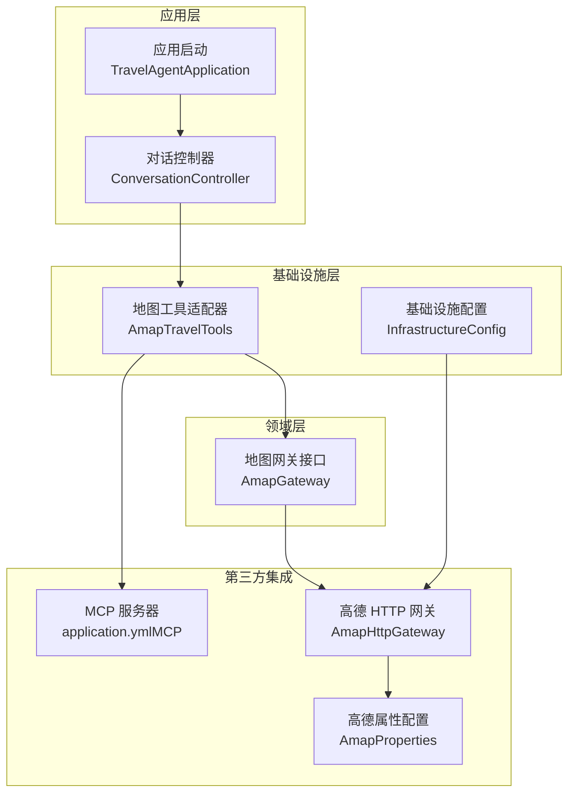
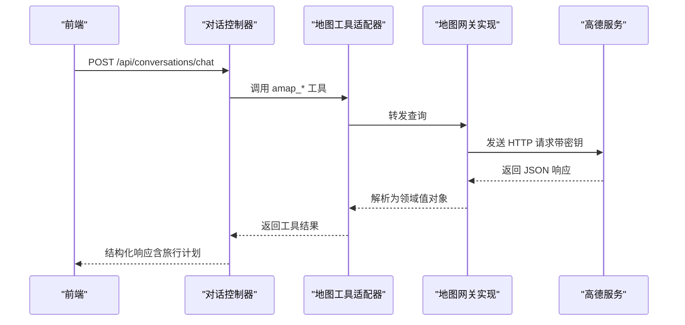
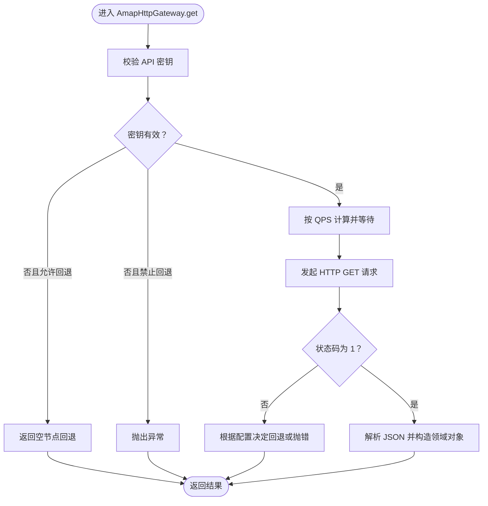
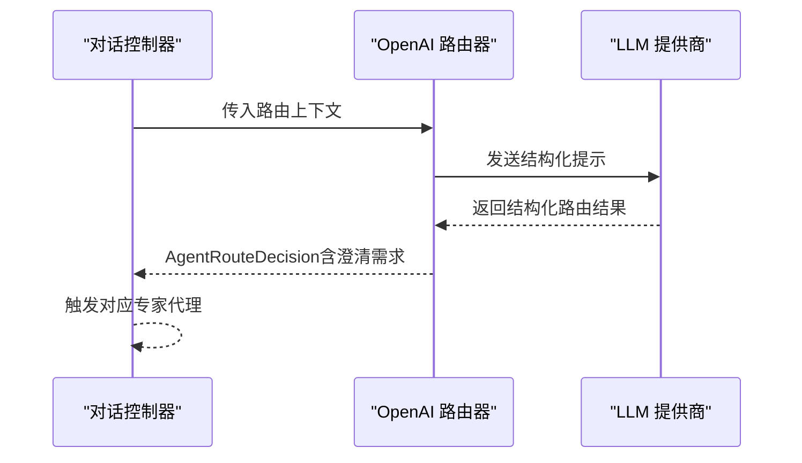
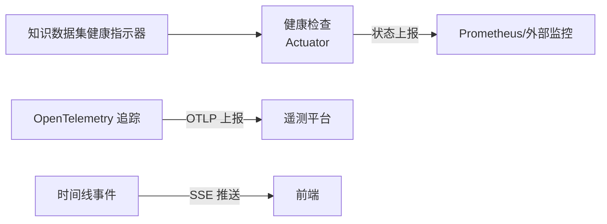
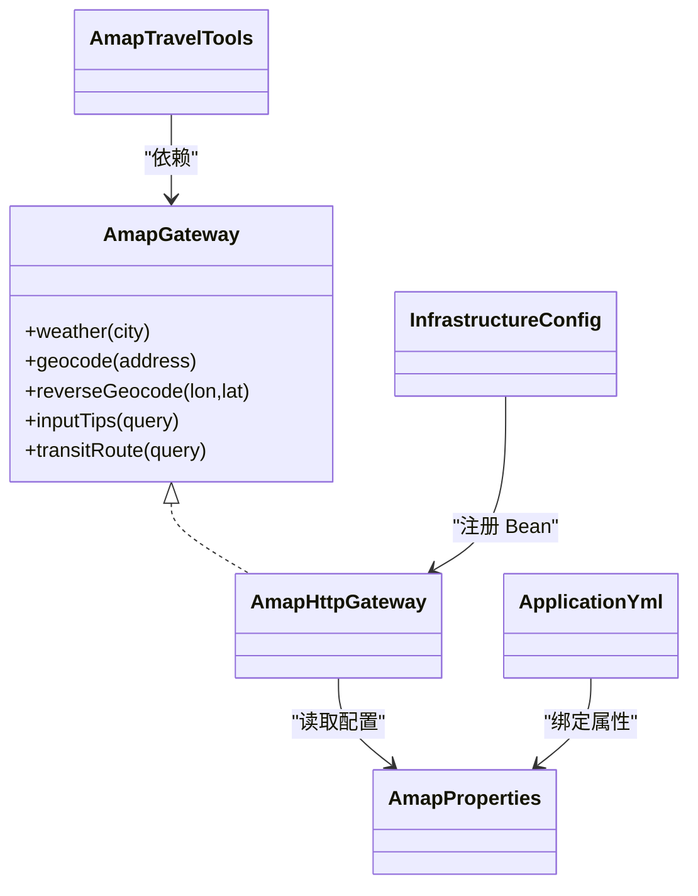

# 第三方集成开发

<cite>
**本文引用的文件**
- [README.md](file://README.md)
- [AmapConfig.java](file://travel-agent-amap/src/main/java/com/travalagent/amap/config/AmapConfig.java)
- [AmapProperties.java](file://travel-agent-amap/src/main/java/com/travalagent/amap/config/AmapProperties.java)
- [AmapHttpGateway.java](file://travel-agent-amap/src/main/java/com/travalagent/amap/gateway/AmapHttpGateway.java)
- [AmapGateway.java](file://travel-agent-domain/src/main/java/com/travalagent/domain/gateway/AmapGateway.java)
- [AmapTravelTools.java](file://travel-agent-infrastructure/src/main/java/com/travalagent/infrastructure/gateway/tool/AmapTravelTools.java)
- [InfrastructureConfig.java](file://travel-agent-infrastructure/src/main/java/com/travalagent/infrastructure/config/InfrastructureConfig.java)
- [application.yml（应用）](file://travel-agent-app/src/main/resources/application.yml)
- [application.yml（MCP 服务器）](file://travel-agent-amap-mcp-server/src/main/resources/application.yml)
- [TravelAgentApplication.java](file://travel-agent-app/src/main/java/com/travalagent/app/TravelAgentApplication.java)
- [ConversationController.java](file://travel-agent-app/src/main/java/com/travalagent/app/controller/ConversationController.java)
- [KnowledgeDatasetHealthIndicator.java](file://travel-agent-app/src/main/java/com/travalagent/app/health/KnowledgeDatasetHealthIndicator.java)
- [TravelAgentSmokeIntegrationTest.java](file://travel-agent-app/src/test/java/com/travalagent/app/integration/TravelAgentSmokeIntegrationTest.java)
- [AmapHttpGatewayTest.java](file://travel-agent-amap/src/test/java/com/travalagent/amap/gateway/AmapHttpGatewayTest.java)
- [OpenAiAgentRouter.java](file://travel-agent-infrastructure/src/main/java/com/travalagent/infrastructure/gateway/llm/OpenAiAgentRouter.java)
</cite>

## 目录
1. [引言](#引言)
2. [项目结构](#项目结构)
3. [核心组件](#核心组件)
4. [架构总览](#架构总览)
5. [详细组件分析](#详细组件分析)
6. [依赖关系分析](#依赖关系分析)
7. [性能考量](#性能考量)
8. [故障排查指南](#故障排查指南)
9. [结论](#结论)
10. [附录](#附录)

## 引言
本指南面向需要在旅行代理系统中接入“第三方地图服务”与“第三方AI模型服务”的开发者，提供从配置、请求映射、响应解析到监控与故障恢复的完整实践路径。系统当前以高德地图（Amap）为默认地图提供商，以 OpenAI 兼容接口为默认大模型服务，采用分层架构与端到端集成测试保障质量。

## 项目结构
- travel-agent-amap：高德地图 HTTP 集成模块，负责 API 密钥、请求节流、错误回退与响应解析。
- travel-agent-domain：领域层，定义地图网关接口与值对象。
- travel-agent-infrastructure：基础设施层，包含工具适配器、向量存储客户端、嵌入模型等。
- travel-agent-app：应用层，REST API、SSE 流、健康检查与配置加载。
- travel-agent-amap-mcp-server：独立 MCP 服务器，用于将地图能力暴露为工具供 LLM 调用。
- web：前端工作区，与后端交互并展示结果。

图表来源
- [TravelAgentApplication.java:1-15](file://travel-agent-app/src/main/java/com/travalagent/app/TravelAgentApplication.java#L1-L15)
- [ConversationController.java:1-101](file://travel-agent-app/src/main/java/com/travalagent/app/controller/ConversationController.java#L1-L101)
- [AmapGateway.java:1-28](file://travel-agent-domain/src/main/java/com/travalagent/domain/gateway/AmapGateway.java#L1-L28)
- [AmapTravelTools.java:1-119](file://travel-agent-infrastructure/src/main/java/com/travalagent/infrastructure/gateway/tool/AmapTravelTools.java#L1-L119)
- [AmapHttpGateway.java:1-481](file://travel-agent-amap/src/main/java/com/travalagent/amap/gateway/AmapHttpGateway.java#L1-L481)
- [AmapProperties.java:1-54](file://travel-agent-amap/src/main/java/com/travalagent/amap/config/AmapProperties.java#L1-L54)
- [application.yml（MCP 服务器）:1-35](file://travel-agent-amap-mcp-server/src/main/resources/application.yml#L1-L35)

章节来源
- [README.md:236-261](file://README.md#L236-L261)

## 核心组件
- 地图网关接口：定义天气、地理编码、逆地理编码、输入提示、公交路线等能力契约，便于替换不同地图提供商。
- 高德 HTTP 网关：实现具体调用、参数拼装、限流、错误回退与响应解析。
- 工具适配器：将地图能力封装为 LLM 可用的工具，支持 MCP 协议。
- 应用配置：统一管理 OpenAI/MCP/高德等第三方服务的密钥、URL、超时与开关。
- 基础设施配置：注册通用 HTTP 客户端与嵌入模型等。

章节来源
- [AmapGateway.java:12-27](file://travel-agent-domain/src/main/java/com/travalagent/domain/gateway/AmapGateway.java#L12-L27)
- [AmapHttpGateway.java:27-39](file://travel-agent-amap/src/main/java/com/travalagent/amap/gateway/AmapHttpGateway.java#L27-L39)
- [AmapTravelTools.java:22-30](file://travel-agent-infrastructure/src/main/java/com/travalagent/infrastructure/gateway/tool/AmapTravelTools.java#L22-L30)
- [application.yml（应用）:17-100](file://travel-agent-app/src/main/resources/application.yml#L17-L100)
- [InfrastructureConfig.java:12-35](file://travel-agent-infrastructure/src/main/java/com/travalagent/infrastructure/config/InfrastructureConfig.java#L12-L35)

## 架构总览
系统采用分层与端口适配器风格：应用层编排业务流程；领域层定义契约；基础设施层对接第三方服务；前端通过 REST API 与 SSE 获取实时事件流。

图表来源
- [ConversationController.java:47-51](file://travel-agent-app/src/main/java/com/travalagent/app/controller/ConversationController.java#L47-L51)
- [AmapTravelTools.java:32-39](file://travel-agent-infrastructure/src/main/java/com/travalagent/infrastructure/gateway/tool/AmapTravelTools.java#L32-L39)
- [AmapHttpGateway.java:392-422](file://travel-agent-amap/src/main/java/com/travalagent/amap/gateway/AmapHttpGateway.java#L392-L422)

## 详细组件分析

### 组件一：地图服务提供商接入（以高德为例）
- API 密钥配置
  - 在应用配置中设置高德 API 密钥与基础 URL；当密钥缺失时可启用“缺失时回退”或“错误时回退”策略。
  - MCP 服务器配置中同样可覆盖高德密钥与基础 URL，便于本地联调。
- 请求参数映射
  - 输入提示、公交路线等均通过参数字典拼装，自动附加 API 密钥与分页/范围参数。
- 响应数据解析
  - 使用 Jackson 解析 JSON，提取关键字段并构造领域值对象；对空结果进行安全回退。
- 限流与稳定性
  - 基于 QPS 配置计算最小间隔，使用同步锁保证连续调用的节流。

图表来源
- [AmapHttpGateway.java:392-422](file://travel-agent-amap/src/main/java/com/travalagent/amap/gateway/AmapHttpGateway.java#L392-L422)
- [AmapHttpGateway.java:460-479](file://travel-agent-amap/src/main/java/com/travalagent/amap/gateway/AmapHttpGateway.java#L460-L479)
- [AmapProperties.java:8-52](file://travel-agent-amap/src/main/java/com/travalagent/amap/config/AmapProperties.java#L8-L52)

章节来源
- [AmapHttpGateway.java:41-57](file://travel-agent-amap/src/main/java/com/travalagent/amap/gateway/AmapHttpGateway.java#L41-L57)
- [AmapHttpGateway.java:60-98](file://travel-agent-amap/src/main/java/com/travalagent/amap/gateway/AmapHttpGateway.java#L60-L98)
- [AmapHttpGateway.java:100-151](file://travel-agent-amap/src/main/java/com/travalagent/amap/gateway/AmapHttpGateway.java#L100-L151)
- [AmapHttpGateway.java:153-208](file://travel-agent-amap/src/main/java/com/travalagent/amap/gateway/AmapHttpGateway.java#L153-L208)
- [AmapProperties.java:8-52](file://travel-agent-amap/src/main/java/com/travalagent/amap/config/AmapProperties.java#L8-L52)
- [application.yml（应用）:65-70](file://travel-agent-app/src/main/resources/application.yml#L65-L70)
- [application.yml（MCP 服务器）:28-35](file://travel-agent-amap-mcp-server/src/main/resources/application.yml#L28-L35)

### 组件二：AI 模型提供商集成（以 OpenAI 兼容为例）
- 认证机制
  - 通过环境变量注入 OpenAI API 密钥与基础 URL；应用配置中可覆盖模型名称与温度等选项。
- 请求格式转换
  - 路由器基于用户消息与上下文生成结构化提示，调用 ChatClient 后解析为路由决策。
- 响应处理
  - 将路由决策与澄清问题传递给应用层，驱动后续规划流程。

图表来源
- [OpenAiAgentRouter.java:29-72](file://travel-agent-infrastructure/src/main/java/com/travalagent/infrastructure/gateway/llm/OpenAiAgentRouter.java#L29-L72)
- [application.yml（应用）:17-27](file://travel-agent-app/src/main/resources/application.yml#L17-L27)

章节来源
- [OpenAiAgentRouter.java:13-27](file://travel-agent-infrastructure/src/main/java/com/travalagent/infrastructure/gateway/llm/OpenAiAgentRouter.java#L13-L27)
- [OpenAiAgentRouter.java:137-143](file://travel-agent-infrastructure/src/main/java/com/travalagent/infrastructure/gateway/llm/OpenAiAgentRouter.java#L137-L143)
- [application.yml（应用）:17-27](file://travel-agent-app/src/main/resources/application.yml#L17-L27)

### 组件三：数据源接入最佳实践（连接池、超时与重试）
- 连接池配置
  - 数据源使用 Hikari 连接池，默认最大池大小与最小空闲已配置，适合单机演示场景。
- 超时设置
  - MCP 客户端请求超时可在应用配置中调整；HTTP 层通过 RestTemplate/RestClient 的默认行为控制。
- 重试策略
  - 当前未内置通用重试逻辑，建议在第三方调用层（如 AmapHttpGateway）增加指数退避重试，结合熔断与隔离。

章节来源
- [application.yml（应用）:10-16](file://travel-agent-app/src/main/resources/application.yml#L10-L16)
- [application.yml（应用）:33-40](file://travel-agent-app/src/main/resources/application.yml#L33-L40)

### 组件四：监控指标、日志与健康检查
- 健康检查
  - Actuator 暴露健康端点；知识数据集健康指示器用于检测本地知识是否加载成功。
- 日志与追踪
  - 应用配置启用 OpenTelemetry OTLP 上报；MCP 客户端支持采样概率控制。
- 工具调用事件
  - 工具适配器在调用前后发布时间线事件，便于前端 SSE 实时展示。

图表来源
- [application.yml（应用）:42-56](file://travel-agent-app/src/main/resources/application.yml#L42-L56)
- [KnowledgeDatasetHealthIndicator.java:17-29](file://travel-agent-app/src/main/java/com/travalagent/app/health/KnowledgeDatasetHealthIndicator.java#L17-L29)
- [AmapTravelTools.java:106-117](file://travel-agent-infrastructure/src/main/java/com/travalagent/infrastructure/gateway/tool/AmapTravelTools.java#L106-L117)

章节来源
- [application.yml（应用）:42-56](file://travel-agent-app/src/main/resources/application.yml#L42-L56)
- [KnowledgeDatasetHealthIndicator.java:1-31](file://travel-agent-app/src/main/java/com/travalagent/app/health/KnowledgeDatasetHealthIndicator.java#L1-L31)
- [AmapTravelTools.java:106-117](file://travel-agent-infrastructure/src/main/java/com/travalagent/infrastructure/gateway/tool/AmapTravelTools.java#L106-L117)

### 组件五：集成示例（步骤清单）
- 修改配置文件
  - 在应用配置中设置高德 API 密钥、基础 URL、QPS 限制；如需 MCP 工具，配置 MCP 客户端与端点。
  - 如需使用本地工具而非 MCP，可在应用配置中切换工具提供方。
- 实现服务类
  - 若更换地图提供商，实现领域网关接口并在基础设施层注册 Bean。
  - 若更换 AI 提供商，替换 ChatClient 配置或实现自定义路由器。
- 编写测试用例
  - 参考现有集成测试，验证健康检查、聊天接口返回结构化旅行计划。
  - 对地图网关新增单元测试，覆盖密钥缺失、回退策略与 QPS 节流。

章节来源
- [application.yml（应用）:61-61](file://travel-agent-app/src/main/resources/application.yml#L61-L61)
- [application.yml（应用）:33-40](file://travel-agent-app/src/main/resources/application.yml#L33-L40)
- [TravelAgentSmokeIntegrationTest.java:60-92](file://travel-agent-app/src/test/java/com/travalagent/app/integration/TravelAgentSmokeIntegrationTest.java#L60-L92)
- [AmapHttpGatewayTest.java:16-56](file://travel-agent-amap/src/test/java/com/travalagent/amap/gateway/AmapHttpGatewayTest.java#L16-L56)

## 依赖关系分析
- 应用层依赖基础设施层提供的工具与路由能力；基础设施层依赖领域网关接口，确保可替换性。
- 高德 HTTP 网关依赖配置属性与通用 RestClient；工具适配器依赖时间线发布器。
- MCP 服务器与应用通过配置共享高德密钥与基础 URL，便于联调。

图表来源
- [AmapGateway.java:12-27](file://travel-agent-domain/src/main/java/com/travalagent/domain/gateway/AmapGateway.java#L12-L27)
- [AmapHttpGateway.java:27-39](file://travel-agent-amap/src/main/java/com/travalagent/amap/gateway/AmapHttpGateway.java#L27-L39)
- [AmapTravelTools.java:22-30](file://travel-agent-infrastructure/src/main/java/com/travalagent/infrastructure/gateway/tool/AmapTravelTools.java#L22-L30)
- [AmapProperties.java:5-6](file://travel-agent-amap/src/main/java/com/travalagent/amap/config/AmapProperties.java#L5-L6)
- [InfrastructureConfig.java:12-24](file://travel-agent-infrastructure/src/main/java/com/travalagent/infrastructure/config/InfrastructureConfig.java#L12-L24)
- [application.yml（应用）:65-70](file://travel-agent-app/src/main/resources/application.yml#L65-L70)

章节来源
- [AmapConfig.java:8-16](file://travel-agent-amap/src/main/java/com/travalagent/amap/config/AmapConfig.java#L8-L16)
- [InfrastructureConfig.java:12-24](file://travel-agent-infrastructure/src/main/java/com/travalagent/infrastructure/config/InfrastructureConfig.java#L12-L24)

## 性能考量
- QPS 限流：通过最小间隔控制请求频率，避免触发第三方配额限制。
- 连接池：Hikari 默认池大小较小，适合开发环境；生产环境建议根据并发与数据库能力调优。
- 追踪采样：可通过环境变量调整采样概率，平衡可观测性与性能。
- 嵌入模型：系统提供哈希嵌入模型作为占位实现，实际部署建议使用更高质量的嵌入模型并配置缓存。

章节来源
- [AmapHttpGateway.java:460-479](file://travel-agent-amap/src/main/java/com/travalagent/amap/gateway/AmapHttpGateway.java#L460-L479)
- [application.yml（应用）:10-16](file://travel-agent-app/src/main/resources/application.yml#L10-L16)
- [application.yml（应用）:50-56](file://travel-agent-app/src/main/resources/application.yml#L50-L56)
- [InfrastructureConfig.java:21-24](file://travel-agent-infrastructure/src/main/java/com/travalagent/infrastructure/config/InfrastructureConfig.java#L21-L24)

## 故障排查指南
- 高德 API 密钥缺失
  - 现象：抛出密钥必需异常；若启用“缺失时回退”，将返回模拟数据。
  - 处理：设置正确密钥或开启回退；检查应用与 MCP 服务器配置。
- 请求失败与状态码非 1
  - 现象：抛出异常并包含错误信息与错误码；若启用“错误时回退”，将返回空节点。
  - 处理：检查网络、密钥与参数；必要时降低 QPS 或增加重试。
- QPS 节流导致延迟
  - 现象：连续调用之间出现等待；可通过提高 QPS 配置缓解。
  - 处理：评估第三方配额，合理设置最小间隔。
- 健康检查失败
  - 现象：知识数据集为空导致健康状态为 down。
  - 处理：确认知识数据加载脚本与初始化 SQL 执行成功。

章节来源
- [AmapHttpGateway.java:392-422](file://travel-agent-amap/src/main/java/com/travalagent/amap/gateway/AmapHttpGateway.java#L392-L422)
- [AmapHttpGatewayTest.java:28-39](file://travel-agent-amap/src/test/java/com/travalagent/amap/gateway/AmapHttpGatewayTest.java#L28-L39)
- [AmapHttpGatewayTest.java:42-56](file://travel-agent-amap/src/test/java/com/travalagent/amap/gateway/AmapHttpGatewayTest.java#L42-L56)
- [KnowledgeDatasetHealthIndicator.java:17-29](file://travel-agent-app/src/main/java/com/travalagent/app/health/KnowledgeDatasetHealthIndicator.java#L17-L29)

## 结论
通过领域网关接口与基础设施适配器，系统实现了对第三方地图与 AI 服务的解耦与可替换性。遵循本文的配置、映射与解析规范，结合限流、回退与可观测性实践，可快速、稳健地完成新提供商接入，并保持与现有业务流程的一致性。

## 附录
- 快速对照表
  - 高德密钥与基础 URL：应用配置与 MCP 服务器配置
  - MCP 工具开关与超时：应用配置中的 MCP 客户端段落
  - 工具提供方切换：应用配置中的工具提供方键
  - 健康检查端点：Actuator 健康端点
  - 追踪上报：OTLP 端点与采样概率

章节来源
- [application.yml（应用）:65-70](file://travel-agent-app/src/main/resources/application.yml#L65-L70)
- [application.yml（应用）:33-40](file://travel-agent-app/src/main/resources/application.yml#L33-L40)
- [application.yml（应用）:42-56](file://travel-agent-app/src/main/resources/application.yml#L42-L56)
- [application.yml（MCP 服务器）:28-35](file://travel-agent-amap-mcp-server/src/main/resources/application.yml#L28-L35)