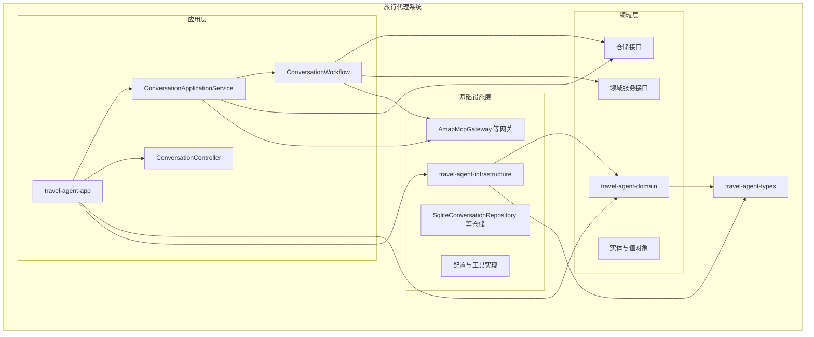
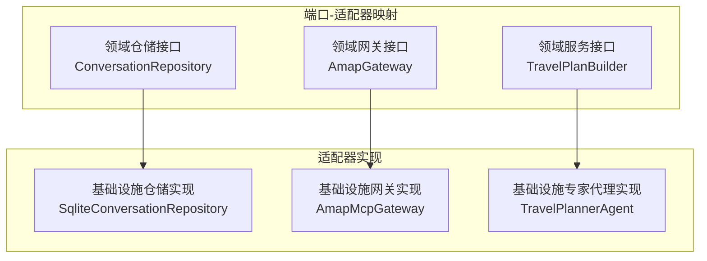
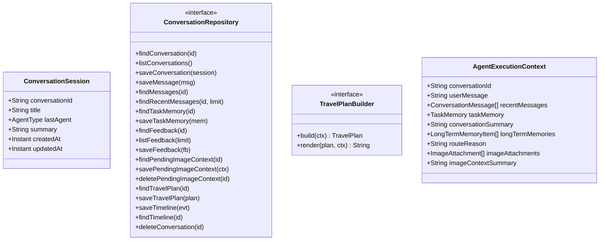
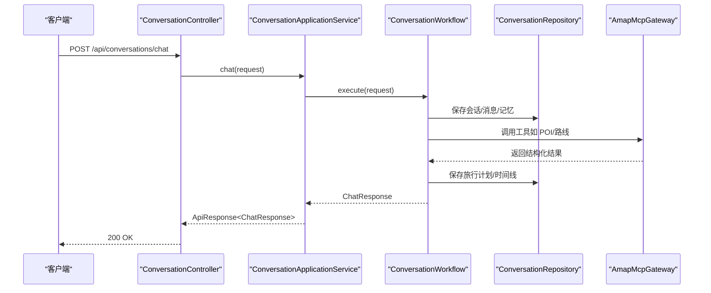
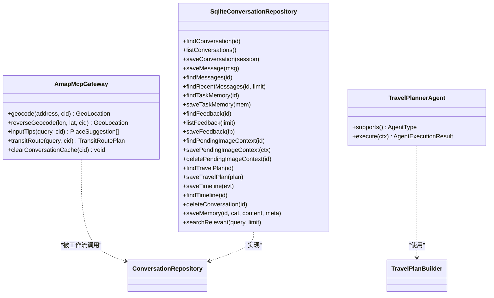
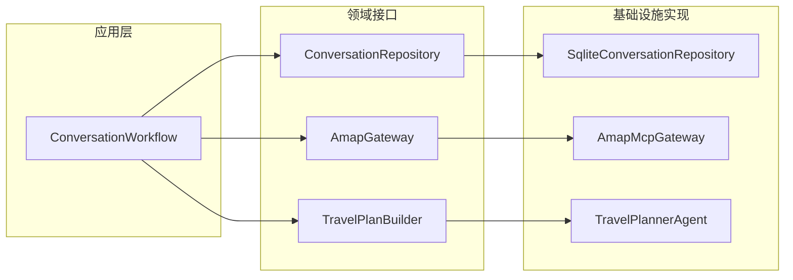
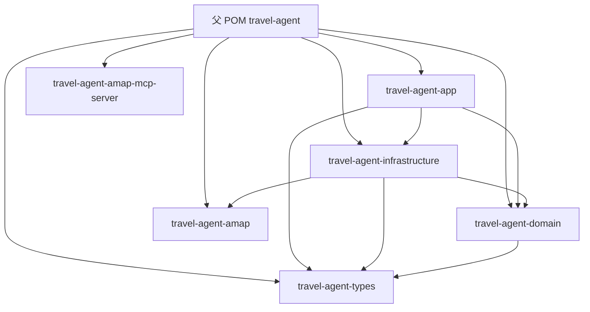

# 分层架构设计

<cite>
**本文引用的文件**
- [pom.xml](file://pom.xml)
- [travel-agent-domain/pom.xml](file://travel-agent-domain/pom.xml)
- [travel-agent-app/pom.xml](file://travel-agent-app/pom.xml)
- [travel-agent-infrastructure/pom.xml](file://travel-agent-infrastructure/pom.xml)
- [travel-agent-types/pom.xml](file://travel-agent-types/pom.xml)
- [ConversationSession.java](file://travel-agent-domain/src/main/java/com/travalagent/domain/model/entity/ConversationSession.java)
- [ConversationRepository.java](file://travel-agent-domain/src/main/java/com/travalagent/domain/repository/ConversationRepository.java)
- [TravelPlanBuilder.java](file://travel-agent-domain/src/main/java/com/travalagent/domain/service/TravelPlanBuilder.java)
- [AgentExecutionContext.java](file://travel-agent-domain/src/main/java/com/travalagent/domain/model/valobj/AgentExecutionContext.java)
- [ConversationApplicationService.java](file://travel-agent-app/src/main/java/com/travalagent/app/service/ConversationApplicationService.java)
- [ConversationWorkflow.java](file://travel-agent-app/src/main/java/com/travalagent/app/service/ConversationWorkflow.java)
- [ConversationController.java](file://travel-agent-app/src/main/java/com/travalagent/app/controller/ConversationController.java)
- [AmapMcpGateway.java](file://travel-agent-infrastructure/src/main/java/com/travalagent/infrastructure/gateway/tool/AmapMcpGateway.java)
- [SqliteConversationRepository.java](file://travel-agent-infrastructure/src/main/java/com/travalagent/infrastructure/repository/SqliteConversationRepository.java)
- [TravelPlannerAgent.java](file://travel-agent-infrastructure/src/main/java/com/travalagent/infrastructure/gateway/llm/TravelPlannerAgent.java)
</cite>

## 目录
1. [引言](#引言)
2. [项目结构](#项目结构)
3. [核心组件](#核心组件)
4. [架构总览](#架构总览)
5. [详细组件分析](#详细组件分析)
6. [依赖分析](#依赖分析)
7. [性能考虑](#性能考虑)
8. [故障排查指南](#故障排查指南)
9. [结论](#结论)

## 引言
本设计文档面向 TravelAgent 项目的分层架构与 DDD（领域驱动设计）实现，聚焦三层架构：领域层（Domain Layer）、应用层（Application Layer）、基础设施层（Infrastructure Layer）。文档解释每层职责与边界，梳理领域模型（实体、值对象、仓储接口）、应用服务编排与工作流、基础设施中的工具实现与持久化，并以端口-适配器模式为主线，说明如何通过接口隔离实现层间解耦。同时给出关键流程的时序图与类图，帮助读者快速把握系统运行机制。

## 项目结构
TravelAgent 采用 Maven 多模块组织，父 POM 定义了统一版本与仓库配置，子模块按关注点拆分：
- travel-agent-types：通用类型与异常定义
- travel-agent-domain：领域模型与业务接口
- travel-agent-amap：高德 MCP 工具定义与配置
- travel-agent-infrastructure：基础设施实现（网关、仓储、配置）
- travel-agent-app：应用入口与控制器，承载应用服务与工作流
- travel-agent-amap-mcp-server：MCP 服务器（与本设计文档不直接分析）

**图表来源**
- [pom.xml:1-58](file://pom.xml#L1-L58)
- [travel-agent-app/pom.xml:1-78](file://travel-agent-app/pom.xml#L1-L78)
- [travel-agent-domain/pom.xml:1-24](file://travel-agent-domain/pom.xml#L1-L24)
- [travel-agent-infrastructure/pom.xml:1-77](file://travel-agent-infrastructure/pom.xml#L1-L77)
- [travel-agent-types/pom.xml:1-16](file://travel-agent-types/pom.xml#L1-L16)

**章节来源**
- [pom.xml:1-58](file://pom.xml#L1-L58)
- [travel-agent-app/pom.xml:1-78](file://travel-agent-app/pom.xml#L1-L78)
- [travel-agent-domain/pom.xml:1-24](file://travel-agent-domain/pom.xml#L1-L24)
- [travel-agent-infrastructure/pom.xml:1-77](file://travel-agent-infrastructure/pom.xml#L1-L77)
- [travel-agent-types/pom.xml:1-16](file://travel-agent-types/pom.xml#L1-L16)

## 核心组件
- 领域层（Domain Layer）
  - 实体与值对象：如会话、消息、任务记忆、旅行计划等，承载业务不变量与行为契约
  - 仓储接口：抽象数据访问能力，屏蔽存储细节
  - 领域服务接口：封装跨实体的复杂业务逻辑
- 应用层（Application Layer）
  - 控制器：暴露 REST 接口，接收请求并返回响应
  - 应用服务：编排业务流程，协调仓储与外部工具
  - 工作流：对用户输入进行路由、记忆回放、专家代理执行、总结与持久化
- 基础设施层（Infrastructure Layer）
  - 网关：封装外部工具调用（如高德 MCP），提供稳定接口
  - 仓储实现：基于 JDBC 的 SQLite 存储，负责序列化/反序列化与 SQL 访问
  - 配置与工具：Jackson、属性绑定、缓存与节流等

**章节来源**
- [ConversationSession.java:1-16](file://travel-agent-domain/src/main/java/com/travalagent/domain/model/entity/ConversationSession.java#L1-L16)
- [ConversationRepository.java:1-55](file://travel-agent-domain/src/main/java/com/travalagent/domain/repository/ConversationRepository.java#L1-L55)
- [TravelPlanBuilder.java:1-13](file://travel-agent-domain/src/main/java/com/travalagent/domain/service/TravelPlanBuilder.java#L1-L13)
- [AgentExecutionContext.java:1-38](file://travel-agent-domain/src/main/java/com/travalagent/domain/model/valobj/AgentExecutionContext.java#L1-L38)
- [ConversationController.java:1-101](file://travel-agent-app/src/main/java/com/travalagent/app/controller/ConversationController.java#L1-L101)
- [ConversationApplicationService.java:1-394](file://travel-agent-app/src/main/java/com/travalagent/app/service/ConversationApplicationService.java#L1-L394)
- [ConversationWorkflow.java:1-814](file://travel-agent-app/src/main/java/com/travalagent/app/service/ConversationWorkflow.java#L1-L814)
- [AmapMcpGateway.java:1-196](file://travel-agent-infrastructure/src/main/java/com/travalagent/infrastructure/gateway/tool/AmapMcpGateway.java#L1-L196)
- [SqliteConversationRepository.java:1-580](file://travel-agent-infrastructure/src/main/java/com/travalagent/infrastructure/repository/SqliteConversationRepository.java#L1-L580)

## 架构总览
系统遵循 DDD 分层与端口-适配器模式：
- 领域层仅包含业务模型与接口，不依赖应用与基础设施
- 应用层依赖领域接口，组合仓储与外部工具，编排业务工作流
- 基础设施层实现领域接口与外部工具，提供具体实现
- 端口-适配器体现在：领域接口作为“端口”，基础设施实现作为“适配器”对接这些端口

**图表来源**
- [ConversationRepository.java:14-55](file://travel-agent-domain/src/main/java/com/travalagent/domain/repository/ConversationRepository.java#L14-L55)
- [TravelPlanBuilder.java:6-13](file://travel-agent-domain/src/main/java/com/travalagent/domain/service/TravelPlanBuilder.java#L6-L13)
- [AmapMcpGateway.java:28-196](file://travel-agent-infrastructure/src/main/java/com/travalagent/infrastructure/gateway/tool/AmapMcpGateway.java#L28-L196)
- [SqliteConversationRepository.java:36-580](file://travel-agent-infrastructure/src/main/java/com/travalagent/infrastructure/repository/SqliteConversationRepository.java#L36-L580)
- [TravelPlannerAgent.java:28-570](file://travel-agent-infrastructure/src/main/java/com/travalagent/infrastructure/gateway/llm/TravelPlannerAgent.java#L28-L570)

## 详细组件分析

### 领域层（Domain Layer）
- 职责与边界
  - 定义业务不变量与行为契约，保持与技术实现无关
  - 提供稳定的接口（仓储、服务、网关），由基础设施层实现
- 关键元素
  - 实体与值对象：会话、消息、任务记忆、旅行计划、地理坐标、路线查询等
  - 仓储接口：统一的数据访问抽象，屏蔽存储细节
  - 领域服务接口：如旅行计划构建器，封装复杂规划逻辑

**图表来源**
- [ConversationSession.java:1-16](file://travel-agent-domain/src/main/java/com/travalagent/domain/model/entity/ConversationSession.java#L1-L16)
- [ConversationRepository.java:14-55](file://travel-agent-domain/src/main/java/com/travalagent/domain/repository/ConversationRepository.java#L14-L55)
- [TravelPlanBuilder.java:6-13](file://travel-agent-domain/src/main/java/com/travalagent/domain/service/TravelPlanBuilder.java#L6-L13)
- [AgentExecutionContext.java:8-38](file://travel-agent-domain/src/main/java/com/travalagent/domain/model/valobj/AgentExecutionContext.java#L8-L38)

**章节来源**
- [ConversationSession.java:1-16](file://travel-agent-domain/src/main/java/com/travalagent/domain/model/entity/ConversationSession.java#L1-L16)
- [ConversationRepository.java:1-55](file://travel-agent-domain/src/main/java/com/travalagent/domain/repository/ConversationRepository.java#L1-L55)
- [TravelPlanBuilder.java:1-13](file://travel-agent-domain/src/main/java/com/travalagent/domain/service/TravelPlanBuilder.java#L1-L13)
- [AgentExecutionContext.java:1-38](file://travel-agent-domain/src/main/java/com/travalagent/domain/model/valobj/AgentExecutionContext.java#L1-L38)

### 应用层（Application Layer）
- 职责与边界
  - 对外暴露 REST 接口，编排业务流程
  - 协调仓储与外部工具，处理 DTO 映射与响应封装
- 关键元素
  - 控制器：接收请求、返回标准响应
  - 应用服务：保存反馈、导出数据集、汇总反馈、删除会话等
  - 工作流：解析输入、构建记忆上下文、路由专家代理、执行与持久化

**图表来源**
- [ConversationController.java:47-51](file://travel-agent-app/src/main/java/com/travalagent/app/controller/ConversationController.java#L47-L51)
- [ConversationApplicationService.java:52-54](file://travel-agent-app/src/main/java/com/travalagent/app/service/ConversationApplicationService.java#L52-L54)
- [ConversationWorkflow.java:107-160](file://travel-agent-app/src/main/java/com/travalagent/app/service/ConversationWorkflow.java#L107-L160)
- [ConversationRepository.java:16-53](file://travel-agent-domain/src/main/java/com/travalagent/domain/repository/ConversationRepository.java#L16-L53)
- [AmapMcpGateway.java:49-123](file://travel-agent-infrastructure/src/main/java/com/travalagent/infrastructure/gateway/tool/AmapMcpGateway.java#L49-L123)

**章节来源**
- [ConversationController.java:1-101](file://travel-agent-app/src/main/java/com/travalagent/app/controller/ConversationController.java#L1-L101)
- [ConversationApplicationService.java:1-394](file://travel-agent-app/src/main/java/com/travalagent/app/service/ConversationApplicationService.java#L1-L394)
- [ConversationWorkflow.java:1-814](file://travel-agent-app/src/main/java/com/travalagent/app/service/ConversationWorkflow.java#L1-L814)

### 基础设施层（Infrastructure Layer）
- 职责与边界
  - 实现领域接口，提供具体工具与存储
  - 封装外部系统（如高德 MCP）与内部存储（SQLite）
- 关键元素
  - 网关：AmapMcpGateway 提供地理编码、路径规划、输入提示等工具调用，并内置缓存与节流
  - 仓储：SqliteConversationRepository 实现所有仓储方法，负责 JSON 序列化与 SQL 持久化
  - 专家代理：TravelPlannerAgent 实现旅行规划与修复、验证、知识检索、天气获取等

**图表来源**
- [AmapMcpGateway.java:28-196](file://travel-agent-infrastructure/src/main/java/com/travalagent/infrastructure/gateway/tool/AmapMcpGateway.java#L28-L196)
- [SqliteConversationRepository.java:36-580](file://travel-agent-infrastructure/src/main/java/com/travalagent/infrastructure/repository/SqliteConversationRepository.java#L36-L580)
- [TravelPlannerAgent.java:28-570](file://travel-agent-infrastructure/src/main/java/com/travalagent/infrastructure/gateway/llm/TravelPlannerAgent.java#L28-L570)

**章节来源**
- [AmapMcpGateway.java:1-196](file://travel-agent-infrastructure/src/main/java/com/travalagent/infrastructure/gateway/tool/AmapMcpGateway.java#L1-L196)
- [SqliteConversationRepository.java:1-580](file://travel-agent-infrastructure/src/main/java/com/travalagent/infrastructure/repository/SqliteConversationRepository.java#L1-L580)
- [TravelPlannerAgent.java:1-570](file://travel-agent-infrastructure/src/main/java/com/travalagent/infrastructure/gateway/llm/TravelPlannerAgent.java#L1-L570)

### 端口-适配器模式详解
- 端口（Port）
  - 领域接口：如 ConversationRepository、TravelPlanBuilder、AmapGateway（在基础设施中实现）
- 适配器（Adapter）
  - 基础设施实现：SqliteConversationRepository、AmapMcpGateway、TravelPlannerAgent
- 解耦效果
  - 应用层只依赖领域接口，不感知具体实现
  - 可替换实现（如换用其他数据库或不同工具提供商）

**图表来源**
- [ConversationWorkflow.java:74-104](file://travel-agent-app/src/main/java/com/travalagent/app/service/ConversationWorkflow.java#L74-L104)
- [ConversationRepository.java:14-55](file://travel-agent-domain/src/main/java/com/travalagent/domain/repository/ConversationRepository.java#L14-L55)
- [TravelPlanBuilder.java:6-13](file://travel-agent-domain/src/main/java/com/travalagent/domain/service/TravelPlanBuilder.java#L6-L13)
- [AmapMcpGateway.java:28-196](file://travel-agent-infrastructure/src/main/java/com/travalagent/infrastructure/gateway/tool/AmapMcpGateway.java#L28-L196)
- [SqliteConversationRepository.java:36-580](file://travel-agent-infrastructure/src/main/java/com/travalagent/infrastructure/repository/SqliteConversationRepository.java#L36-L580)
- [TravelPlannerAgent.java:28-570](file://travel-agent-infrastructure/src/main/java/com/travalagent/infrastructure/gateway/llm/TravelPlannerAgent.java#L28-L570)

## 依赖分析
- 模块依赖
  - travel-agent-app 依赖 domain、infrastructure、types
  - travel-agent-infrastructure 依赖 domain、amap、types
  - travel-agent-domain 依赖 types
- 层间依赖方向
  - 应用层 → 领域层（依赖接口）
  - 基础设施层 → 领域层（实现接口）
  - 应用层 ↔ 基础设施层（通过接口交互）

**图表来源**
- [pom.xml:22-29](file://pom.xml#L22-L29)
- [travel-agent-app/pom.xml:16-31](file://travel-agent-app/pom.xml#L16-L31)
- [travel-agent-infrastructure/pom.xml:16-31](file://travel-agent-infrastructure/pom.xml#L16-L31)
- [travel-agent-domain/pom.xml:16-21](file://travel-agent-domain/pom.xml#L16-L21)

**章节来源**
- [pom.xml:1-58](file://pom.xml#L1-L58)
- [travel-agent-app/pom.xml:1-78](file://travel-agent-app/pom.xml#L1-L78)
- [travel-agent-infrastructure/pom.xml:1-77](file://travel-agent-infrastructure/pom.xml#L1-L77)
- [travel-agent-domain/pom.xml:1-24](file://travel-agent-domain/pom.xml#L1-L24)

## 性能考虑
- 请求节流与缓存
  - AmapMcpGateway 内置最小调用间隔与会话级缓存，降低外部调用频率与延迟抖动
- 存储序列化成本
  - SqliteConversationRepository 使用 Jackson 对复杂对象进行 JSON 序列化/反序列化，注意字段变更与兼容性
- 查询窗口与内存
  - 工作流根据配置窗口拉取近期消息，避免一次性加载全量历史导致内存压力
- 并发与事务
  - 工作流使用事务保证会话、消息、记忆、计划的一致写入

[本节为通用指导，无需特定文件引用]

## 故障排查指南
- 输入校验错误
  - 图片附件格式/大小/数量限制、语言/文本缺失等，均会在工作流中抛出应用异常
- 工具调用失败
  - MCP 工具返回结构化内容解析异常或找不到回调时，会抛出异常；检查工具定义与回调提供者注册
- 数据持久化异常
  - JSON 反序列化失败或 SQL 执行异常时，会抛出非法状态异常；检查字段类型与空值处理
- 缓存与节流
  - 若频繁触发节流或缓存命中异常，检查会话缓存清理与参数排序键生成

**章节来源**
- [ConversationWorkflow.java:534-575](file://travel-agent-app/src/main/java/com/travalagent/app/service/ConversationWorkflow.java#L534-L575)
- [AmapMcpGateway.java:102-153](file://travel-agent-infrastructure/src/main/java/com/travalagent/infrastructure/gateway/tool/AmapMcpGateway.java#L102-L153)
- [SqliteConversationRepository.java:511-550](file://travel-agent-infrastructure/src/main/java/com/travalagent/infrastructure/repository/SqliteConversationRepository.java#L511-L550)

## 结论
TravelAgent 通过清晰的三层架构与端口-适配器模式，实现了领域与实现的解耦。应用层专注于流程编排，领域层专注业务建模，基础设施层提供可替换的实现。该设计既满足了当前需求，也为后续扩展（如更换存储、接入新工具）提供了良好基础。