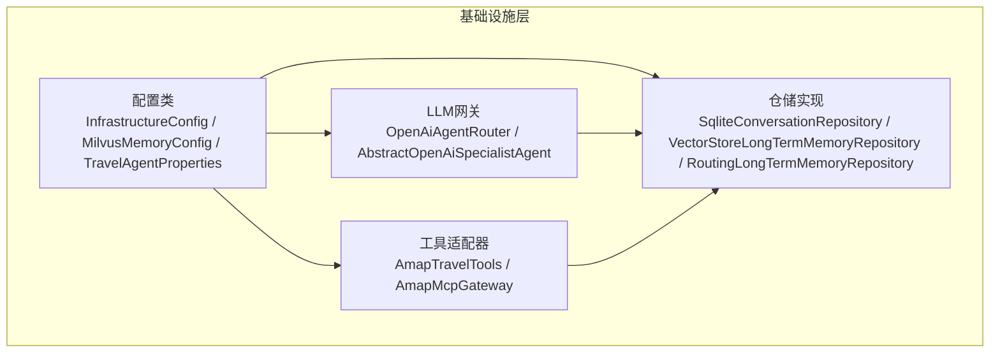
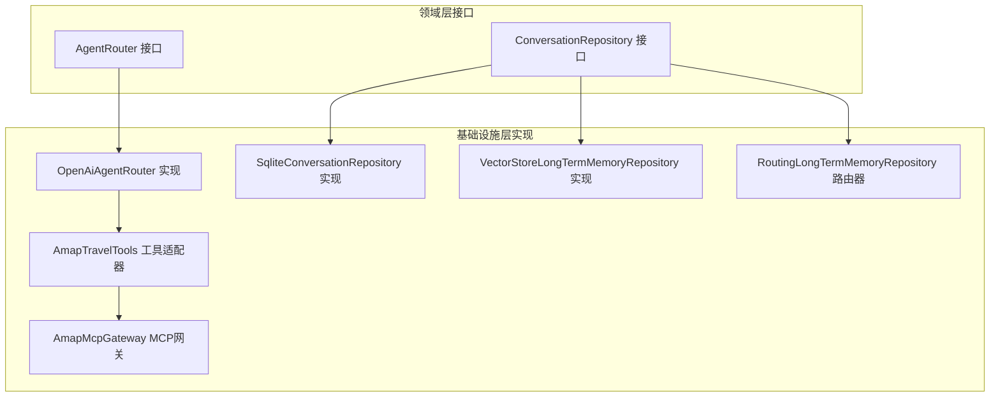
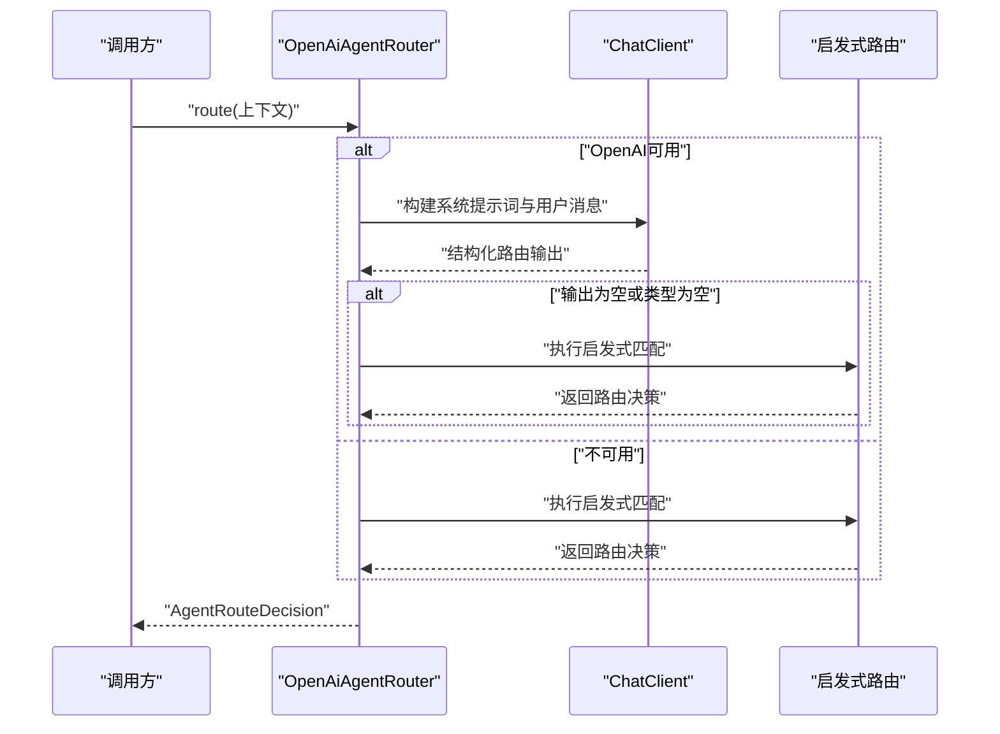
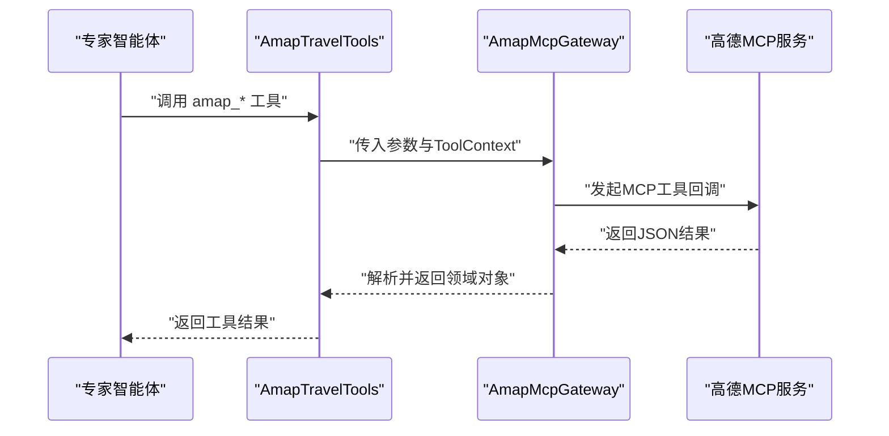
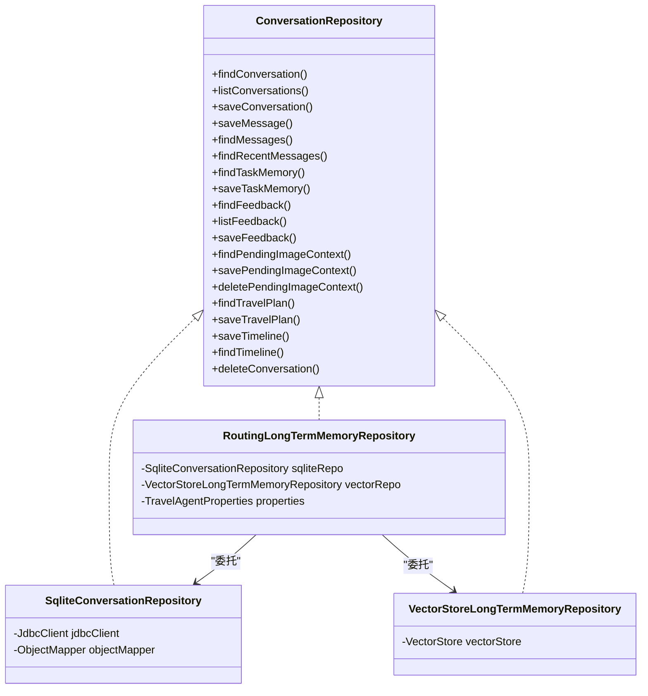
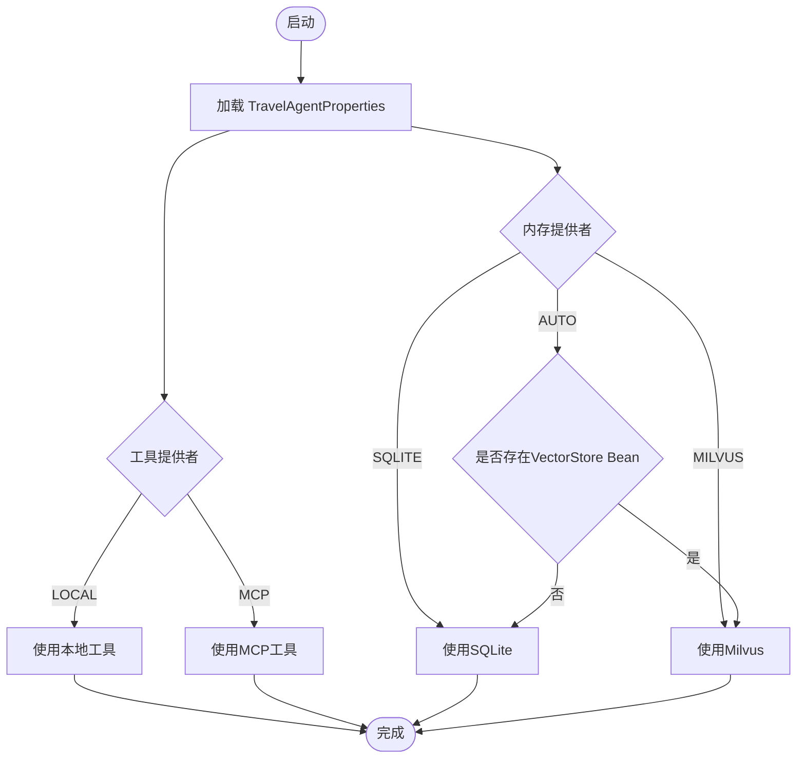
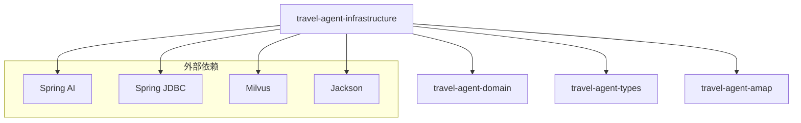
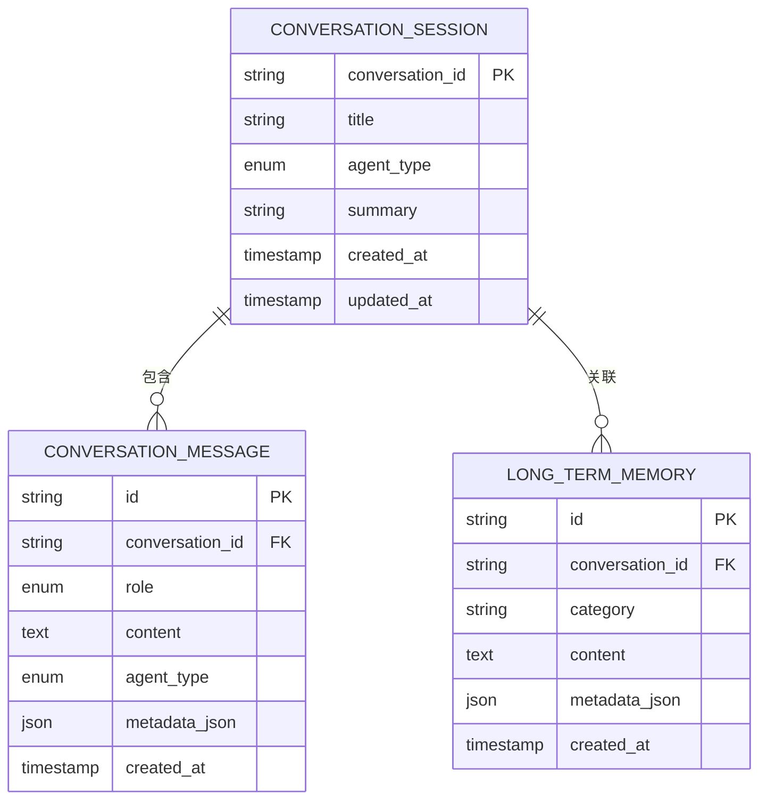

# 基础设施层设计

<cite>
**本文档引用的文件**
- [OpenAiAgentRouter.java](file://travel-agent-infrastructure/src/main/java/com/travalagent/infrastructure/gateway/llm/OpenAiAgentRouter.java)
- [SqliteConversationRepository.java](file://travel-agent-infrastructure/src/main/java/com/travalagent/infrastructure/repository/SqliteConversationRepository.java)
- [AmapTravelTools.java](file://travel-agent-infrastructure/src/main/java/com/travalagent/infrastructure/gateway/tool/AmapTravelTools.java)
- [InfrastructureConfig.java](file://travel-agent-infrastructure/src/main/java/com/travalagent/infrastructure/config/InfrastructureConfig.java)
- [VectorStoreLongTermMemoryRepository.java](file://travel-agent-infrastructure/src/main/java/com/travalagent/infrastructure/repository/VectorStoreLongTermMemoryRepository.java)
- [AbstractOpenAiSpecialistAgent.java](file://travel-agent-infrastructure/src/main/java/com/travalagent/infrastructure/gateway/llm/AbstractOpenAiSpecialistAgent.java)
- [TravelAgentProperties.java](file://travel-agent-infrastructure/src/main/java/com/travalagent/infrastructure/config/TravelAgentProperties.java)
- [AmapMcpGateway.java](file://travel-agent-infrastructure/src/main/java/com/travalagent/infrastructure/gateway/tool/AmapMcpGateway.java)
- [RoutingLongTermMemoryRepository.java](file://travel-agent-infrastructure/src/main/java/com/travalagent/infrastructure/repository/RoutingLongTermMemoryRepository.java)
- [MilvusMemoryConfig.java](file://travel-agent-infrastructure/src/main/java/com/travalagent/infrastructure/config/MilvusMemoryConfig.java)
- [ConversationRepository.java](file://travel-agent-domain/src/main/java/com/travalagent/domain/repository/ConversationRepository.java)
- [AgentRouter.java](file://travel-agent-domain/src/main/java/com/travalagent/domain/service/AgentRouter.java)
- [AgentRouteDecision.java](file://travel-agent-domain/src/main/java/com/travalagent/domain/model/valobj/AgentRouteDecision.java)
- [pom.xml（基础设施模块）](file://travel-agent-infrastructure/pom.xml)
</cite>

## 目录
1. [引言](#引言)
2. [项目结构](#项目结构)
3. [核心组件](#核心组件)
4. [架构总览](#架构总览)
5. [详细组件分析](#详细组件分析)
6. [依赖分析](#依赖分析)
7. [性能考虑](#性能考虑)
8. [故障排查指南](#故障排查指南)
9. [结论](#结论)
10. [附录](#附录)

## 引言
本设计文档聚焦于TravelAgent项目的基础设施层，系统性阐述其在智能体路由、工具集成、持久化与外部服务连接方面的实现方式与技术选型。重点解析OpenAiAgentRouter的智能体路由与工具调用机制，梳理仓储实现（如SqliteConversationRepository、VectorStoreLongTermMemoryRepository）的数据访问模式，并深入分析AmapTravelTools的地图工具集成与高德API调用路径。同时，说明基础设施配置类的设计与依赖注入机制，展示基础设施层如何通过适配器模式连接外部服务，以及如何实现可插拔的工具提供者与内存提供者架构，并支持多种实现策略与环境配置。

## 项目结构
基础设施层位于travel-agent-infrastructure模块，围绕领域层接口进行实现，向上承接应用层业务编排，向下对接Spring AI、Spring JDBC、SQLite、Milvus等外部能力。核心目录划分如下：
- config：基础设施配置与条件装配，包含向量存储、MCP客户端、嵌入模型等
- gateway/llm：基于Spring AI的LLM智能体与路由实现
- gateway/tool：地图工具适配器与MCP网关
- repository：对话与长期记忆的多实现仓储

图表来源
- [InfrastructureConfig.java:13-35](file://travel-agent-infrastructure/src/main/java/com/travalagent/infrastructure/config/InfrastructureConfig.java#L13-L35)
- [MilvusMemoryConfig.java:15-44](file://travel-agent-infrastructure/src/main/java/com/travalagent/infrastructure/config/MilvusMemoryConfig.java#L15-L44)
- [TravelAgentProperties.java:8-66](file://travel-agent-infrastructure/src/main/java/com/travalagent/infrastructure/config/TravelAgentProperties.java#L8-L66)
- [OpenAiAgentRouter.java:12-72](file://travel-agent-infrastructure/src/main/java/com/travalagent/infrastructure/gateway/llm/OpenAiAgentRouter.java#L12-L72)
- [AbstractOpenAiSpecialistAgent.java:15-68](file://travel-agent-infrastructure/src/main/java/com/travalagent/infrastructure/gateway/llm/AbstractOpenAiSpecialistAgent.java#L15-L68)
- [AmapTravelTools.java:21-30](file://travel-agent-infrastructure/src/main/java/com/travalagent/infrastructure/gateway/tool/AmapTravelTools.java#L21-L30)
- [AmapMcpGateway.java:27-47](file://travel-agent-infrastructure/src/main/java/com/travalagent/infrastructure/gateway/tool/AmapMcpGateway.java#L27-L47)
- [SqliteConversationRepository.java:35-54](file://travel-agent-infrastructure/src/main/java/com/travalagent/infrastructure/repository/SqliteConversationRepository.java#L35-L54)
- [VectorStoreLongTermMemoryRepository.java:16-24](file://travel-agent-infrastructure/src/main/java/com/travalagent/infrastructure/repository/VectorStoreLongTermMemoryRepository.java#L16-L24)
- [RoutingLongTermMemoryRepository.java:12-28](file://travel-agent-infrastructure/src/main/java/com/travalagent/infrastructure/repository/RoutingLongTermMemoryRepository.java#L12-L28)

章节来源
- [pom.xml（基础设施模块）:16-76](file://travel-agent-infrastructure/pom.xml#L16-L76)

## 核心组件
- 智能体路由与执行
  - OpenAiAgentRouter：基于规则与LLM的路由决策，支持降级启发式路由
  - AbstractOpenAiSpecialistAgent：统一的专家智能体执行模板，封装提示词构建、工具回调、图像媒体支持与回退逻辑
- 工具集成
  - AmapTravelTools：声明式工具方法，映射高德天气、地理编码、反向地理编码、地点搜索、公交路线规划等
  - AmapMcpGateway：MCP协议工具回调封装，带缓存与节流控制
- 持久化与内存
  - SqliteConversationRepository：基于JDBC的对话与长期记忆存储
  - VectorStoreLongTermMemoryRepository：基于Spring AI VectorStore的向量检索
  - RoutingLongTermMemoryRepository：按配置动态路由至不同内存实现
- 配置与注入
  - InfrastructureConfig：RestClient、嵌入模型、Milvus客户端条件装配
  - MilvusMemoryConfig：Milvus向量存储Bean与索引参数
  - TravelAgentProperties：工具提供者与内存提供者枚举及默认值

章节来源
- [OpenAiAgentRouter.java:12-72](file://travel-agent-infrastructure/src/main/java/com/travalagent/infrastructure/gateway/llm/OpenAiAgentRouter.java#L12-L72)
- [AbstractOpenAiSpecialistAgent.java:15-68](file://travel-agent-infrastructure/src/main/java/com/travalagent/infrastructure/gateway/llm/AbstractOpenAiSpecialistAgent.java#L15-L68)
- [AmapTravelTools.java:21-30](file://travel-agent-infrastructure/src/main/java/com/travalagent/infrastructure/gateway/tool/AmapTravelTools.java#L21-L30)
- [AmapMcpGateway.java:27-47](file://travel-agent-infrastructure/src/main/java/com/travalagent/infrastructure/gateway/tool/AmapMcpGateway.java#L27-L47)
- [SqliteConversationRepository.java:35-54](file://travel-agent-infrastructure/src/main/java/com/travalagent/infrastructure/repository/SqliteConversationRepository.java#L35-L54)
- [VectorStoreLongTermMemoryRepository.java:16-24](file://travel-agent-infrastructure/src/main/java/com/travalagent/infrastructure/repository/VectorStoreLongTermMemoryRepository.java#L16-L24)
- [RoutingLongTermMemoryRepository.java:12-28](file://travel-agent-infrastructure/src/main/java/com/travalagent/infrastructure/repository/RoutingLongTermMemoryRepository.java#L12-L28)
- [InfrastructureConfig.java:13-35](file://travel-agent-infrastructure/src/main/java/com/travalagent/infrastructure/config/InfrastructureConfig.java#L13-L35)
- [MilvusMemoryConfig.java:15-44](file://travel-agent-infrastructure/src/main/java/com/travalagent/infrastructure/config/MilvusMemoryConfig.java#L15-L44)
- [TravelAgentProperties.java:8-66](file://travel-agent-infrastructure/src/main/java/com/travalagent/infrastructure/config/TravelAgentProperties.java#L8-L66)

## 架构总览
基础设施层采用“接口驱动 + 多实现 + 条件装配”的架构风格：
- 领域接口定义（如AgentRouter、ConversationRepository）由基础设施层实现
- 通过Spring条件注解与属性配置实现运行时策略切换（工具提供者、内存提供者）
- 通过适配器模式连接外部服务（LLM、MCP、高德、Milvus）

图表来源
- [AgentRouter.java:6-9](file://travel-agent-domain/src/main/java/com/travalagent/domain/service/AgentRouter.java#L6-L9)
- [ConversationRepository.java:14-54](file://travel-agent-domain/src/main/java/com/travalagent/domain/repository/ConversationRepository.java#L14-L54)
- [OpenAiAgentRouter.java:12-27](file://travel-agent-infrastructure/src/main/java/com/travalagent/infrastructure/gateway/llm/OpenAiAgentRouter.java#L12-L27)
- [SqliteConversationRepository.java:35-54](file://travel-agent-infrastructure/src/main/java/com/travalagent/infrastructure/repository/SqliteConversationRepository.java#L35-L54)
- [VectorStoreLongTermMemoryRepository.java:16-24](file://travel-agent-infrastructure/src/main/java/com/travalagent/infrastructure/repository/VectorStoreLongTermMemoryRepository.java#L16-L24)
- [RoutingLongTermMemoryRepository.java:12-28](file://travel-agent-infrastructure/src/main/java/com/travalagent/infrastructure/repository/RoutingLongTermMemoryRepository.java#L12-L28)
- [AmapTravelTools.java:21-30](file://travel-agent-infrastructure/src/main/java/com/travalagent/infrastructure/gateway/tool/AmapTravelTools.java#L21-L30)
- [AmapMcpGateway.java:27-47](file://travel-agent-infrastructure/src/main/java/com/travalagent/infrastructure/gateway/tool/AmapMcpGateway.java#L27-L47)

## 详细组件分析

### OpenAiAgentRouter：智能体路由与工具调用机制
- 路由决策流程
  - 可用性检查：若OpenAI不可用，则进入启发式路由
  - LLM路由：构造系统提示词与用户上下文，调用ChatClient获取结构化输出
  - 启发式路由：基于关键词匹配与正则表达式判断天气、地理、旅行规划与通用场景
  - 结果封装：返回AgentRouteDecision，包含代理类型、原因、是否需要澄清与澄清问题
- 工具调用机制
  - 通过抽象专家智能体基类统一接入工具回调，支持图像媒体与工具上下文传递
  - 工具调用失败或不可用时，自动回退并记录元数据

图表来源
- [OpenAiAgentRouter.java:29-72](file://travel-agent-infrastructure/src/main/java/com/travalagent/infrastructure/gateway/llm/OpenAiAgentRouter.java#L29-L72)
- [AbstractOpenAiSpecialistAgent.java:31-68](file://travel-agent-infrastructure/src/main/java/com/travalagent/infrastructure/gateway/llm/AbstractOpenAiSpecialistAgent.java#L31-L68)

章节来源
- [OpenAiAgentRouter.java:12-145](file://travel-agent-infrastructure/src/main/java/com/travalagent/infrastructure/gateway/llm/OpenAiAgentRouter.java#L12-L145)
- [AbstractOpenAiSpecialistAgent.java:15-186](file://travel-agent-infrastructure/src/main/java/com/travalagent/infrastructure/gateway/llm/AbstractOpenAiSpecialistAgent.java#L15-L186)

### AmapTravelTools：地图工具集成与高德API调用
- 工具声明与描述
  - 使用Spring AI工具注解声明多个高德工具：天气查询、地理编码、反向地理编码、地点输入提示、公交换乘路线
- 参数与上下文
  - 工具方法接收参数描述与ToolContext，发布工具调用时间线事件
- 适配器模式
  - 将领域模型（如PlaceSearchQuery、TransitRouteQuery）转换为高德网关调用参数
- 与MCP网关协作
  - AmapMcpGateway负责实际MCP回调调用、结果解析、缓存与节流

图表来源
- [AmapTravelTools.java:21-118](file://travel-agent-infrastructure/src/main/java/com/travalagent/infrastructure/gateway/tool/AmapTravelTools.java#L21-L118)
- [AmapMcpGateway.java:49-123](file://travel-agent-infrastructure/src/main/java/com/travalagent/infrastructure/gateway/tool/AmapMcpGateway.java#L49-L123)

章节来源
- [AmapTravelTools.java:21-119](file://travel-agent-infrastructure/src/main/java/com/travalagent/infrastructure/gateway/tool/AmapTravelTools.java#L21-L119)
- [AmapMcpGateway.java:27-196](file://travel-agent-infrastructure/src/main/java/com/travalagent/infrastructure/gateway/tool/AmapMcpGateway.java#L27-L196)

### 仓储实现：数据访问模式与策略
- SqliteConversationRepository
  - 使用JdbcClient执行SQL，支持会话、消息、任务记忆、反馈、图片上下文、旅行计划与时间线的读写
  - JSON序列化/反序列化用于复杂字段存储；ON CONFLICT处理保证幂等更新
  - 提供删除会话级联清理与长期记忆关键字检索
- VectorStoreLongTermMemoryRepository
  - 基于Spring AI VectorStore的相似度检索，合并元数据（含conversationId、category、createdAt）
  - 条件装配：仅当存在VectorStore Bean时生效
- RoutingLongTermMemoryRepository
  - 依据TravelAgentProperties动态选择内存实现：AUTO优先向量存储、否则回退SQLite；强制MILVUS时要求Bean可用
  - 通过ObjectProvider惰性获取向量仓库，避免未启用时的循环依赖

图表来源
- [ConversationRepository.java:14-54](file://travel-agent-domain/src/main/java/com/travalagent/domain/repository/ConversationRepository.java#L14-L54)
- [SqliteConversationRepository.java:35-54](file://travel-agent-infrastructure/src/main/java/com/travalagent/infrastructure/repository/SqliteConversationRepository.java#L35-L54)
- [VectorStoreLongTermMemoryRepository.java:16-24](file://travel-agent-infrastructure/src/main/java/com/travalagent/infrastructure/repository/VectorStoreLongTermMemoryRepository.java#L16-L24)
- [RoutingLongTermMemoryRepository.java:12-28](file://travel-agent-infrastructure/src/main/java/com/travalagent/infrastructure/repository/RoutingLongTermMemoryRepository.java#L12-L28)

章节来源
- [SqliteConversationRepository.java:35-580](file://travel-agent-infrastructure/src/main/java/com/travalagent/infrastructure/repository/SqliteConversationRepository.java#L35-L580)
- [VectorStoreLongTermMemoryRepository.java:16-87](file://travel-agent-infrastructure/src/main/java/com/travalagent/infrastructure/repository/VectorStoreLongTermMemoryRepository.java#L16-L87)
- [RoutingLongTermMemoryRepository.java:12-54](file://travel-agent-infrastructure/src/main/java/com/travalagent/infrastructure/repository/RoutingLongTermMemoryRepository.java#L12-L54)

### 配置类设计与依赖注入机制
- InfrastructureConfig
  - 提供RestClient.Builder与旅行知识嵌入模型Bean
  - 条件装配Milvus客户端（受travel.agent.knowledge.vector.enabled控制）
- MilvusMemoryConfig
  - 条件装配MilvusServiceClient与VectorStore，支持索引类型、度量类型、初始化Schema等参数
- TravelAgentProperties
  - 定义工具提供者（LOCAL/MCP）与内存提供者（AUTO/SQLITE/MILVUS）枚举与默认值
  - 支持跨域白名单、记忆窗口与摘要阈值等全局配置

图表来源
- [InfrastructureConfig.java:13-35](file://travel-agent-infrastructure/src/main/java/com/travalagent/infrastructure/config/InfrastructureConfig.java#L13-L35)
- [MilvusMemoryConfig.java:15-44](file://travel-agent-infrastructure/src/main/java/com/travalagent/infrastructure/config/MilvusMemoryConfig.java#L15-L44)
- [TravelAgentProperties.java:8-66](file://travel-agent-infrastructure/src/main/java/com/travalagent/infrastructure/config/TravelAgentProperties.java#L8-L66)
- [RoutingLongTermMemoryRepository.java:40-46](file://travel-agent-infrastructure/src/main/java/com/travalagent/infrastructure/repository/RoutingLongTermMemoryRepository.java#L40-L46)

章节来源
- [InfrastructureConfig.java:13-35](file://travel-agent-infrastructure/src/main/java/com/travalagent/infrastructure/config/InfrastructureConfig.java#L13-L35)
- [MilvusMemoryConfig.java:15-44](file://travel-agent-infrastructure/src/main/java/com/travalagent/infrastructure/config/MilvusMemoryConfig.java#L15-L44)
- [TravelAgentProperties.java:8-66](file://travel-agent-infrastructure/src/main/java/com/travalagent/infrastructure/config/TravelAgentProperties.java#L8-L66)
- [RoutingLongTermMemoryRepository.java:12-54](file://travel-agent-infrastructure/src/main/java/com/travalagent/infrastructure/repository/RoutingLongTermMemoryRepository.java#L12-L54)

## 依赖分析
基础设施层对外部能力的依赖主要体现在以下方面：
- Spring AI：OpenAI模型、MCP客户端、向量存储、嵌入模型
- Spring JDBC：SQLite数据库访问
- Milvus：向量检索与索引
- Jackson：JSON序列化/反序列化

图表来源
- [pom.xml（基础设施模块）:16-76](file://travel-agent-infrastructure/pom.xml#L16-L76)

章节来源
- [pom.xml（基础设施模块）:16-76](file://travel-agent-infrastructure/pom.xml#L16-L76)

## 性能考虑
- 工具调用节流：AmapMcpGateway对MCP工具调用设置最小间隔，避免触发限流
- 缓存优化：按会话维度缓存MCP工具结果，减少重复请求
- SQL幂等更新：使用ON CONFLICT处理，降低写冲突与重复插入成本
- 向量检索阈值：向量存储检索设置相似度阈值，平衡召回与性能
- 条件装配：仅在启用时创建Milvus客户端与VectorStore，避免不必要的资源占用

## 故障排查指南
- OpenAI不可用或密钥缺失
  - 现象：路由降级为启发式，智能体执行回退
  - 排查：确认OpenAiAvailability状态与相关配置
- MCP工具调用异常
  - 现象：解析失败或返回格式不一致
  - 排查：检查AmapMcpGateway的JSON解析分支与缓存键生成
- 向量存储未启用但强制使用
  - 现象：抛出未找到VectorStore Bean异常
  - 排查：确认travel.agent.memory-provider配置与MilvusMemoryConfig条件注解
- SQLite序列化/反序列化错误
  - 现象：JSON字段读取失败或抛出非法状态异常
  - 排查：检查ObjectMapper配置与字段类型映射

章节来源
- [AbstractOpenAiSpecialistAgent.java:72-86](file://travel-agent-infrastructure/src/main/java/com/travalagent/infrastructure/gateway/llm/AbstractOpenAiSpecialistAgent.java#L72-L86)
- [AmapMcpGateway.java:125-153](file://travel-agent-infrastructure/src/main/java/com/travalagent/infrastructure/gateway/tool/AmapMcpGateway.java#L125-L153)
- [RoutingLongTermMemoryRepository.java:48-53](file://travel-agent-infrastructure/src/main/java/com/travalagent/infrastructure/repository/RoutingLongTermMemoryRepository.java#L48-L53)
- [SqliteConversationRepository.java:544-550](file://travel-agent-infrastructure/src/main/java/com/travalagent/infrastructure/repository/SqliteConversationRepository.java#L544-L550)

## 结论
基础设施层通过清晰的接口分层、条件装配与策略路由，实现了对LLM、地图工具、向量存储与SQLite的统一接入。OpenAiAgentRouter提供了鲁棒的路由与工具调用机制，AmapTravelTools与AmapMcpGateway以适配器模式解耦了高德服务细节，Sqlite与VectorStore双轨仓储满足不同规模与性能需求。配置类与属性对象使系统具备良好的可插拔性与环境适配能力，便于在开发、测试与生产环境中灵活切换实现策略。

## 附录
- 关键实体与关系（概念示意）
