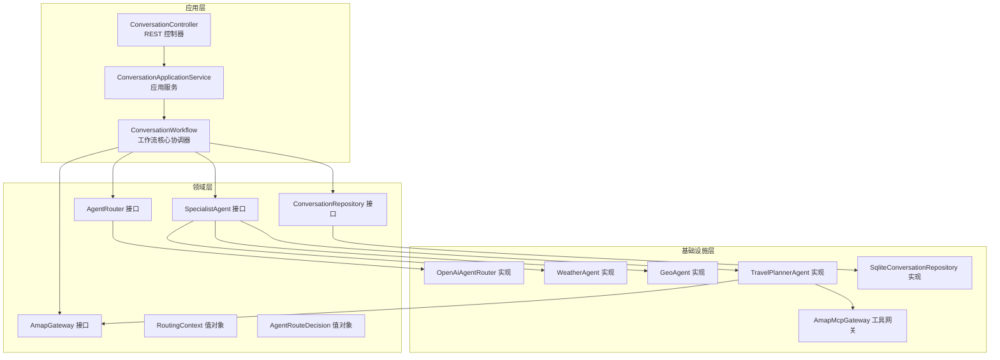
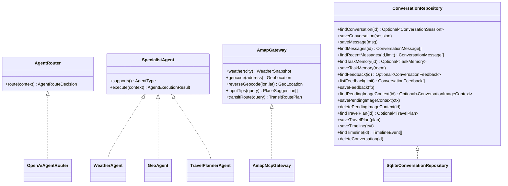
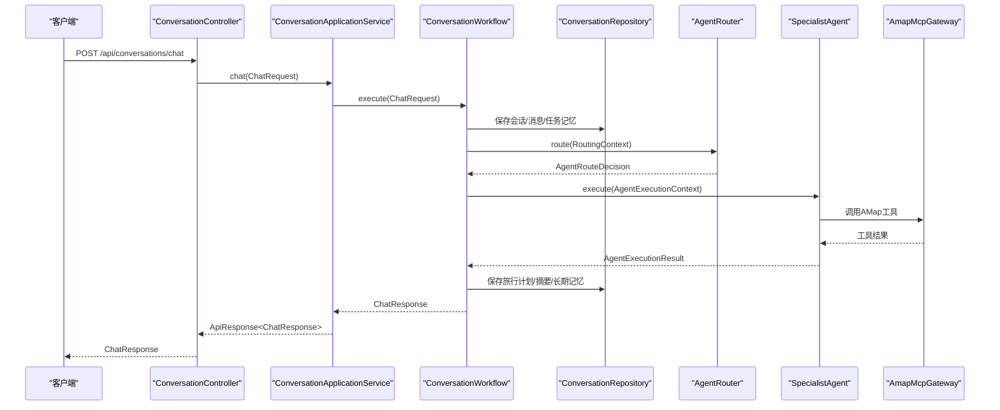
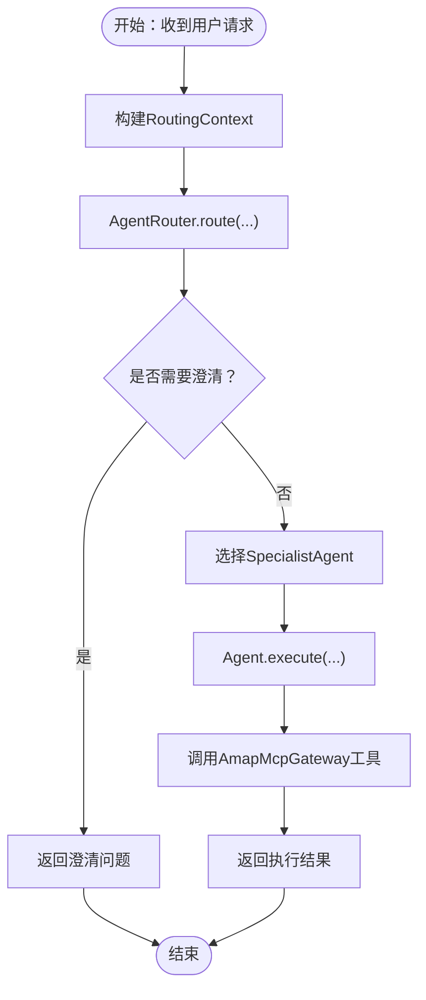
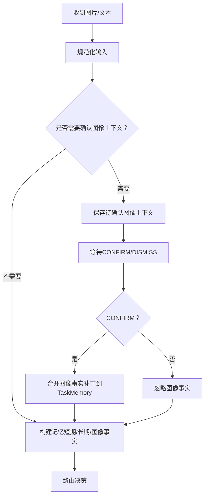
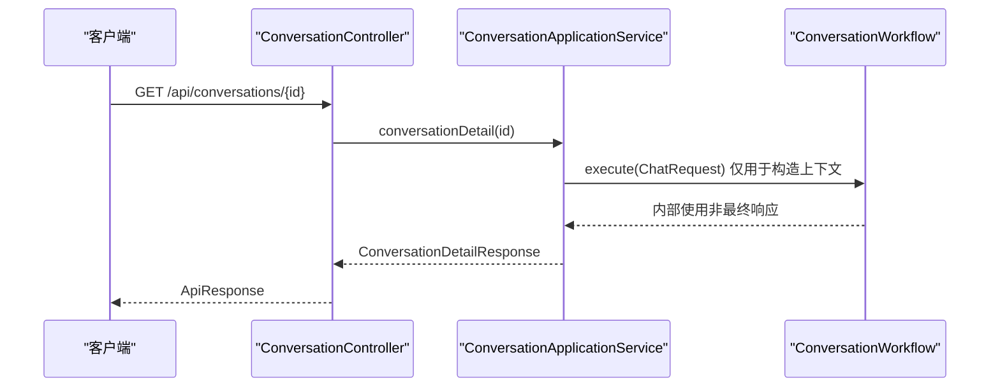
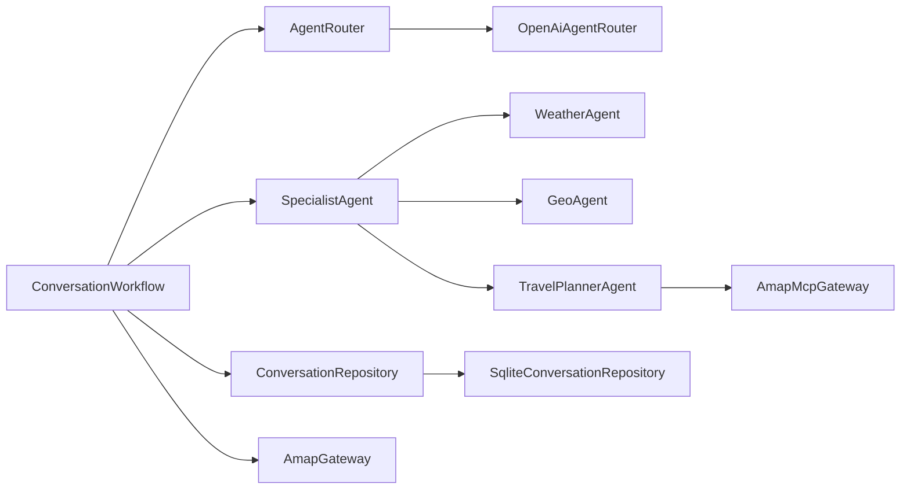

# 层间交互模式

<cite>
**本文引用的文件**
- [ConversationWorkflow.java](file://travel-agent-app/src/main/java/com/travalagent/app/service/ConversationWorkflow.java)
- [ConversationApplicationService.java](file://travel-agent-app/src/main/java/com/travalagent/app/service/ConversationApplicationService.java)
- [ConversationController.java](file://travel-agent-app/src/main/java/com/travalagent/app/controller/ConversationController.java)
- [AgentRouter.java](file://travel-agent-domain/src/main/java/com/travalagent/domain/service/AgentRouter.java)
- [RoutingContext.java](file://travel-agent-domain/src/main/java/com/travalagent/domain/model/valobj/RoutingContext.java)
- [AgentRouteDecision.java](file://travel-agent-domain/src/main/java/com/travalagent/domain/model/valobj/AgentRouteDecision.java)
- [SpecialistAgent.java](file://travel-agent-domain/src/main/java/com/travalagent/domain/service/SpecialistAgent.java)
- [AmapGateway.java](file://travel-agent-domain/src/main/java/com/travalagent/domain/gateway/AmapGateway.java)
- [ConversationRepository.java](file://travel-agent-domain/src/main/java/com/travalagent/domain/repository/ConversationRepository.java)
- [OpenAiAgentRouter.java](file://travel-agent-infrastructure/src/main/java/com/travalagent/infrastructure/gateway/llm/OpenAiAgentRouter.java)
- [WeatherAgent.java](file://travel-agent-infrastructure/src/main/java/com/travalagent/infrastructure/gateway/llm/WeatherAgent.java)
- [GeoAgent.java](file://travel-agent-infrastructure/src/main/java/com/travalagent/infrastructure/gateway/llm/GeoAgent.java)
- [TravelPlannerAgent.java](file://travel-agent-infrastructure/src/main/java/com/travalagent/infrastructure/gateway/llm/TravelPlannerAgent.java)
- [AmapMcpGateway.java](file://travel-agent-infrastructure/src/main/java/com/travalagent/infrastructure/gateway/tool/AmapMcpGateway.java)
- [SqliteConversationRepository.java](file://travel-agent-infrastructure/src/main/java/com/travalagent/infrastructure/repository/SqliteConversationRepository.java)
</cite>

## 目录
1. [引言](#引言)
2. [项目结构](#项目结构)
3. [核心组件](#核心组件)
4. [架构总览](#架构总览)
5. [详细组件分析](#详细组件分析)
6. [依赖分析](#依赖分析)
7. [性能考虑](#性能考虑)
8. [故障排查指南](#故障排查指南)
9. [结论](#结论)

## 引言
本文件聚焦于TravelAgent项目的层间交互模式，系统性阐述三层架构（应用层、领域层、基础设施层）之间的依赖与协作方式，重点覆盖以下要点：
- 依赖倒置原则的应用：领域层定义接口，基础设施层提供实现，应用层通过接口编排。
- 端口适配器模式的落地：领域接口作为“端口”，基础设施类作为“适配器”实现这些端口。
- 领域层如何通过接口被应用层与基础设施层共同使用：如AgentRouter、SpecialistAgent、AmapGateway等。
- 应用层核心协调器ConversationWorkflow如何串联领域逻辑与基础设施实现。
- 智能体路由在应用层与基础设施层之间的控制权传递，以及工具调用的分层处理机制。

## 项目结构
项目采用标准的分层组织：
- 应用层（travel-agent-app）：控制器、应用服务、工作流、事件发布与流式输出。
- 领域层（travel-agent-domain）：领域模型、值对象、仓库接口、领域服务接口。
- 基础设施层（travel-agent-infrastructure）：Spring AI集成、LLM路由与特化代理、工具网关、持久化仓库实现。

图表来源
- [ConversationController.java:32-101](file://travel-agent-app/src/main/java/com/travalagent/app/controller/ConversationController.java#L32-L101)
- [ConversationApplicationService.java:34-50](file://travel-agent-app/src/main/java/com/travalagent/app/service/ConversationApplicationService.java#L34-L50)
- [ConversationWorkflow.java:49-104](file://travel-agent-app/src/main/java/com/travalagent/app/service/ConversationWorkflow.java#L49-L104)
- [AgentRouter.java:6-9](file://travel-agent-domain/src/main/java/com/travalagent/domain/service/AgentRouter.java#L6-L9)
- [RoutingContext.java:8-16](file://travel-agent-domain/src/main/java/com/travalagent/domain/model/valobj/RoutingContext.java#L8-L16)
- [AgentRouteDecision.java:3-9](file://travel-agent-domain/src/main/java/com/travalagent/domain/model/valobj/AgentRouteDecision.java#L3-L9)
- [SpecialistAgent.java:7-12](file://travel-agent-domain/src/main/java/com/travalagent/domain/service/SpecialistAgent.java#L7-L12)
- [AmapGateway.java:12-27](file://travel-agent-domain/src/main/java/com/travalagent/domain/gateway/AmapGateway.java#L12-L27)
- [OpenAiAgentRouter.java:12-27](file://travel-agent-infrastructure/src/main/java/com/travalagent/infrastructure/gateway/llm/OpenAiAgentRouter.java#L12-L27)
- [WeatherAgent.java:16-32](file://travel-agent-infrastructure/src/main/java/com/travalagent/infrastructure/gateway/llm/WeatherAgent.java#L16-L32)
- [GeoAgent.java:18-33](file://travel-agent-infrastructure/src/main/java/com/travalagent/infrastructure/gateway/llm/GeoAgent.java#L18-L33)
- [TravelPlannerAgent.java:27-58](file://travel-agent-infrastructure/src/main/java/com/travalagent/infrastructure/gateway/llm/TravelPlannerAgent.java#L27-L58)
- [AmapMcpGateway.java:27-47](file://travel-agent-infrastructure/src/main/java/com/travalagent/infrastructure/gateway/tool/AmapMcpGateway.java#L27-L47)
- [SqliteConversationRepository.java:35-54](file://travel-agent-infrastructure/src/main/java/com/travalagent/infrastructure/repository/SqliteConversationRepository.java#L35-L54)

章节来源
- [ConversationController.java:32-101](file://travel-agent-app/src/main/java/com/travalagent/app/controller/ConversationController.java#L32-L101)
- [ConversationApplicationService.java:34-50](file://travel-agent-app/src/main/java/com/travalagent/app/service/ConversationApplicationService.java#L34-L50)
- [ConversationWorkflow.java:49-104](file://travel-agent-app/src/main/java/com/travalagent/app/service/ConversationWorkflow.java#L49-L104)
- [AgentRouter.java:6-9](file://travel-agent-domain/src/main/java/com/travalagent/domain/service/AgentRouter.java#L6-L9)
- [RoutingContext.java:8-16](file://travel-agent-domain/src/main/java/com/travalagent/domain/model/valobj/RoutingContext.java#L8-L16)
- [AgentRouteDecision.java:3-9](file://travel-agent-domain/src/main/java/com/travalagent/domain/model/valobj/AgentRouteDecision.java#L3-L9)
- [SpecialistAgent.java:7-12](file://travel-agent-domain/src/main/java/com/travalagent/domain/service/SpecialistAgent.java#L7-L12)
- [AmapGateway.java:12-27](file://travel-agent-domain/src/main/java/com/travalagent/domain/gateway/AmapGateway.java#L12-L27)
- [OpenAiAgentRouter.java:12-27](file://travel-agent-infrastructure/src/main/java/com/travalagent/infrastructure/gateway/llm/OpenAiAgentRouter.java#L12-L27)
- [WeatherAgent.java:16-32](file://travel-agent-infrastructure/src/main/java/com/travalagent/infrastructure/gateway/llm/WeatherAgent.java#L16-L32)
- [GeoAgent.java:18-33](file://travel-agent-infrastructure/src/main/java/com/travalagent/infrastructure/gateway/llm/GeoAgent.java#L18-L33)
- [TravelPlannerAgent.java:27-58](file://travel-agent-infrastructure/src/main/java/com/travalagent/infrastructure/gateway/llm/TravelPlannerAgent.java#L27-L58)
- [AmapMcpGateway.java:27-47](file://travel-agent-infrastructure/src/main/java/com/travalagent/infrastructure/gateway/tool/AmapMcpGateway.java#L27-L47)
- [SqliteConversationRepository.java:35-54](file://travel-agent-infrastructure/src/main/java/com/travalagent/infrastructure/repository/SqliteConversationRepository.java#L35-L54)

## 核心组件
- 应用层
  - ConversationController：暴露REST接口，接收请求并委派给应用服务。
  - ConversationApplicationService：应用服务，封装业务用例，协调工作流与外部工具网关。
  - ConversationWorkflow：应用层核心协调器，负责对话生命周期管理、记忆构建、路由决策、特化代理执行、结果归档与事件发布。
- 领域层
  - AgentRouter：路由接口，决定将请求交给哪个特化代理。
  - SpecialistAgent：特化代理接口，定义统一的执行契约。
  - AmapGateway：地理与交通相关能力的领域接口。
  - ConversationRepository：对话相关数据的领域仓库接口。
  - RoutingContext/AgentRouteDecision：路由上下文与决策值对象。
- 基础设施层
  - OpenAiAgentRouter：基于LLM与启发式规则的路由实现。
  - WeatherAgent/GeoAgent/TravelPlannerAgent：特化代理实现，分别处理天气、地理与行程规划。
  - AmapMcpGateway：MCP工具调用网关，封装AMap工具回调与缓存节流。
  - SqliteConversationRepository：对话与长期记忆的持久化实现。

章节来源
- [ConversationController.java:32-101](file://travel-agent-app/src/main/java/com/travalagent/app/controller/ConversationController.java#L32-L101)
- [ConversationApplicationService.java:34-50](file://travel-agent-app/src/main/java/com/travalagent/app/service/ConversationApplicationService.java#L34-L50)
- [ConversationWorkflow.java:49-104](file://travel-agent-app/src/main/java/com/travalagent/app/service/ConversationWorkflow.java#L49-L104)
- [AgentRouter.java:6-9](file://travel-agent-domain/src/main/java/com/travalagent/domain/service/AgentRouter.java#L6-L9)
- [SpecialistAgent.java:7-12](file://travel-agent-domain/src/main/java/com/travalagent/domain/service/SpecialistAgent.java#L7-L12)
- [AmapGateway.java:12-27](file://travel-agent-domain/src/main/java/com/travalagent/domain/gateway/AmapGateway.java#L12-L27)
- [ConversationRepository.java:14-55](file://travel-agent-domain/src/main/java/com/travalagent/domain/repository/ConversationRepository.java#L14-L55)
- [RoutingContext.java:8-16](file://travel-agent-domain/src/main/java/com/travalagent/domain/model/valobj/RoutingContext.java#L8-L16)
- [AgentRouteDecision.java:3-9](file://travel-agent-domain/src/main/java/com/travalagent/domain/model/valobj/AgentRouteDecision.java#L3-L9)
- [OpenAiAgentRouter.java:12-27](file://travel-agent-infrastructure/src/main/java/com/travalagent/infrastructure/gateway/llm/OpenAiAgentRouter.java#L12-L27)
- [WeatherAgent.java:16-32](file://travel-agent-infrastructure/src/main/java/com/travalagent/infrastructure/gateway/llm/WeatherAgent.java#L16-L32)
- [GeoAgent.java:18-33](file://travel-agent-infrastructure/src/main/java/com/travalagent/infrastructure/gateway/llm/GeoAgent.java#L18-L33)
- [TravelPlannerAgent.java:27-58](file://travel-agent-infrastructure/src/main/java/com/travalagent/infrastructure/gateway/llm/TravelPlannerAgent.java#L27-L58)
- [AmapMcpGateway.java:27-47](file://travel-agent-infrastructure/src/main/java/com/travalagent/infrastructure/gateway/tool/AmapMcpGateway.java#L27-L47)
- [SqliteConversationRepository.java:35-54](file://travel-agent-infrastructure/src/main/java/com/travalagent/infrastructure/repository/SqliteConversationRepository.java#L35-L54)

## 架构总览
本项目严格遵循依赖倒置原则与端口适配器模式：
- 领域层定义接口与值对象，不依赖具体实现。
- 基础设施层实现领域接口，注入到应用层。
- 应用层通过接口编排领域逻辑与基础设施能力，形成清晰的控制流。

图表来源
- [AgentRouter.java:6-9](file://travel-agent-domain/src/main/java/com/travalagent/domain/service/AgentRouter.java#L6-L9)
- [SpecialistAgent.java:7-12](file://travel-agent-domain/src/main/java/com/travalagent/domain/service/SpecialistAgent.java#L7-L12)
- [AmapGateway.java:12-27](file://travel-agent-domain/src/main/java/com/travalagent/domain/gateway/AmapGateway.java#L12-L27)
- [ConversationRepository.java:14-55](file://travel-agent-domain/src/main/java/com/travalagent/domain/repository/ConversationRepository.java#L14-L55)
- [OpenAiAgentRouter.java:12-27](file://travel-agent-infrastructure/src/main/java/com/travalagent/infrastructure/gateway/llm/OpenAiAgentRouter.java#L12-L27)
- [WeatherAgent.java:16-32](file://travel-agent-infrastructure/src/main/java/com/travalagent/infrastructure/gateway/llm/WeatherAgent.java#L16-L32)
- [GeoAgent.java:18-33](file://travel-agent-infrastructure/src/main/java/com/travalagent/infrastructure/gateway/llm/GeoAgent.java#L18-L33)
- [TravelPlannerAgent.java:27-58](file://travel-agent-infrastructure/src/main/java/com/travalagent/infrastructure/gateway/llm/TravelPlannerAgent.java#L27-L58)
- [AmapMcpGateway.java:27-47](file://travel-agent-infrastructure/src/main/java/com/travalagent/infrastructure/gateway/tool/AmapMcpGateway.java#L27-L47)
- [SqliteConversationRepository.java:35-54](file://travel-agent-infrastructure/src/main/java/com/travalagent/infrastructure/repository/SqliteConversationRepository.java#L35-L54)

## 详细组件分析

### ConversationWorkflow：应用层核心协调器
- 职责
  - 输入规范化（文本、图片附件、图像上下文动作）。
  - 会话准备与消息持久化。
  - 记忆构建（短期窗口、总结、长期记忆）。
  - 路由决策（AgentRouter）。
  - 特化代理执行（SpecialistAgent）。
  - 结果归档（任务记忆、旅行计划、摘要、长期记忆）。
  - 时间线事件发布（TimelinePublisher）。
- 关键交互
  - 依赖领域接口：AgentRouter、SpecialistAgent、ConversationRepository、LongTermMemoryRepository、ImageAttachmentInterpreter、TimelinePublisher、TravelAgentProperties。
  - 通过AmapGateway与工具链（AmapMcpGateway）进行外部能力调用。
- 数据流
  - ChatRequest → 规范化输入 → 准备会话 → 构建记忆 → 路由决策 → 执行代理 → 归档与发布事件 → ChatResponse。

图表来源
- [ConversationController.java:47-51](file://travel-agent-app/src/main/java/com/travalagent/app/controller/ConversationController.java#L47-L51)
- [ConversationApplicationService.java:52-54](file://travel-agent-app/src/main/java/com/travalagent/app/service/ConversationApplicationService.java#L52-L54)
- [ConversationWorkflow.java:106-160](file://travel-agent-app/src/main/java/com/travalagent/app/service/ConversationWorkflow.java#L106-L160)
- [AgentRouter.java:6-9](file://travel-agent-domain/src/main/java/com/travalagent/domain/service/AgentRouter.java#L6-L9)
- [SpecialistAgent.java:7-12](file://travel-agent-domain/src/main/java/com/travalagent/domain/service/SpecialistAgent.java#L7-L12)
- [AmapMcpGateway.java:102-123](file://travel-agent-infrastructure/src/main/java/com/travalagent/infrastructure/gateway/tool/AmapMcpGateway.java#L102-L123)

章节来源
- [ConversationWorkflow.java:106-160](file://travel-agent-app/src/main/java/com/travalagent/app/service/ConversationWorkflow.java#L106-L160)
- [ConversationWorkflow.java:348-373](file://travel-agent-app/src/main/java/com/travalagent/app/service/ConversationWorkflow.java#L348-L373)
- [ConversationWorkflow.java:375-406](file://travel-agent-app/src/main/java/com/travalagent/app/service/ConversationWorkflow.java#L375-L406)
- [ConversationWorkflow.java:408-486](file://travel-agent-app/src/main/java/com/travalagent/app/service/ConversationWorkflow.java#L408-L486)

### 智能体路由与工具调用分层处理
- 路由层（应用层）
  - ConversationWorkflow根据RoutingContext调用AgentRouter.route，得到AgentRouteDecision。
  - 若需要澄清，直接返回澄清问题；否则选择特化代理执行。
- 执行层（基础设施层）
  - WeatherAgent/GeoAgent/TravelPlannerAgent实现SpecialistAgent.execute。
  - TravelPlannerAgent在执行过程中调用AmapMcpGateway进行工具调用，并发布时间线事件。
  - AmapMcpGateway内部封装工具回调、参数序列化、结果解析、缓存与节流。
- 依赖倒置
  - 领域层定义AgentRouter/SpecialistAgent/AmapGateway接口，基础设施层实现它们。
  - 应用层仅依赖接口，避免对具体实现的耦合。

图表来源
- [ConversationWorkflow.java:348-373](file://travel-agent-app/src/main/java/com/travalagent/app/service/ConversationWorkflow.java#L348-L373)
- [OpenAiAgentRouter.java:29-72](file://travel-agent-infrastructure/src/main/java/com/travalagent/infrastructure/gateway/llm/OpenAiAgentRouter.java#L29-L72)
- [TravelPlannerAgent.java:158-183](file://travel-agent-infrastructure/src/main/java/com/travalagent/infrastructure/gateway/llm/TravelPlannerAgent.java#L158-L183)
- [AmapMcpGateway.java:102-123](file://travel-agent-infrastructure/src/main/java/com/travalagent/infrastructure/gateway/tool/AmapMcpGateway.java#L102-L123)

章节来源
- [OpenAiAgentRouter.java:29-72](file://travel-agent-infrastructure/src/main/java/com/travalagent/infrastructure/gateway/llm/OpenAiAgentRouter.java#L29-L72)
- [TravelPlannerAgent.java:158-183](file://travel-agent-infrastructure/src/main/java/com/travalagent/infrastructure/gateway/llm/TravelPlannerAgent.java#L158-L183)
- [AmapMcpGateway.java:102-123](file://travel-agent-infrastructure/src/main/java/com/travalagent/infrastructure/gateway/tool/AmapMcpGateway.java#L102-L123)

### 图像上下文与任务记忆的协同
- 图像处理
  - ConversationWorkflow支持上传图片，通过ImageAttachmentInterpreter提取旅行上下文，生成ConversationImageFacts与摘要。
  - 支持CONFIRM/DISMISS操作，与会话状态联动。
- 任务记忆
  - buildMemoryContext从最近消息与长期记忆中抽取WorkingMemory，并合并图像事实补丁。
  - finalize阶段更新TaskMemory并持久化。

图表来源
- [ConversationWorkflow.java:162-224](file://travel-agent-app/src/main/java/com/travalagent/app/service/ConversationWorkflow.java#L162-L224)
- [ConversationWorkflow.java:226-272](file://travel-agent-app/src/main/java/com/travalagent/app/service/ConversationWorkflow.java#L226-L272)
- [ConversationWorkflow.java:331-346](file://travel-agent-app/src/main/java/com/travalagent/app/service/ConversationWorkflow.java#L331-L346)
- [ConversationWorkflow.java:656-677](file://travel-agent-app/src/main/java/com/travalagent/app/service/ConversationWorkflow.java#L656-L677)

章节来源
- [ConversationWorkflow.java:162-224](file://travel-agent-app/src/main/java/com/travalagent/app/service/ConversationWorkflow.java#L162-L224)
- [ConversationWorkflow.java:226-272](file://travel-agent-app/src/main/java/com/travalagent/app/service/ConversationWorkflow.java#L226-L272)
- [ConversationWorkflow.java:331-346](file://travel-agent-app/src/main/java/com/travalagent/app/service/ConversationWorkflow.java#L331-L346)
- [ConversationWorkflow.java:656-677](file://travel-agent-app/src/main/java/com/travalagent/app/service/ConversationWorkflow.java#L656-L677)

### 应用服务与控制器的职责边界
- ConversationController
  - 负责HTTP协议细节（路径、参数、响应包装），将请求委派给应用服务。
- ConversationApplicationService
  - 封装业务用例，协调工作流与工具网关；提供列表、详情、反馈导出与汇总等能力。
  - 在删除会话时清理工具缓存。

图表来源
- [ConversationController.java:72-75](file://travel-agent-app/src/main/java/com/travalagent/app/controller/ConversationController.java#L72-L75)
- [ConversationApplicationService.java:61-73](file://travel-agent-app/src/main/java/com/travalagent/app/service/ConversationApplicationService.java#L61-L73)

章节来源
- [ConversationController.java:32-101](file://travel-agent-app/src/main/java/com/travalagent/app/controller/ConversationController.java#L32-L101)
- [ConversationApplicationService.java:34-50](file://travel-agent-app/src/main/java/com/travalagent/app/service/ConversationApplicationService.java#L34-L50)
- [ConversationApplicationService.java:151-155](file://travel-agent-app/src/main/java/com/travalagent/app/service/ConversationApplicationService.java#L151-L155)

## 依赖分析
- 耦合与内聚
  - 应用层通过接口依赖领域层，耦合度低，内聚于业务用例。
  - 基础设施层实现领域接口，面向接口编程，便于替换与测试。
- 直接与间接依赖
  - ConversationWorkflow直接依赖领域接口与基础设施组件；间接通过应用服务与控制器进入系统。
- 循环依赖
  - 未发现循环依赖：接口在领域层，实现位于基础设施层，应用层仅依赖接口。
- 外部依赖与集成点
  - AmapMcpGateway作为外部工具调用入口，封装参数与结果解析。
  - SqliteConversationRepository作为对话与长期记忆的数据存储实现。

图表来源
- [ConversationWorkflow.java:74-104](file://travel-agent-app/src/main/java/com/travalagent/app/service/ConversationWorkflow.java#L74-L104)
- [AgentRouter.java:6-9](file://travel-agent-domain/src/main/java/com/travalagent/domain/service/AgentRouter.java#L6-L9)
- [SpecialistAgent.java:7-12](file://travel-agent-domain/src/main/java/com/travalagent/domain/service/SpecialistAgent.java#L7-L12)
- [ConversationRepository.java:14-55](file://travel-agent-domain/src/main/java/com/travalagent/domain/repository/ConversationRepository.java#L14-L55)
- [AmapGateway.java:12-27](file://travel-agent-domain/src/main/java/com/travalagent/domain/gateway/AmapGateway.java#L12-L27)
- [OpenAiAgentRouter.java:12-27](file://travel-agent-infrastructure/src/main/java/com/travalagent/infrastructure/gateway/llm/OpenAiAgentRouter.java#L12-L27)
- [WeatherAgent.java:16-32](file://travel-agent-infrastructure/src/main/java/com/travalagent/infrastructure/gateway/llm/WeatherAgent.java#L16-L32)
- [GeoAgent.java:18-33](file://travel-agent-infrastructure/src/main/java/com/travalagent/infrastructure/gateway/llm/GeoAgent.java#L18-L33)
- [TravelPlannerAgent.java:27-58](file://travel-agent-infrastructure/src/main/java/com/travalagent/infrastructure/gateway/llm/TravelPlannerAgent.java#L27-L58)
- [AmapMcpGateway.java:27-47](file://travel-agent-infrastructure/src/main/java/com/travalagent/infrastructure/gateway/tool/AmapMcpGateway.java#L27-L47)
- [SqliteConversationRepository.java:35-54](file://travel-agent-infrastructure/src/main/java/com/travalagent/infrastructure/repository/SqliteConversationRepository.java#L35-L54)

章节来源
- [ConversationWorkflow.java:74-104](file://travel-agent-app/src/main/java/com/travalagent/app/service/ConversationWorkflow.java#L74-L104)
- [OpenAiAgentRouter.java:12-27](file://travel-agent-infrastructure/src/main/java/com/travalagent/infrastructure/gateway/llm/OpenAiAgentRouter.java#L12-L27)
- [TravelPlannerAgent.java:27-58](file://travel-agent-infrastructure/src/main/java/com/travalagent/infrastructure/gateway/llm/TravelPlannerAgent.java#L27-L58)
- [AmapMcpGateway.java:27-47](file://travel-agent-infrastructure/src/main/java/com/travalagent/infrastructure/gateway/tool/AmapMcpGateway.java#L27-L47)
- [SqliteConversationRepository.java:35-54](file://travel-agent-infrastructure/src/main/java/com/travalagent/infrastructure/repository/SqliteConversationRepository.java#L35-L54)

## 性能考虑
- 工具调用节流与缓存
  - AmapMcpGateway对同一会话的工具调用进行缓存与最小调用间隔控制，降低外部依赖压力。
- 记忆窗口与阈值
  - ConversationWorkflow通过配置项控制记忆窗口与摘要阈值，平衡性能与上下文质量。
- 事务与持久化
  - 工作流在单次执行中进行多次持久化写入，需关注数据库写入性能与事务边界。

章节来源
- [AmapMcpGateway.java:180-194](file://travel-agent-infrastructure/src/main/java/com/travalagent/infrastructure/gateway/tool/AmapMcpGateway.java#L180-L194)
- [ConversationWorkflow.java:331-346](file://travel-agent-app/src/main/java/com/travalagent/app/service/ConversationWorkflow.java#L331-L346)
- [SqliteConversationRepository.java:35-54](file://travel-agent-infrastructure/src/main/java/com/travalagent/infrastructure/repository/SqliteConversationRepository.java#L35-L54)

## 故障排查指南
- 常见异常与定位
  - 请求参数非法：如图片数量超限、媒体类型不匹配、Base64格式错误等，抛出应用异常。
  - 路由失败回退：当LLM不可用或解析失败时，OpenAiAgentRouter降级为启发式路由。
  - 工具调用失败：AmapMcpGateway解析异常或结果不符合预期时抛出异常。
  - 缺失特化代理：若未注册对应AgentType的SpecialistAgent，工作流抛出非法状态异常。
- 定位建议
  - 查看时间线事件（TimelineEvent）以追踪执行阶段与细节。
  - 检查ConversationRepository与Sqlite实现的读写一致性。
  - 校验AmapMcpGateway的工具回调提供者是否正确装配。

章节来源
- [ConversationWorkflow.java:534-567](file://travel-agent-app/src/main/java/com/travalagent/app/service/ConversationWorkflow.java#L534-L567)
- [OpenAiAgentRouter.java:69-71](file://travel-agent-infrastructure/src/main/java/com/travalagent/infrastructure/gateway/llm/OpenAiAgentRouter.java#L69-L71)
- [AmapMcpGateway.java:150-153](file://travel-agent-infrastructure/src/main/java/com/travalagent/infrastructure/gateway/tool/AmapMcpGateway.java#L150-L153)
- [ConversationWorkflow.java:488-494](file://travel-agent-app/src/main/java/com/travalagent/app/service/ConversationWorkflow.java#L488-L494)
- [SqliteConversationRepository.java:544-550](file://travel-agent-infrastructure/src/main/java/com/travalagent/infrastructure/repository/SqliteConversationRepository.java#L544-L550)

## 结论
本项目通过清晰的三层架构与端口适配器模式，实现了领域逻辑与技术实现的解耦。应用层核心协调器ConversationWorkflow承担了编排职责，将领域接口与基础设施实现有机串联；路由与特化代理在基础设施层完成具体业务执行；工具调用通过AmapMcpGateway进行统一封装。该设计既满足了可扩展性与可维护性，也为后续引入新的代理与工具提供了稳定接口。