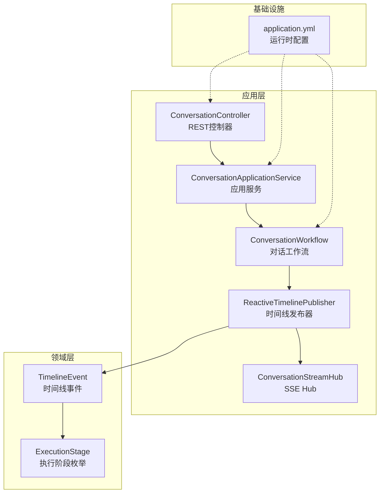
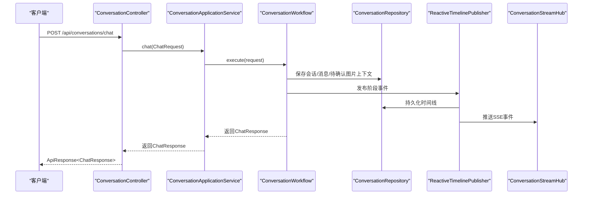
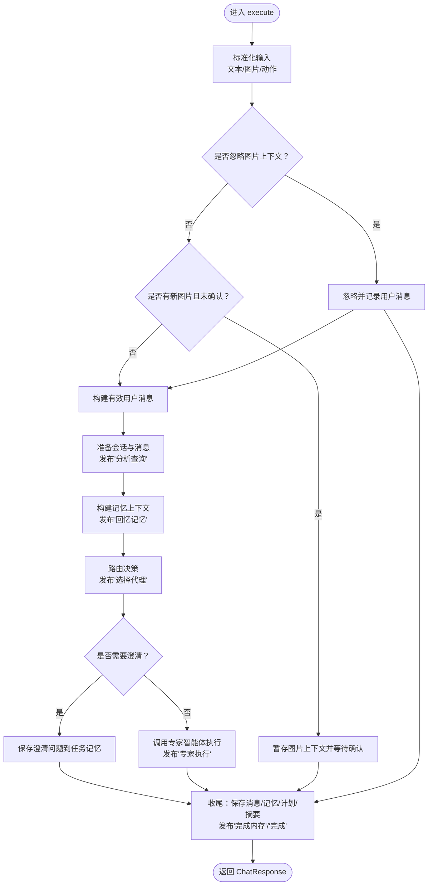
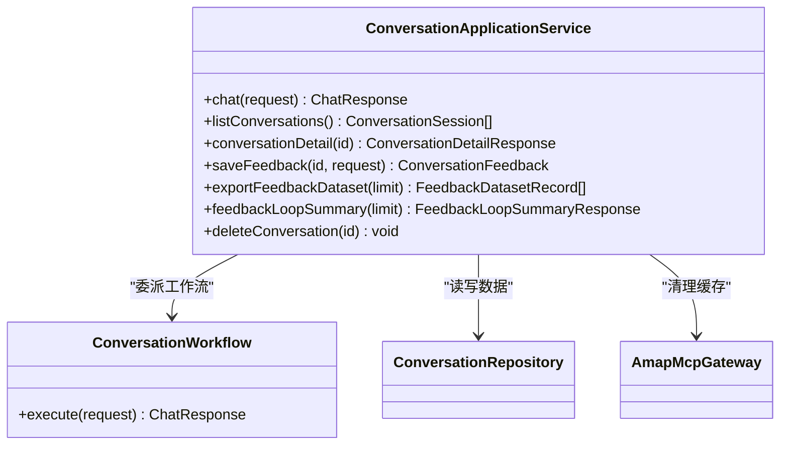
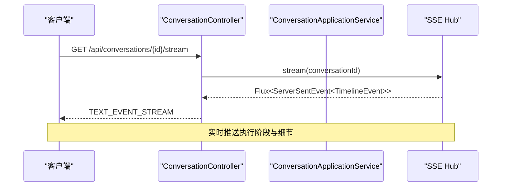
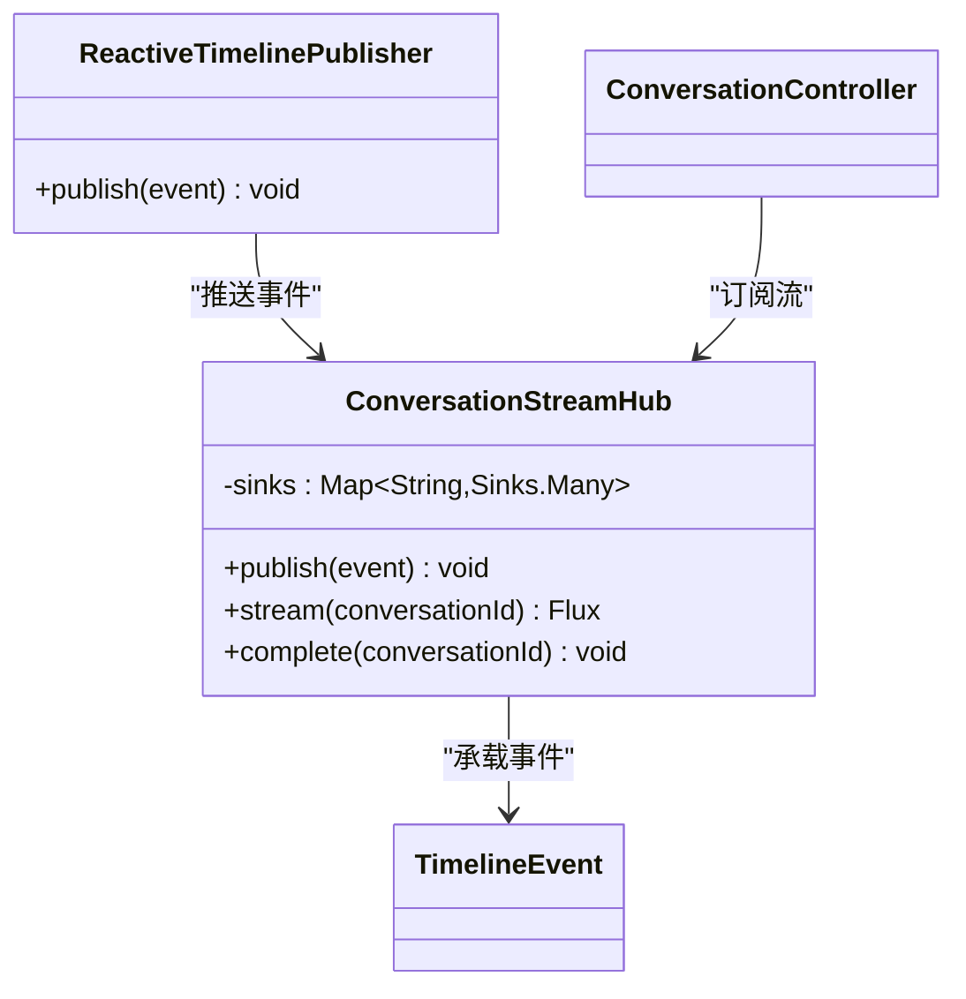
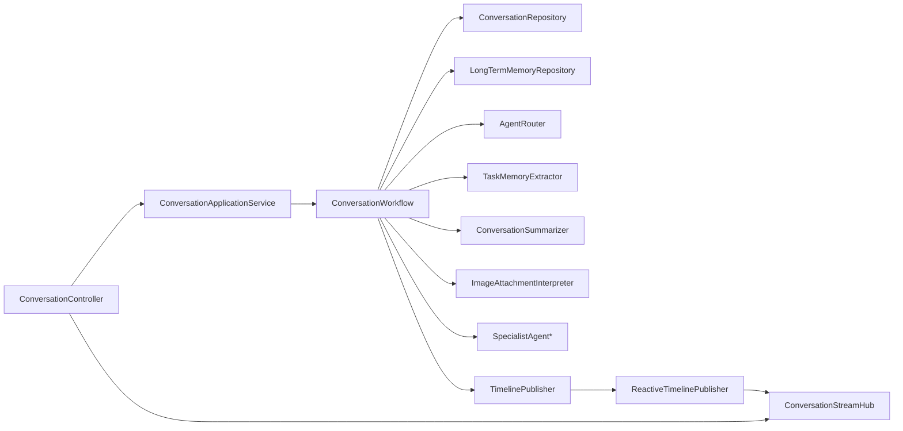

# 应用层设计

<cite>
**本文引用的文件**
- [ConversationApplicationService.java](file://travel-agent-app/src/main/java/com/travalagent/app/service/ConversationApplicationService.java)
- [ConversationWorkflow.java](file://travel-agent-app/src/main/java/com/travalagent/app/service/ConversationWorkflow.java)
- [ConversationController.java](file://travel-agent-app/src/main/java/com/travalagent/app/controller/ConversationController.java)
- [ConversationStreamHub.java](file://travel-agent-app/src/main/java/com/travalagent/app/stream/ConversationStreamHub.java)
- [ReactiveTimelinePublisher.java](file://travel-agent-app/src/main/java/com/travalagent/app/stream/ReactiveTimelinePublisher.java)
- [ChatRequest.java](file://travel-agent-app/src/main/java/com/travalagent/app/dto/ChatRequest.java)
- [ChatResponse.java](file://travel-agent-app/src/main/java/com/travalagent/app/dto/ChatResponse.java)
- [ConversationDetailResponse.java](file://travel-agent-app/src/main/java/com/travalagent/app/dto/ConversationDetailResponse.java)
- [WebConfig.java](file://travel-agent-app/src/main/java/com/travalagent/app/controller/WebConfig.java)
- [GlobalExceptionHandler.java](file://travel-agent-app/src/main/java/com/travalagent/app/controller/GlobalExceptionHandler.java)
- [application.yml](file://travel-agent-app/src/main/resources/application.yml)
- [ExecutionStage.java](file://travel-agent-domain/src/main/java/com/travalagent/domain/model/valobj/ExecutionStage.java)
- [TimelineEvent.java](file://travel-agent-domain/src/main/java/com/travalagent/domain/model/entity/TimelineEvent.java)
- [ResponseCode.java](file://travel-agent-types/src/main/java/com/travalagent/types/enums/ResponseCode.java)
- [ConversationWorkflowTest.java](file://travel-agent-app/src/test/java/com/travalagent/app/service/ConversationWorkflowTest.java)
- [ConversationApplicationServiceTest.java](file://travel-agent-app/src/test/java/com/travalagent/app/service/ConversationApplicationServiceTest.java)
</cite>

## 目录
1. [引言](#引言)
2. [项目结构](#项目结构)
3. [核心组件](#核心组件)
4. [架构总览](#架构总览)
5. [组件详解](#组件详解)
6. [依赖关系分析](#依赖关系分析)
7. [性能考量](#性能考量)
8. [故障排查指南](#故障排查指南)
9. [结论](#结论)
10. [附录](#附录)

## 引言
本设计文档聚焦TravelAgent项目的应用层（Application Layer），系统性阐述应用层的职责与边界：服务编排、工作流管理与用户接口协调。重点解析以下内容：
- ConversationWorkflow的工作流设计：如何协调多智能体完成复杂旅行规划任务，并在各阶段发布时间线事件。
- ConversationApplicationService的服务层设计：事务管理、业务用例实现与反馈闭环统计。
- ConversationController的REST API设计与请求处理流程。
- ConversationStreamHub的SSE流式传输实现与实时事件推送机制。
- 应用层如何通过服务编排实现领域逻辑的业务用例执行，并处理跨多个领域的复杂业务流程。

## 项目结构
应用层位于travel-agent-app模块，主要由以下层次组成：
- 控制器层：负责HTTP请求接收、参数校验与响应封装。
- 服务层：封装业务用例与工作流编排，协调领域服务与基础设施。
- 流式传输层：基于Reactor实现SSE事件推送，支持前端实时订阅。
- 配置与异常处理：统一CORS配置与全局异常映射。

图表来源
- [ConversationController.java:32-101](file://travel-agent-app/src/main/java/com/travalagent/app/controller/ConversationController.java#L32-L101)
- [ConversationApplicationService.java:34-394](file://travel-agent-app/src/main/java/com/travalagent/app/service/ConversationApplicationService.java#L34-L394)
- [ConversationWorkflow.java:49-814](file://travel-agent-app/src/main/java/com/travalagent/app/service/ConversationWorkflow.java#L49-L814)
- [ConversationStreamHub.java:11-33](file://travel-agent-app/src/main/java/com/travalagent/app/stream/ConversationStreamHub.java#L11-L33)
- [ReactiveTimelinePublisher.java:8-28](file://travel-agent-app/src/main/java/com/travalagent/app/stream/ReactiveTimelinePublisher.java#L8-L28)
- [ExecutionStage.java:3-14](file://travel-agent-domain/src/main/java/com/travalagent/domain/model/valobj/ExecutionStage.java#L3-L14)
- [TimelineEvent.java:9-34](file://travel-agent-domain/src/main/java/com/travalagent/domain/model/entity/TimelineEvent.java#L9-L34)
- [application.yml:1-100](file://travel-agent-app/src/main/resources/application.yml#L1-L100)

章节来源
- [ConversationController.java:32-101](file://travel-agent-app/src/main/java/com/travalagent/app/controller/ConversationController.java#L32-L101)
- [application.yml:1-100](file://travel-agent-app/src/main/resources/application.yml#L1-L100)

## 核心组件
- ConversationApplicationService：对外暴露聊天、会话列表、详情、反馈保存与导出、删除会话等业务用例；内部委派给ConversationWorkflow执行对话工作流，并通过仓库持久化结果。
- ConversationWorkflow：核心工作流编排器，负责图像附件解析、意图与缺失槽位分析、记忆回溯、路由决策、专家智能体执行、计划持久化与总结、时间线事件发布。
- ConversationController：REST控制器，提供聊天、会话查询、反馈导出/汇总、会话详情、反馈提交与删除、SSE流订阅等接口。
- ConversationStreamHub：基于Reactor的SSE Hub，按会话维度维护事件流，支持订阅、发布与完成通知。
- ReactiveTimelinePublisher：实现领域层TimelinePublisher接口，将事件同时写入数据库并推送到SSE Hub。

章节来源
- [ConversationApplicationService.java:34-394](file://travel-agent-app/src/main/java/com/travalagent/app/service/ConversationApplicationService.java#L34-L394)
- [ConversationWorkflow.java:49-814](file://travel-agent-app/src/main/java/com/travalagent/app/service/ConversationWorkflow.java#L49-L814)
- [ConversationController.java:32-101](file://travel-agent-app/src/main/java/com/travalagent/app/controller/ConversationController.java#L32-L101)
- [ConversationStreamHub.java:11-33](file://travel-agent-app/src/main/java/com/travalagent/app/stream/ConversationStreamHub.java#L11-L33)
- [ReactiveTimelinePublisher.java:8-28](file://travel-agent-app/src/main/java/com/travalagent/app/stream/ReactiveTimelinePublisher.java#L8-L28)

## 架构总览
应用层通过控制器接收请求，调用应用服务，应用服务再委派工作流执行。工作流在执行过程中持续发布时间线事件，ReactiveTimelinePublisher将事件持久化并转发到SSE Hub，前端通过SSE实时接收执行阶段与细节信息。同时，应用服务还负责反馈闭环统计与导出，形成“用例执行—事件驱动—反馈优化”的闭环。

图表来源
- [ConversationController.java:47-51](file://travel-agent-app/src/main/java/com/travalagent/app/controller/ConversationController.java#L47-L51)
- [ConversationApplicationService.java:52-54](file://travel-agent-app/src/main/java/com/travalagent/app/service/ConversationApplicationService.java#L52-L54)
- [ConversationWorkflow.java:106-160](file://travel-agent-app/src/main/java/com/travalagent/app/service/ConversationWorkflow.java#L106-L160)
- [ReactiveTimelinePublisher.java:22-26](file://travel-agent-app/src/main/java/com/travalagent/app/stream/ReactiveTimelinePublisher.java#L22-L26)
- [ConversationStreamHub.java:16-19](file://travel-agent-app/src/main/java/com/travalagent/app/stream/ConversationStreamHub.java#L16-L19)

## 组件详解

### ConversationWorkflow 工作流设计
- 职责边界
  - 输入标准化：规范化文本消息、图像附件（大小、类型、Base64格式）、图片上下文动作（CONFIRM/DISMISS）。
  - 图片上下文管理：支持“暂存-确认-忽略”三态流程，避免直接规划前的歧义输入。
  - 会话准备：生成或加载会话，保存用户消息与元数据，发布“分析查询”阶段事件。
  - 记忆构建：合并历史消息、长短期记忆，提取工作记忆，发布“回忆记忆”阶段事件。
  - 路由决策：根据路由上下文选择最佳专家智能体，若需要澄清则返回澄清问题。
  - 专家执行：调用对应SpecialistAgent执行具体任务，产出答案与可选旅行计划。
  - 结果收尾：保存消息、更新任务记忆、持久化旅行计划、生成摘要并写入长期记忆，发布“完成内存”与“完成”阶段事件。
- 事务管理
  - 使用@Transactional注解确保工作流内的一致性写入，失败时回滚。
- 时间线事件
  - 在关键阶段发布TimelineEvent，供前端SSE实时展示执行进度与细节。

图表来源
- [ConversationWorkflow.java:106-486](file://travel-agent-app/src/main/java/com/travalagent/app/service/ConversationWorkflow.java#L106-L486)
- [ExecutionStage.java:3-14](file://travel-agent-domain/src/main/java/com/travalagent/domain/model/valobj/ExecutionStage.java#L3-L14)
- [TimelineEvent.java:9-34](file://travel-agent-domain/src/main/java/com/travalagent/domain/model/entity/TimelineEvent.java#L9-L34)

章节来源
- [ConversationWorkflow.java:49-814](file://travel-agent-app/src/main/java/com/travalagent/app/service/ConversationWorkflow.java#L49-L814)

### ConversationApplicationService 服务层设计
- 业务用例
  - 聊天：委派工作流执行，返回标准响应。
  - 列表与详情：查询会话、消息、时间线、任务记忆、旅行计划、反馈与图片上下文候选。
  - 反馈：保存标签、原因码、备注、元数据，计算可用率与分解统计。
  - 导出与汇总：按限制导出反馈数据集，生成关键发现与桶状统计。
  - 删除：删除会话并清理SSE流。
- 事务与一致性
  - 聊天入口使用@Transactional，确保工作流内写入原子性。
  - 其他查询与统计方法不涉及事务，但通过仓库聚合一次性返回。
- 错误处理
  - 对非法请求抛出应用异常，交由全局异常处理器统一返回。

图表来源
- [ConversationApplicationService.java:34-394](file://travel-agent-app/src/main/java/com/travalagent/app/service/ConversationApplicationService.java#L34-L394)
- [ConversationWorkflow.java:49-814](file://travel-agent-app/src/main/java/com/travalagent/app/service/ConversationWorkflow.java#L49-L814)

章节来源
- [ConversationApplicationService.java:34-394](file://travel-agent-app/src/main/java/com/travalagent/app/service/ConversationApplicationService.java#L34-L394)

### ConversationController REST API 设计
- 端点与职责
  - POST /api/conversations/chat：聊天入口，异步调度至bounded elastic线程池，返回ApiResponse包装。
  - GET /api/conversations：列出会话。
  - GET /api/conversations/{conversationId}：获取会话详情。
  - GET /api/conversations/feedback/export?limit={n}：导出反馈数据集。
  - GET /api/conversations/feedback/summary?limit={n}：生成反馈闭环汇总。
  - POST /api/conversations/{conversationId}/feedback：提交反馈。
  - DELETE /api/conversations/{conversationId}：删除会话并完成SSE流。
  - GET /api/conversations/{conversationId}/stream：SSE订阅时间线事件。
- 参数与校验
  - 使用Jakarta Validation对请求体进行校验。
  - 分页与限制参数默认值与范围控制。
- 响应封装
  - 所有响应统一包装为ApiResponse，便于前端一致处理。

图表来源
- [ConversationController.java:92-99](file://travel-agent-app/src/main/java/com/travalagent/app/controller/ConversationController.java#L92-L99)
- [ConversationStreamHub.java:21-24](file://travel-agent-app/src/main/java/com/travalagent/app/stream/ConversationStreamHub.java#L21-L24)

章节来源
- [ConversationController.java:32-101](file://travel-agent-app/src/main/java/com/travalagent/app/controller/ConversationController.java#L32-L101)

### ConversationStreamHub SSE 流式传输实现
- 设计要点
  - 每个会话维护一个Sinks.Many<TimelineEvent>，采用背压缓冲策略。
  - publish：按会话ID查找或创建Sink并尝试发送事件。
  - stream：返回对应的Flux<TimelineEvent>供订阅。
  - complete：删除会话Sink并发出完成信号，释放资源。
- 与ReactiveTimelinePublisher协作
  - ReactiveTimelinePublisher在发布事件时同时持久化与推送SSE，保证事件可靠到达。

图表来源
- [ConversationStreamHub.java:11-33](file://travel-agent-app/src/main/java/com/travalagent/app/stream/ConversationStreamHub.java#L11-L33)
- [ReactiveTimelinePublisher.java:8-28](file://travel-agent-app/src/main/java/com/travalagent/app/stream/ReactiveTimelinePublisher.java#L8-L28)
- [TimelineEvent.java:9-34](file://travel-agent-domain/src/main/java/com/travalagent/domain/model/entity/TimelineEvent.java#L9-L34)
- [ConversationController.java:92-99](file://travel-agent-app/src/main/java/com/travalagent/app/controller/ConversationController.java#L92-L99)

章节来源
- [ConversationStreamHub.java:11-33](file://travel-agent-app/src/main/java/com/travalagent/app/stream/ConversationStreamHub.java#L11-L33)
- [ReactiveTimelinePublisher.java:8-28](file://travel-agent-app/src/main/java/com/travalagent/app/stream/ReactiveTimelinePublisher.java#L8-L28)

### DTO与数据契约
- ChatRequest：包含会话ID、文本消息、图片附件列表与图片上下文动作。
- ChatResponse：包含会话ID、代理类型、回答、任务记忆、旅行计划与时间线。
- ConversationDetailResponse：包含会话、消息、时间线、任务记忆、旅行计划、反馈与图片上下文候选。

章节来源
- [ChatRequest.java:7-17](file://travel-agent-app/src/main/java/com/travalagent/app/dto/ChatRequest.java#L7-L17)
- [ChatResponse.java:10-19](file://travel-agent-app/src/main/java/com/travalagent/app/dto/ChatResponse.java#L10-L19)
- [ConversationDetailResponse.java:13-22](file://travel-agent-app/src/main/java/com/travalagent/app/dto/ConversationDetailResponse.java#L13-L22)

## 依赖关系分析
- 控制器依赖应用服务与SSE Hub。
- 应用服务依赖工作流、仓库与外部网关。
- 工作流依赖仓库、记忆库、路由器、记忆提取器、摘要器、图片解释器、专家智能体集合与时间线发布器。
- ReactiveTimelinePublisher实现领域接口，耦合仓库与SSE Hub。
- Web配置与全局异常处理贯穿应用层，保障跨域与错误统一处理。

图表来源
- [ConversationController.java:36-45](file://travel-agent-app/src/main/java/com/travalagent/app/controller/ConversationController.java#L36-L45)
- [ConversationApplicationService.java:38-50](file://travel-agent-app/src/main/java/com/travalagent/app/service/ConversationApplicationService.java#L38-L50)
- [ConversationWorkflow.java:74-104](file://travel-agent-app/src/main/java/com/travalagent/app/service/ConversationWorkflow.java#L74-L104)
- [ReactiveTimelinePublisher.java:14-20](file://travel-agent-app/src/main/java/com/travalagent/app/stream/ReactiveTimelinePublisher.java#L14-L20)
- [ConversationStreamHub.java:14-19](file://travel-agent-app/src/main/java/com/travalagent/app/stream/ConversationStreamHub.java#L14-L19)

章节来源
- [ConversationController.java:32-101](file://travel-agent-app/src/main/java/com/travalagent/app/controller/ConversationController.java#L32-L101)
- [ConversationApplicationService.java:34-394](file://travel-agent-app/src/main/java/com/travalagent/app/service/ConversationApplicationService.java#L34-L394)
- [ConversationWorkflow.java:49-814](file://travel-agent-app/src/main/java/com/travalagent/app/service/ConversationWorkflow.java#L49-L814)
- [ReactiveTimelinePublisher.java:8-28](file://travel-agent-app/src/main/java/com/travalagent/app/stream/ReactiveTimelinePublisher.java#L8-L28)
- [ConversationStreamHub.java:11-33](file://travel-agent-app/src/main/java/com/travalagent/app/stream/ConversationStreamHub.java#L11-L33)

## 性能考量
- 线程模型：聊天端点使用boundedElastic调度器，避免阻塞Web线程，提升并发处理能力。
- 背压与缓冲：SSE Hub采用onBackpressureBuffer策略，防止快速事件导致丢弃。
- 事务边界：工作流内事务确保一致性，但需注意长事务带来的锁竞争，建议保持单次执行时间合理。
- 内存窗口与摘要阈值：通过配置项控制短期记忆窗口与摘要触发阈值，平衡性能与上下文质量。
- 图片附件限制：限制数量与大小，降低解析与存储成本。

章节来源
- [ConversationController.java:48-51](file://travel-agent-app/src/main/java/com/travalagent/app/controller/ConversationController.java#L48-L51)
- [ConversationStreamHub.java:16-19](file://travel-agent-app/src/main/java/com/travalagent/app/stream/ConversationStreamHub.java#L16-L19)
- [application.yml:57-100](file://travel-agent-app/src/main/resources/application.yml#L57-L100)

## 故障排查指南
- 请求参数错误
  - 现象：返回INVALID_REQUEST。
  - 排查：检查消息与图片附件格式、动作值、会话ID必填性。
- 会话不存在
  - 现象：忽略图片上下文或删除会话时抛出非法请求。
  - 排查：确认会话ID正确，或允许自动创建新会话的场景。
- 图片附件校验失败
  - 现象：媒体类型不匹配、非Base64、超出大小或数量限制。
  - 排查：核对data URL与声明类型一致，确保每张图小于5MB且总数不超过4张。
- 全局异常处理
  - 现象：系统异常统一返回SYSTEM_ERROR。
  - 排查：查看日志定位异常栈，结合SSE事件定位执行阶段。

章节来源
- [ConversationWorkflow.java:523-575](file://travel-agent-app/src/main/java/com/travalagent/app/service/ConversationWorkflow.java#L523-L575)
- [GlobalExceptionHandler.java:9-22](file://travel-agent-app/src/main/java/com/travalagent/app/controller/GlobalExceptionHandler.java#L9-L22)
- [ResponseCode.java:3-6](file://travel-agent-types/src/main/java/com/travalagent/types/enums/ResponseCode.java#L3-L6)

## 结论
应用层通过清晰的职责划分与严格的边界约束，实现了从REST接口到工作流执行再到实时事件推送的完整链路。ConversationWorkflow作为核心编排器，将多智能体与多领域能力整合为统一的旅行规划体验；ConversationApplicationService承担业务用例与反馈闭环；ConversationController与SSE Hub提供良好的用户交互与可观测性。整体设计具备良好的扩展性与可维护性，适合在复杂业务场景中持续演进。

## 附录
- CORS配置：允许指定源访问/api/**路径，支持所有方法与头。
- 运行时配置：包含数据库连接、OpenAI/MCP配置、追踪采样与向量存储开关等。

章节来源
- [WebConfig.java:8-25](file://travel-agent-app/src/main/java/com/travalagent/app/controller/WebConfig.java#L8-L25)
- [application.yml:1-100](file://travel-agent-app/src/main/resources/application.yml#L1-L100)