# 领域层设计

<cite>
**本文引用的文件**
- [TravelPlan.java](file://travel-agent-domain/src/main/java/com/travalagent/domain/model/entity/TravelPlan.java)
- [ConversationSession.java](file://travel-agent-domain/src/main/java/com/travalagent/domain/model/entity/ConversationSession.java)
- [TimelineEvent.java](file://travel-agent-domain/src/main/java/com/travalagent/domain/model/entity/TimelineEvent.java)
- [TravelPlanDay.java](file://travel-agent-domain/src/main/java/com/travalagent/domain/model/entity/TravelPlanDay.java)
- [TravelPlanSlot.java](file://travel-agent-domain/src/main/java/com/travalagent/domain/model/entity/TravelPlanSlot.java)
- [TravelPlanStop.java](file://travel-agent-domain/src/main/java/com/travalagent/domain/model/entity/TravelPlanStop.java)
- [AgentExecutionContext.java](file://travel-agent-domain/src/main/java/com/travalagent/domain/model/valobj/AgentExecutionContext.java)
- [AgentExecutionResult.java](file://travel-agent-domain/src/main/java/com/travalagent/domain/model/valobj/AgentExecutionResult.java)
- [ExecutionStage.java](file://travel-agent-domain/src/main/java/com/travalagent/domain/model/valobj/ExecutionStage.java)
- [AgentType.java](file://travel-agent-domain/src/main/java/com/travalagent/domain/model/valobj/AgentType.java)
- [GeoLocation.java](file://travel-agent-domain/src/main/java/com/travalagent/domain/model/valobj/GeoLocation.java)
- [ImageAttachment.java](file://travel-agent-domain/src/main/java/com/travalagent/domain/model/valobj/ImageAttachment.java)
- [PlaceSearchQuery.java](file://travel-agent-domain/src/main/java/com/travalagent/domain/model/valobj/PlaceSearchQuery.java)
- [TransitRoutePlan.java](file://travel-agent-domain/src/main/java/com/travalagent/domain/model/valobj/TransitRoutePlan.java)
- [ConversationRepository.java](file://travel-agent-domain/src/main/java/com/travalagent/domain/repository/ConversationRepository.java)
</cite>

## 目录
1. [引言](#引言)
2. [项目结构](#项目结构)
3. [核心组件](#核心组件)
4. [架构总览](#架构总览)
5. [详细组件分析](#详细组件分析)
6. [依赖分析](#依赖分析)
7. [性能考虑](#性能考虑)
8. [故障排查指南](#故障排查指南)
9. [结论](#结论)
10. [附录](#附录)

## 引言
本设计文档聚焦于 TravelAgent 项目的领域层，系统化阐述领域层的核心理念与实现方式，包括实体设计原则、值对象的不可变性与业务语义表达、仓储接口的抽象设计。重点解析旅行规划（TravelPlan）、会话（ConversationSession）、时间线事件（TimelineEvent）等关键实体的设计思路与业务规则；说明智能体执行上下文（AgentExecutionContext）与执行结果（AgentExecutionResult）在执行流程中的职责与协作；并通过仓储接口的隔离设计，确保领域逻辑的纯净性与可测试性。

## 项目结构
领域层位于 travel-agent-domain 模块中，采用按“模型类型”分包的组织方式：entity（实体）、valobj（值对象）、repository（仓储接口）。该结构清晰地将“有标识的对象”（实体）与“无标识的业务值”（值对象）分离，并将数据访问抽象为接口，便于上层应用服务调用而无需感知具体存储实现。

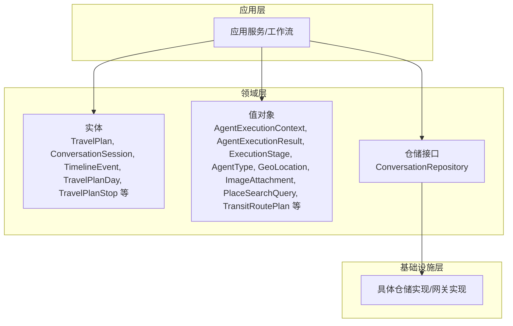

图示来源
- [ConversationRepository.java:14-53](file://travel-agent-domain/src/main/java/com/travalagent/domain/repository/ConversationRepository.java#L14-L53)

章节来源
- [ConversationRepository.java:14-53](file://travel-agent-domain/src/main/java/com/travalagent/domain/repository/ConversationRepository.java#L14-L53)

## 核心组件
- 实体（Entity）
  - 以“标识+可变状态”的方式承载业务事实，强调唯一标识与生命周期管理。
  - 关键实体：TravelPlan、ConversationSession、TimelineEvent、TravelPlanDay、TravelPlanStop 等。
- 值对象（Value Object）
  - 不可变、按值比较，用于表达业务语义与上下文信息，提升模型可读性与一致性。
  - 关键值对象：AgentExecutionContext、AgentExecutionResult、ExecutionStage、AgentType、GeoLocation、ImageAttachment、PlaceSearchQuery、TransitRoutePlan 等。
- 仓储接口（Repository Interface）
  - 抽象数据访问契约，隔离具体持久化细节，保证领域模型的纯净性与可测试性。
  - 关键接口：ConversationRepository。

章节来源
- [TravelPlan.java:9-104](file://travel-agent-domain/src/main/java/com/travalagent/domain/model/entity/TravelPlan.java#L9-L104)
- [ConversationSession.java:7-14](file://travel-agent-domain/src/main/java/com/travalagent/domain/model/entity/ConversationSession.java#L7-L14)
- [TimelineEvent.java:9-33](file://travel-agent-domain/src/main/java/com/travalagent/domain/model/entity/TimelineEvent.java#L9-L33)
- [AgentExecutionContext.java:8-37](file://travel-agent-domain/src/main/java/com/travalagent/domain/model/valobj/AgentExecutionContext.java#L8-L37)
- [AgentExecutionResult.java:7-13](file://travel-agent-domain/src/main/java/com/travalagent/domain/model/valobj/AgentExecutionResult.java#L7-L13)
- [ExecutionStage.java:3-14](file://travel-agent-domain/src/main/java/com/travalagent/domain/model/valobj/ExecutionStage.java#L3-L14)
- [AgentType.java:3-8](file://travel-agent-domain/src/main/java/com/travalagent/domain/model/valobj/AgentType.java#L3-L8)
- [GeoLocation.java:3-10](file://travel-agent-domain/src/main/java/com/travalagent/domain/model/valobj/GeoLocation.java#L3-L10)
- [ImageAttachment.java:8-32](file://travel-agent-domain/src/main/java/com/travalagent/domain/model/valobj/ImageAttachment.java#L8-L32)
- [PlaceSearchQuery.java:3-11](file://travel-agent-domain/src/main/java/com/travalagent/domain/model/valobj/PlaceSearchQuery.java#L3-L11)
- [TransitRoutePlan.java:5-22](file://travel-agent-domain/src/main/java/com/travalagent/domain/model/valobj/TransitRoutePlan.java#L5-L22)
- [ConversationRepository.java:14-53](file://travel-agent-domain/src/main/java/com/travalagent/domain/repository/ConversationRepository.java#L14-L53)

## 架构总览
领域层通过值对象封装执行上下文与结果，通过实体承载旅行规划与会话等业务事实，通过仓储接口向上层屏蔽数据访问细节。下图展示了领域层内部的关键交互关系。

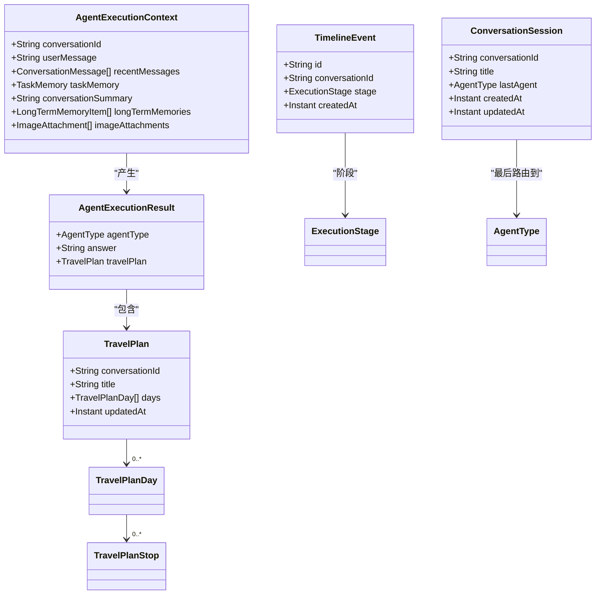

图示来源
- [TravelPlan.java:9-104](file://travel-agent-domain/src/main/java/com/travalagent/domain/model/entity/TravelPlan.java#L9-L104)
- [ConversationSession.java:7-14](file://travel-agent-domain/src/main/java/com/travalagent/domain/model/entity/ConversationSession.java#L7-L14)
- [TimelineEvent.java:9-33](file://travel-agent-domain/src/main/java/com/travalagent/domain/model/entity/TimelineEvent.java#L9-L33)
- [AgentExecutionContext.java:8-37](file://travel-agent-domain/src/main/java/com/travalagent/domain/model/valobj/AgentExecutionContext.java#L8-L37)
- [AgentExecutionResult.java:7-13](file://travel-agent-domain/src/main/java/com/travalagent/domain/model/valobj/AgentExecutionResult.java#L7-L13)
- [ExecutionStage.java:3-14](file://travel-agent-domain/src/main/java/com/travalagent/domain/model/valobj/ExecutionStage.java#L3-L14)
- [AgentType.java:3-8](file://travel-agent-domain/src/main/java/com/travalagent/domain/model/valobj/AgentType.java#L3-L8)

## 详细组件分析

### 实体：TravelPlan（旅行规划）
- 设计要点
  - 使用不可变记录（record）表达旅行规划的事实视图，字段涵盖行程概览、预算、天气与知识检索洞察、约束放宽与调整建议等。
  - 在构造器中对集合字段进行不可变包装，确保外部无法修改其内容。
  - 提供 withPlannerInsights 方法以函数式风格返回新实例，体现不可变性与可组合性。
- 业务规则
  - 旅行规划与会话关联（conversationId），支持按会话维度查询与更新。
  - 可选的天气快照与知识检索结果用于指导后续优化与修复。
  - 调整建议与约束放宽标记用于记录规划过程中的策略变化。
- 复杂度与性能
  - 字段多且嵌套，序列化/传输成本较高；建议在应用层按需裁剪输出。
  - 不可变性降低并发风险，提升线程安全与缓存友好性。

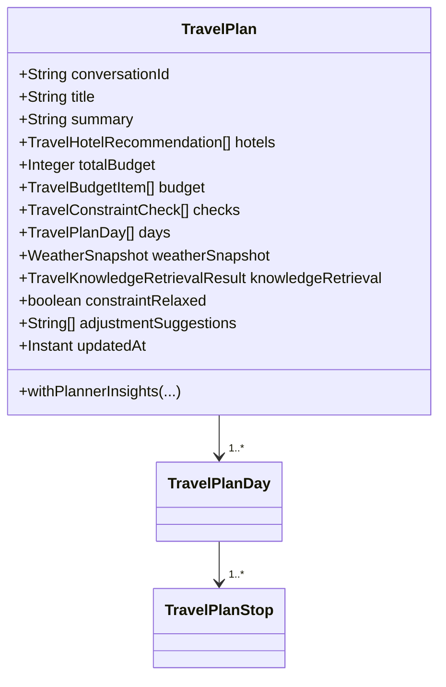

图示来源
- [TravelPlan.java:9-104](file://travel-agent-domain/src/main/java/com/travalagent/domain/model/entity/TravelPlan.java#L9-L104)
- [TravelPlanDay.java:5-20](file://travel-agent-domain/src/main/java/com/travalagent/domain/model/entity/TravelPlanDay.java#L5-L20)
- [TravelPlanStop.java:3-22](file://travel-agent-domain/src/main/java/com/travalagent/domain/model/entity/TravelPlanStop.java#L3-L22)

章节来源
- [TravelPlan.java:9-104](file://travel-agent-domain/src/main/java/com/travalagent/domain/model/entity/TravelPlan.java#L9-L104)
- [TravelPlanDay.java:5-20](file://travel-agent-domain/src/main/java/com/travalagent/domain/model/entity/TravelPlanDay.java#L5-L20)
- [TravelPlanStop.java:3-22](file://travel-agent-domain/src/main/java/com/travalagent/domain/model/entity/TravelPlanStop.java#L3-L22)

### 实体：ConversationSession（会话）
- 设计要点
  - 记录会话标识、标题、最近使用的智能体类型、摘要与时间戳。
  - 作为会话维度的轻量实体，支撑对话历史、任务记忆与旅行规划的关联。
- 业务规则
  - lastAgent 字段用于路由决策与回放分析。
  - createdAt/updatedAt 支持排序与审计。

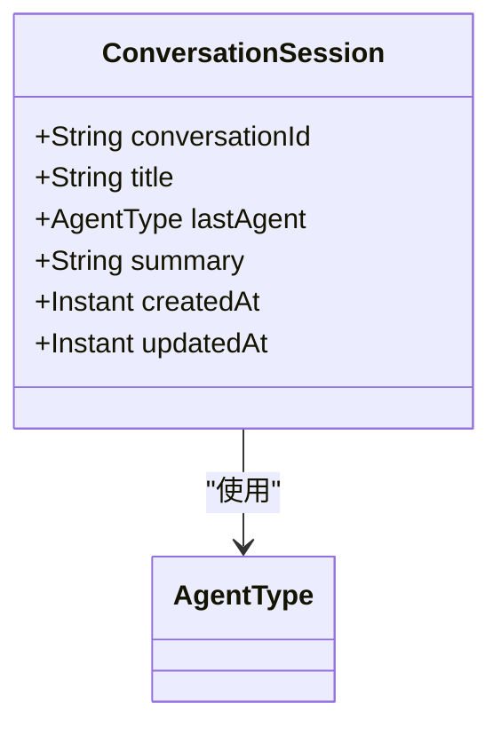

图示来源
- [ConversationSession.java:7-14](file://travel-agent-domain/src/main/java/com/travalagent/domain/model/entity/ConversationSession.java#L7-L14)
- [AgentType.java:3-8](file://travel-agent-domain/src/main/java/com/travalagent/domain/model/valobj/AgentType.java#L3-L8)

章节来源
- [ConversationSession.java:7-14](file://travel-agent-domain/src/main/java/com/travalagent/domain/model/entity/ConversationSession.java#L7-L14)
- [AgentType.java:3-8](file://travel-agent-domain/src/main/java/com/travalagent/domain/model/valobj/AgentType.java#L3-L8)

### 实体：TimelineEvent（时间线事件）
- 设计要点
  - 事件唯一标识、所属会话、执行阶段、消息与详情、创建时间。
  - 提供 of 工厂方法生成带随机 ID 的事件，确保不可变性与一致性。
- 业务规则
  - ExecutionStage 表征执行生命周期的关键节点，便于可视化与追踪。
  - details 字段承载结构化上下文，便于前端渲染与调试。

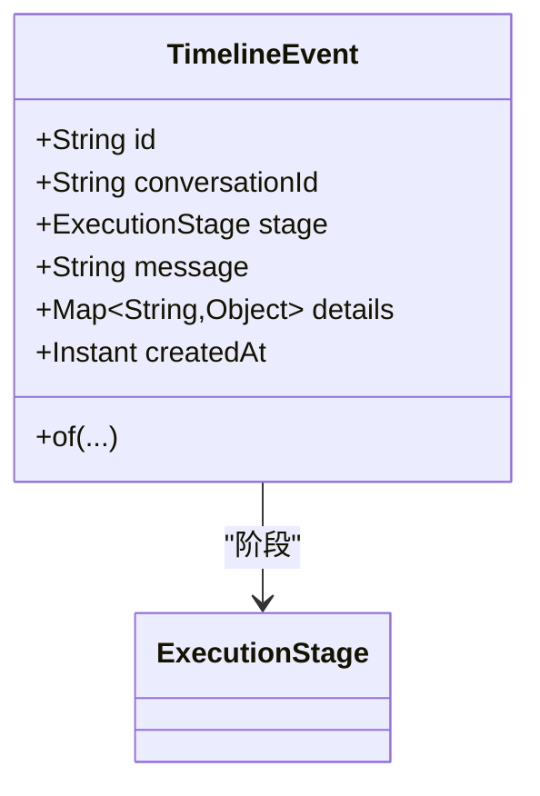

图示来源
- [TimelineEvent.java:9-33](file://travel-agent-domain/src/main/java/com/travalagent/domain/model/entity/TimelineEvent.java#L9-L33)
- [ExecutionStage.java:3-14](file://travel-agent-domain/src/main/java/com/travalagent/domain/model/valobj/ExecutionStage.java#L3-L14)

章节来源
- [TimelineEvent.java:9-33](file://travel-agent-domain/src/main/java/com/travalagent/domain/model/entity/TimelineEvent.java#L9-L33)
- [ExecutionStage.java:3-14](file://travel-agent-domain/src/main/java/com/travalagent/domain/model/valobj/ExecutionStage.java#L3-L14)

### 值对象：AgentExecutionContext（智能体执行上下文）
- 设计要点
  - 不可变记录，封装用户消息、近期消息、任务记忆、长时记忆、路由原因、图像附件与图像上下文摘要。
  - 对集合字段进行不可变包装，避免外部修改。
- 业务语义
  - 作为智能体执行的输入上下文，承载对话历史、任务目标与感知信息，驱动路由与工具调用。

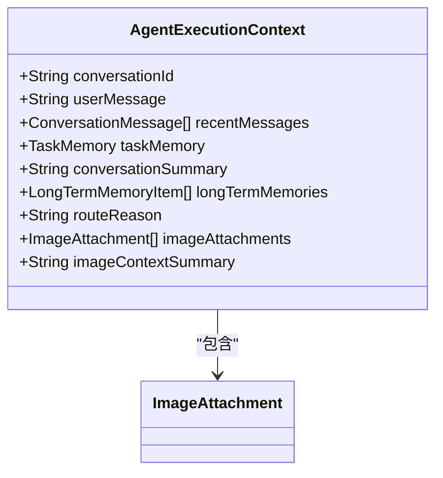

图示来源
- [AgentExecutionContext.java:8-37](file://travel-agent-domain/src/main/java/com/travalagent/domain/model/valobj/AgentExecutionContext.java#L8-L37)
- [ImageAttachment.java:8-32](file://travel-agent-domain/src/main/java/com/travalagent/domain/model/valobj/ImageAttachment.java#L8-L32)

章节来源
- [AgentExecutionContext.java:8-37](file://travel-agent-domain/src/main/java/com/travalagent/domain/model/valobj/AgentExecutionContext.java#L8-L37)
- [ImageAttachment.java:8-32](file://travel-agent-domain/src/main/java/com/travalagent/domain/model/valobj/ImageAttachment.java#L8-L32)

### 值对象：AgentExecutionResult（智能体执行结果）
- 设计要点
  - 不可变记录，封装智能体类型、回答文本、元数据与旅行规划。
- 业务语义
  - 作为智能体执行的统一输出载体，便于上层应用服务进行结果处理与持久化。

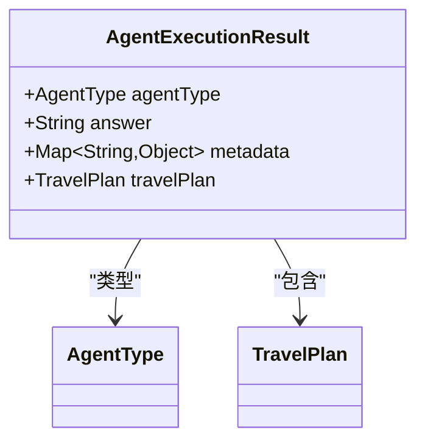

图示来源
- [AgentExecutionResult.java:7-13](file://travel-agent-domain/src/main/java/com/travalagent/domain/model/valobj/AgentExecutionResult.java#L7-L13)
- [AgentType.java:3-8](file://travel-agent-domain/src/main/java/com/travalagent/domain/model/valobj/AgentType.java#L3-L8)
- [TravelPlan.java:9-104](file://travel-agent-domain/src/main/java/com/travalagent/domain/model/entity/TravelPlan.java#L9-L104)

章节来源
- [AgentExecutionResult.java:7-13](file://travel-agent-domain/src/main/java/com/travalagent/domain/model/valobj/AgentExecutionResult.java#L7-L13)
- [AgentType.java:3-8](file://travel-agent-domain/src/main/java/com/travalagent/domain/model/valobj/AgentType.java#L3-L8)
- [TravelPlan.java:9-104](file://travel-agent-domain/src/main/java/com/travalagent/domain/model/entity/TravelPlan.java#L9-L104)

### 值对象：ExecutionStage（执行阶段）
- 设计要点
  - 枚举定义智能体执行的生命周期阶段，覆盖查询分析、召回记忆、选择智能体、专家执行、工具调用、验证与修复、最终化与完成/错误等。
- 业务语义
  - 用于时间线事件的阶段标注与流程控制，便于可观测性与排障。

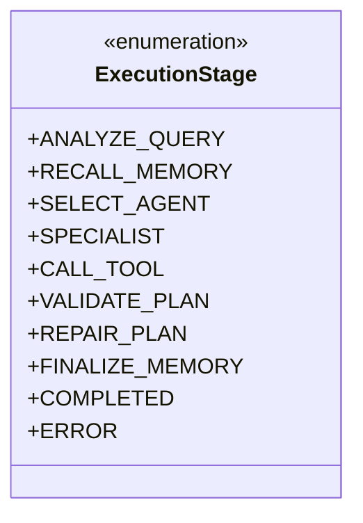

图示来源
- [ExecutionStage.java:3-14](file://travel-agent-domain/src/main/java/com/travalagent/domain/model/valobj/ExecutionStage.java#L3-L14)

章节来源
- [ExecutionStage.java:3-14](file://travel-agent-domain/src/main/java/com/travalagent/domain/model/valobj/ExecutionStage.java#L3-L14)

### 值对象：AgentType（智能体类型）
- 设计要点
  - 枚举定义可用的智能体类型，如天气、地理、旅行规划、通用。
- 业务语义
  - 与路由策略、工具调用与结果处理相关联。

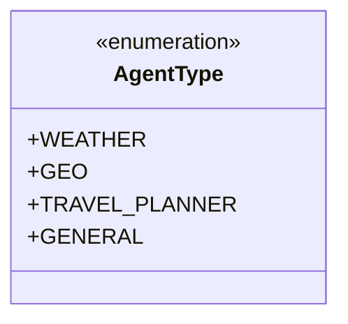

图示来源
- [AgentType.java:3-8](file://travel-agent-domain/src/main/java/com/travalagent/domain/model/valobj/AgentType.java#L3-L8)

章节来源
- [AgentType.java:3-8](file://travel-agent-domain/src/main/java/com/travalagent/domain/model/valobj/AgentType.java#L3-L8)

### 值对象：GeoLocation（地理坐标）
- 设计要点
  - 记录地点名称、地址、经纬度与行政区划编码，用于 POI 匹配与导航。
- 业务语义
  - 作为地理信息的不可变载体，便于跨模块传递与比较。

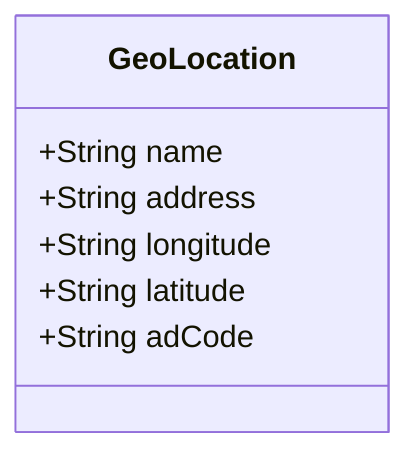

图示来源
- [GeoLocation.java:3-10](file://travel-agent-domain/src/main/java/com/travalagent/domain/model/valobj/GeoLocation.java#L3-L10)

章节来源
- [GeoLocation.java:3-10](file://travel-agent-domain/src/main/java/com/travalagent/domain/model/valobj/GeoLocation.java#L3-L10)

### 值对象：ImageAttachment（图像附件）
- 设计要点
  - 不可变记录，包含媒体类型、大小、dataUrl 以及自动生成的唯一 ID 与默认名称。
  - 构造器中进行空值与格式规范化，metadata 方法导出标准化元数据。
- 业务语义
  - 封装图像上传与解读所需的最小必要信息，支持图像上下文摘要与多模态处理。

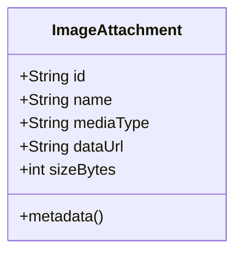

图示来源
- [ImageAttachment.java:8-32](file://travel-agent-domain/src/main/java/com/travalagent/domain/model/valobj/ImageAttachment.java#L8-L32)

章节来源
- [ImageAttachment.java:8-32](file://travel-agent-domain/src/main/java/com/travalagent/domain/model/valobj/ImageAttachment.java#L8-L32)

### 值对象：PlaceSearchQuery（地点搜索查询）
- 设计要点
  - 记录关键词、城市、类型、位置、是否限定城市与数据类型。
- 业务语义
  - 作为地点检索的输入参数，便于工具调用与结果筛选。

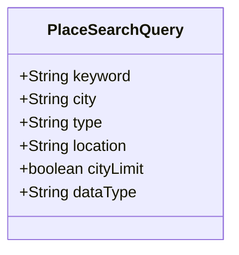

图示来源
- [PlaceSearchQuery.java:3-11](file://travel-agent-domain/src/main/java/com/travalagent/domain/model/valobj/PlaceSearchQuery.java#L3-L11)

章节来源
- [PlaceSearchQuery.java:3-11](file://travel-agent-domain/src/main/java/com/travalagent/domain/model/valobj/PlaceSearchQuery.java#L3-L11)

### 值对象：TransitRoutePlan（交通路线方案）
- 设计要点
  - 记录出行方式、摘要、时长、距离、步行时长、费用、线路名列表、步骤明细与轨迹折线。
  - 对集合字段进行不可变包装。
- 业务语义
  - 作为导航与路线推荐的不可变结果载体，便于前端渲染与二次加工。

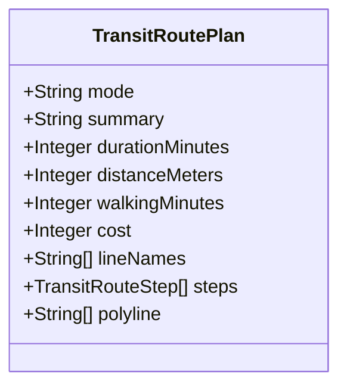

图示来源
- [TransitRoutePlan.java:5-22](file://travel-agent-domain/src/main/java/com/travalagent/domain/model/valobj/TransitRoutePlan.java#L5-L22)

章节来源
- [TransitRoutePlan.java:5-22](file://travel-agent-domain/src/main/java/com/travalagent/domain/model/valobj/TransitRoutePlan.java#L5-L22)

### 仓储接口：ConversationRepository（会话与旅行相关数据）
- 设计要点
  - 定义会话、消息、任务记忆、反馈、图像上下文、旅行规划、时间线等的查询与持久化操作。
  - 通过 Optional/List 返回避免空指针，明确边界条件。
- 接口隔离与领域纯净性
  - 应用服务仅依赖此接口，不关心具体实现，从而保持领域逻辑与基础设施解耦。
  - 通过方法命名与参数类型清晰表达业务意图，便于单元测试替身注入。

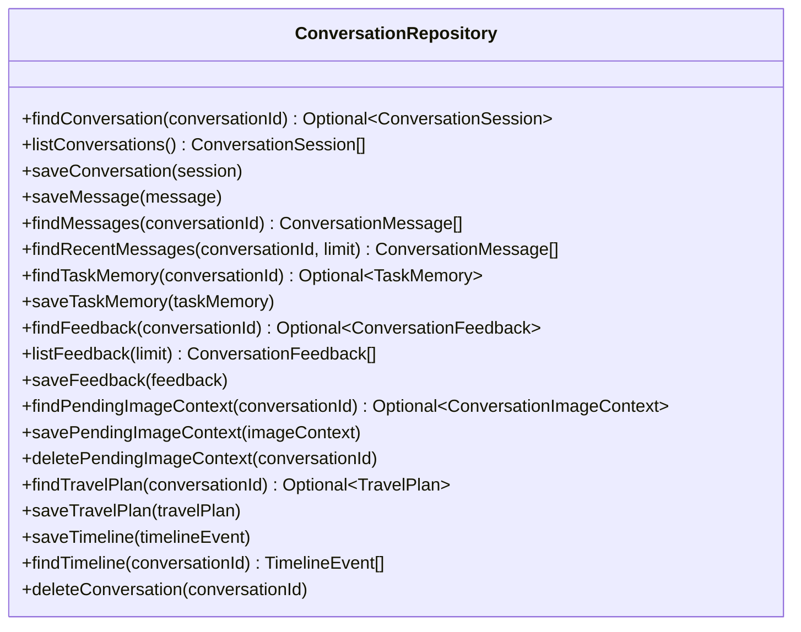

图示来源
- [ConversationRepository.java:14-53](file://travel-agent-domain/src/main/java/com/travalagent/domain/repository/ConversationRepository.java#L14-L53)

章节来源
- [ConversationRepository.java:14-53](file://travel-agent-domain/src/main/java/com/travalagent/domain/repository/ConversationRepository.java#L14-L53)

### 执行流程时序（概念性）
以下时序图展示从“智能体执行上下文”到“智能体执行结果”的典型流程，帮助理解值对象在执行中的作用。

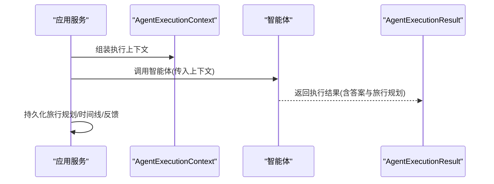

（本图为概念性流程示意，不直接映射具体源码文件）

## 依赖分析
- 内聚与耦合
  - 实体与值对象均采用不可变记录，内聚高、副作用少，降低模块间耦合。
  - 仓储接口仅暴露必要的契约方法，遵循接口隔离原则，避免“胖接口”污染领域模型。
- 外部依赖
  - 值对象之间存在少量交叉引用（如 ImageAttachment、AgentType、ExecutionStage），但均为无副作用的值类型，影响有限。
- 循环依赖
  - 当前结构未发现循环依赖；若未来扩展，应避免实体与值对象互相持有对方的可变引用。

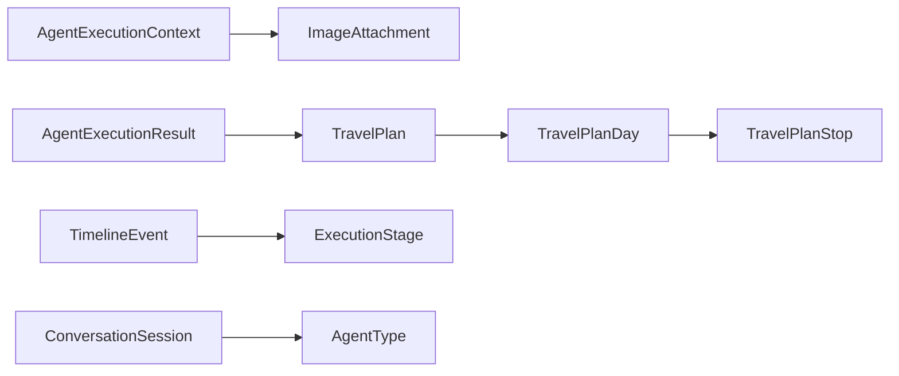

图示来源
- [AgentExecutionContext.java:8-37](file://travel-agent-domain/src/main/java/com/travalagent/domain/model/valobj/AgentExecutionContext.java#L8-L37)
- [ImageAttachment.java:8-32](file://travel-agent-domain/src/main/java/com/travalagent/domain/model/valobj/ImageAttachment.java#L8-L32)
- [AgentExecutionResult.java:7-13](file://travel-agent-domain/src/main/java/com/travalagent/domain/model/valobj/AgentExecutionResult.java#L7-L13)
- [TravelPlan.java:9-104](file://travel-agent-domain/src/main/java/com/travalagent/domain/model/entity/TravelPlan.java#L9-L104)
- [TravelPlanDay.java:5-20](file://travel-agent-domain/src/main/java/com/travalagent/domain/model/entity/TravelPlanDay.java#L5-L20)
- [TravelPlanStop.java:3-22](file://travel-agent-domain/src/main/java/com/travalagent/domain/model/entity/TravelPlanStop.java#L3-L22)
- [TimelineEvent.java:9-33](file://travel-agent-domain/src/main/java/com/travalagent/domain/model/entity/TimelineEvent.java#L9-L33)
- [ExecutionStage.java:3-14](file://travel-agent-domain/src/main/java/com/travalagent/domain/model/valobj/ExecutionStage.java#L3-L14)
- [ConversationSession.java:7-14](file://travel-agent-domain/src/main/java/com/travalagent/domain/model/entity/ConversationSession.java#L7-L14)
- [AgentType.java:3-8](file://travel-agent-domain/src/main/java/com/travalagent/domain/model/valobj/AgentType.java#L3-L8)

## 性能考虑
- 不可变性优势
  - 旅行规划等复杂实体采用不可变记录，天然线程安全，减少锁竞争与竞态条件。
- 序列化成本
  - TravelPlan 含大量字段与嵌套集合，建议在应用层按需裁剪输出，避免不必要的网络/磁盘 IO。
- 集合不可变化
  - 对集合字段进行不可变包装，避免外部修改引发的副作用，同时带来轻微的复制开销；在高频写场景下可权衡是否延迟到使用时再复制。
- 查询与缓存
  - ConversationRepository 的查询方法返回 List/Optional，有利于上层做缓存与去重；建议结合会话维度建立热点缓存。

## 故障排查指南
- 时间线追踪
  - 使用 TimelineEvent 的 ExecutionStage 与 details 字段定位问题阶段与上下文，结合 ConversationRepository.findTimeline 进行回放。
- 执行上下文核验
  - 检查 AgentExecutionContext 中 recentMessages、longTermMemories、imageAttachments 是否完整，缺失可能导致智能体误判。
- 规划一致性
  - 若 TravelPlan 的约束放宽或调整建议异常，检查 Planner 洞察注入路径与 withPlannerInsights 调用链。
- 会话与消息
  - 使用 ConversationRepository.findMessages/findRecentMessages 核验对话历史是否正确，避免上下文漂移。

章节来源
- [TimelineEvent.java:9-33](file://travel-agent-domain/src/main/java/com/travalagent/domain/model/entity/TimelineEvent.java#L9-L33)
- [AgentExecutionContext.java:8-37](file://travel-agent-domain/src/main/java/com/travalagent/domain/model/valobj/AgentExecutionContext.java#L8-L37)
- [TravelPlan.java:77-103](file://travel-agent-domain/src/main/java/com/travalagent/domain/model/entity/TravelPlan.java#L77-L103)
- [ConversationRepository.java:24-26](file://travel-agent-domain/src/main/java/com/travalagent/domain/repository/ConversationRepository.java#L24-L26)

## 结论
TravelAgent 领域层通过“不可变记录 + 枚举 + 接口隔离”的设计，实现了业务语义清晰、可测试性强、可演进的领域模型。实体承载事实与生命周期，值对象表达上下文与结果，仓储接口屏蔽基础设施细节。该设计为上层应用服务提供了稳定、纯净的领域抽象，便于扩展与维护。

## 附录
- 最佳实践
  - 在应用服务中优先使用值对象进行参数传递，避免直接操作实体可变字段。
  - 对复杂实体的序列化进行分层处理，按需加载子对象，降低内存与网络压力。
  - 单元测试中以 ConversationRepository 为注入点，使用内存实现或 Mock 替身验证业务规则。
- 参考路径
  - [实体与值对象定义:9-104](file://travel-agent-domain/src/main/java/com/travalagent/domain/model/entity/TravelPlan.java#L9-L104)
  - [智能体执行上下文与结果:8-37](file://travel-agent-domain/src/main/java/com/travalagent/domain/model/valobj/AgentExecutionContext.java#L8-L37)
  - [执行阶段与智能体类型:3-14](file://travel-agent-domain/src/main/java/com/travalagent/domain/model/valobj/ExecutionStage.java#L3-L14)
  - [会话与时间线实体:7-14](file://travel-agent-domain/src/main/java/com/travalagent/domain/model/entity/ConversationSession.java#L7-L14)
  - [仓储接口契约:14-53](file://travel-agent-domain/src/main/java/com/travalagent/domain/repository/ConversationRepository.java#L14-L53)