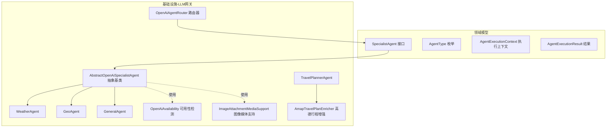
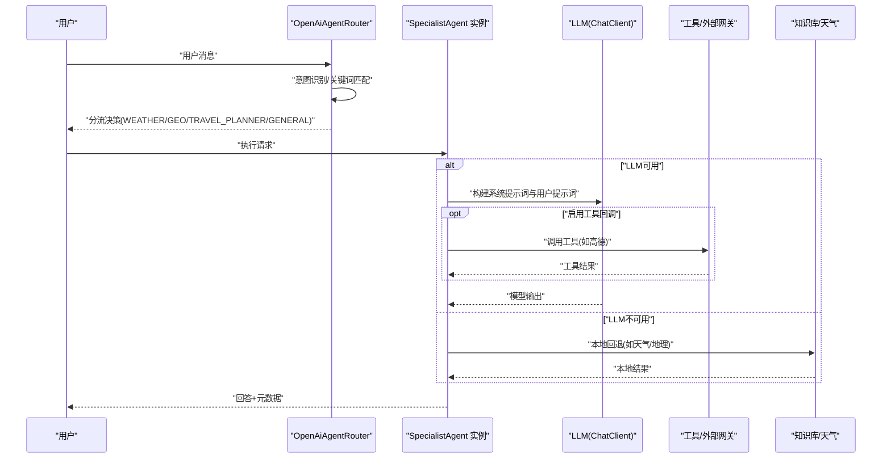
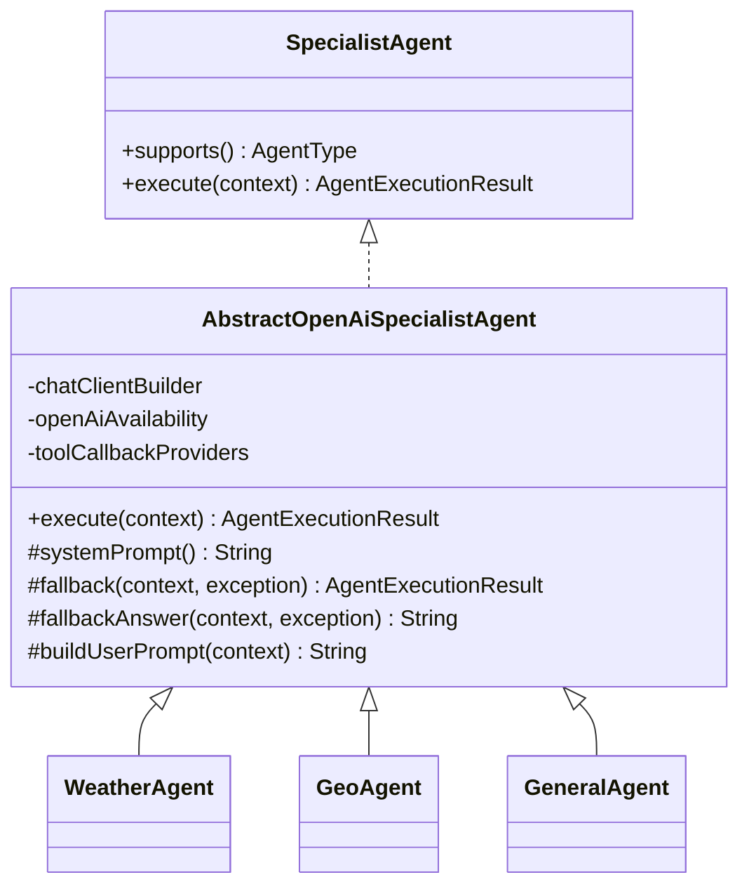
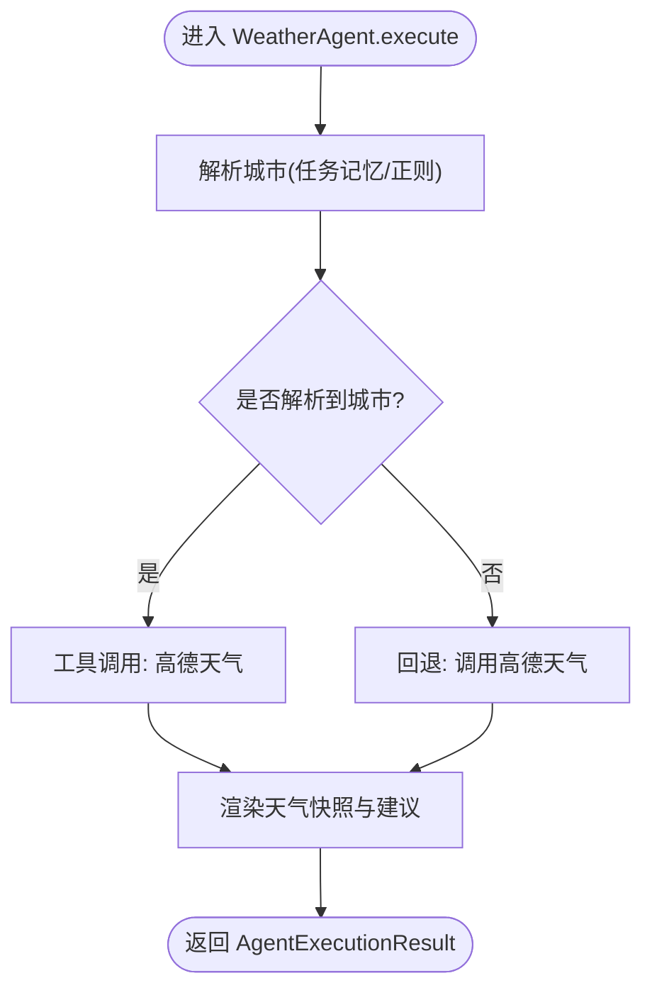
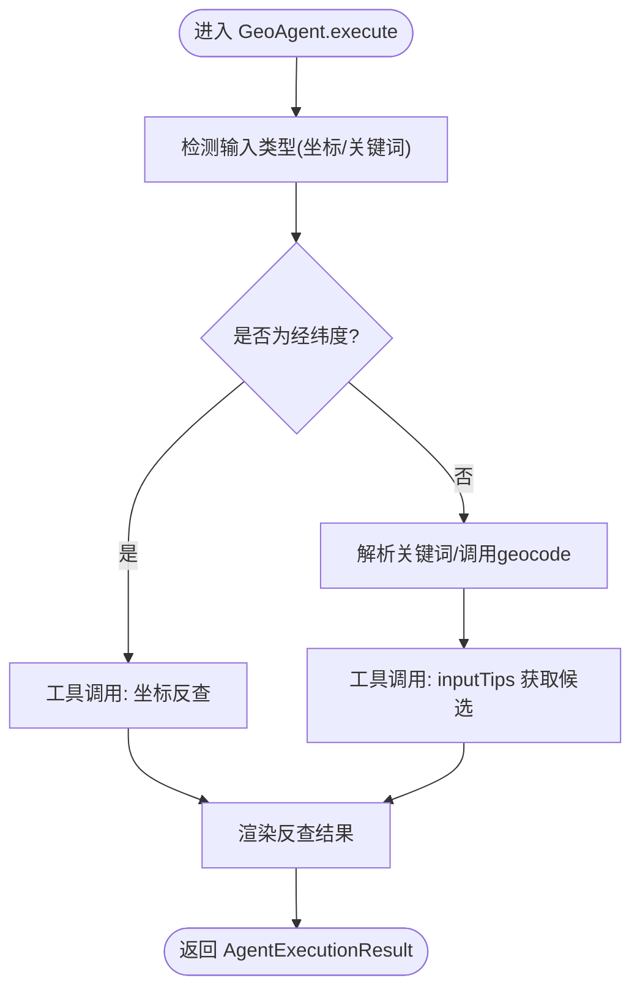
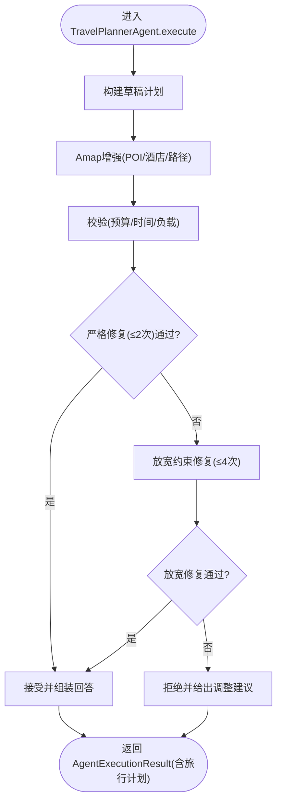
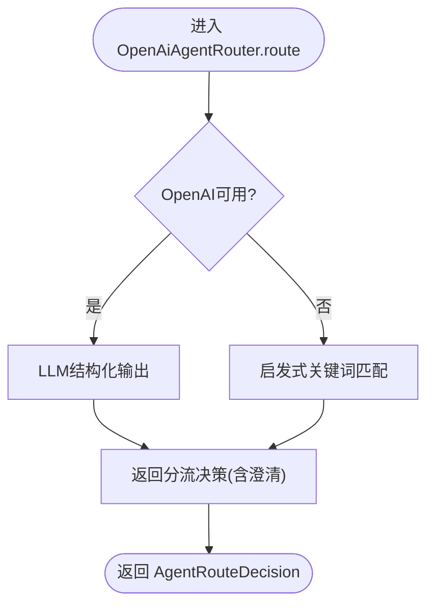
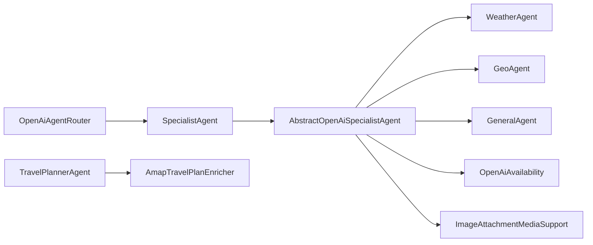

# 专家智能体实现

<cite>
**本文引用的文件**
- [AbstractOpenAiSpecialistAgent.java](file://travel-agent-infrastructure/src/main/java/com/travalagent/infrastructure/gateway/llm/AbstractOpenAiSpecialistAgent.java)
- [WeatherAgent.java](file://travel-agent-infrastructure/src/main/java/com/travalagent/infrastructure/gateway/llm/WeatherAgent.java)
- [GeoAgent.java](file://travel-agent-infrastructure/src/main/java/com/travalagent/infrastructure/gateway/llm/GeoAgent.java)
- [TravelPlannerAgent.java](file://travel-agent-infrastructure/src/main/java/com/travalagent/infrastructure/gateway/llm/TravelPlannerAgent.java)
- [GeneralAgent.java](file://travel-agent-infrastructure/src/main/java/com/travalagent/infrastructure/gateway/llm/GeneralAgent.java)
- [OpenAiAgentRouter.java](file://travel-agent-infrastructure/src/main/java/com/travalagent/infrastructure/gateway/llm/OpenAiAgentRouter.java)
- [OpenAiAvailability.java](file://travel-agent-infrastructure/src/main/java/com/travalagent/infrastructure/gateway/llm/OpenAiAvailability.java)
- [ImageAttachmentMediaSupport.java](file://travel-agent-infrastructure/src/main/java/com/travalagent/infrastructure/gateway/llm/ImageAttachmentMediaSupport.java)
- [AmapTravelPlanEnricher.java](file://travel-agent-infrastructure/src/main/java/com/travalagent/infrastructure/gateway/llm/AmapTravelPlanEnricher.java)
- [SpecialistAgent.java](file://travel-agent-domain/src/main/java/com/travalagent/domain/service/SpecialistAgent.java)
- [AgentType.java](file://travel-agent-domain/src/main/java/com/travalagent/domain/model/valobj/AgentType.java)
- [AgentExecutionContext.java](file://travel-agent-domain/src/main/java/com/travalagent/domain/model/valobj/AgentExecutionContext.java)
- [AgentExecutionResult.java](file://travel-agent-domain/src/main/java/com/travalagent/domain/model/valobj/AgentExecutionResult.java)
</cite>

## 目录
1. [引言](#引言)
2. [项目结构](#项目结构)
3. [核心组件](#核心组件)
4. [架构总览](#架构总览)
5. [详细组件分析](#详细组件分析)
6. [依赖分析](#依赖分析)
7. [性能考虑](#性能考虑)
8. [故障排查指南](#故障排查指南)
9. [结论](#结论)
10. [附录：新智能体开发模板与扩展指南](#附录新智能体开发模板与扩展指南)

## 引言
本文件面向TravelAgent项目的专家智能体实现，系统性阐述基于Spring AI的专家智能体体系设计与落地。重点包括：
- 抽象基类AbstractOpenAiSpecialistAgent的设计模式与通用能力（LLM集成、参数配置、错误回退与元数据）。
- 四种专家智能体的职责边界与行为差异：WeatherAgent（天气）、GeoAgent（地理）、TravelPlannerAgent（旅行计划）、GeneralAgent（通用对话）。
- 智能体生命周期管理、状态保持与结果整合流程。
- 新智能体开发模板与扩展最佳实践。

## 项目结构
专家智能体实现主要位于基础设施层的gateway.llm包中，围绕领域接口SpecialistAgent展开，结合路由器OpenAiAgentRouter进行意图识别与分流，配合工具调用与外部网关（如高德）完成能力闭环。

图示来源
- [AbstractOpenAiSpecialistAgent.java:15-186](file://travel-agent-infrastructure/src/main/java/com/travalagent/infrastructure/gateway/llm/AbstractOpenAiSpecialistAgent.java#L15-L186)
- [WeatherAgent.java:17-163](file://travel-agent-infrastructure/src/main/java/com/travalagent/infrastructure/gateway/llm/WeatherAgent.java#L17-L163)
- [GeoAgent.java:19-191](file://travel-agent-infrastructure/src/main/java/com/travalagent/infrastructure/gateway/llm/GeoAgent.java#L19-L191)
- [TravelPlannerAgent.java:28-570](file://travel-agent-infrastructure/src/main/java/com/travalagent/infrastructure/gateway/llm/TravelPlannerAgent.java#L28-L570)
- [GeneralAgent.java:10-63](file://travel-agent-infrastructure/src/main/java/com/travalagent/infrastructure/gateway/llm/GeneralAgent.java#L10-L63)
- [OpenAiAgentRouter.java:13-145](file://travel-agent-infrastructure/src/main/java/com/travalagent/infrastructure/gateway/llm/OpenAiAgentRouter.java#L13-L145)
- [OpenAiAvailability.java:7-25](file://travel-agent-infrastructure/src/main/java/com/travalagent/infrastructure/gateway/llm/OpenAiAvailability.java#L7-L25)
- [ImageAttachmentMediaSupport.java:15-60](file://travel-agent-infrastructure/src/main/java/com/travalagent/infrastructure/gateway/llm/ImageAttachmentMediaSupport.java#L15-L60)
- [AmapTravelPlanEnricher.java:34-922](file://travel-agent-infrastructure/src/main/java/com/travalagent/infrastructure/gateway/llm/AmapTravelPlanEnricher.java#L34-L922)
- [SpecialistAgent.java:7-12](file://travel-agent-domain/src/main/java/com/travalagent/domain/service/SpecialistAgent.java#L7-L12)
- [AgentType.java:3-8](file://travel-agent-domain/src/main/java/com/travalagent/domain/model/valobj/AgentType.java#L3-L8)
- [AgentExecutionContext.java:8-38](file://travel-agent-domain/src/main/java/com/travalagent/domain/model/valobj/AgentExecutionContext.java#L8-L38)
- [AgentExecutionResult.java:7-15](file://travel-agent-domain/src/main/java/com/travalagent/domain/model/valobj/AgentExecutionResult.java#L7-L15)

章节来源
- [OpenAiAgentRouter.java:13-145](file://travel-agent-infrastructure/src/main/java/com/travalagent/infrastructure/gateway/llm/OpenAiAgentRouter.java#L13-L145)
- [SpecialistAgent.java:7-12](file://travel-agent-domain/src/main/java/com/travalagent/domain/service/SpecialistAgent.java#L7-L12)

## 核心组件
- 抽象基类AbstractOpenAiSpecialistAgent：封装统一的LLM调用流程、图像附件处理、工具回调、错误回退与元数据收集，子类仅需关注系统提示词与特定回退策略。
- 专家智能体：
  - WeatherAgent：天气查询与建议生成，具备本地回退能力。
  - GeoAgent：地理解析、坐标反查与地点消歧，具备本地回退能力。
  - TravelPlannerAgent：约束驱动的旅行计划构建、校验、修复与增强，整合知识与天气洞察。
  - GeneralAgent：通用对话兜底，避免误用工具。
- 路由器OpenAiAgentRouter：根据用户输入与任务记忆进行意图识别与分流，必要时触发最小澄清问题。
- 工具与可用性：
  - OpenAiAvailability：检测OpenAI API密钥可用性。
  - ImageAttachmentMediaSupport：将图像附件转换为Spring AI Media数组。
  - AmapTravelPlanEnricher：POI检索、酒店推荐、路径规划与成本合并。

章节来源
- [AbstractOpenAiSpecialistAgent.java:15-186](file://travel-agent-infrastructure/src/main/java/com/travalagent/infrastructure/gateway/llm/AbstractOpenAiSpecialistAgent.java#L15-L186)
- [WeatherAgent.java:17-163](file://travel-agent-infrastructure/src/main/java/com/travalagent/infrastructure/gateway/llm/WeatherAgent.java#L17-L163)
- [GeoAgent.java:19-191](file://travel-agent-infrastructure/src/main/java/com/travalagent/infrastructure/gateway/llm/GeoAgent.java#L19-L191)
- [TravelPlannerAgent.java:28-570](file://travel-agent-infrastructure/src/main/java/com/travalagent/infrastructure/gateway/llm/TravelPlannerAgent.java#L28-L570)
- [GeneralAgent.java:10-63](file://travel-agent-infrastructure/src/main/java/com/travalagent/infrastructure/gateway/llm/GeneralAgent.java#L10-L63)
- [OpenAiAgentRouter.java:13-145](file://travel-agent-infrastructure/src/main/java/com/travalagent/infrastructure/gateway/llm/OpenAiAgentRouter.java#L13-L145)
- [OpenAiAvailability.java:7-25](file://travel-agent-infrastructure/src/main/java/com/travalagent/infrastructure/gateway/llm/OpenAiAvailability.java#L7-L25)
- [ImageAttachmentMediaSupport.java:15-60](file://travel-agent-infrastructure/src/main/java/com/travalagent/infrastructure/gateway/llm/ImageAttachmentMediaSupport.java#L15-L60)
- [AmapTravelPlanEnricher.java:34-922](file://travel-agent-infrastructure/src/main/java/com/travalagent/infrastructure/gateway/llm/AmapTravelPlanEnricher.java#L34-L922)

## 架构总览
专家智能体采用“路由-执行-增强-校验-修复”的闭环架构。路由器负责意图识别与分流，抽象基类统一处理LLM调用与回退，具体专家智能体聚焦各自领域能力，旅行计划智能体引入外部工具与知识库进行增强与校验。

图示来源
- [OpenAiAgentRouter.java:29-72](file://travel-agent-infrastructure/src/main/java/com/travalagent/infrastructure/gateway/llm/OpenAiAgentRouter.java#L29-L72)
- [AbstractOpenAiSpecialistAgent.java:31-68](file://travel-agent-infrastructure/src/main/java/com/travalagent/infrastructure/gateway/llm/AbstractOpenAiSpecialistAgent.java#L31-L68)
- [WeatherAgent.java:54-71](file://travel-agent-infrastructure/src/main/java/com/travalagent/infrastructure/gateway/llm/WeatherAgent.java#L54-L71)
- [GeoAgent.java:52-87](file://travel-agent-infrastructure/src/main/java/com/travalagent/infrastructure/gateway/llm/GeoAgent.java#L52-L87)
- [TravelPlannerAgent.java:66-103](file://travel-agent-infrastructure/src/main/java/com/travalagent/infrastructure/gateway/llm/TravelPlannerAgent.java#L66-L103)

## 详细组件分析

### 抽象基类：AbstractOpenAiSpecialistAgent
- 设计模式
  - 模板方法：execute定义完整流程，子类仅覆盖systemPrompt与fallback策略。
  - 组合与依赖注入：通过ChatClient.Builder、OpenAiAvailability、ToolCallbackProvider组合实现可插拔能力。
- LLM集成方式
  - 使用ChatClient构建prompt，支持文本与图像混合输入；当存在图像附件时转换为Media数组传入。
  - 支持工具回调（ToolCallbackProvider），将conversationId等上下文注入工具调用。
- 参数配置
  - 通过构造函数注入ChatClient.Builder与OpenAiAvailability，以及可变长度的工具回调提供者。
  - 用户提示词包含最新用户请求、任务记忆、对话摘要、长期记忆与最近消息，确保上下文完备。
- 错误处理机制
  - LLM不可用时直接进入fallback分支，返回预设兜底答案与元数据。
  - 捕获异常后提取根因（rootMessage），用于元数据记录。
  - fallbackAnswer根据用户语言选择中文或英文兜底文案。

图示来源
- [AbstractOpenAiSpecialistAgent.java:15-186](file://travel-agent-infrastructure/src/main/java/com/travalagent/infrastructure/gateway/llm/AbstractOpenAiSpecialistAgent.java#L15-L186)
- [SpecialistAgent.java:7-12](file://travel-agent-domain/src/main/java/com/travalagent/domain/service/SpecialistAgent.java#L7-L12)

章节来源
- [AbstractOpenAiSpecialistAgent.java:15-186](file://travel-agent-infrastructure/src/main/java/com/travalagent/infrastructure/gateway/llm/AbstractOpenAiSpecialistAgent.java#L15-L186)
- [ImageAttachmentMediaSupport.java:15-60](file://travel-agent-infrastructure/src/main/java/com/travalagent/infrastructure/gateway/llm/ImageAttachmentMediaSupport.java#L15-L60)
- [OpenAiAvailability.java:7-25](file://travel-agent-infrastructure/src/main/java/com/travalagent/infrastructure/gateway/llm/OpenAiAvailability.java#L7-L25)

### WeatherAgent：天气信息处理
- 职责
  - 识别天气/温度/降雨等请求，优先使用工具获取实时天气；若LLM不可用，则从高德网关回退查询。
  - 生成简洁的天气结论、温风降水风险与实用建议。
- 关键逻辑
  - 解析用户消息中的城市（中英文正则），优先使用目的地任务记忆。
  - fallback中直接调用高德天气接口并渲染结果，同时携带toolEnabled=true与fallback标记。
- 输出
  - 返回结构化回答与元数据（是否启用工具、是否回退、回退原因）。

图示来源
- [WeatherAgent.java:54-95](file://travel-agent-infrastructure/src/main/java/com/travalagent/infrastructure/gateway/llm/WeatherAgent.java#L54-L95)
- [WeatherAgent.java:97-134](file://travel-agent-infrastructure/src/main/java/com/travalagent/infrastructure/gateway/llm/WeatherAgent.java#L97-L134)

章节来源
- [WeatherAgent.java:17-163](file://travel-agent-infrastructure/src/main/java/com/travalagent/infrastructure/gateway/llm/WeatherAgent.java#L17-L163)

### GeoAgent：地理数据解析
- 职责
  - 地址解析、坐标解析、反向地理编码与地点消歧；优先使用工具结果。
  - 若LLM不可用，支持直接解析经纬度或关键词并回退到高德地理服务。
- 关键逻辑
  - 正则匹配经纬度；清洗用户消息提取关键词；调用geocode与inputTips获取候选。
  - fallback中根据是否为坐标决定反查或正向解析。
- 输出
  - 返回标准化地址、坐标、行政区划编码与候选列表，携带工具启用与回退元数据。

图示来源
- [GeoAgent.java:52-87](file://travel-agent-infrastructure/src/main/java/com/travalagent/infrastructure/gateway/llm/GeoAgent.java#L52-L87)
- [GeoAgent.java:110-185](file://travel-agent-infrastructure/src/main/java/com/travalagent/infrastructure/gateway/llm/GeoAgent.java#L110-L185)

章节来源
- [GeoAgent.java:19-191](file://travel-agent-infrastructure/src/main/java/com/travalagent/infrastructure/gateway/llm/GeoAgent.java#L19-L191)

### TravelPlannerAgent：旅行计划生成
- 职责
  - 基于约束（目的地、天数、预算、偏好）生成旅行计划，进行校验、修复与增强，最终输出可执行方案。
- 生命周期与流程
  - 构建草稿 → 增强（POI、酒店、路径）→ 校验（预算、开放时间、负载）→ 严格修复（有限次数）→ 放松约束修复（更多次数）→ 组装回答与元数据。
- 关键模块
  - AmapTravelPlanEnricher：POI检索、酒店推荐、路径规划与成本合并。
  - 校验与修复：基于启发式规则与修复器迭代优化，发布时间线事件。
  - 知识与天气整合：从知识库检索本地经验提示，从高德获取天气快照。
- 输出
  - 返回旅行计划对象与丰富元数据（是否通过、修复次数、是否放宽约束、建议预算等）。

图示来源
- [TravelPlannerAgent.java:66-103](file://travel-agent-infrastructure/src/main/java/com/travalagent/infrastructure/gateway/llm/TravelPlannerAgent.java#L66-L103)
- [TravelPlannerAgent.java:139-156](file://travel-agent-infrastructure/src/main/java/com/travalagent/infrastructure/gateway/llm/TravelPlannerAgent.java#L139-L156)
- [AmapTravelPlanEnricher.java:44-98](file://travel-agent-infrastructure/src/main/java/com/travalagent/infrastructure/gateway/llm/AmapTravelPlanEnricher.java#L44-L98)

章节来源
- [TravelPlannerAgent.java:28-570](file://travel-agent-infrastructure/src/main/java/com/travalagent/infrastructure/gateway/llm/TravelPlannerAgent.java#L28-L570)
- [AmapTravelPlanEnricher.java:34-922](file://travel-agent-infrastructure/src/main/java/com/travalagent/infrastructure/gateway/llm/AmapTravelPlanEnricher.java#L34-L922)

### GeneralAgent：通用对话处理
- 职责
  - 处理非专业领域的旅行相关问题，避免声称使用了工具。
  - 在LLM不可用时提供清晰的可用能力清单与引导。
- 回退策略
  - 提供中文/英文双语兜底说明，强调仍可执行的典型任务（规划行程、查询天气、解析地点/坐标）。

章节来源
- [GeneralAgent.java:10-63](file://travel-agent-infrastructure/src/main/java/com/travalagent/infrastructure/gateway/llm/GeneralAgent.java#L10-L63)

### 路由器：OpenAiAgentRouter
- 职责
  - 识别用户意图，选择WEATHER/GEO/TRAVEL_PLANNER/GENERAL之一；若旅行规划缺失关键信息，设置澄清问题。
- 两种策略
  - LLM路由：通过结构化提示词与实体输出进行精确分流。
  - 健康降级：当LLM不可用时，基于关键词与正则表达式进行启发式分流，并在旅行规划场景中触发最小澄清问题。

图示来源
- [OpenAiAgentRouter.java:29-72](file://travel-agent-infrastructure/src/main/java/com/travalagent/infrastructure/gateway/llm/OpenAiAgentRouter.java#L29-L72)
- [OpenAiAgentRouter.java:74-96](file://travel-agent-infrastructure/src/main/java/com/travalagent/infrastructure/gateway/llm/OpenAiAgentRouter.java#L74-L96)

章节来源
- [OpenAiAgentRouter.java:13-145](file://travel-agent-infrastructure/src/main/java/com/travalagent/infrastructure/gateway/llm/OpenAiAgentRouter.java#L13-L145)

## 依赖分析
- 组件耦合
  - 抽象基类与具体智能体之间为继承关系，耦合集中在系统提示词与回退策略。
  - TravelPlannerAgent与AmapTravelPlanEnricher、知识库与天气网关存在运行时依赖，但通过接口解耦。
  - 路由器与具体智能体通过AgentType枚举耦合，遵循单一职责。
- 外部依赖
  - Spring AI ChatClient与工具回调框架。
  - 高德MCP工具链（POI、路径、地理编码）。
  - OpenAI API密钥可用性检测。

图示来源
- [OpenAiAgentRouter.java:13-145](file://travel-agent-infrastructure/src/main/java/com/travalagent/infrastructure/gateway/llm/OpenAiAgentRouter.java#L13-L145)
- [AbstractOpenAiSpecialistAgent.java:15-186](file://travel-agent-infrastructure/src/main/java/com/travalagent/infrastructure/gateway/llm/AbstractOpenAiSpecialistAgent.java#L15-L186)
- [WeatherAgent.java:17-163](file://travel-agent-infrastructure/src/main/java/com/travalagent/infrastructure/gateway/llm/WeatherAgent.java#L17-L163)
- [GeoAgent.java:19-191](file://travel-agent-infrastructure/src/main/java/com/travalagent/infrastructure/gateway/llm/GeoAgent.java#L19-L191)
- [GeneralAgent.java:10-63](file://travel-agent-infrastructure/src/main/java/com/travalagent/infrastructure/gateway/llm/GeneralAgent.java#L10-L63)
- [TravelPlannerAgent.java:28-570](file://travel-agent-infrastructure/src/main/java/com/travalagent/infrastructure/gateway/llm/TravelPlannerAgent.java#L28-L570)
- [AmapTravelPlanEnricher.java:34-922](file://travel-agent-infrastructure/src/main/java/com/travalagent/infrastructure/gateway/llm/AmapTravelPlanEnricher.java#L34-L922)
- [OpenAiAvailability.java:7-25](file://travel-agent-infrastructure/src/main/java/com/travalagent/infrastructure/gateway/llm/OpenAiAvailability.java#L7-L25)
- [ImageAttachmentMediaSupport.java:15-60](file://travel-agent-infrastructure/src/main/java/com/travalagent/infrastructure/gateway/llm/ImageAttachmentMediaSupport.java#L15-L60)

章节来源
- [AgentType.java:3-8](file://travel-agent-domain/src/main/java/com/travalagent/domain/model/valobj/AgentType.java#L3-L8)
- [SpecialistAgent.java:7-12](file://travel-agent-domain/src/main/java/com/travalagent/domain/service/SpecialistAgent.java#L7-L12)

## 性能考虑
- LLM调用成本控制
  - 合理裁剪上下文长度，避免冗余历史消息；利用任务记忆与对话摘要降低token消耗。
  - 对旅行计划场景，优先使用工具增强而非纯LLM生成，减少幻觉与重复计算。
- 工具调用优化
  - AmapTravelPlanEnricher对候选进行评分与去重，限制返回数量，提升响应速度。
  - 路径规划与酒店推荐采用“优先规则+回退”的策略，在保证可执行性的前提下减少无效调用。
- 回退策略
  - 在LLM不可用时快速切换至本地工具调用，缩短端到端延迟。
- 缓存与复用
  - 对高频查询（如天气、地理）可引入缓存层，减少对外部网关压力。

## 故障排查指南
- LLM不可用
  - 现象：返回兜底答案，元数据fallback=true，fallbackReason为根因。
  - 排查：检查OpenAI API密钥配置与可用性检测逻辑。
- 工具调用失败
  - 现象：旅行计划增强阶段出现异常，回退至宽松修复或拒绝。
  - 排查：查看高德MCP工具链可用性与网络连通性；确认conversationId传递正确。
- 上下文不完整
  - 现象：旅行规划被要求澄清（目的地/天数/预算）。
  - 排查：检查任务记忆与最近消息是否正确注入；优化路由器关键词匹配。
- 图像输入异常
  - 现象：图像附件未被识别或转换失败。
  - 排查：确认附件为base64 data URL格式；检查MIME类型与字节流解析。

章节来源
- [OpenAiAvailability.java:7-25](file://travel-agent-infrastructure/src/main/java/com/travalagent/infrastructure/gateway/llm/OpenAiAvailability.java#L7-L25)
- [AbstractOpenAiSpecialistAgent.java:72-86](file://travel-agent-infrastructure/src/main/java/com/travalagent/infrastructure/gateway/llm/AbstractOpenAiSpecialistAgent.java#L72-L86)
- [OpenAiAgentRouter.java:74-96](file://travel-agent-infrastructure/src/main/java/com/travalagent/infrastructure/gateway/llm/OpenAiAgentRouter.java#L74-L96)
- [ImageAttachmentMediaSupport.java:44-52](file://travel-agent-infrastructure/src/main/java/com/travalagent/infrastructure/gateway/llm/ImageAttachmentMediaSupport.java#L44-L52)

## 结论
该专家智能体体系通过抽象基类统一LLM接入与回退策略，结合路由器的意图识别与具体专家智能体的专业能力，形成“路由-执行-增强-校验-修复”的闭环。TravelPlannerAgent在约束驱动下引入外部工具与知识库，显著提升了计划的可执行性与实用性。整体设计兼顾可维护性与扩展性，为后续新增智能体提供了清晰的模板与规范。

## 附录：新智能体开发模板与扩展指南
- 开发步骤
  - 继承AbstractOpenAiSpecialistAgent，实现supports与systemPrompt。
  - 如需工具回调，注入ToolCallbackProvider并在execute中启用；否则走纯LLM路径。
  - 在fallback中实现本地回退逻辑（如调用高德地理/天气），并返回结构化回答与元数据。
  - 在AgentType中注册新类型，并在路由器中完善分流规则（可选）。
- 最佳实践
  - 明确职责边界：仅处理与系统提示词一致的任务类型。
  - 重视回退策略：在LLM不可用时提供清晰的本地替代方案。
  - 控制上下文长度：合理裁剪任务记忆、摘要与历史消息。
  - 元数据可观测：记录routeReason、toolEnabled、imageAttachmentCount、fallback标志与原因。
  - 单元测试：针对LLM可用/不可用、工具回调成功/失败、图像输入等场景编写测试。

章节来源
- [AbstractOpenAiSpecialistAgent.java:15-186](file://travel-agent-infrastructure/src/main/java/com/travalagent/infrastructure/gateway/llm/AbstractOpenAiSpecialistAgent.java#L15-L186)
- [OpenAiAgentRouter.java:13-145](file://travel-agent-infrastructure/src/main/java/com/travalagent/infrastructure/gateway/llm/OpenAiAgentRouter.java#L13-L145)
- [AgentType.java:3-8](file://travel-agent-domain/src/main/java/com/travalagent/domain/model/valobj/AgentType.java#L3-L8)
- [AgentExecutionContext.java:8-38](file://travel-agent-domain/src/main/java/com/travalagent/domain/model/valobj/AgentExecutionContext.java#L8-L38)
- [AgentExecutionResult.java:7-15](file://travel-agent-domain/src/main/java/com/travalagent/domain/model/valobj/AgentExecutionResult.java#L7-L15)