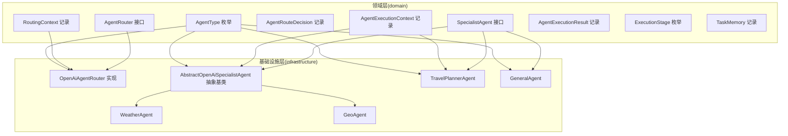
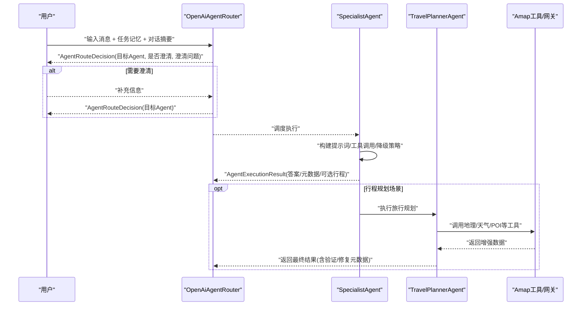
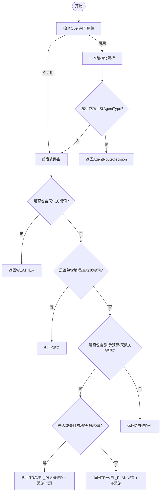
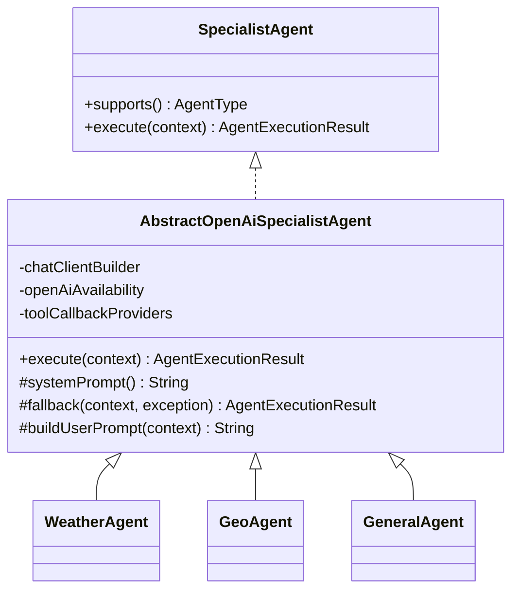
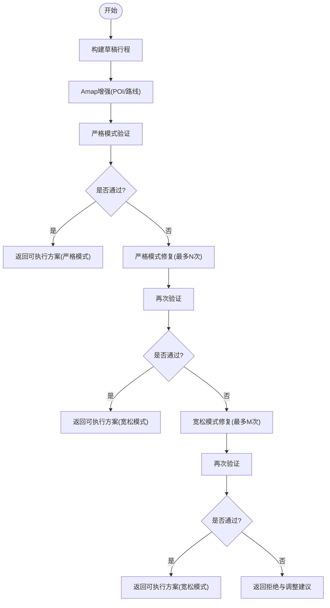
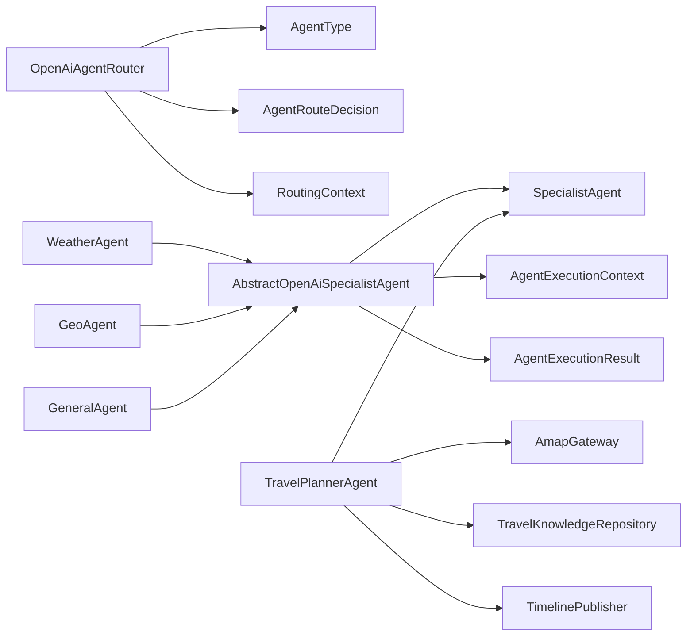

# 多智能体架构

<cite>
**本文引用的文件**
- [AgentRouter.java](file://travel-agent-domain/src/main/java/com/travalagent/domain/service/AgentRouter.java)
- [SpecialistAgent.java](file://travel-agent-domain/src/main/java/com/travalagent/domain/service/SpecialistAgent.java)
- [AgentType.java](file://travel-agent-domain/src/main/java/com/travalagent/domain/model/valobj/AgentType.java)
- [AgentRouteDecision.java](file://travel-agent-domain/src/main/java/com/travalagent/domain/model/valobj/AgentRouteDecision.java)
- [RoutingContext.java](file://travel-agent-domain/src/main/java/com/travalagent/domain/model/valobj/RoutingContext.java)
- [AgentExecutionContext.java](file://travel-agent-domain/src/main/java/com/travalagent/domain/model/valobj/AgentExecutionContext.java)
- [AgentExecutionResult.java](file://travel-agent-domain/src/main/java/com/travalagent/domain/model/valobj/AgentExecutionResult.java)
- [ExecutionStage.java](file://travel-agent-domain/src/main/java/com/travalagent/domain/model/valobj/ExecutionStage.java)
- [TaskMemory.java](file://travel-agent-domain/src/main/java/com/travalagent/domain/model/entity/TaskMemory.java)
- [AbstractOpenAiSpecialistAgent.java](file://travel-agent-infrastructure/src/main/java/com/travalagent/infrastructure/gateway/llm/AbstractOpenAiSpecialistAgent.java)
- [WeatherAgent.java](file://travel-agent-infrastructure/src/main/java/com/travalagent/infrastructure/gateway/llm/WeatherAgent.java)
- [GeoAgent.java](file://travel-agent-infrastructure/src/main/java/com/travalagent/infrastructure/gateway/llm/GeoAgent.java)
- [TravelPlannerAgent.java](file://travel-agent-infrastructure/src/main/java/com/travalagent/infrastructure/gateway/llm/TravelPlannerAgent.java)
- [GeneralAgent.java](file://travel-agent-infrastructure/src/main/java/com/travalagent/infrastructure/gateway/llm/GeneralAgent.java)
- [OpenAiAgentRouter.java](file://travel-agent-infrastructure/src/main/java/com/travalagent/infrastructure/gateway/llm/OpenAiAgentRouter.java)
</cite>

## 目录
1. [引言](#引言)
2. [项目结构](#项目结构)
3. [核心组件](#核心组件)
4. [架构总览](#架构总览)
5. [详细组件分析](#详细组件分析)
6. [依赖分析](#依赖分析)
7. [性能考虑](#性能考虑)
8. [故障排查指南](#故障排查指南)
9. [结论](#结论)
10. [附录](#附录)

## 引言
本文件面向TravelAgent项目的多智能体系统，系统性阐述多智能体的整体设计与运行机制，重点覆盖以下方面：
- 四种专家智能体的职责边界与协作流程：WEATHER、GEO、TRAVEL_PLANNER、GENERAL
- 智能体路由算法的实现原理：AgentRouter（含LLM路由与启发式回退）、智能体选择策略与澄清条件
- 专家智能体的实现模式：AbstractOpenAiSpecialistAgent基类设计与具体智能体扩展方式
- 智能体间通信机制、状态管理与结果整合过程
- 扩展开发的指导原则与最佳实践

## 项目结构
TravelAgent采用分层清晰的模块化组织：
- domain层：定义领域接口与值对象（如AgentRouter、SpecialistAgent、AgentType、AgentRouteDecision、RoutingContext、AgentExecutionContext、AgentExecutionResult、ExecutionStage、TaskMemory）
- infrastructure层：提供具体实现（LLM专家智能体、OpenAI可用性检测、工具回调、Amap网关集成等）
- app层：对外提供控制器与工作流编排（ConversationWorkflow等）

图表来源
- [AgentRouter.java:6-9](file://travel-agent-domain/src/main/java/com/travalagent/domain/service/AgentRouter.java#L6-L9)
- [SpecialistAgent.java:7-12](file://travel-agent-domain/src/main/java/com/travalagent/domain/service/SpecialistAgent.java#L7-L12)
- [AgentType.java:3-8](file://travel-agent-domain/src/main/java/com/travalagent/domain/model/valobj/AgentType.java#L3-L8)
- [AgentRouteDecision.java:3-8](file://travel-agent-domain/src/main/java/com/travalagent/domain/model/valobj/AgentRouteDecision.java#L3-L8)
- [RoutingContext.java:8-15](file://travel-agent-domain/src/main/java/com/travalagent/domain/model/valobj/RoutingContext.java#L8-L15)
- [AgentExecutionContext.java:8-18](file://travel-agent-domain/src/main/java/com/travalagent/domain/model/valobj/AgentExecutionContext.java#L8-L18)
- [AgentExecutionResult.java:7-12](file://travel-agent-domain/src/main/java/com/travalagent/domain/model/valobj/AgentExecutionResult.java#L7-L12)
- [ExecutionStage.java:3-13](file://travel-agent-domain/src/main/java/com/travalagent/domain/model/valobj/ExecutionStage.java#L3-L13)
- [TaskMemory.java:9-19](file://travel-agent-domain/src/main/java/com/travalagent/domain/model/entity/TaskMemory.java#L9-L19)
- [OpenAiAgentRouter.java:13-72](file://travel-agent-infrastructure/src/main/java/com/travalagent/infrastructure/gateway/llm/OpenAiAgentRouter.java#L13-L72)
- [AbstractOpenAiSpecialistAgent.java:15-68](file://travel-agent-infrastructure/src/main/java/com/travalagent/infrastructure/gateway/llm/AbstractOpenAiSpecialistAgent.java#L15-L68)
- [WeatherAgent.java:17-37](file://travel-agent-infrastructure/src/main/java/com/travalagent/infrastructure/gateway/llm/WeatherAgent.java#L17-L37)
- [GeoAgent.java:19-38](file://travel-agent-infrastructure/src/main/java/com/travalagent/infrastructure/gateway/llm/GeoAgent.java#L19-L38)
- [TravelPlannerAgent.java:28-63](file://travel-agent-infrastructure/src/main/java/com/travalagent/infrastructure/gateway/llm/TravelPlannerAgent.java#L28-L63)
- [GeneralAgent.java:10-19](file://travel-agent-infrastructure/src/main/java/com/travalagent/infrastructure/gateway/llm/GeneralAgent.java#L10-L19)

章节来源
- [AgentRouter.java:1-10](file://travel-agent-domain/src/main/java/com/travalagent/domain/service/AgentRouter.java#L1-L10)
- [SpecialistAgent.java:1-13](file://travel-agent-domain/src/main/java/com/travalagent/domain/service/SpecialistAgent.java#L1-L13)
- [AgentType.java:1-9](file://travel-agent-domain/src/main/java/com/travalagent/domain/model/valobj/AgentType.java#L1-L9)
- [AgentRouteDecision.java:1-10](file://travel-agent-domain/src/main/java/com/travalagent/domain/model/valobj/AgentRouteDecision.java#L1-L10)
- [RoutingContext.java:1-17](file://travel-agent-domain/src/main/java/com/travalagent/domain/model/valobj/RoutingContext.java#L1-L17)
- [AgentExecutionContext.java:1-38](file://travel-agent-domain/src/main/java/com/travalagent/domain/model/valobj/AgentExecutionContext.java#L1-L38)
- [AgentExecutionResult.java:1-15](file://travel-agent-domain/src/main/java/com/travalagent/domain/model/valobj/AgentExecutionResult.java#L1-L15)
- [ExecutionStage.java:1-14](file://travel-agent-domain/src/main/java/com/travalagent/domain/model/valobj/ExecutionStage.java#L1-L14)
- [TaskMemory.java:1-65](file://travel-agent-domain/src/main/java/com/travalagent/domain/model/entity/TaskMemory.java#L1-L65)

## 核心组件
- 路由器接口与实现
  - 接口：AgentRouter，负责根据RoutingContext输出AgentRouteDecision（包含目标Agent类型、路由原因、是否需要澄清、澄清问题）
  - 实现：OpenAiAgentRouter，优先使用LLM进行结构化解析，失败或不可用时回退到启发式规则
- 专家智能体接口与实现
  - 接口：SpecialistAgent，定义supports()与execute()方法
  - 抽象基类：AbstractOpenAiSpecialistAgent，封装统一的提示词构建、工具调用、图像附件处理、降级策略与元数据收集
  - 具体实现：WeatherAgent（天气）、GeoAgent（地理/坐标）、TravelPlannerAgent（行程规划）、GeneralAgent（通用问答）
- 执行上下文与结果
  - AgentExecutionContext：承载对话ID、用户消息、近期消息、任务记忆、长程记忆、路由原因、图片附件等
  - AgentExecutionResult：封装回答文本、元数据、可选的结构化旅行计划
  - ExecutionStage：执行阶段枚举，用于事件发布与可观测性
  - TaskMemory：任务记忆记录，支持合并与偏好去重

章节来源
- [AgentRouter.java:6-9](file://travel-agent-domain/src/main/java/com/travalagent/domain/service/AgentRouter.java#L6-L9)
- [OpenAiAgentRouter.java:13-72](file://travel-agent-infrastructure/src/main/java/com/travalagent/infrastructure/gateway/llm/OpenAiAgentRouter.java#L13-L72)
- [SpecialistAgent.java:7-12](file://travel-agent-domain/src/main/java/com/travalagent/domain/service/SpecialistAgent.java#L7-L12)
- [AbstractOpenAiSpecialistAgent.java:15-68](file://travel-agent-infrastructure/src/main/java/com/travalagent/infrastructure/gateway/llm/AbstractOpenAiSpecialistAgent.java#L15-L68)
- [WeatherAgent.java:17-37](file://travel-agent-infrastructure/src/main/java/com/travalagent/infrastructure/gateway/llm/WeatherAgent.java#L17-L37)
- [GeoAgent.java:19-38](file://travel-agent-infrastructure/src/main/java/com/travalagent/infrastructure/gateway/llm/GeoAgent.java#L19-L38)
- [TravelPlannerAgent.java:28-63](file://travel-agent-infrastructure/src/main/java/com/travalagent/infrastructure/gateway/llm/TravelPlannerAgent.java#L28-L63)
- [GeneralAgent.java:10-19](file://travel-agent-infrastructure/src/main/java/com/travalagent/infrastructure/gateway/llm/GeneralAgent.java#L10-L19)
- [AgentExecutionContext.java:8-18](file://travel-agent-domain/src/main/java/com/travalagent/domain/model/valobj/AgentExecutionContext.java#L8-L18)
- [AgentExecutionResult.java:7-12](file://travel-agent-domain/src/main/java/com/travalagent/domain/model/valobj/AgentExecutionResult.java#L7-L12)
- [ExecutionStage.java:3-13](file://travel-agent-domain/src/main/java/com/travalagent/domain/model/valobj/ExecutionStage.java#L3-L13)
- [TaskMemory.java:9-19](file://travel-agent-domain/src/main/java/com/travalagent/domain/model/entity/TaskMemory.java#L9-L19)

## 架构总览
多智能体系统围绕“路由—执行—反馈”的闭环展开：
- 路由阶段：OpenAiAgentRouter基于RoutingContext解析用户意图，输出AgentRouteDecision
- 执行阶段：对应SpecialistAgent执行具体任务，返回AgentExecutionResult
- 结果整合：TravelPlannerAgent在执行期间调用外部工具（Amap）增强行程，同时进行验证与修复
- 状态管理：通过ExecutionStage事件发布与TimelinePublisher交互，结合TaskMemory与LongTermMemory进行上下文累积

图表来源
- [OpenAiAgentRouter.java:29-72](file://travel-agent-infrastructure/src/main/java/com/travalagent/infrastructure/gateway/llm/OpenAiAgentRouter.java#L29-L72)
- [SpecialistAgent.java:7-12](file://travel-agent-domain/src/main/java/com/travalagent/domain/service/SpecialistAgent.java#L7-L12)
- [TravelPlannerAgent.java:66-103](file://travel-agent-infrastructure/src/main/java/com/travalagent/infrastructure/gateway/llm/TravelPlannerAgent.java#L66-L103)

## 详细组件分析

### 路由器：OpenAiAgentRouter
- 工作机制
  - LLM路由：构造系统提示词与用户输入，要求模型返回AgentType、reason、clarificationRequired、clarificationQuestion
  - 启发式回退：当模型不可用或解析失败时，基于关键词与正则表达式进行启发式路由
- 智能体选择策略
  - WEATHER：命中天气相关关键词（中英文）
  - GEO：命中地理/坐标相关关键词（中英文）
  - TRAVEL_PLANNER：命中旅行/行程/预算/天数等关键词；若缺失目的地/天数/预算，标记澄清需求并给出最小化问题
  - GENERAL：其他场景
- 切换条件
  - OpenAiAvailability不可用时回退
  - LLM解析为空或AgentType为空时回退
  - 模型异常时回退

图表来源
- [OpenAiAgentRouter.java:29-96](file://travel-agent-infrastructure/src/main/java/com/travalagent/infrastructure/gateway/llm/OpenAiAgentRouter.java#L29-L96)

章节来源
- [OpenAiAgentRouter.java:13-145](file://travel-agent-infrastructure/src/main/java/com/travalagent/infrastructure/gateway/llm/OpenAiAgentRouter.java#L13-L145)

### 专家智能体基类：AbstractOpenAiSpecialistAgent
- 设计要点
  - 统一提示词构建：buildUserPrompt整合用户消息、任务记忆、对话摘要、长程记忆与近期消息
  - 工具回调支持：可注入ToolCallbackProvider，启用工具链路
  - 图像附件支持：当存在图片附件时，将媒体与文本一同提交
  - 降级策略：OpenAI不可用或异常时，返回fallback结果并记录元数据
  - 元数据收集：包含路由原因、工具开关、图片数量、是否包含图片上下文、是否降级及降级原因等
- 扩展方式
  - 子类仅需实现systemPrompt()与supports()，即可获得统一的执行框架、提示词渲染与错误处理

图表来源
- [SpecialistAgent.java:7-12](file://travel-agent-domain/src/main/java/com/travalagent/domain/service/SpecialistAgent.java#L7-L12)
- [AbstractOpenAiSpecialistAgent.java:15-68](file://travel-agent-infrastructure/src/main/java/com/travalagent/infrastructure/gateway/llm/AbstractOpenAiSpecialistAgent.java#L15-L68)
- [WeatherAgent.java:17-37](file://travel-agent-infrastructure/src/main/java/com/travalagent/infrastructure/gateway/llm/WeatherAgent.java#L17-L37)
- [GeoAgent.java:19-38](file://travel-agent-infrastructure/src/main/java/com/travalagent/infrastructure/gateway/llm/GeoAgent.java#L19-L38)
- [GeneralAgent.java:10-19](file://travel-agent-infrastructure/src/main/java/com/travalagent/infrastructure/gateway/llm/GeneralAgent.java#L10-L19)

章节来源
- [AbstractOpenAiSpecialistAgent.java:15-186](file://travel-agent-infrastructure/src/main/java/com/travalagent/infrastructure/gateway/llm/AbstractOpenAiSpecialistAgent.java#L15-L186)

### 专家智能体：WeatherAgent（天气）
- 职责：实时天气查询与旅行建议，支持中英双语
- 关键能力
  - 城市识别：从用户消息与任务记忆中提取目的地
  - 降级策略：模型不可用时，直接调用AmapGateway进行天气查询并渲染结果
  - 建议生成：依据天气与温度生成旅行/着装建议
- 通信机制：通过工具回调与AmapGateway交互

章节来源
- [WeatherAgent.java:17-163](file://travel-agent-infrastructure/src/main/java/com/travalagent/infrastructure/gateway/llm/WeatherAgent.java#L17-L163)

### 专家智能体：GeoAgent（地理/坐标）
- 职责：地址解析、坐标解析、反向地理编码与地点消歧
- 关键能力
  - 坐标识别：正则匹配经纬度
  - 关键词清洗：去除冗余词汇，提取地点关键词
  - 降级策略：模型不可用时，优先反向地理编码，其次地理解析与输入提示
- 通信机制：通过工具回调与AmapGateway交互

章节来源
- [GeoAgent.java:19-191](file://travel-agent-infrastructure/src/main/java/com/travalagent/infrastructure/gateway/llm/GeoAgent.java#L19-L191)

### 专家智能体：TravelPlannerAgent（行程规划）
- 职责：约束驱动的行程规划，包含构建、增强、验证、修复与结果整合
- 关键流程
  - 构建：基于AgentExecutionContext生成草稿行程
  - 增强：调用Amap工具丰富POI与路线信息
  - 验证：严格模式与宽松模式两次验证，统计失败/警告项与修复码
  - 修复：在最大尝试次数内迭代修复，发布Timeline事件
  - 整合：组合天气、知识检索与调整建议，渲染最终回答
- 通信机制：调用AmapGateway、TravelKnowledgeRepository、TimelinePublisher
- 结果：返回AgentExecutionResult，包含元数据（验证状态、修复次数、知识条数、天气是否包含等）

图表来源
- [TravelPlannerAgent.java:66-103](file://travel-agent-infrastructure/src/main/java/com/travalagent/infrastructure/gateway/llm/TravelPlannerAgent.java#L66-L103)
- [TravelPlannerAgent.java:139-156](file://travel-agent-infrastructure/src/main/java/com/travalagent/infrastructure/gateway/llm/TravelPlannerAgent.java#L139-L156)
- [TravelPlannerAgent.java:168-183](file://travel-agent-infrastructure/src/main/java/com/travalagent/infrastructure/gateway/llm/TravelPlannerAgent.java#L168-L183)

章节来源
- [TravelPlannerAgent.java:28-570](file://travel-agent-infrastructure/src/main/java/com/travalagent/infrastructure/gateway/llm/TravelPlannerAgent.java#L28-L570)

### 专家智能体：GeneralAgent（通用）
- 职责：非专业领域的旅行相关问答，不使用工具
- 关键能力
  - 降级策略：模型不可用时，引导用户进行明确的旅行操作（规划行程、查询天气、解析地点/坐标）

章节来源
- [GeneralAgent.java:10-63](file://travel-agent-infrastructure/src/main/java/com/travalagent/infrastructure/gateway/llm/GeneralAgent.java#L10-L63)

### 数据模型与状态管理
- AgentType：WEATHER/GEO/TRAVEL_PLANNER/GENERAL
- AgentRouteDecision：目标Agent、路由原因、是否澄清、澄清问题
- RoutingContext：承载用户消息、近期消息、任务记忆、对话摘要、长程记忆
- AgentExecutionContext：在RoutingContext基础上增加路由原因、图片附件与图片上下文
- AgentExecutionResult：回答文本、元数据、可选旅行计划
- ExecutionStage：用于Timeline事件发布，贯穿分析、检索、路由、执行、工具调用、验证、修复、收尾、完成、错误等阶段
- TaskMemory：任务记忆，支持合并与偏好去重

章节来源
- [AgentType.java:3-8](file://travel-agent-domain/src/main/java/com/travalagent/domain/model/valobj/AgentType.java#L3-L8)
- [AgentRouteDecision.java:3-8](file://travel-agent-domain/src/main/java/com/travalagent/domain/model/valobj/AgentRouteDecision.java#L3-L8)
- [RoutingContext.java:8-15](file://travel-agent-domain/src/main/java/com/travalagent/domain/model/valobj/RoutingContext.java#L8-L15)
- [AgentExecutionContext.java:8-18](file://travel-agent-domain/src/main/java/com/travalagent/domain/model/valobj/AgentExecutionContext.java#L8-L18)
- [AgentExecutionResult.java:7-12](file://travel-agent-domain/src/main/java/com/travalagent/domain/model/valobj/AgentExecutionResult.java#L7-L12)
- [ExecutionStage.java:3-13](file://travel-agent-domain/src/main/java/com/travalagent/domain/model/valobj/ExecutionStage.java#L3-L13)
- [TaskMemory.java:9-19](file://travel-agent-domain/src/main/java/com/travalagent/domain/model/entity/TaskMemory.java#L9-L19)

## 依赖分析
- 接口与实现解耦
  - 路由器与专家智能体通过接口解耦，便于替换与扩展
- 基类复用
  - AbstractOpenAiSpecialistAgent统一了提示词、工具、图像、降级与元数据逻辑，子类只需关注领域提示词
- 外部依赖
  - OpenAI ChatClient与工具回调
  - AmapGateway（天气、地理、POI、路线等）
  - TimelinePublisher（执行阶段事件发布）
- 可能的循环依赖
  - 未见直接循环依赖；TravelPlannerAgent对工具与仓库的依赖为单向

图表来源
- [OpenAiAgentRouter.java:13-72](file://travel-agent-infrastructure/src/main/java/com/travalagent/infrastructure/gateway/llm/OpenAiAgentRouter.java#L13-L72)
- [AbstractOpenAiSpecialistAgent.java:15-68](file://travel-agent-infrastructure/src/main/java/com/travalagent/infrastructure/gateway/llm/AbstractOpenAiSpecialistAgent.java#L15-L68)
- [WeatherAgent.java:17-37](file://travel-agent-infrastructure/src/main/java/com/travalagent/infrastructure/gateway/llm/WeatherAgent.java#L17-L37)
- [GeoAgent.java:19-38](file://travel-agent-infrastructure/src/main/java/com/travalagent/infrastructure/gateway/llm/GeoAgent.java#L19-L38)
- [GeneralAgent.java:10-19](file://travel-agent-infrastructure/src/main/java/com/travalagent/infrastructure/gateway/llm/GeneralAgent.java#L10-L19)
- [TravelPlannerAgent.java:28-58](file://travel-agent-infrastructure/src/main/java/com/travalagent/infrastructure/gateway/llm/TravelPlannerAgent.java#L28-L58)

章节来源
- [OpenAiAgentRouter.java:13-145](file://travel-agent-infrastructure/src/main/java/com/travalagent/infrastructure/gateway/llm/OpenAiAgentRouter.java#L13-L145)
- [AbstractOpenAiSpecialistAgent.java:15-186](file://travel-agent-infrastructure/src/main/java/com/travalagent/infrastructure/gateway/llm/AbstractOpenAiSpecialistAgent.java#L15-L186)
- [TravelPlannerAgent.java:28-58](file://travel-agent-infrastructure/src/main/java/com/travalagent/infrastructure/gateway/llm/TravelPlannerAgent.java#L28-L58)

## 性能考虑
- 提示词构建成本
  - 统一的提示词模板与上下文拼接可能带来字符串构建开销；建议在高频路径中缓存或延迟计算
- 工具调用与网络延迟
  - Amap工具调用存在网络抖动；建议引入超时与重试策略，并在UI侧提供进度反馈
- 验证与修复迭代
  - 严格/宽松模式的多次验证与修复会放大延迟；可通过并发优化与早期退出条件降低等待
- 降级策略
  - 在模型不可用时快速切换至本地工具查询，避免长时间阻塞

## 故障排查指南
- 路由失败
  - 现象：返回GENERAL或缺少澄清问题
  - 排查：确认RoutingContext内容是否包含足够旅行要素；检查OpenAiAvailability状态
- 执行异常
  - 现象：AgentExecutionResult.metadata包含fallback=true与fallbackReason
  - 排查：查看rootMessage(exception)定位根因；确认工具回调与Amap网关连通性
- 行程规划拒绝
  - 现象：TravelPlannerAgent返回拒绝与调整建议
  - 排查：查看metadata中的validationFailures/validationWarnings/repairCodes；根据建议调整预算/停留点/跨区移动等约束
- 语言与本地化
  - 现象：回答语言不符合预期
  - 排查：确认用户消息是否包含中文字符；AbstractOpenAiSpecialistAgent会据此切换中英回答

章节来源
- [OpenAiAgentRouter.java:69-71](file://travel-agent-infrastructure/src/main/java/com/travalagent/infrastructure/gateway/llm/OpenAiAgentRouter.java#L69-L71)
- [AbstractOpenAiSpecialistAgent.java:72-86](file://travel-agent-infrastructure/src/main/java/com/travalagent/infrastructure/gateway/llm/AbstractOpenAiSpecialistAgent.java#L72-L86)
- [TravelPlannerAgent.java:501-534](file://travel-agent-infrastructure/src/main/java/com/travalagent/infrastructure/gateway/llm/TravelPlannerAgent.java#L501-L534)

## 结论
本多智能体架构以清晰的接口与抽象基类为核心，实现了路由、执行、增强、验证、修复与结果整合的完整闭环。WEATHER、GEO、TRAVEL_PLANNER、GENERAL四类智能体各司其职，既可独立工作，又能在复杂旅行场景中协同配合。通过OpenAiAgentRouter的结构化解析与启发式回退、AbstractOpenAiSpecialistAgent的统一执行框架与降级策略，系统在可用性与用户体验之间取得了良好平衡。

## 附录
- 扩展开发指导原则
  - 优先继承AbstractOpenAiSpecialistAgent，仅实现systemPrompt()与supports()，复用统一的提示词构建、工具调用与降级逻辑
  - 明确AgentType与职责边界，避免功能重叠导致路由冲突
  - 在降级策略中提供清晰的fallbackAnswer与fallbackReason，便于可观测性与用户理解
  - 使用ExecutionStage与TimelinePublisher记录关键执行阶段，便于调试与监控
  - 对外依赖（如AmapGateway）应具备容错与降级能力，确保在部分服务不可用时仍可提供基础能力
- 最佳实践
  - 将旅行场景的关键要素（目的地、天数、预算、偏好）纳入TaskMemory并持续合并更新
  - 在提示词中显式强调“最小化澄清问题”，提升用户体验
  - 对于复杂流程（如行程规划），分阶段发布事件，便于前端与日志追踪
  - 对工具调用结果进行结构化输出与校验，减少后续解析成本