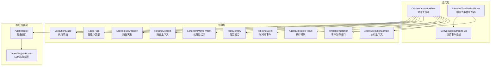
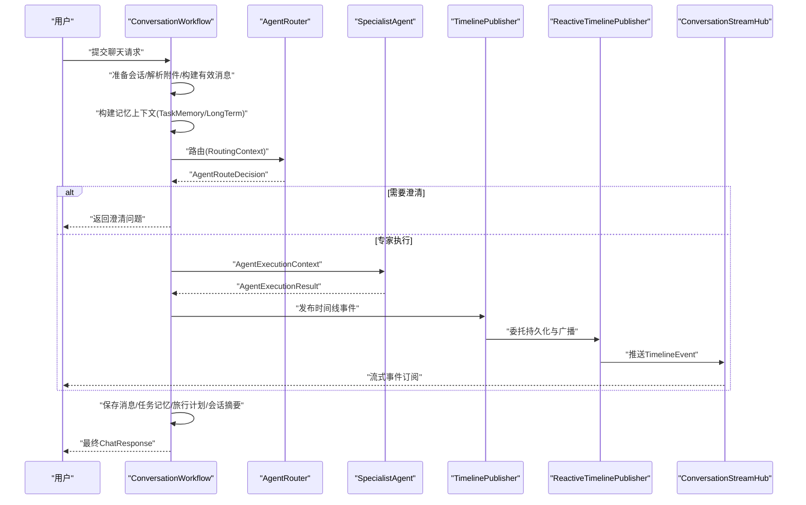
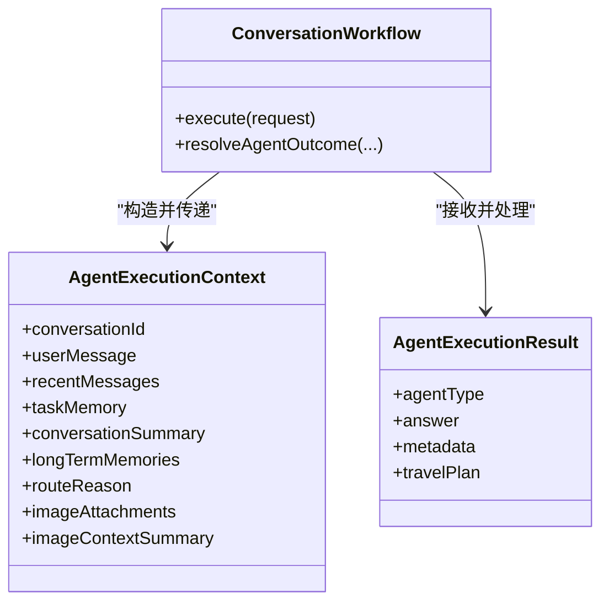
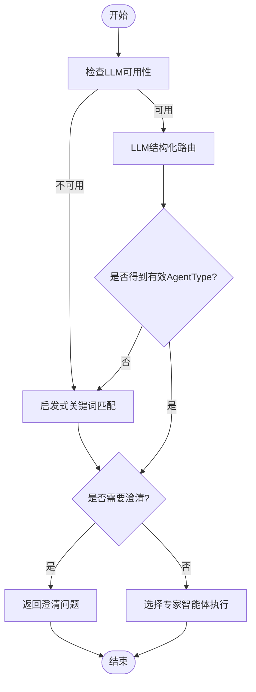
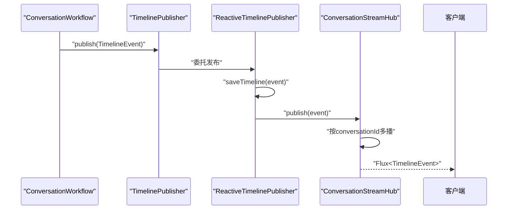
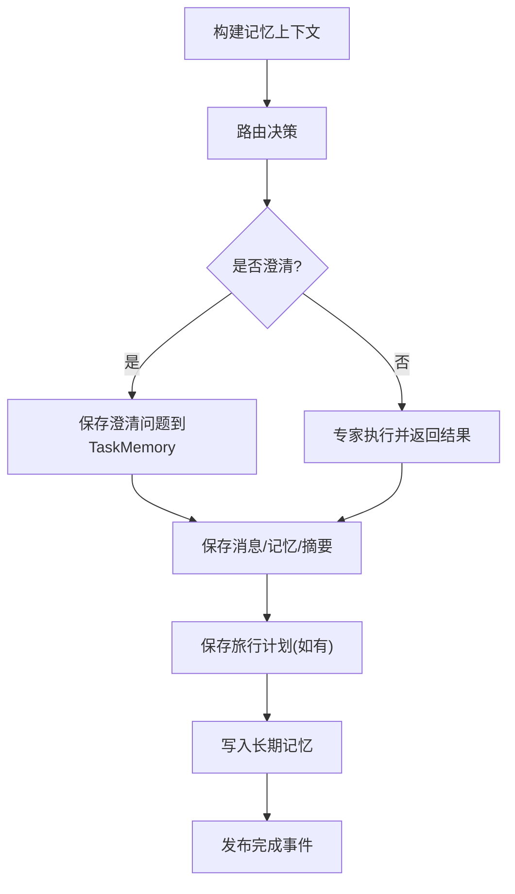
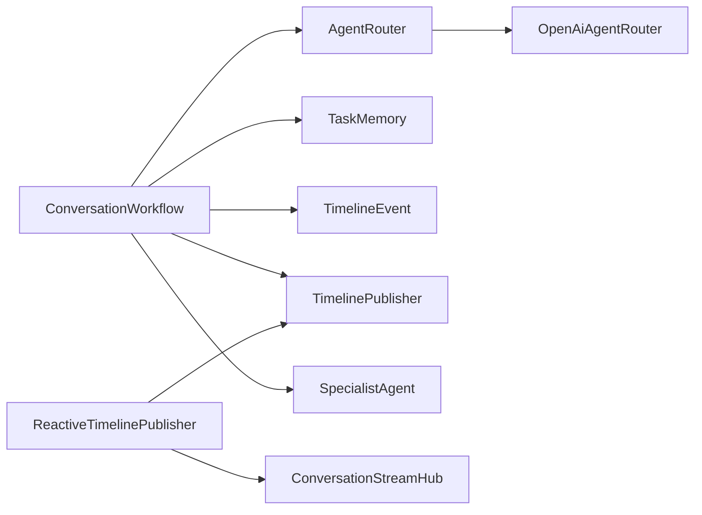

# 智能体协作机制

<cite>
**本文引用的文件**
- [AgentExecutionContext.java](file://travel-agent-domain/src/main/java/com/travalagent/domain/model/valobj/AgentExecutionContext.java)
- [AgentExecutionResult.java](file://travel-agent-domain/src/main/java/com/travalagent/domain/model/valobj/AgentExecutionResult.java)
- [AgentRouteDecision.java](file://travel-agent-domain/src/main/java/com/travalagent/domain/model/valobj/AgentRouteDecision.java)
- [RoutingContext.java](file://travel-agent-domain/src/main/java/com/travalagent/domain/model/valobj/RoutingContext.java)
- [AgentType.java](file://travel-agent-domain/src/main/java/com/travalagent/domain/model/valobj/AgentType.java)
- [ExecutionStage.java](file://travel-agent-domain/src/main/java/com/travalagent/domain/model/valobj/ExecutionStage.java)
- [TimelinePublisher.java](file://travel-agent-domain/src/main/java/com/travalagent/domain/event/TimelinePublisher.java)
- [TimelineEvent.java](file://travel-agent-domain/src/main/java/com/travalagent/domain/model/entity/TimelineEvent.java)
- [TaskMemory.java](file://travel-agent-domain/src/main/java/com/travalagent/domain/model/entity/TaskMemory.java)
- [LongTermMemoryItem.java](file://travel-agent-domain/src/main/java/com/travalagent/domain/model/valobj/LongTermMemoryItem.java)
- [AgentRouter.java](file://travel-agent-domain/src/main/java/com/travalagent/domain/service/AgentRouter.java)
- [OpenAiAgentRouter.java](file://travel-agent-infrastructure/src/main/java/com/travalagent/infrastructure/gateway/llm/OpenAiAgentRouter.java)
- [ConversationStreamHub.java](file://travel-agent-app/src/main/java/com/travalagent/app/stream/ConversationStreamHub.java)
- [ReactiveTimelinePublisher.java](file://travel-agent-app/src/main/java/com/travalagent/app/stream/ReactiveTimelinePublisher.java)
- [ConversationWorkflow.java](file://travel-agent-app/src/main/java/com/travalagent/app/service/ConversationWorkflow.java)
</cite>

## 目录
1. [引言](#引言)
2. [项目结构](#项目结构)
3. [核心组件](#核心组件)
4. [架构总览](#架构总览)
5. [详细组件分析](#详细组件分析)
6. [依赖关系分析](#依赖关系分析)
7. [性能考虑](#性能考虑)
8. [故障排查指南](#故障排查指南)
9. [结论](#结论)
10. [附录](#附录)

## 引言
本文件面向TravelAgent项目的智能体协作机制，系统性阐述多智能体之间的通信协议与协作流程，重点说明以下方面：
- 执行上下文AgentExecutionContext如何承载对话状态与任务记忆，驱动智能体执行
- 执行结果AgentExecutionResult如何在协作中进行传递与整合
- 时间线事件发布系统TimelinePublisher与流式传输ConversationStreamHub的实现原理
- 协作过程中的状态管理、结果整合与错误传播机制
- 多智能体协同的调度策略与性能优化方案

## 项目结构
TravelAgent采用分层架构：应用层负责对话编排与流式输出；领域层定义智能体协作的核心数据模型与事件；基础设施层提供具体路由与工具调用能力。

**图表来源**
- [ConversationWorkflow.java:106-160](file://travel-agent-app/src/main/java/com/travalagent/app/service/ConversationWorkflow.java#L106-L160)
- [ConversationStreamHub.java:12-32](file://travel-agent-app/src/main/java/com/travalagent/app/stream/ConversationStreamHub.java#L12-L32)
- [ReactiveTimelinePublisher.java:9-27](file://travel-agent-app/src/main/java/com/travalagent/app/stream/ReactiveTimelinePublisher.java#L9-L27)
- [AgentExecutionContext.java:8-37](file://travel-agent-domain/src/main/java/com/travalagent/domain/model/valobj/AgentExecutionContext.java#L8-L37)
- [AgentExecutionResult.java:7-12](file://travel-agent-domain/src/main/java/com/travalagent/domain/model/valobj/AgentExecutionResult.java#L7-L12)
- [TimelinePublisher.java:5-8](file://travel-agent-domain/src/main/java/com/travalagent/domain/event/TimelinePublisher.java#L5-L8)
- [TimelineEvent.java:9-32](file://travel-agent-domain/src/main/java/com/travalagent/domain/model/entity/TimelineEvent.java#L9-L32)
- [TaskMemory.java:9-19](file://travel-agent-domain/src/main/java/com/travalagent/domain/model/entity/TaskMemory.java#L9-L19)
- [LongTermMemoryItem.java:6-13](file://travel-agent-domain/src/main/java/com/travalagent/domain/model/valobj/LongTermMemoryItem.java#L6-L13)
- [RoutingContext.java:8-16](file://travel-agent-domain/src/main/java/com/travalagent/domain/model/valobj/RoutingContext.java#L8-L16)
- [AgentRouteDecision.java:3-8](file://travel-agent-domain/src/main/java/com/travalagent/domain/model/valobj/AgentRouteDecision.java#L3-L8)
- [AgentType.java:3-8](file://travel-agent-domain/src/main/java/com/travalagent/domain/model/valobj/AgentType.java#L3-L8)
- [ExecutionStage.java:3-13](file://travel-agent-domain/src/main/java/com/travalagent/domain/model/valobj/ExecutionStage.java#L3-L13)
- [AgentRouter.java:6-9](file://travel-agent-domain/src/main/java/com/travalagent/domain/service/AgentRouter.java#L6-L9)
- [OpenAiAgentRouter.java:13-72](file://travel-agent-infrastructure/src/main/java/com/travalagent/infrastructure/gateway/llm/OpenAiAgentRouter.java#L13-L72)

**章节来源**
- [ConversationWorkflow.java:106-160](file://travel-agent-app/src/main/java/com/travalagent/app/service/ConversationWorkflow.java#L106-L160)
- [ConversationStreamHub.java:12-32](file://travel-agent-app/src/main/java/com/travalagent/app/stream/ConversationStreamHub.java#L12-L32)
- [ReactiveTimelinePublisher.java:9-27](file://travel-agent-app/src/main/java/com/travalagent/app/stream/ReactiveTimelinePublisher.java#L9-L27)
- [AgentExecutionContext.java:8-37](file://travel-agent-domain/src/main/java/com/travalagent/domain/model/valobj/AgentExecutionContext.java#L8-L37)
- [AgentExecutionResult.java:7-12](file://travel-agent-domain/src/main/java/com/travalagent/domain/model/valobj/AgentExecutionResult.java#L7-L12)
- [TimelinePublisher.java:5-8](file://travel-agent-domain/src/main/java/com/travalagent/domain/event/TimelinePublisher.java#L5-L8)
- [TimelineEvent.java:9-32](file://travel-agent-domain/src/main/java/com/travalagent/domain/model/entity/TimelineEvent.java#L9-L32)
- [TaskMemory.java:9-19](file://travel-agent-domain/src/main/java/com/travalagent/domain/model/entity/TaskMemory.java#L9-L19)
- [LongTermMemoryItem.java:6-13](file://travel-agent-domain/src/main/java/com/travalagent/domain/model/valobj/LongTermMemoryItem.java#L6-L13)
- [RoutingContext.java:8-16](file://travel-agent-domain/src/main/java/com/travalagent/domain/model/valobj/RoutingContext.java#L8-L16)
- [AgentRouteDecision.java:3-8](file://travel-agent-domain/src/main/java/com/travalagent/domain/model/valobj/AgentRouteDecision.java#L3-L8)
- [AgentType.java:3-8](file://travel-agent-domain/src/main/java/com/travalagent/domain/model/valobj/AgentType.java#L3-L8)
- [ExecutionStage.java:3-13](file://travel-agent-domain/src/main/java/com/travalagent/domain/model/valobj/ExecutionStage.java#L3-L13)
- [AgentRouter.java:6-9](file://travel-agent-domain/src/main/java/com/travalagent/domain/service/AgentRouter.java#L6-L9)
- [OpenAiAgentRouter.java:13-72](file://travel-agent-infrastructure/src/main/java/com/travalagent/infrastructure/gateway/llm/OpenAiAgentRouter.java#L13-L72)

## 核心组件
- 执行上下文AgentExecutionContext：封装一次智能体执行所需的所有输入，包括会话ID、用户消息、近期消息窗口、任务记忆、会话摘要、长期记忆片段、路由原因、图片附件及图片上下文摘要。构造时对集合字段进行不可变拷贝，确保线程安全与一致性。
- 执行结果AgentExecutionResult：封装智能体的输出答案、附加元数据以及可能生成的旅行计划，作为协作结果的载体。
- 路由上下文RoutingContext与路由决策AgentRouteDecision：前者聚合会话与记忆信息，后者给出目标智能体类型、是否需要澄清及澄清问题。
- 事件与时间线TimelineEvent与TimelinePublisher：事件记录执行阶段、消息与详情，发布器负责持久化与流式广播。
- 流式传输ConversationStreamHub：基于Reactor Sink的多播缓冲，按会话ID分发事件流，支持背压与完成信号。
- 工作流ConversationWorkflow：编排从准备会话、构建记忆、路由选择、专家智能体执行到结果落库与总结的完整流程。

**章节来源**
- [AgentExecutionContext.java:8-37](file://travel-agent-domain/src/main/java/com/travalagent/domain/model/valobj/AgentExecutionContext.java#L8-L37)
- [AgentExecutionResult.java:7-12](file://travel-agent-domain/src/main/java/com/travalagent/domain/model/valobj/AgentExecutionResult.java#L7-L12)
- [RoutingContext.java:8-16](file://travel-agent-domain/src/main/java/com/travalagent/domain/model/valobj/RoutingContext.java#L8-L16)
- [AgentRouteDecision.java:3-8](file://travel-agent-domain/src/main/java/com/travalagent/domain/model/valobj/AgentRouteDecision.java#L3-L8)
- [TimelineEvent.java:9-32](file://travel-agent-domain/src/main/java/com/travalagent/domain/model/entity/TimelineEvent.java#L9-L32)
- [TimelinePublisher.java:5-8](file://travel-agent-domain/src/main/java/com/travalagent/domain/event/TimelinePublisher.java#L5-L8)
- [ConversationStreamHub.java:12-32](file://travel-agent-app/src/main/java/com/travalagent/app/stream/ConversationStreamHub.java#L12-L32)
- [ReactiveTimelinePublisher.java:9-27](file://travel-agent-app/src/main/java/com/travalagent/app/stream/ReactiveTimelinePublisher.java#L9-L27)
- [ConversationWorkflow.java:106-160](file://travel-agent-app/src/main/java/com/travalagent/app/service/ConversationWorkflow.java#L106-L160)

## 架构总览
下图展示从用户请求到事件流式输出的端到端协作流程，包括路由、记忆、专家智能体执行与结果整合。

**图表来源**
- [ConversationWorkflow.java:106-160](file://travel-agent-app/src/main/java/com/travalagent/app/service/ConversationWorkflow.java#L106-L160)
- [OpenAiAgentRouter.java:29-72](file://travel-agent-infrastructure/src/main/java/com/travalagent/infrastructure/gateway/llm/OpenAiAgentRouter.java#L29-L72)
- [ReactiveTimelinePublisher.java:22-26](file://travel-agent-app/src/main/java/com/travalagent/app/stream/ReactiveTimelinePublisher.java#L22-L26)
- [ConversationStreamHub.java:16-24](file://travel-agent-app/src/main/java/com/travalagent/app/stream/ConversationStreamHub.java#L16-L24)

## 详细组件分析

### 执行上下文与结果传递
- AgentExecutionContext作为“输入容器”，将会话、记忆、图片等上下文一次性注入专家智能体，避免多次查询与状态分散。
- AgentExecutionResult作为“输出容器”，统一承载答案、元数据与旅行计划，便于上层进行结果整合与落库。
- 工作流在路由后根据决策选择专家智能体，传入上下文并接收结果，随后进入结果落库与总结阶段。

**图表来源**
- [AgentExecutionContext.java:8-37](file://travel-agent-domain/src/main/java/com/travalagent/domain/model/valobj/AgentExecutionContext.java#L8-L37)
- [AgentExecutionResult.java:7-12](file://travel-agent-domain/src/main/java/com/travalagent/domain/model/valobj/AgentExecutionResult.java#L7-L12)
- [ConversationWorkflow.java:375-406](file://travel-agent-app/src/main/java/com/travalagent/app/service/ConversationWorkflow.java#L375-L406)

**章节来源**
- [AgentExecutionContext.java:8-37](file://travel-agent-domain/src/main/java/com/travalagent/domain/model/valobj/AgentExecutionContext.java#L8-L37)
- [AgentExecutionResult.java:7-12](file://travel-agent-domain/src/main/java/com/travalagent/domain/model/valobj/AgentExecutionResult.java#L7-L12)
- [ConversationWorkflow.java:375-406](file://travel-agent-app/src/main/java/com/travalagent/app/service/ConversationWorkflow.java#L375-L406)

### 路由与调度策略
- 路由接口AgentRouter定义统一入口，OpenAiAgentRouter提供LLM驱动的路由决策，并在不可用或异常时回退到启发式规则。
- 启发式规则基于关键词匹配（中英文）、目的地/天数/预算提示识别，必要时要求最少澄清问题以补齐规划槽位。
- 工作流在收到决策后，若需澄清则直接返回用户；否则选择对应专家智能体执行。

**图表来源**
- [OpenAiAgentRouter.java:29-96](file://travel-agent-infrastructure/src/main/java/com/travalagent/infrastructure/gateway/llm/OpenAiAgentRouter.java#L29-L96)
- [AgentRouter.java:6-9](file://travel-agent-domain/src/main/java/com/travalagent/domain/service/AgentRouter.java#L6-L9)
- [ConversationWorkflow.java:348-373](file://travel-agent-app/src/main/java/com/travalagent/app/service/ConversationWorkflow.java#L348-L373)

**章节来源**
- [OpenAiAgentRouter.java:29-96](file://travel-agent-infrastructure/src/main/java/com/travalagent/infrastructure/gateway/llm/OpenAiAgentRouter.java#L29-L96)
- [AgentRouter.java:6-9](file://travel-agent-domain/src/main/java/com/travalagent/domain/service/AgentRouter.java#L6-L9)
- [ConversationWorkflow.java:348-373](file://travel-agent-app/src/main/java/com/travalagent/app/service/ConversationWorkflow.java#L348-L373)

### 时间线事件发布与流式传输
- TimelineEvent记录执行阶段、消息与详情，包含自动生成的唯一ID与时间戳。
- TimelinePublisher为事件发布接口，ReactiveTimelinePublisher实现将事件持久化并推送到ConversationStreamHub。
- ConversationStreamHub按会话ID维护Sinks，使用背压缓冲多播，支持完成信号清理资源。

**图表来源**
- [TimelineEvent.java:18-32](file://travel-agent-domain/src/main/java/com/travalagent/domain/model/entity/TimelineEvent.java#L18-L32)
- [TimelinePublisher.java:5-8](file://travel-agent-domain/src/main/java/com/travalagent/domain/event/TimelinePublisher.java#L5-L8)
- [ReactiveTimelinePublisher.java:22-26](file://travel-agent-app/src/main/java/com/travalagent/app/stream/ReactiveTimelinePublisher.java#L22-L26)
- [ConversationStreamHub.java:16-24](file://travel-agent-app/src/main/java/com/travalagent/app/stream/ConversationStreamHub.java#L16-L24)

**章节来源**
- [TimelineEvent.java:9-32](file://travel-agent-domain/src/main/java/com/travalagent/domain/model/entity/TimelineEvent.java#L9-L32)
- [TimelinePublisher.java:5-8](file://travel-agent-domain/src/main/java/com/travalagent/domain/event/TimelinePublisher.java#L5-L8)
- [ReactiveTimelinePublisher.java:9-27](file://travel-agent-app/src/main/java/com/travalagent/app/stream/ReactiveTimelinePublisher.java#L9-L27)
- [ConversationStreamHub.java:12-32](file://travel-agent-app/src/main/java/com/travalagent/app/stream/ConversationStreamHub.java#L12-L32)

### 状态管理、结果整合与错误传播
- 任务记忆TaskMemory在每次交互后更新，支持合并偏好、目的地、预算等关键槽位，保证跨轮次的一致性。
- 工作流在最终阶段汇总消息、更新任务记忆、保存旅行计划与会话摘要，并写入长期记忆。
- 错误传播通过AppException抛出，结合响应码与国际化提示，确保前端可感知并恢复。

**图表来源**
- [TaskMemory.java:29-44](file://travel-agent-domain/src/main/java/com/travalagent/domain/model/entity/TaskMemory.java#L29-L44)
- [ConversationWorkflow.java:408-486](file://travel-agent-app/src/main/java/com/travalagent/app/service/ConversationWorkflow.java#L408-L486)

**章节来源**
- [TaskMemory.java:9-64](file://travel-agent-domain/src/main/java/com/travalagent/domain/model/entity/TaskMemory.java#L9-L64)
- [ConversationWorkflow.java:408-486](file://travel-agent-app/src/main/java/com/travalagent/app/service/ConversationWorkflow.java#L408-L486)

## 依赖关系分析
- 应用层依赖领域层的数据模型与事件接口，同时依赖基础设施层的具体路由实现。
- ReactiveTimelinePublisher耦合ConversationRepository与ConversationStreamHub，形成事件持久化与流式分发的桥接。
- ConversationWorkflow聚合多个服务（路由、记忆提取、图像解释、专家智能体），体现高内聚低耦合的设计。

**图表来源**
- [ConversationWorkflow.java:74-104](file://travel-agent-app/src/main/java/com/travalagent/app/service/ConversationWorkflow.java#L74-L104)
- [ReactiveTimelinePublisher.java:9-27](file://travel-agent-app/src/main/java/com/travalagent/app/stream/ReactiveTimelinePublisher.java#L9-L27)
- [OpenAiAgentRouter.java:13-27](file://travel-agent-infrastructure/src/main/java/com/travalagent/infrastructure/gateway/llm/OpenAiAgentRouter.java#L13-L27)

**章节来源**
- [ConversationWorkflow.java:74-104](file://travel-agent-app/src/main/java/com/travalagent/app/service/ConversationWorkflow.java#L74-L104)
- [ReactiveTimelinePublisher.java:9-27](file://travel-agent-app/src/main/java/com/travalagent/app/stream/ReactiveTimelinePublisher.java#L9-L27)
- [OpenAiAgentRouter.java:13-27](file://travel-agent-infrastructure/src/main/java/com/travalagent/infrastructure/gateway/llm/OpenAiAgentRouter.java#L13-L27)

## 性能考虑
- 背压与多播：ConversationStreamHub使用Sinks多播与背压缓冲，避免下游慢导致的内存膨胀与丢弃。
- 事件持久化：ReactiveTimelinePublisher先持久化再广播，确保事件可重放与顺序一致性。
- 记忆窗口与阈值：通过配置控制短期记忆窗口与摘要触发阈值，平衡性能与上下文质量。
- 图像附件限制：对数量、大小与媒体类型进行严格校验，减少无效负载与解析开销。
- 回退策略：LLM不可用时快速切换启发式路由，保障系统可用性。

[本节为通用性能建议，不直接分析具体文件]

## 故障排查指南
- 请求参数校验失败：检查图像附件格式、大小与数量，确认媒体类型与数据URL一致。
- 会话ID缺失：当需要对挂起的图像上下文进行确认或忽略时，必须提供有效的会话ID。
- 路由异常：若LLM路由失败，系统自动回退至启发式规则；可检查日志定位关键词匹配是否覆盖充分。
- 事件未到达：确认ReactiveTimelinePublisher已成功持久化并调用ConversationStreamHub的publish方法；检查会话ID是否正确。

**章节来源**
- [ConversationWorkflow.java:534-575](file://travel-agent-app/src/main/java/com/travalagent/app/service/ConversationWorkflow.java#L534-L575)
- [ConversationWorkflow.java:226-272](file://travel-agent-app/src/main/java/com/travalagent/app/service/ConversationWorkflow.java#L226-L272)
- [OpenAiAgentRouter.java:34-71](file://travel-agent-infrastructure/src/main/java/com/travalagent/infrastructure/gateway/llm/OpenAiAgentRouter.java#L34-L71)
- [ReactiveTimelinePublisher.java:22-26](file://travel-agent-app/src/main/java/com/travalagent/app/stream/ReactiveTimelinePublisher.java#L22-L26)
- [ConversationStreamHub.java:16-19](file://travel-agent-app/src/main/java/com/travalagent/app/stream/ConversationStreamHub.java#L16-L19)

## 结论
TravelAgent通过清晰的执行上下文与结果模型、可插拔的路由与专家智能体、以及事件驱动的时间线发布与流式传输，实现了高内聚、可扩展且可观测的智能体协作机制。工作流在状态管理、结果整合与错误传播方面具备完善的闭环设计，配合背压与多播等性能优化手段，能够稳定支撑多轮次、多模态的旅行规划场景。

[本节为总结性内容，不直接分析具体文件]

## 附录
- 关键枚举与类型
  - 智能体类型：WEATHER、GEO、TRAVEL_PLANNER、GENERAL
  - 执行阶段：ANALYZE_QUERY、RECALL_MEMORY、SELECT_AGENT、SPECIALIST、CALL_TOOL、VALIDATE_PLAN、REPAIR_PLAN、FINALIZE_MEMORY、COMPLETED、ERROR
- 数据模型要点
  - AgentExecutionContext：不可变集合拷贝，确保线程安全
  - TaskMemory：合并策略优先候选值，偏好去重保留顺序
  - TimelineEvent：自动生成ID与时间戳，便于排序与追踪

**章节来源**
- [AgentType.java:3-8](file://travel-agent-domain/src/main/java/com/travalagent/domain/model/valobj/AgentType.java#L3-L8)
- [ExecutionStage.java:3-13](file://travel-agent-domain/src/main/java/com/travalagent/domain/model/valobj/ExecutionStage.java#L3-L13)
- [AgentExecutionContext.java:20-24](file://travel-agent-domain/src/main/java/com/travalagent/domain/model/valobj/AgentExecutionContext.java#L20-L24)
- [TaskMemory.java:29-44](file://travel-agent-domain/src/main/java/com/travalagent/domain/model/entity/TaskMemory.java#L29-L44)
- [TimelineEvent.java:18-32](file://travel-agent-domain/src/main/java/com/travalagent/domain/model/entity/TimelineEvent.java#L18-L32)