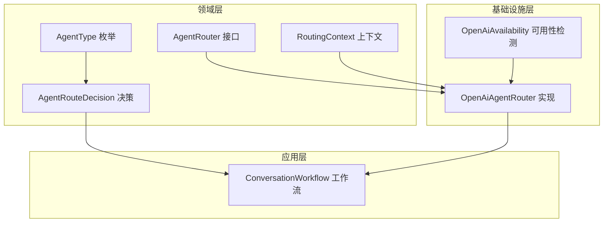
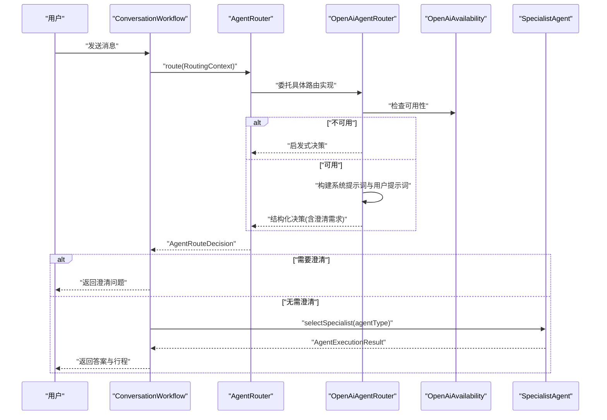
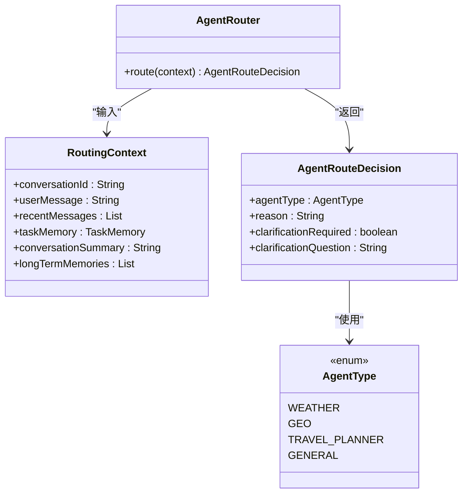
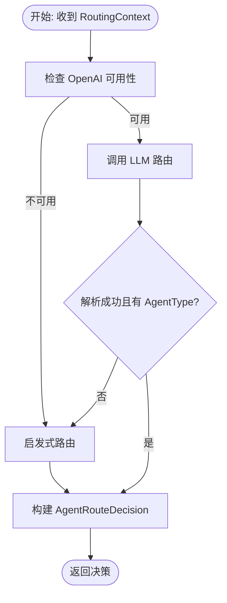
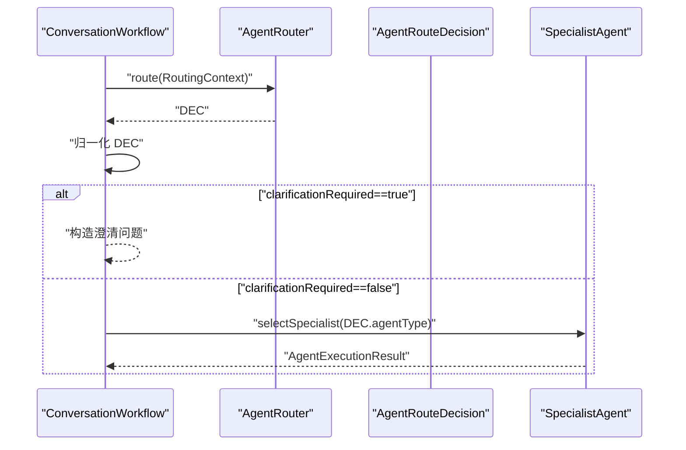
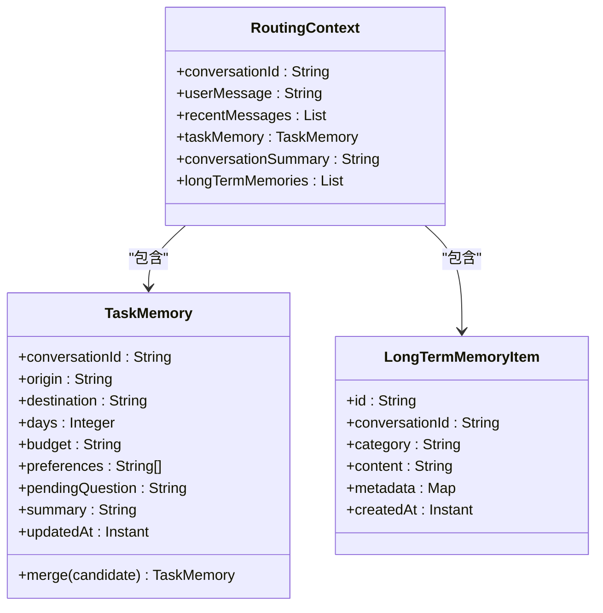
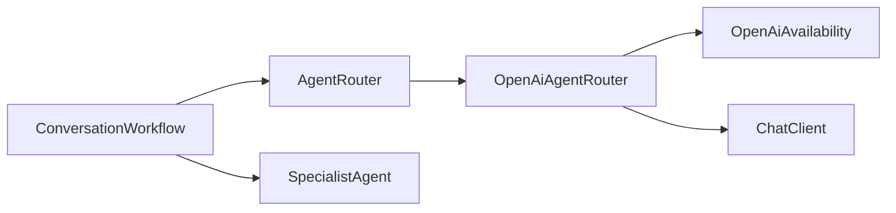

# 智能体路由系统

<cite>
**本文引用的文件**
- [AgentRouter.java](file://travel-agent-domain/src/main/java/com/travalagent/domain/service/AgentRouter.java)
- [RoutingContext.java](file://travel-agent-domain/src/main/java/com/travalagent/domain/model/valobj/RoutingContext.java)
- [AgentRouteDecision.java](file://travel-agent-domain/src/main/java/com/travalagent/domain/model/valobj/AgentRouteDecision.java)
- [AgentType.java](file://travel-agent-domain/src/main/java/com/travalagent/domain/model/valobj/AgentType.java)
- [OpenAiAgentRouter.java](file://travel-agent-infrastructure/src/main/java/com/travalagent/infrastructure/gateway/llm/OpenAiAgentRouter.java)
- [OpenAiAvailability.java](file://travel-agent-infrastructure/src/main/java/com/travalagent/infrastructure/gateway/llm/OpenAiAvailability.java)
- [ConversationWorkflow.java](file://travel-agent-app/src/main/java/com/travalagent/app/service/ConversationWorkflow.java)
- [application.yml](file://travel-agent-app/src/main/resources/application.yml)
- [TravelAgentApplication.java](file://travel-agent-app/src/main/java/com/travalagent/app/TravelAgentApplication.java)
- [SpecialistAgent.java](file://travel-agent-domain/src/main/java/com/travalagent/domain/service/SpecialistAgent.java)
- [TaskMemory.java](file://travel-agent-domain/src/main/java/com/travalagent/domain/model/entity/TaskMemory.java)
- [LongTermMemoryItem.java](file://travel-agent-domain/src/main/java/com/travalagent/domain/model/valobj/LongTermMemoryItem.java)
- [ConversationWorkflowTest.java](file://travel-agent-app/src/test/java/com/travalagent/app/service/ConversationWorkflowTest.java)
</cite>

## 目录
1. [简介](#简介)
2. [项目结构](#项目结构)
3. [核心组件](#核心组件)
4. [架构总览](#架构总览)
5. [详细组件分析](#详细组件分析)
6. [依赖分析](#依赖分析)
7. [性能考虑](#性能考虑)
8. [故障排查指南](#故障排查指南)
9. [结论](#结论)
10. [附录](#附录)

## 简介
本文件面向TravelAgent项目的“智能体路由系统”，系统性阐述AgentRouter接口的设计原理与实现机制，解析RoutingContext上下文的作用边界、AgentRouteDecision决策结果的结构化表达；重点剖析OpenAiAgentRouter的具体实现，包括其基于规则与关键词的路由决策算法、回退启发式策略、缺失信息澄清机制以及可用性检测逻辑；并给出路由系统的扩展性设计思路（如何接入新路由算法与智能体类型）、配置与调试最佳实践。

## 项目结构
路由系统横跨领域层与基础设施层，并在应用层被工作流编排调用：
- 领域层定义路由接口、上下文与决策数据模型
- 基础设施层提供具体路由实现（当前为OpenAI驱动）
- 应用层在对话工作流中组装上下文并触发路由与后续执行

图表来源
- [AgentRouter.java:1-10](file://travel-agent-domain/src/main/java/com/travalagent/domain/service/AgentRouter.java#L1-L10)
- [RoutingContext.java:1-17](file://travel-agent-domain/src/main/java/com/travalagent/domain/model/valobj/RoutingContext.java#L1-L17)
- [AgentRouteDecision.java:1-10](file://travel-agent-domain/src/main/java/com/travalagent/domain/model/valobj/AgentRouteDecision.java#L1-L10)
- [AgentType.java:1-9](file://travel-agent-domain/src/main/java/com/travalagent/domain/model/valobj/AgentType.java#L1-L9)
- [OpenAiAgentRouter.java:1-145](file://travel-agent-infrastructure/src/main/java/com/travalagent/infrastructure/gateway/llm/OpenAiAgentRouter.java#L1-L145)
- [OpenAiAvailability.java:1-24](file://travel-agent-infrastructure/src/main/java/com/travalagent/infrastructure/gateway/llm/OpenAiAvailability.java#L1-L24)
- [ConversationWorkflow.java:345-406](file://travel-agent-app/src/main/java/com/travalagent/app/service/ConversationWorkflow.java#L345-L406)

章节来源
- [AgentRouter.java:1-10](file://travel-agent-domain/src/main/java/com/travalagent/domain/service/AgentRouter.java#L1-L10)
- [RoutingContext.java:1-17](file://travel-agent-domain/src/main/java/com/travalagent/domain/model/valobj/RoutingContext.java#L1-L17)
- [AgentRouteDecision.java:1-10](file://travel-agent-domain/src/main/java/com/travalagent/domain/model/valobj/AgentRouteDecision.java#L1-L10)
- [AgentType.java:1-9](file://travel-agent-domain/src/main/java/com/travalagent/domain/model/valobj/AgentType.java#L1-L9)
- [OpenAiAgentRouter.java:1-145](file://travel-agent-infrastructure/src/main/java/com/travalagent/infrastructure/gateway/llm/OpenAiAgentRouter.java#L1-L145)
- [OpenAiAvailability.java:1-24](file://travel-agent-infrastructure/src/main/java/com/travalagent/infrastructure/gateway/llm/OpenAiAvailability.java#L1-L24)
- [ConversationWorkflow.java:345-406](file://travel-agent-app/src/main/java/com/travalagent/app/service/ConversationWorkflow.java#L345-L406)

## 核心组件
- AgentRouter接口：定义统一的路由入口，接收RoutingContext并返回AgentRouteDecision
- RoutingContext上下文：封装一次路由所需的全部输入，包括会话标识、用户消息、近期消息、任务记忆、会话摘要、长期记忆片段
- AgentRouteDecision决策：包含目标AgentType、路由原因、是否需要澄清、澄清问题文本
- AgentType枚举：定义可路由的智能体类型集合（WEATHER、GEO、TRAVEL_PLANNER、GENERAL）

章节来源
- [AgentRouter.java:1-10](file://travel-agent-domain/src/main/java/com/travalagent/domain/service/AgentRouter.java#L1-L10)
- [RoutingContext.java:1-17](file://travel-agent-domain/src/main/java/com/travalagent/domain/model/valobj/RoutingContext.java#L1-L17)
- [AgentRouteDecision.java:1-10](file://travel-agent-domain/src/main/java/com/travalagent/domain/model/valobj/AgentRouteDecision.java#L1-L10)
- [AgentType.java:1-9](file://travel-agent-domain/src/main/java/com/travalagent/domain/model/valobj/AgentType.java#L1-L9)

## 架构总览
路由系统采用“接口抽象 + 具体实现 + 工作流编排”的分层设计。应用层在对话处理阶段构造RoutingContext并调用AgentRouter进行路由决策；若决策要求澄清，则以澄清问题形式反馈；否则根据AgentType选择对应SpecialistAgent执行业务逻辑。

图表来源
- [ConversationWorkflow.java:345-406](file://travel-agent-app/src/main/java/com/travalagent/app/service/ConversationWorkflow.java#L345-L406)
- [OpenAiAgentRouter.java:29-72](file://travel-agent-infrastructure/src/main/java/com/travalagent/infrastructure/gateway/llm/OpenAiAgentRouter.java#L29-L72)
- [OpenAiAvailability.java:15-23](file://travel-agent-infrastructure/src/main/java/com/travalagent/infrastructure/gateway/llm/OpenAiAvailability.java#L15-L23)
- [SpecialistAgent.java:1-12](file://travel-agent-domain/src/main/java/com/travalagent/domain/service/SpecialistAgent.java#L1-L12)

## 详细组件分析

### AgentRouter接口与RoutingContext/AgentRouteDecision
- AgentRouter接口仅暴露route方法，职责单一且稳定，便于替换与扩展
- RoutingContext以不可变记录形式承载上下文要素，确保线程安全与可追踪性
- AgentRouteDecision以不可变记录承载决策结果，包含AgentType、原因、澄清标志与澄清问题，便于上层统一处理

图表来源
- [AgentRouter.java:1-10](file://travel-agent-domain/src/main/java/com/travalagent/domain/service/AgentRouter.java#L1-L10)
- [RoutingContext.java:1-17](file://travel-agent-domain/src/main/java/com/travalagent/domain/model/valobj/RoutingContext.java#L1-L17)
- [AgentRouteDecision.java:1-10](file://travel-agent-domain/src/main/java/com/travalagent/domain/model/valobj/AgentRouteDecision.java#L1-L10)
- [AgentType.java:1-9](file://travel-agent-domain/src/main/java/com/travalagent/domain/model/valobj/AgentType.java#L1-L9)

章节来源
- [AgentRouter.java:1-10](file://travel-agent-domain/src/main/java/com/travalagent/domain/service/AgentRouter.java#L1-L10)
- [RoutingContext.java:1-17](file://travel-agent-domain/src/main/java/com/travalagent/domain/model/valobj/RoutingContext.java#L1-L17)
- [AgentRouteDecision.java:1-10](file://travel-agent-domain/src/main/java/com/travalagent/domain/model/valobj/AgentRouteDecision.java#L1-L10)
- [AgentType.java:1-9](file://travel-agent-domain/src/main/java/com/travalagent/domain/model/valobj/AgentType.java#L1-L9)

### OpenAiAgentRouter实现与路由决策算法
- 可用性检测：通过OpenAiAvailability判断API Key是否有效，若不可用则直接进入启发式分支
- LLM路由：构造系统提示词与用户提示词，约束输出格式为结构化数据，明确四类Agent的路由规则与澄清条件
- 启发式回退：当LLM不可用或解析失败时，依据关键词与正则表达式进行启发式路由；对旅行规划请求检测目的地、天数、预算等关键信息，必要时生成最小化澄清问题
- 关键词与正则：针对中文与英文场景分别建立正则模式，覆盖天气、地理、旅行规划等关键词与模式匹配

图表来源
- [OpenAiAgentRouter.java:29-72](file://travel-agent-infrastructure/src/main/java/com/travalagent/infrastructure/gateway/llm/OpenAiAgentRouter.java#L29-L72)
- [OpenAiAvailability.java:15-23](file://travel-agent-infrastructure/src/main/java/com/travalagent/infrastructure/gateway/llm/OpenAiAvailability.java#L15-L23)

章节来源
- [OpenAiAgentRouter.java:1-145](file://travel-agent-infrastructure/src/main/java/com/travalagent/infrastructure/gateway/llm/OpenAiAgentRouter.java#L1-L145)
- [OpenAiAvailability.java:1-24](file://travel-agent-infrastructure/src/main/java/com/travalagent/infrastructure/gateway/llm/OpenAiAvailability.java#L1-L24)

### 应用层工作流中的路由集成
- 工作流在每次对话处理前构造RoutingContext，包含会话ID、用户消息、近期消息、任务记忆、会话摘要与长期记忆片段
- 调用AgentRouter得到AgentRouteDecision后进行归一化处理（空值填充、默认值设定），并向时间轴发布路由事件
- 若决策要求澄清，直接返回澄清问题；否则选择对应SpecialistAgent执行业务并产出最终回答与行程

图表来源
- [ConversationWorkflow.java:345-406](file://travel-agent-app/src/main/java/com/travalagent/app/service/ConversationWorkflow.java#L345-L406)
- [SpecialistAgent.java:1-12](file://travel-agent-domain/src/main/java/com/travalagent/domain/service/SpecialistAgent.java#L1-L12)

章节来源
- [ConversationWorkflow.java:345-406](file://travel-agent-app/src/main/java/com/travalagent/app/service/ConversationWorkflow.java#L345-L406)
- [SpecialistAgent.java:1-12](file://travel-agent-domain/src/main/java/com/travalagent/domain/service/SpecialistAgent.java#L1-L12)

### 数据模型与上下文要素
- RoutingContext：会话标识、用户消息、近期消息列表、任务记忆、会话摘要、长期记忆片段
- TaskMemory：任务记忆，包含出发地、目的地、天数、预算、偏好、待定问题、摘要等字段，并提供合并与去重能力
- LongTermMemoryItem：长期记忆项，包含标识、会话标识、类别、内容、元数据与创建时间

图表来源
- [RoutingContext.java:1-17](file://travel-agent-domain/src/main/java/com/travalagent/domain/model/valobj/RoutingContext.java#L1-L17)
- [TaskMemory.java:1-65](file://travel-agent-domain/src/main/java/com/travalagent/domain/model/entity/TaskMemory.java#L1-L65)
- [LongTermMemoryItem.java:1-15](file://travel-agent-domain/src/main/java/com/travalagent/domain/model/valobj/LongTermMemoryItem.java#L1-L15)

章节来源
- [RoutingContext.java:1-17](file://travel-agent-domain/src/main/java/com/travalagent/domain/model/valobj/RoutingContext.java#L1-L17)
- [TaskMemory.java:1-65](file://travel-agent-domain/src/main/java/com/travalagent/domain/model/entity/TaskMemory.java#L1-L65)
- [LongTermMemoryItem.java:1-15](file://travel-agent-domain/src/main/java/com/travalagent/domain/model/valobj/LongTermMemoryItem.java#L1-L15)

## 依赖分析
- 组件耦合与内聚
  - AgentRouter接口与OpenAiAgentRouter实现解耦，便于替换为其他路由实现（如基于规则或强化学习的实现）
  - OpenAiAgentRouter依赖OpenAiAvailability进行可用性检测，降低外部服务异常对系统的影响
  - ConversationWorkflow依赖AgentRouter进行路由决策，再依赖SpecialistAgent执行具体业务，职责清晰
- 外部依赖与集成点
  - OpenAI ChatClient用于结构化输出解析
  - Spring配置提供API Key、基础URL、模型参数等
  - MCP工具回调与AMap网关作为工具链的一部分，与路由系统协同工作

图表来源
- [ConversationWorkflow.java:345-406](file://travel-agent-app/src/main/java/com/travalagent/app/service/ConversationWorkflow.java#L345-L406)
- [AgentRouter.java:1-10](file://travel-agent-domain/src/main/java/com/travalagent/domain/service/AgentRouter.java#L1-L10)
- [OpenAiAgentRouter.java:1-145](file://travel-agent-infrastructure/src/main/java/com/travalagent/infrastructure/gateway/llm/OpenAiAgentRouter.java#L1-L145)
- [OpenAiAvailability.java:1-24](file://travel-agent-infrastructure/src/main/java/com/travalagent/infrastructure/gateway/llm/OpenAiAvailability.java#L1-L24)
- [SpecialistAgent.java:1-12](file://travel-agent-domain/src/main/java/com/travalagent/domain/service/SpecialistAgent.java#L1-L12)

章节来源
- [ConversationWorkflow.java:345-406](file://travel-agent-app/src/main/java/com/travalagent/app/service/ConversationWorkflow.java#L345-L406)
- [AgentRouter.java:1-10](file://travel-agent-domain/src/main/java/com/travalagent/domain/service/AgentRouter.java#L1-L10)
- [OpenAiAgentRouter.java:1-145](file://travel-agent-infrastructure/src/main/java/com/travalagent/infrastructure/gateway/llm/OpenAiAgentRouter.java#L1-L145)
- [OpenAiAvailability.java:1-24](file://travel-agent-infrastructure/src/main/java/com/travalagent/infrastructure/gateway/llm/OpenAiAvailability.java#L1-L24)
- [SpecialistAgent.java:1-12](file://travel-agent-domain/src/main/java/com/travalagent/domain/service/SpecialistAgent.java#L1-L12)

## 性能考虑
- LLM调用成本控制
  - 通过OpenAiAvailability进行快速可用性检查，避免无效调用
  - 在LLM不可用时走启发式路径，减少外部依赖带来的延迟与失败风险
- 上下文裁剪与压缩
  - 使用会话摘要与长期记忆片段，避免将全量历史注入到路由提示词中
  - 控制近期消息窗口大小，平衡上下文完整性与提示词长度
- 结构化输出解析
  - 明确要求LLM返回结构化数据，减少后处理与解析开销
- 缓存与降级
  - 对于频繁出现的澄清问题，可在应用层缓存典型问题模板，减少重复生成

## 故障排查指南
- 常见问题定位
  - OpenAI不可用：确认API Key配置正确且非占位符；检查基础URL与网络连通性
  - LLM路由失败：关注系统提示词是否被污染、用户提示词是否过长；验证结构化输出解析是否成功
  - 决策为空：ConversationWorkflow对空决策进行归一化处理，若仍异常，检查AgentRouter实现与上下文构造
- 调试建议
  - 在应用层开启路由事件发布，观察“SELECT_AGENT”阶段的agent与reason
  - 使用测试用例模拟不同场景（天气、地理、旅行规划、模糊请求），验证路由与澄清逻辑
  - 在ConversationWorkflow中增加日志记录，打印RoutingContext关键字段与AgentRouteDecision

章节来源
- [OpenAiAvailability.java:1-24](file://travel-agent-infrastructure/src/main/java/com/travalagent/infrastructure/gateway/llm/OpenAiAvailability.java#L1-L24)
- [OpenAiAgentRouter.java:29-72](file://travel-agent-infrastructure/src/main/java/com/travalagent/infrastructure/gateway/llm/OpenAiAgentRouter.java#L29-L72)
- [ConversationWorkflow.java:345-406](file://travel-agent-app/src/main/java/com/travalagent/app/service/ConversationWorkflow.java#L345-L406)
- [ConversationWorkflowTest.java:1-200](file://travel-agent-app/src/test/java/com/travalagent/app/service/ConversationWorkflowTest.java#L1-L200)

## 结论
本路由系统以简洁稳定的接口抽象为基础，结合LLM结构化输出与启发式回退策略，实现了对旅行助手场景的高效路由。通过上下文模型化与决策结果标准化，系统具备良好的可扩展性与可维护性。未来可在保持接口不变的前提下，接入更多路由算法与智能体类型，并通过配置与测试保障稳定性与一致性。

## 附录

### 扩展性设计：新增路由算法与智能体类型
- 新增路由算法
  - 实现AgentRouter接口，按需使用RoutingContext中的字段进行决策；在不可用或解析失败时提供回退策略
  - 将新实现注册为Spring组件，替换默认实现或通过条件装配启用
- 新增智能体类型
  - 在AgentType枚举中添加新类型
  - 在SpecialistAgent注册表中绑定新类型的专用Agent
  - 在AgentRouter的系统提示词中明确新类型的路由规则与澄清条件

章节来源
- [AgentRouter.java:1-10](file://travel-agent-domain/src/main/java/com/travalagent/domain/service/AgentRouter.java#L1-L10)
- [AgentType.java:1-9](file://travel-agent-domain/src/main/java/com/travalagent/domain/model/valobj/AgentType.java#L1-L9)
- [SpecialistAgent.java:1-12](file://travel-agent-domain/src/main/java/com/travalagent/domain/service/SpecialistAgent.java#L1-L12)

### 配置与调试最佳实践
- 配置要点
  - OpenAI API Key与基础URL、模型参数在应用配置中集中管理
  - MCP工具回调与AMap网关的启用开关与超时参数应按环境调整
  - 会话记忆窗口与摘要阈值影响路由上下文规模，需结合业务负载调优
- 调试建议
  - 在ConversationWorkflow中记录路由阶段事件，便于追踪决策来源
  - 使用测试用例覆盖多语言、多意图与澄清场景，确保路由鲁棒性

章节来源
- [application.yml:1-100](file://travel-agent-app/src/main/resources/application.yml#L1-L100)
- [TravelAgentApplication.java:1-15](file://travel-agent-app/src/main/java/com/travalagent/app/TravelAgentApplication.java#L1-L15)
- [ConversationWorkflow.java:345-406](file://travel-agent-app/src/main/java/com/travalagent/app/service/ConversationWorkflow.java#L345-L406)
- [ConversationWorkflowTest.java:1-200](file://travel-agent-app/src/test/java/com/travalagent/app/service/ConversationWorkflowTest.java#L1-L200)