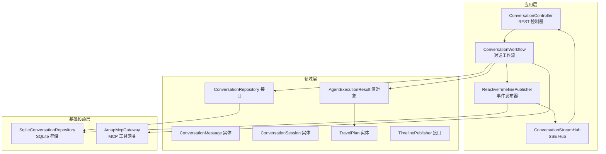
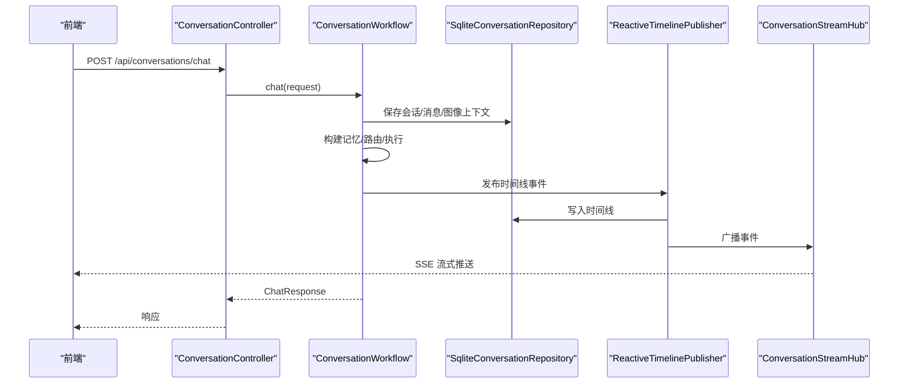
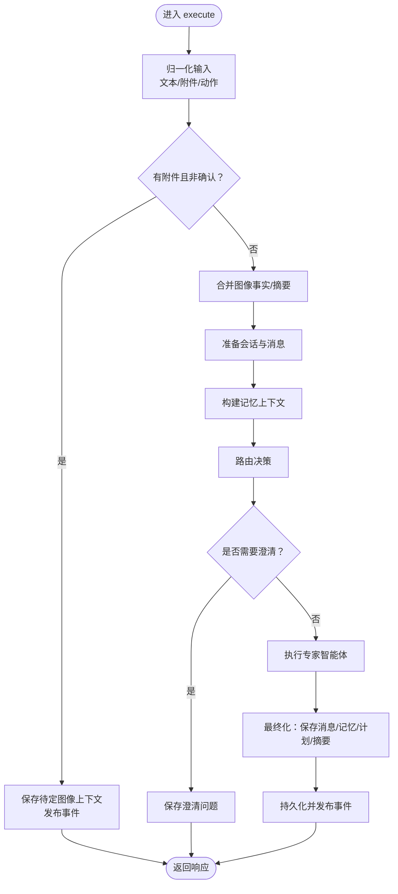
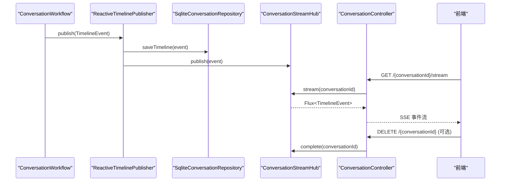
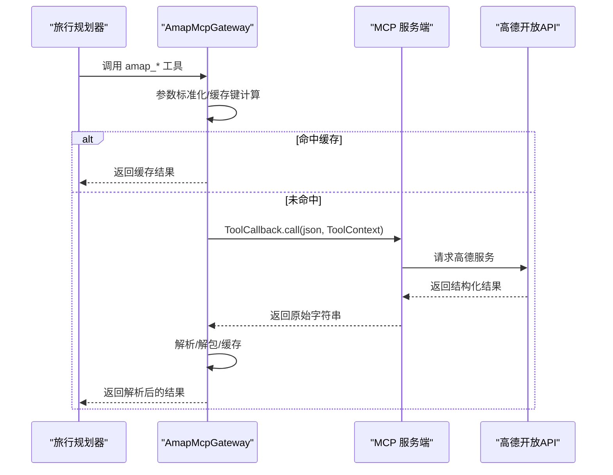
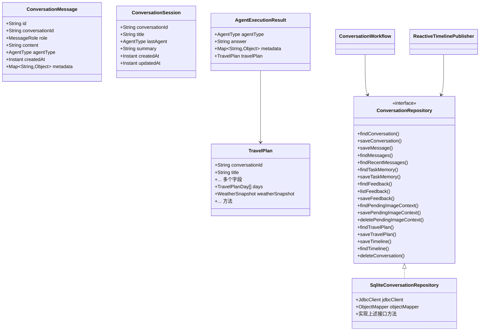
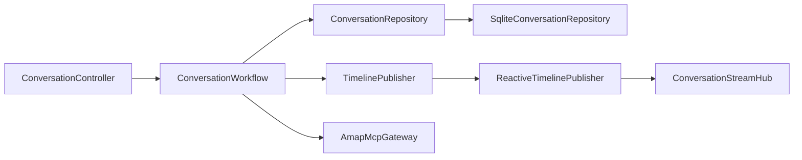

# 数据流设计

<cite>
**本文引用的文件**
- [runtime-workflow.drawio](file://docs/assets/travelagent-runtime-workflow.drawio)
- [ConversationWorkflow.java](file://travel-agent-app/src/main/java/com/travalagent/app/service/ConversationWorkflow.java)
- [ConversationController.java](file://travel-agent-app/src/main/java/com/travalagent/app/controller/ConversationController.java)
- [ConversationStreamHub.java](file://travel-agent-app/src/main/java/com/travalagent/app/stream/ConversationStreamHub.java)
- [ReactiveTimelinePublisher.java](file://travel-agent-app/src/main/java/com/travalagent/app/stream/ReactiveTimelinePublisher.java)
- [TimelinePublisher.java](file://travel-agent-domain/src/main/java/com/travalagent/domain/event/TimelinePublisher.java)
- [ConversationMessage.java](file://travel-agent-domain/src/main/java/com/travalagent/domain/model/entity/ConversationMessage.java)
- [ConversationSession.java](file://travel-agent-domain/src/main/java/com/travalagent/domain/model/entity/ConversationSession.java)
- [TravelPlan.java](file://travel-agent-domain/src/main/java/com/travalagent/domain/model/entity/TravelPlan.java)
- [AgentExecutionResult.java](file://travel-agent-domain/src/main/java/com/travalagent/domain/model/valobj/AgentExecutionResult.java)
- [ConversationRepository.java](file://travel-agent-domain/src/main/java/com/travalagent/domain/repository/ConversationRepository.java)
- [SqliteConversationRepository.java](file://travel-agent-infrastructure/src/main/java/com/travalagent/infrastructure/repository/SqliteConversationRepository.java)
- [AmapMcpGateway.java](file://travel-agent-infrastructure/src/main/java/com/travalagent/infrastructure/gateway/tool/AmapMcpGateway.java)
</cite>

## 目录
1. [引言](#引言)
2. [项目结构](#项目结构)
3. [核心组件](#核心组件)
4. [架构总览](#架构总览)
5. [详细组件分析](#详细组件分析)
6. [依赖分析](#依赖分析)
7. [性能考量](#性能考量)
8. [故障排查指南](#故障排查指南)
9. [结论](#结论)
10. [附录](#附录)

## 引言
本文件面向TravelAgent项目的“数据流设计”，聚焦从用户输入到最终输出的完整数据流转过程，结合运行时工作流图（Runtime Workflow）与代码实现，系统化说明以下关键点：
- 待定图像上下文的处理：保存、确认/忽略、重建消息内容与记忆上下文。
- 智能体选择与路由：基于最近消息、任务记忆、摘要与长程记忆的决策。
- 专家智能体执行与工具调用：旅行规划器的多阶段执行、Amap工具链切换（本地HTTP或MCP侧车）。
- 数据增强：图像事实抽取、目的地知识检索、天气与约束校验。
- 实时数据流：SSE流式传输、时间线事件发布、前端实时更新。
- 数据持久化：会话状态、任务记忆、长期记忆、知识检索与反馈数据的存储策略与时序。

## 项目结构
TravelAgent采用分层架构：应用层负责控制器与工作流编排；领域层定义实体、值对象与接口契约；基础设施层提供数据库访问与外部网关集成。运行时工作流图直观展示了端到端的数据通路与组件交互。

**图示来源**
- [ConversationController.java:47-99](file://travel-agent-app/src/main/java/com/travalagent/app/controller/ConversationController.java#L47-L99)
- [ConversationWorkflow.java:106-160](file://travel-agent-app/src/main/java/com/travalagent/app/service/ConversationWorkflow.java#L106-L160)
- [ReactiveTimelinePublisher.java:22-26](file://travel-agent-app/src/main/java/com/travalagent/app/stream/ReactiveTimelinePublisher.java#L22-L26)
- [SqliteConversationRepository.java:80-326](file://travel-agent-infrastructure/src/main/java/com/travalagent/infrastructure/repository/SqliteConversationRepository.java#L80-L326)
- [AmapMcpGateway.java:49-123](file://travel-agent-infrastructure/src/main/java/com/travalagent/infrastructure/gateway/tool/AmapMcpGateway.java#L49-L123)

**章节来源**
- [runtime-workflow.drawio:1-182](file://docs/assets/travelagent-runtime-workflow.drawio#L1-L182)

## 核心组件
- ConversationController：暴露聊天、详情、反馈、删除与SSE流式接口，负责请求接入与响应封装。
- ConversationWorkflow：编排对话生命周期，处理图像上下文、构建记忆、路由与执行、最终落库与事件发布。
- ReactiveTimelinePublisher：统一将时间线事件写入数据库并广播至SSE Hub。
- ConversationStreamHub：基于Reactor Sink的多播通道，支持背压缓冲与连接清理。
- SqliteConversationRepository：实现会话、消息、任务记忆、旅行计划、时间线与长期记忆的持久化。
- AmapMcpGateway：封装Amap工具调用，支持缓存、节流与结果解析，适配LOCAL/MCP两种路径。

**章节来源**
- [ConversationController.java:32-101](file://travel-agent-app/src/main/java/com/travalagent/app/controller/ConversationController.java#L32-L101)
- [ConversationWorkflow.java:50-104](file://travel-agent-app/src/main/java/com/travalagent/app/service/ConversationWorkflow.java#L50-L104)
- [ReactiveTimelinePublisher.java:8-27](file://travel-agent-app/src/main/java/com/travalagent/app/stream/ReactiveTimelinePublisher.java#L8-L27)
- [ConversationStreamHub.java:11-33](file://travel-agent-app/src/main/java/com/travalagent/app/stream/ConversationStreamHub.java#L11-L33)
- [SqliteConversationRepository.java:36-580](file://travel-agent-infrastructure/src/main/java/com/travalagent/infrastructure/repository/SqliteConversationRepository.java#L36-L580)
- [AmapMcpGateway.java:27-196](file://travel-agent-infrastructure/src/main/java/com/travalagent/infrastructure/gateway/tool/AmapMcpGateway.java#L27-L196)

## 架构总览
下图映射运行时工作流图中的关键步骤与代码模块，展示从API入口到最终输出与实时流的全链路。

**图示来源**
- [runtime-workflow.drawio:97-159](file://docs/assets/travelagent-runtime-workflow.drawio#L97-L159)
- [ConversationController.java:47-51](file://travel-agent-app/src/main/java/com/travalagent/app/controller/ConversationController.java#L47-L51)
- [ConversationWorkflow.java:106-160](file://travel-agent-app/src/main/java/com/travalagent/app/service/ConversationWorkflow.java#L106-L160)
- [ReactiveTimelinePublisher.java:22-26](file://travel-agent-app/src/main/java/com/travalagent/app/stream/ReactiveTimelinePublisher.java#L22-L26)
- [SqliteConversationRepository.java:100-113](file://travel-agent-infrastructure/src/main/java/com/travalagent/infrastructure/repository/SqliteConversationRepository.java#L100-L113)

## 详细组件分析

### 组件A：ConversationWorkflow（对话工作流）
职责与流程要点：
- 图像上下文管理
  - 待定图像上下文：当上传图片且未确认时，先进行事实抽取与摘要生成，并保存待确认上下文，返回提示等待确认。
  - 确认/忽略：确认则合并图像事实到有效消息；忽略则删除待定上下文并记录用户动作。
- 记忆上下文构建
  - 合并近期消息、任务记忆与摘要，必要时融合图像事实补丁，再由任务记忆提取器生成工作记忆。
  - 查询长期记忆，用于召回相关片段。
- 路由与执行
  - 使用AgentRouter根据上下文选择专家智能体类型；若需要澄清，则返回澄清问题。
  - 选择对应SpecialistAgent执行，得到答案与可选旅行计划。
- 最终化与持久化
  - 保存助手回复、更新任务记忆、持久化旅行计划。
  - 条件性生成摘要并写入长期记忆；发布完成事件。
- 时间线事件
  - 在关键阶段发布事件（分析查询、回忆记忆、选择代理、专家执行、最终化、完成），驱动SSE流。

**图示来源**
- [ConversationWorkflow.java:106-160](file://travel-agent-app/src/main/java/com/travalagent/app/service/ConversationWorkflow.java#L106-L160)
- [ConversationWorkflow.java:162-224](file://travel-agent-app/src/main/java/com/travalagent/app/service/ConversationWorkflow.java#L162-L224)
- [ConversationWorkflow.java:226-272](file://travel-agent-app/src/main/java/com/travalagent/app/service/ConversationWorkflow.java#L226-L272)
- [ConversationWorkflow.java:274-329](file://travel-agent-app/src/main/java/com/travalagent/app/service/ConversationWorkflow.java#L274-L329)
- [ConversationWorkflow.java:331-346](file://travel-agent-app/src/main/java/com/travalagent/app/service/ConversationWorkflow.java#L331-L346)
- [ConversationWorkflow.java:348-373](file://travel-agent-app/src/main/java/com/travalagent/app/service/ConversationWorkflow.java#L348-L373)
- [ConversationWorkflow.java:375-406](file://travel-agent-app/src/main/java/com/travalagent/app/service/ConversationWorkflow.java#L375-L406)
- [ConversationWorkflow.java:408-486](file://travel-agent-app/src/main/java/com/travalagent/app/service/ConversationWorkflow.java#L408-L486)

**章节来源**
- [ConversationWorkflow.java:106-486](file://travel-agent-app/src/main/java/com/travalagent/app/service/ConversationWorkflow.java#L106-L486)

### 组件B：实时数据流（SSE）
- 事件发布
  - ReactiveTimelinePublisher在收到领域事件后，先写入数据库，再通过ConversationStreamHub广播。
- SSE流式传输
  - 控制器提供GET /{conversationId}/stream，将Flux<TimelineEvent>包装为ServerSentEvent，按阶段事件名发送。
- 连接管理
  - 删除会话时，主动complete对应SSE连接，避免悬挂。

**图示来源**
- [ReactiveTimelinePublisher.java:22-26](file://travel-agent-app/src/main/java/com/travalagent/app/stream/ReactiveTimelinePublisher.java#L22-L26)
- [SqliteConversationRepository.java:314-326](file://travel-agent-infrastructure/src/main/java/com/travalagent/infrastructure/repository/SqliteConversationRepository.java#L314-L326)
- [ConversationStreamHub.java:16-31](file://travel-agent-app/src/main/java/com/travalagent/app/stream/ConversationStreamHub.java#L16-L31)
- [ConversationController.java:92-99](file://travel-agent-app/src/main/java/com/travalagent/app/controller/ConversationController.java#L92-L99)

**章节来源**
- [ReactiveTimelinePublisher.java:8-27](file://travel-agent-app/src/main/java/com/travalagent/app/stream/ReactiveTimelinePublisher.java#L8-L27)
- [ConversationStreamHub.java:11-33](file://travel-agent-app/src/main/java/com/travalagent/app/stream/ConversationStreamHub.java#L11-L33)
- [ConversationController.java:85-99](file://travel-agent-app/src/main/java/com/travalagent/app/controller/ConversationController.java#L85-L99)

### 组件C：工具调用与数据增强（AmapMcpGateway）
- 工具路径切换
  - LOCAL：AmapTravelTools → AmapHttpGateway（未在本文进一步展开）。
  - MCP：AmapMcpGateway → MCP sidecar，通过ToolCallbackProvider注册回调，按工具名分发。
- 缓存与节流
  - 对同一会话内相同参数的工具调用进行缓存；全局调用间隔最小阈值保障稳定性。
- 结果解析
  - 统一解析回调返回的JSON，优先提取structuredContent/result/content[0].text等字段，确保兼容不同格式。

**图示来源**
- [AmapMcpGateway.java:102-123](file://travel-agent-infrastructure/src/main/java/com/travalagent/infrastructure/gateway/tool/AmapMcpGateway.java#L102-L123)
- [AmapMcpGateway.java:125-153](file://travel-agent-infrastructure/src/main/java/com/travalagent/infrastructure/gateway/tool/AmapMcpGateway.java#L125-L153)
- [AmapMcpGateway.java:180-194](file://travel-agent-infrastructure/src/main/java/com/travalagent/infrastructure/gateway/tool/AmapMcpGateway.java#L180-L194)

**章节来源**
- [AmapMcpGateway.java:27-196](file://travel-agent-infrastructure/src/main/java/com/travalagent/infrastructure/gateway/tool/AmapMcpGateway.java#L27-L196)

### 组件D：数据模型与持久化
- 实体与值对象
  - ConversationMessage：包含角色、内容、代理类型、元数据与时间戳。
  - ConversationSession：会话标题、最后代理、摘要与时间戳。
  - TravelPlan：行程计划、预算、酒店、检查项、天气快照、知识检索结果等。
  - AgentExecutionResult：代理执行结果，携带答案、元数据与可选旅行计划。
- 存储接口与实现
  - ConversationRepository定义了会话、消息、任务记忆、旅行计划、时间线、反馈与长期记忆的CRUD。
  - SqliteConversationRepository以JDBC+JSON列的方式实现，涵盖全文LIKE检索长期记忆、整数字段容错读取、复杂对象序列化等。

**图示来源**
- [ConversationMessage.java:9-34](file://travel-agent-domain/src/main/java/com/travalagent/domain/model/entity/ConversationMessage.java#L9-L34)
- [ConversationSession.java:7-16](file://travel-agent-domain/src/main/java/com/travalagent/domain/model/entity/ConversationSession.java#L7-L16)
- [TravelPlan.java:9-106](file://travel-agent-domain/src/main/java/com/travalagent/domain/model/entity/TravelPlan.java#L9-L106)
- [AgentExecutionResult.java:7-15](file://travel-agent-domain/src/main/java/com/travalagent/domain/model/valobj/AgentExecutionResult.java#L7-L15)
- [ConversationRepository.java:14-55](file://travel-agent-domain/src/main/java/com/travalagent/domain/repository/ConversationRepository.java#L14-L55)
- [SqliteConversationRepository.java:36-580](file://travel-agent-infrastructure/src/main/java/com/travalagent/infrastructure/repository/SqliteConversationRepository.java#L36-L580)

**章节来源**
- [ConversationMessage.java:1-34](file://travel-agent-domain/src/main/java/com/travalagent/domain/model/entity/ConversationMessage.java#L1-L34)
- [ConversationSession.java:1-16](file://travel-agent-domain/src/main/java/com/travalagent/domain/model/entity/ConversationSession.java#L1-L16)
- [TravelPlan.java:1-106](file://travel-agent-domain/src/main/java/com/travalagent/domain/model/entity/TravelPlan.java#L1-L106)
- [AgentExecutionResult.java:1-15](file://travel-agent-domain/src/main/java/com/travalagent/domain/model/valobj/AgentExecutionResult.java#L1-L15)
- [ConversationRepository.java:1-55](file://travel-agent-domain/src/main/java/com/travalagent/domain/repository/ConversationRepository.java#L1-L55)
- [SqliteConversationRepository.java:1-580](file://travel-agent-infrastructure/src/main/java/com/travalagent/infrastructure/repository/SqliteConversationRepository.java#L1-L580)

## 依赖分析
- 组件耦合
  - ConversationController仅依赖应用服务与SSE Hub，保持薄控制器。
  - ConversationWorkflow依赖多个领域服务与仓库接口，承担编排职责。
  - ReactiveTimelinePublisher桥接领域事件与存储/流媒体，降低事件发布对上层的侵入。
- 外部依赖
  - MCP工具回调提供者注入，使工具调用可插拔。
  - SQLite作为默认持久化介质，支持JSON列与全文检索。
- 潜在循环
  - 未发现直接循环依赖；事件发布通过接口解耦。

**图示来源**
- [ConversationController.java:36-45](file://travel-agent-app/src/main/java/com/travalagent/app/controller/ConversationController.java#L36-L45)
- [ConversationWorkflow.java:74-104](file://travel-agent-app/src/main/java/com/travalagent/app/service/ConversationWorkflow.java#L74-L104)
- [ReactiveTimelinePublisher.java:14-20](file://travel-agent-app/src/main/java/com/travalagent/app/stream/ReactiveTimelinePublisher.java#L14-L20)
- [SqliteConversationRepository.java:51-54](file://travel-agent-infrastructure/src/main/java/com/travalagent/infrastructure/repository/SqliteConversationRepository.java#L51-L54)
- [AmapMcpGateway.java:40-47](file://travel-agent-infrastructure/src/main/java/com/travalagent/infrastructure/gateway/tool/AmapMcpGateway.java#L40-L47)

**章节来源**
- [ConversationController.java:32-101](file://travel-agent-app/src/main/java/com/travalagent/app/controller/ConversationController.java#L32-L101)
- [ConversationWorkflow.java:50-104](file://travel-agent-app/src/main/java/com/travalagent/app/service/ConversationWorkflow.java#L50-L104)
- [ReactiveTimelinePublisher.java:8-27](file://travel-agent-app/src/main/java/com/travalagent/app/stream/ReactiveTimelinePublisher.java#L8-L27)
- [SqliteConversationRepository.java:36-580](file://travel-agent-infrastructure/src/main/java/com/travalagent/infrastructure/repository/SqliteConversationRepository.java#L36-L580)
- [AmapMcpGateway.java:27-196](file://travel-agent-infrastructure/src/main/java/com/travalagent/infrastructure/gateway/tool/AmapMcpGateway.java#L27-L196)

## 性能考量
- I/O与并发
  - 控制器使用boundedElastic调度器异步执行，避免阻塞Web线程。
  - SSE使用Reactor Sink多播与背压缓冲，减少内存峰值。
- 数据库
  - 长期记忆检索使用LIKE关键词匹配，建议在高并发场景下评估索引与向量化替代方案。
  - JSON列序列化/反序列化开销可控，注意字段类型一致性。
- 工具调用
  - MCP调用具备缓存与节流，降低外部API压力；建议结合熔断与超时策略。
- 内存与序列化
  - 旅行计划与消息内容较大时，建议在前端分页加载与懒渲染。

[本节为通用指导，不直接分析具体文件]

## 故障排查指南
- 输入校验错误
  - 图像附件数量、大小、类型与Base64格式不合法会触发请求无效异常。
- 会话状态异常
  - 删除会话后SSE连接需正确complete，避免前端阻塞。
- 事件丢失
  - 若未见SSE事件，请检查ReactiveTimelinePublisher是否成功写入数据库并广播。
- 工具调用失败
  - MCP回调缺失或返回非JSON时会抛出解析异常；检查工具定义与服务端返回格式。

**章节来源**
- [ConversationWorkflow.java:534-575](file://travel-agent-app/src/main/java/com/travalagent/app/service/ConversationWorkflow.java#L534-L575)
- [ConversationController.java:85-90](file://travel-agent-app/src/main/java/com/travalagent/app/controller/ConversationController.java#L85-L90)
- [ReactiveTimelinePublisher.java:22-26](file://travel-agent-app/src/main/java/com/travalagent/app/stream/ReactiveTimelinePublisher.java#L22-L26)
- [AmapMcpGateway.java:125-153](file://travel-agent-infrastructure/src/main/java/com/travalagent/infrastructure/gateway/tool/AmapMcpGateway.java#L125-L153)

## 结论
本设计以ConversationWorkflow为核心，串联图像上下文、记忆构建、智能体路由与执行、工具调用与数据增强，并通过ReactiveTimelinePublisher与SSE实现端到端实时反馈。持久化层以SQLite为主，辅以JSON列与全文检索，满足中小规模场景下的灵活性与可维护性。对于高并发与大规模知识检索，建议引入向量存储与索引优化。

[本节为总结性内容，不直接分析具体文件]

## 附录
- 关键流程参考路径
  - 待定图像上下文：[ConversationWorkflow.java:162-224](file://travel-agent-app/src/main/java/com/travalagent/app/service/ConversationWorkflow.java#L162-L224)
  - 确认/忽略逻辑：[ConversationWorkflow.java:226-272](file://travel-agent-app/src/main/java/com/travalagent/app/service/ConversationWorkflow.java#L226-L272)
  - 记忆构建与路由：[ConversationWorkflow.java:331-373](file://travel-agent-app/src/main/java/com/travalagent/app/service/ConversationWorkflow.java#L331-L373)
  - 专家执行与最终化：[ConversationWorkflow.java:375-486](file://travel-agent-app/src/main/java/com/travalagent/app/service/ConversationWorkflow.java#L375-L486)
  - SSE流式传输：[ConversationController.java:92-99](file://travel-agent-app/src/main/java/com/travalagent/app/controller/ConversationController.java#L92-L99)
  - MCP工具调用：[AmapMcpGateway.java:102-123](file://travel-agent-infrastructure/src/main/java/com/travalagent/infrastructure/gateway/tool/AmapMcpGateway.java#L102-L123)