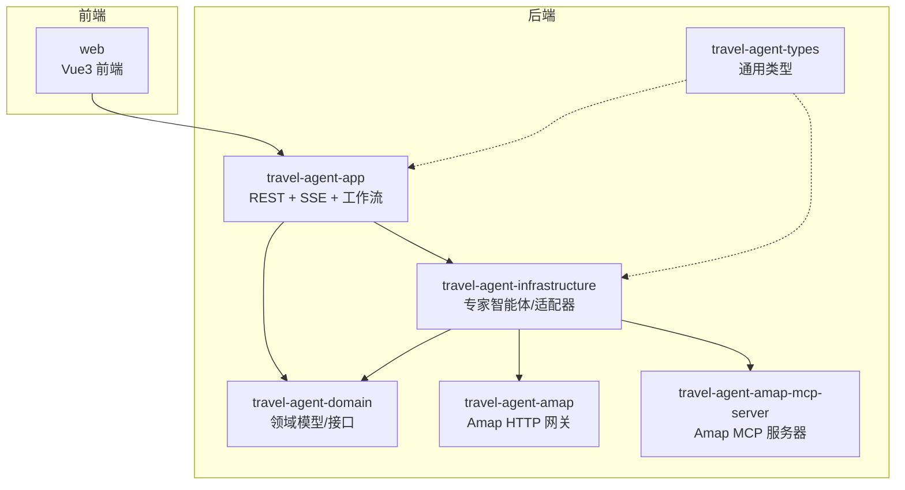
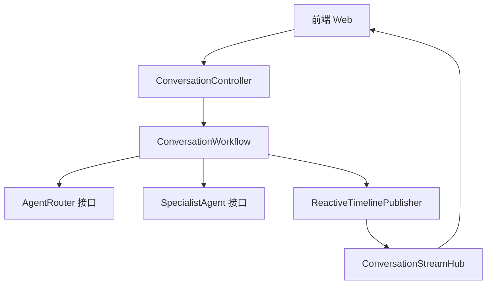
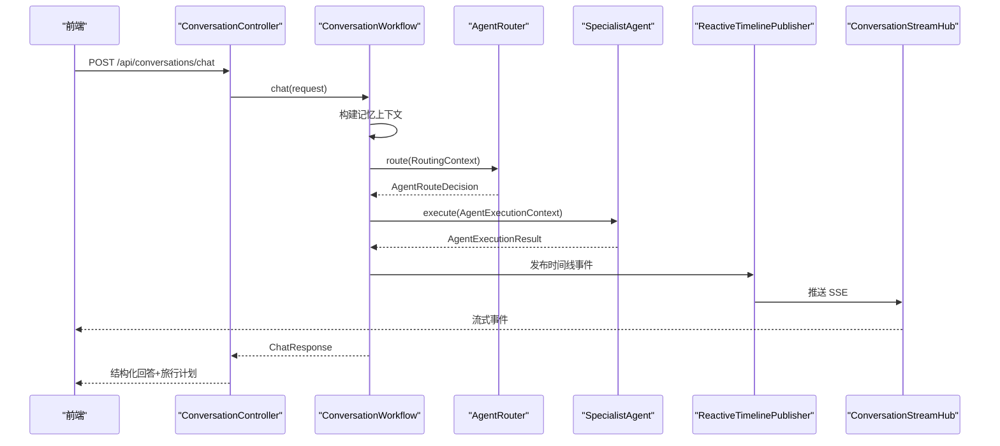
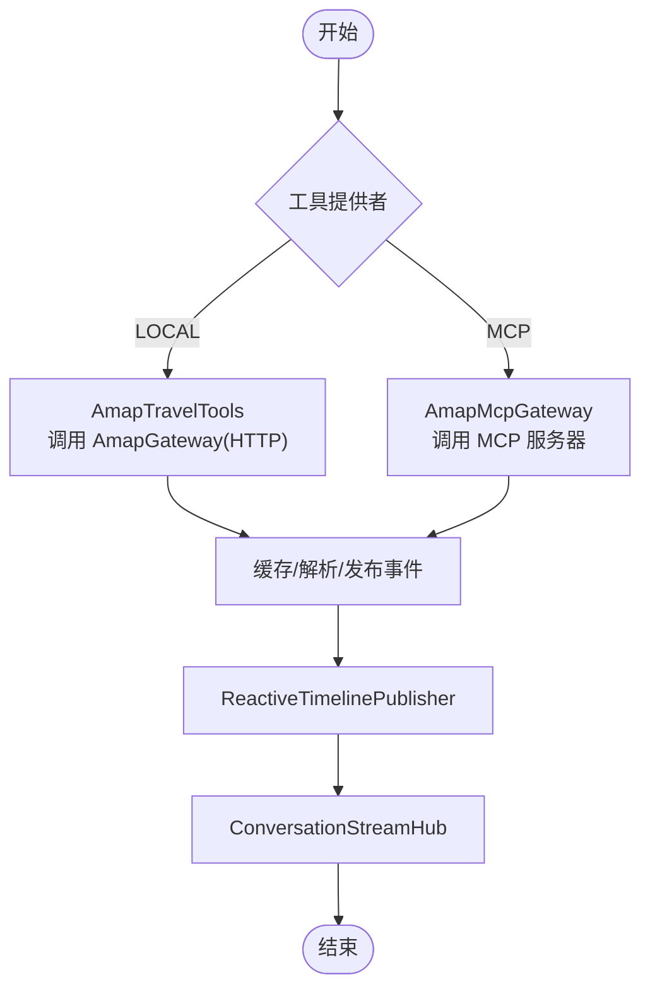
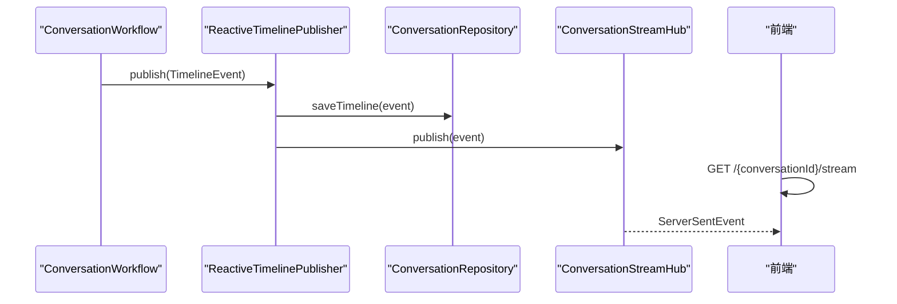
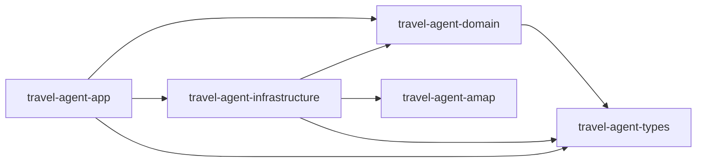

# 架构设计

<cite>
**本文引用的文件**
- [README.md](file://README.md)
- [docs/system-architecture.md](file://docs/system-architecture.md)
- [pom.xml](file://pom.xml)
- [travel-agent-domain/pom.xml](file://travel-agent-domain/pom.xml)
- [travel-agent-app/pom.xml](file://travel-agent-app/pom.xml)
- [travel-agent-infrastructure/pom.xml](file://travel-agent-infrastructure/pom.xml)
- [travel-agent-domain/src/main/java/com/travalagent/domain/service/AgentRouter.java](file://travel-agent-domain/src/main/java/com/travalagent/domain/service/AgentRouter.java)
- [travel-agent-domain/src/main/java/com/travalagent/domain/service/SpecialistAgent.java](file://travel-agent-domain/src/main/java/com/travalagent/domain/service/SpecialistAgent.java)
- [travel-agent-domain/src/main/java/com/travalagent/domain/model/valobj/AgentType.java](file://travel-agent-domain/src/main/java/com/travalagent/domain/model/valobj/AgentType.java)
- [travel-agent-domain/src/main/java/com/travalagent/domain/model/valobj/RoutingContext.java](file://travel-agent-domain/src/main/java/com/travalagent/domain/model/valobj/RoutingContext.java)
- [travel-agent-domain/src/main/java/com/travalagent/domain/model/valobj/AgentRouteDecision.java](file://travel-agent-domain/src/main/java/com/travalagent/domain/model/valobj/AgentRouteDecision.java)
- [travel-agent-app/src/main/java/com/travalagent/app/service/ConversationWorkflow.java](file://travel-agent-app/src/main/java/com/travalagent/app/service/ConversationWorkflow.java)
- [travel-agent-app/src/main/java/com/travalagent/app/controller/ConversationController.java](file://travel-agent-app/src/main/java/com/travalagent/app/controller/ConversationController.java)
- [travel-agent-app/src/main/java/com/travalagent/app/stream/ConversationStreamHub.java](file://travel-agent-app/src/main/java/com/travalagent/app/stream/ConversationStreamHub.java)
- [travel-agent-app/src/main/java/com/travalagent/app/stream/ReactiveTimelinePublisher.java](file://travel-agent-app/src/main/java/com/travalagent/app/stream/ReactiveTimelinePublisher.java)
- [travel-agent-infrastructure/src/main/java/com/travalagent/infrastructure/gateway/tool/AmapMcpGateway.java](file://travel-agent-infrastructure/src/main/java/com/travalagent/infrastructure/gateway/tool/AmapMcpGateway.java)
- [travel-agent-infrastructure/src/main/java/com/travalagent/infrastructure/gateway/tool/AmapTravelTools.java](file://travel-agent-infrastructure/src/main/java/com/travalagent/infrastructure/gateway/tool/AmapTravelTools.java)
</cite>

## 目录
1. [引言](#引言)
2. [项目结构](#项目结构)
3. [核心组件](#核心组件)
4. [架构总览](#架构总览)
5. [详细组件分析](#详细组件分析)
6. [依赖分析](#依赖分析)
7. [性能考虑](#性能考虑)
8. [故障排查指南](#故障排查指南)
9. [结论](#结论)
10. [附录](#附录)

## 引言
本架构设计文档面向 TravelAgent 项目，系统性阐述基于领域驱动设计（DDD）与端口-适配器（Ports & Adapters）思想的分层架构，重点说明 travel-agent-app、travel-agent-domain、travel-agent-infrastructure 等核心模块的职责划分与交互关系；同时深入解析多智能体路由机制与专家智能体协作模式，描述从用户输入到最终输出的完整数据流与控制流，并给出系统边界、外部依赖与集成点的技术考量与权衡。

## 项目结构
TravelAgent 采用多模块 Maven 聚合工程组织，核心模块如下：
- travel-agent-domain：定义领域模型、值对象、实体、仓库接口、网关接口与服务契约，保持业务逻辑与技术实现解耦。
- travel-agent-app：应用层编排，提供 REST API、SSE 流式事件、工作流执行与健康检查。
- travel-agent-infrastructure：基础设施层，实现路由、专家智能体、检索、持久化、校验修复、工具适配器等。
- travel-agent-amap：Amap HTTP 集成网关模块，作为 domain 层网关的 HTTP 实现之一。
- travel-agent-amap-mcp-server：独立 MCP 工具服务器，支持通过 MCP 协议调用 Amap 工具。
- travel-agent-types：共享响应封装与异常类型。
- web：前端 Vue3 应用，负责聊天、图片上传、计划面板、时间线展示与反馈闭环。

图表来源
- [pom.xml:22-29](file://pom.xml#L22-L29)
- [README.md:236-261](file://README.md#L236-L261)

章节来源
- [README.md:76-99](file://README.md#L76-L99)
- [docs/system-architecture.md:12-32](file://docs/system-architecture.md#L12-L32)
- [pom.xml:22-29](file://pom.xml#L22-L29)

## 核心组件
- 领域层（travel-agent-domain）
  - 定义 AgentType、RoutingContext、AgentRouteDecision 等核心值对象与记录类型。
  - 暴露 AgentRouter 接口与 SpecialistAgent 接口，作为路由与专家智能体的服务契约。
- 应用层（travel-agent-app）
  - ConversationWorkflow：编排对话生命周期，构建记忆上下文，路由请求，执行专家智能体，持久化状态与时间线。
  - ConversationController：暴露 REST API，处理聊天、会话列表、反馈导出与 SSE 时间线流。
  - ConversationStreamHub 与 ReactiveTimelinePublisher：将领域事件转换为 SSE 流，供前端实时查看规划步骤。
- 基础设施层（travel-agent-infrastructure）
  - AmapTravelTools：以 Spring AI 工具注解形式封装 Amap 地图能力（天气、地理编码、POI 输入提示、公交路线）。
  - AmapMcpGateway：通过 MCP 客户端调用独立 MCP 服务器提供的 Amap 工具，具备缓存与节流控制。
  - 多种专家智能体实现（如旅行规划、天气、地理、通用），由应用层按路由结果选择执行。

章节来源
- [travel-agent-domain/src/main/java/com/travalagent/domain/model/valobj/AgentType.java:1-9](file://travel-agent-domain/src/main/java/com/travalagent/domain/model/valobj/AgentType.java#L1-L9)
- [travel-agent-domain/src/main/java/com/travalagent/domain/model/valobj/RoutingContext.java:1-17](file://travel-agent-domain/src/main/java/com/travalagent/domain/model/valobj/RoutingContext.java#L1-L17)
- [travel-agent-domain/src/main/java/com/travalagent/domain/model/valobj/AgentRouteDecision.java:1-10](file://travel-agent-domain/src/main/java/com/travalagent/domain/model/valobj/AgentRouteDecision.java#L1-L10)
- [travel-agent-domain/src/main/java/com/travalagent/domain/service/AgentRouter.java:1-10](file://travel-agent-domain/src/main/java/com/travalagent/domain/service/AgentRouter.java#L1-L10)
- [travel-agent-domain/src/main/java/com/travalagent/domain/service/SpecialistAgent.java:1-13](file://travel-agent-domain/src/main/java/com/travalagent/domain/service/SpecialistAgent.java#L1-L13)
- [travel-agent-app/src/main/java/com/travalagent/app/service/ConversationWorkflow.java:1-814](file://travel-agent-app/src/main/java/com/travalagent/app/service/ConversationWorkflow.java#L1-L814)
- [travel-agent-app/src/main/java/com/travalagent/app/controller/ConversationController.java:1-101](file://travel-agent-app/src/main/java/com/travalagent/app/controller/ConversationController.java#L1-L101)
- [travel-agent-app/src/main/java/com/travalagent/app/stream/ConversationStreamHub.java:1-33](file://travel-agent-app/src/main/java/com/travalagent/app/stream/ConversationStreamHub.java#L1-L33)
- [travel-agent-app/src/main/java/com/travalagent/app/stream/ReactiveTimelinePublisher.java:1-28](file://travel-agent-app/src/main/java/com/travalagent/app/stream/ReactiveTimelinePublisher.java#L1-L28)
- [travel-agent-infrastructure/src/main/java/com/travalagent/infrastructure/gateway/tool/AmapTravelTools.java:1-119](file://travel-agent-infrastructure/src/main/java/com/travalagent/infrastructure/gateway/tool/AmapTravelTools.java#L1-L119)
- [travel-agent-infrastructure/src/main/java/com/travalagent/infrastructure/gateway/tool/AmapMcpGateway.java:1-196](file://travel-agent-infrastructure/src/main/java/com/travalagent/infrastructure/gateway/tool/AmapMcpGateway.java#L1-L196)

## 架构总览
系统遵循 DDD 分层与端口-适配器原则：
- 领域层仅包含业务模型与服务契约，不依赖具体实现。
- 应用层负责编排与工作流，协调领域服务与基础设施适配器。
- 基础设施层提供具体实现（LLM、检索、存储、地图工具等），通过适配器对接领域层。
- 前端通过 REST 与 SSE 与后端交互，获得结构化旅行计划与时间线事件。

图表来源
- [travel-agent-app/src/main/java/com/travalagent/app/controller/ConversationController.java:32-101](file://travel-agent-app/src/main/java/com/travalagent/app/controller/ConversationController.java#L32-L101)
- [travel-agent-app/src/main/java/com/travalagent/app/service/ConversationWorkflow.java:49-160](file://travel-agent-app/src/main/java/com/travalagent/app/service/ConversationWorkflow.java#L49-L160)
- [travel-agent-app/src/main/java/com/travalagent/app/stream/ReactiveTimelinePublisher.java:8-27](file://travel-agent-app/src/main/java/com/travalagent/app/stream/ReactiveTimelinePublisher.java#L8-L27)
- [travel-agent-app/src/main/java/com/travalagent/app/stream/ConversationStreamHub.java:11-33](file://travel-agent-app/src/main/java/com/travalagent/app/stream/ConversationStreamHub.java#L11-L33)
- [travel-agent-domain/src/main/java/com/travalagent/domain/service/AgentRouter.java:6-9](file://travel-agent-domain/src/main/java/com/travalagent/domain/service/AgentRouter.java#L6-L9)
- [travel-agent-domain/src/main/java/com/travalagent/domain/service/SpecialistAgent.java:7-12](file://travel-agent-domain/src/main/java/com/travalagent/domain/service/SpecialistAgent.java#L7-L12)

章节来源
- [docs/system-architecture.md:12-42](file://docs/system-architecture.md#L12-L42)
- [README.md:76-99](file://README.md#L76-L99)

## 详细组件分析

### 组件一：多智能体路由与协作
- 路由入口：应用层根据用户消息、近期对话、工作记忆、会话摘要与长期记忆，构造 RoutingContext 并交由 AgentRouter 决策。
- 路由决策：AgentRouter 返回 AgentRouteDecision，包含目标 Agent 类型、原因、是否需要澄清及澄清问题。
- 专家执行：应用层按决策选择对应 SpecialistAgent 执行，得到标准化 AgentExecutionResult，再进入后续编排。
- 规划路径：旅行规划类任务可经历“构建草稿 → Amap 增强 → 校验/修复 → 检索知识 → 最终化”的显式流水线，确保可观察与可演进。

图表来源
- [travel-agent-app/src/main/java/com/travalagent/app/controller/ConversationController.java:47-51](file://travel-agent-app/src/main/java/com/travalagent/app/controller/ConversationController.java#L47-L51)
- [travel-agent-app/src/main/java/com/travalagent/app/service/ConversationWorkflow.java:348-406](file://travel-agent-app/src/main/java/com/travalagent/app/service/ConversationWorkflow.java#L348-L406)
- [travel-agent-domain/src/main/java/com/travalagent/domain/service/AgentRouter.java:6-9](file://travel-agent-domain/src/main/java/com/travalagent/domain/service/AgentRouter.java#L6-L9)
- [travel-agent-domain/src/main/java/com/travalagent/domain/service/SpecialistAgent.java:7-12](file://travel-agent-domain/src/main/java/com/travalagent/domain/service/SpecialistAgent.java#L7-L12)
- [travel-agent-app/src/main/java/com/travalagent/app/stream/ReactiveTimelinePublisher.java:22-26](file://travel-agent-app/src/main/java/com/travalagent/app/stream/ReactiveTimelinePublisher.java#L22-L26)
- [travel-agent-app/src/main/java/com/travalagent/app/stream/ConversationStreamHub.java:21-24](file://travel-agent-app/src/main/java/com/travalagent/app/stream/ConversationStreamHub.java#L21-L24)

章节来源
- [README.md:100-129](file://README.md#L100-L129)
- [docs/system-architecture.md:30-42](file://docs/system-architecture.md#L30-L42)

### 组件二：Amap 工具链与运行时切换
- LOCAL 路径：AmapTravelTools 以 Spring AI 工具注解形式直接调用 domain.gateway.AmapGateway 的 HTTP 实现。
- MCP 路径：AmapMcpGateway 通过 ToolCallbackProvider 获取工具回调，统一序列化参数、解析返回、缓存与节流，适合独立 MCP 服务器场景。
- 运行时开关：通过配置项控制工具提供者（LOCAL/MCP）、内存提供者（AUTO/SQLITE/MILVUS）与检索偏好，便于在不同环境间切换。

图表来源
- [travel-agent-infrastructure/src/main/java/com/travalagent/infrastructure/gateway/tool/AmapTravelTools.java:21-119](file://travel-agent-infrastructure/src/main/java/com/travalagent/infrastructure/gateway/tool/AmapTravelTools.java#L21-L119)
- [travel-agent-infrastructure/src/main/java/com/travalagent/infrastructure/gateway/tool/AmapMcpGateway.java:27-196](file://travel-agent-infrastructure/src/main/java/com/travalagent/infrastructure/gateway/tool/AmapMcpGateway.java#L27-L196)
- [docs/system-architecture.md:43-47](file://docs/system-architecture.md#L43-L47)

章节来源
- [docs/system-architecture.md:43-47](file://docs/system-architecture.md#L43-L47)

### 组件三：SSE 时间线与前端交互
- 领域事件：应用层在关键阶段（分析查询、选择代理、调用工具、完成记忆等）发布 TimelineEvent。
- 基础设施：ReactiveTimelinePublisher 将事件持久化并推送到 ConversationStreamHub。
- 前端：通过 /api/conversations/{conversationId}/stream 订阅 SSE，实时渲染规划步骤与中间结果。

图表来源
- [travel-agent-app/src/main/java/com/travalagent/app/service/ConversationWorkflow.java:496-498](file://travel-agent-app/src/main/java/com/travalagent/app/service/ConversationWorkflow.java#L496-L498)
- [travel-agent-app/src/main/java/com/travalagent/app/stream/ReactiveTimelinePublisher.java:22-26](file://travel-agent-app/src/main/java/com/travalagent/app/stream/ReactiveTimelinePublisher.java#L22-L26)
- [travel-agent-app/src/main/java/com/travalagent/app/stream/ConversationStreamHub.java:16-24](file://travel-agent-app/src/main/java/com/travalagent/app/stream/ConversationStreamHub.java#L16-L24)
- [travel-agent-app/src/main/java/com/travalagent/app/controller/ConversationController.java:92-99](file://travel-agent-app/src/main/java/com/travalagent/app/controller/ConversationController.java#L92-L99)

章节来源
- [travel-agent-app/src/main/java/com/travalagent/app/stream/ConversationStreamHub.java:11-33](file://travel-agent-app/src/main/java/com/travalagent/app/stream/ConversationStreamHub.java#L11-L33)
- [travel-agent-app/src/main/java/com/travalagent/app/stream/ReactiveTimelinePublisher.java:8-27](file://travel-agent-app/src/main/java/com/travalagent/app/stream/ReactiveTimelinePublisher.java#L8-L27)
- [docs/system-architecture.md:30-42](file://docs/system-architecture.md#L30-L42)

## 依赖分析
- 模块依赖
  - travel-agent-app 依赖 travel-agent-domain、travel-agent-infrastructure、travel-agent-types。
  - travel-agent-infrastructure 依赖 travel-agent-domain、travel-agent-amap、travel-agent-types。
  - travel-agent-domain 依赖 travel-agent-types。
- 技术栈与外部依赖
  - 后端：Spring Boot 4、Spring WebFlux、Spring AI、Micrometer/OpenTelemetry、SQLite、可选 Milvus。
  - 前端：Vue 3、TypeScript、Vite、Pinia。
  - 地图与工具：Amap OpenAPI、MCP 协议（可选独立 MCP 服务器）。

图表来源
- [pom.xml:22-29](file://pom.xml#L22-L29)
- [travel-agent-app/pom.xml:16-31](file://travel-agent-app/pom.xml#L16-L31)
- [travel-agent-infrastructure/pom.xml:16-31](file://travel-agent-infrastructure/pom.xml#L16-L31)
- [travel-agent-domain/pom.xml:16-22](file://travel-agent-domain/pom.xml#L16-L22)

章节来源
- [README.md:130-139](file://README.md#L130-L139)
- [docs/system-architecture.md:16-29](file://docs/system-architecture.md#L16-L29)

## 性能考虑
- 流式事件与背压：SSE 使用 Reactor 的背压缓冲策略，避免高并发下事件丢失。
- 工具调用节流：MCP 路径内置最小调用间隔限制，降低外部服务压力与限流风险。
- 缓存策略：按会话维度缓存工具调用结果，减少重复请求与网络往返。
- 记忆窗口与摘要阈值：通过配置控制短期记忆窗口与触发摘要的对话轮次，平衡上下文长度与计算成本。
- 数据库与检索：SQLite 适合开发与演示，Milvus 适合生产检索增强场景，需结合 QPS 与延迟目标评估。

## 故障排查指南
- 请求参数校验
  - 图片附件数量、大小、媒体类型与 dataURL 格式均有限制，错误将抛出应用异常。
- 会话与图像上下文
  - 确认 conversationId 与图像确认/忽略动作的组合使用，避免状态不一致。
- 工具提供者切换
  - LOCAL 与 MCP 路径分别依赖 AmapGateway 与 MCP 回调提供者，需确保相应配置与连通性。
- SSE 连接
  - 若前端无法接收事件，检查应用层时间线发布与 ConversationStreamHub 的订阅状态。

章节来源
- [travel-agent-app/src/main/java/com/travalagent/app/service/ConversationWorkflow.java:534-575](file://travel-agent-app/src/main/java/com/travalagent/app/service/ConversationWorkflow.java#L534-L575)
- [travel-agent-app/src/main/java/com/travalagent/app/controller/ConversationController.java:92-99](file://travel-agent-app/src/main/java/com/travalagent/app/controller/ConversationController.java#L92-L99)
- [travel-agent-infrastructure/src/main/java/com/travalagent/infrastructure/gateway/tool/AmapMcpGateway.java:180-194](file://travel-agent-infrastructure/src/main/java/com/travalagent/infrastructure/gateway/tool/AmapMcpGateway.java#L180-L194)

## 结论
TravelAgent 通过清晰的 DDD 分层与端口-适配器设计，实现了业务与技术的解耦、多智能体路由与协作的可扩展性，以及从用户输入到结构化输出的完整可观测流程。LOCAL 与 MCP 双路径工具链满足不同部署形态需求，SSE 时间线使规划过程透明可见。未来可在检索 Schema 结构化、离线评估指标与专家协作策略等方面持续演进。

## 附录
- 关键术语
  - AgentType：WEATHER、GEO、TRAVEL_PLANNER、GENERAL。
  - RoutingContext：路由所需的上下文信息集合。
  - AgentRouteDecision：路由决策结果（含澄清需求）。
  - TimelineEvent：规划过程中的阶段事件，用于前端流式展示。
- 运行时开关
  - 工具提供者：LOCAL 或 MCP。
  - 内存提供者：AUTO、SQLITE 或 MILVUS。
  - 检索偏好：向量存储优先或本地 JSON 数据集回退。

章节来源
- [docs/system-architecture.md:43-47](file://docs/system-architecture.md#L43-L47)
- [README.md:150-163](file://README.md#L150-L163)