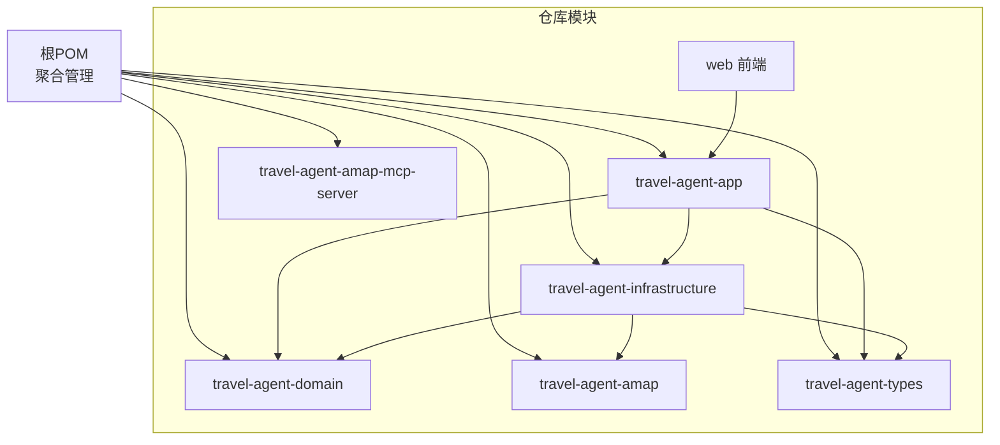
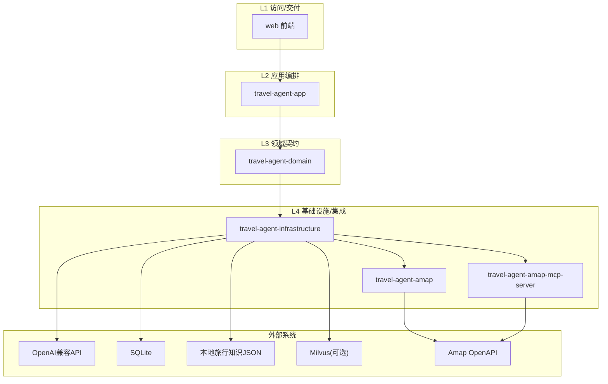
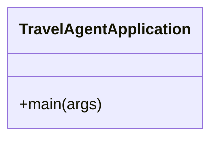
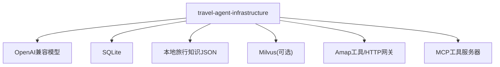
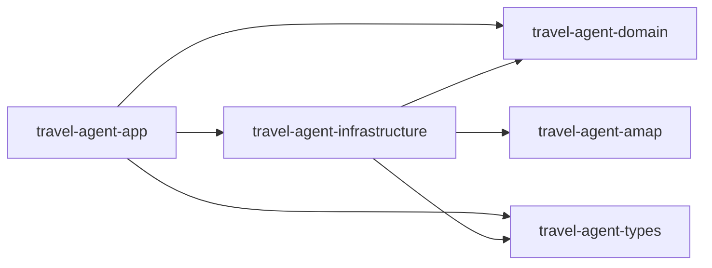
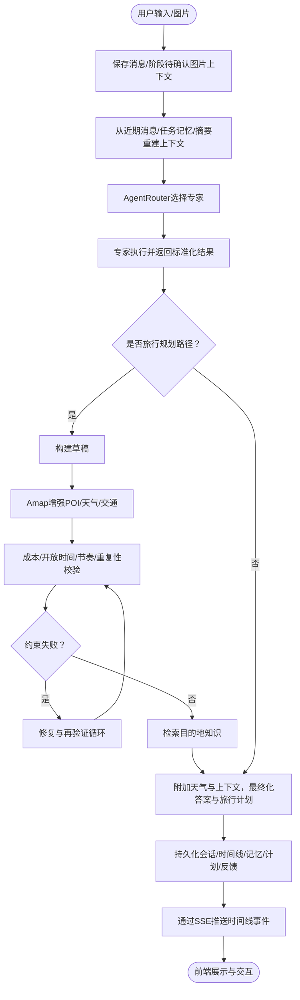

# 系统概览

<cite>
**本文引用的文件**
- [README.md](file://README.md)
- [docs/system-architecture.md](file://docs/system-architecture.md)
- [docs/assets/travelagent-repository-architecture.drawio](file://docs/assets/travelagent-repository-architecture.drawio)
- [docs/assets/travelagent-runtime-workflow.drawio](file://docs/assets/travelagent-runtime-workflow.drawio)
- [docs/knowledge-rag.md](file://docs/knowledge-rag.md)
- [pom.xml](file://pom.xml)
- [travel-agent-app/pom.xml](file://travel-agent-app/pom.xml)
- [travel-agent-domain/pom.xml](file://travel-agent-domain/pom.xml)
- [travel-agent-infrastructure/pom.xml](file://travel-agent-infrastructure/pom.xml)
- [travel-agent-app/src/main/resources/application.yml](file://travel-agent-app/src/main/resources/application.yml)
- [travel-agent-app/src/main/resources/application-prod.yml](file://travel-agent-app/src/main/resources/application-prod.yml)
- [travel-agent-app/src/main/java/com/travalagent/app/TravelAgentApplication.java](file://travel-agent-app/src/main/java/com/travalagent/app/TravelAgentApplication.java)
- [travel-agent-app/src/main/resources/schema.sql](file://travel-agent-app/src/main/resources/schema.sql)
- [travel-agent-infrastructure/src/main/resources/travel-knowledge.json](file://travel-agent-infrastructure/src/main/resources/travel-knowledge.json)
- [web/package.json](file://web/package.json)
- [web/vite.config.ts](file://web/vite.config.ts)
</cite>

## 目录
1. [引言](#引言)
2. [项目结构](#项目结构)
3. [核心组件](#核心组件)
4. [架构总览](#架构总览)
5. [详细组件分析](#详细组件分析)
6. [依赖分析](#依赖分析)
7. [性能考虑](#性能考虑)
8. [故障排查指南](#故障排查指南)
9. [结论](#结论)
10. [附录](#附录)

## 引言
本文件面向TravelAgent项目的系统级读者，提供高层架构视图与运行流程说明。系统采用分层与端口适配器风格，围绕“旅行规划”这一核心业务域，通过多代理路由、结构化计划生成、Amap地理与交通能力增强、以及可选向量检索的知识库，形成从用户意图到可执行行程的闭环。系统边界清晰：前端web负责交互与展示；后端三层分别承担交付入口、应用编排与领域契约；基础设施层实现LLM代理、检索、持久化与工具调用适配；外部系统包括OpenAI兼容API、SQLite、本地旅行知识JSON、可选Milvus向量存储、以及Amap OpenAPI。

## 项目结构
项目采用多模块Maven聚合结构，模块职责明确：
- travel-agent-app：应用层（REST API、SSE流、工作流编排、健康检查）
- travel-agent-domain：领域层（实体、值对象、仓库接口、网关与服务契约）
- travel-agent-infrastructure：基础设施层（LLM代理、检索、持久化适配、校验与修复、Amap工具与MCP集成）
- travel-agent-amap：Amap HTTP网关模块
- travel-agent-amap-mcp-server：独立MCP工具服务器
- travel-agent-types：共享响应体与异常类型
- web：Vue 3前端工程

**图表来源**
- [pom.xml:1-58](file://pom.xml#L1-L58)
- [travel-agent-app/pom.xml:1-78](file://travel-agent-app/pom.xml#L1-L78)
- [travel-agent-domain/pom.xml:1-24](file://travel-agent-domain/pom.xml#L1-L24)
- [travel-agent-infrastructure/pom.xml:1-77](file://travel-agent-infrastructure/pom.xml#L1-L77)

**章节来源**
- [pom.xml:22-29](file://pom.xml#L22-L29)
- [README.md:236-261](file://README.md#L236-L261)

## 核心组件
- web前端：负责聊天、图片上传、计划/地图/时间线面板、反馈操作，通过代理转发至后端API。
- travel-agent-app：应用层，承载HTTP与SSE、对话工作流、知识数据播种、健康检查。
- travel-agent-domain：领域层，定义实体、值对象、仓库接口与网关契约。
- travel-agent-infrastructure：基础设施层，实现多代理路由、天气/地理/通用/旅行规划代理、图像解析、摘要、任务记忆提取、校验与修复、检索与持久化适配。
- travel-agent-amap：Amap HTTP网关，封装Amap OpenAPI访问。
- travel-agent-amap-mcp-server：独立MCP工具服务器，支持Amap相关工具的远程调用。
- travel-agent-types：共享DTO、响应体与异常类型。

**章节来源**
- [README.md:76-86](file://README.md#L76-L86)
- [docs/system-architecture.md:12-29](file://docs/system-architecture.md#L12-L29)

## 架构总览
系统采用Repository Architecture分层设计，强调“显式交付、应用编排、领域契约、基础设施集成”的分层职责，并通过运行时开关控制工具路径与内存提供者。

**图表来源**
- [docs/assets/travelagent-repository-architecture.drawio:15-79](file://docs/assets/travelagent-repository-architecture.drawio#L15-L79)
- [docs/system-architecture.md:12-29](file://docs/system-architecture.md#L12-L29)

**章节来源**
- [docs/system-architecture.md:12-29](file://docs/system-architecture.md#L12-L29)
- [docs/assets/travelagent-repository-architecture.drawio:15-79](file://docs/assets/travelagent-repository-architecture.drawio#L15-L79)

## 详细组件分析

### 应用层（travel-agent-app）
- 职责：REST API、SSE事件流、对话工作流、健康检查、知识播种。
- 关键点：使用Spring WebFlux构建非阻塞API；通过Actuator暴露健康端点；配置SQLite数据源与初始化脚本；支持跨域与MCP客户端配置。
- 运行入口：Spring Boot启动类。

**图表来源**
- [travel-agent-app/src/main/java/com/travalagent/app/TravelAgentApplication.java:9-14](file://travel-agent-app/src/main/java/com/travalagent/app/TravelAgentApplication.java#L9-L14)

**章节来源**
- [travel-agent-app/pom.xml:33-44](file://travel-agent-app/pom.xml#L33-L44)
- [travel-agent-app/src/main/resources/application.yml:1-100](file://travel-agent-app/src/main/resources/application.yml#L1-L100)
- [travel-agent-app/src/main/resources/application-prod.yml:1-6](file://travel-agent-app/src/main/resources/application-prod.yml#L1-L6)
- [travel-agent-app/src/main/resources/schema.sql](file://travel-agent-app/src/main/resources/schema.sql)

### 领域层（travel-agent-domain）
- 职责：定义旅行规划相关的实体、值对象、仓库接口与网关契约，保持与具体适配解耦。
- 关键点：包含AgentRouter、SpecialistAgent、TaskMemoryExtractor、ConversationSummarizer、ImageAttachmentInterpreter、AmapGateway等端口；定义Conversation、LongTermMemory、TravelKnowledge等仓库接口。

**章节来源**
- [docs/system-architecture.md:18-22](file://docs/system-architecture.md#L18-L22)
- [travel-agent-domain/pom.xml:16-21](file://travel-agent-domain/pom.xml#L16-L21)

### 基础设施层（travel-agent-infrastructure）
- 职责：实现多代理路由与执行、图像解析、摘要、任务记忆提取、校验与修复、检索与持久化适配；集成Amap工具与MCP；支持SQLite与可选Milvus。
- 关键点：依赖Spring AI与MCP客户端；集成SQLite JDBC；提供向量检索与本地回退；提供Amap工具回调配置与MCP网关。

**图表来源**
- [docs/assets/travelagent-repository-architecture.drawio:49-73](file://docs/assets/travelagent-repository-architecture.drawio#L49-L73)
- [travel-agent-infrastructure/pom.xml:33-76](file://travel-agent-infrastructure/pom.xml#L33-L76)

**章节来源**
- [docs/system-architecture.md:18-22](file://docs/system-architecture.md#L18-L22)
- [travel-agent-infrastructure/pom.xml:16-76](file://travel-agent-infrastructure/pom.xml#L16-L76)

### 外部系统与运行时开关
- OpenAI兼容API：用于聊天补全与嵌入。
- SQLite：存储会话、时间线、任务记忆、计划、反馈与待确认图片上下文。
- 本地旅行知识JSON：手绘与清洗后的旅行知识数据，作为检索回退。
- Milvus（可选）：向量记忆与向量知识检索。
- Amap OpenAPI：天气、地名解析、输入提示、交通路线等。
- 运行时开关：工具提供者（LOCAL/MCP）、内存提供者（AUTO/SQLITE/MILVUS），以及知识检索优先级。

**章节来源**
- [docs/system-architecture.md:43-47](file://docs/system-architecture.md#L43-L47)
- [docs/assets/travelagent-repository-architecture.drawio:59-73](file://docs/assets/travelagent-repository-architecture.drawio#L59-L73)
- [travel-agent-app/src/main/resources/application.yml:57-100](file://travel-agent-app/src/main/resources/application.yml#L57-L100)

### 知识检索与数据管线
- 数据来源：本地旅行知识JSON（含清洗后的大规模数据集）。
- 检索策略：优先向量检索（Milvus），失败时回退到本地JSON文件；查询计划抽取目的地、主题与语义查询文本，进行结构化过滤。
- 已有改进：目的地硬约束、主题推断与结构化过滤、统一检索计划、清洗数据优先。

**章节来源**
- [docs/knowledge-rag.md:3-11](file://docs/knowledge-rag.md#L3-L11)
- [docs/knowledge-rag.md:67-129](file://docs/knowledge-rag.md#L67-L129)
- [travel-agent-infrastructure/src/main/resources/travel-knowledge.json:1-50](file://travel-agent-infrastructure/src/main/resources/travel-knowledge.json#L1-L50)

### 前端与后端交互
- 前端：Vue 3 + Vite，开发服务器默认端口5173，通过代理将/api前缀请求转发至后端8080。
- 后端：提供REST与SSE，支持聊天、详情、反馈汇总、导出与删除等操作。

**章节来源**
- [web/vite.config.ts:4-19](file://web/vite.config.ts#L4-L19)
- [README.md:184-187](file://README.md#L184-L187)

## 依赖分析
- 模块依赖：app依赖domain与infrastructure及types；infrastructure依赖domain、amap与types。
- 外部依赖：Spring Boot 4、Spring WebFlux、Spring AI、Micrometer/OpenTelemetry、SQLite JDBC、Milvus存储、Amap HTTP与MCP客户端。
- 运行时配置：通过application.yml与环境变量控制工具提供者、内存提供者、Amap与Milvus参数。

**图表来源**
- [travel-agent-app/pom.xml:16-31](file://travel-agent-app/pom.xml#L16-L31)
- [travel-agent-infrastructure/pom.xml:16-31](file://travel-agent-infrastructure/pom.xml#L16-L31)

**章节来源**
- [travel-agent-app/pom.xml:16-31](file://travel-agent-app/pom.xml#L16-L31)
- [travel-agent-infrastructure/pom.xml:16-31](file://travel-agent-infrastructure/pom.xml#L16-L31)

## 性能考虑
- I/O与并发：后端采用WebFlux非阻塞模型，适合高并发与长连接SSE场景。
- 存储：SQLite池大小固定，适合单实例部署；向量检索在Milvus启用时可显著提升大规模知识检索效率。
- 检索：统一检索计划与目的地硬约束减少无效匹配；清洗后的本地数据作为稳定回退。
- 工具路径：LOCAL与MCP双路径切换，便于在不同部署环境下选择最优工具调用方式。

## 故障排查指南
- 健康检查：通过Actuator健康端点查看后端、知识数据集、向量存储、OpenAI可用性与工具提供者状态。
- 日志与追踪：开启Micrometer与OTLP导出，结合采样概率定位问题。
- 环境变量：确保OpenAI API密钥、Amap API密钥、MCP服务器地址等配置正确。
- 数据库：确认SQLite初始化脚本已执行，schema与表结构一致。
- 前后端联调：检查Vite代理配置是否指向后端8080端口。

**章节来源**
- [travel-agent-app/src/main/resources/application.yml:42-56](file://travel-agent-app/src/main/resources/application.yml#L42-L56)
- [web/vite.config.ts:8-13](file://web/vite.config.ts#L8-L13)

## 结论
TravelAgent以清晰的分层与端口适配器架构，将旅行规划的复杂流程拆解为可观察、可演进的应用编排与多代理协作。通过Amap地理能力与可选向量检索，系统在结构化计划生成与落地执行之间建立了稳健的桥梁；前后端分离与SSE事件流提升了用户体验与可观测性。建议在生产环境中完善密钥与TLS治理、扩展监控与告警，并持续优化RAG与多模态提取质量。

## 附录
- 运行时工作流（概念性说明）：用户在前端发起聊天或上传图片，后端工作流保存消息并重建上下文，路由到相应专家代理，旅行规划代理按“草稿-增强-Amap-校验-修复-检索-天气-最终化”的显式流水线执行，期间持久化时间线与记忆，SSE实时回传给前端，同时支持反馈汇总与导出。

[此图为概念性流程示意，不直接映射具体源码文件，故无图表来源]