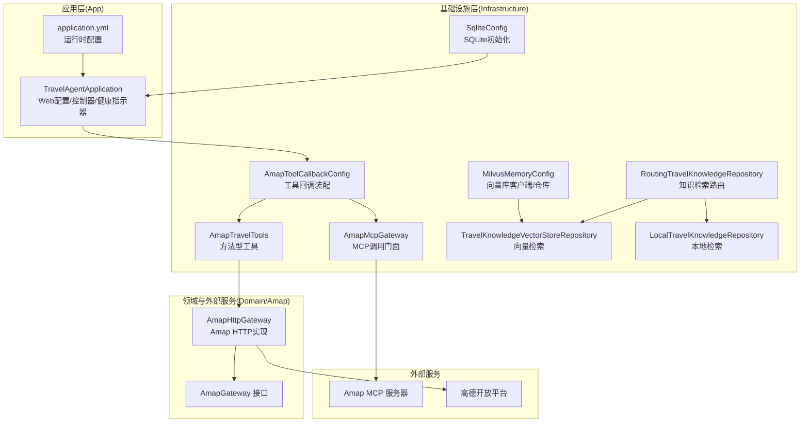
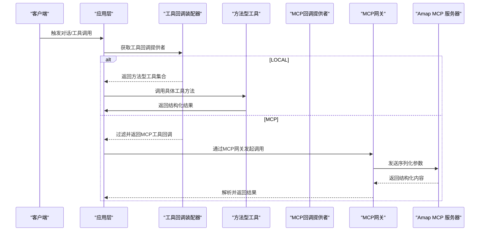
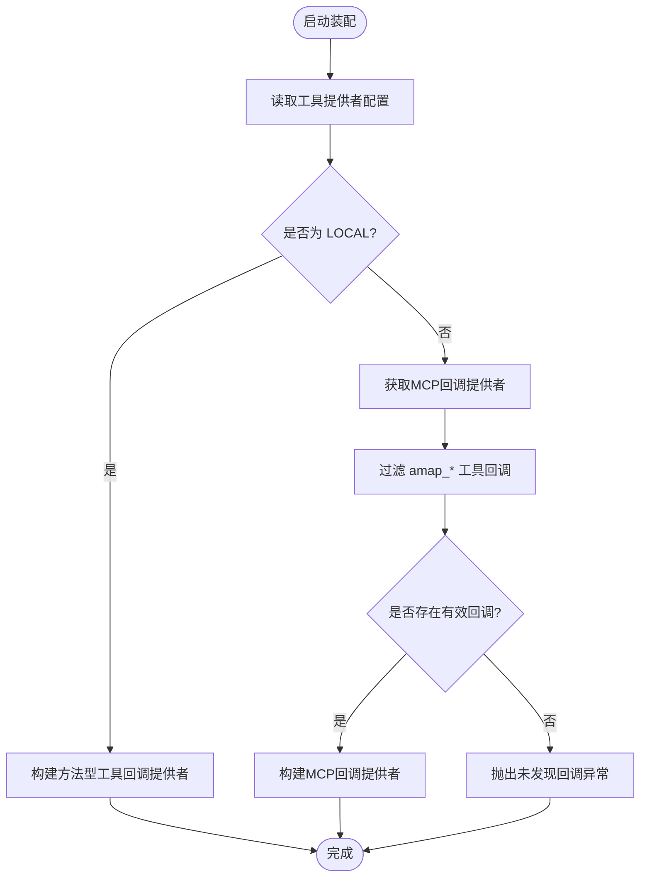
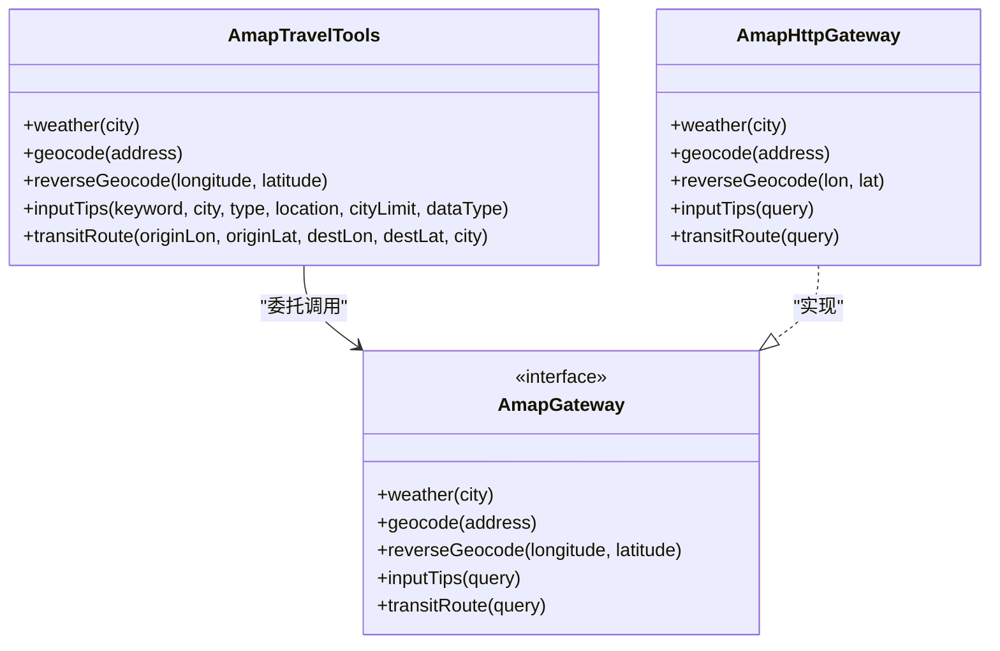
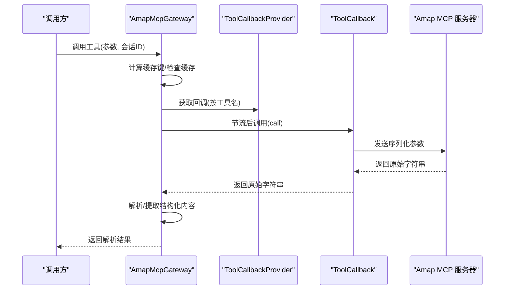
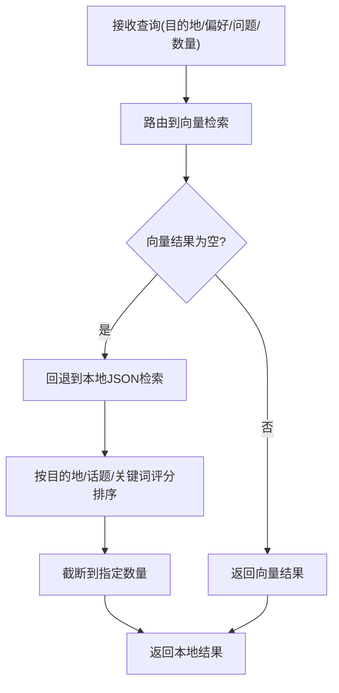
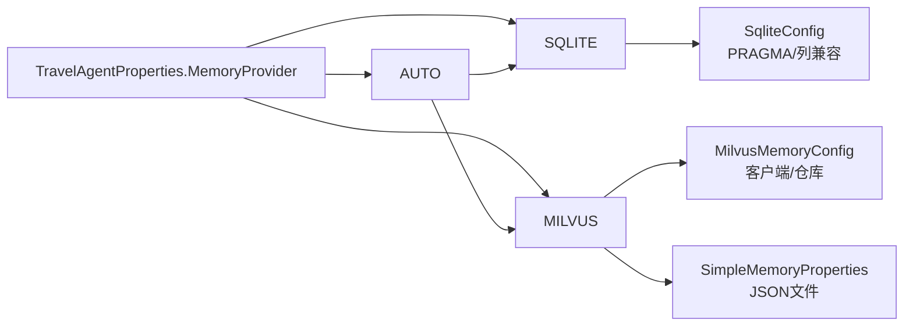
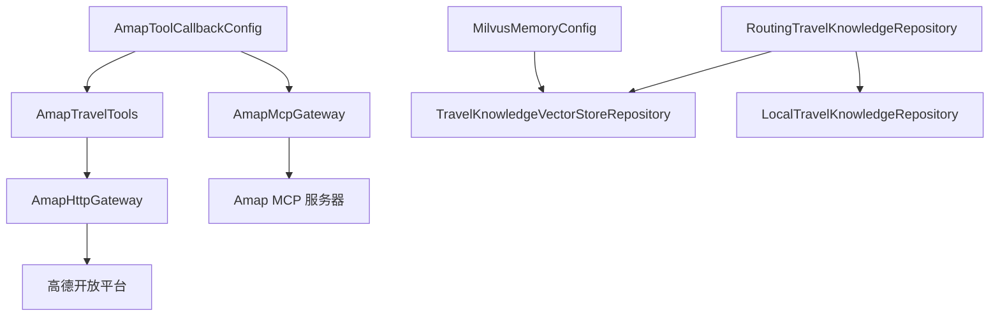

# 集成模式

<cite>
**本文引用的文件**
- [AmapToolCallbackConfig.java](file://travel-agent-infrastructure/src/main/java/com/travalagent/infrastructure/config/AmapToolCallbackConfig.java)
- [AmapTravelTools.java](file://travel-agent-infrastructure/src/main/java/com/travalagent/infrastructure/gateway/tool/AmapTravelTools.java)
- [AmapMcpGateway.java](file://travel-agent-infrastructure/src/main/java/com/travalagent/infrastructure/gateway/tool/AmapMcpGateway.java)
- [AmapHttpGateway.java](file://travel-agent-amap/src/main/java/com/travalagent/amap/gateway/AmapHttpGateway.java)
- [AmapMcpServerApplication.java](file://travel-agent-amap-mcp-server/src/main/java/com/travalagent/amap/mcp/server/AmapMcpServerApplication.java)
- [TravelAgentProperties.java](file://travel-agent-infrastructure/src/main/java/com/travalagent/infrastructure/config/TravelAgentProperties.java)
- [MilvusMemoryConfig.java](file://travel-agent-infrastructure/src/main/java/com/travalagent/infrastructure/config/MilvusMemoryConfig.java)
- [SimpleMemoryProperties.java](file://travel-agent-infrastructure/src/main/java/com/travalagent/infrastructure/config/SimpleMemoryProperties.java)
- [SqliteConfig.java](file://travel-agent-infrastructure/src/main/java/com/travalagent/infrastructure/config/SqliteConfig.java)
- [RoutingTravelKnowledgeRepository.java](file://travel-agent-infrastructure/src/main/java/com/travalagent/infrastructure/repository/RoutingTravelKnowledgeRepository.java)
- [TravelKnowledgeVectorStoreRepository.java](file://travel-agent-infrastructure/src/main/java/com/travalagent/infrastructure/repository/TravelKnowledgeVectorStoreRepository.java)
- [LocalTravelKnowledgeRepository.java](file://travel-agent-infrastructure/src/main/java/com/travalagent/infrastructure/repository/LocalTravelKnowledgeRepository.java)
- [AmapGateway.java](file://travel-agent-domain/src/main/java/com/travalagent/domain/gateway/AmapGateway.java)
- [application.yml](file://travel-agent-app/src/main/resources/application.yml)
</cite>

## 目录
1. [引言](#引言)
2. [项目结构](#项目结构)
3. [核心组件](#核心组件)
4. [架构总览](#架构总览)
5. [详细组件分析](#详细组件分析)
6. [依赖分析](#依赖分析)
7. [性能考量](#性能考量)
8. [故障排查指南](#故障排查指南)
9. [结论](#结论)
10. [附录](#附录)

## 引言
本文件面向TravelAgent项目的集成模式，系统化阐述以下主题：
- 工具提供者在LOCAL与MCP之间的切换机制与回调装配策略
- Amap工具回调的实现原理：LOCAL路径通过AmapTravelTools与AmapHttpGateway的直接集成；MCP路径通过AmapMcpGateway与独立MCP服务器的间接集成
- 可插拔内存提供者机制：AUTO、SQLITE、MILVUS的配置与切换
- 知识检索的回退机制：当向量存储可用时优先向量检索，否则回退到本地JSON数据集
- 集成点的设计原则与扩展性考虑

## 项目结构
从集成视角看，系统由三层构成：
- 应用层（App）：对外提供HTTP接口、健康检查、配置加载
- 基础设施层（Infrastructure）：工具回调装配、Amap MCP网关、向量检索与本地检索路由、SQLite等基础设施配置
- 领域与外部服务层（Domain/Amap）：领域网关接口定义、Amap HTTP网关实现

图表来源
- [application.yml:1-100](file://travel-agent-app/src/main/resources/application.yml#L1-L100)
- [AmapToolCallbackConfig.java:14-44](file://travel-agent-infrastructure/src/main/java/com/travalagent/infrastructure/config/AmapToolCallbackConfig.java#L14-L44)
- [AmapTravelTools.java:21-119](file://travel-agent-infrastructure/src/main/java/com/travalagent/infrastructure/gateway/tool/AmapTravelTools.java#L21-L119)
- [AmapMcpGateway.java:27-196](file://travel-agent-infrastructure/src/main/java/com/travalagent/infrastructure/gateway/tool/AmapMcpGateway.java#L27-L196)
- [RoutingTravelKnowledgeRepository.java:11-38](file://travel-agent-infrastructure/src/main/java/com/travalagent/infrastructure/repository/RoutingTravelKnowledgeRepository.java#L11-L38)
- [TravelKnowledgeVectorStoreRepository.java:28-232](file://travel-agent-infrastructure/src/main/java/com/travalagent/infrastructure/repository/TravelKnowledgeVectorStoreRepository.java#L28-L232)
- [LocalTravelKnowledgeRepository.java:22-224](file://travel-agent-infrastructure/src/main/java/com/travalagent/infrastructure/repository/LocalTravelKnowledgeRepository.java#L22-L224)
- [MilvusMemoryConfig.java:15-45](file://travel-agent-infrastructure/src/main/java/com/travalagent/infrastructure/config/MilvusMemoryConfig.java#L15-L45)
- [SqliteConfig.java:12-42](file://travel-agent-infrastructure/src/main/java/com/travalagent/infrastructure/config/SqliteConfig.java#L12-L42)
- [AmapHttpGateway.java:26-481](file://travel-agent-amap/src/main/java/com/travalagent/amap/gateway/AmapHttpGateway.java#L26-L481)
- [AmapGateway.java:12-28](file://travel-agent-domain/src/main/java/com/travalagent/domain/gateway/AmapGateway.java#L12-L28)

章节来源
- [application.yml:1-100](file://travel-agent-app/src/main/resources/application.yml#L1-L100)

## 核心组件
- 工具回调装配器：根据配置选择LOCAL或MCP工具回调提供者，并对MCP回调进行过滤与校验
- 方法型工具：将Amap能力以方法注解形式暴露给LLM工具调用
- MCP网关：封装MCP工具调用、参数序列化、结果解析、会话级缓存与节流
- Amap HTTP网关：直接对接高德开放平台REST API，包含错误/限流处理与模拟回退
- 知识检索路由：优先向量检索，失败或为空则回退本地JSON数据集
- 内存提供者：支持AUTO、SQLITE、MILVUS三类，结合条件装配实现可插拔

章节来源
- [AmapToolCallbackConfig.java:14-44](file://travel-agent-infrastructure/src/main/java/com/travalagent/infrastructure/config/AmapToolCallbackConfig.java#L14-L44)
- [AmapTravelTools.java:21-119](file://travel-agent-infrastructure/src/main/java/com/travalagent/infrastructure/gateway/tool/AmapTravelTools.java#L21-L119)
- [AmapMcpGateway.java:27-196](file://travel-agent-infrastructure/src/main/java/com/travalagent/infrastructure/gateway/tool/AmapMcpGateway.java#L27-L196)
- [AmapHttpGateway.java:26-481](file://travel-agent-amap/src/main/java/com/travalagent/amap/gateway/AmapHttpGateway.java#L26-L481)
- [RoutingTravelKnowledgeRepository.java:11-38](file://travel-agent-infrastructure/src/main/java/com/travalagent/infrastructure/repository/RoutingTravelKnowledgeRepository.java#L11-L38)
- [TravelKnowledgeVectorStoreRepository.java:28-232](file://travel-agent-infrastructure/src/main/java/com/travalagent/infrastructure/repository/TravelKnowledgeVectorStoreRepository.java#L28-L232)
- [LocalTravelKnowledgeRepository.java:22-224](file://travel-agent-infrastructure/src/main/java/com/travalagent/infrastructure/repository/LocalTravelKnowledgeRepository.java#L22-L224)
- [MilvusMemoryConfig.java:15-45](file://travel-agent-infrastructure/src/main/java/com/travalagent/infrastructure/config/MilvusMemoryConfig.java#L15-L45)
- [SqliteConfig.java:12-42](file://travel-agent-infrastructure/src/main/java/com/travalagent/infrastructure/config/SqliteConfig.java#L12-L42)

## 架构总览
下图展示工具提供者与知识检索两条主线的集成路径。

图表来源
- [AmapToolCallbackConfig.java:17-43](file://travel-agent-infrastructure/src/main/java/com/travalagent/infrastructure/config/AmapToolCallbackConfig.java#L17-L43)
- [AmapMcpGateway.java:102-123](file://travel-agent-infrastructure/src/main/java/com/travalagent/infrastructure/gateway/tool/AmapMcpGateway.java#L102-L123)
- [AmapMcpServerApplication.java:9-14](file://travel-agent-amap-mcp-server/src/main/java/com/travalagent/amap/mcp/server/AmapMcpServerApplication.java#L9-L14)

## 详细组件分析

### 工具提供者切换与回调装配
- 配置入口：通过运行时属性控制工具提供者类型（LOCAL/MCP）
- LOCAL路径：装配方法型工具对象，直接注入到工具回调提供者中
- MCP路径：从容器获取MCP回调提供者，筛选以“amap_”开头的工具回调，校验非空后装配

图表来源
- [AmapToolCallbackConfig.java:17-43](file://travel-agent-infrastructure/src/main/java/com/travalagent/infrastructure/config/AmapToolCallbackConfig.java#L17-L43)
- [TravelAgentProperties.java:41-66](file://travel-agent-infrastructure/src/main/java/com/travalagent/infrastructure/config/TravelAgentProperties.java#L41-L66)

章节来源
- [AmapToolCallbackConfig.java:14-44](file://travel-agent-infrastructure/src/main/java/com/travalagent/infrastructure/config/AmapToolCallbackConfig.java#L14-L44)
- [TravelAgentProperties.java:8-66](file://travel-agent-infrastructure/src/main/java/com/travalagent/infrastructure/config/TravelAgentProperties.java#L8-L66)

### 方法型工具与HTTP网关直连
- 方法型工具：以注解声明多个Amap工具（天气、地理编码、反向地理编码、输入提示、公交路线），统一发布时间线事件并委托领域网关
- 领域网关接口：定义Amap能力契约
- HTTP网关实现：封装RestClient请求、参数拼装、响应解析、错误/限流处理与模拟回退

图表来源
- [AmapTravelTools.java:21-119](file://travel-agent-infrastructure/src/main/java/com/travalagent/infrastructure/gateway/tool/AmapTravelTools.java#L21-L119)
- [AmapGateway.java:12-28](file://travel-agent-domain/src/main/java/com/travalagent/domain/gateway/AmapGateway.java#L12-L28)
- [AmapHttpGateway.java:26-481](file://travel-agent-amap/src/main/java/com/travalagent/amap/gateway/AmapHttpGateway.java#L26-L481)

章节来源
- [AmapTravelTools.java:21-119](file://travel-agent-infrastructure/src/main/java/com/travalagent/infrastructure/gateway/tool/AmapTravelTools.java#L21-L119)
- [AmapGateway.java:12-28](file://travel-agent-domain/src/main/java/com/travalagent/domain/gateway/AmapGateway.java#L12-L28)
- [AmapHttpGateway.java:26-481](file://travel-agent-amap/src/main/java/com/travalagent/amap/gateway/AmapHttpGateway.java#L26-L481)

### MCP工具调用流程与门面设计
- MCP网关职责：按工具名查找回调、序列化参数、调用工具、解析结果、会话级缓存、最小调用间隔节流
- 结果解析：兼容多种嵌套结构，自动识别结构化内容字段
- 会话缓存：基于工具名+排序后的参数生成键，避免重复调用

图表来源
- [AmapMcpGateway.java:40-196](file://travel-agent-infrastructure/src/main/java/com/travalagent/infrastructure/gateway/tool/AmapMcpGateway.java#L40-L196)

章节来源
- [AmapMcpGateway.java:27-196](file://travel-agent-infrastructure/src/main/java/com/travalagent/infrastructure/gateway/tool/AmapMcpGateway.java#L27-L196)

### 知识检索回退机制
- 路由仓库：优先尝试向量检索；若结果为空，则回退到本地JSON数据集
- 向量仓库：基于Milvus/向量库实现相似度检索，支持过滤表达式与阈值
- 本地仓库：基于类路径JSON资源，构建城市别名映射与评分排序

图表来源
- [RoutingTravelKnowledgeRepository.java:26-36](file://travel-agent-infrastructure/src/main/java/com/travalagent/infrastructure/repository/RoutingTravelKnowledgeRepository.java#L26-L36)
- [TravelKnowledgeVectorStoreRepository.java:68-99](file://travel-agent-infrastructure/src/main/java/com/travalagent/infrastructure/repository/TravelKnowledgeVectorStoreRepository.java#L68-L99)
- [LocalTravelKnowledgeRepository.java:50-68](file://travel-agent-infrastructure/src/main/java/com/travalagent/infrastructure/repository/LocalTravelKnowledgeRepository.java#L50-L68)

章节来源
- [RoutingTravelKnowledgeRepository.java:11-38](file://travel-agent-infrastructure/src/main/java/com/travalagent/infrastructure/repository/RoutingTravelKnowledgeRepository.java#L11-L38)
- [TravelKnowledgeVectorStoreRepository.java:28-232](file://travel-agent-infrastructure/src/main/java/com/travalagent/infrastructure/repository/TravelKnowledgeVectorStoreRepository.java#L28-L232)
- [LocalTravelKnowledgeRepository.java:22-224](file://travel-agent-infrastructure/src/main/java/com/travalagent/infrastructure/repository/LocalTravelKnowledgeRepository.java#L22-L224)

### 可插拔内存提供者机制
- 配置枚举：支持AUTO、SQLITE、MILVUS三种提供者
- 条件装配：
  - Milvus：当milvus相关配置启用时，创建MilvusServiceClient与VectorStore Bean
  - SQLite：通过初始化脚本与PRAGMA优化，确保表结构与列存在
  - Simple内存：简单向量存储（JSON文件）作为可选轻量方案
- 运行时属性：通过环境变量控制启用状态与参数

图表来源
- [TravelAgentProperties.java:49-66](file://travel-agent-infrastructure/src/main/java/com/travalagent/infrastructure/config/TravelAgentProperties.java#L49-L66)
- [MilvusMemoryConfig.java:15-45](file://travel-agent-infrastructure/src/main/java/com/travalagent/infrastructure/config/MilvusMemoryConfig.java#L15-L45)
- [SimpleMemoryProperties.java:5-26](file://travel-agent-infrastructure/src/main/java/com/travalagent/infrastructure/config/SimpleMemoryProperties.java#L5-L26)
- [SqliteConfig.java:12-42](file://travel-agent-infrastructure/src/main/java/com/travalagent/infrastructure/config/SqliteConfig.java#L12-L42)

章节来源
- [TravelAgentProperties.java:8-66](file://travel-agent-infrastructure/src/main/java/com/travalagent/infrastructure/config/TravelAgentProperties.java#L8-L66)
- [application.yml:71-86](file://travel-agent-app/src/main/resources/application.yml#L71-L86)

## 依赖分析
- 组件耦合
  - 工具回调装配器对LOCAL/MCP路径有明确分支，MCP路径依赖容器中的回调提供者
  - MCP网关依赖工具回调提供者与Jackson解析，具备会话缓存与节流
  - 知识检索路由对向量仓库采用可选依赖（ObjectProvider），保证回退安全
- 外部依赖
  - 高德开放平台REST API（HTTP网关）
  - Amap MCP服务器（同步MCP客户端）
  - Milvus向量数据库（可选）

图表来源
- [AmapToolCallbackConfig.java:17-43](file://travel-agent-infrastructure/src/main/java/com/travalagent/infrastructure/config/AmapToolCallbackConfig.java#L17-L43)
- [AmapMcpGateway.java:40-47](file://travel-agent-infrastructure/src/main/java/com/travalagent/infrastructure/gateway/tool/AmapMcpGateway.java#L40-L47)
- [RoutingTravelKnowledgeRepository.java:18-24](file://travel-agent-infrastructure/src/main/java/com/travalagent/infrastructure/repository/RoutingTravelKnowledgeRepository.java#L18-L24)
- [AmapHttpGateway.java:26-40](file://travel-agent-amap/src/main/java/com/travalagent/amap/gateway/AmapHttpGateway.java#L26-L40)

章节来源
- [AmapToolCallbackConfig.java:14-44](file://travel-agent-infrastructure/src/main/java/com/travalagent/infrastructure/config/AmapToolCallbackConfig.java#L14-L44)
- [AmapMcpGateway.java:27-196](file://travel-agent-infrastructure/src/main/java/com/travalagent/infrastructure/gateway/tool/AmapMcpGateway.java#L27-L196)
- [RoutingTravelKnowledgeRepository.java:11-38](file://travel-agent-infrastructure/src/main/java/com/travalagent/infrastructure/repository/RoutingTravelKnowledgeRepository.java#L11-L38)

## 性能考量
- 请求节流
  - HTTP网关：基于RPS配置计算最小间隔，避免超频
  - MCP网关：固定最小调用间隔，避免触发下游限流
- 缓存策略
  - MCP网关：会话级缓存，相同工具+参数组合复用结果
- 向量检索
  - 按需扩大topK以提升召回质量，再进行二次过滤与截断
- 数据库与索引
  - SQLite PRAGMA优化提升写入稳定性
  - Milvus索引类型与度量类型可配置，影响检索性能与精度

章节来源
- [AmapHttpGateway.java:460-479](file://travel-agent-amap/src/main/java/com/travalagent/amap/gateway/AmapHttpGateway.java#L460-L479)
- [AmapMcpGateway.java:180-194](file://travel-agent-infrastructure/src/main/java/com/travalagent/infrastructure/gateway/tool/AmapMcpGateway.java#L180-L194)
- [TravelKnowledgeVectorStoreRepository.java:74-79](file://travel-agent-infrastructure/src/main/java/com/travalagent/infrastructure/repository/TravelKnowledgeVectorStoreRepository.java#L74-L79)
- [SqliteConfig.java:16-26](file://travel-agent-infrastructure/src/main/java/com/travalagent/infrastructure/config/SqliteConfig.java#L16-L26)
- [MilvusMemoryConfig.java:28-44](file://travel-agent-infrastructure/src/main/java/com/travalagent/infrastructure/config/MilvusMemoryConfig.java#L28-L44)

## 故障排查指南
- 工具回调装配
  - 若配置为MCP但未发现回调，将抛出异常；请确认MCP客户端已正确注册且工具名以“amap_”前缀
- MCP调用
  - 结果解析失败：检查返回格式是否为JSON或包含结构化字段；必要时调整MCP输出
  - 会话缓存异常：确认会话ID传递正确，避免缓存键冲突
- HTTP网关
  - 缺少API Key：当未配置密钥且未开启模拟回退时会抛出异常
  - 请求失败：查看状态码与信息字段；可开启模拟回退以快速验证链路
- 知识检索
  - 向量为空：检查向量仓库初始化与索引参数；确认查询计划生成的过滤表达式
  - 回退到本地：确认JSON资源存在且可加载

章节来源
- [AmapToolCallbackConfig.java:29-42](file://travel-agent-infrastructure/src/main/java/com/travalagent/infrastructure/config/AmapToolCallbackConfig.java#L29-L42)
- [AmapMcpGateway.java:125-153](file://travel-agent-infrastructure/src/main/java/com/travalagent/infrastructure/gateway/tool/AmapMcpGateway.java#L125-L153)
- [AmapHttpGateway.java:392-422](file://travel-agent-amap/src/main/java/com/travalagent/amap/gateway/AmapHttpGateway.java#L392-L422)
- [RoutingTravelKnowledgeRepository.java:27-35](file://travel-agent-infrastructure/src/main/java/com/travalagent/infrastructure/repository/RoutingTravelKnowledgeRepository.java#L27-L35)

## 结论
本集成模式通过清晰的装配策略与可插拔配置，实现了LOCAL与MCP两种工具提供路径的无缝切换；通过MCP网关与HTTP网关分别对接外部服务，既满足灵活性也保障了稳定性。知识检索的回退机制确保在向量存储不可用时仍能提供一致体验。整体设计遵循低耦合、可扩展的原则，便于未来引入新的工具提供者或向量存储后端。

## 附录
- 关键配置项（示例）
  - 工具提供者：travel.agent.tool-provider
  - 内存提供者：travel.agent.memory-provider
  - MCP客户端：spring.ai.mcp.client.*
  - 高德API：travel.agent.amap.*
  - Milvus/简单内存：travel.agent.memory.milvus.* / travel.agent.memory.simple.*

章节来源
- [application.yml:57-100](file://travel-agent-app/src/main/resources/application.yml#L57-L100)
- [TravelAgentProperties.java:8-66](file://travel-agent-infrastructure/src/main/java/com/travalagent/infrastructure/config/TravelAgentProperties.java#L8-L66)