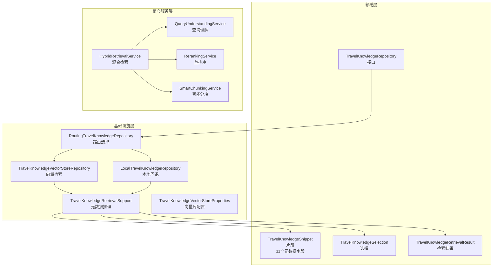
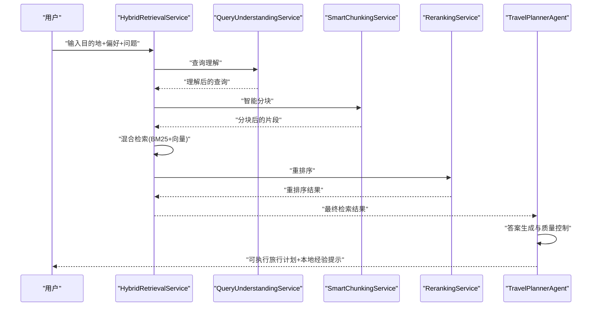
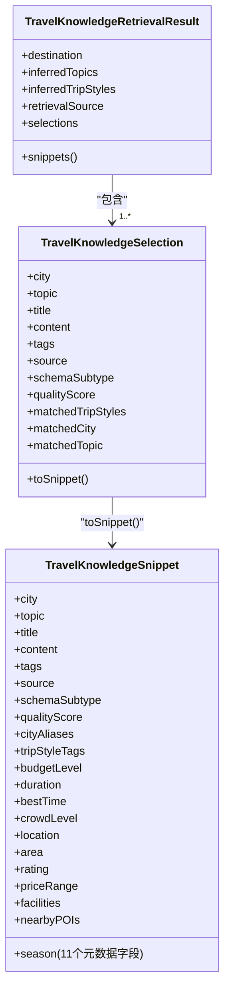
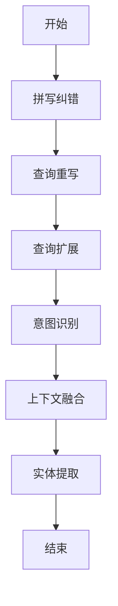
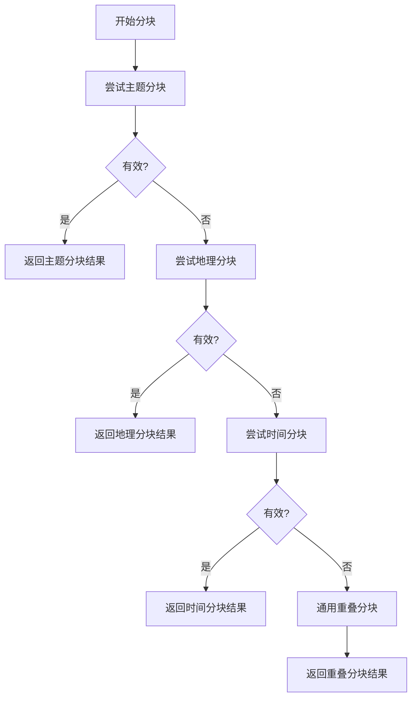
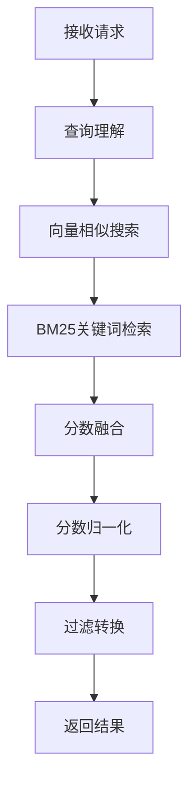
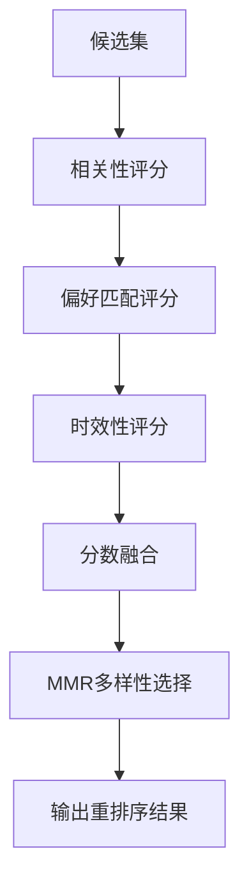
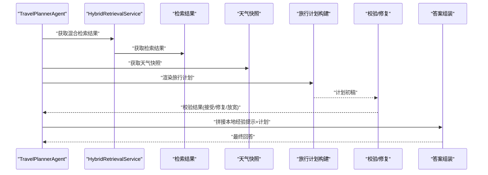
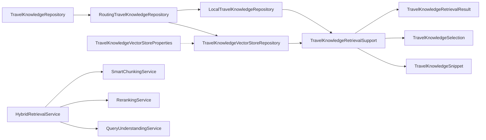

# RAG实现细节

<cite>
**本文引用的文件**
- [TravelKnowledgeRetrievalResult.java](file://travel-agent-domain/src/main/java/com/travalagent/domain/model/valobj/TravelKnowledgeRetrievalResult.java)
- [TravelKnowledgeSelection.java](file://travel-agent-domain/src/main/java/com/travalagent/domain/model/valobj/TravelKnowledgeSelection.java)
- [TravelKnowledgeSnippet.java](file://travel-agent-domain/src/main/java/com/travalagent/domain/model/valobj/TravelKnowledgeSnippet.java)
- [TravelKnowledgeRepository.java](file://travel-agent-domain/src/main/java/com/travalagent/domain/repository/TravelKnowledgeRepository.java)
- [TravelKnowledgeRetrievalSupport.java](file://travel-agent-infrastructure/src/main/java/com/travalagent/infrastructure/repository/TravelKnowledgeRetrievalSupport.java)
- [TravelKnowledgeVectorStoreRepository.java](file://travel-agent-infrastructure/src/main/java/com/travalagent/infrastructure/repository/TravelKnowledgeVectorStoreRepository.java)
- [LocalTravelKnowledgeRepository.java](file://travel-agent-infrastructure/src/main/java/com/travalagent/infrastructure/repository/LocalTravelKnowledgeRepository.java)
- [RoutingTravelKnowledgeRepository.java](file://travel-agent-infrastructure/src/main/java/com/travalagent/infrastructure/repository/RoutingTravelKnowledgeRepository.java)
- [TravelKnowledgeVectorStoreProperties.java](file://travel-agent-infrastructure/src/main/java/com/travalagent/infrastructure/config/TravelKnowledgeVectorStoreProperties.java)
- [TravelPlannerAgent.java](file://travel-agent-infrastructure/src/main/java/com/travalagent/infrastructure/gateway/llm/TravelPlannerAgent.java)
- [HybridRetrievalService.java](file://travel-agent-infrastructure/src/main/java/com/travalagent/infrastructure/repository/HybridRetrievalService.java)
- [QueryUnderstandingService.java](file://travel-agent-infrastructure/src/main/java/com/travalagent/infrastructure/repository/QueryUnderstandingService.java)
- [RerankingService.java](file://travel-agent-infrastructure/src/main/java/com/travalagent/infrastructure/repository/RerankingService.java)
- [SmartChunkingService.java](file://travel-agent-infrastructure/src/main/java/com/travalagent/infrastructure/repository/SmartChunkingService.java)
- [knowledge-rag.md](file://docs/knowledge-rag.md)
- [RAG_完成总结.md](file://docs/RAG_完成总结.md)
- [RAG_Phase1_完成报告.md](file://docs/RAG_Phase1_完成报告.md)
- [TravelKnowledgeVectorStoreRepositoryTest.java](file://travel-agent-infrastructure/src/test/java/com/travalagent/infrastructure/repository/TravelKnowledgeVectorStoreRepositoryTest.java)
- [QueryUnderstandingServiceTest.java](file://travel-agent-infrastructure/src/test/java/com/travalagent/infrastructure/repository/QueryUnderstandingServiceTest.java)
- [RerankingServiceTest.java](file://travel-agent-infrastructure/src/test/java/com/travalagent/infrastructure/repository/RerankingServiceTest.java)
- [SmartChunkingServiceTest.java](file://travel-agent-infrastructure/src/test/java/com/travalagent/infrastructure/repository/SmartChunkingServiceTest.java)
</cite>

## 更新摘要
**变更内容**
- 新增四个核心检索服务：HybridRetrievalService、QueryUnderstandingService、RerankingService、SmartChunkingService
- 完整的元数据推理系统实现，新增11个元数据字段
- RAG Phase 1完整实现，涵盖查询理解、混合检索、智能分块、重排序等全流程
- 增强的旅行知识片段数据结构，支持丰富的元数据信息

## 目录
1. [简介](#简介)
2. [项目结构](#项目结构)
3. [核心组件](#核心组件)
4. [架构总览](#架构总览)
5. [详细组件分析](#详细组件分析)
6. [依赖关系分析](#依赖关系分析)
7. [性能考虑](#性能考虑)
8. [故障排查指南](#故障排查指南)
9. [结论](#结论)
10. [附录](#附录)

## 简介
本文件系统性梳理旅行知识库的检索增强生成（RAG）实现，覆盖从查询理解、上下文检索、相关性排序到答案生成的完整流程。基于RAG Phase 1完整实现，新增四个核心检索服务（HybridRetrievalService、QueryUnderstandingService、RerankingService、SmartChunkingService），以及完整的元数据推理系统，显著增强了原有的RAG实现细节。重点解析数据结构设计（TravelKnowledgeRetrievalResult、TravelKnowledgeSelection、TravelKnowledgeSnippet），说明查询处理机制（意图识别、实体提取）、检索优化策略（语义相似度、过滤与边界处理、结果聚合），以及答案生成的质量控制方法，并提供实际调用示例与性能优化建议。

## 项目结构
RAG相关代码主要分布在领域层与基础设施层，现已扩展为包含五个核心服务的完整架构：
- 领域层定义值对象与仓库接口，统一检索结果与片段的结构化表达。
- 基础设施层实现具体检索逻辑，包含向量存储检索与本地回退两种路径，并通过路由仓库统一对外暴露。
- 新增四个核心服务：查询理解、混合检索、重排序、智能分块。

**图表来源**
- [TravelKnowledgeRetrievalResult.java:1-42](file://travel-agent-domain/src/main/java/com/travalagent/domain/model/valobj/TravelKnowledgeRetrievalResult.java#L1-L42)
- [TravelKnowledgeSelection.java:1-56](file://travel-agent-domain/src/main/java/com/travalagent/domain/model/valobj/TravelKnowledgeSelection.java#L1-L56)
- [TravelKnowledgeSnippet.java:1-83](file://travel-agent-domain/src/main/java/com/travalagent/domain/model/valobj/TravelKnowledgeSnippet.java#L1-L83)
- [TravelKnowledgeRepository.java:1-15](file://travel-agent-domain/src/main/java/com/travalagent/domain/repository/TravelKnowledgeRepository.java#L1-L15)
- [TravelKnowledgeRetrievalSupport.java:1-200](file://travel-agent-infrastructure/src/main/java/com/travalagent/infrastructure/repository/TravelKnowledgeRetrievalSupport.java#L1-L200)
- [TravelKnowledgeVectorStoreRepository.java:1-232](file://travel-agent-infrastructure/src/main/java/com/travalagent/infrastructure/repository/TravelKnowledgeVectorStoreRepository.java#L1-L232)
- [LocalTravelKnowledgeRepository.java:1-224](file://travel-agent-infrastructure/src/main/java/com/travalagent/infrastructure/repository/LocalTravelKnowledgeRepository.java#L1-L224)
- [RoutingTravelKnowledgeRepository.java:1-38](file://travel-agent-infrastructure/src/main/java/com/travalagent/infrastructure/repository/RoutingTravelKnowledgeRepository.java#L1-L38)
- [TravelKnowledgeVectorStoreProperties.java:1-54](file://travel-agent-infrastructure/src/main/java/com/travalagent/infrastructure/config/TravelKnowledgeVectorStoreProperties.java#L1-L54)
- [HybridRetrievalService.java:1-333](file://travel-agent-infrastructure/src/main/java/com/travalagent/infrastructure/repository/HybridRetrievalService.java#L1-L333)
- [QueryUnderstandingService.java:1-567](file://travel-agent-infrastructure/src/main/java/com/travalagent/infrastructure/repository/QueryUnderstandingService.java#L1-L567)
- [RerankingService.java:1-584](file://travel-agent-infrastructure/src/main/java/com/travalagent/infrastructure/repository/RerankingService.java#L1-L584)
- [SmartChunkingService.java:1-491](file://travel-agent-infrastructure/src/main/java/com/travalagent/infrastructure/repository/SmartChunkingService.java#L1-L491)

**章节来源**
- [knowledge-rag.md:67-137](file://docs/knowledge-rag.md#L67-L137)
- [RAG_完成总结.md:332-400](file://docs/RAG_完成总结.md#L332-L400)
- [RAG_Phase1_完成报告.md:25-66](file://docs/RAG_Phase1_完成报告.md#L25-L66)

## 核心组件
- 数据结构
  - TravelKnowledgeSnippet：最小知识单元，包含城市、主题、标题、内容、标签、来源等基础字段，以及新增的11个元数据字段（季节、预算等级、时长、最佳时间、拥挤度、位置、区域、评分、价格范围、设施、周边POI）。
  - TravelKnowledgeSelection：面向最终选择的上下文条目，扩展了匹配的主题、城市、质量分、旅行风格等信息。
  - TravelKnowledgeRetrievalResult：检索结果容器，封装目标地、推断主题、旅行风格、检索来源与选择列表。
- 仓库接口与实现
  - TravelKnowledgeRepository：统一检索入口，返回检索结果或片段列表。
  - RoutingTravelKnowledgeRepository：根据可用性在向量检索与本地回退之间路由。
  - TravelKnowledgeVectorStoreRepository：基于向量库的语义检索与过滤。
  - LocalTravelKnowledgeRepository：基于本地JSON数据的词法检索与评分。
- 核心服务组件
  - HybridRetrievalService：混合检索服务，结合BM25关键词检索和向量检索，支持权重融合。
  - QueryUnderstandingService：查询理解服务，提供拼写纠错、查询重写、意图识别、实体提取等功能。
  - RerankingService：重排序服务，基于交叉编码器相关性、用户偏好匹配、时效性加权和MMR多样性的多维度重排序。
  - SmartChunkingService：智能分块服务，提供按主题、地理位置、时间维度的智能分块策略。

**章节来源**
- [TravelKnowledgeRetrievalResult.java:5-41](file://travel-agent-domain/src/main/java/com/travalagent/domain/model/valobj/TravelKnowledgeRetrievalResult.java#L5-L41)
- [TravelKnowledgeSelection.java:5-55](file://travel-agent-domain/src/main/java/com/travalagent/domain/model/valobj/TravelKnowledgeSelection.java#L5-L55)
- [TravelKnowledgeSnippet.java:5-83](file://travel-agent-domain/src/main/java/com/travalagent/domain/model/valobj/TravelKnowledgeSnippet.java#L5-L83)
- [TravelKnowledgeRepository.java:8-15](file://travel-agent-domain/src/main/java/com/travalagent/domain/repository/TravelKnowledgeRepository.java#L8-L15)
- [RoutingTravelKnowledgeRepository.java:13-37](file://travel-agent-infrastructure/src/main/java/com/travalagent/infrastructure/repository/RoutingTravelKnowledgeRepository.java#L13-L37)
- [TravelKnowledgeVectorStoreRepository.java:30-99](file://travel-agent-infrastructure/src/main/java/com/travalagent/infrastructure/repository/TravelKnowledgeVectorStoreRepository.java#L30-L99)
- [LocalTravelKnowledgeRepository.java:23-68](file://travel-agent-infrastructure/src/main/java/com/travalagent/infrastructure/repository/LocalTravelKnowledgeRepository.java#L23-L68)
- [TravelKnowledgeRetrievalSupport.java:79-86](file://travel-agent-infrastructure/src/main/java/com/travalagent/infrastructure/repository/TravelKnowledgeRetrievalSupport.java#L79-L86)
- [HybridRetrievalService.java:14-41](file://travel-agent-infrastructure/src/main/java/com/travalagent/infrastructure/repository/HybridRetrievalService.java#L14-L41)
- [QueryUnderstandingService.java:8-17](file://travel-agent-infrastructure/src/main/java/com/travalagent/infrastructure/repository/QueryUnderstandingService.java#L8-L17)
- [RerankingService.java:8-17](file://travel-agent-infrastructure/src/main/java/com/travalagent/infrastructure/repository/RerankingService.java#L8-L17)
- [SmartChunkingService.java:10-19](file://travel-agent-infrastructure/src/main/java/com/travalagent/infrastructure/repository/SmartChunkingService.java#L10-L19)

## 架构总览
RAG工作流经过RAG Phase 1完整实现，现包含五个核心阶段："查询理解—智能分块—混合检索—重排序—答案生成"，贯穿于旅行计划生成Agent中。

**图表来源**
- [HybridRetrievalService.java:78-134](file://travel-agent-infrastructure/src/main/java/com/travalagent/infrastructure/repository/HybridRetrievalService.java#L78-L134)
- [QueryUnderstandingService.java:92-123](file://travel-agent-infrastructure/src/main/java/com/travalagent/infrastructure/repository/QueryUnderstandingService.java#L92-L123)
- [RerankingService.java:38-77](file://travel-agent-infrastructure/src/main/java/com/travalagent/infrastructure/repository/RerankingService.java#L38-L77)
- [SmartChunkingService.java:34-64](file://travel-agent-infrastructure/src/main/java/com/travalagent/infrastructure/repository/SmartChunkingService.java#L34-L64)
- [TravelPlannerAgent.java:199-217](file://travel-agent-infrastructure/src/main/java/com/travalagent/infrastructure/gateway/llm/TravelPlannerAgent.java#L199-L217)

## 详细组件分析

### 数据结构设计：增强的元数据推理系统
- TravelKnowledgeSnippet（增强版）
  - 基础字段：城市、主题、标题、内容、标签、来源、子类型、质量分、城市别名、旅行风格标签。
  - 新增11个元数据字段：season（适用季节）、budgetLevel（预算等级）、duration（建议时长）、bestTime（最佳时间）、crowdLevel（拥挤度）、location（具体位置）、area（所在区域）、rating（评分）、priceRange（价格范围）、facilities（设施标签）、nearbyPOIs（周边兴趣点）。
  - 向后兼容：支持多种构造函数，确保与现有代码的兼容性。
- TravelKnowledgeSelection
  - 字段：城市、主题、标题、内容、标签、来源、子类型、质量分、匹配旅行风格、匹配城市、匹配主题。
  - 行为：构造器与兼容构造；toSnippet用于从选择生成片段。
- TravelKnowledgeRetrievalResult
  - 字段：目标地、推断主题、旅行风格、检索来源、选择列表。
  - 行为：构造器复制不可变列表；提供空结果工厂方法；将选择转换为片段以便上层使用。

**图表来源**
- [TravelKnowledgeSnippet.java:5-83](file://travel-agent-domain/src/main/java/com/travalagent/domain/model/valobj/TravelKnowledgeSnippet.java#L5-L83)
- [TravelKnowledgeSelection.java:5-55](file://travel-agent-domain/src/main/java/com/travalagent/domain/model/valobj/TravelKnowledgeSelection.java#L5-L55)
- [TravelKnowledgeRetrievalResult.java:5-41](file://travel-agent-domain/src/main/java/com/travalagent/domain/model/valobj/TravelKnowledgeRetrievalResult.java#L5-L41)

**章节来源**
- [TravelKnowledgeSnippet.java:5-83](file://travel-agent-domain/src/main/java/com/travalagent/domain/model/valobj/TravelKnowledgeSnippet.java#L5-L83)
- [TravelKnowledgeSelection.java:5-55](file://travel-agent-domain/src/main/java/com/travalagent/domain/model/valobj/TravelKnowledgeSelection.java#L5-L55)
- [TravelKnowledgeRetrievalResult.java:5-41](file://travel-agent-domain/src/main/java/com/travalagent/domain/model/valobj/TravelKnowledgeRetrievalResult.java#L5-L41)

### 查询处理机制：智能查询理解
- 查询理解服务（QueryUnderstandingService）
  - 拼写纠错：基于常见错误映射表进行自动纠错。
  - 查询重写：标准化地名、时间表达、预算表达，移除冗余词汇。
  - 查询扩展：添加同义词、相关词，扩大查询覆盖面。
  - 意图识别：识别景点、酒店、美食、交通、购物、行程等六种意图。
  - 上下文融合：处理多轮对话，解析代词，补充缺失信息。
  - 实体提取：提取城市、时间、预算、旅行风格等关键实体。
- UnderstoodQuery记录类
  - 包含原始查询、重写查询、扩展查询列表、识别的意图列表、提取的实体映射。

**图表来源**
- [QueryUnderstandingService.java:92-123](file://travel-agent-infrastructure/src/main/java/com/travalagent/infrastructure/repository/QueryUnderstandingService.java#L92-L123)
- [QueryUnderstandingService.java:128-162](file://travel-agent-infrastructure/src/main/java/com/travalagent/infrastructure/repository/QueryUnderstandingService.java#L128-L162)
- [QueryUnderstandingService.java:262-286](file://travel-agent-infrastructure/src/main/java/com/travalagent/infrastructure/repository/QueryUnderstandingService.java#L262-L286)
- [QueryUnderstandingService.java:321-356](file://travel-agent-infrastructure/src/main/java/com/travalagent/infrastructure/repository/QueryUnderstandingService.java#L321-L356)
- [QueryUnderstandingService.java:361-458](file://travel-agent-infrastructure/src/main/java/com/travalagent/infrastructure/repository/QueryUnderstandingService.java#L361-L458)
- [QueryUnderstandingService.java:463-530](file://travel-agent-infrastructure/src/main/java/com/travalagent/infrastructure/repository/QueryUnderstandingService.java#L463-L530)

**章节来源**
- [QueryUnderstandingService.java:92-123](file://travel-agent-infrastructure/src/main/java/com/travalagent/infrastructure/repository/QueryUnderstandingService.java#L92-L123)
- [QueryUnderstandingService.java:128-162](file://travel-agent-infrastructure/src/main/java/com/travalagent/infrastructure/repository/QueryUnderstandingService.java#L128-L162)
- [QueryUnderstandingService.java:262-286](file://travel-agent-infrastructure/src/main/java/com/travalagent/infrastructure/repository/QueryUnderstandingService.java#L262-L286)
- [QueryUnderstandingService.java:321-356](file://travel-agent-infrastructure/src/main/java/com/travalagent/infrastructure/repository/QueryUnderstandingService.java#L321-L356)
- [QueryUnderstandingService.java:361-458](file://travel-agent-infrastructure/src/main/java/com/travalagent/infrastructure/repository/QueryUnderstandingService.java#L361-L458)
- [QueryUnderstandingService.java:463-530](file://travel-agent-infrastructure/src/main/java/com/travalagent/infrastructure/repository/QueryUnderstandingService.java#L463-L530)

### 智能分块策略：多维度内容组织
- 智能分块服务（SmartChunkingService）
  - 主题分块：识别景点、酒店、交通、美食、购物、娱乐等主题段落。
  - 地理分块：基于区域、地标、商圈等地理标识进行分块。
  - 时间分块：按春、夏、秋、冬等季节维度进行内容组织。
  - 重叠分块：15%重叠比例保持上下文连贯性。
  - 语义完整性：避免在句子中间切断，保持内容完整性。
- 分块策略选择
  - 优先尝试主题分块，其次地理分块，再次时间分块，最后使用通用重叠分块。
  - 验证分块有效性，确保每个块都有合理的大小和数量。

**图表来源**
- [SmartChunkingService.java:34-64](file://travel-agent-infrastructure/src/main/java/com/travalagent/infrastructure/repository/SmartChunkingService.java#L34-L64)
- [SmartChunkingService.java:106-150](file://travel-agent-infrastructure/src/main/java/com/travalagent/infrastructure/repository/SmartChunkingService.java#L106-L150)
- [SmartChunkingService.java:156-201](file://travel-agent-infrastructure/src/main/java/com/travalagent/infrastructure/repository/SmartChunkingService.java#L156-L201)
- [SmartChunkingService.java:207-273](file://travel-agent-infrastructure/src/main/java/com/travalagent/infrastructure/repository/SmartChunkingService.java#L207-L273)
- [SmartChunkingService.java:279-331](file://travel-agent-infrastructure/src/main/java/com/travalagent/infrastructure/repository/SmartChunkingService.java#L279-L331)

**章节来源**
- [SmartChunkingService.java:34-64](file://travel-agent-infrastructure/src/main/java/com/travalagent/infrastructure/repository/SmartChunkingService.java#L34-L64)
- [SmartChunkingService.java:106-150](file://travel-agent-infrastructure/src/main/java/com/travalagent/infrastructure/repository/SmartChunkingService.java#L106-L150)
- [SmartChunkingService.java:156-201](file://travel-agent-infrastructure/src/main/java/com/travalagent/infrastructure/repository/SmartChunkingService.java#L156-L201)
- [SmartChunkingService.java:207-273](file://travel-agent-infrastructure/src/main/java/com/travalagent/infrastructure/repository/SmartChunkingService.java#L207-L273)
- [SmartChunkingService.java:279-331](file://travel-agent-infrastructure/src/main/java/com/travalagent/infrastructure/repository/SmartChunkingService.java#L279-L331)

### 混合检索：BM25与向量检索融合
- 混合检索服务（HybridRetrievalService）
  - BM25关键词检索：精确匹配地名、专有名词，支持中英文分词。
  - 向量检索：语义相似度计算，TopK扩大策略提升召回。
  - 加权融合：0.4权重的BM25分数 + 0.6权重的向量分数。
  - 分数归一化：使用Min-Max归一化确保不同算法分数的可比性。
  - 过滤与转换：基于目的地和主题过滤，转换为片段格式。
- BM25算法实现
  - IDF计算：基于文档频率的逆文档频率。
  - TF-IDF：词频与逆文档频率的乘积。
  - 文档长度归一化：考虑平均文档长度的归一化因子。
  - 可配置参数：K1=1.5，B=0.75的BM25参数。

**图表来源**
- [HybridRetrievalService.java:52-134](file://travel-agent-infrastructure/src/main/java/com/travalagent/infrastructure/repository/HybridRetrievalService.java#L52-L134)
- [HybridRetrievalService.java:139-150](file://travel-agent-infrastructure/src/main/java/com/travalagent/infrastructure/repository/HybridRetrievalService.java#L139-L150)
- [HybridRetrievalService.java:155-221](file://travel-agent-infrastructure/src/main/java/com/travalagent/infrastructure/repository/HybridRetrievalService.java#L155-L221)
- [HybridRetrievalService.java:226-242](file://travel-agent-infrastructure/src/main/java/com/travalagent/infrastructure/repository/HybridRetrievalService.java#L226-L242)
- [HybridRetrievalService.java:247-271](file://travel-agent-infrastructure/src/main/java/com/travalagent/infrastructure/repository/HybridRetrievalService.java#L247-L271)

**章节来源**
- [HybridRetrievalService.java:52-134](file://travel-agent-infrastructure/src/main/java/com/travalagent/infrastructure/repository/HybridRetrievalService.java#L52-L134)
- [HybridRetrievalService.java:139-150](file://travel-agent-infrastructure/src/main/java/com/travalagent/infrastructure/repository/HybridRetrievalService.java#L139-L150)
- [HybridRetrievalService.java:155-221](file://travel-agent-infrastructure/src/main/java/com/travalagent/infrastructure/repository/HybridRetrievalService.java#L155-L221)
- [HybridRetrievalService.java:226-242](file://travel-agent-infrastructure/src/main/java/com/travalagent/infrastructure/repository/HybridRetrievalService.java#L226-L242)
- [HybridRetrievalService.java:247-271](file://travel-agent-infrastructure/src/main/java/com/travalagent/infrastructure/repository/HybridRetrievalService.java#L247-L271)

### 重排序：多维度质量控制
- 重排序服务（RerankingService）
  - 相关性评分：模拟Cross-Encoder相关性评分（标题40%、内容30%、标签15%、元数据15%）。
  - 用户偏好匹配：旅行风格、预算等级、设施、季节的匹配度评分。
  - 时效性加权：当前季节匹配、质量评分、评分的加权组合。
  - MMR多样性保证：最大化边际相关性，避免结果过于单一。
- 评分融合策略
  - 0.35权重的相关性、0.25权重的偏好匹配、0.20权重的时效性、0.20权重的MMR多样性。
  - MMR参数λ=0.7，在相关性和多样性之间取得平衡。

**图表来源**
- [RerankingService.java:38-77](file://travel-agent-infrastructure/src/main/java/com/travalagent/infrastructure/repository/RerankingService.java#L38-L77)
- [RerankingService.java:87-132](file://travel-agent-infrastructure/src/main/java/com/travalagent/infrastructure/repository/RerankingService.java#L87-L132)
- [RerankingService.java:225-308](file://travel-agent-infrastructure/src/main/java/com/travalagent/infrastructure/repository/RerankingService.java#L225-L308)
- [RerankingService.java:318-348](file://travel-agent-infrastructure/src/main/java/com/travalagent/infrastructure/repository/RerankingService.java#L318-L348)
- [RerankingService.java:362-423](file://travel-agent-infrastructure/src/main/java/com/travalagent/infrastructure/repository/RerankingService.java#L362-L423)

**章节来源**
- [RerankingService.java:38-77](file://travel-agent-infrastructure/src/main/java/com/travalagent/infrastructure/repository/RerankingService.java#L38-L77)
- [RerankingService.java:87-132](file://travel-agent-infrastructure/src/main/java/com/travalagent/infrastructure/repository/RerankingService.java#L87-L132)
- [RerankingService.java:225-308](file://travel-agent-infrastructure/src/main/java/com/travalagent/infrastructure/repository/RerankingService.java#L225-L308)
- [RerankingService.java:318-348](file://travel-agent-infrastructure/src/main/java/com/travalagent/infrastructure/repository/RerankingService.java#L318-L348)
- [RerankingService.java:362-423](file://travel-agent-infrastructure/src/main/java/com/travalagent/infrastructure/repository/RerankingService.java#L362-L423)

### 元数据推理系统：智能信息提取
- 元数据推理支持（TravelKnowledgeRetrievalSupport）
  - 季节推断：基于关键词匹配推断适用季节。
  - 预算等级推断：基于价格关键词推断预算水平。
  - 时长推断：基于时间表达和主题默认值推断建议时长。
  - 最佳时间推断：基于时间偏好检测最佳访问时间。
  - 拥挤度推断：基于热门/小众关键词推断拥挤程度。
  - 位置提取：基于地址模式提取具体位置。
  - 价格范围提取：基于正则表达式提取价格区间。
  - 设施提取：基于设施关键词匹配提取设施信息。
  - 周边POI提取：基于周边关键词提取周边兴趣点。
- 推断方法
  - 基于规则的关键词匹配。
  - 上下文相关的推断逻辑。
  - 多源信息融合的智能推断。

**章节来源**
- [TravelKnowledgeRetrievalSupport.java:97-168](file://travel-agent-infrastructure/src/main/java/com/travalagent/infrastructure/repository/TravelKnowledgeRetrievalSupport.java#L97-L168)
- [TravelKnowledgeRetrievalSupport.java:113-143](file://travel-agent-infrastructure/src/main/java/com/travalagent/infrastructure/repository/TravelKnowledgeRetrievalSupport.java#L113-L143)
- [TravelKnowledgeRetrievalSupport.java:279-302](file://travel-agent-infrastructure/src/main/java/com/travalagent/infrastructure/repository/TravelKnowledgeRetrievalSupport.java#L279-L302)
- [TravelKnowledgeRetrievalSupport.java:304-313](file://travel-agent-infrastructure/src/main/java/com/travalagent/infrastructure/repository/TravelKnowledgeRetrievalSupport.java#L304-L313)

### 答案生成的质量控制
- 旅行计划生成与校验
  - 旅行计划构建、Amap地点强化、约束校验与修复循环（严格模式与宽松模式）。
- 检索结果整合
  - 将天气快照与检索结果注入旅行计划，形成带"本地经验提示"的回答。
- 多语言与本地化
  - 根据用户消息语言切换中英文输出，本地化提示仅对中文内容生效。

**图表来源**
- [TravelPlannerAgent.java:66-137](file://travel-agent-infrastructure/src/main/java/com/travalagent/infrastructure/gateway/llm/TravelPlannerAgent.java#L66-L137)
- [TravelPlannerAgent.java:199-230](file://travel-agent-infrastructure/src/main/java/com/travalagent/infrastructure/gateway/llm/TravelPlannerAgent.java#L199-L230)
- [TravelPlannerAgent.java:232-329](file://travel-agent-infrastructure/src/main/java/com/travalagent/infrastructure/gateway/llm/TravelPlannerAgent.java#L232-L329)

**章节来源**
- [TravelPlannerAgent.java:66-137](file://travel-agent-infrastructure/src/main/java/com/travalagent/infrastructure/gateway/llm/TravelPlannerAgent.java#L66-L137)
- [TravelPlannerAgent.java:199-230](file://travel-agent-infrastructure/src/main/java/com/travalagent/infrastructure/gateway/llm/TravelPlannerAgent.java#L199-L230)
- [TravelPlannerAgent.java:232-329](file://travel-agent-infrastructure/src/main/java/com/travalagent/infrastructure/gateway/llm/TravelPlannerAgent.java#L232-L329)

## 依赖关系分析
- 组件耦合
  - HybridRetrievalService作为核心协调者，依赖QueryUnderstandingService、RerankingService、SmartChunkingService。
  - RoutingRepository在运行时动态选择向量或本地实现，降低耦合。
  - RetrievalSupport集中处理查询规划与结果构建，提升复用性。
- 外部依赖
  - 向量库Milvus与嵌入模型通过配置类注入，便于启用/禁用。
- 循环依赖
  - 未发现直接循环依赖；各模块职责清晰。

**图表来源**
- [RoutingTravelKnowledgeRepository.java:18-24](file://travel-agent-infrastructure/src/main/java/com/travalagent/infrastructure/repository/RoutingTravelKnowledgeRepository.java#L18-L24)
- [TravelKnowledgeVectorStoreRepository.java:37-46](file://travel-agent-infrastructure/src/main/java/com/travalagent/infrastructure/repository/TravelKnowledgeVectorStoreRepository.java#L37-L46)
- [TravelKnowledgeRetrievalSupport.java:17-17](file://travel-agent-infrastructure/src/main/java/com/travalagent/infrastructure/repository/TravelKnowledgeRetrievalSupport.java#L17-L17)
- [TravelKnowledgeVectorStoreProperties.java:5-54](file://travel-agent-infrastructure/src/main/java/com/travalagent/infrastructure/config/TravelKnowledgeVectorStoreProperties.java#L5-L54)
- [HybridRetrievalService.java:25-41](file://travel-agent-infrastructure/src/main/java/com/travalagent/infrastructure/repository/HybridRetrievalService.java#L25-L41)

**章节来源**
- [RoutingTravelKnowledgeRepository.java:18-24](file://travel-agent-infrastructure/src/main/java/com/travalagent/infrastructure/repository/RoutingTravelKnowledgeRepository.java#L18-L24)
- [TravelKnowledgeVectorStoreRepository.java:37-46](file://travel-agent-infrastructure/src/main/java/com/travalagent/infrastructure/repository/TravelKnowledgeVectorStoreRepository.java#L37-L46)
- [TravelKnowledgeRetrievalSupport.java:17-17](file://travel-agent-infrastructure/src/main/java/com/travalagent/infrastructure/repository/TravelKnowledgeRetrievalSupport.java#L17-L17)
- [TravelKnowledgeVectorStoreProperties.java:5-54](file://travel-agent-infrastructure/src/main/java/com/travalagent/infrastructure/config/TravelKnowledgeVectorStoreProperties.java#L5-L54)
- [HybridRetrievalService.java:25-41](file://travel-agent-infrastructure/src/main/java/com/travalagent/infrastructure/repository/HybridRetrievalService.java#L25-L41)

## 性能考虑
- 混合检索
  - TopK放大策略：limit * 6（最小18），提升召回，后续再严格筛选。
  - 结构化过滤：提前限制city与topic，减少无效向量计算。
  - 元数据丰富：将城市别名、旅行风格标签等纳入过滤与排序权重。
- 查询理解
  - 批量处理支持：支持批量查询理解，提升处理效率。
  - 缓存机制：可扩展的缓存策略减少重复计算。
- 智能分块
  - 多策略选择：根据内容特征自动选择最优分块策略。
  - 重叠比例优化：15%重叠比例在上下文保持和存储效率间取得平衡。
- 重排序
  - MMR算法：最大化边际相关性，避免结果过于单一。
  - 权重调优：支持权重配置，适应不同场景需求。
- 元数据推理
  - 规则优化：基于高频关键词的规则优化，提升推断准确率。
  - 批量处理：支持批量元数据推理，提升整体性能。

**章节来源**
- [HybridRetrievalService.java:74-82](file://travel-agent-infrastructure/src/main/java/com/travalagent/infrastructure/repository/HybridRetrievalService.java#L74-L82)
- [SmartChunkingService.java:22-27](file://travel-agent-infrastructure/src/main/java/com/travalagent/infrastructure/repository/SmartChunkingService.java#L22-L27)
- [RerankingService.java:20-28](file://travel-agent-infrastructure/src/main/java/com/travalagent/infrastructure/repository/RerankingService.java#L20-L28)
- [QueryUnderstandingService.java:556-566](file://travel-agent-infrastructure/src/main/java/com/travalagent/infrastructure/repository/QueryUnderstandingService.java#L556-L566)

## 故障排查指南
- 向量库不可用
  - 现象：路由回退到本地检索。
  - 排查：确认Milvus连接参数、嵌入模型配置、集合初始化状态。
- 检索结果为空
  - 现象：返回空结果或少量结果。
  - 排查：检查目的地归一化、主题推断是否合理；确认过滤表达式是否过于严格。
- 查询理解失败
  - 现象：查询理解结果异常或为空。
  - 排查：检查拼写纠错映射表、意图识别关键词、实体提取正则表达式。
- 分块策略失效
  - 现象：分块结果不合理或分块数量不足。
  - 排查：检查分块策略匹配规则、重叠比例设置、内容长度阈值。
- 重排序异常
  - 现象：重排序结果不符合预期。
  - 排查：检查权重配置、MMR参数设置、相似度计算逻辑。
- 元数据推断错误
  - 现象：元数据推断结果不准确。
  - 排查：检查关键词匹配规则、上下文推断逻辑、推断优先级。
- 测试验证
  - 参考测试用例：向量检索映射文档到片段、构建过滤表达式、TopK放大策略。
  - 查询理解测试：拼写纠错、意图识别、实体提取、上下文融合。
  - 重排序测试：偏好匹配、季节偏好、MMR多样性。
  - 分块测试：主题分块、地理分块、时间分块、重叠分块。

**章节来源**
- [TravelKnowledgeVectorStoreRepositoryTest.java:55-91](file://travel-agent-infrastructure/src/test/java/com/travalagent/infrastructure/repository/TravelKnowledgeVectorStoreRepositoryTest.java#L55-L91)
- [QueryUnderstandingServiceTest.java:17-137](file://travel-agent-infrastructure/src/test/java/com/travalagent/infrastructure/repository/QueryUnderstandingServiceTest.java#L17-L137)
- [RerankingServiceTest.java:18-113](file://travel-agent-infrastructure/src/test/java/com/travalagent/infrastructure/repository/RerankingServiceTest.java#L18-L113)
- [SmartChunkingServiceTest.java:18-188](file://travel-agent-infrastructure/src/test/java/com/travalagent/infrastructure/repository/SmartChunkingServiceTest.java#L18-L188)

## 结论
RAG Phase 1完整实现通过"查询理解—智能分块—混合检索—重排序—答案生成"的完整闭环，实现了旅行知识的高召回与高质量整合。新增的四个核心检索服务（HybridRetrievalService、QueryUnderstandingService、RerankingService、SmartChunkingService）以及完整的元数据推理系统，显著提升了检索质量和用户体验。数据结构清晰、检索支持集中、路由策略灵活，既保证了性能也兼顾了准确性。后续可在专用schema、细粒度分块与过滤扩展方面持续优化。

## 附录
- 实际调用示例（步骤说明）
  - 步骤1：调用混合检索服务 hybridSearch(destination, preferences, query, limit)
  - 步骤2：在旅行计划Agent中获取检索结果与天气快照
  - 步骤3：渲染旅行计划并拼接本地经验提示
  - 步骤4：返回最终回答
- 性能优化建议
  - 向量库：适当增大TopK倍数与索引参数，平衡召回与延迟。
  - 过滤：扩展城市别名与来源字段的结构化过滤。
  - 分片：对长列表项进行摘要式子分块，提升定位精度。
  - 主题：增强偏好归一化，提升主题召回。
  - 查询理解：扩展同义词词典，提升意图识别准确率。
  - 重排序：调优权重参数，适应不同用户群体偏好。
  - 元数据：引入机器学习模型，提升元数据推断准确率。

**章节来源**
- [TravelPlannerAgent.java:199-230](file://travel-agent-infrastructure/src/main/java/com/travalagent/infrastructure/gateway/llm/TravelPlannerAgent.java#L199-L230)
- [RAG_完成总结.md:332-400](file://docs/RAG_完成总结.md#L332-L400)
- [RAG_Phase1_完成报告.md:388-423](file://docs/RAG_Phase1_完成报告.md#L388-L423)